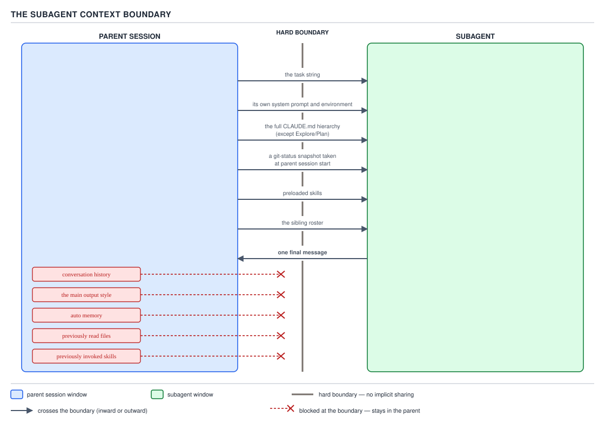
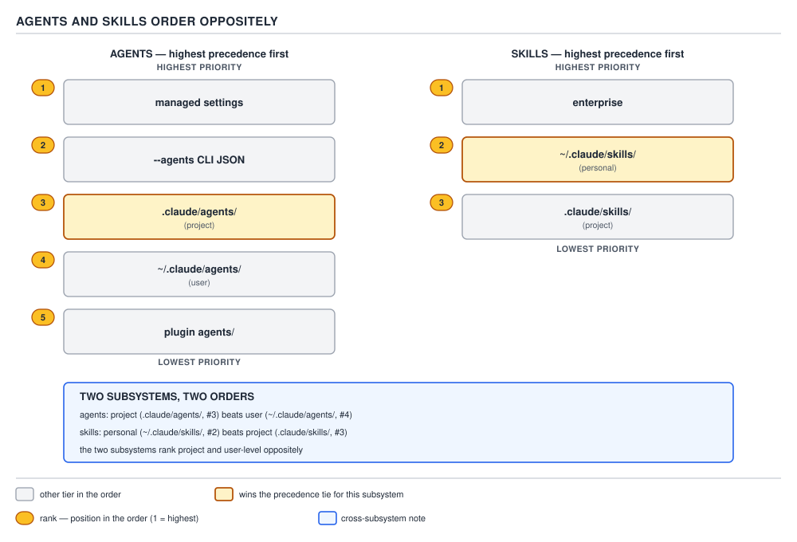
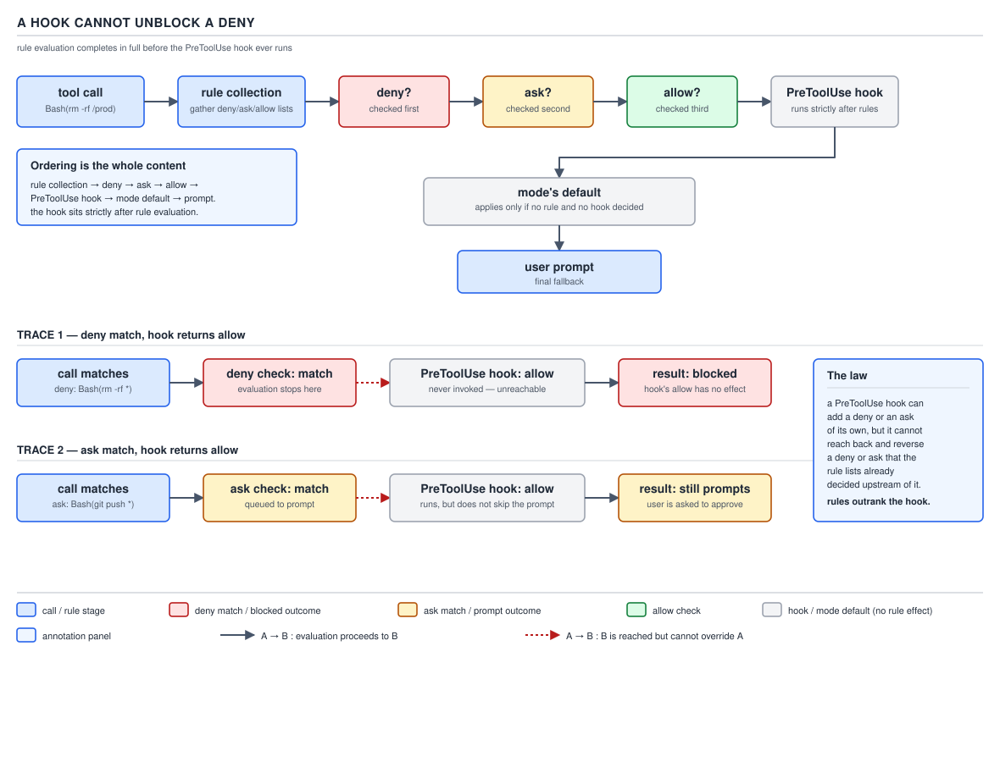
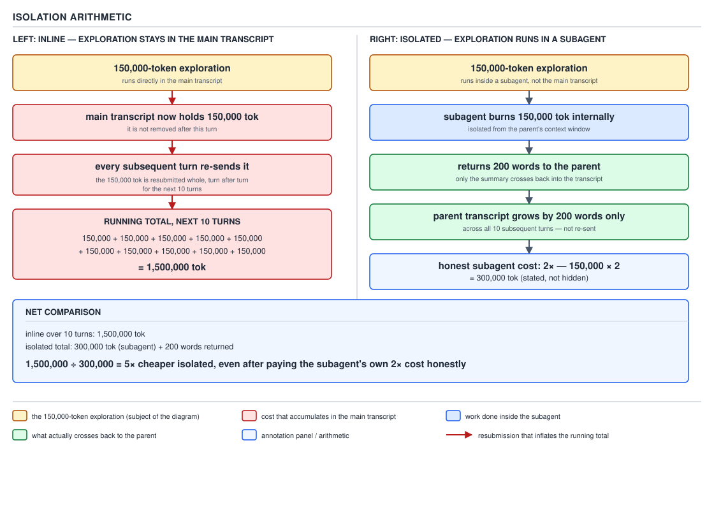
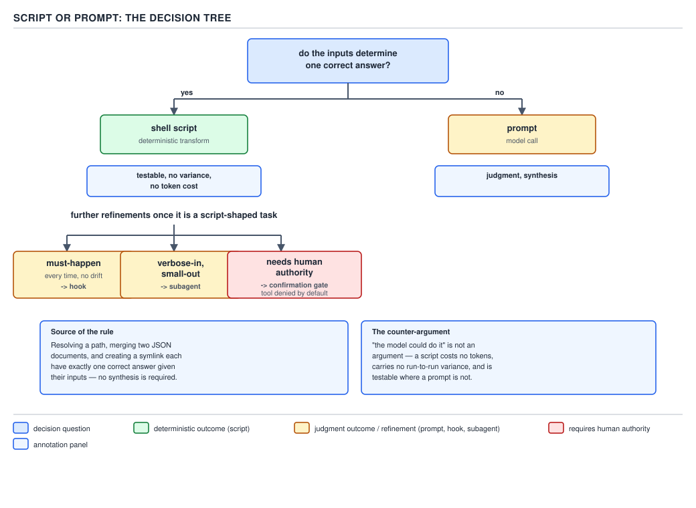

# 21 AI for Coding — PART 2 — the interview wrap-up (§2.1–§2.9)

**Target version: Claude Code v2.1.2xx (August 2026).** | **Part 2 of 6** | [Index](00-index.md)
Previous: [secrets, attribution and review capacity](governance/03-secrets-attribution-review.md) · Next: [request assembly](request-assembly/03-internals-a-assembly-order.md)

This file closes PART 2. Every leaf in §2.1–§2.9 already has a home in one of the nine subject
folders (`subagents/`, `personas/`, `hooks/`, `mcp-and-lsp/`, `plugins/`, `context-economy/`,
`practices/`, `deterministic-vs-agentic/`, `governance/`). What follows is the night-before pass: the
numbers and traps on one screen, eighteen answers at speaking length, and five configurations to read
cold.

## Summary table

### Subagents (§2.1)

| Mechanism | Number | Trap |
|---|---|---|
| Separate context window: task string in, one message out | — | Nothing else crosses — no conversation history, no auto memory, no previously read files |
| Definition precedence | managed → `--agents` CLI → project → user → plugin | Project beats user; for **skills** it is the opposite |
| Startup load | own prompt+env, task message, `CLAUDE.md`, git-status snapshot, preloaded skills, sibling roster | Git snapshot is taken at **parent session start**, never refreshed |
| Cost model | ~2× a single dispatch, 3–4× a team | Fixed dispatch tax; doesn't shrink for a small task |
| Concurrency / nesting | 20 concurrent, depth 3 default | At the nesting limit, `Agent` is withheld outright |
| Withheld tools | `AskUserQuestion`, `EndConversation`, `EnterPlanMode`, `Workflow` (+ more) | Cannot pause and ask the user — must return the question in its final message |
| Fork mode | on by default, interactive sessions | Makes **background** the default dispatch mode — inverts the usual folklore |
| Boundary vs enforcement | `calibrator.md` has no `tools:` field | Its "no Jira tool" line is prose, not a config restriction |

### Personas (§2.2)

| Mechanism | Number | Trap |
|---|---|---|
| `--agent <name>` | replaces prompt, model, tools | Parity mechanism for an auto-spawned subagent |
| `--append-system-prompt` | appends only | Default persona and full tool set are still present |
| `--system-prompt`/`-file` | replaces text only | Model and tools untouched, unlike `--agent` |
| `--append-subagent-system-prompt` | every subagent, `-p` only, v2.1.205+ | Forks excluded |
| `load_agent_prompt()` | strips frontmatter before appending | Anchored, non-greedy, `DOTALL` — else YAML leaks in as noise |

### Hooks (§2.3)

| Mechanism | Number | Trap |
|---|---|---|
| Handler types | 5: `command`, `http`, `mcp_tool`, `prompt`, `agent` | Last two put a model back in the enforcement path |
| Event catalogue | 33 events, v2.1.2xx | `PreModelSwitch`/`PostModelSwitch` are the newest — older material says 32 |
| Exit codes | `0` success, `2` blocks, else non-blocking | Exit `1` does **not** block, despite Unix convention |
| Exit-0 stdout shown to model | 4 events: `UserPromptSubmit`, `UserPromptExpansion`, `SessionStart`, `PostModelSwitch` | Elsewhere, debug log only |
| Exit `2` vs JSON | exit `2` wins unconditionally | Overrides JSON `permissionDecision: "allow"` |
| Hook vs rule ordering | narrows, never widens | Cannot turn a matching `deny`/`ask` into a proceed |
| Config sources | 6–7: settings (user/project/local/managed), plugin `hooks.json`, skill frontmatter, subagent frontmatter | Skill/subagent hooks aren't files — session-scoped or run-scoped |
| `SessionStart` reindex incident | 100+ GB abandoned indexes | Recovery attempt (a new session) *was* the trigger for the next pile-up |

### MCP and LSP (§2.4)

| Mechanism | Number | Trap |
|---|---|---|
| Transports | `stdio` (local), `http` (current remote), `sse` (legacy) | — |
| Tool naming | `mcp__<server>__<tool>` | A rule with parentheses is silently skipped |
| Per-turn schema tax | example: 4,800 → 7,900 tok/turn | Recurs every turn while connected; measure with `/context`, remove with `claude mcp remove` |
| `enabledMcpjsonServers` | gates project `.mcp.json` only | Says nothing about `local`/`user`-scope registrations |
| LSP vs read-and-grep | example: 18,400 vs 900 tok, ≈20× | Loses on unconfigured languages, literal string/comment search |

### Plugins and marketplaces (§2.5)

| Mechanism | Number | Trap |
|---|---|---|
| `.claude-plugin/` contents | `plugin.json` only | `skills/`/`agents/` inside it ship nothing, no error |
| Update gate | `version` bump | Command sources are the exception |
| `${CLAUDE_PLUGIN_ROOT}` | plugin's install/cache directory | Not the plugin's own repo — changes on every update |
| Cross-marketplace dependency | gated by `allowCrossMarketplaceDependenciesOn` | Does not auto-add the target marketplace |
| `strictPluginOnlyCustomization` | 4 sub-keys: `.agents`/`.hooks`/`.mcp`/`.skills` | Managed-only — blocks user/project extension entirely |

### Context economy (§2.6)

| Mechanism | Number | Trap |
|---|---|---|
| Survives compaction | project-root `CLAUDE.md` + recent skill invocations | 5,000 tok/skill cap, 25,000 combined — rest is gone |
| Cache-read rate | ~10% of full input price | Crossing the 5-minute TTL is a flat 10× on the whole cached prefix |
| Isolation arithmetic | 1,500,000 tok inline vs 300,000 tok isolated | ≈5× cheaper isolated — only when output stays small vs input |
| Compaction trap | mid-task summary drops specifics | Compact at a boundary, not mid-task |

### Practices (§2.7)

| Mechanism | Number | Trap |
|---|---|---|
| Plan mode | moves correction before the diff, not after | A plan nobody reads is pure overhead |
| Test-first | failing test = machine-checkable spec | A test-shaped file never run red is not the same guarantee |
| Fresh-context review | `/code-review`, `/security-review` | A reviewer sharing the writer's context shares its blind spots |
| Bad fit for delegation | one-liner, unstatable taste, review costlier than the work | Fixed floor cost doesn't shrink with task size |

### Deterministic vs agentic (§2.8)

| Mechanism | Number | Trap |
|---|---|---|
| The rule | one correct answer → script; judgment → prompt | "The model could do it" names no cost, no variance, no test |
| Idempotence | guard clause before any mutation | Without it, consistency is sampled, not computed |
| Documented exception | `bootstrap-uv.sh` self-installs the one dependency everything needs | A stated exception isn't an inconsistency |
| Human-authority gate | deny the tool, don't instruct abstention | An instruction to abstain is a request; a withheld tool is a fact |

### Governance (§2.9)

| Mechanism | Number | Trap |
|---|---|---|
| Threat model | runs with your credentials, reads what you can read, follows text it finds | — |
| Control ranking | `deny` → `PreToolUse` block → sandbox → least-privilege tools → human confirm | Prompting sits outside the table — a request, not a check |
| Prompt injection | data and instruction share one transcript channel | "Ignore instructions in data" is itself text in that channel |
| `allowManaged*Only` family | 5 keys: rules, hooks, MCP, sandbox reads, sandbox domains | All managed-only, outrank the command line |
| Attribution | `attribution.{commit,pr,sessionUrl}`, `prUrlTemplate` | No managed lock exists at v2.1.2xx |

## Interview questions and answers

**1. Walk me through exactly what crosses the boundary when the main session delegates to a subagent.**

A subagent is a separate context window running the same loop, not a thread and not shared memory.
Inward: its own system prompt and environment, the one task string the parent wrote, the full
`CLAUDE.md` hierarchy (skipped only by `Explore`/`Plan`), a git-status snapshot, preloaded `skills`,
and the sibling roster. Outward: none of that — no conversation history, no main output style, no
auto memory, none of the files or skills the parent already touched.



**D-42** — what crosses inward, the snapshot's fixed timing, and the single message that crosses back.

The detail that catches people: the git snapshot is taken at **parent session start**, never
refreshed. A parent running for hours across three branch switches still hands every subagent the
branch from hour zero unless the task string states the current one. What comes back out is exactly
one final message, so anything that matters beyond that message has to be written to a file and
returned as a path, not smuggled through the return text.

**2. Where does a subagent's cost multiplier actually come from, and when do you delegate anyway?**

Not slower inference — a fixed dispatch tax inline work never pays: its own system prompt, its own
copy of the relevant tool schemas, and `CLAUDE.md`, before a token of real work happens. Worked
example: roughly 4,800 tokens of tax (2,000 + 1,200 + 1,300 + 300), which pushes the marginal cost
against doing the same thing inline to close to 2×. Chain several agents into a team and it climbs to
3–4×, since every member pays the tax once and the lead absorbs coordination messages too.

It still wins when the shape is verbose-in, small-out: grep a hundred files, read the relevant ten,
report the two that matter. Inline, all hundred files' noise sits in the transcript and is re-sent
every future turn. Delegated, a subagent might burn 150,000 tokens internally and return a couple
hundred words. Isolation wins exactly when that ratio is lopsided; it loses on small tasks where the
fixed tax outweighs the work.

**3. Agents and skills are both precedence chains — do they resolve the same way?**

No, and it's a clean gotcha. **Subagent definitions**, highest to lowest: managed settings,
`--agents` CLI JSON, project `.claude/agents/`, user `~/.claude/agents/`, plugin `agents/` — project
beats user. **Skills**: enterprise, personal `~/.claude/skills/`, project `.claude/skills/` — personal
beats project, the inverse.



**D-43** — same-shaped chains, opposite winner at the project/user boundary.

There's no unifying principle — two subsystems make two different calls. Override a subagent at
project scope expecting it to behave like an overridden skill, or vice versa, and you get the wrong
file loaded with no error to explain why.

**4. What's the actual difference between `--agent` and `--append-system-prompt`?**

`--agent <name>` loads a registered definition wholesale — prompt, model, and tool allowlist all
replace the default. It's the parity mechanism for giving a manual session the same shape as an
auto-spawned subagent. `--append-system-prompt` only appends text onto the default prompt, which
stays fully present; model and tools are untouched.

The symptom of confusing them: someone wants a locked-down reviewer, describes the restriction in
prose via `--append-system-prompt`, and gets an agent that talks like a reviewer but still has every
default tool, because nothing was ever removed. The source code that documents this calls `--agent`
"the parity mechanism for an auto-spawned subagent, not `--append-system-prompt`, which only appends
to the default prompt" — worth having verbatim.

**5. Why do people say a hook is the only real guarantee in this system?**

Everything else — a system prompt, a `CLAUDE.md` line, a firmly worded task string — is text the
model conditions on and might not follow, since it samples from a distribution rather than executing
a program. A hook is different in kind: a command the harness itself runs at a lifecycle event, with
no vote from the model. "Always format after an edit" in `CLAUDE.md` is a request; a `PostToolUse`
hook on `Write|Edit` that shells out to the formatter happens every time regardless.

That's the line between an instruction and a guarantee: an instruction competes for attention against
everything else in the context window; a guarantee is code executed outside the model's control.
Anywhere the requirement is "must happen, no exceptions," the answer is a hook, never a firmer
instruction.

**6. Can a hook unblock something a permission rule already denied?**

No — a hook can only narrow, never widen. A matching `deny` blocks the call regardless of what a
`PreToolUse` hook returns, even a JSON `"permissionDecision": "allow"`. A matching `ask` still prompts
whatever the hook decided. A hook can only add restriction on top of what the rules already permitted.



**D-53** — deny beats hook allow; hook block beats rule allow; the arrow only ever points toward more restriction.

Rules and hooks sit on different sides of the same gate: the rules are the floor of what's
structurally impossible, and a hook is a filter layered on top of whatever the floor already let
through. A filter can remove more from what passes; it can't restore what the floor already stopped.

**7. Exit code 2 from a hook — what does it override, and where does that surprise people?**

Exit code 2 blocks without needing any JSON at all, and it's the only nonzero code with that power —
anything else, including exit 1, is non-blocking despite Unix convention. It beats even a hook's own
JSON: if the process exits 2 while also printing `"permissionDecision": "allow"`, the exit code wins
unconditionally, and the JSON only supplies the reason text.

That matters whenever a script's JSON-generation path and its exit-code path can drift apart — a bug
that leaves them inconsistent produces a hook that says "allow" in its output while still blocking the
call, which reads as inexplicable until you know the exit code is checked first and wins outright.

**8. Tell me about the `SessionStart` reindex incident — what broke, what did it cost, what's the law?**

A `SessionStart` hook pulled handbook clones and delta-reindexed a RAG store on every session start,
with no cross-session coordination. Every concurrent session independently decided a reindex was due,
producing hundreds of concurrent embedder processes and over 100 GB of abandoned partial indexes
before the machines became unusable.

The part worth remembering: it was unrecoverable through the obvious path, because starting a new
session to investigate *was itself* the trigger for the next round of the same unlocked decision. The
law: anything expensive or stateful on `SessionStart` needs a lock, because `SessionStart` is the one
event an operator cannot avoid triggering while diagnosing something that's already gone wrong on it.

**9. What's the token cost of a connected MCP server, and how do you measure it?**

Every connected server's tool schemas become part of what's sent on every turn, not just turns that
call one of its tools — a chatty server is a permanent recurring tax. Measured example: connecting one
server moved the per-turn baseline from ~4,800 to ~7,900 tokens, a ~3,100-token delta per turn, which
over 30 taxed turns in a 40-turn session adds roughly 93,000 tokens.

Measure it with `/context` before and after connecting; the delta is the tax. The fix if it's
disproportionate isn't a deny rule — denying a tool still lets the model see its schema, since `deny`
is enforced after the schema is already sent — it's `claude mcp remove <name>`, the only thing that
actually removes the standing cost.

**10. What is `${CLAUDE_PLUGIN_ROOT}`, and why does assuming it's the repository break things?**

It resolves to the plugin's own install/cache directory on the running machine — not the git
repository the plugin was authored in, and not the user's project either — and it changes on every
plugin update. This is the most common porting bug: a hook script tested inside a repo, where a
relative `dirname "$0"/../.."` walk happily reaches the repo root, breaks the moment it ships as a
plugin, because that same walk now lands inside the install cache.

The fix: never assume a path relationship between install location and target repo. Resolve the
project root independently — `git rev-parse --show-toplevel`, optionally overridden by an explicit
env var — and if neither resolves, **refuse clearly** rather than guessing with a third fallback. A
wrong silent guess is worse than a hook that stops and says why.

**11. What does `strictPluginOnlyCustomization` do, and why would an org turn it on?**

A managed-only key that blocks skills, agents, hooks, and MCP servers from user- or project-scope
sources — the channels an individual engineer would normally use. Four sub-keys, one per channel
(`.agents`, `.hooks`, `.mcp`, `.skills`), so a partial rollout is possible.

What the org buys: the only way to extend the agent becomes a reviewed, versioned plugin with a
pinned version and an atomic rollback path. Without it, any engineer can drop a hook or skill in
locally with no review trail at all — the same instinct as locking down who can install a browser
extension fleet-wide, priced against ungoverned proliferation rather than the capability itself.

**12. Give me the isolation arithmetic — why does paying a cost twice beat paying less every turn?**

Take a task needing 150,000 tokens of investigation to produce a couple hundred words of answer.
Inline, all 150,000 tokens land in the transcript and get re-sent on every subsequent turn — across
ten more turns that's up to 1.5 million tokens billed for something only useful for a moment.

Isolated into a subagent, the parent pays a bounded cost: the dispatch tax plus roughly that 150,000
tokens doubled for input and output inside the subagent — about 300,000 tokens total — and only the
short summary re-enters the parent's transcript.



**D-63** — 1,500,000 tokens inline over ten turns vs. 300,000 isolated — roughly 5× cheaper isolated.

Doubling a cost paid once beats paying a fraction of it every remaining turn, because the context
window is the argument list re-sent every call. It pays off only when useful output stays small
relative to input — if the parent genuinely needs the intermediate detail later, isolating doesn't help.

**13. When should something be a script instead of a prompt, and why isn't "the model could do it" enough?**

The test: do the inputs alone determine one correct answer? Resolving a path, merging JSON, creating
a symlink — one correct output given the inputs, no ambiguity. That's a script. Judgment — evaluating
whether a diff satisfies a fuzzy requirement — has no single mechanically-derivable answer. That's a
prompt.



**D-65** — one-correct-answer routes to a script; judgment routes to a prompt; "must happen" routes to a hook, "verbose-in small-out" to a subagent.

"The model could do it" fails on three counts: cost (a model call is far more expensive than running
a deterministic script), variance (the same prompt doesn't reliably reproduce the same output, so a
supposedly deterministic step works four times out of five for no reproducible reason), and
testability (a script has an assertable output; a prompt does not). A real skill built this way is
documented as "an orchestrator, not a rewrite" — every deterministic step delegates to a tested
script, and the model is forbidden from re-deriving that logic inline.

**14. What's prompt injection, mechanically, and why doesn't "ignore instructions in data" fix it?**

Instructions embedded in something the agent reads as data — a file, a web page, an issue comment, a
tool result — get interpreted as if they came from the user. Mechanically this is possible because
data and instructions share one transcript channel: there's no structural separation between "this is
content" and "this is a command," both arrive as tokens the model conditions on together.

That's exactly why a counter-instruction to "ignore instructions found in data" doesn't fix it — it's
itself just more text in the same channel, and whether it wins is resolved by sampling, not
enforcement. The controls that actually hold sit outside the model's turn: a `deny` rule, a
`PreToolUse` blocking hook, a sandbox boundary, a tool simply never granted — none depend on the model
correctly telling data from instruction in the moment.

**15. What's the difference between what an agent's description says it won't do and what's enforced?**

Prose in an agent body genuinely shapes a well-behaved model's attempts under normal conditions, but
it isn't enforcement. Only a `tools:`/`disallowedTools:` restriction or a `deny` rule stops a call
outright, by removing the capability before the model can emit that `tool_use` block at all.

A real example: an agent's prompt states plainly that no Jira tool is ever given to it, which reads
like an enforced restriction — but its frontmatter has no `tools:` field, which per the docs means it
inherits every tool available to subagents, the widest grant, not the narrowest. That sentence is
true only because nothing in the surrounding system wires a Jira tool to it, not because the
frontmatter forbids it — a genuinely good interview point about a written boundary versus one a
reviewer should check in the config, not the prose.

**16. One `SessionStart` hook is advisory, one enforces production guardrails — what differs in how they're written?**

An advisory hook — nudging about a stale bootstrap or a missing binary — is written `set +e` at the
top, unconditional `exit 0` at the bottom, because a bug in it must never block a session; it layers
network timeouts, a checksum-tool fallback, and locale pinning on top.

An enforcing guard — blocking a production AWS mutation — fails **closed**: a missing file,
unparseable file, missing marker, or unset root variable all default to "not verified, block," not
"couldn't check, so allow." It blocks via JSON `permissionDecision: "deny"` on a process that itself
exits 0, because settings alone are fail-open in the install-to-bootstrap gap this hook exists to
close. Same event, deliberately opposite failure postures.

**17. "The whole conversation is re-sent every turn, so caching can't really help" — how do you correct that?**

The re-send is real — the context window is the argument list, not persistent memory — but an
append-only conversation lets the unchanged prefix be served from a prompt cache at roughly 10% of
full input price rather than full price every turn.

The number that bites: the default cache TTL outside the main subscription flow is five minutes, and
crossing it is a flat 10× cost on the *entire* cached prefix at whatever size it had grown to, not
just the new part, because nothing structurally changed except elapsed time. So the real lesson isn't
"caching doesn't help" — it's "an idle gap in an otherwise cheap session has a genuine price," a
reason to be deliberate about session shape, not a reason to dismiss caching.

**18. A design proposes "instruct the agent to ask permission before filing a ticket" — why is that the wrong shape?**

An instruction to ask permission is still a request the model conditions on; whether it actually
pauses is a matter of sampling, not a guarantee, and under enough context pressure it can simply file
without asking if the tool is in its allowlist. The correct shape is to withhold the tool from the
agent doing the reasoning and require a human or separate step to invoke it. In the real system this
is grounded in, the agent that mines and groups candidates is never given the create-ticket tool at
all — filing happens only after a human confirms, through a narrower path.

The principle: deny the tool, don't instruct abstention. An instruction competes with everything else
in the context for influence over the next sampled token; a withheld tool is a structural fact the
model cannot route around.

## Predict the output

**Puzzle 1 — a `PreToolUse` hook returns `allow` against a matching `deny` rule**

`.claude/settings.json`:

```json
{
  "permissions": {
    "deny": ["Bash(aws s3 rm *)"],
    "allow": ["Bash(git *)"]
  },
  "hooks": {
    "PreToolUse": [
      {
        "matcher": "Bash",
        "hooks": [
          { "type": "command", "command": "bash \"${CLAUDE_PROJECT_DIR}/.claude/hooks/aws-cost-approve.sh\"" }
        ]
      }
    ]
  }
}
```

`.claude/hooks/aws-cost-approve.sh`:

```bash
#!/usr/bin/env bash
set -e
cat <<'JSON'
{
  "hookSpecificOutput": {
    "hookEventName": "PreToolUse",
    "permissionDecision": "allow",
    "permissionDecisionReason": "Cost-approval hook cleared this command."
  }
}
JSON
exit 0
```

**Action:** the model attempts `Bash(aws s3 rm s3://build-artifacts/old-release --recursive)`.

<details><summary>Answer</summary>

**Blocked.** `Bash(aws s3 rm *)` is in `permissions.deny`, evaluated before any hook has a say. The
hook prints valid JSON and exits 0 cleanly — none of it matters, because a hook's `permissionDecision`
can only narrow, never reopen, what a `deny` rule already closed. This is D-53 in concrete form: deny
beats hook allow, unconditionally.

</details>

**Puzzle 2 — `set -e` silently defeats a hook's own JSON decision**

`.claude/hooks/hooks.json`:

```json
{
  "hooks": {
    "PreToolUse": [
      {
        "matcher": "Bash",
        "hooks": [
          { "type": "command", "command": "bash \"${CLAUDE_PROJECT_DIR}/.claude/hooks/block-destructive-bash.sh\"" }
        ]
      }
    ]
  }
}
```

`.claude/hooks/block-destructive-bash.sh`:

```bash
#!/usr/bin/env bash
set -e
INPUT="$(cat)"
COMMAND="$(echo "$INPUT" | jq -r '.tool_input.command')"
if echo "$COMMAND" | grep -qE 'rm -rf /|DROP TABLE'; then
  cat <<'JSON'
{
  "hookSpecificOutput": {
    "hookEventName": "PreToolUse",
    "permissionDecision": "deny",
    "permissionDecisionReason": "Destructive command pattern matched."
  }
}
JSON
  exit 2
fi
exit 0
```

Stdin actually delivered: `{"tool_input": {"command": "DROP TABLE staging_orders;"}}` — no
`.tool_name` or `.session_id` present. `jq -r '.tool_input.command'` succeeds regardless, resolving
`COMMAND` to `DROP TABLE staging_orders;`.

**Action:** the model attempts `Bash(psql -c "DROP TABLE staging_orders;")`.

<details><summary>Answer</summary>

**Blocked — but only because this input happened not to trip `set -e`.** The `grep` matches, the JSON
prints, exit is `2`, so the call is blocked with a reason shown. The trap: `set -e` means that on a
differently-shaped payload — a missing `.tool_input.command`, malformed JSON — `jq` would fail and
the script would die **before** reaching the `grep`/JSON block. That's a non-`2` exit: non-blocking,
no JSON printed, no denial, no visible reason. A hook meant to enforce a guarantee needs explicit
failure handling — `cmd || { echo '...blocked...'; exit 2; }` — not a bare `set -e`, or it silently
stops blocking on exactly the inputs it can't parse.

</details>

**Puzzle 3 — `skills/` misplaced inside `.claude-plugin/`**

`.claude-plugin/marketplace.json`:

```json
{
  "name": "backend-tools",
  "description": "Internal backend engineering plugin marketplace.",
  "owner": "platform-eng",
  "plugins": [{ "name": "review-helpers", "source": "./plugins/review-helpers" }]
}
```

`plugins/review-helpers/.claude-plugin/plugin.json`:

```json
{
  "name": "review-helpers",
  "description": "Review-focused skills for backend PRs.",
  "version": "1.0.0"
}
```

`plugins/review-helpers/.claude-plugin/skills/mvn-test-runner/SKILL.md`:

```markdown
---
name: mvn-test-runner
description: Runs the Maven test suite and summarizes failures.
---

Run `mvn test`, parse the surefire report, and summarize failing test classes.
```

**Action:** `claude plugin marketplace add ./`, then `claude plugin install review-helpers@backend-tools`, then `/review-helpers:mvn-test-runner` in a session.

<details><summary>Answer</summary>

**Unknown skill — nothing loads, no install-time error.** The plugin installs cleanly and
`claude plugin list` shows it healthy, because `.claude-plugin/` is only ever read for `plugin.json`.
`skills/` must sit at the plugin root, a sibling of `.claude-plugin/`
(`plugins/review-helpers/skills/mvn-test-runner/SKILL.md`). Nested one level too deep, the plugin
ships zero skills. Fix: move the directory and `/reload-plugins`.

</details>

**Puzzle 4 — a subagent that needs to ask the user something**

`.claude/agents/readonly-reviewer.md`:

```markdown
---
name: readonly-reviewer
description: Reviews a diff for correctness issues. Use for a second-opinion code review pass.
model: sonnet
---

You review the diff you are given. If the change's intent is ambiguous — for example, it is not
clear whether a behavior change is deliberate — ask the user to clarify before concluding your
review. Otherwise, report findings directly.
```

**Action:** the parent dispatches this agent with a genuinely ambiguous diff, expecting it to pause and ask the user which behavior is correct.

<details><summary>Answer</summary>

**It cannot ask — `AskUserQuestion` is never available inside a subagent, regardless of `tools:`.**
No `tools:` field means the widest grant — every tool available to subagents — but that set
structurally excludes `AskUserQuestion`, `EndConversation`, `EnterPlanMode`, `Workflow`; no
frontmatter can add it back. The best the agent can do is state the ambiguity and both candidate
interpretations in its one final message; only the **parent session**, which does have
`AskUserQuestion`, can actually pose the question. Mid-task human clarification has to be designed
around the parent boundary, not delegated into the subagent.

</details>

**Puzzle 5 — a matcher that never fires**

`plugins/sdlc-harness/hooks/hooks.json`:

```json
{
  "hooks": {
    "PostToolUse": [
      {
        "matcher": "Write|Edit",
        "hooks": [
          { "type": "command", "command": "bash \"${CLAUDE_PLUGIN_ROOT}/hooks/format-on-edit.sh\"" }
        ]
      }
    ]
  }
}
```

`${CLAUDE_PLUGIN_ROOT}/hooks/format-on-edit.sh`:

```bash
#!/usr/bin/env bash
set +e
INPUT="$(cat)"
FILE="$(echo "$INPUT" | jq -r '.tool_input.file_path // .tool_input.notebook_path')"
if [[ "$FILE" == *.java ]]; then
  mvn -q -f "$(dirname "$FILE")" com.spotify.fmt:fmt-maven-plugin:format 2>/dev/null
fi
exit 0
```

**Action:** the agent edits a cell of `analysis/EvalReport.ipynb` using the `NotebookEdit` tool.

<details><summary>Answer</summary>

**The hook never fires.** The matcher `Write|Edit` matches exactly those two tool names — not
`NotebookEdit`, even though `NotebookEdit` also mutates a file and even though the script was written
defensively enough to fall back to `.tool_input.notebook_path`. The matcher gates whether the hook
runs at all, before the script's own logic gets a chance. Fix: `"matcher": "Write|Edit|NotebookEdit"`.
This mirrors a real gap in the harness's own `hooks.json`, whose `PostToolUse` matcher is `Write|Edit`
and not `NotebookEdit`.

</details>

---

**Leaves covered:** none exclusively — this file closes §2.1–§2.9 (137 leaves), each written up in its own note file
**Leaves deferred:** none
**Diagrams included:** re-embedded by id where an answer turns on one
**Target version:** Claude Code v2.1.2xx (August 2026)
**Lines:** 593
