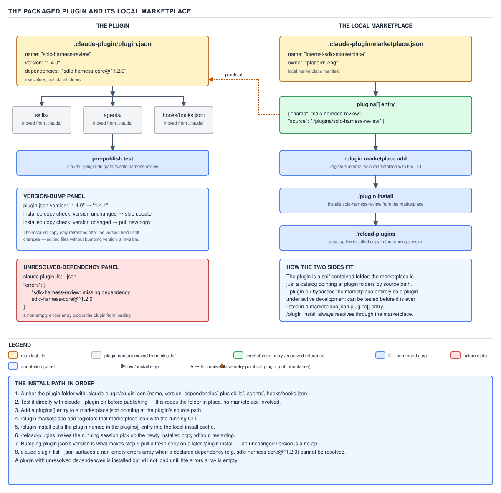
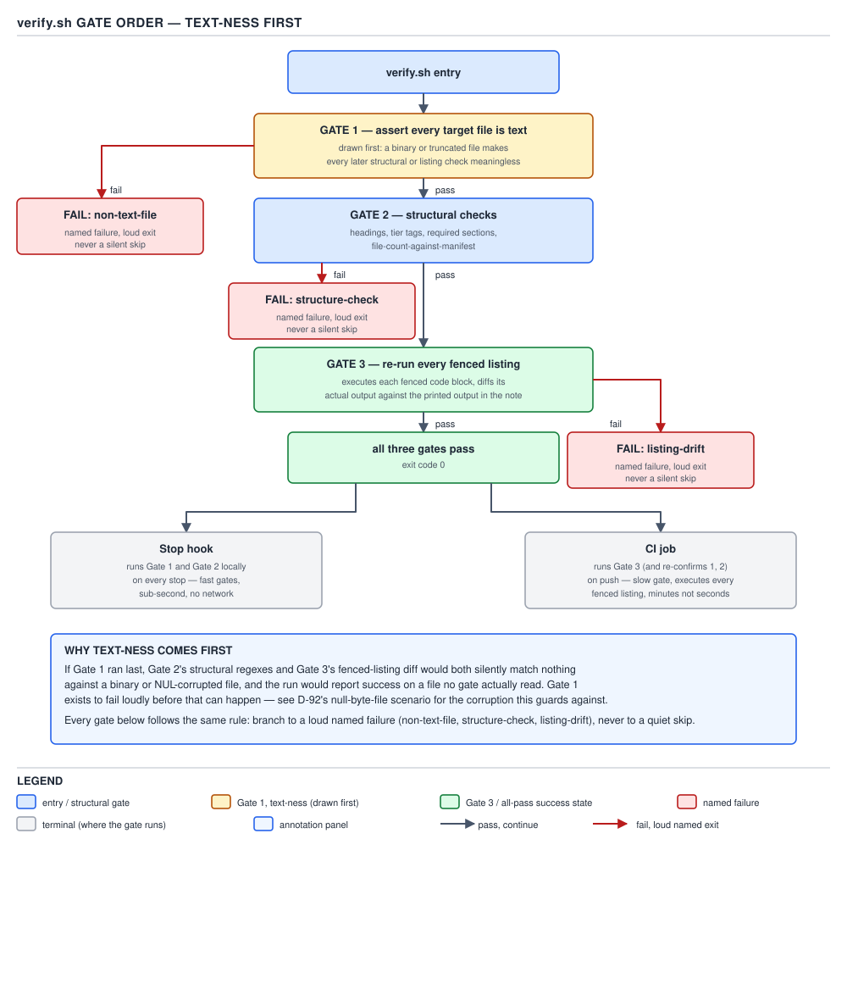

# 21 AI for Coding — PART 4 — the interview wrap-up (§4.1–§4.7)

**Target version: Claude Code v2.1.2xx (August 2026).** | **Part 4 of 6** | [Index](00-index.md)
Previous: [re-running the listings, and where each gate belongs](build-it/08-verification-harness-b.md) · Next: [the questions, first four](94-interview-questions-a.md)

PART 4 is different from every other part in this guide: almost nothing in it is argued from
documentation. Every artefact below was actually built against `invoice-ledger-service` /
`invoice-ledger-tooling`, actually run, and the numbers quoted are what the run printed — not
estimates. This file does not re-derive any of that; it indexes it, so the reader can find the right
build-it file while configuring their own machine, and can answer the ten questions below out loud
using real observed figures instead of guessed ones.

## Summary table

### §4.1 — A `.claude` folder from nothing

| Leaf | Artefact | Proves | Trap it dodges | File |
|---|---|---|---|---|
| 4.1.1 | `CLAUDE.md`, 46 lines / 2,787 B ≈ 697 tok | Resident cost per turn is measurable, not folklore | Writing everything into `CLAUDE.md` instead of splitting always-true facts from procedures | `build-it/01-a-claude-folder-a.md` |
| 4.1.2 | Split into `CLAUDE.md` + `.claude/rules/api-dtos.md` (`paths`-scoped) + `.claude/skills/mvn-test-runner/` | ≈697 → ≈660 tok/turn resident floor; rule/skill bodies load conditionally | Treating a `paths`-scoped rule and a skill as interchangeable — one is always-on-for-a-glob, the other is invocation-gated | `build-it/01-a-claude-folder-a.md` |
| 4.1.3 | `settings.json`: build/test allow, `git push`/`.env`/`secrets/**` deny, one `env` var, `model` + `effortLevel` | Standing token cost of a permission rule is ≈0 — the harness enforces it, it is not injected text | Putting the wildcard after `./mvnw` instead of after the subcommand | `build-it/01-a-claude-folder-a.md` |
| 4.1.4 | `settings.local.json` overriding one key | Project-local (layer 3 of 5) beats shared project and user, loses to managed and `--settings` | Assuming any override key moves the same way — `permissions.deny` is a pooled union, not a per-layer override | `build-it/01-a-claude-folder-b.md` |
| 4.1.5 | Commit + fresh-clone replay | Trust dialog gates `-p`/SDK differently from interactive; untracked local file applies regardless of trust | Assuming a fresh clone with committed `settings.json` behaves identically under `-p` | `build-it/01-a-claude-folder-b.md` |

### §4.2 — Three hooks

| Leaf | Hook / event | Proves | Trap it dodges | File |
|---|---|---|---|---|
| 4.2.1 | `PostToolUse` on `Edit\|Write` → `format-on-edit.sh`, `jq -r '.tool_input.file_path'` | Outside the 4-event stdout-exception list, so ≈0 tokens even on a clean run | Formatting the whole repo instead of the one changed file | `build-it/02-three-hooks-a.md` |
| 4.2.2 | `PreToolUse` on `Bash` → `block-destructive-bash.sh`, JSON `permissionDecision: "deny"`, then the exit-2 variant | `Bash(pattern)` narrows only — cannot widen `permissions.deny` | Trusting a script's own `set -e` not to turn an incidental `grep` exit `2` into a false block | `build-it/02-three-hooks-a.md` |
| 4.2.3 | `SessionStart` → `branch-context.sh`, tagged advisory lines | ≈16 tok/session, once — **is** on the exception list | Leaving a network call unwrapped by `timeout` in a hook that must never hang the session | `build-it/02-three-hooks-a.md` |
| 4.2.4 | `Stop` → `require-green-build.sh`, `decision`/`reason`, `stop_hook_active` guard | Field names verified against the raw docs page: `{"decision": "block", "reason": "..."}` blocks the stop and keeps Claude working; there is no `continueReason` and no `decision: "continue"` | A four-minute full-suite gate in `Stop` gets disabled inside a week — see Q11 | `build-it/02-three-hooks-b.md` |
| 4.2.5 | All four fired: `/hooks`, `--debug`, an intentional violation | Registration ≠ execution ≠ correct handler logic — three separate proofs, three separate failure modes | Trusting `/hooks` listing alone as proof a hook actually ran | `build-it/02-three-hooks-b.md` |
| 4.2.6 | Diff vs `check-init.sh`, `doc-update-reminder.sh`, `prod-guard-bash.sh` | The one built hook that mutates (`format-on-edit.sh`) has no read-only counterpart among the three real ones compared | — | `build-it/02-three-hooks-b.md` |

### §4.3 — A skill and a command

| Leaf | Artefact | Proves | Trap it dodges | File |
|---|---|---|---|---|
| 4.3.1 | `checklist-refresh` skill: frontmatter, `$ARGUMENTS`, `` !`git diff --stat` ``, `references/checklist-full.md` | `references/` loads only on demand — 311 extra tok only if step 3 fires | Assuming a skill's reference file is always resident like the body | `build-it/03-a-skill-and-a-command-a.md` |
| 4.3.2 | Same capability as `.claude/commands/checklist-refresh.md` | The skill bought a `references/` directory and a `/skills` menu entry — not different behavior | Believing "skill" implies richer runtime capability than a command | `build-it/03-a-skill-and-a-command-a.md` |
| 4.3.3 | `disable-model-invocation: true` (`post-invoice-reversal`) vs `user-invocable: false` (`money-minor-units-conventions`) | Each is invocable only the intended way; the first costs 0 standing tokens, the second ≈79/turn | Confusing "model can't call it" with "costs nothing in context" | `build-it/03-a-skill-and-a-command-a.md` |
| 4.3.4 | `record-boundary-guard`, `paths: "**/*.java"` | Fires on file pattern, not on request wording | `**Unverified:** live activation timing for a `paths`-gated skill vs `memory`'s rules-page wording | `build-it/03-a-skill-and-a-command-b.md` |
| 4.3.5 | `mvn-verify-executor` (shared) + `release-candidate-check` (`` ```! `` wrapper) | Costs sum (60+67 tok/turn), unlike a shared `references/` file | Assuming an injected skill body is deduplicated across a composed pair | `build-it/03-a-skill-and-a-command-b.md` |
| 4.3.6 | Diff vs `bootstrap/SKILL.md`, `/implement-story` | Real one delegates to tested scripts; built one delegates to another skill's prose because nothing left needs extracting | — | `build-it/03-a-skill-and-a-command-b.md` |

### §4.4 — Two subagents

| Leaf | Artefact | Proves | Trap it dodges | File |
|---|---|---|---|---|
| 4.4.1 | `readonly-reviewer`: `tools: Read, Grep, Glob, Bash(git diff *), Bash(git status *)`, no `Write`/`Edit` | Real dispatch found the seeded bug, $0.0565, `VERDICT: CHANGES REQUESTED (2 issues)` | `Bash(pattern)` matches the whole offered string — a `cd ... && git diff ...` chain is refused even though `git diff` is inside it | `build-it/04-two-subagents-a.md` |
| 4.4.2 | `mvn-test-runner`: `tools: Bash(mvn -B -o test *)`, `model: haiku` | ≈33× context reduction: 990-token console vs a sub-30-token `VERDICT:` line | Believing `permissions.allow` in `.claude/settings.json` reaches an untrusted workspace | `build-it/04-two-subagents-a.md` |
| 4.4.3 | `memory: project` on `readonly-reviewer` | 0 → 2 → 3 memory files across three sessions; session 3 named session 2's file unprompted | Assuming memory is a one-time cost — it is billed system-prompt weight on every dispatch | `build-it/04-two-subagents-a.md` |
| 4.4.4 | `pre-merge-gatekeeper`, `tools:` without `Agent` | Reports both named subagents `NOT AVAILABLE`; `spawned: 0` — cheaper than a real dispatch | "Never had the tool" and "hit the depth limit" are telemetrically identical unless the model's own prose says which | `build-it/04-two-subagents-b.md` |
| 4.4.5 | Diff vs `progress-verifier.md`, `calibrator.md` | Real ones have no `tools:` field at all — prose-only boundaries, a genuine defect vs the built pair's enforced ones | — | `build-it/04-two-subagents-b.md` |

### §4.5 — A headless orchestrator (Java)

| Leaf | Artefact | Proves | Trap it dodges | File |
|---|---|---|---|---|
| 4.5.1 | `ClaudeRunner`: `ProcessBuilder` around `claude -p --output-format json`, `ClaudeEnvelope` record, 500-char parse-failure snippet | Same 500-char bound as `agent.py` line 293 — bounded evidence, not none, not megabytes | Trusting the OS exit code instead of the envelope's `is_error` | `build-it/05-orchestrator-a-the-runner.md` |
| 4.5.2 | Three ceilings: `--max-turns`, `--max-budget-usd`, `Process.waitFor(Duration)`, three exception types | Live-measured **619× budget overshoot** — see Q1 | Believing `--max-budget-usd` stops the call in progress | `build-it/05-orchestrator-a-the-runner.md` |
| 4.5.3 | `--settings <absolute path>` | Fixes the §3.7 worktree incident: `--setting-sources project` resolves against `cwd`, not the harness repo | Assuming every settings source has the same worktree fallback as `settings.local.json` | `build-it/05-orchestrator-b-ceilings-and-resolution.md` |
| 4.5.4 | Parameter → env → default, tested by presence | Explicit `0` survives every tier — see Q5 | Using a primitive `int` where "unset" must be representable | `build-it/05-orchestrator-b-ceilings-and-resolution.md` |
| 4.5.5 | Classified bounded retry + `Semaphore` bulkhead | Envelope preserved through a ceiling throw instead of discarded — see Q4 | Retrying an unparseable envelope, which fails identically forever | `build-it/06-orchestrator-c-bulkhead-and-retry.md` |
| 4.5.6 | Two-stage pipeline, neither stage writes its own input | Stage 2 re-run alone reproduced an identical `md5` | Letting stage 1 rewrite the file stage 2 reads, which breaks independent re-runnability | `build-it/06-orchestrator-c-bulkhead-and-retry.md` |
| 4.5.7 | `CostReport.record(name, envelope)` | Real run: **$0.210361** total, stage 1 $0.145532 (cold cache), stage 2 $0.064828 (warm) | A stage that threw before returning an envelope is absent from the report, not zero-cost | `build-it/06-orchestrator-d-pipeline-and-cost.md` |
| 4.5.8 | Diff vs `harness/src/harness/engine/agent.py` | Real loop retries unparseable envelopes and general `is_error`; only `error_max_turns` is terminal — narrower here on purpose | — | `build-it/06-orchestrator-d-pipeline-and-cost.md` |

### §4.6 — A plugin

| Leaf | Artefact | Proves | Trap it dodges | File |
|---|---|---|---|---|
| 4.6.1 | `.claude-plugin/plugin.json` + `skills/`, `agents/`, `hooks/hooks.json` as plugin-root siblings | `--plugin-dir` lists all five components; `post-invoice-reversal` correctly absent | Nesting `skills/`/`agents/` inside `.claude-plugin/` — see Q7 | `build-it/07-a-plugin-a.md` |
| 4.6.2 | `claude plugin validate`, then `--strict` | Unrecognized `maintainer` field: warning plain, hard failure under `--strict` | Trusting plain `validate` to catch a layout mistake — it does not | `build-it/07-a-plugin-a.md` |
| 4.6.3 | Local marketplace: `marketplace add` → `install` → `/reload-plugins` | Correct layout: `Skills (4) Agents (3) Hooks (4)`; wrong layout: identical install, `Skills (0) Agents (0) Hooks (0)` | Reading a clean `install` as proof the components loaded | `build-it/07-a-plugin-a.md` |
| 4.6.4 | Bump `version`, `claude plugin update -s local -y` | Local-`source` scope reads skills/agents live from `source`, independent of `version` | Assuming `version` gates what a local-directory install actually serves | `build-it/07-a-plugin-b.md` |
| 4.6.5 | Second plugin with an unresolved `dependencies` entry | `install` succeeds silently; `list --json`'s `errors` array is the only place the gap surfaces | Trusting `plugin details`'s component inventory, which reports the full set even when unresolved | `build-it/07-a-plugin-b.md` |
| 4.6.6 | Diff vs the sdlc-harness plugin + marketplace | Real one: `allowCrossMarketplaceDependenciesOn` trust, content-hash version nudging, a bootstrap skill for non-declarative provisioning | — | `build-it/07-a-plugin-b.md` |

### §4.7 — Verification harness

| Leaf | Artefact | Proves | Trap it dodges | File |
|---|---|---|---|---|
| 4.7.1 | `verify.sh`: text-ness gate, then structural `grep -q` checks | Pass set: 0 failures, exit 0, 0.32s, $0 | — | `build-it/08-verification-harness-a.md` |
| 4.7.2 | A NUL-byte file injected deliberately | Gate 1 catches it loudly (`mime-encoding 'binary'`); gate 2 never touches the file | Running structural checks before text-ness — see Q9 | `build-it/08-verification-harness-a.md` |
| 4.7.3 | `verify-on-stop.sh` (`Stop` hook) + `.github/workflows/verify-notes.yml` (CI) | Split is by coverage, not price — `Stop` sees only in-session edits, CI sees every push | Putting the same gate in both places and calling it redundancy instead of two different coverage guarantees | `build-it/08-verification-harness-b.md` |
| 4.7.4 | Skill eval: 3 positive + 3 negative prompts against `checklist-refresh` | 6/6 correct, $0.4844 total, $0.0807/prompt | Assuming a skill's `description` triggers correctly without ever running the negative cases | `build-it/08-verification-harness-b.md` |

## Interview questions and answers

**1. You set `--max-budget-usd 0.0001` on a `claude -p` call expecting it to cap spend near zero. What actually happened when this was tested, and why?**

It billed **$0.06197725** for a single turn — a **619× overshoot** on a $0.0001 cap. The envelope
came back with `subtype: "error_max_budget_usd"`, `terminal_reason: "budget_exhausted"`, and
`errors: ["Reached maximum budget ($0.0001)"]`, so the ceiling was genuinely enforced — just not
where I expected. The mechanism is that `--max-budget-usd` is a **between-calls circuit breaker**,
not a per-call spend limit: the harness checks the running total *before* deciding whether to make
the next API call, but it cannot interrupt a call that is already in flight. With `--max-turns 1`
there is only one call to make, so the check that would have refused turn two never gets a chance to
fire, and the entire cost of that one turn lands regardless of how small the ceiling was. The fix in
practice is to treat `--max-budget-usd` as a guard against a runaway multi-turn loop, not as an
upper bound on any single expensive call — if one call can plausibly cost more than the budget, the
ceiling has already failed before it starts.

**2. `ClaudeRunner` throws three different exception types for three different ceilings instead of one generic `AgentFailureException`. Why does that granularity matter?**

Because the three ceilings bound three different things, and a caller has to make a different
decision for each. `AgentTimeoutException` bounds wall clock — the process was killed by
`destroyForcibly()` before it produced any JSON at all, so there is no envelope, and the right
response is usually "retry, maybe with more time." `AgentTurnLimitException` bounds agency — the
agent used up its allotted turns without finishing, which is the agent's own report of running out
of room, not an infrastructure hiccup, so retrying identically will not help. `AgentBudgetExceededException`
bounds money — the same "agent reported it, don't just retry" logic, but the decision a caller makes
downstream is about cost control, not scheduling. All three implement a shared sealed interface,
`AgentCeilingException`, with one method, `envelope()`, that returns `Optional<ClaudeEnvelope>` —
empty for the timeout, because no JSON existed yet to parse, and populated for the other two, because
the agent process did finish and did produce a billable envelope before throwing. Collapsing these
into one exception type would force every caller to re-parse a message string to figure out which of
three completely different remediations applies.

**3. Your `ClaudeRunner` can't parse the stdout from a `claude -p` call. What do you actually do with the unparseable text, and why 500 characters specifically?**

I keep the first 500 characters of the stripped stdout (or stderr, if stdout is empty) as a snippet
on the failure, logged as `[ClaudeRunner] unparseable envelope, first 500 chars: ...`. That number
isn't arbitrary — it's the same bound used in the real sdlc-harness's `agent.py`, line 293, which
reads `snippet = (proc.stdout or proc.stderr or "").strip()[:500]`. The reasoning is that neither
extreme helps you debug: logging nothing means the next engineer has to reproduce the failure from
scratch with no idea what the CLI actually printed, and logging the full output — which for a
`claude -p` call can run to tens of thousands of characters of a half-finished JSON blob — buries the
one diagnostic fact (where the JSON broke, what shape it was in) in noise nobody will read. 500
characters is enough to see the malformed opening of the JSON object, the `session_id`, the cost
fields if they made it out before the stream cut off, and it's small enough to sit inline in a log
line without anyone scrolling past it. Reusing the exact figure from the real harness rather than
picking a new one also means the two systems' failure logs read the same way if you ever have to
correlate them.

**4. Walk through what changed in `ClaudeRunner`'s retry logic around the `ClaudeEnvelope`, and why it mattered.**

Before the fix, when `run()` hit a ceiling — say `error_max_turns` — it threw
`AgentTurnLimitException` with just a message string, and the `ClaudeEnvelope` that `toEnvelope()`
had already built from the CLI's JSON output was simply discarded along with the throw. That envelope
carries `totalCostUsd` and `usage` for an API call that had already happened and had already been
billed — throwing it away doesn't refund the call, it just makes an already-spent attempt
unbillable and unauditable. I found this while wiring up the bounded retry: the retry loop wanted to
log cost-per-attempt, and there was nowhere to get it from for a ceiling failure. The fix was to give
`AgentTurnLimitException` and `AgentBudgetExceededException` a carried `ClaudeEnvelope` field (via
the shared `AgentCeilingException.envelope()` method), populated at the two `throw` sites, and have
`runWithRetry` unwrap that envelope instead of dropping it with the exception. `AgentTimeoutException`
still returns `Optional.empty()` from `envelope()`, correctly, because `destroyForcibly()` fires
before any JSON exists to parse — there's genuinely nothing to preserve there. The general law: any
exception that can fire *after* a billable call has completed needs to carry that call's cost record,
or the accounting silently loses money it actually spent.

**5. What is the difference between "retryable" and "terminal" in your bounded retry, and how did you classify `ClaudeRunner`'s three failure shapes?**

A failure is retryable only if a second attempt could plausibly produce a different outcome.
Infrastructure failures qualify: an `IOException` from `ProcessBuilder.start()` or an
`AgentTimeoutException` from `run()` might succeed on a second try because the underlying conditions
— system load, a transient network hiccup — can genuinely differ between attempts. Everything else in
`ClaudeRunner`'s vocabulary is terminal on the first attempt. An unparseable envelope — `run()`
returning normally with `isError()==true` and `stdoutJson` holding raw unparsed text — is a contract
failure: the same malformed stdout will reproduce identically on every retry, because nothing about
the CLI's output shape changed. `AgentTurnLimitException` and `AgentBudgetExceededException` are the
agent's own report that it hit a ceiling; that report is the answer, not a transient glitch, so
retrying just spends more money to get the same report again. This is narrower than the real
`agent.py`, which actually retries unparseable envelopes and general `is_error: true` results and
only treats `error_max_turns` as terminal — that loop buys resilience against agent-side flakiness at
the cost of the retry multiplying cost on a genuinely bad prompt, while my narrower version trades
that resilience for predictable spend, on the assumption that there's no outer CI continuation layer
to catch what the inner loop misses.

**6. Why does a parameter → environment → default resolution chain need to check for presence, not truthiness, and where does that bite in Java specifically?**

Because at least one knob in the chain — a max-turns override, a budget of zero to mean "no calls
allowed," a boolean flag — has a legitimate falsy value that must be distinguishable from "the caller
didn't pass anything." If the resolution logic does `paramValue != null ? paramValue : ...` that's
presence-checking and it's correct: a boxed `Integer` or `Long` can be `null` to mean "absent" and
`0` to mean "explicitly zero," and those are two different inputs that must resolve two different
ways. The bug shows up the moment someone writes the resolution with a primitive `int` and tests
`paramValue != 0` or, worse, uses `||` across the chain like `paramValue || envValue || default` —
in Python that literal form treats `0`, `""`, and `False` as falsy and silently falls through to the
next tier even though the caller explicitly passed zero. In Java the equivalent mistake is declaring
the field as primitive `int` in the first place: a primitive genuinely cannot represent "unset" at
all, so by the time you're testing it, the information about whether it was passed is already gone —
you'd have to fix the type, not the comparison. The rule I apply uniformly: use a boxed type and test
`!= null` for any knob where zero, empty string, or false is a meaningful, distinct input; primitives
and truthiness checks are fine everywhere else, and forcing `Optional`-style ceremony onto a knob that
has no meaningful falsy value is just unnecessary weight.

**7. You measured a bulkhead's effect with a wall clock instead of just describing `Semaphore` semantics. What did you measure and what does it prove?**

Four identical single-turn `claude -p` calls (`"Say OK"`, `--max-turns 1`) through a `Semaphore(1)`
bulkhead took **36.1 seconds** total; the same four calls through a `Semaphore(4)` took **9.1
seconds** — roughly a 4× difference for identical work. That's not a coincidence: `Semaphore(1)`
forces the four calls to run strictly sequentially, so the total is close to four times a single
call's latency, while `Semaphore(4)` lets all four acquire a permit immediately and run concurrently,
so the total tracks close to one call's latency. The reason to measure this with a stopwatch rather
than just asserting "a bulkhead bounds concurrency" is that the bulkhead is a limit *this code*
enforces on itself — nothing external forces it — and the only way to be sure the `Semaphore` is
actually gating concurrent `claude -p` subprocesses, rather than just sitting there uncontended, is to
watch the wall-clock cost of contention appear and disappear as the permit count changes. It's also
worth being honest about the failure mode on the other side: a bigger permit count isn't strictly
safer, because a `Semaphore` that stays fully checked out under real load hides a capacity problem
behind what looks, from the caller's side, like ordinary latency rather than an alarm.



**D-98** — plugin-root component layout (`skills/`, `agents/`, `hooks/hooks.json` as siblings of
`.claude-plugin/`, never children of it) and how a local marketplace resolves an install; the
scaffolding behind both Q8 and Q9 below.

**8. You put a plugin's skills directory inside `.claude-plugin/` instead of at the plugin root. What actually happened when you tried to use it?**

Nothing loaded, and there was no error anywhere in the chain to tell me that. `claude plugin validate`
passed clean except for an unrelated missing-`author` warning. Installing it through a local
marketplace succeeded and reported the plugin as installed. The only place the truth showed up was
`claude plugin details`, comparing the correctly-laid-out plugin against the broken one side by side:
the correct layout reported `Skills (4) Agents (3) Hooks (4)`, listing `checklist-refresh`,
`money-minor-units-conventions`, `mvn-test-runner`, `post-invoice-reversal`; the broken layout
reported `Skills (0) Agents (0) Hooks (0)` for the identical install command. The rule is that only
`plugin.json` itself lives inside `.claude-plugin/`; `skills/`, `agents/`, `hooks/hooks.json`,
`.mcp.json`, and `bin/` are all siblings of `.claude-plugin/` at the plugin root, not children of it.
Nesting them inside is a layout mistake the harness has no reason to flag as an error, because
structurally it's still valid JSON in a valid location — it just isn't where the loader looks. The
practical habit this forces: after any plugin install, check `claude plugin details` for a non-zero
component count, because a clean `validate` and a clean `install` both stay silent about this exact
failure.

**9. A `hooks.json` you copy from a project's `settings.json` into a plugin uses `${CLAUDE_PROJECT_DIR}` in its `command` paths. What breaks, and why?**

`${CLAUDE_PROJECT_DIR}` resolves to the project root where the session started — that's correct for
a project's own `.claude/settings.json`, because the hook scripts live inside that same project and
travel with it. Once those scripts are packaged into a plugin, they no longer live in the project at
all; they live wherever the plugin gets installed, which is the plugin's own cache directory under
`~/.claude/plugins/cache/...`, and that path changes on every plugin update. A `hooks.json` inside
`hooks/` that still points at `${CLAUDE_PROJECT_DIR}/.claude/hooks/branch-context.sh` is asking the
harness to look for the script inside whatever project happens to be installing the plugin — a
directory that has no `.claude/hooks/branch-context.sh` in it at all, because the script shipped
inside the plugin, not inside that project. The hooks simply never fire, silently, the same failure
class as the misplaced `skills/` directory: no error, just nothing happening. The fix is exactly one
substitution per path: every `${CLAUDE_PROJECT_DIR}` becomes `${CLAUDE_PLUGIN_ROOT}`, which resolves
to the plugin's own installation directory and is the placeholder `hooks` documentation states is
correct for a plugin's own `hooks/hooks.json`.



**D-99** — gate 1 (text-ness) must run and `continue` past a binary file before gate 2 (structural
`grep`) ever touches it; reversing the order is exactly the failure Q10 walks through.

**10. Why is text-ness the first gate in a Markdown verification script, before any structural `grep` check runs — and what's the concrete failure if you reverse the order?**

Because `grep` degrades silently on binary content instead of erroring. I proved this by reversing
the gate order deliberately on a fixture containing a NUL byte: running the structural checks (gate
2) first against that file, `grep -q` for the required footer line exits `1` with zero stdout and no
warning — indistinguishable, to a script or a caller reading only the exit code, from "the file is
missing its footer." It's actually "this file was never text, so the pattern never matched anything,"
which is a completely different problem with a completely different fix. In a check *for* the
presence of a pattern this produces a false fail; in a check written the other way, *against* the
presence of a forbidden pattern, the identical binary content produces a false pass that looks exactly
like a genuinely clean file. My `verify.sh` puts a `file --brief --mime-encoding` check first,
unconditionally, before any `grep` touches the file's content, and on a `binary` verdict it logs the
specific reason and `continue`s past that file for every later gate rather than letting gate 2 report
a misleading, specific-sounding wrong diagnosis. The same discipline generalizes past this one script:
any gate whose primary tool (`grep`, `jq`, a regex) can exit non-zero for a reason other than "the
condition being checked was false" needs its own precondition asserted first, loudly, or its silence
gets misread as a clean result.

**11. `require-green-build.sh` is wired to `Stop` and needs to keep Claude working when the build is red. What JSON does it actually return, and why does the field that seems to mean "keep going" do the opposite?**

`{"decision": "block", "reason": "build failed: <tail of the log>"}`. Quoted verbatim from the raw
`https://code.claude.com/docs/en/hooks.md` page (re-fetched and grepped directly, 2026-08-30, not
summarised): "`decision`: `\"block\"` prevents Claude from stopping. Omit to allow Claude to stop"
and "`reason`: Required when `decision` is `\"block\"`. Tells Claude why it should continue." So the
field that keeps Claude working is spelled `block`, and the field you'd guess would do it —
`continue`, or a made-up `decision: "continue"` — does not exist for this purpose at all. There is a
genuinely separate, universal `continue` boolean that every event accepts, but it means the opposite
of what it sounds like: `continue` defaults to `true`, and setting it to `false` is a kill switch
that stops Claude entirely, overriding whatever `decision` says, with its paired `stopReason` shown
to the user rather than fed back to Claude. I got this wrong twice while building this hook before
reading the raw page directly — first as a boolean `continue: true`, then as `decision: "continue"` /
`continueReason`, which is the same wrong intuition dressed up as a schema. Omitting `decision`
entirely, not setting it to any "continue" value, is what lets the stop proceed. I only trust this
now because I ran `curl -sL` against the raw markdown and grepped the `Stop decision control` section
myself rather than relying on a fetched summary of the table.

`require-green-build.sh` also has to check the `stop_hook_active` input the `Stop` event receives
alongside the common fields, and not just decide "block" unconditionally on a red build: per the same
page, "The `stop_hook_active` field is `true` when Claude Code is already continuing as a result of a
stop hook. Check this value or process the transcript to avoid blocking on a condition that will
never resolve. Claude Code overrides the hook and ends the turn after 8 consecutive blocks." A
`Stop` hook that runs a four-minute full suite and blocks unconditionally on red is dangerous for two
separate reasons, not one: it taxes every turn-end with four minutes of wall clock, and — if it never
checks `stop_hook_active` — it will keep blocking on the same red build every single turn, silently
consuming up to 8 consecutive blocked turns before Claude Code's own cap forces the stop through
regardless of what the hook wants.

## Predict the output

**Puzzle 1 — a plugin's skills directory nested one level too deep**

```json
{
  "name": "invoice-ledger-tooling",
  "version": "1.0.0",
  "description": "Skills, agents and hooks for invoice-ledger-service.",
  "author": { "name": "platform-eng" }
}
```

Directory layout on disk:

```
invoice-ledger-tooling/
├── .claude-plugin/
│   ├── plugin.json
│   └── skills/
│       └── mvn-test-runner/
│           └── SKILL.md
├── agents/
│   └── readonly-reviewer.md
└── hooks/
    └── hooks.json
```

Action: `claude plugin validate ./invoice-ledger-tooling` followed by
`claude plugin install invoice-ledger-tooling@local-marketplace -s local`, then
`claude plugin details invoice-ledger-tooling`.

<details><summary>Answer</summary>

`validate` passes clean, no mention of the layout at all. `install` reports success. `plugin details`
reports `Skills (0)  Agents (1)  Hooks (1)` — `agents/` and `hooks/` are correctly at the plugin root
and load; `skills/` is nested one level inside `.claude-plugin/` alongside `plugin.json`, which is not
a location the loader scans, so `mvn-test-runner` never appears anywhere and no error is ever raised
about it. Only `.claude-plugin/plugin.json` itself belongs inside `.claude-plugin/`; every other
component directory is a sibling of `.claude-plugin/` at the plugin root.

</details>

**Puzzle 2 — a resolution chain that swallows an explicit zero**

```java
static int resolveMaxTurns(Integer paramMaxTurns, Map<String, String> env) {
    String fromEnv = env.get("HARNESS_AGENT_MAX_TURNS");
    int fromEnvOrDefault = (fromEnv != null) ? Integer.parseInt(fromEnv) : 160;
    return (paramMaxTurns != 0) ? paramMaxTurns : fromEnvOrDefault;
}
```

Action: call `resolveMaxTurns(0, Map.of("HARNESS_AGENT_MAX_TURNS", "40"))` — a caller explicitly
asking for zero turns (a dry-run / validate-only mode).

<details><summary>Answer</summary>

Returns `40`, not `0`. `paramMaxTurns` is declared `Integer` (correctly boxable), but the check
`paramMaxTurns != 0` unboxes it and compares by value, not by presence — an explicit `0` and an
absent parameter are indistinguishable under this test, so the explicit `0` is silently treated as
"not passed" and falls through to the environment tier. The fix is `paramMaxTurns != null ? paramMaxTurns : fromEnvOrDefault`,
which tests presence: a boxed type can represent "absent" as `null`, distinct from the legitimate
value `0`, but only if the comparison actually checks for `null` instead of checking for falsiness.

</details>

**Puzzle 3 — a budget ceiling on a single expensive call**

```bash
claude -p "Write a 3,000-word design document comparing five caching strategies for invoice-ledger-service." \
  --output-format json \
  --max-turns 1 \
  --max-budget-usd 0.0001
```

Action: run the command as shown.

<details><summary>Answer</summary>

The call completes normally and bills whatever a 3,000-word generation actually costs — potentially
many times the $0.0001 ceiling — and the envelope reports `is_error: true`,
`subtype: "error_max_budget_usd"`, `terminal_reason: "budget_exhausted"` only *after* the spend
already happened. `--max-budget-usd` is enforced between calls, checked before the harness decides
whether to make the *next* API call; with `--max-turns 1` there is only one call, so the check that
would refuse a second call never gets the chance to run, and the ceiling cannot interrupt a call
already in flight. A live measurement of exactly this shape returned `total_cost_usd: 0.06197725`
against a `$0.0001` cap — a 619× overshoot.

</details>

**Puzzle 4 — a plugin-shipped hook using the wrong placeholder**

```json
{
  "hooks": {
    "SessionStart": [
      {
        "matcher": "*",
        "hooks": [
          { "type": "command", "command": "${CLAUDE_PROJECT_DIR}/.claude/hooks/branch-context.sh", "timeout": 10 }
        ]
      }
    ]
  }
}
```

This `hooks.json` ships inside `invoice-ledger-tooling/hooks/hooks.json` and the plugin is installed
into a second, unrelated project. Action: start a new session in that second project.

<details><summary>Answer</summary>

The `SessionStart` hook never fires — no error, no warning, just silence. `${CLAUDE_PROJECT_DIR}`
resolves to the *installing* project's root, which has no `.claude/hooks/branch-context.sh` in it,
because that script was packaged inside the plugin's own `hooks/` directory, not inside the
installing project. The command path the harness tries to execute simply doesn't exist there. The
fix is `${CLAUDE_PLUGIN_ROOT}/hooks/branch-context.sh` — `${CLAUDE_PLUGIN_ROOT}` resolves to the
plugin's own installation directory under `~/.claude/plugins/cache/...`, which is where the script
actually lives, and it is the placeholder required for any path inside a plugin's own `hooks/hooks.json`.

</details>

**Puzzle 5 — a verification gate that skips a binary file without saying so**

```bash
#!/usr/bin/env bash
set -uo pipefail
fail_count=0
for f in "$1"/*.md; do
  grep -q '^\*\*Lines:\*\*' "$f" || { echo "FAIL: $f missing footer"; fail_count=$((fail_count+1)); }
  grep -q '^## Open questions' "$f" || { echo "FAIL: $f missing Open questions"; fail_count=$((fail_count+1)); }
done
exit $([ "$fail_count" -eq 0 ] && echo 0 || echo 1)
```

Action: run this script against a directory containing one well-formed Markdown file and one file
that is actually a NUL-byte-containing binary blob saved with a `.md` extension, and check the exit
code.

<details><summary>Answer</summary>

Exit `1`, with `FAIL: ... missing footer` and `FAIL: ... missing Open questions` printed for the
binary file — which reads exactly like a real content defect, not what actually happened. `grep -q`
against binary content in most `grep` implementations exits `1` with zero stdout, identical to "ran
cleanly, pattern genuinely absent"; the script has no gate asserting the file is text before it starts
grepping, so a binary file is reported with the same specific, wrong reason a genuinely malformed
Markdown file would get. The fix is a `file --brief --mime-encoding "$f"` check before either `grep`,
failing loudly and specifically (`gate1-textness: ... reports mime-encoding 'binary'`) and `continue`-ing
past that file for the rest of the gates, rather than letting a content-blind tool report a
misleadingly specific diagnosis.

</details>

---

**Leaves covered:** none exclusively — this file closes §4.1–§4.7 (40 leaves), each built in its own note file
**Leaves deferred:** none
**Diagrams included:** re-embedded by id where an answer turns on one
**Target version:** Claude Code v2.1.2xx (August 2026)
**Lines:** 458
