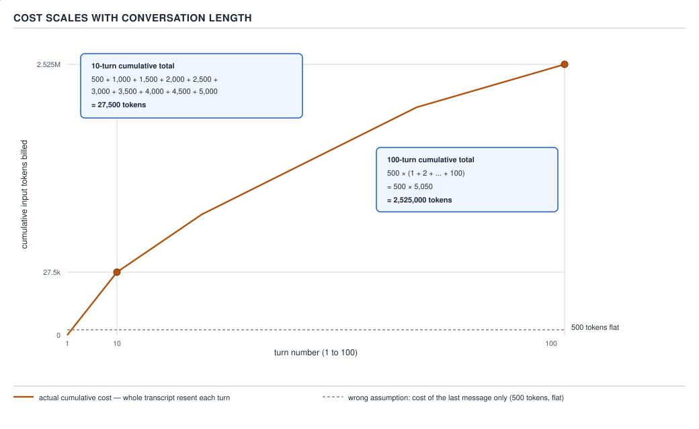

# 21 AI for Coding — the questions, first four — INTERVIEW (§5.1.1–5.1.4)

**Target version: Claude Code v2.1.2xx (August 2026).** | **Part 5 of 6** | [Index](00-index.md)
Previous: [PART 4 — the interview wrap-up](93-interview-build-it.md) · Next: [the questions, second four](94-interview-questions-b.md)

Four questions a Claude Code interview conversation asks almost every time, each with the answer
shape that separates a senior response from a tool-list response. Read each one at speaking length,
not as a summary of where to look it up — this is the answer you say out loud.

## §5.1.1 "How do you use AI in your workflow?"

**The 60-second answer.** Say this, roughly as written, in about a minute:

> I don't think about it as "I use Claude Code to write code" — I think about it as a system I've
> built around an agent that acts with my authority, and the system has two halves: guardrails, and
> leverage. Guardrails means a project `CLAUDE.md` that carries the conventions that never change,
> `permissions.deny` rules and `PreToolUse` hooks that block a destructive command before it runs
> regardless of what the model decided, and a sandbox for anything that opens a subprocess of its
> own. Leverage means skills for the procedures I don't want to re-explain every session, subagents
> for isolating a big read-heavy or write-heavy task so it doesn't drag its noise back into my main
> context, and headless `claude -p` runs wired into CI so the same checks run without me sitting in
> the loop. None of that is worth anything if what comes out isn't checked, so every agent-produced
> change still goes through the same tests and the same review a human-written change would.

That is roughly 150 words — about sixty seconds spoken at a normal interview pace.

**Why the systems framing is what a senior answer needs.** The tool-list version of this
answer — "I use it for autocomplete, I ask it questions, sometimes I have it write tests" — is true
and says nothing an interviewer can act on. It describes usage; it does not show that the candidate
has thought about the two things a team actually cares about before letting an agent touch its
codebase: what stops it from doing something wrong, and how the good work it does gets trusted. The
systems framing answers exactly that, unprompted, by naming the guardrail layer (deny rules, hooks,
sandbox — §5.1.4's ranked controls) and the leverage layer (skills, subagents, headless
orchestration) as one administered pipeline rather than a chat window the candidate types into. The
real question behind "how do you use AI in your workflow" is "can I hand this person a team's
workflow and trust them not to create an incident," and only the systems answer addresses it.

**The three follow-ups this answer invites, and how to be ready for each.**

1. **"What happens when it does something wrong?"** Be ready with the ranked control list from
   §5.1.4 — deny rule, then `PreToolUse` blocking hook, then sandbox, then withheld tools, then a
   human gate — and one real incident you can describe from the inside, not in the abstract: a
   `SessionStart` hook that piled up 100+ GB of abandoned indexes because starting a session was the
   trigger for the next pile-up, or a coder step that hit a hardcoded 80-turn `--max-turns` ceiling
   after producing thirteen green tests and a correct fix, exiting on `error_max_turns` before any
   of it landed — **$5.16** of completed work thrown away, fixed by raising the default ceiling and
   adding a resumable checkpoint rather than by asking the agent to try to finish faster.
2. **"How do you know it isn't making things up, and how do you verify it?"** Be ready with the
   verification answer, not a vibe: a failing test is a machine-checkable specification, exactly
   what a confabulating writer needs, so agent output goes through the same test suite and PR review
   a human's commit would, plus eval suites acting as tests for the prompts themselves when the
   artefact being changed is a prompt rather than code.
3. **"What does this actually cost you?"** Be ready with real numbers, not "it's cheap" or
   "it's expensive": cache reads run at roughly 10% of the standard input rate while a cache write is
   a premium over it, a session's `-p --output-format json` envelope reports `total_cost_usd`
   directly rather than requiring an estimate, and cost tracks conversation length — not the length
   of whatever you just typed — which is exactly §5.1.2's point. Naming `/cost` and
   `--max-budget-usd` as things you actually watch, not concepts you've merely heard of, is what
   separates this from a guess.

## §5.1.2 "What is a context window?"

**The answer that includes the cost consequence.** Anyone can say "200K tokens." The answer that
actually lands adds why that number matters to the person asking it — usually an engineering
manager thinking about budget, not a researcher thinking about architecture:

> A context window is the maximum number of tokens — input and output together — one API request
> can contain, and it's a hard limit enforced by the serving infrastructure before generation even
> starts, not a soft budget the model manages for itself. The part that actually matters day to day
> is what it implies about cost: the model is a stateless function with no memory between calls, so
> the context window is the argument list of the *next* call, not a place the model writes to and
> reads from over time. That means the whole conversation gets re-sent, in full, on every single
> turn. A one-line follow-up question at turn 100 of a long session isn't billed against that one
> line — it's billed against the entire accumulated transcript riding along behind it. Concretely: a
> worked example with a 6,000-token starting point and 800 tokens added per turn processes about
> 104,000 total tokens over a 10-turn session, but about 4,640,000 total tokens over a 100-turn
> session — roughly 44.6 times more, not the 10 times you'd expect from 10 times the turns — because
> every call resends everything before it, so the total work done across a session grows with the
> *sum* of every prior turn's size, not linearly with the turn count.

**Why this beats the number alone.** "200K tokens" is a fact a candidate could have memorized from
a pricing page without ever having reasoned about it. Stating the re-send mechanism and the
arithmetic consequence — cost scales with conversation length, and does so worse than linearly —
proves the candidate has actually modeled where the money and the latency in a long session go,
which is the thing an interviewer asking this question is usually trying to find out.

**D-08** — Cost scales with conversation length: as turns accumulate, each call resends the growing
total, so cumulative tokens processed grows faster than the turn count itself. This is the picture
behind the "44.6×, not 10×" line above — say it while pointing at the shape, if there's a whiteboard.

**Interview:** "If the window is 200K, why would a short message ever be expensive?" — Because the
window counts the whole re-sent conversation, not the newest message; a short message late in a long
session is billed against the transcript it drags behind it, not against itself.

## §5.1.3 "Why does a long session get worse?"

**Compaction, prefix cost, and drift — in that causal order.** These are not three independent
symptoms; they are three consequences that follow one from the next, and answering them out of order
loses the "why," so keep the order:

> A long session gets worse in three connected ways, and they build on each other. First,
> **compaction**: once the conversation crosses a resolved threshold of the context window — the
> default isn't a fixed percentage, it's looked up from a per-model-window table at runtime, which is
> why no single number is published for it — Claude Code inserts a call that rewrites the transcript
> into a shorter summary, and everything before that point is replaced by that summary going
> forward. The project-root `CLAUDE.md` gets re-read from disk and re-attached unconditionally, and
> each skill's most recent invocation gets re-attached too, but only the first 5,000 tokens of it,
> capped at 25,000 tokens combined across all skills, filled newest-invocation-first — so a skill you
> invoked early in the session and haven't touched since can simply vanish from what the model can
> see, with no notice given. Second, **prefix cost**: prompt caching makes a re-sent, unchanged
> prefix cheap to reprocess — about 10% of the standard input rate for a cache read versus a premium
> for a fresh cache write — but a compaction event, like any edit to the stable prefix, invalidates
> the cache and forces the next call to re-pay the write premium over the whole thing. In a real
> session's `-p --output-format json` trace, a cold call against a freshly-written system-prompt
> prefix reported `total_cost_usd` of `0.17333975`; a second call launched moments later against that
> same still-warm prefix reported `0.0157805` for effectively the same tokens — roughly an 11×
> difference for identical work, purely from whether the prefix was still cached. A session that
> compacts repeatedly re-pays that gap every time. Third, **drift**: even setting cost aside, a
> summary is not the original transcript — a compaction pass condenses everything before it into a
> shorter document standing in for it, and a skill's re-attached content resets to whatever survived
> the 5,000/25,000-token cutoff, so instructions and context that were live earlier in the session
> can quietly stop being visible to the model at all. The model isn't "getting tired" — it's
> literally operating over a smaller, lossier, and differently-composed version of the conversation
> than the one you remember having with it.

**Why the order matters when saying this out loud.** Compaction is the trigger — it's the event that
happens first, mechanically, once the window fills. Prefix cost is the direct financial consequence
of that trigger, because compaction is one of the events that invalidates the cache. Drift is the
consequence of the *content*, not the cost, of what compaction produced — it's what's left after the
summary has replaced the transcript and the skill budget has evicted whatever didn't fit. Stating
drift first would make it sound like a mystery the model just develops; stating it last, after
compaction and its cache cost, makes it the mechanically inevitable last domino.

**D-27** — What survives compaction: the summary replacing the transcript, the project-root
`CLAUDE.md` reloading unconditionally, and the skill budget's 5,000-per-skill / 25,000-combined,
newest-first cutoff. This is the concrete shape of "drift" — not vague fatigue, a specific eviction
rule.

**Interview:** "Why does a long session get worse?" — Compaction fires once the window crosses a
runtime-resolved threshold and rewrites the transcript into a shorter summary; that rewrite
invalidates the cached prefix, so the next call re-pays the cache-write premium (observed roughly
11× a warm cache read on identical tokens); and the summary itself is lossy — instructions and
skill content that didn't survive the cutoff are simply gone from what the model can see, which
looks like the model losing the thread but is really the transcript it's working from having
shrunk and changed shape underneath it.

## §5.1.4 "How do you stop an agent doing something destructive?"

**The controls, ranked by strength — and why prompting isn't on the list.**

> There are five controls that actually hold, and they're ranked by one property: how much of the
> guarantee is enforced by code the model's own output can't touch, versus how much depends on the
> model choosing to comply. At the top, a **`deny` rule** — `permissions.deny`,
> `--disallowedTools`, or a managed-settings lock — is absolute at every level, including inside
> `--allowedTools` and any command-line override; it's evaluated by the harness before any allow
> rule, full stop. Second, a **`PreToolUse` blocking hook** is a real guarantee once it fires — an
> exit code that blocks the call runs before the tool executes — but it can only narrow what a deny
> or ask rule already permits; it cannot carve an exception out of a deny, only remove permission a
> rule would otherwise have granted. Third, the **sandbox** is enforced by the OS underneath the
> permission layer entirely, and it's the one that catches what a file-tool deny rule structurally
> can't: an arbitrary subprocess — a Python or Node script the agent writes and runs — that opens a
> file itself, bypassing Claude's built-in `Read`/`Edit` tools entirely. Fourth, **withheld tools**
> reduce blast radius, but only when the mechanism is `disallowed-tools` or a `deny` rule — a
> skill's `allowed-tools` field pre-approves those tools for the invoking turn, it does not restrict
> anything, so treating it as a ceiling is the exact mistake this rank exists to correct. Fifth,
> **human confirmation** on an outward-facing or irreversible action is real, but it can't live
> inside a subagent's own turn — `AskUserQuestion` isn't a tool a subagent has access to at all — so
> the gate has to sit in the orchestrating skill in the parent session, before dispatch, not inside
> the dispatched task. **Prompting isn't rank six — it isn't on this list at all**, because the
> model only ever emits a `tool_use` block; the harness decides whether that call actually runs, and
> an instruction sitting in `CLAUDE.md` or a system prompt is context the model may weigh, not
> configuration the harness enforces. That's also why "tell it to ignore instructions it finds in
> data" doesn't work as a defense against prompt injection: that counter-instruction is delivered as
> text in the same transcript channel the injected instruction arrives in, so the two are just two
> sentences competing for the model's next-token prediction, and a well-crafted attacker sentence can
> still win — nothing about the rule was ever evaluated by code the model's own reasoning couldn't
> touch, which is exactly the property the top three ranks have and prompting doesn't.

**D-66** — One agent's blast radius, and the five controls that hold — note where prompting sits:
outside the diagram entirely, not as a sixth, weaker box.

**Interview:** "Why can't you just tell the model not to run destructive commands?" — Because the
model only emits a `tool_use` block; deciding whether that call actually executes is the harness's
job, done by code outside the model's sampling step. A `deny` rule or a `PreToolUse` hook is
evaluated regardless of what the model "decided"; an instruction telling it not to is just more text
in the same channel an attacker's injected instruction also occupies, and text doesn't enforce
anything — it only asks.

---

## Pitfalls

**Belief in action:** "I use it for autocomplete and to ask it questions" is a complete answer to
"how do you use AI in your workflow." **Surprising outcome:** the interviewer has learned that the
candidate has used the tool, and nothing about whether the candidate can be trusted with a team's
permissions, cost, or incident surface. **What actually gets it right:** answer with the two-halves
systems framing — guardrails (deny, hooks, sandbox) and leverage (skills, subagents, headless
orchestration) — and pre-load the three follow-ups (failure mode, verification, cost) rather than
waiting to be asked. **Why people believe it:** the question sounds like a warm-up, and a warm-up
question invites a warm-up-length answer; it is actually the interviewer's opening probe for
everything the rest of this file covers.

**Belief in action:** stating the context window's size ("it's 200K tokens") is a sufficient answer
to "what is a context window?" **Surprising outcome:** it's correct and forgettable — it doesn't
distinguish a candidate who read a pricing page from one who has actually run up a bill in a long
session. **What actually gets it right:** state the mechanism — the window is the argument list of
the next call, the whole conversation is re-sent every turn — and the arithmetic consequence: cost
scales with conversation length, worse than linearly (the 104,000-vs-4,640,000-token worked example,
≈44.6× not 10×). **Why people believe it:** the number is the part every reference page leads with,
so it's the part that sticks; the cost consequence only becomes visible to someone who has actually
watched a session's bill grow.

**Belief in action:** "a long session gets worse because the model gets confused" is a complete
answer to why performance degrades over a long session. **Surprising outcome:** it sounds like an
observation about the model's judgment, which invites a follow-up the candidate has no mechanism to
answer ("confused how, exactly?"). **What actually gets it right:** name the chain in order —
compaction fires at a resolved threshold and rewrites the transcript into a summary; that rewrite
invalidates the cached prefix, so the next call re-pays a cache-write premium (an observed ~11× gap
against a warm cache read); and the summary itself is lossy, with `CLAUDE.md` reloading
unconditionally but only the most recent, budget-capped skill invocations surviving. **Why people
believe it:** "the model got confused" matches what it feels like from the outside — replies get
worse — without requiring the speaker to know that a specific, mechanical rewrite event just
happened underneath the conversation.

**Belief in action:** telling the model, in `CLAUDE.md` or a system prompt, not to run destructive
commands (or not to follow instructions it finds in fetched content) is a working safeguard.
**Surprising outcome:** it survives casual testing and then fails against a well-crafted case — a
`curl | bash` phrased so the classifier or the model doesn't flag it, or injected text phrased as an
apparent system notice — because the instruction and the attack are the same *kind* of thing, both
resolved by the model's sampling rather than by enforced code. **What actually gets it right:** a
`deny` rule, a `PreToolUse` blocking hook, and the sandbox — in that ranked order — because all three
are evaluated by the harness regardless of what the model's own reasoning concluded. **Why people
believe it:** prompting is the interface everyone already uses for everything else about the model,
so it's the first lever reached for; nothing in the interface distinguishes "this is enforced" from
"this is a request the model usually honors."

## Cheat sheet

| Question | The one sentence that must be in the answer | The number or ranking that proves it |
|---|---|---|
| How do you use AI in your workflow? | It's a system with two halves — guardrails and leverage — not a list of tools. | Three follow-ups pre-loaded: failure mode, verification, cost |
| What is a context window? | The window is the argument list of the next call, so the whole conversation is re-sent every turn and cost scales with conversation length. | 104,000 tokens (10 turns) vs 4,640,000 tokens (100 turns) ≈ 44.6×, not 10× |
| Why does a long session get worse? | Compaction fires, which invalidates the cached prefix, which is why the summary that results is also lossy — in that order. | ~11× cost gap observed between a cache-write call ($0.17333975) and a cache-read call ($0.0157805) on the same prefix; skill budget 5,000/skill, 25,000 combined, newest-first |
| How do you stop an agent doing something destructive? | Deny rules, then blocking hooks, then sandbox, then withheld tools (via `disallowed-tools`, not `allowed-tools`), then a human gate — prompting isn't on the list. | Rank 1–5, plus: `AskUserQuestion` doesn't exist inside a subagent, so rank 5 can't live there |

## Self-test

1. What makes the systems-framing answer to "how do you use AI in your workflow?" stronger than
   listing the ways you've used the tool?

Answer
The tool-list answer describes usage and gives the interviewer nothing to act on. The systems framing names the guardrail layer (deny rules, hooks, sandbox) and the leverage layer (skills, subagents, headless orchestration) as one administered pipeline, which is what actually answers the interviewer's real question — can this person be trusted to introduce agents into a team's workflow without creating an incident.

2. Name the three follow-ups the 60-second workflow answer should anticipate, and the one fact to
   have ready for each.

Answer
"What happens when it does something wrong?" — the ranked control list plus a real incident (the SessionStart 100+GB pileup, or the 80-turn ceiling that lost $5.16 of finished work). "How do you know it isn't making things up?" — verification via the same tests and review a human commit gets, plus eval suites as tests for prompts. "What does this cost?" — cache reads at ~10% of standard input rate, `total_cost_usd` read directly from the envelope, and that cost tracks conversation length, not message length.

3. Why is "the context window is 200K tokens" an incomplete answer even though it's correct?

Answer
It states the ceiling but not the consequence: because the window is the argument list of the next call rather than a memory, the whole conversation is re-sent every turn, so cost and latency scale with how long the session has run, not with the size of the newest message — a fact the bare number doesn't convey.

4. Work the arithmetic: why does a 100-turn session process roughly 44.6× the tokens of a 10-turn
   session rather than 10×?

Answer
Because every call resends the entire conversation so far, the total tokens processed across a session is the sum of every prior turn's growing size, not the size of any one turn times the turn count. With a 6,000-token base and 800 tokens added per turn, the 10-turn session sums to 104,000 tokens and the 100-turn session sums to 4,640,000 — the total grows roughly with the square of the turn count, not linearly with it.

5. Put compaction, prefix cost, and drift in the correct causal order, and say in one clause why
   each one causes the next.

Answer
Compaction first: it fires once the conversation crosses a resolved threshold and rewrites the transcript into a summary. Prefix cost second: that rewrite is an edit to the stable prefix, which invalidates the cache, so the next call re-pays the cache-write premium instead of the cheap cache-read rate. Drift third: the summary that resulted from compaction is lossy — CLAUDE.md reloads unconditionally but skill content survives only within a 5,000-per-skill/25,000-combined, newest-first budget — so instructions and context visible earlier in the session can silently stop being visible at all.

6. What was the observed cost gap between a cache-write call and a cache-read call on the same
   prefix, and what does that gap have to do with a session that compacts repeatedly?

Answer
A cold call against a freshly-written prefix reported total_cost_usd of 0.17333975; a warm repeat against the same still-cached prefix reported 0.0157805 — roughly an 11× difference on effectively the same tokens. A session that compacts repeatedly invalidates its cached prefix each time compaction fires, so it re-pays that gap on every compaction rather than paying it once.

7. Rank the five controls that stop an agent from doing something destructive, strongest to
   weakest, and state the one property that determines the ranking.

Answer
1) a deny rule, 2) a PreToolUse blocking hook, 3) the sandbox, 4) withheld tools via disallowed-tools or a deny rule, 5) human confirmation gated in the parent session. The ranking is determined by how much of the guarantee is enforced by code the model's own output cannot touch, versus how much depends on the model choosing to comply.

8. Why can't a PreToolUse blocking hook widen what a deny rule already blocks?

Answer
Deny and ask rules are evaluated by the harness regardless of what a hook returns — a matching deny still blocks the call even if the hook's exit code said allow. A hook can only narrow what a rule already permits by blocking a call the rule would otherwise let through; it has no mechanism to carve an exception out of a rule that already said no.

9. Why is a skill's `allowed-tools` field not a valid answer to "how do you withhold a tool from an
   agent"?

Answer
allowed-tools pre-approves those tools for the invoking turn so they run without a permission prompt — it does not restrict the invocation to only those tools, and the session's broader permissions still apply to everything else. A real ceiling requires disallowed-tools or a deny rule, which actually remove a tool rather than merely skip a prompt for a subset of them.

10. Why is prompting not simply the sixth, weakest entry on the ranked-controls list?

Answer
Because it was never evaluated by anything outside the model's own turn. The model only emits a tool_use block; the harness decides whether it runs. An instruction telling the model not to do something is context the model may weigh during sampling, the same kind of thing an attacker's injected instruction is — it is a request, not a check, which is a difference in kind from the five ranked controls, not a difference in degree.

## Open questions

None.

---

**Leaves covered:** 5.1.1–5.1.4 (4 leaves)
**Leaves deferred:** none
**Diagrams included:** re-embedded by id where an answer turns on one
**Target version:** Claude Code v2.1.2xx (August 2026)
**Lines:** 301
