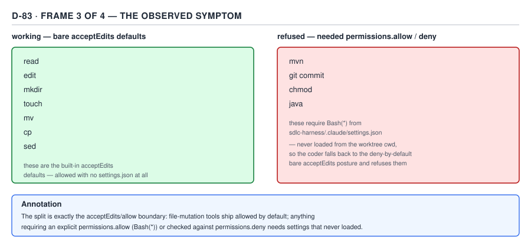

# 21 AI for Coding — the questions, third four — INTERVIEW (§5.1.9–5.1.12)

**Target version: Claude Code v2.1.2xx (August 2026).** | **Part 5 of 6** | [Index](00-index.md)
Previous: [the questions, second four](94-interview-questions-b.md) · Next: [the questions, last four](94-interview-questions-d.md)

Four more questions at speaking length, and the hardest four in this set: each one is where a Staff
candidate's answer and a tooling enthusiast's answer visibly diverge. Read `94-interview-questions-
a.md` and `-b.md` first for the register; this file does not repeat their material.

## §5.1.9 "Tell me about a bug you debugged in your tooling."

**The §3.7 incident, told in 90 seconds — symptom, mechanism, fix, generalisation, in that order.**

> Our coding agent runs headless, inside an isolated git worktree per story — that's its working
> directory. One day it could edit files fine, but every `git commit`, `mvn`, `chmod`, and `java`
> call got refused with "this command requires approval," and there's no human to answer that
> prompt in a headless run. The refused set was exactly the boundary of the permission mode's own
> bare defaults — `mkdir`, `touch`, `mv`, `cp`, `sed` all working, everything else blocked. That
> match was the clue: no extra permission rule was ever being read at all, because a refusal that
> lines up exactly with the mode default isn't a broken rule, it's an absent settings layer. The
> cause was `--setting-sources project`, which resolves `.claude/settings.json` from the process's
> own working directory, with no fallback to the repository root. Our worktree's working directory
> wasn't the repo — it was a throwaway checkout with no `.claude/` folder in it, so the harness's own
> `Bash(*)` allow rule silently never loaded, and nothing threw an error, because an absent layer
> isn't a failure to this CLI, it's just a smaller set of layers than we assumed we had. The fix was
> `--settings` with an absolute path, which resolves independently of `cwd` entirely — no directory
> walk, no ambiguity. The general lesson is two-sided: any code that resolves a path against `cwd` is
> a bug the day something else's `cwd` doesn't match your mental model — a worktree, a container, a
> cron job, a plugin cache — and a config system that treats a missing layer as zero and moves on,
> instead of refusing loudly, turns an instant, obvious failure into an afternoon of debugging
> permission rules that were never wrong in the first place.

That is the same narration this guide's `setting-sources-incident/03-internals-b-the-fix-and-the-
law.md` measured at 218 words — 87.2 seconds at a normal 150-words-per-minute conversational pace,
with margin.

**What makes this a good interview answer, and the two caveats worth carrying rather than
overstating.** The diagnostic move is the answer's load-bearing sentence, and it has to be said
explicitly, not implied: the symptom named its own cause, because every command that worked was
inside the permission mode's own bare-default allowlist and every command that failed needed a rule
from a layer that never loaded. That is what separates "we added a flag" from "we understood why the
flag was necessary" — an interviewer who only hears the fix has no way to judge whether the candidate
diagnosed it or looked it up. Two things this incident's own write-up is careful *not* to overstate,
and a strong answer carries both rather than letting the story round up to something cleaner: first,
an ordinary git worktree of a repository whose `.claude/settings.json` is already tracked normally
**does** inherit that file on checkout — a plain `git worktree add` is a real checkout of tracked
content, not a sparse or symlinked view — so exactly what left this specific worktree without a
`.claude/` directory at all is not settled by anything in the repository or its docs, and saying "this
just always happens with worktrees" would be stating something the evidence doesn't support. Second,
the harness's destructive-command deny-list was not the thing this incident dropped: it sat at
**user**-scope settings, which resolve from the home directory independent of `cwd`, so it kept
loading throughout the incident regardless of the project-layer failure. The run was **under-
permissioned, not unguarded** — nothing dangerous could run either, which is a materially different
claim than "the safety net failed," and conflating the two overstates the incident's severity in
exactly the direction that sounds more dramatic and is less accurate.

**D-83c** — The observed symptom, itemised: everything on the left auto-approved by the permission
*mode* alone, with no settings file required; everything on the right needed a project-scope
`Bash(*)` allow rule that never resolved. This is the picture behind "the symptom named its own
cause" — say it while pointing at the split, if there's a whiteboard.

**Interview:** "What made you confident it was a settings-loading problem and not a permissions-
rule problem?" — The refused commands weren't scattered or arbitrary; they were exactly everything
outside the permission mode's own hardcoded default allowlist, and that clean a boundary only
happens when an entire configuration layer never loaded, not when one rule inside it is wrong.

## §5.1.10 "How do you know the agent's output is correct?"

**Rank the evidence you have, don't take the cheapest kind by default — and the checker that can
fail silently is worse than no checker at all.**

> The honest answer starts by admitting what an agent's own claim of success is worth: nothing
> independently, because it's produced by the same token-by-token process, optimizing for
> plausibility, that produced the code itself — a fabricated benchmark and a real one read equally
> fluent, and fluency was never a correctness signal to begin with. So I rank the evidence I actually
> have, and I don't let a cheaper form stand in for a stronger one just because it's already sitting
> there. A regex over a diff or a schema check tells you the artefact is well-formed, not that it's
> true. A passing test bounds only the assertions someone actually wrote. A clean compile catches
> nothing about runtime behavior — I've seen an invented benchmark number compile perfectly fine
> because it was just a well-typed constant nobody measured. The strongest evidence, and the one
> people skip because it feels redundant, is re-running the exact published artefact in its published
> form — not a paraphrase, the literal thing, the way it was presented. It feels redundant because the
> agent already ran it once to produce the transcript in front of you, but the two runs happen at
> different times and the workspace isn't frozen in between, so re-running is the only check that
> catches an artefact that was true when it was written and isn't true anymore. The other thing I hold
> onto is that a check can look green and have checked nothing — I had a verification gate that
> grepped a generated file for a required string, and one file happened to contain a stray NUL byte.
> Default-mode grep on that file exits with code 1 and prints nothing at all — not a mismatch, nothing
> — which to any caller checking only the exit code is indistinguishable from "ran cleanly and found
> no violation." The gate reported success over a file it had never actually inspected as text. That's
> worse than having no gate, because a missing gate is visibly missing — you can ask "what verifies
> this" and get "nothing" as a true, actionable answer. A gate that silently no-ops gives you the false
> answer "yes, and it passed." The fix generalizes past that one grep call: any checker that degrades
> to no output rather than an error on unexpected input has an input that can switch it off, so the
> checker has to assert its own applicability — is this actually text, can I actually read this — and
> fail loudly before its real logic ever runs.

**Why this beats "we have good test coverage."** Test coverage is real evidence, but naming it alone
answers a narrower question than the one being asked. The interviewer wants to know whether the
candidate has thought about the *shape* of an agent's failures — fluent-but-false claims a human
reviewer's error-shaped instincts don't catch — and whether the candidate has been burned by a check
that looked like protection and wasn't. Both parts require a concrete incident, not a policy
statement; "we rank evidence and re-run published artefacts" without the NUL-byte story is a slogan,
and "we had a gate fail silently" without the ranking logic is just an anecdote with no lesson
attached to it.

| Evidence, weakest to strongest | What it proves | What it misses |
|---|---|---|
| The agent's own claim of success | Nothing independently — it is the claim under review | Everything |
| A structural check (schema, lint, clean compile) | Conformance to a static rule | Whether the content is *true* |
| A regex over a file | Presence/absence of a literal pattern | Binary/non-text input — exits `1`, prints nothing, looks identical to "no violation" |
| A passing test | The specific assertions that test wrote | Anything the test didn't assert |
| Re-running the published artefact, in its published form | The artefact's behavior *right now* matches the claim | A claim about conditions never actually exercised |

**D-91** — Evidence ranked by strength. The row people act on by default is the one at the top of
this table; the row that actually catches the defect classes a structural check misses is the one at
the bottom.

**Interview:** "What's worse than not having a verification gate?" — A verification gate that
silently declines to run on some inputs and reports success anyway, because a missing gate is at
least visibly missing — nobody goes looking for a second layer of protection behind a green check
that was never actually checking.

## §5.1.11 "What does this cost?"

**Four billed quantities, the cache-warm/cache-cold gap, a real two-stage pipeline's bill, and a
budget flag that still overshot — with an honest gap in what's documented at all.**

> There isn't one price, there are four, and one of them quietly does most of the spending: input
> tokens (the genuinely new part of a request), output tokens, cache-write tokens (a premium paid
> the first time a prefix is processed and stored), and cache-read tokens (roughly 10% of the input
> rate, paid on every ordinary turn that just appends to an already-cached conversation). The reason
> that split matters in practice is that a session's re-sent, unchanged prefix is usually the largest
> bucket by far, and it's billed at the cheapest rate of the four — which is why "the conversation is
> huge, but caching makes it fine" and "the conversation is huge, so it's expensive" are both
> defensible-sounding and both incomplete on their own. The gap between a cold prefix and a warm one
> is the number I actually watch: a cold call against a freshly-written system-prompt prefix billed
> **$0.17333975**; a second call moments later against that same still-warm prefix, on effectively
> identical tokens, billed **$0.0157805** — roughly an 11× difference for the same work, purely from
> whether the prefix was still cached. That's also why a session that compacts repeatedly, or pauses
> long enough to cross its cache's TTL, re-pays that gap every time the prefix has to be rebuilt from
> cold. On a real two-stage pipeline I built and ran — one call reviewing code, a second call
> classifying that review's severity — stage 1 billed **$0.145532** because it was the first call in a
> fresh session and paid the cache-creation premium on the whole prefix with nothing to offset it yet;
> stage 2 billed **$0.064828**, cheaper despite writing more output, because it reused the cache stage
> 1 had already primed; total, **$0.210361**, read directly off the two envelopes rather than
> estimated. And ceilings don't behave the way their name suggests: a run capped at `--max-budget-usd
> 0.0001` — meant to hold spend near zero — still billed **$0.06197725**, because the budget check
> fires *between* API calls, not partway through one, so whatever call is already in flight when the
> cap is crossed finishes and gets billed regardless. I'll say plainly what I couldn't verify: none of
> the nine Claude Code documentation pages this material is scoped to carries a per-token price list
> at all — that lives on a separate public pricing page — so rather than quote a rate I can't source
> from the docs I've actually read, I read `total_cost_usd` back from a real `-p --output-format json`
> envelope every time, which is the number that's actually true regardless of what the published rate
> card says this quarter.

**Why naming the documentation gap is itself the right move, not a hedge.** A candidate who states a
per-token price with total confidence is either quoting something memorized off a pricing page they
may not have re-checked recently, or inventing plausible-sounding precision — and pricing is exactly
the kind of fact that changes underneath a memorized answer. Saying "I don't have a rate card in
front of me, so I read the number the tool actually reports" is a stronger answer than a fabricated
number stated with confidence, because it demonstrates the same discipline the rest of the answer is
already arguing for: prefer an observed, machine-reported figure over an asserted one.

**D-77** — Where the money actually goes in one session: the re-sent, cache-read prefix dominates
raw token count and remains a real share of the dollar total even after its discount, which is why
neither "it's cached, so it's cheap" nor "it's huge, so it's expensive" is the complete answer alone.

**Interview:** "Why would the exact same tokens cost 11× more on one call than another?" — Because
one call paid the cache-write premium establishing the prefix from cold and the other read that
same prefix warm at roughly 10% of the standard input rate — the tokens didn't change, whether the
cache was still live did, and a budget cap can't stop mid-call, only between calls, which is why a
`--max-budget-usd 0.0001` run still cleared six cents.

## §5.1.12 "How would you roll this out to 200 engineers?"

**Plugin plus marketplace, managed settings that can't be flagged away, evals with a calibration
loop — and the ceiling that separates this answer from a tooling enthusiast's: review capacity.**

> The rollout mechanics are the easy half. Distribution is a plugin published through an internal
> marketplace, not 200 engineers each hand-copying a `.claude/` folder — a plugin has a version
> number and a marketplace entry, a hand-written local hook or skill has neither. Governance sits in
> **managed settings**, the one settings layer that outranks every other layer including the command
> line, so a lock written there can't be flagged away no matter how the CLI invocation is composed —
> `enabledPlugins` toggles individual plugins and stays writable everywhere because that's the
> everyday per-engineer switch, but `blockedMarketplaces`, `strictKnownMarketplaces`, and
> `disableSideloadFlags` are managed-only specifically so a project's own settings file or a developer's
> flag can't quietly override the organization's choice. If the threat model includes an engineer's
> cloned repository shipping a hook that exfiltrates credentials on the next tool event, there's a
> harder lock, `strictPluginOnlyCustomization`, that closes every extension channel — skills, agents,
> hooks, MCP servers — from user and project sources at once, leaving only the reviewed, versioned
> plugin channel live. I'd say the honest cost of that lock out loud rather than pretend it's free:
> it lands the friction on the engineer with a perfectly good local skill that's been reliable for
> months, not on whatever threat the org was actually worried about, and it fails silently — no error
> at the point of writing the skill, just absence from `/context` with nothing pointing at the lock as
> the cause. I'd also flag the one operational trap that bites teams that reuse an internal
> marketplace's plugins across repos: a plugin dependency that isn't pinned to a version can change
> underneath you between two people's installs, and an unresolved one fails cryptically — it doesn't
> block install, it doesn't show up when you reload plugins, `enabled: true` still reports clean — the
> only place it actually names itself is `claude plugin list --json`'s per-plugin `errors` array,
> which is the diagnostic I'd wire into onboarding docs on day one rather than let each team rediscover
> it independently. For quality, I'd stand up eval suites the same way I'd stand up tests for any other
> production artefact — a rubric or prompt change gets scored against a frozen golden corpus and a
> recorded baseline before it ships, and the baseline is only allowed to rise on a reviewed
> improvement, never silently fall, so drift doesn't get normalized as the new floor. I'd pair that
> with a calibration loop reading real session transcripts into a closed failure-code vocabulary,
> ranked by frequency times severity divided by fix complexity, with a human gate before anything
> gets filed — and that gate checks for one narrow thing, a leak in the payload, not "is this bug
> worth someone's time," because that second judgment is exactly the kind of confident-sounding call
> an agent's own fluency gives it no special standing to make either. But the ceiling I'd lead with
> unprompted, because it's the answer that actually separates a rollout plan from a tooling pitch, is
> review capacity. Take an illustrative shape: 8 engineers times 6 review-hours a day is 48
> engineer-hours available; a genuine, careful review at 20 minutes a diff is a third of an
> engineer-hour; 48 divided by a third is 144 diffs a day, full stop, regardless of how many agents are
> running or how fast they produce diffs. Agent output rises with agent count and faster models with
> no ceiling this guide's own cost model puts on it; review capacity is bounded by engineer-hours
> divided by minutes-per-diff, and neither of those moves much when you add another agent. Past that
> crossing point, more agents don't add velocity, they add unreviewed diffs — and an unreviewed diff's
> only claim to correctness is the agent's own report that it succeeded, which is the weakest evidence
> on the entire ranking I'd have already walked through for the previous question. So the actual lever
> for 200 engineers isn't buying more agent capacity, it's making each diff cheaper to review: smaller
> tasks so a diff fits inside 20 minutes, plan mode so a wrong approach gets corrected before it
> becomes a diff at all, tests as machine-checkable specs so a green suite covers the part of "is this
> correct" a human doesn't have to re-verify by eye, and loud, automated gates that remove formatting
> drift and non-compiling code from the pool a human review has to notice. Every one of those raises
> the 144. None of them removes the arithmetic, and I'd say that last part plainly rather than imply
> gates eventually replace the reviewer — a compile gate catches "does not compile," not "compiles,
> passes its own author's tests, and quietly resolves an ambiguous spec the wrong way."

**Why "review capacity" has to be the unprompted ceiling, not an answer to a follow-up.** Anyone can
describe a plugin marketplace and a settings lock — that's the operational competence bar. What
distinguishes a Staff-level answer is naming, before being asked, the one number that doesn't scale
with headcount, tooling spend, or model choice: engineer-hours divided by minutes-per-diff. Waiting
for the interviewer to ask "but can review keep up?" cedes the framing; leading with it shows the
candidate has already sized the organization's actual bottleneck rather than just its tooling stack.

**D-93** — Review capacity is the throughput ceiling. Agent output curves up with agent count and
model speed; review capacity is flat, bounded by engineer-hours over minutes-per-diff. The crossing
point, not agent count, is the real ceiling on safe throughput.

**Interview:** "What stops this from scaling past 200 engineers?" — Not the platform's own
concurrency limits, and not agent throughput — those rise with headcount and budget. It's review
capacity: engineer-hours divided by minutes-per-diff is a flat number that doesn't move when you add
another agent, and past the point agent output crosses it, more agents produce diffs nobody has
hours left to read closely, not velocity.

---

## Pitfalls

**Belief in action:** telling this incident well means compressing straight from "it was broken" to
"we added a flag," and adding that a worktree "just doesn't have settings" as a clean, general rule.
**Surprising outcome:** the compression removes the one detail that proves diagnosis rather than
recall — the refused commands matching the permission mode's own bare defaults exactly — and the
"clean rule" overstates what the evidence actually shows, since an ordinary worktree of a repo with a
tracked `.claude/settings.json` does inherit it; what made this specific worktree lack one is
unresolved. **What actually gets it right:** keep all four beats (symptom, mechanism, fix,
generalisation) and state the two caveats plainly — the missing-`.claude/` cause is unsettled, and
the deny-list survived at user scope the whole time, so this was under-permissioned, not unguarded.
**Why people believe it:** "keep it short" and "round the story to something cleaner" feel like the
same instruction, but the middle detail and the caveats are exactly what demonstrate understanding
rather than a memorized patch.

**Belief in action:** citing test coverage, or a clean CI run, as the complete answer to "how do you
know the agent's output is correct." **Surprising outcome:** it answers a narrower question than the
one asked and says nothing about the failure shape unique to agents — a fluent, structurally correct
claim that is simply untrue, which a passing test suite and a clean compile both structurally cannot
catch on their own. **What actually gets it right:** rank the evidence you have by strength rather
than convenience, and name a concrete incident where the cheapest evidence (a gate's green status)
was actively wrong — the NUL-byte file that made a text-based gate report success over content it
never inspected. **Why people believe it:** "we have tests" is true and is the standard proxy for
correctness in ordinary software review, and nothing about the interaction visibly signals that the
proxy has weakened for this kind of artefact.

**Belief in action:** answering "what does this cost" with a memorized per-token rate stated with
full confidence. **Surprising outcome:** none of the tool's own documentation pages carry a rate
card, so a memorized number is unverifiable against the source the candidate is actually citing, and
pricing changes independently of the mechanism being described. **What actually gets it right:**
state the four billed quantities and their relative behavior, cite real observed `total_cost_usd`
figures instead of an asserted rate, and say plainly that the exact multiplier is something you read
back from a live envelope rather than recall. **Why people believe it:** a confident number sounds
more authoritative than "I read it off the tool," even though the second is the more defensible claim
when the first can't be sourced from where the candidate says it came from.

**Belief in action:** answering "how would you roll this out" with only the mechanics — plugin
distribution, managed settings, evals — and treating "yes, it scales" as the implicit conclusion.
**Surprising outcome:** it sounds like a complete answer until the interviewer asks the one question
it never addressed: what happens when agent output outpaces what a human can review, and the answer
has no ready number for it. **What actually gets it right:** lead with review capacity unprompted —
the arithmetic (engineer-hours ÷ minutes-per-diff) that doesn't move with headcount or agent count —
and name the actual lever (cheaper-to-review diffs, not more agents) rather than let the mechanics
imply the ceiling doesn't exist. **Why people believe it:** every individual piece of the rollout
plan is a genuine improvement in isolation, so it's easy to extrapolate "enough good tooling" into
"no remaining bottleneck," when the bottleneck being missed is a human constraint the tooling was
never built to move.

## Cheat sheet

| Question | The one sentence that must be in the answer | The number or ranking that proves you know it |
|---|---|---|
| Tell me about a bug you debugged in your tooling? | The symptom named its own cause — refused commands matched the permission mode's own bare defaults exactly, because the project settings layer never loaded against the worktree's `cwd`. | `--settings <absolute path>` fixes it; deny-list survived at **user** scope throughout (under-permissioned, not unguarded); root cause of the missing `.claude/` is Unverified |
| How do you know the agent's output is correct? | Rank the evidence you have — the agent's own claim is the weakest, re-running the published artefact in its published form is the strongest — and a checker that fails silently on bad input is worse than no checker. | Default-mode `grep` on a NUL-byte file: exit `1`, zero stdout — indistinguishable from "no violation found" |
| What does this cost? | Four billed quantities, one dominated by the re-sent cache-read prefix; read `total_cost_usd` back from a real envelope rather than quote a rate the docs don't carry. | Cold $0.17333975 vs. warm $0.0157805 (~11×); pipeline $0.145532 + $0.064828 = $0.210361; `--max-budget-usd 0.0001` still billed $0.06197725 |
| How would you roll this out to 200 engineers? | Plugin + marketplace + managed-settings locks + evals get you operational competence; review capacity, not agent throughput, is the real ceiling. | 8 eng × 6 hrs ÷ (20 min/diff) = 144 diffs/day ceiling; managed settings outrank the command line; `claude plugin list --json`'s `errors` array is how an unpinned dependency's cryptic failure actually surfaces |

## Self-test

1. Why does the `--setting-sources` incident's symptom — a specific subset of Bash commands refused
   — point at a missing settings *layer* rather than a wrong permission *rule*?

Answer
Because the refused commands (`mvn`, `git commit`, `chmod`, `java`) exactly matched everything outside the permission mode's own bare-default allowlist, while everything inside that default (`mkdir`, `touch`, `mv`, `cp`, `sed`) kept working with no settings file at all. A wrong rule produces an arbitrary-looking refusal pattern; an absent layer produces exactly this clean, mode-boundary-shaped one.

2. What two claims does a strong retelling of this incident deliberately avoid overstating, and why does each matter?

Answer
First, that a plain git worktree always lacks its `.claude/settings.json` — it normally inherits a tracked one on checkout, and what made this specific worktree lack it is unresolved by the repo's own evidence, so claiming a general rule overstates what's known. Second, that the run was "unguarded" — the destructive-command deny-list lived at user scope, which resolves independently of `cwd`, so it kept loading throughout; the run was under-permissioned (safe commands refused), not unguarded (dangerous commands allowed), and conflating the two inflates the incident's severity.

3. Rank, weakest to strongest, the evidence types this file names for judging an agent's output, and state the one property the ranking is built on.

Answer
Weakest to strongest: the agent's own claim of success; a structural check (schema, lint, clean compile); a regex over a file; a passing test; re-running the published artefact in its published form. The ranking tracks how independent the check is from the process that produced the claim — a compile or a regex checks the artefact against a static rule or itself, while re-running produces a second, independently obtained data point against what the artefact actually does.

4. Why is a checker that silently returns nothing on unexpected input worse than having no checker at all?

Answer
A missing gate is visibly missing — someone can ask "what verifies this" and get "nothing" as a true, actionable answer. A gate that silently declines to run on input it can't handle (default-mode grep on a NUL-byte file, exiting `1` with zero stdout) reports the false answer "yes, and it passed," which teaches everyone downstream that green means checked when for that input it never did — and nobody goes looking for a second layer of protection behind a check that looks like it's working.

5. Work the arithmetic: what was the observed cost gap between a cold and a warm call on the same prefix, and why does a budget ceiling not prevent a similar-looking overshoot?

Answer
A cold call against a freshly-written prefix billed $0.17333975; a warm repeat against the same still-cached prefix billed $0.0157805 on effectively the same tokens — roughly an 11× gap purely from cache state. A budget ceiling like `--max-budget-usd` is checked between API calls, not within one, so a call already in flight when the cap is crossed still finishes and bills — a real `--max-budget-usd 0.0001` run still billed $0.06197725.

6. In the two-stage pipeline's real bill ($0.145532 + $0.064828 = $0.210361), why was stage 1 more expensive than stage 2 despite stage 2 producing more output?

Answer
Stage 1 was the first call in a fresh session, so it paid the cache-creation premium establishing the prompt cache from cold with no cache-read tokens to offset it. Stage 2 ran against the now-primed cache and paid the cheaper cache-read rate on that prefix, which outweighed its larger output token count.

7. Why does this file mark the exact per-token dollar rate as something to read from a live envelope rather than state as fact?

Answer
None of the nine Claude Code documentation pages this material is scoped to (settings, settings-reference, permissions, hooks, sub-agents, skills, memory, plugins, cli-reference) carry a per-million-token price table — that lives on a separate public pricing page outside that set. Rather than assert an unsourced number, the honest move is to prefer an observed `total_cost_usd` figure read from a real envelope, which stays true regardless of what a memorized rate card says.

8. Which of the seven plugin-governance settings keys is writable at every scope rather than managed-only, and why is that the deliberate exception?

Answer
`enabledPlugins` — the everyday per-plugin on/off toggle an individual engineer uses to disable a plugin temporarily without uninstalling it. The other six (`blockedMarketplaces`, `extraKnownMarketplaces` is any-scope too but the remaining strict/disable keys are managed-only) exist specifically so a project settings file or a command-line flag cannot override an organization's choice, which requires managed scope since managed settings outrank the command line.

9. An unpinned plugin dependency changes and fails to resolve. Where does that failure actually surface, and where does it not?

Answer
It surfaces in `claude plugin list --json`'s per-plugin `errors` array, which names the exact missing dependency and the install command that fixes it. It does not surface at install time (the plugin reports `enabled: true` with no install-time error) and does not surface with a clear cause at `/reload-plugins`, which produces only a generic failure message.

10. Work the review-capacity arithmetic: with 8 engineers, 6 review-hours each per day, and 20 minutes per diff, what is the ceiling, and what happens to output produced past it?

Answer
8 × 6 = 48 engineer-hours/day; 20 minutes = ⅓ hour/diff; 48 ÷ ⅓ = 144 diffs/day is the ceiling, regardless of agent count or model speed. Diffs produced past that point are not reviewed closely — they carry only the agent's own claim of success, the weakest evidence on the ranking — so more agents past the crossing point add unreviewed diffs, not velocity.

## Open questions

- **Unverified:** exactly which condition left the AP-11470 incident's specific worktree without a `.claude/` directory, given that a plain worktree of a repo with a tracked `.claude/settings.json` normally inherits it on checkout.
- **Unverified:** an exact dollar figure for delivering the 90-second incident narration live in an interview room depends on the model pricing in effect at interview time; the order-of-magnitude (low hundreds of tokens on a Haiku-class model) does not depend on pricing and is the load-bearing claim.
- **Unverified:** the exact per-token, per-model list-price rate for input, output, cache-write, or cache-read tokens — not on this topic's nine permitted Claude Code documentation pages; this file follows its own hazard rule and reports observed `total_cost_usd` figures instead.

---

**Leaves covered:** 5.1.9–5.1.12 (4 leaves)
**Leaves deferred:** none
**Diagrams included:** re-embedded by id where an answer turns on one
**Target version:** Claude Code v2.1.2xx (August 2026)
**Lines:** 357
