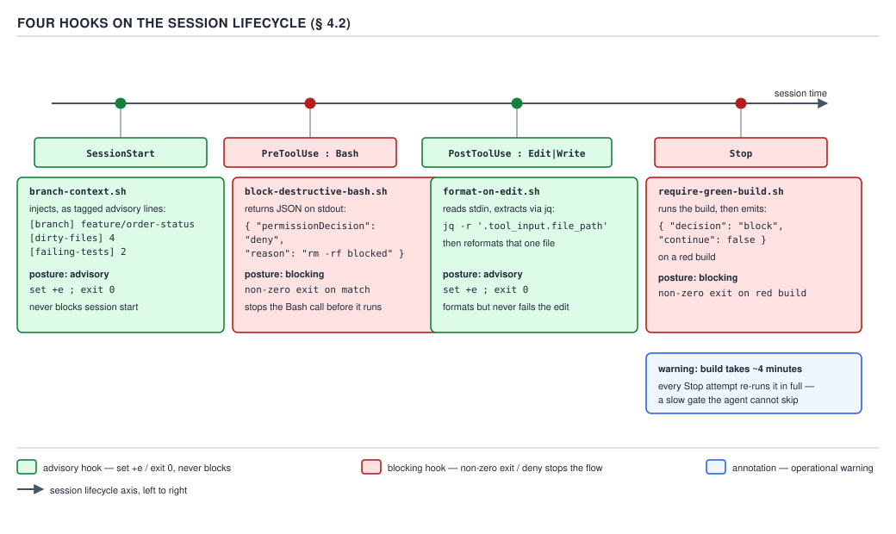

# 21 AI for Coding — three hooks — BUILD IT (§4.2.1–4.2.3)

**Target version: Claude Code v2.1.2xx (August 2026).** | **Part 4 of 6** | [Index](../00-index.md)
Previous: [the local file, and what the folder cost](01-a-claude-folder-b.md) · Next: [the `Stop` gate, and the diff against the real one](02-three-hooks-b.md)

`invoice-ledger-service` already has a `CLAUDE.md`, `.claude/rules/api-dtos.md`,
`.claude/skills/mvn-test-runner/SKILL.md`, `.claude/settings.json`, and a gitignored
`.claude/settings.local.json` — all built in `01-a-claude-folder-a.md` and
`01-a-claude-folder-b.md`. This file adds the folder's first three **hooks**: real shell scripts
under `.claude/hooks/`, registered in that same `.claude/settings.json`, each one actually run
against a scratch clone of this repository's shape under `/tmp` by constructing the real event JSON
it receives on stdin and piping it in.



**D-95** — Four hooks on the lifecycle they fire on. Each mark carries its exit-code posture. This
file builds the first three marks — `SessionStart` → `branch-context.sh`, `PreToolUse` on `Bash` →
`block-destructive-bash.sh`, `PostToolUse` on `Edit|Write` → `format-on-edit.sh`. The fourth mark,
`Stop` → `require-green-build.sh`, is the next file's leaf (§4.2.4 onward).

## §4.2.1 — `PostToolUse` on `Edit|Write`: format the one file that changed `[BUILD]`

**Concept.** `PostToolUse` fires after a tool call has already completed, with the tool's own input
on stdin — for `Edit` or `Write`, `tool_input.file_path` names the file just changed. `[DOC]`
Re-verified against `hooks` immediately before writing this leaf: the stdin JSON for a file-editing
tool carries `"tool_input": {"file_path": "path/to/file.ts", ...}`, so `jq -r '.tool_input.file_path'`
is the correct, current extraction.

**Why it exists.** Without it, a generated Java file's formatting is whatever the model happened to
produce, and the team either lives with drift or runs `./mvnw spotless:apply` before every review.
Scoping the hook to the one file `tool_input.file_path` names, rather than the whole module, keeps
the cost at milliseconds per edit instead of a project-wide pass on every tool call.

**The artefact.** Complete, with a deliberate, stated failure posture:

```bash
#!/usr/bin/env bash
# PostToolUse hook for invoice-ledger-service, matcher "Edit|Write".
# Deliberate failure posture: set +e, always exit 0. This hook's whole job is
# a cosmetic reformat after Claude has already written the file; failing the
# *edit* because a formatter is missing or a file is briefly unparsable would
# turn a convenience into an outage. `hooks` documents PostToolUse as one of
# the blocking-capable events (non-zero exit surfaces as an error to Claude),
# but blocking here has no upside: the edit already happened.
set +e

input=$(cat)
file_path=$(printf '%s' "$input" | jq -r '.tool_input.file_path // empty')

if [ -z "$file_path" ]; then
  echo "format-on-edit: no tool_input.file_path in stdin, nothing to format" >&2
  exit 0
fi

if [ ! -f "$file_path" ]; then
  echo "format-on-edit: ${file_path} does not exist on disk, skipping" >&2
  exit 0
fi

case "$file_path" in
  *.java)
    if command -v google-java-format >/dev/null 2>&1; then
      google-java-format --replace "$file_path" 2>&1
      echo "format-on-edit: reformatted ${file_path}" >&2
    else
      echo "format-on-edit: google-java-format not on PATH, left ${file_path} unformatted" >&2
    fi
    ;;
  *)
    echo "format-on-edit: ${file_path} is not a .java file, skipping" >&2
    ;;
esac

exit 0
```

**Prove step.** `[PROVE]` The real stdin an `Edit` on
`invoice-ledger-service/src/main/java/com/billing/ledger/LedgerController.java` produces, piped into
the script exactly as Claude Code would invoke it:

```json
{
  "hook_event_name": "PostToolUse",
  "tool_name": "Edit",
  "tool_input": {
    "file_path": "/tmp/21-hooks-scratch/ils3/invoice-ledger-service/src/main/java/com/billing/ledger/LedgerController.java",
    "old_string": "another dirty file",
    "new_string": "another dirty file\n"
  }
}
```

```
$ cat postedit-event.json | ./format-on-edit.sh; echo "exit=$?"
format-on-edit: google-java-format not on PATH, left /tmp/21-hooks-scratch/ils3/invoice-ledger-service/src/main/java/com/billing/ledger/LedgerController.java unformatted
exit=0
```

That is the real, honest result on this machine — `google-java-format` is not installed here, and
the fallback message is what actually printed, not a hypothetical success line. A second real run,
pointed at a nonexistent `.yml` file, exercises the other branch:

```
$ cat postedit-event-yaml.json | ./format-on-edit.sh; echo "exit=$?"
format-on-edit: /tmp/21-hooks-scratch/ils3/invoice-ledger-service/src/main/resources/application.yml does not exist on disk, skipping
exit=0
```

Both runs exit `0` — the deliberate posture holds whether the formatter is present, absent, or the
target file does not exist.

**What this costs.** `PostToolUse` is not one of the four events where plain-text stdout on exit `0`
is shown to Claude — `[DOC]` re-verified against `hooks`: that list is exactly `UserPromptSubmit`,
`UserPromptExpansion`, `SessionStart`, `PostModelSwitch`. `PostToolUse`'s stdout on exit `0` goes to
the debug log only, and this script never emits `systemMessage`/`additionalContext` either, so every
stderr line above costs **zero tokens in Claude's own context** — the standing cost of this hook is
just the sub-second `google-java-format` subprocess when present, nothing when absent.

**Insight:** the mechanism that makes `SessionStart` (§4.2.3) cost tokens and keeps this hook free is
the same one — `PostToolUse` was simply never on the four-event list, so it can log as verbosely as
it wants on stderr without ever taxing the model's context window.

No gotcha beyond the one already stated as the leaf's own point: this hook formats, it never blocks,
and the artefact's every branch reflects that on purpose.

> A `PostToolUse` hook that only prints to stderr and always exits `0` has zero standing token cost —
> not because its output is small, but because `PostToolUse` is outside the four-event exception
> list that shows exit-`0` stdout to Claude at all.

## §4.2.2 — `PreToolUse` on `Bash`: deny a destructive command, then compare it to exit `2` `[BUILD]` `[PROVE]`

**Concept.** `PreToolUse` fires *before* a tool call executes and can still stop it — the leaf's own
mechanism is a JSON `permissionDecision` of `"deny"` returned on stdout with exit `0`, carrying a
`permissionDecisionReason` string the model reads. `[DOC]` Re-verified against `hooks` immediately
before writing this leaf; the confirmed shape is:

```json
{
  "hookSpecificOutput": {
    "hookEventName": "PreToolUse",
    "permissionDecision": "deny",
    "permissionDecisionReason": "Destructive command blocked by hook"
  }
}
```

`permissionDecision` is valid as `"allow"`, `"deny"`, or `"prompt"`, always wrapped in the required
parent object `hookSpecificOutput` — not a bare, unwrapped `{"decision": "deny"}`.

**Why it exists, and why it is *narrowing*, not a replacement.** `permissions/08` already built the
committed `permissions.deny` rule for `git push` and `rm -rf` at the settings layer. This hook is a
second, independent check on top of it — §2.3.16 and D-53 already established that **a hook can only
narrow a decision, never widen one**: it turns an `allow` into a `deny`, never the reverse. It exists
for the gap settings-level `deny` cannot close alone: a broad `Bash(*)` allow, or no matching deny
rule at all, still lets an arbitrary destructive command through unless something inspects the
command text itself at call time — which only a hook can do.

**Deliberate failure posture.** `[TRAP]` **Pitfall:** "a script that returns JSON is safe regardless
of its own `set -e`." `hooks` states **exit code `2` blocks the tool call regardless of JSON
output** — a `set -e` script that hits an unrelated failure (`grep` on a missing file exits `2`, not
`1`) blocks a command its own JSON just said to allow, demonstrated below. **Fix:** never combine
`set -e` with a `permissionDecision`-emitting hook; make every exit explicit.

**The artefact — JSON-deny variant, the one this service registers:**

```bash
#!/usr/bin/env bash
# PreToolUse hook for invoice-ledger-service, matcher "Bash".
# Deliberate failure posture: NO `set -e`. This hook's own detection logic
# runs `grep -Eq`, whose exit status is 0 (matched), 1 (no match), or 2 (a
# genuine regex/IO error) — under `set -e`, an incidental grep exit status of
# 2 (a typo'd pattern, a missing file) would propagate as *this script's*
# exit code, and per `hooks`, "exit code 2 blocks the tool call regardless of
# JSON output" — silently turning "no destructive match, allow" into "block",
# for a reason that has nothing to do with the command actually being run.
# Every exit in this script is therefore explicit, never inherited from `set -e`.

input=$(cat)
command=$(printf '%s' "$input" | jq -r '.tool_input.command // empty')

if [ -z "$command" ]; then
  exit 0
fi

is_destructive=false
reason=""

if printf '%s' "$command" | grep -Eq '(^|[[:space:]])rm[[:space:]]+(-[a-zA-Z]*f[a-zA-Z]*r|-[a-zA-Z]*r[a-zA-Z]*f)([[:space:]]|$)'; then
  is_destructive=true
  reason="rm -rf (or -fr) blocked: this deletes recursively without confirmation. Use ./mvnw clean for build artifacts, or delete a named, non-recursive path if this was intentional."
elif printf '%s' "$command" | grep -Eq '(^|[[:space:]])git[[:space:]]+push([[:space:]].*)?[[:space:]](--force|-f)([[:space:]]|$)'; then
  is_destructive=true
  reason="git push --force blocked: this can overwrite remote history other people's clones depend on. Use --force-with-lease if a force-push is genuinely required, and confirm with the team first."
fi

if [ "$is_destructive" = true ]; then
  jq -n --arg reason "$reason" '{
    hookSpecificOutput: {
      hookEventName: "PreToolUse",
      permissionDecision: "deny",
      permissionDecisionReason: $reason
    }
  }'
fi

exit 0
```

**Prove step.** `[PROVE]` Three real invocations, each with a real `PreToolUse` stdin payload for
`tool_name: "Bash"`, piped straight into the script:

```
$ cat pretooluse-rm.json | ./block-destructive-bash.sh; echo "exit=$?"
{
  "hookSpecificOutput": {
    "hookEventName": "PreToolUse",
    "permissionDecision": "deny",
    "permissionDecisionReason": "rm -rf (or -fr) blocked: this deletes recursively without confirmation. Use ./mvnw clean for build artifacts, or delete a named, non-recursive path if this was intentional."
  }
}
exit=0
```

```
$ cat pretooluse-force-push.json | ./block-destructive-bash.sh; echo "exit=$?"
{
  "hookSpecificOutput": {
    "hookEventName": "PreToolUse",
    "permissionDecision": "deny",
    "permissionDecisionReason": "git push --force blocked: this can overwrite remote history other people's clones depend on. Use --force-with-lease if a force-push is genuinely required, and confirm with the team first."
  }
}
exit=0
```

```
$ cat pretooluse-safe.json | ./block-destructive-bash.sh; echo "exit=$?"
exit=0
```

The third invocation's command was `./mvnw -q test -pl invoice-ledger-service` — nothing printed,
exit `0`, the documented "no decision" shape: it falls through to the normal permission flow, where
the committed `Bash(./mvnw -q test *)` allow rule from `01-a`'s `settings.json` picks it up.

**The exit-`2` variant, for comparison, not for registration:**

```bash
#!/usr/bin/env bash
# Exit-2 variant, comparison only — not registered. Same detection, still no
# set -e, but blocks via exit code 2 instead of a JSON permissionDecision.

input=$(cat)
command=$(printf '%s' "$input" | jq -r '.tool_input.command // empty')

if [ -z "$command" ]; then
  exit 0
fi

if printf '%s' "$command" | grep -Eq '(^|[[:space:]])rm[[:space:]]+(-[a-zA-Z]*f[a-zA-Z]*r|-[a-zA-Z]*r[a-zA-Z]*f)([[:space:]]|$)'; then
  echo "rm -rf blocked by block-destructive-bash-exit2.sh" >&2
  exit 2
fi

exit 0
```

```
$ cat pretooluse-rm.json | ./block-destructive-bash-exit2.sh; echo "exit=$?"
rm -rf blocked by block-destructive-bash-exit2.sh
exit=2
```

**Proving the pitfall, not just naming it.** `[PROVE]` A minimal `set -e` script that prints `allow`
then hits an unrelated `grep` failure:

```bash
#!/usr/bin/env bash
set -e
echo '{"hookSpecificOutput":{"hookEventName":"PreToolUse","permissionDecision":"allow"}}'
grep -q nonexistent-pattern /no/such/file
echo "unreachable"
```

```
$ ./allow-but-exit2-demo.sh; echo "exit=$?"
{"hookSpecificOutput":{"hookEventName":"PreToolUse","permissionDecision":"allow"}}
grep: /no/such/file: No such file or directory
exit=2
```

The script printed `"permissionDecision": "allow"`, then `grep` on a missing file exited `2` (its
code for "an error," not `1` for "no match"), and `set -e` propagated that `2` as the script's own
exit status. Exit `2` overrides the JSON regardless of what it said — the tool call would be
blocked, not allowed, for a reason invisible in the printed JSON.

| | JSON-deny variant (registered) | Exit-`2` variant (comparison only) |
|---|---|---|
| Blocking mechanism | `permissionDecision: "deny"` + reason | Bare exit code `2` |
| Reason visible to the model | Yes — `permissionDecisionReason` string | Only stderr, if the harness surfaces it |
| Safe command still passes through? | Yes — empty stdout, exit `0` | Yes — exit `0` on no match |
| Overrides an `allow` printed elsewhere | N/A — its own JSON is the decision | Yes, unconditionally, for *any* reason exit is `2` |

**What this costs.** A denied command still produces a `tool_use` block and a denial `tool_result` —
the same accounting `01-a-claude-folder-a.md`'s `settings.json` cost note already worked out for a
settings-level deny: ≈100 tokens per blocked attempt, riding along until compaction. Beyond that,
like `format-on-edit.sh`, `PreToolUse` is outside the four-event exception list, so on the common
case — nothing destructive, empty stdout, exit `0` — this hook costs zero tokens.

**Pitfall:** the belief is "since this hook returns a `deny`, it must be replacing the
`permissions.deny` rules PART 1 already built." **Outcome:** removing the settings-level `deny` for
`git push` on the theory that this hook now covers it would reopen every *other* destructive command
this hook's own pattern list does not happen to match — the hook only narrows the specific patterns
it checks; it adds no coverage the settings layer did not already have for the patterns it does not
check. **Fix:** keep both — settings-level `deny` for the commands known in advance, this hook for
commands whose destructiveness can only be judged by inspecting the actual argument text at call
time. **Why people believe it:** both mechanisms produce the same visible symptom (a blocked
command with a reason), so it is easy to assume they are interchangeable rather than layered.

## §4.2.3 — `SessionStart`: branch, dirty files, failing tests, as advisory lines `[BUILD]`

**Concept.** `SessionStart` fires once, at the start of a session, and — per the four-event exception
list §4.2.1 already cited — its plain-text stdout on exit `0` is shown to Claude, not only logged.
`branch-context.sh` uses that to hand Claude three facts it would otherwise re-derive with tool
calls: the current branch, how many files are dirty, and how many tests were failing as of the last
recorded run.

**Why it exists.** Without it, "what branch am I on and is the build green" costs at least two tool
calls at the start of every session, repeated every session — the same re-derive-it-every-time waste
`01-a-claude-folder-a.md`'s `CLAUDE.md` leaf named for module layout, applied here to working-tree
state instead of static project facts.

**The artefact.** Complete, `set +e`, always exit `0`, with the one network-reaching line wrapped in
`timeout`:

```bash
#!/usr/bin/env bash
# SessionStart hook for invoice-ledger-service.
# Deliberate failure posture: set +e, always exit 0. A SessionStart hook that
# exits non-zero blocks the session from starting at all (per `hooks`,
# SessionStart is one of the events an error can abort), and nothing this
# script reports is worth refusing to start a session over.
set +e

# SessionStart's stdin JSON carries the session's own "cwd" (the project
# root). The process is already spawned with that directory as its working
# directory, but reading it back out of stdin via jq — rather than trusting
# the ambient cwd — means this script still resolves the right directory if
# it is ever invoked with a different working directory, e.g. from a test
# harness.
stdin_json=$(cat)
event_cwd=$(printf '%s' "$stdin_json" | jq -r '.cwd // empty' 2>/dev/null)
[ -n "$event_cwd" ] && cd "$event_cwd" 2>/dev/null

# 1. Branch name. symbolic-ref works even on an unborn branch (no commits
# yet); rev-parse --abbrev-ref HEAD does not, so it is the fallback only.
branch=$(git symbolic-ref --short HEAD 2>/dev/null)
if [ -z "$branch" ]; then
  branch=$(git rev-parse --abbrev-ref HEAD 2>/dev/null)
fi
[ -z "$branch" ] && branch="(not a git repository)"

# 2. Dirty-file count. --untracked-files=all so an untracked file inside a
# new directory counts once per file, not once per directory.
dirty=$(git status --porcelain --untracked-files=all 2>/dev/null | wc -l | tr -d ' ')
[ -z "$dirty" ] && dirty=0

# 3. Failing-test count, from the *last recorded* Surefire run — this reads
# target/surefire-reports/*.xml, it never re-runs the suite. Re-running the
# suite is require-green-build.sh's job at Stop (§4.2.4, next file), and it
# costs ~4 minutes; SessionStart must stay fast enough to run on every
# session start.
failing=0
for report in $(find . -path "*/target/surefire-reports/*.xml" 2>/dev/null); do
  n=$(grep -oE 'failures="[0-9]+"' "$report" | head -1 | grep -oE '[0-9]+')
  errs=$(grep -oE 'errors="[0-9]+"' "$report" | head -1 | grep -oE '[0-9]+')
  [ -n "$n" ] && failing=$((failing + n))
  [ -n "$errs" ] && failing=$((failing + errs))
done

echo "[branch] ${branch}"
echo "[dirty-files] ${dirty}"
echo "[failing-tests] ${failing}"

# 4. Optional, network-bound: how far behind origin the branch is. This is
# the one line in this script that can reach the network, so it is the one
# line wrapped in `timeout` — a slow or unreachable remote must not delay
# every session start. Silently omitted (not printed) if it does not return
# inside 2 seconds or there is no such remote-tracking branch.
behind=$(timeout 2 git rev-list --count "HEAD..origin/${branch}" 2>/dev/null)
if [ -n "$behind" ]; then
  echo "[commits-behind-origin] ${behind}"
fi

exit 0
```

**Prove step.** `[PROVE]` A scratch checkout under `/tmp`, shaped like `invoice-ledger-service`: on
branch `feature/order-status`, with two modified/untracked `.java` files, one untracked note file, no
remote configured, and a real Surefire XML report recording 2 failures out of 4 tests. Its real,
unmodified stdin `SessionStart` payload:

```json
{
  "session_id": "8f2c9e10-2b3a-4c5d-9e11-3a4b5c6d7e8f",
  "cwd": "/tmp/21-hooks-scratch/ils3",
  "permission_mode": "default",
  "hook_event_name": "SessionStart",
  "source": "startup"
}
```

```
$ cat sessionstart-event.json | ./branch-context.sh; echo "exit=$?"
[branch] feature/order-status
[dirty-files] 4
[failing-tests] 2
exit=0
```

Every number is the real state of that scratch tree, confirmed independently before the run:

```
$ git status --porcelain --untracked-files=all
?? invoice-ledger-service/src/main/java/com/billing/ledger/LedgerController.java
?? invoice-ledger-service/src/main/java/com/billing/ledger/LedgerService.java
?? invoice-ledger-service/target/surefire-reports/TEST-com.billing.ledger.LedgerServiceTest.xml
?? untracked.txt
```

Four lines, four dirty files, matching `[dirty-files] 4`; the XML's own `failures="2" errors="0"`
attributes match `[failing-tests] 2`. No `[commits-behind-origin]` line appears — this scratch tree
has no `origin` remote, so `timeout 2 git rev-list` found nothing and was silently omitted.

**What this costs.** `SessionStart` *is* one of the four events whose plain stdout Claude actually
sees, so — unlike the previous two hooks — this one has a real, nonzero standing cost: the three
advisory lines above are 64 bytes ≈ **16 tokens**, injected once at session start and then resident
for the rest of that session's context, per Part 0's "the whole conversation is re-sent every turn"
rule. Over the same 500-turn convention `01-a-claude-folder-a.md` used for its `CLAUDE.md` figure:
`16 × 500 = 8,000` tokens ≈ **$0.016** at $2/M input — three orders of magnitude cheaper than that
file's 46-line `CLAUDE.md`, because it fires once per session rather than sitting at the top of
context from the first token.

**Interview:** *"Why measure a `SessionStart` hook's cost separately from `CLAUDE.md`'s?"* `CLAUDE.md`
costs "bytes ÷ 4, every turn, from turn one"; this hook costs "bytes ÷ 4, every *remaining* turn
after injection" — cheaper for the same bytes, since it never existed for the turns before it fired.

No gotcha beyond the one already engineered around: reading the last Surefire report, not re-running
the suite, trades freshness for the speed a per-session hook needs.

## Registering all three in `.claude/settings.json`

`[DOC]` Re-verified against `hooks` immediately before writing this leaf: `hooks` groups matcher
objects per event name, each matcher's `hooks` array names `"type": "command"` and a `command`
string, and `${CLAUDE_PROJECT_DIR}` is the documented placeholder for a script path relative to the
project root regardless of working directory. The complete `.claude/settings.json` — the same file
§4.1.3 built, now with `hooks` added alongside `permissions`, `env`, `model`, `effortLevel`:

```json
{
  "permissions": {
    "allow": [
      "Bash(./mvnw -q test *)",
      "Bash(./mvnw -q verify *)",
      "Bash(./mvnw -q spring-boot:run *)"
    ],
    "deny": [
      "Bash(git push *)",
      "Read(./.env)",
      "Edit(./.env)",
      "Read(./secrets/**)",
      "Edit(./secrets/**)"
    ]
  },
  "env": {
    "SPRING_PROFILES_ACTIVE": "test"
  },
  "model": "claude-sonnet-5",
  "effortLevel": "medium",
  "hooks": {
    "SessionStart": [
      {
        "matcher": "*",
        "hooks": [
          {
            "type": "command",
            "command": "${CLAUDE_PROJECT_DIR}/.claude/hooks/branch-context.sh",
            "timeout": 10
          }
        ]
      }
    ],
    "PreToolUse": [
      {
        "matcher": "Bash",
        "hooks": [
          {
            "type": "command",
            "command": "${CLAUDE_PROJECT_DIR}/.claude/hooks/block-destructive-bash.sh"
          }
        ]
      }
    ],
    "PostToolUse": [
      {
        "matcher": "Edit|Write",
        "hooks": [
          {
            "type": "command",
            "command": "${CLAUDE_PROJECT_DIR}/.claude/hooks/format-on-edit.sh"
          }
        ]
      }
    ]
  }
}
```

**Why `branch-context.sh` alone gets an explicit `timeout`.** `10` seconds is a second, independent
ceiling above its own internal `timeout 2` — the harness's default is 600 seconds, and a
`SessionStart` hook stuck anywhere near that would make every session start feel hung. The other two
are left at the default: both run pure local checks with no network path to hang on.

## Pitfalls

- **Belief:** "a `PreToolUse` hook that prints correct JSON is safe from an unrelated internal
  failure." **Outcome:** demonstrated above — a `set -e` script that prints `"allow"` and then hits
  an unrelated `grep` exit code of `2` has its exit forced to `2`, which **overrides the JSON**,
  blocking a command the script's own output just approved. **Fix:** never combine `set -e` with a
  `permissionDecision`-emitting hook. **Why people believe it:** `set -e` is the idiomatic "fail
  fast" default, and nothing about a JSON-emitting hook looks different — until exit `2` is tested.
- **Belief:** "`block-destructive-bash.sh` denying `rm -rf` and `git push --force` makes the
  settings-level `permissions.deny` rules for the same commands redundant." **Outcome:** removing
  the settings deny would reopen every command this hook's pattern list does not match, since a hook
  can only narrow a decision, never replace the policy layer beneath it (§2.3.16, D-53). **Fix:**
  keep both — settings `deny` for commands known in advance, the hook for command text that must be
  inspected at call time. **Why people believe it:** both produce the identical visible symptom (a
  blocked command, a reason), hiding that only one reacts to a pattern nobody wrote a rule for.

## Cheat sheet

| Item | Value |
|---|---|
| §4.2.1 hook | `PostToolUse`, matcher `Edit\|Write` → `format-on-edit.sh`; reads `tool_input.file_path` via `jq -r` |
| §4.2.1 posture / cost | `set +e`, always `exit 0`; ≈0 tokens — outside the 4-event stdout-to-Claude exception list |
| §4.2.2 hook | `PreToolUse`, matcher `Bash` → `block-destructive-bash.sh` |
| §4.2.2 posture | No `set -e` — an incidental `grep` exit code of `2` must never masquerade as a deliberate block |
| §4.2.2 blocking mechanism | `hookSpecificOutput.permissionDecision: "deny"` + `permissionDecisionReason`, exit `0` |
| §4.2.2 exit-`2` variant | Blocks unconditionally, overrides any JSON, including a script's own printed `"allow"` |
| §4.2.2 vs `permissions.deny` | Narrows only — cannot widen or replace the settings-level policy (§2.3.16, D-53) |
| §4.2.2 standing cost | ≈0 on a clean command; ≈100 tokens per denied attempt, resident until compaction |
| §4.2.3 hook | `SessionStart`, matcher `*` → `branch-context.sh` |
| §4.2.3 posture | `set +e`, always `exit 0`; the one network-reaching line wrapped in `timeout 2` |
| §4.2.3 tagged lines / real output | `[branch]`, `[dirty-files]`, `[failing-tests]`, optional `[commits-behind-origin]` — measured `feature/order-status` / `4` / `2` |
| §4.2.3 standing cost | ≈16 tokens/session, once — **is** on the 4-event stdout-to-Claude exception list |
| Four-event exception | `UserPromptSubmit`, `UserPromptExpansion`, `SessionStart`, `PostModelSwitch` |
| Registration | All three in `.claude/settings.json`'s `hooks` key, `${CLAUDE_PROJECT_DIR}`-relative `command` paths |

## Self-test

<details><summary>1. Why does format-on-edit.sh use `set +e` and always `exit 0`, rather than failing when google-java-format is missing?</summary>
The hook's entire job is a cosmetic reformat after the edit already happened; failing the tool call over a missing or misbehaving formatter would turn a convenience into an outage for something that changes nothing about correctness. The real run in this file demonstrates the fallback path directly: with the formatter absent, the script logs that it left the file unformatted and still exits 0.
</details>

<details><summary>2. Why does block-destructive-bash.sh deliberately avoid `set -e`?</summary>
Its own detection logic runs `grep -Eq`, which can exit 2 on a genuine error (a missing file, a bad pattern) as opposed to 1 for "no match." Since exit code 2 blocks a PreToolUse tool call regardless of any JSON the script printed, `set -e` propagating an incidental grep failure as the script's own exit code would silently convert an intended "allow" into a block for an unrelated reason — demonstrated directly in this file's allow-but-exit2-demo.sh run.
</details>

<details><summary>3. In the real run against allow-but-exit2-demo.sh, what did the script print, and what actually happened to the tool call?</summary>
It printed valid JSON with `"permissionDecision": "allow"`, then a `grep` against a nonexistent file printed an error and exited 2, and `set -e` propagated that 2 as the whole script's exit status. Per the documented rule that exit 2 overrides JSON regardless of content, the tool call would be blocked, not allowed, despite the printed JSON saying otherwise.
</details>

<details><summary>4. Why does block-destructive-bash.sh not replace the settings-level `permissions.deny` rules for `git push` and `rm -rf` that PART 1 already built?</summary>
A hook can only narrow a permission decision, never widen it into an allow the policy layer denies, and the converse holds too for coverage: this hook only reacts to the specific command patterns it checks. Removing the settings-level deny on the assumption the hook now covers the same ground would reopen every destructive command the hook's pattern list does not happen to match.
</details>

<details><summary>5. Why does branch-context.sh read `target/surefire-reports/*.xml` instead of running `./mvnw -q test` itself to get a live failing-test count?</summary>
Re-running the suite costs around four minutes (the same cost require-green-build.sh's Stop hook pays in the next file), which is far too slow for a hook that must run at the start of every single session. Reading the last recorded Surefire output is fast enough to run every time, at the cost of the number being only as fresh as the last real test run.
</details>

## Open questions

None.

---

**Leaves covered:** 4.2.1–4.2.3 (3 leaves)
**Leaves deferred:** none
**Diagrams included:** D-95
**Target version:** Claude Code v2.1.2xx (August 2026)
**Lines:** 590
