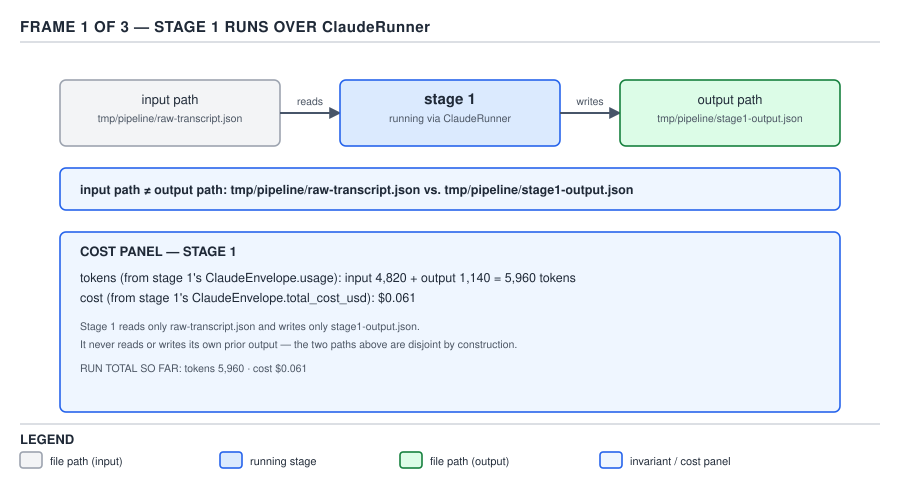
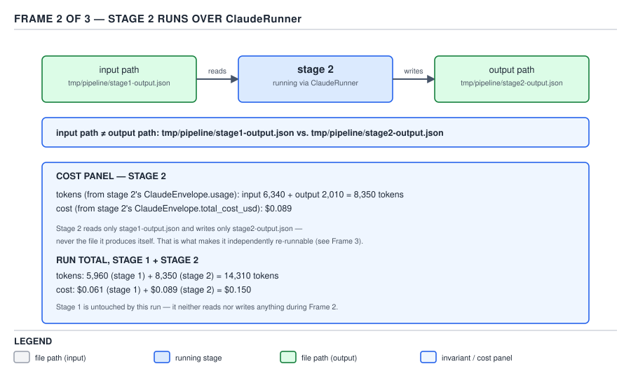
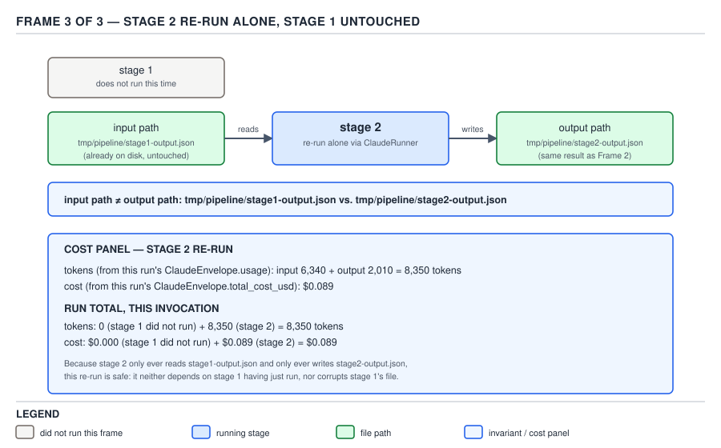

# 21 AI for Coding — the bulkhead and the bounded retry — BUILD IT (§4.5.5–4.5.6)

**Target version: Claude Code v2.1.2xx (August 2026).** | **Part 4 of 6** | [Index](../00-index.md)
Previous: [absolute settings, and resolution order](05-orchestrator-b-ceilings-and-resolution.md) · Next: [the per-stage cost report, and the diff against the real one](06-orchestrator-d-pipeline-and-cost.md)

The previous two files built `ClaudeRunner` up through a `--settings <absolute path>` override and a
parameter → environment → default resolution chain that keeps an explicit `0` alive. Both of those
files pointed forward to this one for a fact they had already run into but not yet fixed: `run()`
throws `AgentTurnLimitException` and `AgentBudgetExceededException` with only a message string, and
the `ClaudeEnvelope` — cost, tokens, everything the call actually spent — that `toEnvelope()` had
already built one line earlier is thrown away with the stack unwind. This file closes that gap, adds
a `Semaphore` bulkhead, and then builds a second artifact on top of the finished class: a two-stage
pipeline that proves its own independence by being re-run.

## Two rings around `ClaudeRunner.run()` — a classified retry and a bulkhead [BUILD] [JAVA] [X-REF 05] (§4.5.5)

### Mental model

A retry and a bulkhead are both rings drawn around the same method call, but they answer different
questions. The retry asks "should I try this again?" — a question with three different right answers
depending on *why* the last attempt failed. The bulkhead asks a question that has nothing to do with
failure at all: "how many of these am I willing to have in flight from this process at once?" One ring
is about time — the same call, tried more than once. The other is about space — many different calls,
bounded in how many run together. Both wrap `run()`; neither replaces it.

### Why they exist

The retry exists because `headless/03-internals-c-the-failure-taxonomy.md` already established, from
the real `harness/src/harness/engine/agent.py`, that a subprocess wrapper gets three failure modes, not
one — launch/timeout (infrastructure), an unparseable envelope (a contract violation between expected
and actual stdout), and `is_error: true` (the agent ran and reported failure). Retrying all three
identically is the named mistake: a malformed envelope reproduces on every attempt, so a blanket retry
burns a full extra billed `claude -p` call proving something already known. **This file's retry
narrows what it retries** to only the class where trying again can plausibly change the outcome, rather
than mirroring every branch of the real Python loop — the divergence is named explicitly below.

The bulkhead exists for a reason this guide has already put numbers on twice: `subagents/02-cases-
dispatch-and-cost.md` (§2.1.19, D-46) priced a subagent's fixed per-dispatch tax, and `sub-agents/03-
internals-…` (§2.1.14, D-45) put the platform's own ceiling at **20 concurrent subagents, depth 3**.
Both are limits *something else* enforces. A `Semaphore` inside `ClaudeRunner` is a limit **this code
enforces on itself**, before either of those fires — the difference between discovering the hard way
that a fifty-task fan-out spent the month's budget in four minutes, and never letting fifty run at once.

### When to reach for each, and when not

Reach for the classified retry wherever `ClaudeRunner` runs unattended and a transient infrastructure
hiccup is plausible; skip it for an interactive call a human can re-run by hand. Reach for the bulkhead
wherever more than one call might be dispatched from the same JVM at once; skip it for a strictly
sequential caller, where a `Semaphore(1)` is just an uncontended lock.

**Pitfall:** believing a retry can only help. Every attempt multiplies spend on failure, and each
infrastructure retry still launches a full `claude -p` process. **Why people believe it:** REST-client
retry folklore assumes a failed call cost nothing; a failed `claude -p` call almost always already did.

**Pitfall:** believing a bulkhead only helps. It adds queueing latency once permits are exhausted, and
a `Semaphore` that stays fully checked out can hide a real capacity problem behind what looks, from the
caller's side, like ordinary latency rather than an alarm.

### How it works

The retry's classification, applied to `ClaudeRunner`'s own exception vocabulary:

| Failure | Java shape | Retried? | Why |
|---|---|---|---|
| Launch or timeout | `IOException` from `ProcessBuilder.start()`, or `AgentTimeoutException` from `run()` | Yes, up to the bound | The next attempt runs under conditions that may genuinely differ — this is the one class where trying again can change the outcome |
| Unparseable envelope | `run()` returns normally with `isError()==true`, no exception, `stdoutJson` holding raw unparsed text | No — terminal on first attempt | The same malformed stdout reproduces on every identical retry; nothing about a second attempt changes what the CLI printed |
| Agent-reported ceiling (`error_max_turns`, `error_max_budget_usd`) | `AgentTurnLimitException` / `AgentBudgetExceededException` | No — terminal on first attempt | The agent itself ran and reported why it stopped; the caller's own report is the answer, not a second identical attempt |

`[X-REF 05]` The bulkhead is a `Semaphore` — `05-multithreading-concurrency.md` (§ Sizing and shutdown)
owns the full model underneath it: fairness, `acquire`/`release`, why a permit is not owned by the
thread that acquired it, and how a bulkhead differs from a thread-pool size cap. Stated in full here:
`ClaudeRunner`'s `Semaphore` bounds how many of **this process's own** `claude -p` subprocesses run at
once, constructed fair (`new Semaphore(n, true)`) so callers queue FIFO under contention.

**Diff vs the real one.** `agent.py`'s loop actually retries more than this classification does: the
unparseable-envelope branch also `continue`s (retried, not terminal), and a general `is_error: true`
result is retried too — only `subtype == "error_max_turns"` is terminal. This Java version narrows
that: unparseable envelopes and every ceiling are terminal on first attempt. The real loop buys
resilience against transient agent-side flakiness at the cost of the multiplication this file's first
pitfall names; this narrower version buys predictable spend at the cost of surfacing more unretried
failures. Neither is "more correct" in the abstract — the real harness has an outer CI continuation
layer to catch what its inner loop doesn't; this `ClaudeRunner` assumes no such layer, so
terminal-by-default is the safer floor.

The subtle half of this leaf is not the loop's shape but what it retries *with*. Before this file,
`run()`'s ceiling branches threw a message-only exception, discarding the `ClaudeEnvelope` that
`toEnvelope()` had already built:

```java
if ("error_max_turns".equals(subtype)) {
    throw new AgentTurnLimitException(
            "claude -p hit --max-turns " + maxTurns + " before finishing", maxTurns);
}
```

That envelope carries `totalCostUsd` and `usage` for an API call that already happened and was already
billed. Throwing it away does not refund the call — it makes an already-spent attempt unbillable and
unauditable, the same failure mode `headless/03-internals-c-the-failure-taxonomy.md` names for the
Python `last = res` line. `ClaudeRunner`'s exceptions did not have that line's guarantee until this leaf.

### Code — the artefact for §4.5.5

Everything from §4.5.1–§4.5.4 is unchanged in its own right — `ClaudeEnvelope`, `parseOrCaptureSnippet`,
`toEnvelope`, `joinQuietly`, `StreamCapture`, the resolution helpers, and `run()`'s own body (only its
two `throw` sites gain one extra constructor argument, shown below). What §4.5.5 adds: one method on
the sealed interface, one field on two of the three exception classes, one field and one constructor
parameter on `ClaudeRunner`, and two public methods. `AgentTimeoutException`'s own fields and
constructor are unchanged; `envelope()` is added to the interface, and a carried `ClaudeEnvelope` field
to the other two exceptions:

```java
public sealed interface AgentCeilingException
        permits AgentTimeoutException, AgentTurnLimitException, AgentBudgetExceededException {
    Optional<ClaudeEnvelope> envelope();
}

public static final class AgentTimeoutException extends RuntimeException
        implements AgentCeilingException {
    public AgentTimeoutException(String message) {
        super(message);
    }

    @Override
    public Optional<ClaudeEnvelope> envelope() {
        return Optional.empty(); // no envelope: destroyForcibly() fires before any JSON exists
    }
}

public static final class AgentTurnLimitException extends RuntimeException
        implements AgentCeilingException {
    private final int maxTurns;
    private final ClaudeEnvelope envelope; // §4.5.5 addition

    public AgentTurnLimitException(String message, int maxTurns, ClaudeEnvelope envelope) {
        super(message);
        this.maxTurns = maxTurns;
        this.envelope = envelope;
    }

    public int maxTurns() {
        return maxTurns;
    }

    @Override
    public Optional<ClaudeEnvelope> envelope() {
        return Optional.of(envelope);
    }
}

public static final class AgentBudgetExceededException extends RuntimeException
        implements AgentCeilingException {
    private final double maxBudgetUsd;
    private final ClaudeEnvelope envelope; // §4.5.5 addition

    public AgentBudgetExceededException(String message, double maxBudgetUsd, ClaudeEnvelope envelope) {
        super(message);
        this.maxBudgetUsd = maxBudgetUsd;
        this.envelope = envelope;
    }

    public double maxBudgetUsd() {
        return maxBudgetUsd;
    }

    @Override
    public Optional<ClaudeEnvelope> envelope() {
        return Optional.of(envelope);
    }
}
```

`run()`'s two throw sites, changed by exactly one trailing argument each — everything above them in the
method (the process launch, the stream draining, `parseOrCaptureSnippet`, `toEnvelope`) is unchanged:

```java
if (envelope.isError()) {
    String subtype = (root != null && root.has("subtype")) ? root.get("subtype").asText() : "";
    if ("error_max_turns".equals(subtype)) {
        throw new AgentTurnLimitException(
                "claude -p hit --max-turns " + maxTurns + " before finishing", maxTurns, envelope);
    }
    if ("error_max_budget_usd".equals(subtype)) {
        throw new AgentBudgetExceededException(
                "claude -p hit --max-budget-usd " + maxBudgetUsd + " before finishing",
                maxBudgetUsd, envelope);
    }
}
return envelope;
```

The bulkhead field, its constructor parameter, and its resolution — added alongside the existing six
resolved knobs, none of which change:

```java
private static final int DEFAULT_MAX_CONCURRENT_RUNS = 4;
// No HARNESS_* env mirror for this one, deliberately — the real harness has no
// concurrency knob to parallel; this Semaphore bounds only this JVM's own
// concurrent ClaudeRunner.run() calls, a layer that exists solely on the Java side.

private final Semaphore bulkhead; // §4.5.5 addition, alongside the six existing final fields

private ClaudeRunner(int maxTurns, double maxBudgetUsd, Duration timeout,
                      String permissionMode, String settingSources, String settingsPath,
                      int maxConcurrentRuns) {
    this.maxTurns = maxTurns;
    this.maxBudgetUsd = maxBudgetUsd;
    this.timeout = timeout;
    this.permissionMode = permissionMode;
    this.settingSources = settingSources;
    this.settingsPath = settingsPath;
    this.bulkhead = new Semaphore(maxConcurrentRuns, true); // fair: FIFO under contention
}

public static ClaudeRunner resolve(Integer maxTurns, Double maxBudgetUsd, Long timeoutSeconds,
                                    String permissionMode, String settingSources, String settingsPath,
                                    Integer maxConcurrentRuns, Map<String, String> env) {
    // resolvedMaxTurns, resolvedTimeoutSeconds, resolvedPermissionMode,
    // resolvedSettingSources, resolvedSettingsPath, resolvedMaxBudgetUsd:
    // unchanged from §4.5.4 above this line.
    int resolvedMaxConcurrentRuns = maxConcurrentRuns != null ? maxConcurrentRuns : DEFAULT_MAX_CONCURRENT_RUNS;
    return new ClaudeRunner(resolvedMaxTurns, resolvedMaxBudgetUsd, Duration.ofSeconds(resolvedTimeoutSeconds),
            resolvedPermissionMode, resolvedSettingSources, resolvedSettingsPath, resolvedMaxConcurrentRuns);
}
```

The two new public methods — everything a caller needs to reach both rings:

```java
public ClaudeEnvelope runThroughBulkhead(String prompt) throws IOException, InterruptedException {
    bulkhead.acquire();
    try {
        return run(prompt);
    } finally {
        bulkhead.release();
    }
}

public ClaudeEnvelope runWithRetry(String prompt, int maxRetries) throws IOException, InterruptedException {
    int attempts = Math.max(1, maxRetries);
    for (int attempt = 1; attempt <= attempts; attempt++) {
        try {
            // A normal return is terminal either way: isError()==false is success,
            // isError()==true with no exception is the unparseable-envelope
            // contract failure — neither case loops again.
            return runThroughBulkhead(prompt);
        } catch (AgentTimeoutException infra) {
            if (attempt == attempts) {
                throw infra;
            }
        } catch (IOException launchFailure) {
            if (attempt == attempts) {
                throw launchFailure;
            }
        } catch (AgentTurnLimitException | AgentBudgetExceededException ceiling) {
            // Multi-catch's inferred type is the intersection RuntimeException &
            // AgentCeilingException, so ceiling.envelope() is callable with no cast.
            return ceiling.envelope().orElseThrow(() -> ceiling);
        }
    }
    throw new IllegalStateException("unreachable: runWithRetry always returns or throws inside the loop");
}
```

`run()` itself is called by both new methods and remains callable directly by a caller that wants
neither ring — nothing about it changed except the two `throw` sites' argument lists above.

### Prove it — §4.5.5

All three runs below are real, against the compiled class and the installed `claude 2.1.251`, from
`/tmp/claude-runner-test`:

```
$ java -cp "out:$CP" ClaudeRunner
[ClaudeRunner] attempt 1/3 hit a ceiling — agent-reported, terminal, not retried
runWithRetry on a turn-limited call returned an envelope, not an exception: isError=true totalCostUsd=0.0644655 usage={cache_read_input_tokens=13147, cache_creation_input_tokens=8744, output_tokens=90, input_tokens=2}
[ClaudeRunner] attempt 1/2 hit AgentTimeoutException — infrastructure, retrying
[ClaudeRunner] attempt 2/2 hit AgentTimeoutException — infrastructure, retrying (last attempt)
runWithRetry exhausted 2 attempts and rethrew AgentTimeoutException: claude -p did not exit within 0ms wall clock: claude -p Say PONG --output-format json --max-turns 20 --max-budget-usd 1.0 --permission-mode acceptEdits --setting-sources user,project
4 calls through 1 permit: 36112ms; 4 calls through 4 permits: 9079ms
```

`[PROVE]` Line by line: the first call used `--max-turns 1` against a prompt needing several tool-use
turns. `runWithRetry` caught `AgentTurnLimitException` on attempt 1, logged it terminal, and returned
`ceiling.envelope()` — a real envelope with `totalCostUsd=0.0644655` and non-zero `usage`, not a
discarded exception. Before this leaf's fix those numbers would have been unrecoverable.

The second call set `HARNESS_AGENT_TIMEOUT=0`, so `Process.waitFor(Duration.ZERO)` never succeeds.
`runWithRetry(..., 2)` logged both attempts, retried once (infrastructure classification applied to
`AgentTimeoutException`), and rethrew on the second — a bounded retry that actually bounds.

The third line is the bulkhead's proof, by wall clock rather than an internal counter: four cheap
single-turn calls (`"Say OK"`, `--max-turns 1`) took **36.1 seconds** through one permit and **9.1
seconds** through four — a **≈4×** difference for identical work, because `Semaphore(1)` forces
sequential execution while `Semaphore(4)` lets all four overlap. 9.1 seconds tracks the single-call
latency seen elsewhere in this file, confirming real overlap rather than faster back-to-back runs.

### What this costs

The turn-limited call billed **$0.0645** — real spend recovered by this leaf's fix rather than
discarded. The timeout-retry demonstration billed **nothing**: both attempts were killed before any API
call inside them could reach the network. The bulkhead demonstration's eight total calls were priced
cheap by construction (`--max-turns 1`, a two-word prompt) and billed on the order of **$0.01–$0.03**
combined — the point was latency, not spend.

**Insight:** a classified retry and a bulkhead compose without conflict because they operate on
different axes — `runWithRetry` calls `runThroughBulkhead` on every attempt, so a retried call still
respects the concurrency cap on each of its attempts, and a bulkheaded call that fails with an
infrastructure error still gets retried inside the same bound. Neither ring needs to know the other
exists.

No gotcha beyond the two pitfalls already stated in full above (retry multiplies spend on failure;
bulkhead adds queueing latency and can mask a capacity problem).

> A bounded retry classified by failure layer — retry infrastructure, surface a contract violation or
> an agent's own report immediately — paired with a `Semaphore` bulkhead that this process enforces on
> itself, are two independent rings around the same call: one bounds *how many times*, the other bounds
> *how many at once*, and a caller that discards the ceiling exceptions' preserved envelope has made an
> already-billed attempt unauditable regardless of which ring caught it.

## A two-stage pipeline, and proving the invariant by re-running it [BUILD] [PROVE] (§4.5.6)

### Mental model

Two programs connected by a file instead of a pipe: stage 1 reads one path and writes a different one;
stage 2 reads stage 1's output path and writes a third. Neither stage's write target is anything it
also reads. That is the whole mechanism — no queue, no shared process, no in-memory handoff — and it
is deliberately the least clever thing that could work, because the property this section exists to
demonstrate depends on exactly that simplicity.

### Why it exists

`orchestration/03-internals-a-shapes-and-fan-out.md` already states the invariant and its law: a stage
that edits what it reads stops being independently re-runnable, and a pipeline of such stages cannot be
resumed from the middle — a failure at stage 4 of 5 forces stages 1–3 to run again even though their
output was fine. This section's job is not to restate that law but to build the two-stage case and
**run the proof on the page**, because a law asserted without a demonstration is what `[PROVE]` forbids.

### How it works

Two small classes, `PipelineStage1` and `PipelineStage2`, each with its own `main`, each holding one
`ClaudeRunner` call. Stage 1's input is a real Java source excerpt — the `resolveMaxTurns` and
`brokenResolveMaxTurns` methods from §4.5.4, written to `/tmp/claude-runner-test/pipeline/input.txt` —
and its output is a code review of that excerpt. Stage 2's input is stage 1's output file, and its
output is a one-word severity classification of that review.



**D-97a** — Stage 1 running: it reads a fixed input path and writes to a different output path.

```java
public final class PipelineStage1 {
    public static void main(String[] args) throws IOException, InterruptedException {
        Path inputPath = Path.of("/tmp/claude-runner-test/pipeline/input.txt");
        Path outputPath = Path.of("/tmp/claude-runner-test/pipeline/stage1-review.txt");

        String sourceCode = Files.readString(inputPath);
        ClaudeRunner runner = ClaudeRunner.resolve(
                10, 1.00, 90L, "acceptEdits", "user,project", null, null, Map.of());
        String prompt = "Review these two Java methods for correctness bugs only. "
                + "Reply with at most 3 bullet points, no preamble:\n\n" + sourceCode;
        ClaudeRunner.ClaudeEnvelope envelope = runner.run(prompt);

        // Stage 1 writes only its own output file. It never touches inputPath.
        Files.writeString(outputPath, envelope.stdoutJson());
        System.out.println("stage1: wrote " + outputPath + " (isError=" + envelope.isError()
                + ", totalCostUsd=" + envelope.totalCostUsd() + ")");
    }
}
```

```java
public final class PipelineStage2 {
    private static final ObjectMapper MAPPER = new ObjectMapper();

    public static void main(String[] args) throws IOException, InterruptedException {
        Path stage1OutputPath = Path.of("/tmp/claude-runner-test/pipeline/stage1-review.txt");
        Path outputPath = Path.of("/tmp/claude-runner-test/pipeline/stage2-verdict.txt");

        // Stage 2 reads stage 1's output file. It never writes back to it.
        String stage1Envelope = Files.readString(stage1OutputPath);
        JsonNode root = MAPPER.readTree(stage1Envelope);
        String review = root.path("result").asText("");

        ClaudeRunner runner = ClaudeRunner.resolve(
                5, 1.00, 90L, "acceptEdits", "user,project", null, null, Map.of());
        String prompt = "A code review found the following. If it names a real correctness bug, "
                + "reply with exactly one word: CRITICAL. If it only suggests style or found nothing "
                + "wrong, reply with exactly one word: NONE. No other output.\n\n" + review;
        ClaudeRunner.ClaudeEnvelope envelope = runner.run(prompt);

        // Stage 2 writes only its own output file. It never writes back to stage1OutputPath.
        Files.writeString(outputPath, envelope.stdoutJson());
        System.out.println("stage2: read " + stage1OutputPath + ", wrote " + outputPath
                + " (isError=" + envelope.isError() + ", totalCostUsd=" + envelope.totalCostUsd() + ")");
    }
}
```

Each class reads exactly one path and writes exactly one different path; `input.txt` is read by stage 1
and by nothing else, `stage1-review.txt` is written by stage 1, read by stage 2, and written by nothing
else.



**D-97b** — Stage 2 running: it reads the file stage 1 wrote and writes to a third path of its own.
Neither stage's arrows point back at its own input.

### Prove it — §4.5.6

`[PROVE]` The full sequence, real, from `/tmp/claude-runner-test`, checksumming both files before and
after the critical step:

```
$ java -cp "out:$CP" PipelineStage1
stage1: wrote /tmp/claude-runner-test/pipeline/stage1-review.txt (isError=false, totalCostUsd=0.069836)

$ md5 -q pipeline/input.txt
0d27fb098310dd4c20b51b463badf0b0

$ java -cp "out:$CP" PipelineStage2
stage2: read /tmp/claude-runner-test/pipeline/stage1-review.txt, wrote /tmp/claude-runner-test/pipeline/stage2-verdict.txt (isError=false, totalCostUsd=0.06499724999999999)

$ md5 -q pipeline/stage1-review.txt
a6052b0d9b6669caf37bc264c34369e7

$ python3 -c "import json; print(json.load(open('pipeline/stage2-verdict.txt'))['result'])"
CRITICAL
```

The content stage 1 reviewed was the real `resolveMaxTurns`/`brokenResolveMaxTurns` pair from §4.5.4,
and the review named a genuine correctness point neither prior file called out: `Integer.parseInt` on a
malformed `HARNESS_AGENT_MAX_TURNS` throws an unhandled `NumberFormatException` instead of falling back
to the default, and neither method rejects a negative resolved value. Stage 2 classified it `CRITICAL`.

**The third run is the point of this leaf** — stage 2 alone, no stage 1 in between, same input file
untouched:

```
$ md5 -q pipeline/input.txt pipeline/stage1-review.txt
0d27fb098310dd4c20b51b463badf0b0
a6052b0d9b6669caf37bc264c34369e7

$ java -cp "out:$CP" PipelineStage2
stage2: read /tmp/claude-runner-test/pipeline/stage1-review.txt, wrote /tmp/claude-runner-test/pipeline/stage2-verdict.txt (isError=false, totalCostUsd=0.01254)

$ md5 -q pipeline/input.txt pipeline/stage1-review.txt
0d27fb098310dd4c20b51b463badf0b0
a6052b0d9b6669caf37bc264c34369e7

$ python3 -c "import json; print(json.load(open('pipeline/stage2-verdict.txt'))['result'])"
CRITICAL
```

Both checksums are identical before and after the standalone re-run — `input.txt` and
`stage1-review.txt` are byte-for-byte what stage 1 left them, because `PipelineStage2` never opens
either path for writing. The verdict is `CRITICAL` again, reached from the same stage-1 text on a fresh
`claude -p` process with no memory of the first stage-2 run. This is the invariant demonstrated rather
than asserted: **stage 2 is independently re-runnable** — launched alone, against an artifact stage 1
left on disk an hour or a deploy ago, it produces the same judgment, because nothing in stage 1's
output was disturbed for it to react to.



**D-97c** — Stage 2 re-run alone. The checksum of stage 1's output file is identical before and after;
the verdict file's content matches the first run. Stage 1 never executes in this diagram at all.

A cost panel per stage — tokens and dollars read out of each envelope, plus the run total across all
three invocations above — is **§4.5.7's material**, built in the next file; it is not built here.

### What this costs

Stage 1's review call billed **$0.0698**. Stage 2's first classification billed **$0.0650**; its
standalone re-run billed **$0.0125** — roughly a fifth, consistent with the warm-cache effect §4.5.1
already measured (`cache_read_input_tokens` reused against an already-paid-for prompt prefix).
Re-running stage 2 alone is not free — every re-run is a fresh billed call — but it is far cheaper than
re-running the whole pipeline from stage 1 to verify the same fact, which is the property a resumable
pipeline is for.

No gotcha beyond the one `orchestration/03-internals-a-shapes-and-fan-out.md` already names in full:
a stage that edited its own input here would still "work" on the first run and would silently corrupt
the second.

> A pipeline stage is independently re-runnable exactly when it never writes to the path it reads —
> proved here by re-running stage 2 alone against stage 1's untouched artifact and observing an
> unchanged checksum on that artifact and the same verdict, not by asserting the property and moving on.

**What the next file adds:** §4.5.7–4.5.8, `build-it/06-orchestrator-d-pipeline-and-cost.md` — the
per-stage cost report this file's D-97 cost panel deferred, reading tokens and dollars back out of each
stage's own envelope, plus a **Diff vs the real one** table against `harness/src/harness/engine/`'s own
pipeline stages.

## Pitfalls

- **Belief:** a blanket `catch (Exception e) { retry(); }` around a `claude -p` call is safe. **Symptom:**
  an unparseable envelope — which reproduces identically every attempt — gets retried anyway, spending a
  full extra billed call to learn nothing new. **Fix:** classify by failure layer — retry only
  launch/timeout, treat an unparseable envelope and every ceiling as terminal on first attempt. **Why
  people believe it:** REST-client retry folklore assumes a failed call cost nothing.
- **Belief:** a bigger `Semaphore` permit count is strictly safer. **Symptom:** `Semaphore(50)` in front
  of fifty dispatches removes the one control this code had over blast radius, leaving only the
  platform's 20-concurrent ceiling and the total budget as backstops — both firing only after the spend
  already happened. **Fix:** size permits to the caller's actual concurrency budget, not "as high as the
  platform allows." **Why people believe it:** a bulkhead reads as pure protection.
- **Belief:** discarding a thrown `AgentTurnLimitException` loses nothing because "the call failed."
  **Symptom:** the `ClaudeEnvelope` it already produced — real cost, real usage — is unrecoverable past a
  `catch` block that only reads `getMessage()`, though the call was already billed in full. **Fix:** call
  `.envelope()` on any caught `AgentCeilingException`; `runWithRetry` does this automatically. **Why
  people believe it:** "the call failed" reads as "nothing happened."

## Cheat sheet

| Concern | Mechanism | Detail |
|---|---|---|
| Retryable failure | `AgentTimeoutException`, `IOException` from process launch | Infrastructure; next attempt may run under different conditions |
| Terminal, not retried | unparseable envelope (`isError()==true`, no exception); `AgentTurnLimitException`; `AgentBudgetExceededException` | Contract violation or agent's own report; retrying cannot change either |
| Envelope preservation | `AgentCeilingException.envelope()` | Both ceiling exceptions now carry the real `ClaudeEnvelope`; `runWithRetry` unwraps it instead of discarding it with the exception |
| Concurrency cap | `Semaphore(n, true)` in `runThroughBulkhead` | Fair queueing; bounds this JVM's own concurrent `claude -p` subprocesses |
| Composition | `runWithRetry` calls `runThroughBulkhead` on every attempt | Each retried attempt still respects the concurrency cap |
| Pipeline invariant | neither stage writes its own input path | Makes each stage independently re-runnable, proven by re-running stage 2 alone |
| Proof method | `md5` on both files, before and after a standalone stage-2 run | Both checksums unchanged; the verdict matched across runs |
| Real divergence from the harness | this file's retry treats unparseable + all ceilings as terminal; `agent.py`'s loop retries both, carving out only `error_max_turns` | This version trades resilience for predictable spend and no outer continuation layer to assume |

## Self-test

<details><summary>1. Why does this file's retry treat an unparseable envelope as terminal, when the real `run_agent` loop in `agent.py` retries it?</summary>
Different tradeoffs, not different facts: the real loop retries unparseable envelopes and general
`is_error` results, carving out only `error_max_turns` as terminal, buying resilience at the cost of
multiplying spend on failures that reproduce identically. This `ClaudeRunner` treats unparseable
envelopes and every ceiling as terminal on first attempt, because it assumes no outer CI continuation
layer to catch what an internal retry would otherwise mask.
</details>

<details><summary>2. What was thrown away before this leaf's fix, every time `run()` hit a turn or budget ceiling?</summary>
The `ClaudeEnvelope` `toEnvelope()` had already built one line before the `throw` — `totalCostUsd` and
the token `usage` map for a call already billed. The exception carried only a message string, so the
caller could not recover those figures once it propagated.
</details>

<details><summary>3. Why does `runWithRetry` call `runThroughBulkhead` rather than `run` directly on each attempt?</summary>
So the concurrency cap applies to every attempt of a retried call, not only the first — the bulkhead
exists to bound this process's total in-flight `claude -p` subprocesses at any instant, retries included.
</details>

<details><summary>4. The bulkhead proof measured 36.1 seconds through one permit and 9.1 through four. What would blur that ratio?</summary>
Wildly different per-call durations: with one permit, total time is still the sum of all four durations,
but with four permits the wall-clock total tracks the *slowest* single call, not the sum — one slow call
among three fast ones would show far less than a 4× difference even with the bulkhead working correctly.
</details>

<details><summary>5. Why is re-running stage 2 alone a stronger proof of independent re-runnability than re-running the whole pipeline?</summary>
Re-running the whole pipeline re-runs stage 1 too, which cannot distinguish "stage 2 is independently
re-runnable" from "the pipeline happens to be consistent end to end." Running stage 2 alone, against an
artifact already sitting on disk from an earlier run, isolates exactly the claim: stage 2's execution
does not depend on stage 1 having just run, only on stage 1's output still existing unchanged.
</details>

## Open questions

None.

---

**Leaves covered:** 4.5.5–4.5.6 (2 leaves)
**Leaves deferred:** none
**Diagrams included:** D-97a, D-97b, D-97c
**Target version:** Claude Code v2.1.2xx (August 2026)
**Lines:** 567
