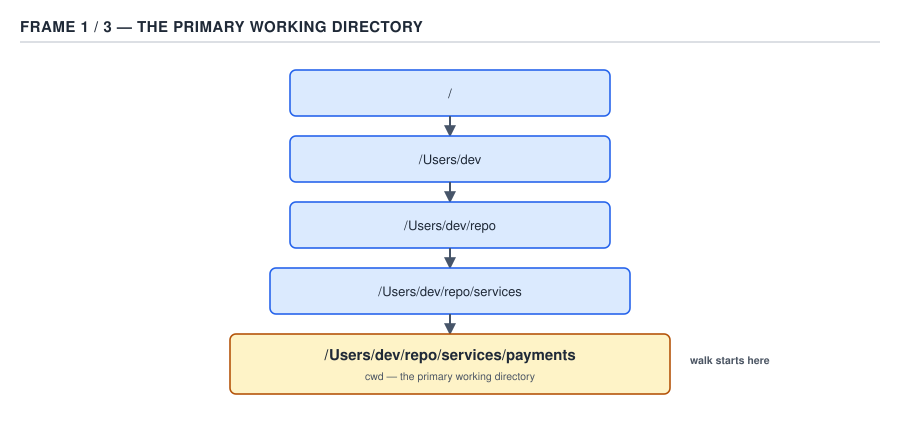
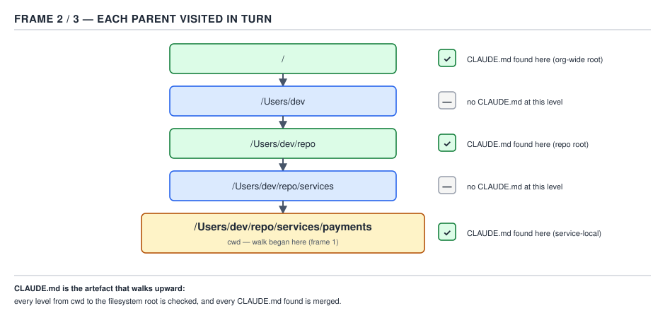
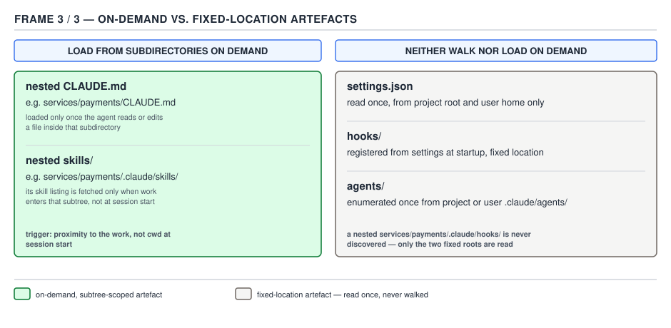

# 21 AI for Coding — the `.claude` folder — BASICS (§1.1)

**Target version: Claude Code v2.1.2xx (August 2026).** | **Part 1 of 6** | [Index](../00-index.md)
Previous: [orientation in the tool](../ground-zero/04-basics-orientation.md) · Next: [settings files and precedence](../settings/01-basics-files-and-precedence.md)

## §1.1.1 — `.claude/` is configuration-as-code, not a registry `[ZERO]`

When you point Claude Code at a repository, it does not consult a server, a database, or a compiled index of what this project allows and knows. It looks for a directory named `.claude/` next to your code and reads whatever plain files it finds there. That is the entire mechanism.

Call this **configuration-as-code**: every fact about how the tool behaves in this project — which commands it may run without asking, what a reusable prompt looks like, which specialised sub-agents exist, what shell script fires after an edit — lives in a file, in your working tree, in the same version control as the code it configures. There is no hidden state on Anthropic's servers that decides "this repository is allowed to run `npm test`"; that decision is a JSON array in `.claude/settings.json`, sitting in your `git log` exactly like a `pom.xml` change.

Two words carry this idea, and they recur across the whole `.claude` tree:

- **Discovered, not registered.** Nothing "installs" `.claude/settings.json` the way you'd register a Spring `@Bean`. Claude Code simply looks for a file at a fixed path and reads it if present. Delete the file and the behaviour it configured reverts to default — nothing to deregister.
- **Diffable, not opaque.** Every artefact in the tree is text. A pull request that changes what Claude Code is allowed to do in your repository shows up as a diff, gets reviewed like any other change, and can be reverted with `git revert`.

**Insight:** this is the same design instinct behind `pom.xml`, `.editorconfig`, and `docker-compose.yml` — behaviour as a file the team commits, rather than behaviour as a setting toggled in someone's account. The novelty here is only the subject matter: instead of configuring a build or a container, these files configure an agent's permissions, memory, and vocabulary.

> **`.claude/` is a conventional directory of plain files that Claude Code discovers by path and re-reads every session — never a database, a server-side registry, or compiled state.**

## §1.1.2 — The full project inventory `[DOC]`

Before touching any one file, see the shape of the whole tree. This is the family this file introduces, so the map comes before the streets.


**D-18** — The `.claude` tree and its user twin.

The official documentation page **"Explore the `.claude` directory"** (`code.claude.com/docs/en/claude-directory`) lays out the project-level tree as an interactive file browser. Its own summary line: *"Where Claude Code reads CLAUDE.md, settings.json, hooks, skills, commands, subagents, workflows, rules, and auto memory."* Reproduced as a table, the project-level inventory it documents is:

| Path | What it holds | Loaded when |
|---|---|---|
| `CLAUDE.md` (repo root, or `.claude/CLAUDE.md`) | Project instructions | Every session start |
| `.mcp.json` (repo root — **not** inside `.claude/`) | Team-shared MCP server definitions | Session start |
| `.worktreeinclude` (repo root — **not** inside `.claude/`) | Gitignored files to copy into new worktrees | When a worktree is created |
| `.claude/settings.json` | Permissions, hooks, model, env, statusline — committed | Every session, merged with other scopes |
| `.claude/settings.local.json` | Your personal overrides — gitignored | Every session, merged with other scopes |
| `.claude/rules/*.md` | Topic-scoped instructions, optionally `paths:`-gated | At start (no `paths:`) or on demand (`paths:` matched) |
| `.claude/skills/<name>/SKILL.md` | Reusable, invocable prompt bundles | On `/name` or model-triggered invocation |
| `.claude/commands/<name>.md` | Single-file prompts invoked the same way as skills | On `/name` invocation |
| `.claude/agents/<name>.md` | Sub-agent definitions — own system prompt, own tools | When delegated to |
| `.claude/output-styles/*.md` | Project-shared system-prompt styles | When selected via `outputStyle` |
| `.claude/workflows/*.js` | Dynamic multi-subagent orchestration scripts | At startup, each becomes `/<name>` |
| `.claude/agent-memory/<agent>/MEMORY.md` | Per-project persistent memory for a sub-agent that opts in | When that sub-agent runs |

The leaf you were handed for this section additionally names `hooks/` and `.mcp.json` as if they were their own top-level entries beside `settings.json`. Both need a correction, made explicit because it is exactly the kind of thing that produces a surprised engineer six months from now:

**Pitfall:** the belief that `.claude/hooks/` is a *configuration* mechanism, parallel to `.claude/agents/` or `.claude/commands/`. It is not. Hook **configuration** — which event fires, which matcher, which command — lives in the `hooks` key inside `.claude/settings.json` (or `settings.local.json`, or a managed policy file). A `.claude/hooks/` directory, if you create one, is nothing more than a convenient place to keep the *scripts themselves*, referenced from `settings.json` by path, typically via `${CLAUDE_PROJECT_DIR}/.claude/hooks/<script>.sh`. Rename or delete that directory and nothing in Claude Code notices — only the `hooks` key in `settings.json` does anything. Part 2 (§2.3) covers hook configuration in full; the sdlc-harness's actual `hooks.json` is grounded in that part.

The second correction: **`.mcp.json` lives at the repository root, not inside `.claude/`.** It is easy to assume otherwise because it is dotfile-shaped and project-scoped like everything else here, but Claude Code looks for it as a sibling of `.claude/`, not a child.

`.lsp.json` is real but sits one layer further out than either of those: it is not a file Claude Code's own documentation describes as a project artefact you hand-author. It is a declarative shape a **plugin** ships — alongside `hooks/hooks.json`, `.mcp.json`, and slash commands — to register a language server. The sdlc-harness project settings you will read in §1.1.7 enables three LSP plugins (`pyright-lsp`, `typescript-lsp`, `jdtls-lsp`) rather than hand-writing an `.lsp.json`; that is the normal path for this artefact in v2.1.2xx. **Unverified:** whether a bare, hand-authored `.claude/.lsp.json` (outside any plugin) is independently read by the harness — the public docs pages (`settings`, `settings-reference`, `plugins`) describe LSP wiring only through the plugin mechanism, not as a standalone project file. Recorded in Open questions.

## §1.1.3 — The user twin at `~/.claude/` and the tool-owned `~/.claude.json` `[DOC]`

Every shape above has a machine-wide counterpart. The same documentation page states the relationship directly: *"The global counterpart to your project `.claude/` directory. Files here apply to every project you work in and are never committed to any repository."*

D-18 (embedded above, in §1.1.2) carries a third panel for exactly this: the project tree on the left, the user tree on the right, and a dashed line marking which project-level shapes have a user-level match.

| User path | Project equivalent | Difference |
|---|---|---|
| `~/.claude/CLAUDE.md` | `CLAUDE.md` / `.claude/CLAUDE.md` | Loaded in *every* project, alongside that project's own file |
| `~/.claude/settings.json` | `.claude/settings.json` | Your defaults; project-level settings override matching keys |
| `~/.claude/rules/`, `skills/`, `commands/`, `agents/`, `output-styles/`, `workflows/`, `agent-memory/` | The identical project-level folders | Same shape, scoped to your account instead of one repository |
| `~/.claude/keybindings.json` | *(no project equivalent)* | Terminal-UI keyboard rebinding; user-only by nature |
| `~/.claude/themes/*.json` | *(no project equivalent)* | Custom colour themes; user-only |
| `~/.claude/projects/<project>/memory/` | *(no project equivalent — this **is** the project's auto-memory store)* | Claude's own notes to itself, keyed by repository, not something you author |

Two folders exist only at user scope because there is no sensible project-scoped version of them: `keybindings.json` reconfigures your terminal client, and `themes/` reconfigures your terminal's colours — neither is a property of a codebase.

`~/.claude.json`, by contrast, has **no project counterpart at all**, and is covered on its own in §1.1.4 because it breaks the "plain file you hand-edit" pattern that everything above follows.

**Insight:** the user tree is not a fallback copy of the project tree — it is a separate resolution scope that gets merged with, not replaced by, the project tree. A rule in `~/.claude/rules/security.md` and a rule in `.claude/rules/security.md` both load; a skill named `deploy` in both places resolves project-first. §1.2 (settings files and precedence) works out exactly which array keys merge and which scalar keys let one scope win outright — this file only establishes that two scopes exist.

> **`~/.claude/` mirrors every discoverable, hand-authored shape of the project `.claude/` tree at machine-wide scope, plus two UI-only folders that have no project equivalent.**

## §1.1.4 — `~/.claude.json`: written by the tool, for the tool `[DOC]` `[TRAP]`

Every file discussed so far is something you are expected to open in an editor and change by hand. `~/.claude.json` is the one exception in the whole tree, and the documentation is explicit about the boundary: *"Holds state that does not belong in settings.json: theme, OAuth session, per-project trust decisions, your personal MCP servers, and UI toggles. Mostly managed through `/config` rather than editing directly."*

Concretely, this single JSON file at your home directory root (not inside `.claude/`) accumulates:

- **Sign-in state** — your OAuth session with Anthropic, so you are not re-authenticating every launch.
- **Personal MCP server registrations** — servers added with `claude mcp add --scope user`, which the documentation distinguishes from `.mcp.json`: *"MCP servers here are yours only: user scope applies across all projects, local scope is per-project but not committed. Team-shared servers go in `.mcp.json` at the project root instead."*
- **Per-project trust decisions** — the answer you gave the first time Claude Code asked "do you trust this folder?", tracked under a `projects` key so it is not asked again for that path.
- **`/config` global keys** — IDE toggles such as `autoConnectIde` and `externalEditorContext` live here, explicitly *not* in `settings.json`.

A minimal, illustrative shape (not a template to copy — this file is not meant to be authored):

```json
{
  "autoConnectIde": true,
  "externalEditorContext": true,
  "mcpServers": {
    "atlassian-cloud": {
      "command": "npx",
      "args": ["-y", "@atlassian/mcp-server-cloud"]
    }
  },
  "projects": {
    "/Users/engineer/work/sdlc-harness": {
      "trustDialogAccepted": true
    }
  }
}
```

**Pitfall:** treating `~/.claude.json` as "just another settings file" and hand-editing it to add a permission or a hook — the belief that because it is JSON and lives near `.claude/`, it takes the same kind of edit as `settings.json`. The symptom: the edit gets silently overwritten the next time you approve a trust prompt or change something in `/config`, because the tool treats the file as its own scratch state and rewrites it wholesale on those events, not as a merge target for hand edits. **The fix:** permission rules go in `.claude/settings.json` or `.claude/settings.local.json`; hooks go in the same two files under the `hooks` key; personal MCP servers you want to add by hand use `claude mcp add --scope user` (which writes to this file *for* you) rather than editing the JSON directly. Nothing in this file is meant to be hand-authored except by the CLI itself.

**Why people believe it:** the filename pattern (`.claude.json` sitting beside the `.claude/` folder) looks exactly like the naming convention used for legitimate hand-edited dotfiles elsewhere in the ecosystem (`.eslintrc.json`, `.prettierrc.json`), and nothing about the file's syntax signals that it is different.

## §1.1.5 — `CLAUDE_CONFIG_DIR` relocates the whole user tree `[DOC]`

The user-level `~/.claude/` path is not hardcoded — it is a default, and the environment variable `CLAUDE_CONFIG_DIR` overrides it. Setting `CLAUDE_CONFIG_DIR=/opt/claude-config` moves the entire user tree — `CLAUDE.md`, `settings.json`, `rules/`, `skills/`, `commands/`, `agents/`, `output-styles/`, `workflows/`, `agent-memory/`, `keybindings.json`, `themes/`, and the `projects/` auto-memory store — under that path instead of the home directory. `~/.claude.json` is not part of this relocation in the documentation's own wording; it is described as a home-directory file in its own right, separate from the `.claude/` folder it sits beside.

On Windows, the *default* (unset `CLAUDE_CONFIG_DIR`) resolves `~/.claude` to `%USERPROFILE%\.claude` — the platform's home-directory convention substitutes for the POSIX `~`, nothing more exotic than that.

`[NUM]` A related, narrower knob sits beside `CLAUDE_CONFIG_DIR`: `CLAUDE_CODE_PROJECT_DIR_NAME`, which — set alongside `CLAUDE_CONFIG_DIR` — lets you name the per-project subdirectory under `<config dir>/projects/` yourself, so every repository launched with that config directory shares one auto-memory directory rather than being keyed by git remote. This requires **Claude Code v2.1.234 or later** `[VERSION]`.

**Insight:** `CLAUDE_CONFIG_DIR` is the mechanism behind running Claude Code with cleanly separated identities on one machine — a locked-down CI runner pointed at a read-only, IT-provisioned config directory, versus your interactive shell pointed at your own `~/.claude/`. Nothing about the tool's discovery logic changes; only the root it walks from changes.

**No gotcha beyond the scope boundary already stated in §1.1.4** — the one thing worth restating is that `CLAUDE_CONFIG_DIR` moves the *user* tree, never the *project* `.claude/` tree, which is always resolved relative to the working directory regardless of this variable.

## §1.1.6 — The discovery walk `[DOC]` `[PROVE]`

This is the mechanism that makes every file above actually load. The documentation states it plainly, on the memory page: *"Claude Code loads `CLAUDE.md` and `CLAUDE.local.md` from your current working directory and every directory above it… Claude also discovers `CLAUDE.md` and `CLAUDE.local.md` files in subdirectories under your current working directory. Instead of loading them at launch, they are included when Claude reads files in those subdirectories."*

Three distinct behaviours are packed into that one paragraph, and they are easy to blur together. Separate them by walking one concrete example all the way through, rather than restating the rule and moving on.

**The concrete case.** Suppose you launch Claude Code from:

```
/Users/engineer/work/sdlc-harness/harness/src/harness/engine/
```

and this tree exists:

```
/Users/engineer/work/                          (no .claude/ here)
/Users/engineer/work/sdlc-harness/              CLAUDE.md, .claude/CLAUDE.md, .claude/settings.json
/Users/engineer/work/sdlc-harness/harness/      (no CLAUDE.md)
/Users/engineer/work/sdlc-harness/harness/src/harness/engine/   CLAUDE.md   ← the primary working directory
/Users/engineer/work/sdlc-harness/harness/src/harness/telemetry/  CLAUDE.md  ← a sibling subdirectory
```

Walk it upward from the primary working directory (the directory the session was started in):



**D-19a** — Step one: the tool reads the primary working directory itself.

1. **Step 1 — the primary working directory.** `harness/src/harness/engine/CLAUDE.md` is read. This directory is where the session started, so it is always in scope, not merely a level the walk happens to pass through.



**D-19b** — Step two: the tool climbs to every ancestor directory and reads any `CLAUDE.md` / `CLAUDE.local.md` it finds, ordering root-first.

2. **Step 2 — every directory above it, up to the filesystem root (or the first directory with no further parent worth checking, in practice the repository root or higher).** `harness/`, `harness/src/`, `harness/src/harness/` — checked, none have a `CLAUDE.md`, so nothing is added at those levels. `sdlc-harness/` — has both a root `CLAUDE.md` and a `.claude/CLAUDE.md`; both are read. Going further up, `/Users/engineer/work/` has no `.claude/` tree, so the walk contributes nothing further — but it does not *stop* early; the documentation's "current working directory and every directory above it" does not carve out an exception for directories with no file, it simply finds nothing to add there.

   The ordering matters and the documentation states it explicitly: *"Across the directory tree, content is ordered from the filesystem root down to your working directory… so instructions closer to where you launched Claude are read last."* So the assembled order for this example is: `sdlc-harness/CLAUDE.md`, then `sdlc-harness/.claude/CLAUDE.md`, then finally `harness/src/harness/engine/CLAUDE.md` — the file in the primary working directory is read **last**, and within any one directory a `CLAUDE.local.md` would be appended immediately after that directory's `CLAUDE.md`.

3. **Step 3 — subdirectories, on demand, never at launch.** `harness/src/harness/telemetry/CLAUDE.md` is a subdirectory of the primary working directory's ancestor tree, but it is *not* an ancestor of the primary working directory itself — it is a sibling branch. It is not loaded at session start under any of the rules above. It loads only at the moment Claude reads a file inside `harness/src/harness/telemetry/` — for instance, `transcript.py` — during the session.



**D-19c** — Step three: a `CLAUDE.md` in a subdirectory the walk does not pass through loads only when a file in that subdirectory is read — never at session start.

**The full arithmetic of what loaded at launch, for this example:** 2 files read from ancestor directories (`sdlc-harness/CLAUDE.md`, `sdlc-harness/.claude/CLAUDE.md`) + 1 file read from the primary working directory itself (`harness/src/harness/engine/CLAUDE.md`) = **3 files loaded at session start**, concatenated in root-to-working-directory order. The fourth file (`harness/src/harness/telemetry/CLAUDE.md`) loaded **zero** times at launch and loads exactly once the session first touches a file under that path.

The same three-tier rule governs skills, commands, agents, and rules-without-`paths:` at their respective directories (`.claude/skills/`, `.claude/commands/`, `.claude/agents/`), with one difference worth naming precisely: those are not concatenated free text the way `CLAUDE.md` bodies are — they are discovered as a *catalogue* (which skills exist, which commands exist) rather than injected as prose, and their bodies load only when invoked. A `paths:`-scoped rule in `.claude/rules/` is the on-demand case pushed one level further: it does not even wait for a subdirectory boundary, it loads the instant a file matching its glob enters context, from any directory.

**No gotcha beyond what the walk itself already produces** — the surprising part *is* the mechanism, not an edge case bolted onto it, which is why this leaf is worked through arithmetically rather than summarised.

## §1.1.7 — `[CASE]` The real harness `.claude/`

Every claim above is abstract until it is checked against a real repository. The sdlc-harness — the Python engine that orchestrates `claude -p` subprocesses across the software development lifecycle, grounding every `[CASE]` leaf in this guide — has a project-root `.claude/` you can read directly.

### The settings file: exactly two keys

```json
{
  "permissions": {
    "allow": ["Read(**)", "Edit(**)", "Bash(*)", "mcp__atlassian-cloud__*"]
  },
  "enabledPlugins": {
    "pyright-lsp@claude-plugins-official": true,
    "typescript-lsp@claude-plugins-official": true,
    "jdtls-lsp@claude-plugins-official": true,
    "sdlc-harness@sdlc-harness": true
  }
}
```

Two top-level keys, nothing else — no `hooks`, no `model`, no `env`, no `statusLine`. That is worth sitting with: a real, working, actively-used project settings file does not need to touch most of the surface area `.claude/settings.json` supports.

- **`permissions.allow`** is a flat array of four permission rules. `Read(**)` and `Edit(**)` pre-approve file reads and edits anywhere under the project (the `**` glob is unrestricted depth). `Bash(*)` pre-approves any shell command — a broad grant, appropriate for a harness repository whose whole purpose is running build, test, and orchestration commands, and one this settings file is explicit and auditable about, rather than leaving it to `bypassPermissions` mode. `mcp__atlassian-cloud__*` pre-approves every tool exposed by the `atlassian-cloud` MCP server, using the `mcp__<server>__<tool>` naming convention with a wildcard tool name.
- **`enabledPlugins`** is a map from `<plugin-name>@<marketplace-name>` to a boolean, turning four plugins on for this project: three language-server plugins (`pyright-lsp`, `typescript-lsp`, `jdtls-lsp`, all from the `claude-plugins-official` marketplace) and the harness's own `sdlc-harness` plugin (from its own `sdlc-harness` marketplace). This is the mechanism named in §1.1.2 as the normal path for LSP wiring in v2.1.2xx — no hand-authored `.lsp.json` appears anywhere in this tree; the LSP configuration those plugins ship lives inside the plugins themselves.

**Design property this demonstrates:** permissions and plugin activation are both **declarative and additive** — nothing here says *how* `Bash(*)` is enforced or *what* the LSP plugins do internally, only *that* they are turned on. Without this file, every command in this repository would prompt for approval on first use, and none of the three LSP plugins or the harness's own commands/skills/agents (covered below) would be available at all. The file is small precisely because "declarative and additive" needs very little text to say a lot.

### The nine command files

`.claude/commands/` holds exactly nine files, each one a top-level `/name` invocation at project scope:

`implement-story.md`, `run-conductor.md`, `run-harness.md`, `implement-feature.md`, `implement-story-lite.md`, `plan-project.md`, `calibrate.md`, `handbook.md`, `smoke-test.md`.

One real frontmatter block, quoted in full, from `implement-story.md`:

```markdown
---
description: "Run implement-story through the RFC 0006 deterministic conductor (top-level shortcut for /run-conductor, pre-bound to the implement-story playbook)."
argument-hint: "features/<workspace> [--feature <name>] [--from <stage>] [--resume-at <stage>] [--main-pipeline-id <id>] [--dry-run] [--override-pull]"
---
```

The body immediately below that frontmatter opens with:

```markdown
<!-- GENERATED — do not edit. Source: plugins/sdlc-harness/commands/implement-story.md -->
<!-- Regenerate with: bash scripts/sync-plugin-commands.sh -->

# /implement-story

Run the feature workspace through the deterministic conductor with the target pre-bound to `implement-story`. Arguments: $ARGUMENTS

```!
cat "plugins/sdlc-harness/commands/run-conductor.md"
```

## Binding overrides (the ONLY things this wrapper adds over the run-conductor spec above)

- The harness target is FIXED to `implement-story`: every `conductor
  init` this wrapper issues passes `--playbook implement-story`.
```

**Design property this demonstrates:** the file is machine-generated from the *plugin's* copy of the same command (`plugins/sdlc-harness/commands/implement-story.md`), and says so in an HTML comment at the top of its body — the same comment-stripping mechanism described for `CLAUDE.md` in §1.1.8 applies here too, so this maintainer note costs the reader nothing in context tokens once loaded. The project-root command is a thin, fixed-argument wrapper (`argument-hint` narrower than the general one) around a shared, more general command body, pulled in with a `!` shell-execution block rather than duplicated by hand. Without the generation step and its comment, a maintainer editing this file directly would silently diverge from the plugin's canonical version the next time `sync-plugin-commands.sh` runs and overwrites it.

### The one skill: `playwright-cli`

`.claude/skills/` holds exactly one skill:

```
.claude/skills/playwright-cli/
├── SKILL.md
└── references/
    ├── element-attributes.md
    ├── playwright-tests.md
    ├── request-mocking.md
    ├── running-code.md
    ├── session-management.md
    ├── storage-state.md
    ├── test-generation.md
    ├── tracing.md
    └── video-recording.md
```

**Note:** `playwright-cli` is a **repo-root** skill at `.claude/skills/playwright-cli/`, not a plugin skill. The plugin's own three skills — `bootstrap`, `compose-playbook`, and `prod-triage` — live at `plugins/sdlc-harness/skills/`, a different tree entirely, activated only because `enabledPlugins.sdlc-harness@sdlc-harness` is `true` in the settings file above. Confusing the two would mean looking for `bootstrap` under `.claude/skills/` and not finding it, or assuming `playwright-cli` ships with the plugin and vanishes if the plugin is disabled — it does not; it is committed independently of the plugin.

The design property `playwright-cli` demonstrates belongs to §1.5.19, where it is covered in depth; the fact worth carrying from this file alone is narrower: a `references/` subfolder of nine files sitting next to `SKILL.md` costs **nothing** in every session's context window until the skill is invoked, because the discovery-walk rule for skills (§1.1.6) is the catalogue rule, not the concatenation rule — Claude Code knows a skill named `playwright-cli` exists and what its one-line `description` says, and reads the reference files only if the invoked skill's own body points at them.

## §1.1.8 — What is *not* in `.claude/`, and why `[DOC]`

The `.claude/` tree is the *configuration surface*: files you or your team wrote, all committed or explicitly local. Three categories of Claude-Code-generated artefact live deliberately outside it, and D-18's third panel (embedded in §1.1.2) marks all three with a dashed boundary against the tree, distinguishing "part of the configuration surface" from "runtime output the tool itself owns."

| What | Where it actually lives | Why it is not in `.claude/` |
|---|---|---|
| **The plugin cache** — downloaded plugin code and marketplace listings | Outside the project tree entirely, managed by the CLI's own plugin installer | A plugin is a shared, versioned dependency, not project source; keeping it out of `.claude/` keeps it out of your diffs and your `git status`, the same reason `node_modules/` is not committed |
| **Session transcripts** — the JSONL record of every turn in every session | A per-project directory keyed by an internal project identifier, subject to the `cleanupPeriodDays` retention sweep described in the settings-reference documentation | Transcripts are a *record of what happened*, not configuration for what *should* happen; mixing operational logs into a tree that also holds committed team instructions would make `.claude/` both a config surface and a growing, machine-local log store — two different lifecycles in one folder |
| **The auto-memory directory** — `~/.claude/projects/<project>/memory/`, Claude's own notes to itself | User scope, keyed by the git repository, explicitly *not* inside the project's own `.claude/` | Auto memory is machine-local and per-*engineer*, not per-*repository*: two people cloning the same repo must not silently inherit each other's auto-memory notes just because they both have a `.claude/agent-memory/` folder in the checkout. Keeping it under `~/.claude/` rather than `.claude/` is what keeps it out of every commit by construction, rather than relying on a `.gitignore` entry someone could forget |

Notably, the documentation's own retention language draws the same line for you: session transcripts fall under `cleanupPeriodDays`, but auto-memory's `MEMORY.md` and topic files are explicitly **excluded** from that sweep, because they are meant to persist indefinitely — a different retention policy again from `.claude/settings.json`, which is committed and never auto-deleted at all. Three artefacts, three different lifecycles, three different locations: config lives in the repo forever until a human deletes it; transcripts live outside the repo and expire on a timer; auto memory lives outside the repo and persists indefinitely.

**No gotcha beyond the confusion the table already heads off** — the design intent (config vs. log vs. personal-notes, three different lifecycles) is the whole explanation.

## §1.1.9 — The single most useful invariant `[TRAP]`

Everything in §1.1.1–1.1.8 compresses into one operating rule worth holding at all times while using this tool:

**If a behaviour surprised you, some file caused it — and `/context` plus `/doctor` will name the file.**

`/context` shows, for the *current* session, exactly which `CLAUDE.md` files, rules, and settings actually loaded — the concrete answer to "did that ancestor `CLAUDE.md` I edited five minutes ago actually get picked up," rather than trusting the discovery-walk rule to have worked as described. `/doctor` goes further and inspects the *configuration itself* for problems — conflicting settings across scopes, a malformed hook, a rule whose `paths:` glob cannot be parsed — surfacing exactly which layer is misbehaving rather than leaving you to guess between "the model chose to ignore this" and "a file made this happen."

**Pitfall:** attributing a surprising decision to the model "choosing" to behave a certain way — the model got creative, the model decided to run that command, the model forgot the instruction — when the actual cause is almost always mechanical and traceable: a permission rule in a settings scope you weren't looking at, a `CLAUDE.md` further up the tree than you remembered, a skill's stale cached description, a rule whose `paths:` glob silently didn't match the file you expected it to. **The fix:** before reasoning about the model's "intent," run `/context` to see what actually loaded and `/doctor` to see what's misconfigured. Nine times out of ten in this class of surprise, the explanation is a file, not a judgment call.

**Why people believe it:** the model's output is fluent and confident regardless of which files loaded, so a wrong or unexpected action *reads* like a deliberate, reasoned choice — there is no visible seam between "the model reasoned about this and got it wrong" and "the model never saw the instruction because the file that carried it didn't load." `/context` and `/doctor` exist specifically to make that seam visible.

**Interview:** *"A teammate says Claude Code 'just decided' to run a destructive command it shouldn't have had access to — how do you actually debug that?"* Start from the invariant, not the model: run `/context` to see which settings files, rules, and CLAUDE.md files loaded for that session, and `/doctor` to check for a misconfiguration — a missing `deny` rule, a permission scope that didn't merge the way you expected, a stale plugin. The model does not have private intentions outside what the harness's tool-call mechanism let it execute; if the command ran, some permission layer allowed it, and that layer is a file you can find.

---

## Pitfalls

- **Belief:** `~/.claude.json` is a settings file like any other, safe to hand-edit for a quick permission or MCP tweak.
  **Surprising outcome:** the edit is silently clobbered the next time you approve a trust prompt or touch `/config`, because the tool treats the file as its own state and rewrites it.
  **What actually gets the guarantee:** put permissions and hooks in `.claude/settings.json` / `settings.local.json`; add personal MCP servers with `claude mcp add --scope user`.
  **Why people believe it:** the filename and location look exactly like a conventional hand-edited dotfile, and nothing in its syntax signals otherwise.

- **Belief:** `.claude/hooks/` is a configuration mechanism you populate the way you populate `.claude/agents/` or `.claude/commands/`.
  **Surprising outcome:** creating hook scripts there does nothing on its own — no hook fires until it is referenced from the `hooks` key in `settings.json`.
  **What actually gets the guarantee:** configure the event and matcher under `hooks` in `settings.json`; use a `.claude/hooks/` folder only as a place to keep the referenced scripts.
  **Why people believe it:** every other extension point in `.claude/` (`agents/`, `commands/`, `skills/`) *is* self-registering by directory convention, so the pattern generalises wrongly to hooks.

- **Belief:** a surprising or wrong action from the tool reflects the model "deciding" something on its own.
  **Surprising outcome:** time spent reasoning about model "intent" instead of checking configuration, when the actual cause is a settings layer, a stale rule, or a file that didn't load.
  **What actually gets the guarantee:** run `/context` to see what loaded for this session and `/doctor` to check for misconfiguration before attributing anything to the model's judgment.
  **Why people believe it:** fluent, confident output looks identical whether or not the instruction that should have prevented it actually loaded.

## Cheat sheet

| Item | Location | Committed? | Loaded when |
|---|---|---|---|
| Project settings | `.claude/settings.json` | Yes | Every session |
| Personal project overrides | `.claude/settings.local.json` | No (gitignored) | Every session |
| Team MCP servers | `.mcp.json` (repo root, not in `.claude/`) | Yes | Session start |
| Worktree file copy list | `.worktreeinclude` (repo root) | Yes | Worktree creation |
| Project CLAUDE.md | `CLAUDE.md` or `.claude/CLAUDE.md` | Yes | Ancestor-walk, at launch |
| Nested CLAUDE.md | any subdirectory | Yes | On demand, when files there are read |
| Hook config | `hooks` key inside `settings*.json` | Yes/No per file | Every session |
| Hook scripts (convention only) | `.claude/hooks/*.sh` | Yes | Referenced by path from settings |
| Skills / commands / agents | `.claude/{skills,commands,agents}/` | Yes | Catalogued at start, body on invocation |
| Per-project sub-agent memory | `.claude/agent-memory/<agent>/MEMORY.md` | Yes | When that agent runs |
| User config root | `~/.claude/` (or `$CLAUDE_CONFIG_DIR`) | N/A | Every project on the machine |
| Tool's own state | `~/.claude.json` | N/A, tool-owned | Every launch; never hand-edit |
| Auto memory | `~/.claude/projects/<project>/memory/` | N/A, tool-owned | `MEMORY.md` at launch, topics on demand |
| Plugin cache | outside the project tree | N/A | Managed by plugin installer |
| Session transcripts | outside `.claude/`, retention-swept | N/A | `cleanupPeriodDays` |

## Self-test

1. Why is `.claude/` described as "discovered, not registered"?
<details><summary>Answer</summary>Because nothing installs or activates the directory the way a package manager registers a dependency — Claude Code simply looks for files at fixed, conventional paths on every session and reads whatever it finds there. Deleting a file reverts the behaviour it configured; there is no separate deregistration step, and no server-side record of what a given repository is "allowed" to do.</details>

2. You find `.mcp.json` at a repository root. Is it inside `.claude/`? Where do personal (not team-shared) MCP servers get registered instead?
<details><summary>Answer</summary>No — `.mcp.json` is a sibling of `.claude/` at the project root, holding team-shared MCP servers meant to be committed. Personal MCP servers you add with `claude mcp add --scope user` are written to `~/.claude.json` instead, and are yours alone, not shared with the team.</details>

3. Why should you never hand-edit `~/.claude.json`?
<details><summary>Answer</summary>Because it is written by the tool for the tool — sign-in state, MCP registrations, per-project trust decisions, and `/config` global keys — and the tool treats it as its own scratch state rather than a merge target. A hand edit risks being silently overwritten the next time you approve a trust prompt or change something through `/config`. Permissions and hooks belong in `.claude/settings.json` / `settings.local.json` instead.</details>

4. A session is launched from `harness/src/harness/engine/`, inside a repo whose root has both `CLAUDE.md` and `.claude/CLAUDE.md`. In what order are the three ancestor-tree files concatenated into context, and why?
<details><summary>Answer</summary>Root-first, working-directory-last: `sdlc-harness/CLAUDE.md`, then `sdlc-harness/.claude/CLAUDE.md`, then `harness/src/harness/engine/CLAUDE.md` — because the documentation orders content "from the filesystem root down to your working directory," so instructions closer to where the session started are read last and, in practice, weigh more recently in the model's context.</details>

5. A `CLAUDE.md` sits in a subdirectory that is neither an ancestor of the working directory nor the working directory itself. When does it load?
<details><summary>Answer</summary>Never at session launch. It loads only the moment Claude reads a file inside that specific subdirectory during the session — the on-demand rule, distinct from the ancestor-walk rule that governs files loaded at launch.</details>

6. What exactly are the two keys in the sdlc-harness's real `.claude/settings.json`, and what does each do?
<details><summary>Answer</summary>`permissions.allow` — a flat array of four pre-approved patterns (`Read(**)`, `Edit(**)`, `Bash(*)`, `mcp__atlassian-cloud__*`) that let those actions run without a per-call prompt. `enabledPlugins` — a map of four `<plugin>@<marketplace>` keys to `true`, turning on three LSP plugins and the harness's own `sdlc-harness` plugin for this project.</details>

7. `playwright-cli` and `bootstrap` are both skills somewhere in the sdlc-harness repository. Are they in the same directory?
<details><summary>Answer</summary>No. `playwright-cli` is a repo-root skill at `.claude/skills/playwright-cli/`, committed independently of any plugin. `bootstrap` is one of three skills (`bootstrap`, `compose-playbook`, `prod-triage`) shipped by the `sdlc-harness` plugin at `plugins/sdlc-harness/skills/`, and only appears at all because `enabledPlugins.sdlc-harness@sdlc-harness` is `true`.</details>

8. Name the three categories of Claude-Code-generated artefact that live deliberately outside `.claude/`, and give one reason each is excluded.
<details><summary>Answer</summary>The plugin cache (outside the project tree; a shared versioned dependency, not project source, kept out of diffs like `node_modules/`); session transcripts (a per-project, retention-swept operational log, a different lifecycle from committed config); auto memory (`~/.claude/projects/<project>/memory/` — machine-local and per-engineer, so it must not be inside a shared repository checkout where two engineers could silently inherit each other's notes).</details>

9. Your teammate says "Claude just decided to run that command on its own." What is the correct first debugging step, and why?
<details><summary>Answer</summary>Run `/context` to see exactly which settings files, rules, and CLAUDE.md files loaded for that session, then `/doctor` to check for a misconfiguration such as a missing `deny` rule or a permission scope that merged unexpectedly. The model has no private intentions beyond what the harness's tool-call mechanism allowed it to execute — if a command ran, some permission layer authorized it, and that layer is a findable file, not a judgment call to reason about.</details>

10. Why is `.claude/hooks/` not itself a hook-registration mechanism, even though `.claude/agents/` and `.claude/commands/` register their contents purely by directory convention?
<details><summary>Answer</summary>Because hook *configuration* — the event, the matcher, the command to run — lives exclusively in the `hooks` key of a settings file (`settings.json`, `settings.local.json`, or a managed policy file, or a plugin's `hooks/hooks.json`). A `.claude/hooks/` directory, if created, is only a convenient place to store the referenced scripts; nothing about the directory name or location causes Claude Code to execute anything in it automatically.</details>

## Open questions

**Unverified:** whether a bare, hand-authored `.claude/.lsp.json` (outside any plugin) is read by Claude Code as a standalone project artefact — the public documentation pages consulted (`settings`, `settings-reference`, `plugins`, `claude-directory`) describe LSP configuration only through the plugin-shipped `.lsp.json` mechanism (confirmed via the sdlc-harness's own `docs/adr`/RFC material listing `.lsp.json` as something a plugin ships), never as a file a project author places directly under `.claude/`. Settling this would require either an explicit statement on the `plugins` or `settings-reference` page, or an observed test against the running v2.1.2xx binary.

---

**Leaves covered:** 1.1.1–1.1.9 (9 leaves)
**Leaves deferred:** none
**Diagrams included:** D-18, D-19
**Target version:** Claude Code v2.1.2xx (August 2026)
**Lines:** 370
