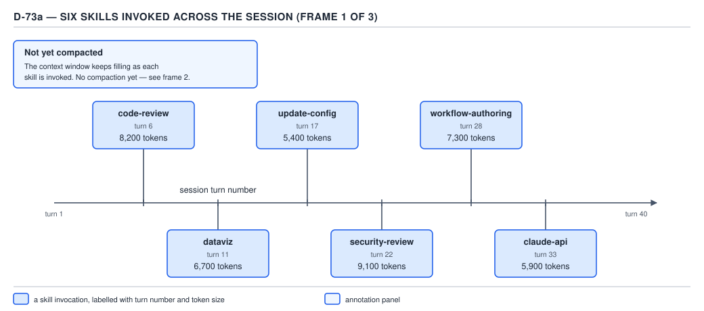
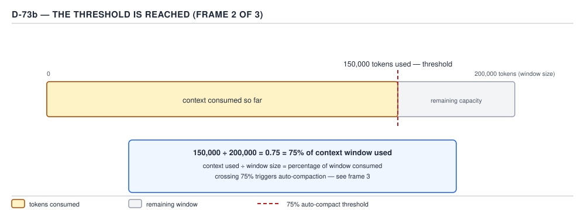
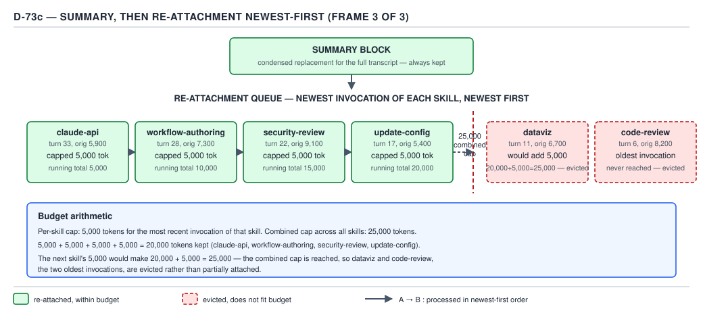

# 21 AI for Coding — the compaction budget — ADVANCED (INTERNALS) (§3.2.1–3.2.4)

**Target version: Claude Code v2.1.2xx (August 2026).** | **Part 3 of 6** | [Index](../00-index.md)
Previous: [the skill listing and the transcripts](../request-assembly/03-internals-b-listing-and-transcripts.md) · Next: [compaction hooks and control](03-internals-b-hooks-and-control.md)

The previous file closed segment 6 of the assembly order — the conversation itself — and the
transcript file that makes it inspectable. This file is what happens to that segment once it grows
too large: compaction, the mechanism `context-economy/02-bounding-and-compaction.md` already covered
as a *practice* — when to trigger it, what to do before it happens, `/compact` versus `/clear` versus
a fresh session versus `--fork-session`. That file explicitly deferred the mechanism underneath to
here. This file is that mechanism: what a compaction event actually does to the transcript, the exact
number that decides when it fires and what that number is a percentage of, the re-attachment
arithmetic that decides which skill invocations survive it, and what happens to `CLAUDE.md` on the
other side. No source tree exists for this topic, so "internals" here means the documented mechanism
paired with an observed artifact — a quoted doc page plus a real number pulled from the installed
binary — standing in for the `[SOURCE]` a source-walked topic would otherwise supply.

### 1. What a compaction actually does to the transcript

**Mental model.** A compaction is not a deletion and not a save. It is a single extra call to the
model, inserted at one turn, whose only job is to read everything so far and hand back a shorter
document that stands in for it from that point forward — closer to replacing a long meeting's full
transcript with the minutes than to shredding the transcript or filing it away intact.

**Why it exists.** `ground-zero/02-basics-context-window-b.md`'s §2 established that every call
resends the whole conversation and nothing ever shrinks it on its own. Left alone, a long enough
session fills the window completely and the next call cannot be sent at all. Compaction is the fix:
replace the accumulated messages with a shorter summary before that happens, so the session keeps
running.

**How it works.** `[DOC]` The `settings-reference` page (re-verified immediately before writing this
leaf) documents the two settings that gate the mechanism, verbatim:

| Key | Type | Description (verbatim) |
|---|---|---|
| `autoCompactEnabled` | boolean | "Turn automatic compaction off or on" |
| `autoCompactWindow` | number | "Set how full the context gets before Claude Code compacts" |

Neither description states the mechanism itself in so many words, but the `memory` page does, in the
course of explaining what survives it: Claude Code re-reads `CLAUDE.md` from disk and "re-injects it
into the session" **after** the event, which only makes sense if the event replaces the messages that
carried it before. The `skills` page states the same replacement directly, in the course of defining
the skill re-attachment budget covered in concept 3 below: "When the conversation is summarized to
free context, Claude Code re-attaches the most recent invocation of each skill **after the
summary**." Two independent pages, describing two different survivors, agree on the same shape of
the event: the transcript is summarized once, and the summary — plus whatever the harness explicitly
re-attaches to it — is what the next call actually sends. Nothing about "summarized" implies
selective or curated; it is one pass over a long transcript, and concept 3's budget below exists
precisely because that one pass cannot be trusted to remember which skill still matters.

**Code.** There is no artifact to ship for "what compaction does" — it is a harness-internal call,
not something a project configures beyond the two keys above. A settings file that turns the whole
mechanism off, complete and valid:

```json
{
  "autoCompactEnabled": false
}
```

**Gotcha.** `autoCompactEnabled: false` disables only the background policy tied to
`autoCompactWindow`. It does not disable the `/compact` command — a person can still type it, and it
runs the identical summarize-and-replace mechanism on demand. `context-economy/02-bounding-and-
compaction.md` already carries this exact pitfall in full; it is not re-litigated here, only named
because concept 1 is where the two triggers on one mechanism first appear in this pair of files.

> Compaction is one summarization call, inserted at a single turn, that replaces the accumulated
> transcript with a shorter document the next call sends in its place — never a deletion, never a
> save, and never something that happens gradually across several turns.

### 2. The threshold: what "how full" means, as a number against a number

**Mental model.** `autoCompactWindow`'s own description — "how full the context gets" — reads like a
percentage. It is not one, on the surface the documentation actually publishes: the CLI accepts only
`auto` or an explicit token count. This concept opens that gap and closes as much of it as the
permitted pages and the installed binary allow.

**Why it exists.** A raw token threshold and a percentage threshold answer the same question two
ways, and Claude Code's public surface commits to the token form. `cli-reference`, re-verified
immediately before writing this leaf, documents `--autocompact <auto|tokens>` as setting "the
auto-compact window for this session without changing your saved settings," accepting the same value
forms as `/autocompact`, and requiring **Claude Code v2.1.221 or later**. Installed-binary inspection
(`claude --help`, v2.1.251, matching the target line) confirms the accepted forms in full: `auto`, or
an explicit **100k–1M token** threshold. Nowhere in `settings-reference` or `cli-reference` — the two
pages that would own this claim — does a bare percentage appear as an accepted input.

**How it works.** `[NUM]` `[PROVE]` D-73b below draws the arithmetic form every threshold check
reduces to, using an illustrative 200,000-token window and an illustrative 150,000-token used amount:



**D-73a** — the setup: six skills invoked at turns 6, 11, 17, 22, 28, and 33 — `code-review` (8,200
tokens), `dataviz` (6,700), `update-config` (5,400), `security-review` (9,100),
`workflow-authoring` (7,300), and `claude-api` (5,900) — with the context window still filling and no
compaction triggered yet.



**D-73b** — the threshold arithmetic, worked as a sum rather than stated as a result:

```
tokens consumed ÷ window size = fraction of window used
150,000 ÷ 200,000 = 0.75 = 75% of the context window consumed
```

**This 75% figure is the diagram's illustrative teaching number, not a confirmed published default
for a 200K window, and the two must not be conflated.** `settings-reference` was re-fetched twice for
this leaf, once naming the two compaction keys directly and once asking neutrally for every
percentage on the page: neither `autoCompactEnabled` nor `autoCompactWindow`'s description states a
percentage anywhere. `ground-zero/02-basics-context-window-b.md` found the same absence from the
`context-window` page (outside this file's permitted page set) and could only extrapolate a 200K
figure from Sonnet 5's documented 1M-window ratio — "auto-compacts at ~967K tokens by default," i.e.
`967,000 ÷ 1,000,000 ≈ 96.7%` — flagging that extrapolation as illustrative, not measured. **D-73b's
75% diverges from that ~96.7% extrapolation**, and this file cannot resolve which, if either, is the
live default for a 200K session, for a reason the installed binary makes concrete below: the default
is not a fixed constant at all.

Installed-binary inspection (`/Users/rajat.chikkodikar/.local/share/claude/versions/2.1.251`, `strings`
against the Mach-O executable, matching the v2.1.2xx target line) settles the *shape* of the
mechanism even though it cannot settle the *value*. Three real excerpts, read directly from the
binary and quoted verbatim:

```
function W3(e,t){let r=e-13000,o=t.testPctOverride;
  if(o!==void 0&&!isNaN(o)&&o>0&&o<=100)
    return Math.min(Math.floor(e*(o/100)),r);
  return r}
```

```
function rhe(e,t,r){
  let o=process.env.CLAUDE_AUTOCOMPACT_PCT_OVERRIDE,
      u=process.env.CLAUDE_CODE_BLOCKING_LIMIT_OVERRIDE;
  return{enabled:Qf(),precomputeBufferFraction:FZt(e,t,r),
    testPctOverride:o?parseFloat(o):void 0,
    testBlockingOverride:u?ol(u):void 0}}
```

```
function EYe(e,t){let r=e.entries.find((o)=>o.windowSize===t);
  if(r!==void 0)return{kind:"exact",entry:r};
  return e.defaultEntry===null?null:{kind:"default",entry:e.defaultEntry}}
```

Reading these in order settles the earlier open question: **`CLAUDE_AUTOCOMPACT_PCT_OVERRIDE` exists**
in v2.1.251 — it is not documented on any of `settings`, `settings-reference`, `permissions`, `hooks`,
`sub-agents`, `skills`, `memory`, `plugins`, or `cli-reference`, so this fact is verified against the
installed binary only, exactly as flagged unresolved in the companion file. `parseFloat` on its value
feeds `W3`, which accepts it only when it parses to a number strictly greater than 0 and less than or
equal to 100 — a raw percentage, not a token count, unlike `autoCompactWindow`. When valid, the
threshold becomes `min(floor(window_size × pct/100), window_size − 13,000)` — the override's own
arithmetic is exactly D-73b's `used ÷ window = fraction` relationship inverted to solve for the
threshold, with one hard floor: **the threshold can never sit closer than 13,000 tokens to the true
ceiling**, no matter how high the override percentage is set. `EYe` shows that absent an override, the
fraction instead comes from a per-model-window lookup table matched by exact `windowSize`, falling
back to a `defaultEntry` — and that table's entries are populated from a runtime feature-flag lookup
rather than a literal constant in the binary, which is exactly why no single percentage for a 200K
window turned up anywhere in this file's search: **the live default is not a fixed number the
documentation could publish even if it wanted to — it is resolved per session from server-controlled
configuration.**

`[PROVE]` — a worked example against that same formula, using a hypothetical 200,000-token window
with the override set explicitly:

```
CLAUDE_AUTOCOMPACT_PCT_OVERRIDE=80
window_size = 200,000
r = window_size − 13,000 = 187,000
pct = 80 → 0 < 80 ≤ 100, valid
threshold = min(floor(200,000 × 0.80), 187,000)
          = min(160,000, 187,000)
          = 160,000  → compaction fires at 160,000 ÷ 200,000 = 80% used
```

```
CLAUDE_AUTOCOMPACT_PCT_OVERRIDE=95
threshold = min(floor(200,000 × 0.95), 187,000)
          = min(190,000, 187,000)
          = 187,000  → the 13,000-token floor wins; the effective
                        threshold caps at 93.5%, not the requested 95%
```

**Insight:** the override cannot push the threshold past `window_size − 13,000` however aggressive the
requested percentage is — the second worked example shows a 95% request landing at 93.5% in practice.
The 13,000-token reserve is a hard floor in the code, not a suggestion the override can waive.

**Gotcha.** `--autocompact` and `autoCompactWindow` take a token count or `auto`; `CLAUDE_AUTOCOMPACT_
PCT_OVERRIDE` takes a raw percentage. They are two different input shapes to two different code paths
that both end up producing a threshold — setting one does not set the other, and the documented,
supported surface is the token form; the percentage override is an internal test/experiment lever
this guide can only describe because it is visible in the compiled binary, not because it is a
supported public setting.

**Interview:** *"The setting says '200K context window' — at what point does compaction actually
fire?"* Not at a single documented percentage: the two settings-file keys accept a token count or
`auto`, not a percentage, and the underlying default fraction is resolved per session from a
server-controlled table rather than a fixed constant — so the honest answer is "somewhere before the
true ceiling, by an amount the harness decides per session," not a specific number you can quote from
memory.

> The compaction threshold is `used_tokens ÷ window_size`, always reserving headroom before the true
> ceiling — but no percentage for a 200K window is published on any settings-facing documentation
> page, an undocumented `CLAUDE_AUTOCOMPACT_PCT_OVERRIDE` environment variable can force one (clamped
> to a hard 13,000-token floor near the ceiling), and the un-overridden default is resolved from a
> runtime configuration table rather than a fixed number the docs could ever state as a single figure.

### 3. The skill re-attachment budget: newest-first, 5,000 each, 25,000 combined

**Mental model.** Think of the budget as four numbered parking spots reserved the instant compaction
fires, filled starting from the skill invoked most recently and working backward in time — once the
spots are full, no amount of "but I used this skill too" gets a fifth invocation a spot, however
useful it still is.

**Why it exists.** Concept 1 established that the summary is one uncurated pass over the transcript,
with no guarantee it preserves which skill mattered. A skill's instructions are often the difference
between the model following a house convention and improvising one — losing that silently, mid-task,
is worse than losing an ordinary tool result. The budget exists to give skills a *harness-level*
survival guarantee that an ordinary conversational fact never gets.

**How it works.** `[DOC]` `[NUM]` `[PROVE]` The `skills` page, re-fetched immediately before writing
this leaf, states the algorithm in one paragraph, quoted verbatim:

> "Auto-compaction carries invoked skills forward within a token budget. When the conversation is
> summarized to free context, Claude Code re-attaches the most recent invocation of each skill after
> the summary, keeping the first 5,000 tokens of each. Re-attached skills share a combined budget of
> 25,000 tokens. Claude Code fills this budget starting from the most recently invoked skill, so
> older skills can be dropped entirely after compaction if you have invoked many in one session."

Three numbers, stated exactly: **5,000 tokens kept per skill** (the first 5,000, not a random slice),
**25,000 tokens combined** across all re-attached skills, and **newest-invocation-per-skill,
newest-first** ordering when the combined cap is reached. Only the *most recent* invocation of a
given skill counts — a skill invoked five times keeps one slot, not five.



**D-73c** — the same six invocations from D-73a, run through the algorithm.

`[PROVE]` — the arithmetic worked through, using D-73a's six invocations in the order compaction
processes them (most recent first):

```
turn 33 — claude-api          (orig 5,900 tok) → capped at 5,000 → running total   5,000
turn 28 — workflow-authoring  (orig 7,300 tok) → capped at 5,000 → running total  10,000
turn 22 — security-review     (orig 9,100 tok) → capped at 5,000 → running total  15,000
turn 17 — update-config       (orig 5,400 tok) → capped at 5,000 → running total  20,000

next candidate, turn 11 — dataviz (orig 6,700 tok):
  20,000 + 5,000 = 25,000 → the combined cap is reached, not merely approached
  → dataviz is evicted rather than partially attached at less than 5,000 tokens

turn 6 — code-review (orig 8,200 tok), the oldest invocation:
  never reached the queue at all → evicted
```

Four skills survive — `claude-api`, `workflow-authoring`, `security-review`, `update-config` — at
5,000 tokens each, for exactly 20,000 of the 25,000-token budget. `dataviz` and `code-review`, the two
oldest invocations, are evicted. **Reaching the cap exactly still evicts the next candidate** — the
budget does not partially attach a fifth skill's remaining 5,000-token headroom down to whatever
fits; it stops the instant the next full slot would meet or exceed 25,000. This is worth stating
explicitly because "reaches" reads ambiguously as "exceeds" until worked through: the diagram's own
arithmetic panel treats `20,000 + 5,000 = 25,000` as the stopping condition, not `> 25,000`.

**Code.** There is no settings key for this budget — it is fixed harness behavior, not configurable
through `settings.json`. The only artifact a project can ship against it is a practice, already
covered in full by `context-economy/02-bounding-and-compaction.md`'s checklist: re-invoke a skill on
the turn before an expected compaction, rather than trusting a forty-turn-old invocation to still hold
a slot. That file's own words apply unchanged here and are not repeated a second time.

**Gotcha — `[TRAP]` the obvious wrong belief.** Assuming a skill invoked once, early in a long
session, is still in full effect near the end of that session just because nothing said otherwise.
**Pitfall:** the wrong belief is "I invoked `/security-review` at turn 4 of a 40-turn session, so its
guidance is still shaping every response." **Symptom:** by turn 33, four *other* skills have been
invoked since, and if even one compaction has fired in between, turn 4's invocation is not just stale
— it may have been evicted outright the moment a fifth-or-later skill's slot filled the 25,000-token
budget, and the model's behavior quietly reverts to not having that skill's instructions at all.
**Fix:** re-invoke any skill whose guidance still needs to be active, on the turn immediately before
an expected compaction — the budget keeps the *most recent* invocation of each skill, not the *most
relevant* one, and there is no notification when an old invocation ages out.

**Insight:** the budget is symmetric in a way that is easy to miss — it is not "the five most
important skills" or "the five most-used skills," it is strictly recency-ordered per skill, with one
slot per distinct skill name. Invoking the same skill three times in a session still only ever
occupies one slot after compaction — its *most recent* invocation — never three.

**Interview:** *"You invoked six different skills over a long session and then it compacted. Which
ones does the model still effectively have?"* Sort the six invocations by turn number, most recent
first, and fill 5,000-token slots against a 25,000-token combined budget until the next slot would
meet or exceed it — whichever skills fall outside that combined budget are gone, regardless of how
useful they were, because the algorithm only ever asks "how recently," never "how important."

> The skill re-attachment budget keeps the single most recent invocation of each skill, the first
> 5,000 tokens of it, up to 25,000 tokens combined, filled newest-first — so invoking many skills
> across a long session silently evicts the earliest ones the moment the combined cap is reached,
> with no signal to the user that it happened.

### 4. `CLAUDE.md`: re-read from disk; nested and path-scoped files reload only on re-match

**Mental model.** Project-root `CLAUDE.md` behaves like a form that gets re-filled from a master copy
every time the office reopens; a nested or path-scoped rule file behaves like a form that only gets
pulled from the filing cabinet when someone actually asks for the specific folder it lives in.

**Why it exists.** Concept 1 established that compaction replaces the transcript, and the transcript
is exactly where an ordinary conversational instruction lives — nothing durable survives there by
default. `CLAUDE.md` is the one instruction surface the harness treats specially: it lives on disk,
not only in the transcript, so it does not have to survive the summarization pass at all — it can
simply be reloaded fresh from its source after the event.

**How it works.** `[DOC]` The `memory` page, re-fetched immediately before writing this leaf, states
the rule directly, under "Instructions seem lost after `/compact`," quoted verbatim:

> "Project-root CLAUDE.md survives compaction: after `/compact`, Claude re-reads it from disk and
> re-injects it into the session. Nested CLAUDE.md files in subdirectories and rules with `paths:`
> frontmatter reload as Claude reads files they apply to."

The same page states the failure mode in the same breath: "If an instruction disappeared after
compaction, it was given only in conversation, lives in a nested CLAUDE.md that hasn't reloaded yet,
or is a path-scoped rule that hasn't matched a file since." Three categories, one survival rule each —
project-root: automatic, every compaction; nested or path-scoped: conditional, only once the session
touches a matching path again in the *shorter*, post-compaction transcript; conversation-only:
never.

| Instruction location | Reloads after compaction | Trigger |
|---|---|---|
| Project-root `CLAUDE.md` / `./.claude/CLAUDE.md` | Always | The compaction event itself |
| Nested `CLAUDE.md` in a subdirectory | Only if matched again | Claude reads a file in that subdirectory post-compaction |
| A `.claude/rules/*.md` file with `paths:` frontmatter | Only if matched again | Claude reads a file matching that glob post-compaction |
| Anything stated only in conversation | Never | Not applicable — it was never on disk |

**Code.** No settings key changes this behavior — it is unconditional for project-root files and
match-conditional for nested ones. The only lever a project has is where it puts a fact: a durable
rule that must survive every compaction, regardless of which files get touched afterward, belongs in
the project-root file, not in a nested one, precisely because only the root file's reload is
unconditional.

```json
{
  "claudeMdExcludes": []
}
```

The empty array above is the complete, valid default shape of the one setting `memory` documents that
touches which `CLAUDE.md` files load at all — included here to show the honest baseline rather than a
fragment implying options not covered by this leaf's scope.

**Gotcha.** A rule scoped with `paths:` frontmatter reloading "on re-match" means exactly that and
nothing more generous: touching an *unrelated* file after compaction does not bring it back. A
`backend/**/*.java`-scoped rule stays out of context for the rest of the session if the post-compaction
work only ever touches frontend files — the rule is not gone, it is on disk, but it will not be back
in the model's input until a matching path is read again.

**Pitfall:** treating "it's in a `CLAUDE.md` file somewhere in the repo" as equivalent to "it survives
compaction unconditionally." Only the project-root file gets the unconditional reload; a nested file
three directories down is exactly as exposed to the "compacted out, not yet reloaded" gap as a
path-scoped rule is, and both categories look identical to a developer who has only ever tested with
the root file.

> The project-root `CLAUDE.md` is re-read from disk and re-injected into the session on every
> compaction, unconditionally; nested `CLAUDE.md` files and path-scoped `.claude/rules/` entries carry
> no such guarantee — they reload only once the post-compaction session touches a file they match
> again, and until then they are functionally absent, even though nothing about them was deleted.

## Pitfalls

- **Belief:** a skill invoked earlier in a long session is still shaping the model's behavior right up
  until you invoke a different one.
  **Surprising outcome:** the moment a compaction fires and enough later skills have been invoked
  since, the earlier one can be evicted outright — its most recent invocation simply falls outside the
  25,000-token combined budget, with no notice given.
  **What actually gets the guarantee:** re-invoke a skill whose guidance must remain active, on the
  turn before an expected compaction, since the budget tracks recency per skill, not relevance.
  **Why people believe it:** nothing in the interface flags an eviction — the skill quietly stops
  influencing output, and that reads the same as "the model chose a different approach" rather than
  "the instructions are gone."

- **Belief:** "the context window is 200K, so compaction fires at some fixed, quotable percentage of
  it, the same way it does for the 1M window."
  **Surprising outcome:** no percentage for the 200K case appears on `settings-reference` or
  `cli-reference`, and installed-binary inspection shows the default fraction is resolved from a
  runtime configuration table per session rather than stored as a fixed constant at all — there is no
  single number to quote.
  **What actually gets the guarantee:** track `used_tokens ÷ window_size` yourself via `/context` if
  the exact margin matters, rather than relying on a remembered percentage; only `CLAUDE_AUTOCOMPACT_
  PCT_OVERRIDE` (undocumented, verified only against the binary) lets you pin an exact figure, and even
  then it is clamped to a 13,000-token floor near the ceiling.
  **Why people believe it:** the 1M-window case *does* have a documented figure ("auto-compacts at
  ~967K tokens by default"), and it is natural to assume every window size publishes an equivalent one.

- **Belief:** a fact placed in *any* `CLAUDE.md` file in the repository is safe across a compaction.
  **Surprising outcome:** only the project-root file's reload is unconditional; a nested file or a
  path-scoped rule reloads only once the post-compaction session happens to touch a matching path
  again — until then, it behaves exactly like a conversation-only fact that was compacted away.
  **What actually gets the guarantee:** put anything that must survive every compaction, regardless of
  which files get touched afterward, in the project-root file specifically.
  **Why people believe it:** all `CLAUDE.md` files look and load the same way at session start, so the
  difference in their compaction behavior is invisible until a compaction actually happens and a
  nested rule's instruction goes quiet.

## Cheat sheet

| Question | Answer |
|---|---|
| What compaction does | One summarization call replaces the accumulated transcript with a shorter one; not a deletion, not a save |
| Threshold formula | `used_tokens ÷ window_size = fraction consumed`; crossing the (session-resolved) threshold fires compaction |
| Documented 200K percentage | None on `settings-reference`/`cli-reference`; D-73b's 75% is illustrative, not confirmed live default |
| `CLAUDE_AUTOCOMPACT_PCT_OVERRIDE` | Undocumented; confirmed only against the installed binary; accepts `0 < pct ≤ 100`; threshold = `min(floor(window × pct/100), window − 13,000)` |
| Hard floor on any threshold | `window_size − 13,000` tokens — the override cannot push closer to the ceiling than this |
| Skill re-attachment: per-skill cap | First 5,000 tokens of the most recent invocation of each skill |
| Skill re-attachment: combined cap | 25,000 tokens total, filled newest-first; reaching the cap evicts the next candidate outright |
| `CLAUDE.md`, project-root | Reloads unconditionally, every compaction |
| `CLAUDE.md`, nested / path-scoped rules | Reload only once a matching path is read again post-compaction |
| Conversation-only facts | Never survive a compaction |

## Self-test

1. What does a compaction event actually do to the transcript, mechanically?
<details><summary>Answer</summary>
It runs one summarization call over the accumulated conversation and replaces the messages with the
resulting shorter summary, which the next call sends in their place. It is not a deletion (something
is kept) and not a save (the original messages are not preserved verbatim anywhere the harness will
resend).
</details>

2. Is the 75% figure in D-73b a documented default for a 200K-token session? What is documented
   instead?
<details><summary>Answer</summary>
No. `settings-reference` and `cli-reference` publish no percentage for a 200K window at all — only a
token-count or `auto` input form for `autoCompactWindow`/`--autocompact`. Installed-binary inspection
shows the un-overridden default fraction is resolved per session from a runtime configuration table,
not stored as a fixed constant, which is why no single percentage exists to publish. 75% is the
diagram's illustrative teaching value for the arithmetic form, not a confirmed live default.
</details>

3. What does `CLAUDE_AUTOCOMPACT_PCT_OVERRIDE=95` actually produce on a 200,000-token window, and why
   not exactly 95%?
<details><summary>Answer</summary>
`min(floor(200,000 × 0.95), 200,000 − 13,000) = min(190,000, 187,000) = 187,000`, which is 93.5% of
the window, not 95%. The 13,000-token reserve near the ceiling is a hard floor in the code that the
override cannot push past, regardless of the requested percentage.
</details>

4. Six skills were invoked at turns 6, 11, 17, 22, 28, and 33, sized 8,200 / 6,700 / 5,400 / 9,100 /
   7,300 / 5,900 tokens respectively. After a compaction, which survive, and at what running total?
<details><summary>Answer</summary>
Newest-first: turn 33 (claude-api, capped 5,000, running total 5,000), turn 28 (workflow-authoring,
capped 5,000, total 10,000), turn 22 (security-review, capped 5,000, total 15,000), turn 17
(update-config, capped 5,000, total 20,000). The next candidate, turn 11 (dataviz), would bring the
total to 20,000 + 5,000 = 25,000, which reaches the combined cap, so dataviz and the oldest, turn 6
(code-review), are both evicted rather than partially attached.
</details>

5. A skill was invoked three times in one session. How many of those invocations occupy a slot in the
   re-attachment budget after a compaction?
<details><summary>Answer</summary>
One. The budget keeps only the most recent invocation of each distinct skill; the earlier two
invocations of the same skill are not separately tracked or partially credited.
</details>

6. A developer puts a durable instruction in `src/billing/.claude/rules/tax-rounding.md`, scoped with
   `paths: ["src/billing/**"]`. A compaction fires while the session is working entirely in
   `src/shipping/`. Is the instruction still in context afterward?
<details><summary>Answer</summary>
No, not automatically. A path-scoped rule reloads only once the session reads a file matching its
`paths` glob again; working exclusively in `src/shipping/` after the compaction never re-triggers a
match for a `src/billing/**` rule, so it stays out of context until a billing file is touched.
</details>

7. Why does the project-root `CLAUDE.md` not need a token budget the way skills do?
<details><summary>Answer</summary>
Because it does not need to survive the summarization pass at all — it is re-read directly from disk
after every compaction, independent of whatever the summary itself preserved. Skills need a budget
specifically because their survival depends on the harness explicitly re-attaching a past invocation
after the summary, and that re-attachment has to be bounded somehow.
</details>

## Open questions

- **Unverified:** the exact default value of the compaction-threshold fraction for a 200,000-token
  window in the current live configuration. `settings-reference` and `cli-reference` publish no
  percentage for this case, and installed-binary inspection (v2.1.251) shows the default is resolved
  from a runtime, server-controlled per-model-window table rather than a literal constant in the
  binary — so no static inspection of any kind, documentation or binary, can produce a single
  confirmed figure. D-73b's 75% is this file's illustrative arithmetic example, not a claim about the
  live default; `ground-zero/02-basics-context-window-b.md`'s extrapolated ~96.7% (from Sonnet 5's
  documented 1M-window ratio) remains a separate, also-unconfirmed illustrative figure for the same
  case. The two are flagged here as diverging from each other precisely because this file could not
  settle which, if either, matches the live default.

---

**Leaves covered:** 3.2.1–3.2.4 (4 leaves)
**Leaves deferred:** none
**Diagrams included:** D-73 (D-73a, D-73b, D-73c)
**Target version:** Claude Code v2.1.2xx (August 2026)
**Lines:** 494
