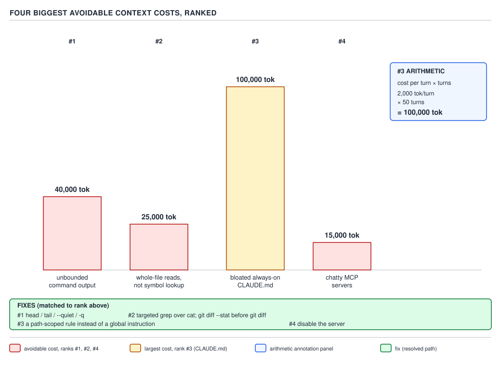

# 21 AI for Coding — measuring and ranking context cost — INTERMEDIATE (§2.6.1–2.6.4)

**Target version: Claude Code v2.1.2xx (August 2026).** | **Part 2 of 6** | [Index](../00-index.md)
Previous: [three real plugin files, and `${CLAUDE_PLUGIN_ROOT}`](../plugins/05-cases-and-conversion.md) · Next: [bounding output and compaction](02-bounding-and-compaction.md)

Every arithmetic habit this guide has built so far — the whole conversation re-sent every turn
(§0.2.6), the five things that load before you type a character (§0.2.11, D-10), an unchanged
prefix billed at the cache-read price (§0.2.8), a `CLAUDE.md`'s cost multiplying by every turn it
sits in context (§1.3.11), a skill's listing entry staying cheap while its body does not (§1.5.5,
D-36), an MCP server's schemas taxing every turn for the rest of the session (§2.4.7, D-56), an LSP
lookup beating a read-and-grep on tokens (§2.4.11, D-57), and a subagent's fixed per-dispatch tax
(§2.1.19, D-46) — was measured once, in one file, for one purpose. This file turns that scattered
arithmetic into a routine you run on your own machine, and a ranked list of where to spend the five
minutes it takes to fix something.

## Reading `/context` as a routine, not a reference lookup

**Mental model.** `/context` is not documentation you consult when something feels wrong. It is a
receipt you read the same way every time, in the same order, whether or not anything feels wrong —
the way a pilot runs a pre-flight checklist regardless of how the engine sounds. A reader who only
opens `/context` when a session already feels sluggish has already paid for the sluggishness; the
routine's whole point is to catch a cost before it compounds across forty more turns.

**Why it exists.** §0.4.4 already showed the six-plus-two-row table `/context` renders and what
supplies each row. What that file did not give you is a repeatable sequence for a session you have
not diagnosed yet — a script you run, in order, every time, so "read `/context`" stops being advice
and becomes a five-command habit with the same shape every session.

**How it works.** Run this sequence at the start of any session you expect to run long, and again
any time the model does something that surprises you — the second half of that sentence is
§1.1.9's invariant restated for this specific tool: if a behaviour surprised you, some file caused
it, and `/context` is the first diagnostic that names which one, because it is the only one of the
two that shows what is *currently resident*, row by row, rather than what is merely *configured on
disk*.

1. **`/context`** (no argument) — the collapsed view. Read every row top to bottom, not just the
   percentage at the top. Note which rows are non-zero that you did not expect to be non-zero — a
   `Custom agents` row with a number in it when you thought this project had none defined is exactly
   the kind of surprise the routine exists to catch.
2. **`/context all`** — the expanded view, only if a row from step 1 looks larger than expected.
   This is where `MCP tools` breaks out into one line per `mcp__<server>__*` group (§2.4.7) and lets
   you see *which* connected server is responsible, rather than only the summed total.
3. **`/doctor`** — not a context-size tool, but the companion diagnostic §1.1.9 named: it checks the
   configuration itself (malformed hook, conflicting settings layer, a rule whose `paths:` glob
   failed to parse) rather than what loaded, so a `/context` row that looks wrong and a `/doctor`
   pass that reports clean together tell you the size is real, not a misconfiguration artifact.
4. **Attribute the on-disk rows locally** — `Memory files`, `Rules` (once one matches), and `Skill
   listing` all have a concrete file on disk behind them, which means you do not have to guess at
   their size from inside a running session; a local script can compute the same numbers `/context`
   reports, without spending a single token to do it.

Step 4 is the `[BUILD]` this leaf asks for — a script that attributes every locally-sourced row
before you even open a session, so a `/context` read afterwards is confirmation, not discovery.

```bash
#!/usr/bin/env bash
set -euo pipefail

CHARS_PER_TOKEN=4

estimate_tokens() {
  local chars="$1"
  echo $(( chars / CHARS_PER_TOKEN ))
}

echo "== CLAUDE.md files (ancestor walk from cwd) =="
total_claude_md_chars=0
while IFS= read -r -d '' f; do
  chars=$(wc -m < "$f" | tr -d ' ')
  total_claude_md_chars=$(( total_claude_md_chars + chars ))
  printf "%-50s %8d chars  ~%6d tok\n" "$f" "$chars" "$(estimate_tokens "$chars")"
done < <(find . -maxdepth 3 -iname "CLAUDE.md" -print0 2>/dev/null)
echo "subtotal: ~$(estimate_tokens "$total_claude_md_chars") tok"

echo
echo "== Rules (.claude/rules/**) =="
total_rules_chars=0
rules_count=0
if [ -d .claude/rules ]; then
  while IFS= read -r -d '' f; do
    rules_count=$(( rules_count + 1 ))
    chars=$(wc -m < "$f" | tr -d ' ')
    total_rules_chars=$(( total_rules_chars + chars ))
  done < <(find .claude/rules -type f -name "*.md" -print0)
fi
echo "$rules_count rule files, subtotal: ~$(estimate_tokens "$total_rules_chars") tok (loads only for matching paths)"

echo
echo "== Skill listing (.claude/skills/*/SKILL.md frontmatter) =="
total_skill_chars=0
skill_count=0
if [ -d .claude/skills ]; then
  while IFS= read -r -d '' f; do
    skill_count=$(( skill_count + 1 ))
    chars=$(wc -m < "$f" | tr -d ' ')
    total_skill_chars=$(( total_skill_chars + chars ))
  done < <(find .claude/skills -name "SKILL.md" -print0)
fi
echo "$skill_count skills, listing subtotal: ~$(estimate_tokens "$total_skill_chars") tok"

echo
echo "Read these subtotals next to the Memory files / Skill listing rows in a"
echo "live '/context' read. System prompt, system tools, MCP tools, Messages"
echo "and Free space have no on-disk source; /context is the only place to"
echo "read those."
```

**Prove step**, run against this very repository's root:

```
$ /tmp/context-attribution.sh
== CLAUDE.md files (ancestor walk from cwd) ==
./.claude/CLAUDE.md                                    8641 chars  ~  2160 tok
subtotal: ~2160 tok

== Rules (.claude/rules/**) ==
0 rule files, subtotal: ~0 tok (loads only for matching paths)

== Skill listing (.claude/skills/*/SKILL.md frontmatter) ==
0 skills, listing subtotal: ~0 tok

Read these subtotals next to the Memory files / Skill listing rows in a
live '/context' read. System prompt, system tools, MCP tools, Messages
and Free space have no on-disk source; /context is the only place to
read those.
```

The project's own `.claude/CLAUDE.md` is 8,641 characters — `~2,160` tokens by the 4-characters-per-token
estimate §1.3.11 already established — with no rules and no skills defined in this repo, so those
two rows contribute nothing. Opening `/context` in a real session against this same directory would
show that same `~2,160`-token figure (plus the user's own `~/.claude/CLAUDE.md`, whatever it
measures on their machine) inside the `Memory files` row, confirming the local estimate rather than
replacing it.

**What this costs:** every command the script runs — `find`, `wc`, `awk` — is a local filesystem
read; none of it calls the model, so running the full attribution costs zero tokens, the same "free
to run as often as you like" property §0.4.4 established for `/context` and `/doctor` themselves.

**Gotcha:** the script cannot see `System prompt`, `System tools`, `MCP tools`, or `Messages` —
those four rows have no file on disk to `wc -m`; `System tools` and `MCP tools` are schemas the
harness assembles internally, and `Messages` is the transcript itself. Treat the script as
completing the picture `/context` draws, not replacing it — a session where the script's numbers and
`/context`'s numbers disagree on the `Memory files` row is worth a `/doctor` pass, per §1.1.9,
because a settings layer is silently pulling in a `CLAUDE.md` the ancestor-walk above did not find.

> Reading `/context` is a five-step routine — collapsed view, expanded view on a suspicious row,
> `/doctor` for configuration health, and a local attribution script for the on-disk rows — run at
> the start of every long session, not a command you reach for only once something already feels
> wrong.

## The startup tax, itemised for the reader's own machine

**Mental model.** Before you have typed a single character, a fixed set of rows is already resident
and already billed on the first request the moment you send it — §0.2.11's five things. That total
is a tax you pay just for opening the tool, independent of what you ask it to do, and it recurs on
**every** turn of the session because the whole conversation, startup content included, is re-sent
each time (§0.2.6).

**Why it exists.** The harness has to give the model a stable picture of its own capabilities and
your project's standing instructions on turn one, before any task-specific content exists at all —
there is no "empty" first request, only a first request that already carries the five fixed rows
plus whatever your project has installed.

**How it works, with the arithmetic printed.** §0.2.11's own baseline worked example — a fresh
session, minimal configuration — put those five rows at:

```
system prompt        ~4,200 tok
tool schemas            ~120 tok  (MCP tool names deferred; full schemas load per-tool, on demand)
memory files            ~680 tok  (CLAUDE.md + auto memory, combined, in that baseline session)
skill listing           ~450 tok
environment/git snapshot ~280 tok
---------------------------------
startup tax          ~5,730 tok   (before a single word of the actual task)
```

That baseline is not a ceiling — it is what a nearly-empty project pays. §0.4.4's own worked
`/context` read, from a session with MCP servers connected and custom agents defined, itemises the
same six categories at:

```
system prompt      3,200 tok
system tools        6,800 tok
MCP tools           4,100 tok
memory files        2,120 tok
custom agents         900 tok
skill listing         450 tok
--------------------------------
startup tax        17,570 tok   (8.785% of a 200,000-token window, before Messages)
```

The gap between 5,730 and 17,570 is not a contradiction between two files — it is the leaf's own
point: **the startup tax is a function of what your project has installed, not a fixed constant.**
Every MCP server you connect, every custom agent and skill you define, every line you add to
`CLAUDE.md` raises this number, and it raises it on every single turn for the rest of every session
against that project, not once.

**Code — computing your own.** Run `/context` in a brand-new session, immediately, before typing a
task — the collapsed view already sums every row except `Messages` and `Free space` for you. Add
those together yourself to get your own startup tax:

```
your_startup_tax = system_prompt + system_tools + mcp_tools + memory_files
                    + custom_agents + skill_listing
```

`[PROVE]` — the exposure this buys over a session, using the 17,570-token worked figure and a
40-turn session (§1.3.11's own reference length):

```
17,570 tok/turn × 40 turns = 702,800 tokens of startup content moving through the
                              request over the session, at the sticker input rate
```

**Insight:** per §0.2.8, only the *first* turn pays that 17,570 tokens at full input price — every
turn after it, as long as nothing ahead of the messages boundary changes, reads the same prefix at
the cache-read rate instead. The 702,800-token figure is the right number for deciding whether a
17,570-token startup tax is worth trimming; it is not the right number for estimating the session's
actual dollar cost, which §2.4.7 already showed how to discount for a cache-warm prefix.

**Gotcha:** the startup tax is invisible until you read `/context`, because none of it appears as
something you did — you did not ask for the system prompt, the tool schemas, or the skill listing,
so there is nothing in the transcript that attributes those tokens to a specific action. A reader
who only ever watches the `Messages` row grow and never checks the rows above it can be paying a
20,000-token-per-turn tax from three MCP servers and a bloated `CLAUDE.md` and never once see it
named, because nothing about a normal session surfaces it unprompted.

> The startup tax is the sum of every row `/context` shows above `Messages` — system prompt, tool
> schemas, memory files, custom agents, skill listing, environment snapshot — paid on the first turn
> at full price and on every turn after it at the cache-read price, and it grows with everything your
> project installs, not with anything you type.



**D-62** — The four biggest avoidable context costs, ranked, each with its fix.

## The four biggest avoidable costs, ranked

**Mental model.** A reader who has read this far already knows four expensive things: a bloated
`CLAUDE.md`, a chatty MCP server, an unbounded command's output, and a whole-file read where a
symbol lookup would answer the question. Knowing that four things are expensive is not the same as
knowing which one to fix first when you only have five minutes — that is what the ranking below
answers, and the ranking is not simply "biggest number first."

**Why it exists.** §1.3.11, §2.4.7, and §2.4.11 each measured one cost in isolation, in its own
file, with its own worked example. None of those files told you how the four compare against each
other, or which one earns the first five minutes of a cleanup pass. That comparison is this leaf.

**How it works.** D-62 ranks the four by *avoidable* impact, not by raw token count, and the
distinction matters because the largest single number on the diagram is not ranked first:

| Rank | Cause | Cost | Fix |
|---|---|---:|---|
| #1 | Unbounded command output | 40,000 tok | `head`, `tail`, `--quiet`, `-q` |
| #2 | Whole-file reads where a symbol lookup would do | 25,000 tok | targeted `grep` over `cat`; `git diff --stat` before `git diff` |
| #3 | A bloated always-on `CLAUDE.md` | 100,000 tok | a path-scoped rule instead of a global instruction |
| #4 | Chatty MCP servers | 15,000 tok | disable the server |

`[PROVE]` — the diagram's own annotation panel for rank #3, printed here rather than merely cited:

```
cost per turn × turns
2,000 tok/turn × 50 turns = 100,000 tok
```

That is the same multiplication §1.3.11 walked through for one reader's actual file — a fixed,
per-turn number, multiplied by session length, with no cap, because nothing about a `CLAUDE.md`
shrinks itself as the session runs.

**Gotcha — why the 100,000-token item is ranked #3, not #1.** Rank #3 carries the single largest
number on the diagram and is still not the top priority, because the diagram's own legend
distinguishes two different properties: ranks #1, #2, and #4 are colored as **avoidable cost** —
tokens that buy the reader nothing, with a one-line fix that removes them entirely and permanently.
Rank #3 is colored as **largest cost** instead, because a `CLAUDE.md` is not pure waste in the way
an unbounded `ls -R` is — some of its content is instructions the session genuinely needs on every
turn, and the fix is not "delete it," it is "split it," moving the parts that only one subdirectory
or one file type needs into a path-scoped rule (§1.3.15) so they stop being paid for on turns that
never touch that area. Rank #1 wins the top slot specifically because it is both large and entirely,
trivially avoidable in one flag; rank #3 is larger in raw tokens but requires a redesign rather than
a flag, which is why it sits third rather than first on a list ordered by "fix this in the next five
minutes."

**Interview:** *"If you could only fix one context-cost problem on a team's setup today, which one,
and why?"* Unbounded command output, not the largest `CLAUDE.md` — because it is a one-line change
(`head`, `tail`, a `--quiet` flag) that removes tokens that were buying nothing, applies to every
command run for the rest of every session, and requires no negotiation with a team about what
belongs in a shared instruction file; the `CLAUDE.md` fix is real and worth doing, but it is a
migration, not a flag.

> The four biggest avoidable context costs are unbounded command output, whole-file reads in place
> of a symbol lookup, a bloated always-on `CLAUDE.md`, and chatty MCP servers, ranked by how directly
> each one converts into freed tokens for a five-minute fix, not by which single number is largest.

## Bounding tool output as a discipline

**Mental model.** Every command a coding agent runs returns its output straight into the transcript,
in full, by default — a `Bash` tool call has no concept of "too much," the way a terminal you are
reading yourself does when you scroll past what matters. Bounding output is not a special technique
for large repositories; it is the same discipline a shell script author already applies to keep logs
readable, redirected at the one difference that here every unbounded line becomes billed, re-sent
tokens for the rest of the session (§0.2.6), not just scrollback.

**Why it exists.** §0.2.11 and D-62's rank #1 both point at the same failure: a single `find .`, a
single `git log`, or a single build's full stdout can land tens of thousands of tokens in the
transcript in one tool call, and — unlike the startup tax — that cost was never configured by
anyone; it happened because a command that could have been bounded was not.

**How it works.** Three concrete substitutions, each matching one of D-62's fix column entries:

| Unbounded | Bounded | Why the bounded form is enough |
|---|---|---|
| `find . -type f` | `find . -type f \| head -n 50` | a listing task rarely needs every path at once; 50 is enough to confirm shape or find the file you're after |
| `git diff` | `git diff --stat` first, full diff only if needed | `--stat` answers "how big and where" in a fraction of the tokens; the full diff is a second, deliberate step |
| `cat file.py` to find one function | `grep -n "def handle_request" file.py` | a symbol search returns the line, not the file; §2.4.11 already made the stronger version of this argument for an LSP lookup over either |

**Code**, a complete script wrapping the three substitutions as reusable functions:

```bash
#!/usr/bin/env bash
set -euo pipefail

# bound-output.sh — bounded variants of the three highest-volume commands a
# coding agent runs, matching D-62's fix column for ranks #1 and #2.

bounded_find() {
  local dir="$1"
  find "$dir" -type f | head -n 50
}

bounded_diff_stat() {
  local from="$1" to="$2"
  git diff --stat "$from" "$to"
}

bounded_grep() {
  local pattern="$1" dir="$2"
  grep -rn -m 5 "$pattern" "$dir"
}
```

**Prove step**, unbounded versus bounded, on this note set's own `src/` tree:

```
$ find src -type f | wc -c
   77016
$ find src -type f | head -n 50 | wc -c
    1524
```

77,016 characters unbounded — `~19,254` tokens by the 4-characters-per-token estimate — against
1,524 characters bounded to the first 50 paths — `~381` tokens. The bounded form answers "does this
directory contain what I expect" exactly as well as the unbounded one for the overwhelming majority
of tasks, at roughly 2% of the token cost.

The `git diff --stat` substitution proves out even more sharply against a real multi-commit range in
a production repository (`sdlc-harness`, read-only, `git diff` is a read operation):

```
$ git diff --stat HEAD~5 HEAD | wc -c
   48486
$ git diff HEAD~5 HEAD | wc -c
 3421421
```

`~12,121` tokens for the stat summary against `~855,355` tokens for the full diff — a difference of
two orders of magnitude for a question ("what changed, roughly, over the last five commits") that
`--stat` answers completely on its own; the full diff is worth requesting only once `--stat` has
told you which of those files is worth reading in full.

**What this costs:** the bounding itself costs nothing — `head`, `--stat`, and `-m` are flags on
commands you were already running, not additional tool calls, so there is no overhead to trade
against the savings above; the only case where bounding costs something real is under-bounding a
result you then have to re-run wider, which is a second tool call rather than a token cost.

**Gotcha:** bounding a `find` or `grep` result to see "enough" can silently hide the one match that
mattered, if the pattern's real hits are past the cutoff — `head -n 50` on a `find` sorted
alphabetically will never show a file starting with `z` in a directory of more than 50 entries whose
names start earlier in the alphabet. The fix is not "never bound," it is "bound, then widen
deliberately if the bounded result doesn't answer the question" — exactly the two-step shape
`bounded_diff_stat` followed by a full `git diff` already models.

> Bounding tool output — `head`/`tail`/`--quiet`/`-q` on a listing, `git diff --stat` before `git
> diff`, targeted `grep` instead of `cat` — trades a small, deliberate re-run risk for routinely
> avoiding tens of thousands of tokens of output nobody was going to read in full.

## Pitfalls

- **Belief:** reading `/context` once, at the start of a session, is enough to know what a session
  costs.
  **Surprising outcome:** the same session, forty turns later, is carrying an MCP server connected
  at turn 12 and a `CLAUDE.md` edited at turn 25 that the turn-1 read never saw, and every row except
  `System prompt` and `System tools` can move between reads (§0.4.4's own gotcha).
  **What actually gets the guarantee:** re-run `/context` whenever something surprises you, not only
  at session start — the routine above is a repeatable habit, not a one-time check.
  **Why people believe it:** the collapsed view looks like a static fact about the session rather
  than a snapshot of a moving total.

- **Belief:** the biggest number on a cost diagram is automatically the first thing to fix.
  **Surprising outcome:** time spent redesigning a `CLAUDE.md` into path-scoped rules — the largest
  single figure on D-62 — before touching a one-line `head` fix that recovers comparable tokens in
  under a minute.
  **What actually gets the guarantee:** rank by ease-of-fix-times-recurrence first; D-62 itself
  ranks unbounded output above the numerically larger `CLAUDE.md` cost for exactly this reason.
  **Why people believe it:** "biggest number first" is the correct heuristic in most other cost
  triage, so it generalises here even though it produces the wrong first move.

- **Belief:** an unbounded `git diff` or `find` is harmless because "the model just reads past what
  it needs."
  **Surprising outcome:** every one of those extra tokens is billed on the turn it arrives and
  re-billed on every turn afterward until a `/compact` or `/clear`, per §0.2.6 — nothing about the
  model "skimming" reduces what was actually sent.
  **What actually gets the guarantee:** bound the command before running it — `--stat`, `head`,
  `grep` — rather than trusting the model to discard what it didn't need.
  **Why people believe it:** a human skimming a long terminal output really does pay no extra cost
  for the part they skip; a re-sent transcript does not work that way.

## Cheat sheet

| Habit | Command / artefact | Cost if skipped |
|---|---|---|
| Read `/context` at session start and on any surprise | `/context`, `/context all` | Startup tax invisible; grows unnoticed |
| Check configuration health when a row looks wrong | `/doctor` | Misconfiguration read as "the model decided" |
| Attribute on-disk rows locally, at zero token cost | `context-attribution.sh` | No way to confirm `/context`'s `Memory files` / `Skill listing` rows independently |
| Rank fixes by avoidability, not raw size | D-62's four-row table | `CLAUDE.md` redesign attempted before a one-line `head` fix |
| Bound before requesting the full picture | `git diff --stat` before `git diff`; `head`/`tail`/`-m` | Tens of thousands of tokens of unread output, re-billed every turn |

## Self-test

1. Why does re-reading `/context` only at session start miss real cost growth?
<details><summary>Answer</summary>
Every row except `System prompt` and `System tools` can grow mid-session — a connected MCP server
adds to `MCP tools`, an edited `CLAUDE.md` adds to `Memory files`, and `Messages` grows with every
tool call. A turn-1 read is a snapshot of that moment, not a running total; §0.4.4's own gotcha
warns against trusting one read for the rest of the session.
</details>

2. What does the local attribution script compute that a live `/context` read cannot show you before
   a session even starts?
<details><summary>Answer</summary>
The token cost of every `CLAUDE.md`, rule file, and skill listing already on disk, using a plain
`wc -m` and the 4-characters-per-token estimate — none of which requires opening a Claude Code
session or spending a token, because it reads files directly rather than asking the model to report
on them.
</details>

3. Why is a bloated `CLAUDE.md` ranked #3 on D-62 despite carrying the largest single token figure?
<details><summary>Answer</summary>
Because the ranking orders by avoidable, one-fix-and-done impact, not raw size. Ranks #1, #2, and #4
are pure waste removable with a single flag or a disabled server; a `CLAUDE.md`'s cost is only
partly waste — some of its content is legitimately needed every turn — and its real fix is a
redesign into path-scoped rules, not a flag, which is why it is largest but not first.
</details>

4. Print the arithmetic for a `CLAUDE.md` costing 2,000 tokens per turn over a 50-turn session.
<details><summary>Answer</summary>
`2,000 tok/turn × 50 turns = 100,000 tok` — the exact figure D-62 annotates for rank #3, using the
same "cost per turn × turns" formula §1.3.11 established for any always-on instruction file.
</details>

5. Why does `git diff --stat` before `git diff` save two orders of magnitude of tokens rather than a
   modest fraction?
<details><summary>Answer</summary>
`--stat` reports only file names and line-change counts — a fixed, small amount of text regardless
of how large the actual changes are — while a full `git diff` reprints every changed line verbatim.
Against a real five-commit range this guide measured, `--stat` cost `~12,121` tokens against
`~855,355` tokens for the full diff — the gap grows with the size of the change, not with anything
about the command itself.
</details>

6. What is the "startup tax," and why does it recur on every turn rather than being paid once?
<details><summary>Answer</summary>
It is the sum of every context row that loads before you type anything — system prompt, tool
schemas, memory files, custom agents, skill listing, environment snapshot. It recurs every turn
because §0.2.6 established that the whole conversation, startup content included, is re-sent on
every single request; only the *price* of re-sending it changes after the first turn, from full
input price to the cache-read price, not whether it is sent.
</details>

7. A reader bounds a `find` to `head -n 50` and misses a file they needed. What is the correct fix —
   never bound again, or something narrower?
<details><summary>Answer</summary>
Something narrower: bound first, then widen deliberately — a second, targeted command (a wider
`head`, a `grep` for the expected filename, or an unbounded call scoped to a smaller directory) —
rather than abandoning bounding altogether. The failure mode is under-bounding a specific query, not
bounding as a discipline.
</details>

## Open questions

None.

---

**Leaves covered:** 2.6.1–2.6.4 (4 leaves)
**Leaves deferred:** none
**Diagrams included:** D-62
**Target version:** Claude Code v2.1.2xx (August 2026)
**Lines:** 498
