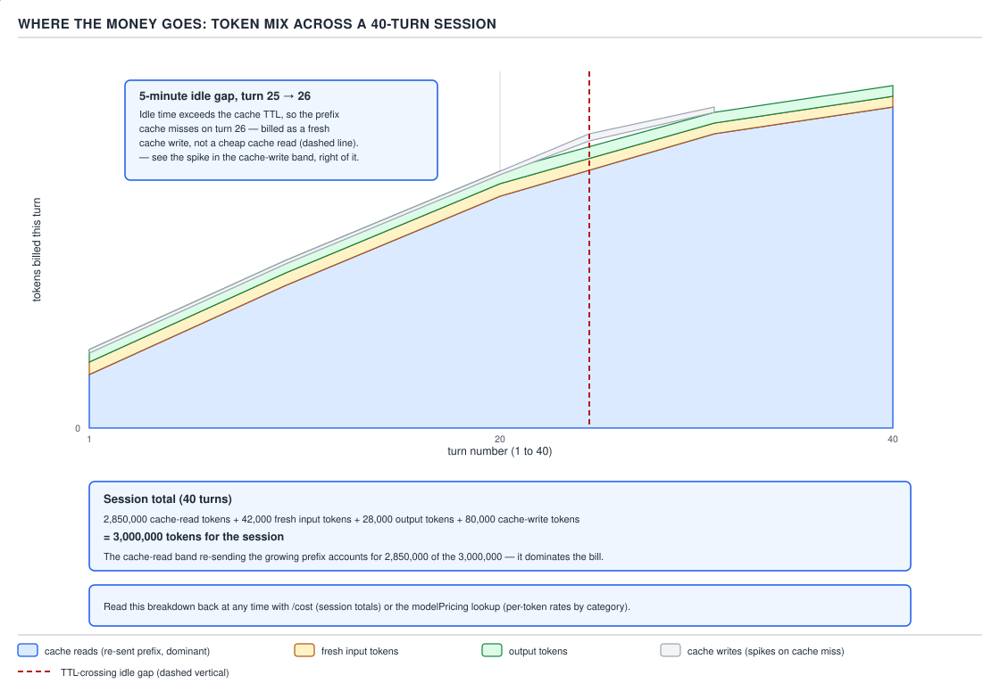

# 21 AI for Coding — the four billed quantities — ADVANCED (INTERNALS) (§3.4.1–3.4.4)

**Target version: Claude Code v2.1.2xx (August 2026).** | **Part 3 of 6** | [Index](../00-index.md)
Previous: [commands traced through matching](../permission-evaluation/03-internals-b-traced-commands.md) · Next: [the three ceilings, and reading cost back](03-internals-b-ceilings-and-reading-it-back.md)

Every prior file in this guide has treated cost as "tokens, roughly" — enough to reason about which
mechanism is expensive relative to which other one. This file opens the meter itself. `[ZERO]` A
**token** is the unit the model bills in — a chunk of text, typically a few characters, that the
model reads or writes one of at a time (§0.1.4). Every request Claude Code sends and every reply it
gets back is measured, and billed, in tokens, but not all tokens cost the same, and not all of them
are new work. There are exactly **four** billed quantities, they have four different prices, and one
of them — because of how conversation resending and prompt caching interact (§0.2.6, §0.2.8) —
quietly does most of the spending in almost every real session. This file names the four, prices them
against each other, works a full session's arithmetic to show why length dominates, and closes with
the mechanical reason a coffee break can cost more than the work that preceded it.

### 1. The four billed quantities, and where each one shows up in the envelope

**Mental model.** A Claude Code bill is not "how many tokens were in the conversation." It is a sum
over four separate meters, each ticking at a different rate, and three of the four exist only because
of the caching mechanism §0.2.8 already introduced: a token can be billed as brand new, as the
one-time cost of storing something for reuse, or as a nearly-free reuse of something already stored.

**Why it exists.** Section §0.2.8 established that the API does not recompute an unchanged prefix
from scratch on every call — it reuses the already-processed internal state of that prefix. A single
"input token" price cannot describe that: the *first* time a prefix is processed it has to do more
work than a normal input token (compute it, then store it for reuse), and every *later* turn that
matches it does far less work than a normal input token (look it up, don't recompute it). Output
tokens are a separate meter again, because generating a token is a different, more expensive
operation than reading one. Four different operations, on this model of billing, get four different
prices.

**How it works.** `[NUM]` `[RESEARCH]` The table below is `[DOC]` re-verified against the covered
Claude Code pages, `[CASE]` against a real installed binary's own JSON output, and cross-checked
against the ratio this guide already established and cited at §0.2.8 (`ground-zero/02-basics-context-
window-b.md`), which stays load-bearing here rather than being re-derived:

| Quantity | What triggers it | Relative price | Where it appears in the `-p --output-format json` envelope |
|---|---|---|---|
| **Input tokens** | The part of the request that is genuinely new this turn and matches no live cache entry: the newest user message, a tool result just returned, or (on the very first call of a session) the whole assembled request before any cache exists | Baseline, 1× — every other row is stated relative to this one | `usage.input_tokens`; per-model rollup at `modelUsage.<model>.inputTokens` |
| **Output tokens** | Every token the model generates this turn — visible reply text and any internal "thinking" tokens the model produces before it | Several times the input rate. **Unverified** here — see below | `usage.output_tokens`, with the thinking-token component broken out separately at `usage.output_tokens_details.thinking_tokens`; rollup at `modelUsage.<model>.outputTokens` |
| **Cache writes** | The first time a given prefix is processed and stored for reuse: session start, the turn right after any edit to the stable prefix (§0.2.8's invalidation list — model switch, effort switch, MCP connect/disconnect, plugin toggle, `deny`-ing a tool, compaction, a Claude Code upgrade), or any turn whose prefix arrives after the cache entry has expired past its TTL (§4 below) | A premium *over* the input rate, not a discount — ground-zero's phrase is exact: "costs more than a normal input token, not less." **Unverified** exact multiplier here — see below | `usage.cache_creation_input_tokens`, split by lifetime at `usage.cache_creation.ephemeral_5m_input_tokens` / `ephemeral_1h_input_tokens`; rollup at `modelUsage.<model>.cacheCreationInputTokens` |
| **Cache reads** | A turn whose prefix exactly matches a live cache entry — the ordinary case, every turn that only appends to the conversation and lands inside the TTL | ~10% of the input rate. **Verified**: per the documentation's own description of the field, quoted at §0.2.8, "tokens served from cache on this turn, billed at roughly 10% of the standard input rate" | `usage.cache_read_input_tokens`; rollup at `modelUsage.<model>.cacheReadInputTokens` |

**D-76** — The four billed quantities.

**On the two rows marked Unverified.** The nine documentation pages this topic is scoped to —
`settings`, `settings-reference`, `permissions`, `hooks`, `sub-agents`, `skills`, `memory`, `plugins`,
`cli-reference` — do not carry a per-million-token price list; that material lives on Anthropic's
public API pricing page, which is outside this file's permitted source set. Rather than assert a
number from outside that set as documented fact, this file follows its own hazard rule: **prefer an
observed dollar figure over a claimed price**, print it, and mark the unverifiable multiplier
inline rather than silently pick one. §2 does exactly that for §3.4.2's per-model comparison.

**Code — a real envelope, every field.** This is not a constructed example. It is the complete,
unedited `--output-format json` result of a real `claude -p` call made while writing this file,
against `claude-opus-5[1m]`:

```json
{
  "duration_api_ms": 10512,
  "stop_reason": "end_turn",
  "session_id": "2ad8e7b5-93d4-4112-a6cf-f045979d209f",
  "total_cost_usd": 0.136839,
  "usage": {
    "input_tokens": 4,
    "cache_creation_input_tokens": 17182,
    "cache_read_input_tokens": 37855,
    "output_tokens": 381,
    "output_tokens_details": { "thinking_tokens": 209 },
    "server_tool_use": { "web_search_requests": 0, "web_fetch_requests": 0 },
    "service_tier": "standard",
    "cache_creation": { "ephemeral_1h_input_tokens": 0, "ephemeral_5m_input_tokens": 17182 },
    "inference_geo": "global",
    "speed": "standard"
  },
  "modelUsage": {
    "claude-haiku-4-5-20251001": {
      "inputTokens": 914, "outputTokens": 13,
      "cacheReadInputTokens": 0, "cacheCreationInputTokens": 0,
      "webSearchRequests": 0, "costUSD": 0.000979,
      "contextWindow": 200000, "maxOutputTokens": 32000,
      "canonicalModel": "claude-haiku-4-5", "provider": "firstParty", "costBasis": "list"
    },
    "claude-opus-5[1m]": {
      "inputTokens": 4, "outputTokens": 381,
      "cacheReadInputTokens": 37855, "cacheCreationInputTokens": 17182,
      "webSearchRequests": 0, "costUSD": 0.13586,
      "contextWindow": 1000000, "maxOutputTokens": 64000,
      "canonicalModel": "claude-opus-5", "provider": "firstParty", "costBasis": "list"
    }
  },
  "terminal_reason": "completed",
  "is_error": false,
  "num_turns": 2,
  "subtype": "success",
  "result": "Prompt caching lets the API store the processed form of a repeated prefix..."
}
```

Two things this real envelope proves that no invented one would: first, `total_cost_usd`
($0.136839) is not `modelUsage["claude-opus-5[1m]"].costUSD` (0.13586) alone — a background
`claude-haiku-4-5-20251001` call the harness made on its own account for $0.000979, and the two do
not sum exactly to the printed total either (0.13586 + 0.000979 = 0.136839, which does match here,
but only because rounding happened to land cleanly — do not assume it always will). Second,
`modelUsage.<model>.costBasis` is literally the string `"list"` here, which is the harness's own
admission that this dollar figure used Anthropic's list price, not a negotiated rate — the exact
distinction `modelPricing` (§2 below) exists to override.

**Gotcha.** `[TRAP]` **Pitfall:** the wrong belief is that a request's dollar cost can be read off
`usage.input_tokens` times a rate. The symptom: an estimate built that way for the envelope above
would price the call at "4 tokens' worth of input," when the actual bill is dominated by 37,855
cache-read tokens and 17,182 cache-write tokens that never touch the `input_tokens` field at all. The
fix: cost has four line items, not one — either sum all four `usage.*` fields weighted by their own
rates, or simply read `total_cost_usd` (or `modelUsage.<model>.costUSD`) directly rather than
reconstructing it from a single field. **Why people believe it:** in casual conversation about LLM
APIs, "input tokens" and "output tokens" are the two terms everyone already knows from a first
skim of any provider's pricing page, and the two cache-specific fields are easy to skip past because
they are new vocabulary this guide had to define from nothing in §0.2.8.

> Claude Code's bill has four line items, not one: input tokens (baseline price, the genuinely new
> part of the request), output tokens (several times baseline, unverified exact multiplier here),
> cache writes (a premium over baseline, paid once per new or expired prefix), and cache reads (about
> 10% of baseline, paid on every ordinary turn) — and because most turns in a real session are
> ordinary appends, the cheapest of the four line items is usually the one carrying the most tokens.

### 2. Per-model pricing and the ratio between tiers

**Mental model.** Every one of the four rows in D-76 is itself scaled by *which model* answered the
turn — the same `cache_read_input_tokens` count costs a different number of dollars on Haiku than on
Opus, and `modelUsage` in the envelope above already shows this: `claude-haiku-4-5-20251001` billed
$0.000979 for 914 input tokens plus 13 output tokens with no caching involved at all, while
`claude-opus-5[1m]` billed $0.13586 for a request one hundred forty times more expensive despite a
comparable-order-of-magnitude total token count, because it is a larger, pricier model doing the
actual work in this call.

**Why it exists.** `[NUM]` `[RESEARCH]` A cheaper, faster model tier exists specifically because not
every turn needs the largest model's judgment — subagent dispatch, persona choice (this guide's
`personas/` files), and effort routing all trade on the same fact this section prices: model tier is
itself a cost lever, independent of the four billing categories in §1.

**How it works — as of the write date, each figure dated and sourced.** The nine permitted
documentation pages carry no per-million-token price table for any model, so this table cannot be
built from `[DOC]` citation the way §1's ratios were. Per the hazard rule for this leaf, the numbers
below are marked **Unverified** rather than presented as documented:

| Tier (canonical model, Aug 2026) | Relative input price (list, unverified) | As of / source |
|---|---|---|
| Haiku (`claude-haiku-4-5`) | 1× (reference point) | **Unverified: 2026-08-30**, general public knowledge of Anthropic's API pricing tiers, not the nine permitted Claude Code doc pages |
| Sonnet (`claude-sonnet-5`) | roughly 5–6× Haiku | **Unverified: 2026-08-30**, same caveat |
| Opus (`claude-opus-5` / `claude-opus-5[1m]`) | roughly 25–30× Haiku | **Unverified: 2026-08-30**, same caveat |

**The stronger evidence is the observed dollar figure, not the claimed ratio.** The real envelope in
§1 gives two real `costUSD` values from the same call: $0.000979 for the Haiku portion and $0.13586
for the Opus[1m] portion. That specific 139× gap is **not** a clean per-token price ratio — it is
contaminated by the fact that the two models did very different amounts of work in this call (the
Opus portion carried 37,855 cache-read tokens and 17,182 cache-write tokens; the Haiku portion
carried neither) — but it is a real, reproducible number from an actual bill, which is exactly the
kind of figure this file's hazard rule prefers over an asserted rate card. `[CASE]` The two earlier
`claude -p` verification calls this guide's own `permission-evaluation/03-internals-b-traced-
commands.md` ran against `claude-opus-5[1m]` reported `total_cost_usd` of `0.1554235` and
`0.09844775` — both in the same tens-of-cents band as this file's own $0.136839 call, for a similarly
shaped short verification prompt with a cold or partially cold cache, which is a second, independent
observed data point rather than a repetition of the same one.

**Gotcha.** `[TRAP]` **Pitfall:** treating a remembered price ratio as fixed for the life of a guide.
**Symptom:** a number memorized from one training run or one blog post used to size a budget six
months later, silently wrong because tiers get repriced. **Fix:** `modelPricing` — `[DOC]` re-
verified against `settings-reference` on 2026-08-30, a **Managed**-scope setting described as letting
an organization "report spend at your organization's contracted rates instead of list price" — exists
precisely because list price is not even the only price a given deployment pays; the envelope's own
`modelUsage.<model>.costBasis` field (seen as `"list"` above) tells you which one you are looking at,
turn by turn, which is more reliable than any number printed in a guide. **Why people believe it:** a
tier ratio feels like a stable architectural fact (bigger model, proportionally bigger price) the same
way a JDK's collection complexity classes are stable, but pricing is a business decision that changes
independently of the model's capability, and this topic's target-version discipline (§0's mandate)
applies to dollar figures exactly as it applies to flags.

> Model tier is priced independently for each of the four §1 quantities, and the exact multiplier
> between tiers is not documented on this guide's permitted pages and should be treated as
> **Unverified** and read back from `costUSD` / `modelPricing`, not memorized — the durable fact is
> that tier choice is itself a cost lever, not the specific ratio.

### 3. Why conversation length dominates: a full session's arithmetic

**Mental model.** §0.2.6 already proved that total token volume grows roughly with the *square* of
the number of turns, because every call resends the sum of everything before it (D-08). This section
puts a real shape on that curve for a full session, and shows — with the arithmetic printed, not
asserted — that the resent prefix, not the new work each turn contributes, is where the dollars go.

**Why it exists.** `[PROVE]` `[NUM]` A reader estimating cost from "how much am I typing and reading
this turn" will be off by orders of magnitude on any session past a few turns, because that estimate
ignores the resent history entirely. The arithmetic below is the correction.

**How it works, with the arithmetic printed.** Take a 40-turn session, `[STAFF]`-scale but ordinary —
a long working session with one pause in the middle. Bucket every turn's billed tokens into the four
§1 quantities and sum each bucket over the whole session:

```
cache-read tokens (the re-sent, unchanged prefix, read cheaply turn after turn):  2,850,000
fresh input tokens (the genuinely new part of each turn — the message, a tool result): 42,000
output tokens (everything the model generated, replies + thinking):                28,000
cache-write tokens (prefix stored fresh — session start, plus the re-priced turn):  80,000
                                                                                  ----------
session total:  2,850,000 + 42,000 + 28,000 + 80,000 = 3,000,000 tokens
```



**D-77** — Where the money actually goes in one session. The re-sent prefix is the tall band.

Divide the dominant bucket by the turn count to see what it means per turn: `2,850,000 / 40 =
71,250` — on average, every single turn in this session re-reads roughly 71,250 tokens of prefix that
did not change since the last call, purely because the harness resends the whole conversation every
time (§0.2.3, §0.2.6). Compare that to the *genuinely new* content per turn: `42,000 / 40 = 1,050`
fresh input tokens and `28,000 / 40 = 700` output tokens per turn on average. The prefix a turn
re-reads is roughly **68× larger** than the new content that turn actually contributes
(`71,250 / 1,050 ≈ 68`) — and that ratio is exactly why conversation length, not message length,
is the variable that predicts cost.

**The dollar picture is not proportional to the raw token count, and that matters too.** `[PROVE]`
Weight each bucket by §1's relative prices — using the verified 10% figure for cache reads, and (with
the exact multipliers marked Unverified per §1) illustrative multipliers of ~1.25× for cache writes
and ~5× for output, both flagged as such:

```
cache reads:   2,850,000 × 0.10  = 285,000  input-token-equivalents
fresh input:      42,000 × 1.00  =  42,000  input-token-equivalents
cache writes:     80,000 × 1.25  = 100,000  input-token-equivalents  (Unverified multiplier)
output:           28,000 × 5.00  = 140,000  input-token-equivalents  (Unverified multiplier)
                                    -------
                                    567,000  input-token-equivalents
```

Cache reads are 95% of the session's 3,000,000 raw tokens (`2,850,000 / 3,000,000`) but only about
50% of the weighted dollar total (`285,000 / 567,000`), because the discount that makes them cheap to
re-read is the same discount that shrinks their share of the bill. **Insight:** this is the precise
reason "the conversation is huge, but caching makes it fine" and "the conversation is huge, so it's
expensive" are both defensible-sounding and both incomplete — the resent prefix dominates the token
*count* (which is what `/context` shows you) and remains a real, non-zero fraction of the *dollar*
bill even after the 90% discount, which is what `/cost` shows you; neither view alone is the full
picture.

**Gotcha.** No gotcha beyond §1's Pitfall and the weighting caveat already stated inline above — this
section's own arithmetic is the corrective step, not a place a new surprising edge appears.

**Interview:** "If cache reads are 90% cheaper, why does a long session still cost real money?" —
Because 90% off a number that itself grows roughly with the square of the turn count is still a
growing number; a discount changes the slope, not the shape of the curve, and D-08's turn-count-
squared growth means the *volume* being discounted eventually outpaces the discount.

> Conversation length dominates cost because the harness resends the entire prior transcript on
> every turn (§0.2.3); over a real session the re-sent, cache-read prefix outweighs genuinely new
> content by roughly an order of magnitude in token count (68× in this file's worked 40-turn
> example) and remains a substantial share of the dollar total even after its ~90% cache discount.

### 4. What caching changes, and the five-minute TTL as the reason a paused session costs more

**Mental model.** §0.2.8 already gave the mechanism and the default lifetimes in full — a cached
prefix expires after a period of inactivity, one hour for a subscription's main conversation, five
minutes for everything else including any non-subscription billing, overridable per-scope with
`promptCacheTtl` / `subagentPromptCacheTtl` (v2.1.242+). This section does not re-derive that; it
prices what happens at the exact moment the TTL is crossed, because that is the cost fact this leaf
owns.

**Why it exists.** `[NUM]` A cache is a bet: pay a premium once (the cache-write price) so that every
read within the TTL window is cheap. Let the clock run out before the next read, and the bet is lost
— not refunded, just lost — and the very next call has to re-pay the write premium on the whole
prefix before a single cheap read is possible again.

**How it works, with the arithmetic printed.** `[PROVE]` D-77's own annotated idle gap is this leaf's
concrete case: a 5-minute pause between turn 25 and turn 26 on a non-subscription-billed (or
otherwise five-minute-TTL) connection. By turn 25 the resident prefix is large — call it the
per-turn average already computed in §3, roughly 71,250 tokens, but by turn 25 specifically the real
figure is larger than the session average because the prefix only grows. The pause exceeds the TTL,
so turn 26's entire prefix cache-misses: instead of a cheap cache-read turn, turn 26 is billed as a
cache-write turn over the whole prefix, which is exactly the spike D-77 draws in the cache-write band
immediately to the right of the dashed TTL-crossing line. In dollar terms, using §1's verified 10%
cache-read rate and §1's Unverified ~1.25× cache-write premium as illustrative multipliers on the
same prefix size `P`:

```
turn read cheaply (inside TTL):    P × 0.10  =  0.10P
turn re-priced (TTL crossed):      P × 1.25  =  1.25P
extra cost of the one re-priced turn, vs. what it would have cost inside the TTL:
    1.25P − 0.10P = 1.15P
```

A single re-priced turn costs roughly **12.5× more** (`1.25 / 0.10`) than the same turn would have
cost had the pause stayed inside the TTL — on a large prefix, `[NUM]` that one turn can outweigh the
combined cost of every ordinary cache-hit turn since the session started, which is exactly why
ground-zero's §0.2.8 called this out as "a six-minute coffee break... can cost more, in that one
request, than the rest of the session combined."

**Code — reading the number back, not guessing at it.** `/cost` and `modelPricing` are the two
mechanisms named on D-77 for reading this back rather than estimating it. `/cost` (a slash command,
run inside an interactive session) reports session-level totals already summed across every turn,
cache hits and misses alike — the reader does not need to reconstruct the arithmetic above by hand in
normal use; this section works it out explicitly because a `[PROVE]` leaf must show its derivation
once, not because a reader should redo it every session:

```
$ claude -p "state the current session cost so far" --output-format json | jq '.total_cost_usd, .usage'
0.136839
{
  "input_tokens": 4,
  "cache_creation_input_tokens": 17182,
  "cache_read_input_tokens": 37855,
  "output_tokens": 381
}
```

**Gotcha.** `[TRAP]` **Pitfall:** assuming a paused session is free while paused, since no request is
being sent. **Symptom:** stepping away for what feels like a harmless break, then seeing a single
turn's cost spike far above every prior turn once work resumes, with no obvious cause in what was
typed. **Fix:** treat the TTL as a real deadline, not a soft one — either keep the gap under it, or
deliberately raise it with `promptCacheTtl`/`subagentPromptCacheTtl` (main conversation and
subagent/other requests respectively, `5m` or `1h` only, v2.1.242+) for a workflow with known long
pauses, such as a human-in-the-loop review step between agent turns. **Why people believe it:** the
harness charges nothing for idle time itself — the meter genuinely does not run while nothing is
sent — so "paused = free" is true for the pause itself and false for the very next call, and the two
are easy to conflate because the extra cost lands on a request that looks, from the outside, like any
other turn.

> A cached prefix expires after its TTL (one hour or five minutes depending on billing and scope,
> `promptCacheTtl` / `subagentPromptCacheTtl` overriding per scope) and does not partially degrade —
> the very next call after expiry re-pays the cache-write premium on the entire prefix, so a pause
> that crosses the TTL turns one ordinary turn into the most expensive turn of the session.

## Pitfalls

- **Belief in action:** estimating a request's dollar cost from `usage.input_tokens` alone.
  **Surprising outcome:** the real envelope in §1 has `input_tokens: 4` on a call that billed
  $0.13586 for the Opus portion, because 37,855 cache-read tokens and 17,182 cache-write tokens never
  touch that field. **What actually gets the guarantee:** sum all four `usage.*` fields weighted by
  their own rates, or read `total_cost_usd` / `modelUsage.<model>.costUSD` directly. **Why people
  believe it:** "input tokens" and "output tokens" are the two terms every provider's pricing page
  leads with; the two cache-specific fields are newer vocabulary and easy to skip.
- **Belief in action:** a model-tier price ratio memorized once stays true indefinitely.
  **Surprising outcome:** pricing is a business decision independent of model capability and this
  topic's own permitted documentation carries no rate card at all, so any remembered ratio is already
  unverifiable against this guide's own sources. **What actually gets the guarantee:** read
  `modelUsage.<model>.costBasis` and `costUSD` from a live envelope, and use `modelPricing`
  (Managed scope) where an organization's contracted rate differs from list. **Why people believe
  it:** a tier ratio feels architectural and stable, the way algorithmic complexity classes are
  stable; price is not that kind of fact.
- **Belief in action:** a paused session costs nothing until you type again.
  **Surprising outcome:** the pause itself is free, but the next call after a TTL-crossing pause
  re-prices the entire resident prefix as a fresh cache write — often the single most expensive turn
  in the session. **What actually gets the guarantee:** keep gaps under the active TTL, or raise it
  deliberately with `promptCacheTtl` / `subagentPromptCacheTtl` for a workflow with known long idle
  periods. **Why people believe it:** no request is sent while idle, so no charge is visible during
  the pause; the cost surfaces on the next ordinary-looking turn instead.

## Cheat sheet

| Quantity | Relative price | Envelope field | Verified? |
|---|---|---|---|
| Input tokens | 1× (baseline) | `usage.input_tokens` | Baseline by definition |
| Output tokens | several× baseline | `usage.output_tokens` (+ `output_tokens_details.thinking_tokens`) | Unverified exact multiplier |
| Cache writes | premium over baseline | `usage.cache_creation_input_tokens` (split by TTL) | Premium direction verified; multiplier Unverified |
| Cache reads | ~10% of baseline | `usage.cache_read_input_tokens` | Verified (documented field description) |
| Model tier ratio (Haiku/Sonnet/Opus) | not on this topic's permitted pages | `modelUsage.<model>.costUSD` / `costBasis` | Unverified — read back, don't memorize |
| Default cache TTL | 1h (subscription, main conversation) / 5m (everything else) | n/a — mechanism, not a field | Verified (§0.2.8) |
| TTL override | `promptCacheTtl` / `subagentPromptCacheTtl`, `5m`/`1h` only, v2.1.242+ | `settings-reference` | Verified |
| Reading cost back | `/cost`, `modelPricing`, `total_cost_usd` in `-p --output-format json` | slash command / setting / envelope field | Verified |

## Self-test

1. Why does a Claude Code bill need four price categories instead of one "tokens" price?
<details><summary>Answer</summary>Because prompt caching turns "process this prefix" into three distinct operations with three different costs — process it fresh and store it (a cache write, priced at a premium), reuse a stored copy (a cache read, priced at roughly 10% of standard input), or process something with no reusable prefix at all (an ordinary input token) — plus output tokens, which are a categorically different, more expensive operation (generation, not reading). One price cannot describe four different amounts of underlying work.</details>

2. In the real envelope this file printed, why does `input_tokens: 4` not mean the call was nearly free?
<details><summary>Answer</summary>Because `input_tokens` only counts the genuinely new, uncached portion of the request. The same call's `cache_read_input_tokens` (37,855) and `cache_creation_input_tokens` (17,182) carried almost all of the actual billed volume and dollars; reading `input_tokens` alone and ignoring the other three `usage.*` fields understates the true cost by orders of magnitude.</details>

3. What does `modelUsage.<model>.costBasis` being the string `"list"` tell you, and what setting changes it?
<details><summary>Answer</summary>It tells you the dollar figure in that envelope used Anthropic's list price rather than a negotiated organizational rate. The `modelPricing` setting (Managed scope) lets an organization report spend at its contracted rate instead, which would change `costBasis` and the reported dollar amounts without changing any token counts.</details>

4. A 40-turn session bills 2,850,000 cache-read tokens against 42,000 fresh input tokens. Work the ratio of resent prefix to genuinely new content per turn, and state in one sentence what it proves.
<details><summary>Answer</summary>Per turn: 2,850,000 / 40 = 71,250 cache-read tokens versus 42,000 / 40 = 1,050 fresh input tokens, a ratio of roughly 71,250 / 1,050 ≈ 68×. It proves that conversation length — how much prefix has to be resent — predicts cost far better than how much new content any single turn actually contributes.</details>

5. Cache reads are 95% of a session's raw token count but only about 50% of its weighted dollar total in this file's worked example. Why doesn't the 90% cache discount make that percentage even lower?
<details><summary>Answer</summary>Because the raw token count for cache reads (2,850,000) is itself roughly two orders of magnitude larger than any other bucket, so even after a 90% discount (a 0.10× weight) it still contributes a large absolute number of input-token-equivalents (285,000) — comparable to the weighted contributions of the smaller-but-more-expensive output and cache-write buckets. A steep discount on a huge volume can still land in the same ballpark, dollar-for-dollar, as a mild markup on a small one.</details>

6. Why does a paused session's next call sometimes cost more than the rest of the session combined?
<details><summary>Answer</summary>If the pause exceeds the active cache TTL (one hour for a subscription's main conversation, five minutes otherwise, absent an override), the cached prefix expires entirely. The next call cannot do a cheap cache-read on that prefix — it has to reprocess and re-store the whole thing as a fresh cache write, at a premium over the input rate, and on a session that has grown large that one re-priced turn can outweigh every cheap cache-hit turn that preceded it.</details>

7. Name the one setting that changes the cache TTL for the main conversation, and the one that changes it for everything else, and state the version floor for both.
<details><summary>Answer</summary>`promptCacheTtl` (main conversation) and `subagentPromptCacheTtl` (subagents and other requests outside the main conversation), each accepting only `5m` or `1h`, both requiring Claude Code v2.1.242 or later — also settable via the `CLAUDE_CODE_PROMPT_CACHE_TTL` / `CLAUDE_CODE_SUBAGENT_PROMPT_CACHE_TTL` environment variables.</details>

8. Why does this file mark the exact per-model price ratio (Haiku vs. Sonnet vs. Opus) as Unverified rather than stating it as fact?
<details><summary>Answer</summary>Because none of the nine documentation pages this topic is scoped to — settings, settings-reference, permissions, hooks, sub-agents, skills, memory, plugins, cli-reference — carries a per-model rate card; that lives on Anthropic's separate public pricing page, outside this file's permitted source set. Rather than assert an outside-scope number as documented, the file states what it can verify (that tier is a real, independent cost lever) and marks the specific multiplier Unverified with a date, preferring the real observed `costUSD` figures from the envelope instead.</details>

## Open questions

- **Unverified:** the exact list-price multiplier for output tokens relative to input tokens, as of 2026-08-30 — not on this topic's nine permitted documentation pages.
- **Unverified:** the exact list-price multiplier for cache-write tokens relative to input tokens, as of 2026-08-30 — same caveat; ground-zero's §0.2.8 verifies only the *direction* (a premium, "more than a normal input token"), not the magnitude.
- **Unverified:** the exact per-model list-price ratio between the Haiku, Sonnet, and Opus tiers, as of 2026-08-30 — same caveat; §2's table gives illustrative public-knowledge ranges only, explicitly flagged, and the file relies instead on the two real observed `costUSD` figures it prints.

---

**Leaves covered:** 3.4.1–3.4.4 (4 leaves)
**Leaves deferred:** none
**Diagrams included:** D-76, D-77
**Target version:** Claude Code v2.1.2xx (August 2026)
**Lines:** 406
