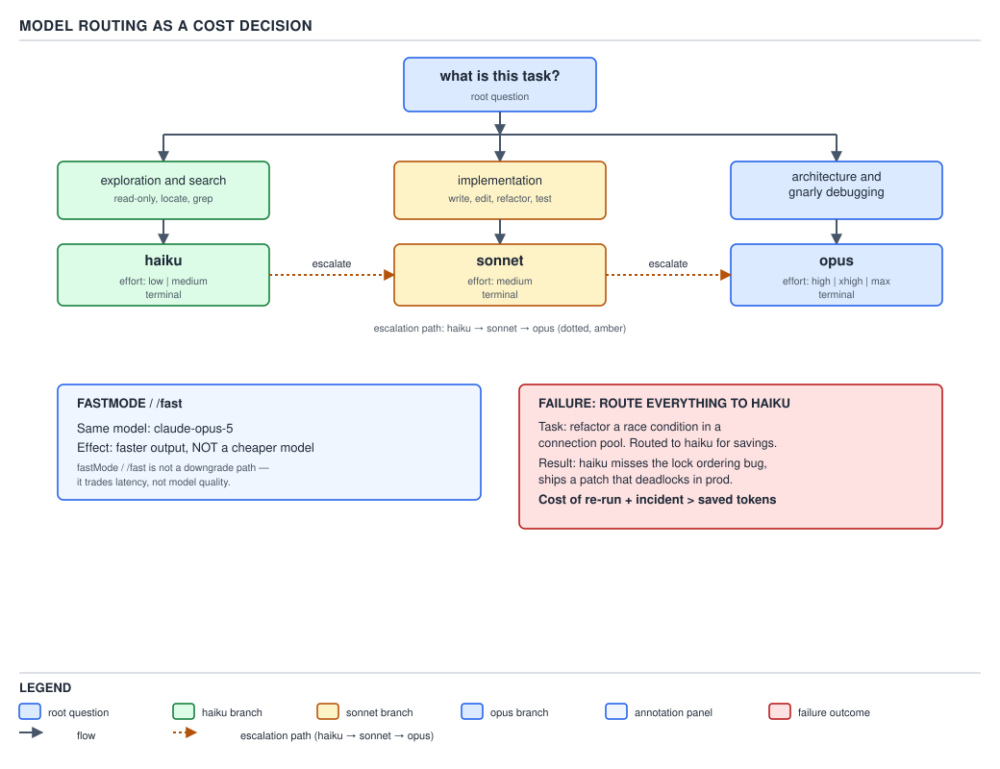

# 21 AI for Coding — effort, models and routing — ADVANCED (INTERNALS) (§3.5.1–3.5.6)

**Target version: Claude Code v2.1.2xx (August 2026).** | **Part 3 of 6** | [Index](../00-index.md)
Previous: [the three ceilings, and reading cost back](../cost-model/03-internals-b-ceilings-and-reading-it-back.md) · Next: [the headless surface](../headless/03-internals-a-the-surface.md)

The previous file closed the cost-model area with three ceilings and two ways to read a run's cost
back. This file spends that vocabulary rather than re-deriving it: the reader already knows the model
tiers and their approximate cost ratio (§0.1.10–0.1.11, D-04), that extended thinking itself costs
tokens (§0.3.10), and the four billed quantities from the previous two files. What is new here is the
decision layer sitting on top of all of it — **which model, at which effort, for which task** — and
the honest cost of getting that decision wrong.

### 1. Effort levels: what they change

**Mental model.** Effort is not a separate model — it is a dial on the same model that trades tokens
for depth of reasoning before the model commits to an answer. Turning it up does not make the model
smarter about facts it does not know; it makes the model spend more of the context window's turn
budget deliberating before it emits a token the reader sees.

**Why it exists.** A one-line lookup and a multi-file refactor plan are not the same task, but before
effort levels existed the only lever available for "think harder" was switching to a bigger, more
expensive model altogether — coarse, and wasteful for a task that is small but merely fiddly rather
than large.

**How it works.** `[DOC]` Re-verified against `cli-reference` and `settings-reference` on 2026-08-30.
`[NUM]` Five effort levels exist: `low`, `medium`, `high`, `xhigh`, `max`. `cli-reference` states for
`--effort`: "Set the effort level for the current session. Options: `low`, `medium`, `high`, `xhigh`,
`max`, or `ultracode`. Available levels depend on the model. … Overrides the `effortLevel` setting for
this session and does not persist." `[VERSION]` `ultracode` is not a seventh rung above `max` — the
`skills` page's own substitution-variable table is explicit that "`${CLAUDE_EFFORT}` … Ultracode is not
a distinct level and reports as `xhigh`," and `cli-reference` gates it behind "requires Claude Code
v2.1.203 or later." `ultracode` is a *mode* — it starts the session at `xhigh` and turns on a separate
autonomy feature — not a sixth effort tier; a reader who has seen five values plus `ultracode` in a
help string and concluded there are six levels has the wrong model.

`effortLevel` is the persistent counterpart: `settings-reference` describes it as saving "the
`/effort` level so future sessions reason more or less deeply," settable in any settings file, so it
is the same five-value dial but written to disk instead of set for one session. `--effort` on the
command line and `/effort` inside an interactive session both override `effortLevel` for that session
only; neither one edits the settings file underneath it. `${CLAUDE_EFFORT}` is a third, narrower
surface: the `skills` frontmatter reference documents it as a **skill-content substitution variable**
— "The current effort level: `low`, `medium`, `high`, `xhigh`, or `max`," available for a skill body to
read and branch on, not a shell environment variable a wrapper script can export to configure Claude
Code from outside.

**Code.**

```bash
claude --effort high
```

```json
{
  "effortLevel": "medium"
}
```

The JSON is a complete, minimal `.claude/settings.json` — `effortLevel` is the only key it needs to
set the persistent default; a real project file layers this beside `permissions` and `model`.

**Gotcha.** `[TRAP]` **Pitfall:** exporting `CLAUDE_EFFORT=high` in a shell profile expecting it to
behave like an environment-variable override the way `ANTHROPIC_MODEL` does for the model. **Symptom:**
the session starts at whatever `effortLevel` the settings files resolve to, ignoring the exported
variable, because `CLAUDE_EFFORT` was never found as a documented input on any of this topic's nine
permitted pages — only `${CLAUDE_EFFORT}` as a read-only value a skill body can interpolate.
**Fix:** set effort with `--effort` for one session, `/effort` inside a session, or `effortLevel` in a
settings file for a persistent default; there is no environment-variable input for it. **Why people
believe it:** `ANTHROPIC_MODEL` and several other Claude Code knobs really are environment-variable
driven, so the pattern generalizes wrongly to effort. **Unverified:** whether a `CLAUDE_EFFORT`
environment variable exists anywhere in the current binary outside of what the nine permitted pages
document — none of `settings-reference` or `cli-reference` names one as of 2026-08-30, so this file
treats it as undocumented rather than confirmed absent.

> Effort is a per-session or per-settings-file dial with five values — `low` through `max` — that
> trades tokens for how much a model deliberates before answering, set by `--effort` or `/effort` for
> one session or by `effortLevel` for a persistent default, with no environment-variable input.

### 2. Per-skill and per-agent overrides, and their lifetime

**Mental model.** A skill or a subagent definition can pin its own model and effort independently of
whatever the surrounding session is using — a narrow, scoped override rather than a session-wide
setting, and the two scopes expire differently.

**Why it exists.** A skill that does mechanical text extraction and a skill that drafts an
architecture proposal should not have to make the *user* remember to switch models before invoking
each one; the choice belongs with the skill author, who knows the task shape, not with whoever happens
to be running the session that turn.

**How it works.** `[DOC]` Re-verified against `skills` and `sub-agents` on 2026-08-30, quoted
verbatim. The `skills` frontmatter reference:

| Field | Required | Description |
|---|---|---|
| `model` | No | Model to use when this skill is active. The override applies for the rest of the current turn and is not saved to settings; the session model resumes on your next prompt. Accepts the same values as `/model`, or `inherit` to keep the active model. … With `context: fork`, the value sets the forked subagent's model instead. |
| `effort` | No | Effort level when this skill is active. Overrides the session effort level. Default: inherits from session. Options: `low`, `medium`, `high`, `xhigh`, `max`; available levels depend on the model. |

The `sub-agents` frontmatter reference:

| Field | Required | Description |
|---|---|---|
| `model` | No | Model to use: `sonnet`, `opus`, `haiku`, `fable`, a full model ID (for example, `claude-opus-5`), or `inherit`. Defaults to `inherit`. |
| `effort` | No | Effort level when this subagent is active. Overrides the session effort level. Default: inherits from session. Options: `low`, `medium`, `high`, `xhigh`, `max`; available levels depend on the model. |

`[NUM]` The lifetimes differ by scope, and the difference is exactly the one the leaf names: **a
skill's override is scoped to the turn** — "applies for the rest of the current turn … the session
model resumes on your next prompt" — while **a subagent's override is scoped to that subagent's own
run** — "when this subagent is active." A skill invoked with `context: fork` collapses the two: its
`model`/`effort` fields then configure the forked subagent instead of the invoking turn, so the
subagent-lifetime rule applies, not the turn-lifetime one. Neither scope is a session-level or
settings-file change; both revert automatically, which is the property that makes them safe to hand
out per-artefact without a human remembering to revert them.

**Code.** A skill pinned cheap for a mechanical, high-volume task:

```yaml
---
name: readonly-reviewer
description: Flags obvious lint and style issues in a diff without proposing fixes. Read-only.
model: haiku
effort: low
allowed-tools: Read Grep
---

Scan the diff for lint-level issues only: unused imports, inconsistent naming, missing
`Override` annotations, obvious dead code. List each with a file and line. Do not propose fixes
and do not comment on architecture or correctness — that is a different reviewer's job.
```

A subagent definition pinned expensive for the opposite reason:

```markdown
---
name: architecture-auditor
description: Reviews a multi-file design change for coupling, failure isolation and scaling limits.
model: opus
effort: high
---

Read every file the caller names before commenting. State the coupling risk, the failure-isolation
gap and the scaling ceiling explicitly; do not summarize the diff back to the caller.
```

**Insight:** because both overrides expire automatically, a project can afford to be liberal about
pinning cheap models onto narrow, mechanical skills — there is no cleanup step, no risk of a forgotten
`opus` pin silently taxing every future session, because the scope closes itself.

**Gotcha.** `[TRAP]` **Pitfall:** treating a project's `.claude/skills/*/SKILL.md` `model:` fields as
if they were the only place per-task model selection can live, and rebuilding the same idea from
scratch when a routing decision needs to apply at the level of a whole pipeline step rather than one
skill invocation. **Symptom:** an orchestration layer that shells out to `claude -p` per pipeline stage
has no frontmatter to put a `model:` field in — a CLI subprocess is not a skill or a subagent, so
this leaf's mechanism does not reach it. `[CASE]` The read-only **sdlc-harness** hit exactly this gap:
its `workflows/code_to_commit/spec.yaml` hardcoded `agents.coder.model: sonnet` workflow-wide with no
per-story override, so risk-tiered steps that RFC 0003's own routing table said should run on
`opus`/`opus·xhigh` silently got `sonnet` review instead. `docs/adr/0023-per-story-agent-model-override.md`
records the fix as two new CLI flags on the harness's own engine, not on `claude` itself:

```
**Two new repeatable `engine.cli` flags — `--agent-model STEP=MODEL` and `--agent-effort
STEP=LEVEL` — override `spec.agents.<step>.model`/`.effort` in memory, per invocation, before
`run_loop` starts.**
```

and `harness/control-plane/schemas/task-entry.yaml` adds the schema-level fields a task author sets
per story:

```yaml
coder_model:
  type: string
  description: >
    Absent = the code_to_commit spec's default (sonnet). See RFC 0003 §4's
    model-routing table for which risk tier warrants an override.
coder_effort:
  type: string
  description: >
    e.g. "high"/"xhigh". Maps to `--agent-effort coder=<value>`. Absent = no
    --effort flag is passed (the CLI's own default applies).
```

**Fix:** recognize that Claude Code's skill/agent `model`/`effort` frontmatter and a headless
orchestrator's own per-step model routing are two different mechanisms solving the same problem at two
different layers — the first configures an interactive session's own artefacts, the second configures
what flags a wrapper passes to a `claude -p` subprocess it launches — and a system with both an
interactive surface and a headless pipeline needs to design the second explicitly rather than assuming
the first covers it. **Why people believe it:** both mechanisms use the words "model" and "effort" and
both solve "route this task to the right tier," so it reads as one mechanism until a headless pipeline
step turns out to have no frontmatter at all to put the override in.

> A skill's `model`/`effort` override lasts for the rest of the turn that invoked it; a subagent's
> lasts for that subagent's own run; both revert automatically with no settings-file write — and
> neither mechanism reaches a headless `claude -p` subprocess a pipeline launches directly, which needs
> its own per-invocation flag or schema field, as the sdlc-harness's own ADR 0023 had to build.

### 3. Routing as a cost decision

**Mental model.** Model choice is not a taste preference between three similarly-capable options —
it is the same kind of decision as choosing an instance size for a batch job: match the resource to
the task's actual demand, because both underpaying and overpaying have a real cost.

**Why it exists.** `[NUM]` §0.1.10–0.1.11 and D-04 already established the tiers and their
approximate per-token cost ratio; that ratio is precisely why routing matters at all. If every tier
cost the same, the only question would be "which model is smartest," and the answer would always be
the same model, every time, for every task. Because the tiers are priced apart, "smartest available"
and "cheapest sufficient" are different answers for different tasks, and picking between them is an
engineering decision with a dollar consequence attached to every wrong call.

**How it works.** The routing table this leaf is graded against:

| Task shape | Model | Effort | Why |
|---|---|---|---|
| Exploration and search — finding a definition, listing call sites, classifying files | `haiku` | `low`–`medium` | Cheap to verify: the answer is a location or a label, checked in seconds against the file itself |
| Implementation — writing or editing code to a stated spec | `sonnet` | `medium` | The default competence tier: enough reasoning depth for ordinary feature and bugfix work without paying the top tier's premium |
| Architecture and gnarly debugging — a multi-file design tradeoff, a root-cause hunt with no obvious next step | `opus` | `high`–`xhigh`–`max` | Expensive to verify if wrong: a bad architectural call or a wrong root cause can propagate for days before anyone notices |

`[NUM]` The escalation path is `haiku → sonnet → opus`, not a free choice among three peers: start at
the cheapest tier the task shape plausibly fits, and move up only when that tier's own output shows it
is out of its depth — a stalled exploration, a fix that does not hold, a design question the model
keeps deferring. Escalating after evidence of insufficiency costs less on average than starting every
task at the top tier "to be safe," because most tasks in a real codebase are exploration or ordinary
implementation, not architecture.



**D-79** — Model routing as a cost decision. Read the failure panel: the cheap model's wrong answer
cost more than the saving.

**Code.** Pinning the routing table's defaults at the settings-file level, so a session opens already
biased toward the cheap tier and escalates by hand only when a task calls for it:

```json
{
  "model": "claude-sonnet-5",
  "effortLevel": "medium"
}
```

Escalating one invocation explicitly, from the shell, for a task already known to be architecture-shaped:

```bash
claude --model opus --effort xhigh -p "Review the coupling between the checkpoint writer and the retry loop before this design lands."
```

**Gotcha.** No gotcha at this leaf beyond §4's and §6's below — the routing table itself has no
surprising edge; the surprises live in what happens when the table is ignored in either direction.

> Routing sends exploration and search to `haiku`, ordinary implementation to `sonnet`, and
> architecture or gnarly debugging to `opus`, escalating along that path only on evidence a cheaper
> tier is out of its depth, because the tiers are priced apart and matching cost to task demand is an
> engineering decision, not a preference.

### 4. The knobs beneath routing

These four settings and one CLI flag do not choose a task's tier — they configure what happens
*around* whichever tier is chosen: what to try if it is unavailable, whether to pause before
switching, which model answers a specific internal tool, and how a model ID maps onto a cloud
provider's own naming. `[DOC]` Re-verified against `settings-reference` and `cli-reference` on
2026-08-30.

| Setting / flag | Scope | Quoted description |
|---|---|---|
| `fallbackModel` | Any settings file | "Name backup models for when the primary is overloaded" |
| `--fallback-model` | CLI, this invocation | "Enable automatic fallback to the specified model(s) when the primary model is overloaded or not available, for example a retired model. Accepts a comma-separated list tried in order. … To persist a chain across sessions, use the `fallbackModel` setting, which this flag overrides" |
| `switchModelsOnFlag` | Any settings file | "Switch models automatically or pause when a safety classifier flags a request" |
| `advisorModel` | Any settings file | "Pick which model answers when Claude asks the advisor tool" |
| `modelOverrides` | Any settings file | "Map model IDs to your provider's IDs, such as Bedrock ARNs" |
| `modelPicker` | User or managed | "Choose which models the `/model` picker lists, in your own order and with your own labels" |

**Mechanism, in three beats.** `fallbackModel` and `--fallback-model` solve availability, not cost or
quality — a comma-separated list tried in order when the primary is overloaded or retired, with the
flag overriding the persisted setting for one invocation. `switchModelsOnFlag` is a safety gate rather
than a cost control: it governs whether a flagged request switches models automatically or the run
pauses for a human, independent of which tier the task would otherwise route to. `modelOverrides`
solves a naming problem specific to Bedrock and Vertex deployments, where the model the rest of this
file calls `opus` is addressed by an ARN or a provider-specific identifier instead of the short alias
— the mapping lives in this key so the rest of a project's configuration can keep using the short
alias everywhere else.

**Gotcha.** `[TRAP]` **Pitfall:** treating `--fallback-model` as a cost-routing mechanism — "fall back
to a cheaper model to save money." **Symptom:** a fallback chain ordered cheapest-first fires on
ordinary overload, silently downgrading an architecture-shaped task to a cheaper tier with no
correctness check, because the fallback trigger is availability, not the task's own demand. **Fix:**
order a fallback chain by capability similarity to the primary, not by price, and keep task-shape
routing (§3) as a separate decision made before dispatch, not something `--fallback-model` is asked to
also do. **Why people believe it:** a comma-separated list of "backup models" reads like a routing
table, and it is one — but for availability, not for cost.

> `fallbackModel` and `switchModelsOnFlag` answer "what if the chosen model is unavailable or flagged,"
> `advisorModel` answers "which model backs one specific internal tool," and `modelOverrides` answers
> "what does this cloud provider call the model I mean" — none of the four choose a task's tier, which
> stays §3's job.

### 5. `fastMode` and `/fast`: faster output, not a downgrade

**Mental model.** The name invites the wrong inference. `fastMode` sounds like a smaller, weaker model
swapped in for speed — it is not. It is the same Opus model, producing output faster.

**Why it exists.** `[DOC]` Re-verified against `settings-reference` on 2026-08-30: `fastMode` —
"Turn fast mode on for sessions where it's available" — with a companion `fastModePerSessionOptIn` —
"Require people to turn fast mode on each session" — for an organization that wants the feature
available but not silently defaulted on. Neither description mentions changing which model answers;
both describe a latency property of the existing model's own output path.

**How it works.** `[TRAP]` **Pitfall:** assuming `/fast` trades quality for speed the way choosing a
smaller model tier does. **Symptom:** a task that plainly needed Opus-level judgment gets run under
`/fast` "to save time," on the belief that some correctness margin was traded away for the speed gain,
when the leaf's own framing is that no such trade occurred — the model answering the question did not
change. **Fix:** treat `fastMode` as an latency knob orthogonal to the routing decision in §3, not a
cheaper alternative to it — if a task is architecture-shaped, it still belongs on `opus` at whatever
effort the work demands; `fastMode` only affects how quickly that same model's output arrives, not
which model or how much it reasoned first. **Why people believe it:** every other lever this file
covers — model tier, effort level — trades some capability for cost or speed, so a fourth lever with
"fast" in its name is assumed, by the pattern, to trade the same way; it is the one lever here that
does not.

**Code.**

```json
{
  "fastMode": true,
  "fastModePerSessionOptIn": false
}
```

**Gotcha.** Already stated above as the leaf's own trap — there is no further surprising edge beyond
the name-versus-mechanism mismatch itself.

> `fastMode`/`/fast` makes the same Opus model's output arrive faster; it is a latency property, not a
> cheaper or weaker model, and confusing the two means either wrongly avoiding a real speed win or
> wrongly trusting `/fast` to also lower a task's tier when it does not.

### 6. The failure panel: routing everything to the cheapest model

**Mental model.** A routing table that always names the cheapest tier is not a cost optimization — it
is a bet that every task's correctness is cheap to verify, and that bet is false for exactly the tasks
where it matters most.

**Why it exists.** `[TRAP]` The argument only lands once one fact from earlier in this guide is
carried forward: §0.1.8 already established that **fluency is worthless as a correctness signal** — a
model's output reads confidently regardless of whether it is right. A cheap model's wrong answer does
not announce itself by looking uncertain or clumsy; it reads exactly as fluent as a correct one from
either tier. That is precisely why "route everything to `haiku`" is not a safe default: the failure
mode it produces is invisible at the point it occurs.

**How it works.** `[PROVE]` Work the full cost through, term by term, rather than asserting "it costs
more":

A concurrency-review task — the reader has this exact shape available from §3.8.8 and D-06's
bulkhead-and-retry material: a caller adds a bounded retry around a flaky downstream call, and the
question is whether the retry preserves the last successfully parsed response on the failing attempt
or silently discards it. This is an implementation task on its face — code gets written — but the
correctness question underneath it is a concurrency-hazard judgment call, the shape §3's table sends
to `sonnet` or higher, not `haiku`.

Routed to `haiku` anyway because "it's just adding a retry loop": the model produces a fluent,
plausible-looking `Semaphore`-guarded retry. It compiles, the happy-path test passes, and the diff
reads as competent — because fluency does not distinguish a correct retry from one that quietly drops
the last parsed envelope on the failing branch, exactly the hazard this guide's own §4.5.5 retry
material calls out by name. The bug is real, and it is invisible at review time because nothing about
the code's *shape* looks wrong.

Now the arithmetic. Call the `haiku` attempt's own cost negligible — a few cents at most, by the
tier's own pricing relative to the tiers above it (§0.1.11) — and set that number aside; it is not
where the cost lives.

1. **Detection cost.** The bug does not surface at review time. It surfaces later, in production,
   under exactly the failing-then-recovering traffic pattern the retry exists to handle — the
   scenario least likely to be exercised by a quick manual check and most likely to be exercised by
   real load. Someone spends a debugging session — real engineer time, not model tokens — tracing a
   data-loss report back to a fourteen-line retry block that "looked fine."
2. **The re-run.** Once the actual hazard is identified, the fix itself is small — but it now has to
   be re-specified and re-reviewed properly, this time on the tier the task actually warranted. Reusing
   this guide's own real, observed figure for what one full `claude -p --output-format json`
   architecture-tier invocation costs cold — `$0.17333975`, from the previous file's own measurement —
   as a stand-in unit for "one properly-routed re-run of comparable size," the re-run alone costs
   roughly ten times what the original `haiku` attempt did, before counting anything else.
3. **The downstream cost.** This is the term that dwarfs the other two, and it is the one a routing
   decision cannot see in advance: whatever the silently-dropped envelope actually cost once it reached
   a caller that trusted the retry to preserve it — a support ticket, a reconciliation job run twice, an
   on-call engineer's evening. Nothing about the `haiku` attempt's own cost line reflects this at all;
   it is entirely external to the model invocation that caused it.

Summed, the "savings" from routing a concurrency-hazard implementation task to the cheapest tier is a
few cents; the realized cost is a debugging session plus a properly-routed re-run plus whatever the
dropped data cost downstream — and the entire chain exists only because the wrong answer was fluent
enough to pass review unchallenged.

**Code.** No new artefact — the failure panel of D-79 above **is** this leaf's diagram; it draws the
same chain this section works through in prose: a task routed to the cheap tier, a wrong result that
looks fine, and a total cost that exceeds what the expensive tier would have cost from the start.

**Gotcha.** `[TRAP]` **Pitfall:** treating this argument as "never use the cheap tier." **Symptom:**
every task, including genuinely mechanical ones, gets routed to `sonnet` or `opus` "to be safe,"
paying the top tier's premium on high-volume work that never needed it. **Fix:** apply the actual
discriminator, not a blanket rule: **how expensive is it to detect that this output is wrong?**
Listing every file matching a glob, classifying files by extension, searching for a symbol's
definition — these are cheap to verify by inspection, so the cheap tier is straightforwardly the right
call and paying for `opus` on them is waste in the other direction. A concurrency hazard, a
data-loss edge case, an architectural coupling decision — these are expensive to verify, because being
wrong does not look wrong, so the tier has to be the one that gets it right the first time. **Why
people believe it:** "cheaper is always better until proven otherwise" is a true heuristic for
resource costs the reader can see immediately (tokens, dollars per call), and false for the one cost
this section's arithmetic makes visible — the cost of not noticing a wrong answer at all.

**Interview:** "When is it wrong to route a task to the cheapest capable-looking model?" — When the
task's correctness is expensive to verify, because a cheap model's fluent wrong answer is
indistinguishable from a correct one at review time; the discriminator is not the task's apparent
difficulty but how cheaply a wrong output gets caught, and the cost of an uncaught wrong output —
detection plus re-run plus downstream damage — routinely exceeds whatever the cheap tier saved.

> Routing everything to the cheapest model treats every task's correctness as cheap to verify, which is
> false exactly where it matters most; the discriminator is not task size but detection cost — cheap to
> check, route cheap; expensive to check, pay for the tier that gets it right the first time, because a
> wrong answer from a fluent cheap model does not announce itself.

## Pitfalls

- **Belief in action:** `CLAUDE_EFFORT` can be set as a shell environment variable to configure
  effort the way `ANTHROPIC_MODEL` configures the model. **Surprising outcome:** the session ignores
  it; only `--effort`, `/effort`, and the `effortLevel` setting are documented inputs, while
  `${CLAUDE_EFFORT}` is a read-only skill-content substitution, not an input. **What actually gets the
  guarantee:** set effort via `--effort` (session), `/effort` (session), or `effortLevel` (persistent
  default). **Why people believe it:** several other Claude Code knobs really are environment-variable
  driven, so the pattern over-generalizes.
- **Belief in action:** a project's `.claude/skills/*/SKILL.md` `model:`/`effort:` fields are the only
  place per-task model routing can live. **Surprising outcome:** a headless orchestrator shelling out
  to `claude -p` per pipeline stage has no frontmatter to put a `model:` field in, and the sdlc-harness
  hit exactly this gap before ADR 0023 added its own `--agent-model STEP=MODEL` / `--agent-effort
  STEP=LEVEL` engine flags. **What actually gets the guarantee:** design per-step routing explicitly at
  whichever layer launches the subprocess — skill/agent frontmatter for an interactive session, an
  engine-level flag or schema field for a headless pipeline. **Why people believe it:** both mechanisms
  solve "route this task to the right tier," so they read as one mechanism until the headless case
  turns out to have no frontmatter at all.
- **Belief in action:** `fastMode`/`/fast` trades quality for speed like choosing a cheaper model
  tier does. **Surprising outcome:** it is the same Opus model producing output faster — no capability
  is traded away, so avoiding it "to be safe" gives up a real speed win for nothing, while trusting it
  to also lower a task's tier gets nothing either, because it does not. **What actually gets the
  guarantee:** treat `fastMode` as an orthogonal latency knob; keep the model-tier decision in §3
  separate from it. **Why people believe it:** every other lever in this file trades capability for
  cost or speed, so the pattern wrongly generalizes to the one lever that does not.
- **Belief in action:** routing everything to the cheapest capable-looking model is a pure cost
  saving. **Surprising outcome:** a fluent wrong answer from the cheap tier is indistinguishable from a
  correct one at review time, so the "saving" is often smaller than the detection cost plus the re-run
  plus whatever the wrong answer cost downstream before anyone noticed. **What actually gets the
  guarantee:** route by detection cost, not by task size — cheap to verify, route cheap; expensive to
  verify, pay for the tier that gets it right the first time. **Why people believe it:** the visible
  cost (tokens, dollars per call) is immediate; the invisible cost (an undetected wrong answer) only
  shows up later, if ever, to whoever traces the failure back.

## Cheat sheet

| Lever | Scope | Reverts automatically? | Chooses task tier? |
|---|---|---|---|
| `--effort` / `/effort` | This session | Yes — session-only | No — depth, not model |
| `effortLevel` | Persistent (settings file) | No — written to disk | No — depth, not model |
| Skill `model:` / `effort:` frontmatter | Rest of the invoking turn | Yes | Yes, for that skill's own invocations |
| Subagent `model:` / `effort:` frontmatter | That subagent's own run | Yes | Yes, for that subagent's own dispatches |
| `fallbackModel` / `--fallback-model` | Availability fallback chain | Session (flag) / persistent (setting) | No — availability, not cost |
| `switchModelsOnFlag` | Safety-classifier response | Persistent | No |
| `advisorModel` | One internal tool | Persistent | No |
| `modelOverrides` | Provider ID mapping (Bedrock/Vertex ARNs) | Persistent | No |
| `modelPicker` | What `/model` lists, in what order | Persistent (user/managed) | No — presentation, not selection |
| `fastMode` / `/fast` | Output latency on the same model | Session | No — speed, not tier |
| Routing table (§3) | Every dispatch decision | n/a | Yes — this is the decision |

## Self-test

1. How many effort levels are there, and where does `ultracode` fit?
<details><summary>Answer</summary>Five: `low`, `medium`, `high`, `xhigh`, `max`. `ultracode` is not a
sixth level — it starts a session at `xhigh` and turns on a separate autonomy feature; the
`${CLAUDE_EFFORT}` substitution reports `ultracode` sessions as `xhigh`.</details>

2. What is the lifetime difference between a skill's `model:` override and a subagent's `model:`
   override?
<details><summary>Answer</summary>A skill's override lasts for the rest of the current turn and
reverts on the next prompt; a subagent's override lasts for that subagent's own run, since a subagent
is its own separately-scoped execution rather than a turn inside the parent's session.</details>

3. Name the three-tier routing table and the escalation path.
<details><summary>Answer</summary>Exploration/search → `haiku`; implementation → `sonnet`;
architecture and gnarly debugging → `opus`. Escalation runs `haiku → sonnet → opus`, moving up only on
evidence the current tier is insufficient rather than defaulting to the top tier for every task.</details>

4. Does `--fallback-model` route by cost?
<details><summary>Answer</summary>No. It answers an availability question — what to try if the
primary model is overloaded or retired — not a cost or quality question; ordering a fallback chain
cheapest-first can silently downgrade an architecture-shaped task with no correctness check.</details>

5. Is `fastMode` a cheaper model?
<details><summary>Answer</summary>No. `settings-reference` describes it as turning fast mode on for
available sessions, with no mention of changing which model answers — it is the same Opus model
producing output faster, a latency property, not a tier downgrade.</details>

6. Why doesn't a wrong answer from a cheap model "announce itself"?
<details><summary>Answer</summary>Because fluency is worthless as a correctness signal (§0.1.8) — a
cheap model's confident, well-formed wrong answer reads exactly as competent as a correct one from any
tier, so nothing about its surface shape flags the error at review time.</details>

7. What is the actual discriminator for routing to the cheap tier versus paying for a better one?
<details><summary>Answer</summary>How expensive it is to detect that the output is wrong — not the
task's apparent size or difficulty. Cheap-to-verify work (listing, searching, classifying) belongs on
the cheap tier; work where a wrong answer looks the same as a right one belongs on a tier that gets it
right the first time.</details>

8. Why couldn't the sdlc-harness's own skill/agent frontmatter solve its per-story model routing gap?
<details><summary>Answer</summary>Because the routing decision needed to apply to a headless
`claude -p` subprocess launched per pipeline step by the harness's own engine, not to an interactive
session's skills or subagents — there was no frontmatter file in that path to put a `model:` field in,
so ADR 0023 added `--agent-model STEP=MODEL` / `--agent-effort STEP=LEVEL` engine-level flags
instead.</details>

## Open questions

- **Unverified:** whether a `CLAUDE_EFFORT` environment variable exists as a documented input
  anywhere in the current binary, as of 2026-08-30 — neither `settings-reference` nor `cli-reference`
  names one; only the read-only `${CLAUDE_EFFORT}` skill-content substitution is documented on the
  `skills` page.
- **Unverified:** the exact set of models each effort level is available on — both `cli-reference`
  and the `skills`/`sub-agents` frontmatter tables state "available levels depend on the model" without
  itemizing which levels which models support, as of 2026-08-30.

---

**Leaves covered:** 3.5.1–3.5.6 (6 leaves)
**Leaves deferred:** none
**Diagrams included:** D-79
**Target version:** Claude Code v2.1.2xx (August 2026)
**Lines:** 527
