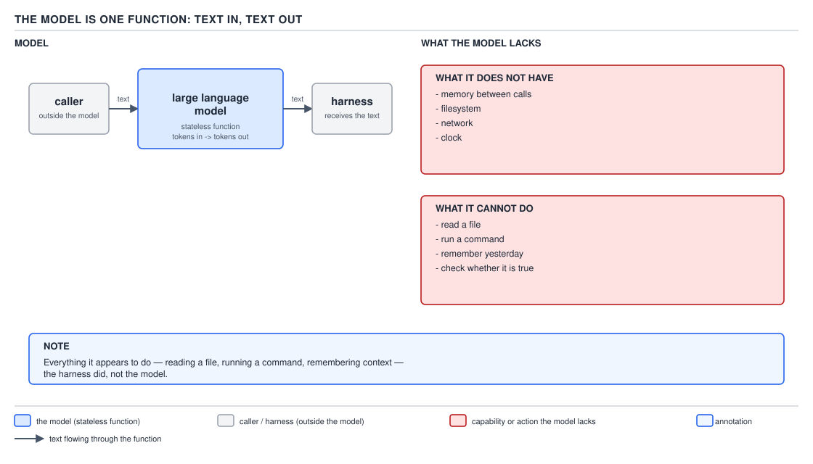
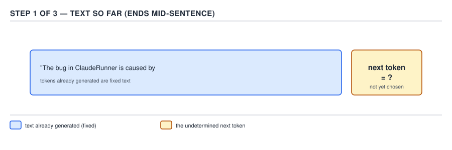
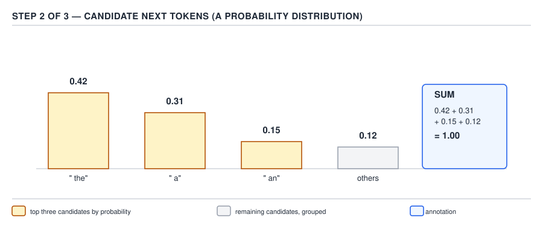
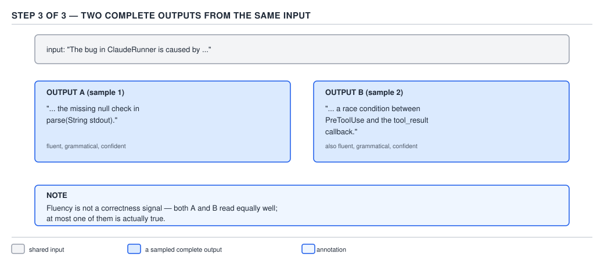
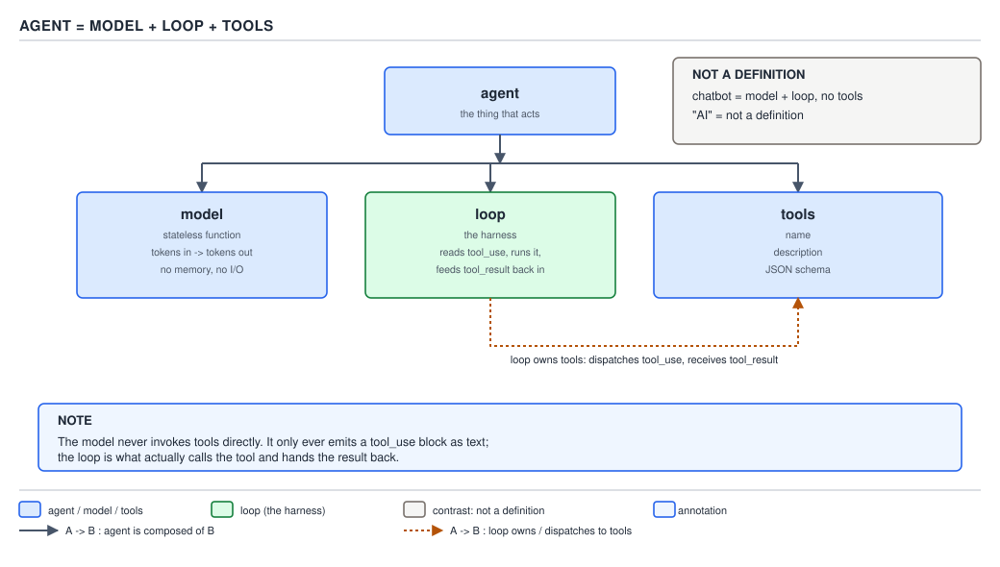

# 21 AI for Coding — what the model is — BASICS (§0.1)

**Target version: Claude Code v2.1.2xx (August 2026).** | **Part 0 of 6** | [Index](../00-index.md)
Next: [the context window](02-basics-context-window-a.md)

Everything else in this guide — the settings files, the permission system, the hooks, the
subagents, the cost dashboards — is scaffolding built around one thing: a function that turns text
into more text. This file is that function, nothing more and nothing less. Get this file wrong and
every later file inherits the mistake, because every later file assumes you already believe this
one.

### 1. The model is one function: text in, text out

**Mental model.** Picture the plainest possible Java method you can write: no fields, no
constructor, no `this`, nothing held between calls.

```java
static String respond(String conversationSoFar) {
    // the body is not code — it is a fixed set of numbers (the trained weights) —
    // but the shape of the call is exactly this: one string argument, one string return
    return "...";
}
```

A **large language model** ("LLM" — the "model" in "AI model", the thing people mean when they say
"Claude") is that method, at planetary scale. `[ZERO]` You hand it a block of text — the
conversation so far — and it hands back a block of text. Call it again with the same conversation
plus a new line, and it is a brand new call: no field carried the previous answer forward, because
there is no field. There is no session object living between requests, no in-memory cache of "what
we talked about", no clock it can consult to know how long it has been. Whatever a product built on
top of the model appears to remember, it is the *surrounding software* re-sending the history on
every single call — that surrounding software (settings, files, the conversation log, the loop that
drives it) is the subject of the rest of this guide. The model itself is memoryless, static, and
stateless in exactly the sense `respond` above is stateless.

Because the model is one function, it has no filesystem, no network socket, and no ambient
awareness of your machine. It cannot see that a file exists unless the text of that file was pasted
into its input. It cannot know a command succeeded unless the output of that command was pasted
back in. Nothing about "the model" changes this — not size, not version, not price tier. Every
later file in this guide that talks about a "tool" or an "agent" is describing a piece of software
*outside* the model that reads a file or runs a command and then feeds the result back in as more
text — never the model reaching out and doing it itself.



**D-01** — The model is one function: text in, text out. Read the two panels on the right: what it
does not have, and what it cannot do.

**Pitfall:** the belief in action is treating a long, coherent-sounding conversation as proof the
model is tracking state internally — "it remembers we discussed the `ClaudeEnvelope` record three
messages ago, so it must be holding that in memory." The surprising outcome shows up the moment the
conversation is trimmed or summarized (file 02 covers exactly when and how that happens): the model
suddenly seems to "forget" something it referenced fluently one message earlier. What actually gets
the guarantee that it "remembers" something: the text describing it is still present, verbatim or
summarized, inside the next call's input. Nothing else carries it. `[TRAP]`

**Why people believe it:** a chat interface visually threads messages into one continuous scrolling
transcript, which looks exactly like the persistent, stateful conversation a human would have — the
interface manufactures the illusion of memory by re-displaying (and re-sending) everything, and the
re-sending step is invisible to the user.

> A large language model is a stateless function: given the text so far, it returns more text, and
> retains nothing about the call once it returns.

### 2. Next-token prediction and sampling

**Mental model.** Forget "the model writes a sentence." It does not compose in that sense at all.
It looks at the text so far and asks one question, repeatedly: "of everything that could come next,
one character-chunk at a time, how likely is each candidate?" `[ZERO]`

**Why it exists.** A model can only be trained to do one well-defined thing efficiently: given a
huge amount of real text, learn to guess the next small chunk given everything before it. That
narrow task, repeated token by token, is what turns into essays, code, and conversation — there is
no separate "planning module" underneath; the appearance of planning is an emergent side effect of
predicting well, one chunk at a time, over and over.

**How it works.** At each step the model does not output a token directly. It outputs a **probability
distribution** — a score for every possible next chunk of text in its vocabulary (tens of thousands
of candidates), where the scores sum to 1. A separate step, **sampling**, then picks one candidate
from that distribution — not necessarily the highest-scoring one — and that becomes the next token.
The chosen token is appended to the text, and the whole process repeats: distribution, sample,
append, distribution, sample, append, until a stop condition is hit.



**D-03a** — The text so far: this is the entire input to the next prediction step, nothing more.



**D-03b** — Candidate next tokens, each with a probability. The distribution sums to 1; the
model does not pick the top one by default — the sampling step does the picking.



**D-03c** — The same input text, sampled twice, producing two different continuations. This is the
mechanism behind the next section.

**Determinism, landed in Java.** `[JAVA]` A real Java method gives you a guarantee the JLS backs:

```java
static int square(int x) {
    return x * x;
}
```

Call `square(7)` a million times, on any JVM, on any hardware, and you get `49` every time — the
language specification guarantees it. The model gives you no such guarantee, `[ZERO]` and the gap
is not a minor rounding difference: send the exact same conversation twice and you can get two
genuinely different continuations, not two continations that happen to round differently. This is
**temperature and sampling**, stated without the underlying maths: the probability distribution in
D-03b is not collapsed to a single answer — a controlled amount of randomness (the "temperature"
knob) decides how sharply the sampler favors the highest-probability candidate versus spreading its
choice across several plausible ones. At `temperature = 0` the sampler is told to always take the
top-scoring candidate, which removes *most* of the variation, but even then two runs of a large
model are not guaranteed to be bit-identical: the arithmetic is spread across many processors, and
floating-point addition is not perfectly order-independent at that scale, so the scores themselves
can shift by an amount too small to matter for correctness but large enough to occasionally flip
which candidate is "the top one." `[ZERO]`

**Precisely where the analogy breaks:**

1. `square` has no knob analogous to temperature — there is nothing in the method signature that
   trades correctness for variety, because there is no concept of "variety" in a pure function's
   contract.
2. `square`'s guarantee comes from the language specification and is absolute. The model's
   near-determinism at `temperature = 0` is an operational property of the runtime, not a
   specification guarantee, and it can still vary run to run.
3. `square(7)` always means the same 7. A model call at "the same input" is comparing entire
   conversations as text; if anything upstream — a timestamp injected into a system prompt, a file
   whose content changed between calls — differs by one character, it is not the same input at all,
   and blaming "non-determinism" for that is a different bug.

**Interview:** "Is Claude Code deterministic?" — No, not even at the lowest sampling setting,
because next-token sampling always draws from a distribution and floating-point summation order is
not guaranteed identical across runs; that is exactly why a test suite that pipes a `claude -p`
answer straight into an assertion of exact string equality is a fragile test, and later files (§3.6,
§4.7) build around checking structure and outcome instead of exact text.

> Next-token prediction: the model turns "the text so far" into a probability distribution over
> what could come next; a separate sampling step draws one token from that distribution, and the
> draw is not guaranteed to repeat.

### 3. The token: the unit of both cost and the limit

**Mental model.** Forget characters, forget words. Everything the model is billed for, and
everything the model is limited by, is counted in **tokens** — chunks of text, not characters and
not words. `[ZERO]`

**Why it exists.** The model does not operate on raw Unicode characters one at a time — that would
make its vocabulary of "next things it could produce" unmanageably large and inefficient. Instead,
text is first broken into a fixed vocabulary of chunks (a mix of whole common words, word pieces,
and individual punctuation marks) by a separate program called a **tokenizer**, and the model's
entire world — its input, its output, its price, its limit — is expressed in that chunk currency.

**How it works, with real numbers.** A **token** is roughly **3–4 characters of English prose, or
about 0.75 words** `[NUM]` — that figure comes from how the tokenizer's vocabulary happens to carve
up ordinary English, where common words and syllables get their own single token and rarer words
split into two or three. Code tokenizes worse than prose, because punctuation-heavy syntax
(`{`, `(`, `::`, `->`) and long, unfamiliar identifiers (`ClaudeEnvelope`, `permissionMode`) do not
line up with the vocabulary's common chunks the way ordinary English sentences do; each punctuation
mark tends to cost its own token, and an identifier the tokenizer has not memorized as a whole gets
split into pieces. `[ZERO]`

`[PROVE]` `[NUM]` Three real strings, counted the same way — split into the meaningful pieces a
subword tokenizer would produce (words, sub-words, and individual punctuation marks) — show the
effect directly rather than asserting it:

| String | Characters | Estimated tokens | Chars per token |
|---|---|---|---|
| `The agent reads the file, decides which tool to call, and waits for the result.` | 79 | 20 | 3.95 |
| `public Optional<ClaudeEnvelope> parse(String stdout) { return Optional.ofNullable(stdout).filter(s -> !s.isBlank()).map(ClaudeEnvelope::fromJson); }` | 148 | 44 | 3.36 |
| `{"model":"claude-sonnet-5","permissionMode":"default","maxTurns":160,"outputFormat":"json"}` | 91 | 38 | 2.39 |

**D-02** — Tokens per character for three real strings. The English sentence sits at the
documented ~3–4 chars/token figure; the Java method is visibly worse because every `<`, `(`, `.`,
`::`, and `->` and every split identifier (`Nullable` → `Null`+`able`-shaped pieces) is its own
token; the minified JSON is worse again because nearly every field is wrapped in its own pair of
quotes and separated by colons and commas, each a token on its own, so a compact-looking blob is
actually token-dense.

**Unverified:** the exact token counts above are estimated by manually segmenting each string the
way a subword (BPE-style) tokenizer segments text — words, common sub-words, and individual
punctuation marks as separate tokens — not by running Anthropic's production tokenizer, which is
not exposed as a local library in this environment. The *direction and rough magnitude* of the
result (prose ≈ 4 chars/token, code and JSON both meaningfully worse) matches the documented
behavior and is not in question; the exact integer counts could be off by a handful of tokens
either way. Recorded in `## Open questions`.

**Why this matters at all.** `[ZERO]` Tokens are the unit of two completely different constraints
that get confused constantly: **cost** — every provider bills per token, input and output priced
separately (§0.1.10 below shows the real numbers) — and **the limit** — the model can only look at
a fixed number of tokens at once (its **context window**, the full subject of file 02), and once a
conversation's token count would exceed that window, something has to give. A response that reads
as "a bit wordy" is not just a style problem; it is tokens spent, on both axes, and file 02 and
§3.4 build directly on this sentence.

**Training cutoff.** `[ZERO]` Separately from tokens, every model has a **training cutoff**: a date
after which nothing in the world was part of its training data, so it has no knowledge of anything
that happened after that date unless that information is supplied to it as input text. This single
fact is why the model needs tools at all (file 03) and why "the model already knows my codebase" is
never true on day one of a new session — it knows what was common on the public internet up to its
cutoff, and nothing about your specific files unless you or a tool put them in front of it.

### 4. Confabulation: why fluency proves nothing

**Mental model.** `[ZERO]` The mechanism in section 2 has no "I don't know" branch built in.
Every single next-token step runs the identical computation — score every candidate, sample one —
whether the model is completing a well-known fact, a made-up API method, or a citation that does
not exist. The generation process cannot distinguish "confident and correct" from "confident and
wrong" because confidence, in the sampling sense, is a property of how sharply peaked the
probability distribution is, not a check against reality.

**Why it exists.** It is a direct, unavoidable consequence of section 2's mechanism, not a bug
that a smarter model removes. A model trained purely to predict plausible next tokens has no
separate faculty that goes and checks a claim against the world before emitting it — there is
nothing to check against, because the model has no tool access unless the harness gives it one
(file 03), and even with tools it is a further, deliberate step, not something the generation
process does automatically.

**How it works.** The industry term is "hallucination"; the more precise and less anthropomorphic
name is **confabulation** — producing a plausible-sounding, well-formed answer that is
disconnected from fact, with exactly the same fluency, grammar, and confident tone as a correct
answer. A confabulated method name, a confabulated CLI flag, or a confabulated file path reads no
differently on the page than a real one — same sentence structure, same tone, same lack of hedging
— because fluency is generated by the same token-by-token process regardless of truth. No code beat
applies here: this is a property of the generation process itself, not an API shape or artefact
that exists as a separate piece of code to show.

**Pitfall:** the belief in action is trusting an answer because it *reads* confident and detailed —
"it named the exact overload, `Optional.ofNullable(String).filter(Predicate)`, with correct-looking
Java syntax, so it must be right." The surprising outcome: a model can produce a perfectly
well-formed, syntactically valid method chain that calls an overload that does not exist, with
zero hedging, at the same fluency as when it is correct. What actually gets the guarantee of
correctness: an external, machine-checkable check — compiling the code, running the test, executing
the command and reading the real exit code and output — never the tone of the answer. File 03's
tool-call mechanism and §2.7.3 in a later part ("a failing test is a machine-checkable
specification") are the actual fix; re-reading the prose more carefully is not. `[TRAP]`

**Why people believe it:** humans use fluency, confidence, and detail as a genuine and mostly
reliable signal of a knowledgeable speaker — a colleague who answers instantly, in full sentences,
with specific names and numbers, usually does know the answer. The model produces that same surface
pattern from a process that has no equivalent notion of "actually knowing," so the heuristic that
works on humans fails silently here.

> Confabulation: a fluent, well-formed, wrong answer, produced by the identical mechanism that
> produces fluent, well-formed, right answers — which is why fluency carries zero information about
> correctness.

### 5. Model naming and capability tiers, as of August 2026

**Mental model.** `[DOC]` `[RESEARCH]` `[VERSION]` There is no single "the model." Anthropic ships
several, at different points on a capability-versus-cost-versus-speed curve, and Claude Code lets
you pick one per task rather than forcing one choice for an entire session.

**Re-verified against `https://code.claude.com/docs/en/model-config` and
`https://platform.claude.com/docs/en/models/overview` on 2026-08-29**, ahead of writing this
section, per this guide's research protocol. As of Claude Code v2.1.2xx:

- The **Claude 5 family** is the current top tier: `claude-opus-5`, `claude-sonnet-5`, and
  `claude-fable-5` are all dateless IDs — the documentation is explicit that "every Claude model
  ID is a pinned snapshot, including the dateless IDs used from the 4.6 generation on," so a
  dateless ID here is not a moving target that silently swaps weights under you.
- **Haiku** is still on the 4.5 generation, and its Claude API ID *does* carry a date snapshot:
  `claude-haiku-4-5-20251001`. The bare alias `claude-haiku-4-5` is a convenience pointer at that
  same pinned snapshot, not a different, newer model.
- Convenience aliases you type instead of a full ID: `opus`, `sonnet`, `haiku`, `fable`, plus
  `best` (resolves to Fable 5 where your organization has access, otherwise the latest Opus), and
  `opusplan` (Opus during plan mode, Sonnet once execution starts — the mode this project's own
  `settings.json` uses, per the global CLAUDE.md's own model routing section, is exactly this).
- The **`[1m]` suffix** (`sonnet[1m]`, `opus[1m]`) means a **1-million-token context window**
  instead of the default; the documentation states this "uses standard model pricing with no
  premium for tokens beyond 200K" — the window gets bigger, the per-token price does not change.

**D-04** — Model tiers, what to use each for, relative cost, and the `[1m]` suffix:

| Model | What to use it for | Relative cost ratio (input, vs. Sonnet = 1×) | What `[1m]` means for it |
|---|---|---|---|
| `claude-opus-5` | complex agentic coding, enterprise-scale reasoning, architecture judgment | 2.5× ($5 vs. $2 per million input tokens) | supported — 1M-token context window at standard per-token pricing |
| `claude-sonnet-5` | daily coding work — the default workhorse for writing and modifying code | 1× (baseline, $2 per million input tokens) | supported — Sonnet 5 "always runs with the 1M context window" on the Anthropic API |
| `claude-haiku-4-5-20251001` | fast, simple, mechanical tasks: search, straightforward lookups, exploration passes where depth is not the point | 0.5× ($1 per million input tokens) | not supported — Haiku 4.5's context window is 200K tokens, no `[1m]` variant |
| `claude-fable-5` | the hardest, longest-running, most autonomous tasks; not the default and not needed for routine coding | 5× ($10 per million input tokens) | supported — 1M-token context window at standard per-token pricing |

*Cost ratios computed from published per-million-input-token pricing: Haiku 4.5 $1, Sonnet 5 $2,
Opus 5 $5, Fable 5 $10 per million input tokens; output tokens are priced separately and higher for
every tier, in the same relative order. Verified against
`https://platform.claude.com/docs/en/models/overview` on 2026-08-29.* `[NUM]`

```
claude --model sonnet -p "summarize the diff" --output-format json
claude --model opus[1m] -p "review this 400-file migration" --output-format json
```

**Capability tiers as an engineering decision, not a brand.** `[NUM]` Treat model choice the way
you would treat choosing between a cache lookup and a full database query: reach for Haiku for
cheap, high-volume, low-stakes passes (a first exploration pass over a codebase, a mechanical
rewrite); reach for Sonnet as the default for actually writing and modifying code, because it is
"the best combination of speed and intelligence" per Anthropic's own comparison; reserve Opus or
Fable for the small fraction of turns that are genuinely hard — an architecture decision, a
tricky root-cause investigation, a task explicitly described as long-running and autonomous — because
those tiers cost 2.5× to 5× as much per input token and the extra spend should track the difficulty
of the task, not run as the default for everything.

**Insight:** the alias and the pinned ID are not the same promise. `sonnet` in a config file
resolves to "whatever Anthropic currently calls the latest Sonnet" — which moves forward over
time as new versions ship — while `claude-sonnet-5` in that same config file is pinned to that
exact snapshot forever (per the "every model ID is a pinned snapshot" rule above). A CI pipeline or
an eval suite (§3.9.10 later in this guide) that needs a stable, reproducible model across months
should reference the dated or dateless *ID*, not the alias; a developer's day-to-day interactive
session, where "give me whatever is best right now" is the actual intent, is exactly what the alias
is for.

> A model tier is a cost/speed/capability trade-off you choose per task, not a single fixed
> setting for a whole project — Haiku for volume and simplicity, Sonnet as the default, Opus or
> Fable reserved for genuinely hard turns.

### 6. Agent: a model, plus a loop, plus tools

**Mental model.** `[ZERO]` A chatbot is a model plus a text box: you type, it replies, you type
again — one call in, one call out, no action taken on the world in between. An **agent** is a
different, stricter shape: a model wired into a **loop** that keeps calling it with the growing
conversation, where the model is also allowed to ask, in its output, for a **tool** — some external
capability such as "run this shell command" or "read this file" — to be run on its behalf, with the
result fed back in as more text before the loop calls the model again.

**Why it exists.** Section 1 established that the model itself cannot read a file, run a command,
or check anything against reality. If the only thing you ever built around it was a single call and
a reply, it would be permanently limited to whatever fit inside its input as pasted text, entered
by a human. An agent exists to close that gap mechanically: let the model *ask* for information or
action, run that on its behalf, and hand the result straight back into the next call — automating
the "paste it back in" step that a human would otherwise have to do by hand, turn after turn.

**How it works.** The model does not run anything itself, ever — the leaf 0.1.1 guarantee holds
without exception even inside an agent. What actually happens: the model emits a structured
block in its output (a "tool use" request — file 03 covers its exact shape) naming a tool and its
arguments; that block is text, nothing more, produced by the same token-by-token process as any
other output. Software outside the model — the harness — reads that block, decides whether the
requested tool is *actually* going to run (file 03's permission system is precisely that decision
point — the model never gets to decide this for itself), executes it if allowed, and appends the
result to the conversation before calling the model again. This is one **turn**: one full trip
around the loop — a model call, at least one thing decided or done as a result of what it said,
and the state that gets carried into the next call.



**D-05** — An agent is not a bigger model; it is the same stateless model from section 1, wrapped
in a loop that resubmits the growing conversation, with a decision point (the harness, not the
model) gating whether a requested tool actually runs.

```java
List<Message> conversation = new ArrayList<>();
conversation.add(new Message(Role.USER, task));

while (true) {
    ModelResponse response = callModel(conversation);      // section 1's respond(), reused
    conversation.add(response.asMessage());

    Optional<ToolUseRequest> requestedTool = response.toolUse();
    if (requestedTool.isEmpty()) {
        break;                                              // no tool asked for: the turn is the answer
    }

    ToolResult result = harnessDecidesAndMaybeRuns(requestedTool.get()); // file 03: the permission gate
    conversation.add(result.asMessage());
    // loop: the model is called again with the tool's result appended
}
```

This sketch shows the *shape* of the loop this guide's later files build for real — `callModel` and
`harnessDecidesAndMaybeRuns` are stand-ins for exactly the pieces PART 4's `ClaudeRunner` (§4.5)
implements against the real `claude -p --output-format json` process boundary, with the full,
compiling class shown there rather than here.

**Pitfall:** the belief in action is using "agent" as a synonym for "chatbot" or as a generic
synonym for "AI product" — calling any UI with a Claude-shaped text box "an AI agent." The
surprising outcome: a plain chat interface with no tool use and no loop deciding further action is
architecturally identical to section 1's single function call, and expecting it to check a fact,
edit a file, or run a test will simply fail, quietly, because there is no loop and no tool wired in
to do that. What actually earns the name: a visible loop (more than one model call per user request,
without the user typing again in between) and at least one tool the model can request. `[ZERO]`

**Why people believe it:** "agent" has become marketing language for "anything involving a
language model," and most products that use the word do not disclose whether a loop and tool
access are actually present underneath the label.

**Interview:** "What's the difference between a chatbot and an agent?" — A chatbot is one model
call per user message, with no ability to take further action; an agent is that same model wired
into a loop with tool access, so a single user request can trigger many model calls and real
actions (file reads, shell commands, edits) chained automatically until the model reports it is
done or a limit is hit.

> An agent is a model plus a loop plus tools: the loop keeps resubmitting the growing conversation,
> and the model's only lever over the outside world is asking, in text, for a tool to be run —
> whether it actually runs is the harness's decision, never the model's.

---

## Pitfalls

| Wrong belief in action | Surprising outcome | What actually gets the guarantee | Why people believe it |
|---|---|---|---|
| "It remembers our earlier discussion because it referenced it fluently." | The reference vanishes the moment the conversation is trimmed or summarized, with no warning. | Whatever text is present, verbatim or summarized, in the *next call's* input — nothing else. | Chat UIs visually thread messages into one scrolling transcript, hiding the re-send step. |
| "It named the exact method overload with confident, correct-looking syntax, so it's right." | A syntactically perfect, fluently-worded call to a method or flag that does not exist. | An external, machine-checkable result — compiling the code, running the test, reading a real exit code. | Fluency, detail, and confidence are reliable correctness signals in humans; the model produces the same surface pattern with no equivalent internal check. |
| "Any product with a Claude-shaped chat box is 'an agent'." | It cannot check a fact, edit a file, or run a test, because no loop and no tool access exist underneath the label. | A visible loop (more than one model call per user request) plus at least one tool the model can request. | "Agent" is now marketing language for "anything involving a language model." |

## Cheat sheet

| Concept | The one line |
|---|---|
| The model | One stateless function: text in, text out. No memory, no filesystem, no clock, nothing between calls. |
| Next-token prediction | At each step: score every possible next chunk, sample one, append, repeat. |
| Determinism | Not guaranteed, even at the lowest sampling setting — contrast with a pure Java method's JLS-backed guarantee. |
| Token | ~3–4 chars of English prose ≈ 1 token; code and JSON tokenize worse (more tokens per character). |
| Why tokens matter | They are the unit of both cost (billed per million) and the limit (the context window, file 02). |
| Confabulation | A wrong answer produced with the identical fluency as a right one — fluency proves nothing. |
| Training cutoff | Knowledge has a hard date boundary; anything after it must be supplied as input text. |
| Model tiers (Aug 2026) | Haiku 4.5 (0.5×) → Sonnet 5 (1×, default) → Opus 5 (2.5×) → Fable 5 (5×), cost relative to Sonnet input pricing. |
| `[1m]` suffix | 1-million-token context window, same per-token price beyond 200K. |
| Agent | Model + loop (resubmits growing conversation) + tools (model asks, harness decides whether it runs). |

## Self-test

1. Why can't the model "just remember" what file it read five minutes ago in the same session?
<details><summary>Answer</summary>
Because the model is a stateless function (section 1): it has no memory between calls. Whatever
appears to be remembered is text from that earlier read still present, verbatim or summarized, in
the input of the current call. If that text is later trimmed or summarized away (file 02), the
model has no other way to recover it — there is no internal store to fall back on.
</details>

2. What actually happens between "the model outputs the next token" and "the token is chosen"?
<details><summary>Answer</summary>
The model does not output a token directly — it outputs a probability distribution over every
candidate next token, scores summing to 1. A separate sampling step then draws one token from that
distribution (not necessarily the highest-scoring one), and that draw is appended to the text
before the whole process repeats for the next token.
</details>

3. A teammate says "we ran the exact same prompt twice at temperature 0 and got different answers —
that must be a bug in our harness." Is it?
<details><summary>Answer</summary>
Not necessarily. Temperature 0 makes the sampler strongly favor the top-scoring candidate, but it
does not guarantee bit-identical results, because the underlying arithmetic runs distributed across
many processors and floating-point summation is not perfectly order-independent at that scale — the
scores can shift by a tiny amount, occasionally flipping which candidate is "the top one." This is
a genuine limit of the model, unlike a pure Java method such as `square(x)`, which is guaranteed
identical output for identical input by the language specification.
</details>

4. Roughly how many characters make up one token of English prose, and why does a minified JSON
settings blob tokenize worse than an English sentence of similar length?
<details><summary>Answer</summary>
Roughly 3–4 characters of English prose per token. A minified JSON blob tokenizes worse because
nearly every field name and value is wrapped in its own pair of quotes and separated by colons and
commas, and each of those punctuation marks tends to cost its own token — so a visually compact
string is actually token-dense, producing a lower characters-per-token ratio than plain prose.
</details>

5. What two completely different things does a token count control, and why does confusing them
cause problems?
<details><summary>Answer</summary>
Cost (every provider bills per token, input and output priced separately) and the limit (the
context window — the fixed number of tokens the model can look at in one call, covered fully in
file 02). Confusing them causes problems because a response that is merely "a bit wordy" is not
just a style issue — it is tokens spent against both the bill and the fixed window at the same
time.
</details>

6. Why is "it answered fluently and with specific details" not evidence that an answer is correct?
<details><summary>Answer</summary>
Because fluency and detail are produced by the identical next-token generation process regardless
of whether the underlying claim is true — the model has no separate "check this against reality"
step built into generation. A confabulated method name or file path is generated with exactly the
same confident, well-formed style as a correct one. The only thing that actually confirms
correctness is an external, machine-checkable result: compiling the code, running the command,
reading the real output.
</details>

7. As of August 2026, which of `claude-sonnet-5` and `claude-haiku-4-5-20251001` carries a date in
its Claude API ID, and why does that distinction matter?
<details><summary>Answer</summary>
`claude-haiku-4-5-20251001` carries a date snapshot; `claude-sonnet-5` is a dateless ID. It matters
because the documentation is explicit that every Claude model ID — dated or dateless — is a pinned
snapshot; dateless IDs are simply the newer naming convention used from the Claude 4.6 generation
onward, not proof that a dateless model can silently change under you.
</details>

8. Why should a CI eval suite reference a pinned model ID rather than an alias like `sonnet`?
<details><summary>Answer</summary>
Because the alias `sonnet` resolves to "whatever Anthropic currently calls the latest Sonnet,"
which moves forward as new versions ship, while the pinned ID `claude-sonnet-5` stays fixed to that
exact snapshot indefinitely. An eval suite needs a stable, reproducible model across runs and over
months, which only the pinned ID guarantees; an interactive developer session, where "give me
whatever is best right now" is the actual intent, is what the alias is for.
</details>

9. What two things, precisely, does something need before it is correctly called an "agent" rather
than a chatbot?
<details><summary>Answer</summary>
A loop that keeps calling the model with the growing conversation across more than one model call
per user request, and at least one tool the model can request that the surrounding harness may
actually run and feed the result of back in. A chat interface with neither — one call in, one reply
out, nothing else — is architecturally a chatbot no matter how it is marketed.
</details>

10. In the agent loop, who decides whether a tool the model asked for actually runs — the model or
the harness?
<details><summary>Answer</summary>
The harness. The model only emits a text block requesting a tool and its arguments; deciding
whether that tool actually executes is a separate decision made by the surrounding software (the
permission system, covered fully in file 03), never something the model does or controls itself.
</details>

## Open questions

**Unverified:** the exact per-string token counts in the D-02 table (20 / 44 / 38) were produced by
manually segmenting each string the way a subword tokenizer segments text, not by running
Anthropic's production tokenizer against the strings directly — no local tokenizer library was
available in this environment. The documented direction of the effect (English prose ≈ 3–4
chars/token; code and JSON both meaningfully worse) is not in question; the exact integer counts
could differ by a handful of tokens from what Anthropic's actual tokenizer would report for these
same three strings.

---

**Leaves covered:** 0.1.1–0.1.12 (12 leaves)
**Leaves deferred:** none
**Diagrams included:** D-01, D-02, D-03, D-04, D-05
**Target version:** Claude Code v2.1.2xx (August 2026)
**Lines:** 529
