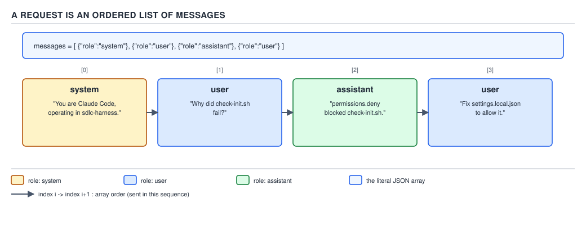
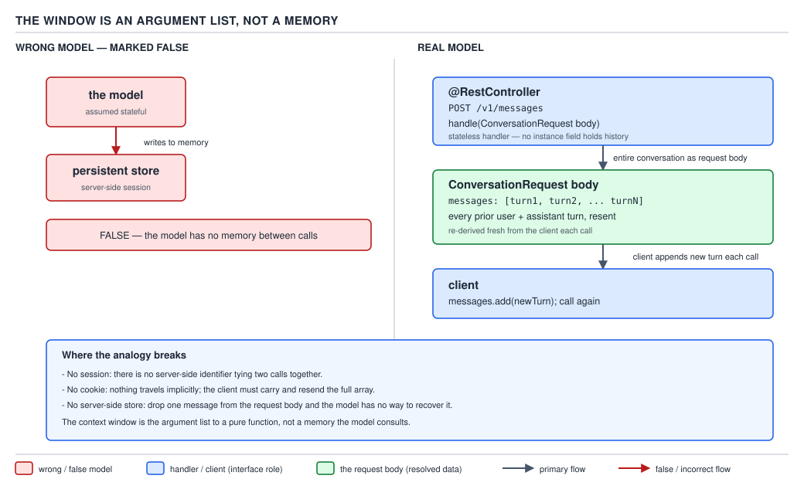

# 21 AI for Coding — the context window — BASICS (§0.2.1–0.2.7)

**Target version: Claude Code v2.1.2xx (August 2026).** | **Part 0 of 6** | [Index](../00-index.md)
Previous: [what the model is](01-basics-what-the-model-is.md) · Next: [caching and the budget](02-basics-context-window-b.md)

File 01 established that the model is a stateless function: text in, text out, nothing carried
between calls. That immediately raises a question file 01 deliberately left open: if nothing is
carried between calls, how does a multi-turn conversation work at all, and what stops you from
sending it an infinite amount of text? Both questions have the same answer — the **context
window** — and this file, plus its companion on caching and the budget, is that answer in full.

### 1. The context window is a hard ceiling on input plus output together

**Mental model.** Picture a single, fixed-size envelope. Every byte of text the model will read for
this call, and every byte of text it is allowed to write back, has to fit inside that one envelope
together. There is no separate envelope for "what you send" and "what it replies" — they share one
box. `[ZERO]`

**Why it exists.** File 01, §2 explained that a model call is one large computation over the entire
input text at once — every token attends to every other token to build the probability distribution
for the next one. That computation's cost grows sharply as the input grows, and the hardware
running it has a finite amount of working memory. A model cannot be built to accept "as much text as
you like": some fixed number has to be chosen as the largest input (plus output) the hardware can
process for one call, and that fixed number is the context window.

**How it works.** `[ZERO]` `[NUM]` The **context window** is the maximum number of tokens (file
01, §0.1.3: a token is roughly 3–4 characters of English, or about 0.75 words) one request may
contain, counting the input tokens and the output tokens together, not separately. If your input is
199,000 tokens and the window is 200,000, the model has only 1,000 tokens left to write its
response before it is forcibly cut off — a long input directly shrinks how long an answer is even
allowed to be. This is a **hard** limit, not a soft one: `[ZERO]` there is no "the model tries its
best and trims automatically." Either the request fits, or it is rejected before the model ever
runs, or something outside the model has already shortened the conversation before sending it (the
companion file covers exactly when and how). The model itself has no opinion about the limit and no
way to negotiate it — the limit is enforced by the serving infrastructure, before generation starts.

**Current sizes.** `[NUM]` `[RESEARCH]` `[VERSION]` **Re-verified against
`https://code.claude.com/docs/en/model-config` on 2026-08-29**, per this guide's research protocol,
ahead of writing this section. As of Claude Code v2.1.2xx:

- **200K tokens** is the context window for Opus 4.6 and Sonnet 4.6 without extended context, for
  Opus 4.8 and Opus 5 when running in a 200K configuration (for example on Amazon Bedrock, Google
  Cloud's Agent Platform, or Microsoft Foundry), and for any session started with
  `CLAUDE_CODE_DISABLE_1M_CONTEXT=1` set — that environment variable forces every model, including
  ones with a native 1-million-token window, to be treated as 200K for the purpose of the window
  limit and the compaction math the companion file works out.
- **1,000,000 tokens** ("1M", the extended-context tier) is available for Fable 5, Sonnet 5, and
  Opus 4.6 and later, either via the `[1m]` suffix on the model name (`claude --model opus[1m]`,
  `/model sonnet[1m]`) or, for **Sonnet 5 specifically, automatically** — the documentation states
  plainly that on the Anthropic API, "Sonnet 5 always runs with the 1M context window," with no
  suffix needed and no separate 200K variant to opt out of.
- **What 1M costs relative to 200K:** the documentation is explicit that the 1M window "uses
  standard model pricing with no premium for tokens beyond 200K" — the window gets larger, the
  per-token price for input and output stays the same. Where cost changes is *access*, not price:
  on a Max, Team, or Enterprise plan, Opus with 1M context is included in the plan; on a Pro plan,
  or for Sonnet 4.6 with 1M on any subscription plan, the 1M window draws on usage credits instead.
  On API and pay-as-you-go billing, 1M context is available in full with no separate gate.

**What happens at the limit.** `[ZERO]` Two genuinely different things can happen when a
conversation presses against the window, and this guide names both explicitly so neither is
mistaken for the other:

1. **Rejection.** If a request is assembled that already exceeds the window — the harness failed to
   trim anything and simply tried to send too much — the API refuses the call outright before any
   generation happens at all. There is no partial answer and no tokens billed for generation: the
   call simply errors, the same way any request that violates a hard API constraint errors, and
   nothing about the model's reasoning or intelligence is involved in that refusal.
2. **Compaction.** Long before a real request would hit rejection, Claude Code — the harness, never
   the model itself, since the model has no way to rewrite its own input — proactively rewrites the
   conversation to make it smaller: older turns are summarized into a condensed form and the
   original text is dropped from what gets sent going forward. This is deliberate and happens well
   inside the hard ceiling, precisely so that a normal working session practically never reaches
   case 1 at all. Compaction is a whole mechanism with its own budget math and its own rules about
   what survives; the companion file works that arithmetic in full, and Part 3's §3.2 covers exactly
   what a compaction pass keeps and discards down to the mechanism.

**Pitfall:** the belief in action is treating the context window as only a limit on *what you can
paste in* — "as long as my prompt is short, I'm fine, no matter how long this session has been
running." The surprising outcome: a short prompt sent late in an already-long session can still
trigger rejection or an immediate compaction pass mid-turn, because the window counts everything
already accumulated in the conversation plus the new input plus the entire output the model is
about to produce — not the size of the newest message taken in isolation. What actually gets the
guarantee: tracking the *running total* of the whole conversation, not the size of your latest
message; §4 below shows exactly why conversation length, not message length, is the number that
actually matters here. `[TRAP]`

**Why people believe it:** the input box in a chat interface visually resembles a single text field
you fill in and submit per turn, which invites treating each message as billed and limited entirely
on its own — the interface gives no visual cue at all that everything typed and read in every
earlier turn of the session is silently riding along inside that same shared envelope.

> The context window is the maximum number of tokens — input and output combined — one API request
> may contain; it is enforced as a hard limit by the serving infrastructure, not a soft budget the
> model manages for itself, and a conversation can be shortened either by outright rejection or by
> the harness's own proactive compaction.

### 2. A request is an ordered list of role-tagged messages

**Mental model.** Forget "a conversation" as a vague, free-flowing thing. At the wire level, every
request Claude Code sends is one concrete data structure: an ordered array of **messages**, and
each message carries a **role** telling the model who "said" it. `[ZERO]`

**Why it exists.** The model in file 01 is one function: text in, text out. But a coding assistant
needs the model to distinguish three different kinds of text riding in that one input — standing
instructions that govern the whole session, what the human actually typed, and what the model itself
said in an earlier turn, so it can tell its own prior words apart from the human's. Tagging every
chunk of text with a role is how a single flat text stream carries that distinction cleanly.

**How it works.** `[DOC]` A request body sent to the Claude API is a JSON object with a `system`
field (a string of standing instructions — for Claude Code, this is where the tool definitions and
core operating instructions from file 01, §0.1.6 live) and a `messages` array, where every entry has
exactly a `role` (`"user"` or `"assistant"` — the `"system"` role is not a message-array entry in
this API shape, it is the separate top-level `system` field) and a `content` string. Here is the
literal, complete, parseable JSON for a two-turn conversation — one full exchange already finished,
and the user's next message ready to be sent as the *third* entry in the array:

```json
{
  "model": "claude-sonnet-5",
  "max_tokens": 4096,
  "system": "You are Claude Code, an agentic coding assistant. You have access to tools for reading files, running shell commands, and editing code. Ask before running a command that could be destructive.",
  "messages": [
    {
      "role": "user",
      "content": "What does ConversationController.handle do in this repo?"
    },
    {
      "role": "assistant",
      "content": "ConversationController.handle receives the full conversation as its request body on every call and returns the model's next message; it holds no state between requests."
    },
    {
      "role": "user",
      "content": "Does it cache anything between calls?"
    }
  ]
}
```

Every field explained in prose, because JSON takes no comments: `model` picks which model tier
answers this call (file 01, §0.1.5); `max_tokens` caps how many *output* tokens this specific call
may produce, itself bounded by what is left of the shared window after everything above it; `system`
is sent once per request, not once per session — it rides along on every single call, including this
third one; and `messages` is the ordered history, oldest first, ending on the newest `user` entry
that has not yet been answered. Nothing in this object is a pointer, a session ID, or a reference to
something stored server-side — it is the literal text, present in full, every time.



**D-06** — A request is an ordered list of messages. Read the index on each slot and the exact role
names — there are exactly two roles inside `messages` (`user`, `assistant`); `system` is a separate
top-level field, not a third role sharing the array.

**Interview:** "What roles appear in a Claude API request, and where does the system prompt live?"
— `user` and `assistant` are the two roles inside the ordered `messages` array; the system prompt is
not a message with a `"system"` role in that array, it is a separate top-level `system` string sent
alongside `messages` on every request.

> A request is a JSON object holding an ordered array of role-tagged messages (`user`,
> `assistant`) plus a separate top-level `system` string — the entire conversation, structured, sent
> as one object on every call.

### 3. The window is the argument list of the next call, not a memory

**Mental model.** `[ZERO]` Say this exactly: **the context window is not a memory the model writes
to. It is the argument list of the next call.** Nothing is stored inside the model between requests
— section 2's JSON object above is reconstructed and re-sent, in full, every single time, by
software outside the model. The model does not "have" a context window the way a process has a heap
it can allocate into; the window is a property of the *call*, not a property of "the model" as a
standing entity.

**Why it exists.** This is a direct restatement of file 01, §0.1.1: the model is a pure function
with no field, no `this`, nothing held between invocations. If the model cannot hold state, and yet
a session clearly continues across many turns, the only place that continuity can live is in
whatever gets handed to the *next* call as its argument — there is nowhere else for it to be.

**How it works.** Every one of the three messages in section 2's JSON object above is present
because Claude Code's harness kept them and re-sent them, not because the model remembered anything
from the first two turns while idle between calls. Drop the second message from that array before
sending the third call, and the model has no way to know a `ConversationController.handle` question
was ever asked — not "it forgot in the human sense," but literally: that text is not in this call's
argument, so nothing about it exists for this call at all.

`[JAVA]` **The honest analogy.** Write the harness's job as a Spring Boot controller, stripped to
its essential shape:

```java
@RestController
class ConversationController {

    private final ClaudeClient claudeClient;

    ConversationController(ClaudeClient claudeClient) {
        this.claudeClient = claudeClient;
    }

    @PostMapping("/v1/turns")
    ClaudeEnvelope handle(@RequestBody ConversationRequest request) {
        // No field on this class holds request.messages() between calls.
        // Every message this method sees arrived inside THIS request body,
        // supplied in full by the caller — never recovered from anywhere else.
        return claudeClient.call(request.system(), request.messages());
    }
}

record ConversationRequest(String system, List<Message> messages) {}
record Message(String role, String content) {}
```

`handle` is a completely ordinary, stateless `@RestController` method: no instance field caches
`messages` across invocations, and Spring creates no session for this endpoint. The *client* —
Claude Code's harness, in the real system — is the party responsible for remembering the
conversation: it keeps its own growing `List<Message>`, appends the newest exchange, and resends
the entire, growing list as the request body on every subsequent call. `handle` itself is exactly as
memoryless as `respond` was in file 01, §0.1.1.



**D-07** — The window is the argument list of the next call, not a memory: the growing `messages`
array lives in the *caller's* state, is rebuilt and resent whole on every request, and nothing
persists inside the handler between calls.

**Precisely where the analogy breaks**, because "it is like a REST controller" alone is not
sufficient — all three places, stated fully:

1. **No session.** A real Spring application very often *does* keep server-side session state — an
   `HttpSession`, a database row keyed by a session ID — specifically so the client does not have to
   resend everything on every call. `ConversationController.handle` above has deliberately been
   given none of that, because the real Claude API genuinely has none: there is no session object
   anywhere in Anthropic's infrastructure holding "this conversation" between your calls. If you
   want the analogy to be accurate rather than merely convenient, you have to imagine a Spring team
   being *told* they may not add a session, ever, for any reason — and then noticing "this API has
   no memory across requests" is not a missing feature waiting to be added, but the entire
   architecture working exactly as designed.
2. **No cookie.** A browser talking to a stateful web app carries a session cookie so the server
   knows which session's state to load on the next request. There is no equivalent token in a Claude
   API call that says "this is conversation #4471, please resume it" — the only way to "resume" a
   conversation at all is to resend its full text as the `messages` array, from the beginning.
   Whatever a product does under a "resume session" button (Claude Code's own `--resume`, a forward
   reference to sessions covered later in this guide) is that product storing your transcript on
   *your* machine and replaying it back into `messages` at the start of a brand-new call — never the
   server recognizing a returning session on its own.
3. **No server-side store, ever, for the conversation itself.** A typical `@RestController` behind a
   stateful product usually has *something* backing it — Redis, a database, an in-memory cache —
   even when `handle` itself is written statelessly, because most systems want to avoid resending
   the entire world on every single call. Claude Code's harness keeps the transcript on the
   **caller's** side only (a local session file, covered in a later part) purely so it has something
   to resend on the next call; the API side never persists it as "your conversation" in any store
   you could query or resume independently of resending the text yourself.

**Pitfall:** the belief in action is treating a fluent, contextual-sounding reply as proof the model
"has" the conversation somewhere, the way a stateful service has a session — "it clearly still knows
what `ConversationController` is, so it must be holding that in memory." The surprising outcome: the
instant the harness fails to include that earlier text in the next call's `messages` array — trimmed
by compaction, dropped by a bug, or simply never sent because a new session was started — the model
has no access to it at all, with no partial recollection and no way to ask for it back. What
actually gets the guarantee: the text is present, verbatim or summarized, in *this specific call's*
`messages` array. Nothing else carries it forward. `[TRAP]`

**Why people believe it:** identical to file 01's version of this pitfall — a long, coherent
back-and-forth is exactly what a stateful conversation with a human looks like, and nothing in the
chat UI's presentation distinguishes "the model remembers" from "the harness quietly re-sent it."

**Interview:** "If I ask the model something it answered fluently three turns ago, is it drawing on
memory?" — No: it is re-reading text that is still present, verbatim or summarized, in this call's
`messages` array. There is no separate memory store anywhere in the request path; if that text were
ever dropped from the array — by compaction or otherwise — the model's access to it disappears
completely and immediately, with nothing partial about the loss.

> The context window is the argument list of the next call, not a memory the model writes to or
> reads from between calls — every apparent act of "remembering" is really the harness re-sending
> text that is still, literally, present in the next request.

### 4. Cost and latency scale with conversation length, not with your last message

**Mental model.** `[ZERO]` Because section 3 established that the *entire* conversation rides along
on every single call, a "quick one-line question" late in a long session is not a quick, cheap
request — it is the full transcript, plus one line, sent and (mostly) reprocessed all over again.

**Why it exists.** This is the direct, unavoidable arithmetic consequence of sections 2 and 3: if
every call resends everything before it, the size of call *N* is roughly the size of call *N − 1*
plus whatever was newly added — so the total amount of text processed across a whole session grows
with every turn added, not just with how much any single turn contains.

**How it works, with the arithmetic printed rather than asserted.** `[PROVE]` `[NUM]` Assume, for a
concrete illustration, a session that starts with 6,000 tokens already in play (the companion file
works out exactly what makes up a fresh session's startup content) and that each subsequent turn — a
user message, the model's reply, and any tool results in between — adds roughly 800 tokens to the
running conversation before the next call goes out. Call *i*'s input size is then
`6,000 + 800 × i` tokens, and the **total** tokens processed across the whole session is the sum of
every call's input, from the first turn to the last:

For a **10-turn session**, the sum runs `Σ (6,000 + 800·i)` for `i = 1` through `10`:

```
10 × 6,000 = 60,000
800 × (1 + 2 + 3 + 4 + 5 + 6 + 7 + 8 + 9 + 10) = 800 × 55 = 44,000
Total = 60,000 + 44,000 = 104,000 tokens processed across the session
```

For a **100-turn session**, the same sum runs `Σ (6,000 + 800·i)` for `i = 1` through `100`, using
the identity `1 + 2 + … + 100 = 100 × 101 ÷ 2 = 5,050`:

```
100 × 6,000 = 600,000
800 × 5,050 = 4,040,000
Total = 600,000 + 4,040,000 = 4,640,000 tokens processed across the session
```

The 100-turn session has **10×** as many turns as the 10-turn session, but it processes
`4,640,000 ÷ 104,000 ≈ 44.6×` as many total tokens — not 10×. This is the arithmetic behind
"cost and latency scale with conversation length": because every call resends everything before it,
total token volume grows roughly with the *square* of the number of turns, not linearly with it,
long before any single message itself got any longer. A one-line question at turn 100 is billed
(mostly, before the caching discount the companion file works out) against the whole roughly
80,000-token history it drags along behind it, not against the one line it actually added.


**D-08** — Cost scales with conversation length: as turns accumulate, each call resends the growing
total, so cumulative tokens processed grows faster than the turn count itself.

**Insight:** this is exactly why "just clear old context" (`/clear`, and the compaction mechanism
introduced in §1 above) is not a housekeeping nicety — it is the single highest-leverage lever a
developer has over both cost and latency in a long session, because it resets the base that every
subsequent call must re-carry, rather than trying to make any one message shorter.

**Interview:** "A teammate says a 100-turn debugging session should cost roughly 10× what a 10-turn
one costs, since it's 10× the turns. Is that right?" — No, and the arithmetic shows why: because
every call resends the entire conversation so far, total tokens processed across a session is the
*sum* of every prior turn's growing size, which grows roughly with the square of the turn count. A
worked example with a 6,000-token base and 800 tokens added per turn gives 104,000 total tokens for
10 turns versus 4,640,000 for 100 turns — a ratio of about 44.6×, not 10×.

> Because every call resends the full conversation so far, total tokens processed across a session
> grows with the *sum* of every prior turn's size, not with the length of the newest message — a
> long session's cost and latency are dominated by how long it has run, not by what you just typed.

---

## Pitfalls

| Wrong belief in action | Surprising outcome | What actually gets the guarantee | Why people believe it |
|---|---|---|---|
| "As long as my prompt is short, I'm within the limit." | A short message late in an already-long session can still trigger rejection or compaction. | Track the running total of the whole conversation, not the size of the newest message. | The input box looks like one message is billed and limited on its own; nothing shows the silent history riding along. |
| "It clearly still knows about `ConversationController`, so it must be holding that in memory somewhere." | The instant that text is missing from the next call's `messages` array, all access to it disappears, with no partial recall. | The text is present, verbatim or summarized, in *this specific call's* input — nothing else. | A long, coherent exchange looks exactly like a human conversation with real memory behind it. |

## Cheat sheet

| Concept | The one line |
|---|---|
| Context window | Max tokens per request, input + output together; a hard limit enforced before generation, not a soft budget. |
| Current sizes (Aug 2026) | 200K standard; 1M extended-context (Sonnet 5 automatically, others via `[1m]`), same per-token price beyond 200K. |
| At the limit | Two outcomes: outright rejection (rare) or proactive compaction by the harness (the normal case). |
| Request shape | JSON object: top-level `system` string + ordered `messages` array of `{role, content}`, roles `user`/`assistant` only. |
| The window is | The argument list of the next call — never a memory the model writes to or reads from between calls. |
| Java analogy | A stateless `@RestController.handle` — but with no session, no cookie, and no server-side conversation store at all. |
| Cost/latency scaling | Scales with total conversation length (roughly the *sum* of every prior turn), not with the newest message's length. |
| 10 vs 100 turns | Worked example: 104,000 vs 4,640,000 total tokens processed — ≈44.6×, not the 10× turn-count ratio. |

## Self-test

1. Why does the context window limit the length of the model's *response*, not just what you can
   send it?
<details><summary>Answer</summary>
Because the window is a single shared ceiling on input and output tokens together, not two separate
budgets. If the input already uses most of the window, only whatever is left can be spent on the
output — a very long input directly shrinks the maximum length the response is even allowed to
reach.
</details>

2. What is a context window, and why is the whole conversation re-sent every turn?
<details><summary>Answer</summary>
The context window is the maximum number of tokens — input and output combined — one request may
contain; it is a hard limit enforced by the serving infrastructure before generation starts. The
whole conversation is re-sent every turn because the window is the argument list of the next call,
not a memory the model writes to: the model is a stateless function (file 01) with no field carrying
state between calls, so the only place continuity can live is in what gets handed to it as input on
the very next call, in full, every time.
</details>

3. In the Claude API request shape, what roles exist inside the `messages` array, and where does the
system prompt actually live?
<details><summary>Answer</summary>
Only two roles appear inside `messages`: `user` and `assistant`. The system prompt is not a third
role sharing that array — it is a separate top-level `system` string sent alongside `messages` on
every request.
</details>

4. Name the two things that can happen when a conversation presses against the context window, and
   which one a normal working session almost always hits first.
<details><summary>Answer</summary>
Outright rejection of the request (the API refuses the call before generation, with nothing billed)
and proactive compaction (Claude Code's harness rewrites the conversation smaller by summarizing
older turns). A normal session almost always hits compaction first, since it happens well inside the
hard ceiling specifically to avoid ever reaching rejection.
</details>

5. A 100-turn session has 10× as many turns as a 10-turn session. Roughly how many times more total
   tokens does it process, and why isn't the answer simply 10×?
<details><summary>Answer</summary>
Using the worked example (6,000-token base, 800 tokens added per turn), the 10-turn session
processes 104,000 total tokens and the 100-turn session processes 4,640,000 — about 44.6×, not 10×.
The answer isn't 10× because every call resends the entire conversation so far, so the total volume
processed across a session is the *sum* of every prior turn's growing size, which grows faster than
the turn count itself.
</details>

6. Name all three places the `@RestController` analogy for the context window breaks down.
<details><summary>Answer</summary>
No session — a real Spring app can keep server-side session state; the Claude API has no session
object holding a conversation between calls at all. No cookie — there is no token telling the server
"resume conversation #4471"; the only way to resume is resending the full `messages` array yourself.
No server-side store for the conversation — even a stateless-looking `@RestController` in a real
product is usually backed by something like Redis or a database; the Claude API never persists your
conversation server-side in any queryable form, and the harness keeps the transcript only on the
caller's own side.
</details>

7. Why is it wrong to assume a short follow-up message late in a long session is cheap to send?
<details><summary>Answer</summary>
Because the window and the billing both count the entire conversation resent with that call, not
just the new message. A one-line question at turn 100 is billed against the whole accumulated
history riding along with it (roughly 80,000 tokens in the worked example), not against the one new
line — cost tracks conversation length, not message length.
</details>

8. What does `CLAUDE_CODE_DISABLE_1M_CONTEXT=1` actually do, and to which models does it apply?
<details><summary>Answer</summary>
It forces every model — including ones with a native 1-million-token window such as Sonnet 5 or
Fable 5 — to be treated as having a 200K window, both for the hard limit itself and for the
compaction math that decides when Claude Code proactively summarizes the conversation.
</details>

## Open questions

None.

---

**Leaves covered:** 0.2.1–0.2.7 (7 leaves)
**Leaves deferred:** none
**Diagrams included:** D-06, D-07, D-08
**Target version:** Claude Code v2.1.2xx (August 2026)
**Lines:** 444
