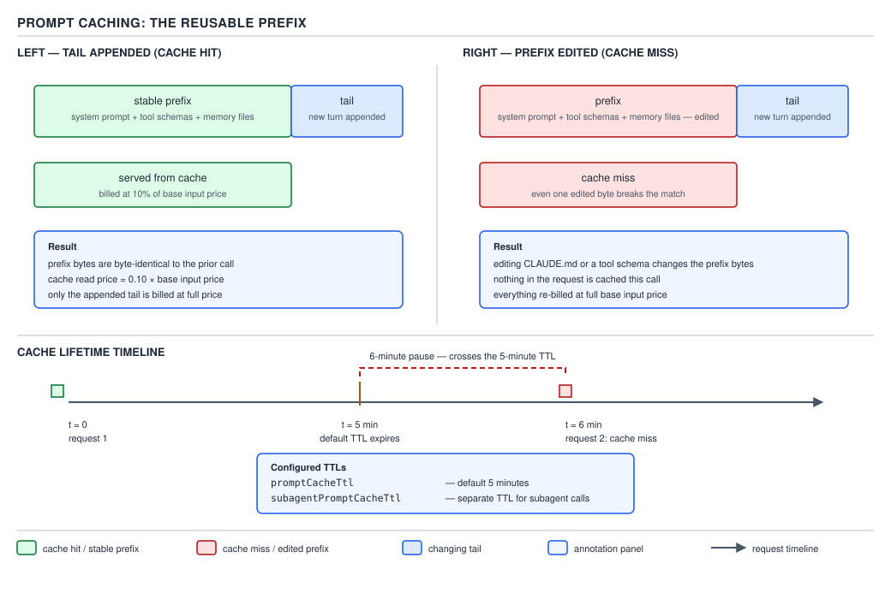
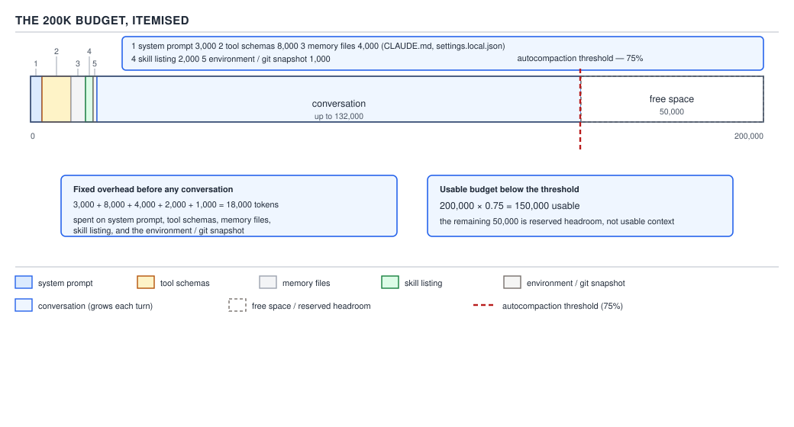

# 21 AI for Coding — caching and the context budget — BASICS (§0.2.8–0.2.12)

**Target version: Claude Code v2.1.2xx (August 2026).** | **Part 0 of 6** | [Index](../00-index.md)
Previous: [the context window](02-basics-context-window-a.md) · Next: [the agent loop](03-basics-the-agent-loop.md)

The companion file established the shape of the problem: every call resends the whole conversation,
so cost and latency scale with conversation length, roughly as its square (§0.2.6's worked
arithmetic). That would make Claude Code prohibitively expensive on any session past a few dozen
turns if every one of those tokens were actually recomputed from scratch on every call. It is not.
This file covers the mechanism that saves you from that cost — **prompt caching** — and then spends
the 200,000-token headline number honestly, down to what is actually left over for your own work.

### 1. Prompt caching: why appending is cheap and editing the beginning is not

**Mental model.** `[ZERO]` The previous file's arithmetic looks alarming until one more mechanism is
added: the API does not actually *recompute* the unchanged part of a request from scratch on every
call — it can reuse work it already did, provided the unchanged part sits at the *front* of the
request and matches exactly.

**Why it exists.** A request is one ordered array with new content appended at the end (the
companion file's §0.2.3). On any normal turn, everything before the newest exchange is
byte-for-byte identical to what was already sent on the previous call. Recomputing that identical
prefix from zero, every single turn, would be pure waste — the fix is to let the serving
infrastructure remember that prefix's already-computed internal state and skip straight to
processing only what is new.

**How it works.** `[NUM]` `[RESEARCH]` **Re-verified against
`https://code.claude.com/docs/en/prompt-caching` on 2026-08-29**, per this guide's research
protocol, ahead of writing this section. The API matches the **start** of each request — the
**prefix** — against content it recently processed for that same model. The match is exact: change
anything anywhere in that prefix and everything after the change point has to be recomputed, because
the cached copy no longer matches. Claude Code deliberately orders each request so the parts that
change least sit first — system prompt, then project context (`CLAUDE.md`, memory), then the growing
conversation last — precisely so that ordinary turns, which only append, keep the entire front of
the request cache-eligible.

A **cache read** — reusing an already-processed prefix — is billed at roughly **10% of the standard
input token rate**, per the documentation's own description of the `cache_read_input_tokens` field:
"Tokens served from cache on this turn, billed at roughly 10% of the standard input rate." A **cache
write** — the first time a given prefix is processed and stored for later reuse — costs *more* than
a normal input token, not less, which is the trade a cache is always making: pay a premium once, so
that every subsequent hit is nearly free.

This is exactly why "appending is cheap and editing the beginning is not" is literally true and not
a rough guideline: appending a new message never disturbs the prefix, so the whole existing history
still reads from cache at the 10% rate and only the new tail is billed at full price. Editing
anything earlier — switching the system prompt, changing which tools are loaded, altering
`CLAUDE.md` mid-session — breaks the exact-match prefix at that point, so everything downstream of
the edit, including a large amount of conversation the developer never touched at all, is
reprocessed and rebilled from there at full input price. The documentation's own list of "actions
that invalidate the cache" includes switching models, changing effort level, turning on fast mode,
connecting or disconnecting an MCP server whose tools are loaded into the prefix, enabling or
disabling a plugin that provides such an MCP server, denying an entire tool by name, compacting the
conversation, and upgrading Claude Code itself — each one changes something in that shared prefix
and forces a rebuild.



**D-09** — Prompt caching: turns two and three read the unchanged prefix from cache and pay only
for what is new; turn four changes the system prompt, breaking the prefix match, so the entire
request is reprocessed and rewritten to cache from scratch.

**The default cache TTL and how to change it.** `[NUM]` `[DOC]` **Re-verified against the same
page.** A cached prefix does not live forever — it expires after a period of inactivity, and each
request that hits the cache resets that timer. The documentation states the API "offers two: a
five-minute TTL, and a one-hour TTL," and Claude Code's own default depends on how the session is
billed, split across two request buckets:

| Request bucket | Claude subscription, within plan usage | Usage credits, API key, or cloud provider |
|---|---|---|
| Main conversation (interactive turns, `-p` runs, Agent SDK turns) | One hour | Five minutes |
| Everything else (subagents, workflows, teammates, forks, compaction, session titles) | Five minutes, except server-controlled helper requests, which get one hour | Five minutes |

Two settings override these defaults, each accepting only `5m` or `1h`: **`promptCacheTtl`** sets
the TTL for the main conversation, and **`subagentPromptCacheTtl`** sets it for everything outside
the main conversation — both require Claude Code v2.1.242 or later, and both can also be set via the
`CLAUDE_CODE_PROMPT_CACHE_TTL` and `CLAUDE_CODE_SUBAGENT_PROMPT_CACHE_TTL` environment variables. A
subagent's own requests fall into the "everything else" bucket regardless of what the main
conversation is using, so a subagent defaults to a five-minute cache lifetime even inside a
subscription session where the main conversation itself enjoys a full hour — unless
`subagentPromptCacheTtl` is set explicitly to request the longer lifetime for it too.

**Why a pause past the TTL costs real money.** Step away from a session on a five-minute-TTL
connection for six minutes, and the cached prefix has already expired by the time the next message
goes out. That next call reprocesses the entire conversation history as fresh, uncached input — at
full price, not the 10% cache-read rate — before a new cache entry is written. The longer the
session had grown before the pause (the companion file's §0.2.6 arithmetic), the more expensive that
single reprocessing call is; a six-minute coffee break in the middle of a long session can cost more,
in that one request, than the rest of the session combined.

**Interview:** "Why does switching models mid-session make the very next response slower and more
expensive?" — Each model has its own separate cache, so a `/model` switch means the very next
request matches no cached prefix at all and reprocesses the entire conversation from scratch at full
input price, even though none of the actual text changed; the same is true of switching effort
level, since the cache is keyed by both model and effort level together, not by model alone.

> Prompt caching lets the API reuse an unchanged prefix instead of recomputing it: a cache read costs
> roughly 10% of standard input pricing, so appending to a conversation stays cheap while editing
> anything earlier in it — or letting the cache go cold past its TTL (one hour or five minutes,
> `promptCacheTtl` / `subagentPromptCacheTtl`) — forces a full-price reprocessing of everything after
> the change.

### 2. The 200K budget, itemised: what is left for actual work

**Mental model.** `[ZERO]` Take the number everyone quotes — "200K context window" — and actually
spend it, line by line, the way you would read a household budget rather than repeat a headline
figure.

**Why it exists.** Everything in this pair of files leans on one implicit fact this section finally
makes explicit: the 200,000-token number is not 200,000 tokens of room for *your* work. A meaningful
amount of it is already spoken for before a single character of a task is typed, and understanding
exactly how much is the difference between "the window feels enormous" and "the window ran out
sooner than it should have."

**How it works, with the arithmetic printed.** `[PROVE]` `[NUM]` `[DOC]` Documented per-item figures
for what loads automatically into a fresh session, before the first user message, from
`https://code.claude.com/docs/en/context-window`, re-verified on 2026-08-29:

| Loaded automatically | Tokens |
|---|---|
| System prompt (core instructions, tool definitions, output formatting) | 4,200 |
| Auto memory (`MEMORY.md`, capped at the first 200 lines or 25 KB) | 680 |
| Environment info (working directory, platform, shell, OS, git snapshot) | 280 |
| MCP tool names (schemas deferred by default; only names load upfront) | 120 |
| Skill listing (one-line descriptions of invocable skills) | 450 |
| **Startup total, before you type anything** | **5,730** |

```
200,000 − 5,730 = 194,270 tokens remain after startup content alone
```

That is the state of a fresh session before compaction is even considered. Compaction narrows the
usable figure further. The documentation's own worked figure for Sonnet 5's 1M window states it
"auto-compacts at ~967K tokens by default" — that is, compaction fires at
`967,000 ÷ 1,000,000 ≈ 96.7%` of that window, reserving roughly 3.3% as headroom rather than letting
the conversation run all the way to the hard ceiling.

**Unverified:** the documentation does not publish an equally explicit percentage for the
200K-window case — it states only that a 200K model's default compaction point is "the 200K
boundary," without a numeric reserve stated for that configuration the way it is for Sonnet 5's 1M
window. Applying the 1M case's ~96.7% ratio to 200K as an *illustrative* extrapolation — not a
documented figure — gives:

```
200,000 × 0.967 ≈ 193,400 tokens — the illustrative point where compaction would fire
200,000 − 193,400 ≈ 6,600 tokens — the illustrative headroom reserved before the hard ceiling
```

This extrapolated 200K percentage is recorded in `## Open questions` below rather than stated as
fact, precisely because it is derived from the 1M case's documented number rather than measured
directly for 200K.

Combining the documented startup cost with that illustrative compaction point:

```
193,400 − 5,730 ≈ 187,670 tokens left, in a fresh 200K session,
                  for the actual conversation before proactive compaction begins
```

That is: your prompts, every file read, every tool result, and every reply the model produces —
before Claude Code proactively starts compacting to keep the session inside the window at all.
`autoCompactWindow` (Part 1 covers its full settings surface) lets a developer raise or lower that
trigger point explicitly, in either direction, rather than accepting the model's default.



**D-10** — The 200K budget itemised: startup content, the compaction reserve, and what remains for
actual work, drawn to scale against the full 200,000-token window.

**The five things that consume the window before you type anything**, named here in full, with the
detailed treatment of exactly when each one loads, what triggers it to grow mid-session, and what
does or does not survive a compaction pass forward-referenced to **§3.1** rather than duplicated
here:

1. **System prompt** — core instructions and tool definitions, ~4,200 tokens.
2. **Tool schemas** — MCP tool listings; deferred by default so only names load upfront, ~120
   tokens, with full schemas loading later only when a specific tool is actually used.
3. **Memory files** — `CLAUDE.md` and auto memory (`MEMORY.md`), ~680 tokens combined in the fresh
   session measured above.
4. **Skill listing** — one-line descriptions of invocable skills, ~450 tokens, so Claude knows what
   it can invoke without the full body of every skill being loaded.
5. **Environment/git snapshot** — working directory, platform, shell, OS version, git branch,
   status, and recent commits, ~280 tokens.

§3.1 covers exactly when each of these five loads relative to session start, what makes any of them
grow larger over the course of a session (more MCP servers connected, a longer `CLAUDE.md`, more
skills installed), and which of them Claude Code reloads automatically immediately after a
compaction pass versus which are gone for good until the next full restart.

**Interview:** "Is a 200K context window actually 200,000 tokens of usable space for my task?" — No:
roughly 5,700 tokens load automatically before any user input at all, and Claude Code proactively
compacts well before the true 200,000-token ceiling to keep headroom in reserve, so the realistic
usable budget for a fresh session's actual conversation is closer to the mid-180,000s than to
200,000 — and it shrinks further as MCP servers, larger memory files, or more skills are added to a
project.

> The 200,000-token window is a starting figure, not a working budget: roughly 5,700 tokens are
> already spent on startup content before you type anything, and Claude Code reserves further
> headroom by compacting before the hard ceiling — so the number worth tracking is what remains
> after both deductions, not the headline 200K.

### 3. "It forgot" is almost never a bug

**Mental model.** `[ZERO]` When a model appears to lose track of something it was told earlier in
the same working session, the word "forgot" hides a real distinction. There are exactly two
mechanically different causes, and treating them as the same undifferentiated "forgetting" problem
leads to the wrong fix every time.

**Why it exists.** This falls directly out of the companion file's §0.2.4: the window is the
argument list of the next call, never a memory. Since nothing is ever stored inside the model
between calls, *every* piece of information the model appears to know about the current session got
there one of exactly two ways — it is either present in this call's `messages` array right now, or
it is not. "It forgot" is really always a question about which of those is true, and why.

**How it works.** `[TRAP]` The two causes, stated precisely:

- **Never in context at all.** The fact was never included in any `messages` array sent to the
  model — maybe it lived only in a file the model never read, or it was a decision made in a
  different session entirely (a wholly separate `messages` array with none of this session's history
  in it, since sessions do not share state any more than individual calls do). The fix is to put the
  missing information in front of the model explicitly: reference the file by name, restate the
  decision in the conversation, or write it into `CLAUDE.md` (Part 1 covers this fully) so that it
  loads automatically at the start of every session going forward.
- **Compacted out.** The fact *was* in context earlier in this same session, but a compaction pass
  (the companion file's §0.2.7, worked in full mechanism in Part 3's §3.2) replaced the older turns —
  including the turn that contained that fact — with a shorter summary, and the summary generated
  during that pass did not preserve it. The fix here is different: either make the fact durable by
  writing it to a file or to memory (Part 1) so a future summary cannot silently drop it again, or
  simply re-state it after compaction rather than assuming it survived the rewrite.

Distinguishing the two in practice is mechanical, not guesswork: if the fact was ever typed, read
from a file, or produced by a tool in this session, and the session has since had at least one
`/compact` or an automatic compaction trigger, "compacted out" is the far more likely cause. If the
fact was never actually surfaced anywhere in this session's own conversation — it lived only in the
developer's head, in a different chat, or in a file nobody asked the model to read — "never in
context at all" is the only possible cause, because compaction can only drop something that was
present to begin with.

**Pitfall:** the belief in action is diagnosing every "it forgot" moment as a single, generic model
failure and responding by simply repeating yourself harder or switching to a supposedly smarter
model — "the model must be getting worse at this, let me try Opus instead." The surprising outcome:
if the actual cause was compaction, a bigger or more capable model has exactly the same blind spot,
because the fact is not present in either model's input at all — no amount of raw capability can
recover information that was genuinely never sent as part of the call. What actually gets the
guarantee: check which of the two causes applies — was the fact ever sent at all, or was it dropped
by a summary — before choosing a fix, because "never in context" and "compacted out" call for
different repairs, and only one of them is helped even slightly by moving to a different model.
`[TRAP]`

**Why people believe it:** "forgot" is a single, undifferentiated word borrowed directly from how
humans describe their own memory lapses, and it papers over two structurally different,
independently diagnosable failures — whether the information ever entered the argument list at all,
and, separately, whether an earlier version of that argument list containing it was later replaced
by a shorter summary that dropped it.

**Interview:** "A user reports that Claude 'forgot' a decision from earlier in a long session. How do
you debug that?" — First check whether the fact was ever actually part of this session's own
conversation at all — if it lived only in a different chat, a file nobody had the model read, or the
developer's own head, the fix is to explicitly surface it now and consider writing it into
`CLAUDE.md` so it persists automatically. If it *was* part of this session but a `/compact` or
automatic compaction has happened since, the far more likely cause is that the summarization pass
dropped it — the fix there is to make the fact durable in a file or restate it, not to assume a
better model would have retained it, since neither model ever receives dropped information in the
first place.

> "It forgot" is almost never a bug in the sense people mean: it means either the fact was never in
> context in the first place, or an earlier version of context containing it was compacted into a
> summary that dropped it — two mechanically different diagnoses, with two different fixes, neither
> of which a bigger model can substitute for.

---

## Pitfalls

| Wrong belief in action | Surprising outcome | What actually gets the guarantee | Why people believe it |
|---|---|---|---|
| "Switching to `/model opus` mid-session is free — I'm just picking a smarter model for this one question." | The very next request reprocesses the entire conversation history at full input price, with zero cache hits, because each model has its own separate cache. | Pick a model and effort level at the start of a session and hold them; save switches for natural breaks, not mid-task. | The switch itself feels instantaneous in the UI, with no visible signal that the underlying cache was just invalidated. |
| "200K context window" means roughly 200,000 tokens of room for my actual task. | Roughly 5,700 tokens are already spent on startup content before typing anything, and compaction reserves further headroom before the true ceiling. | Track the itemised budget — startup cost plus the compaction reserve — rather than the headline window figure. | The number quoted everywhere is the raw window size, not the number left over after fixed overhead and a safety margin. |
| "It forgot, so the model (or a bigger model) must fix it." | If the cause was compaction, a more capable model has the identical blind spot, because the fact isn't in either model's input at all. | Diagnose which of the two causes applies — never sent, or summarized away — before choosing a fix. | "Forgot" is one word borrowed from human memory lapses, covering two structurally different, separately fixable failures. |

## Cheat sheet

| Concept | The one line |
|---|---|
| Prompt caching | Unchanged prefix reused at ~10% of input price; editing anything before the tail, or letting the cache go cold, forces full-price reprocessing. |
| What invalidates the cache | Switching models, changing effort, fast mode, an MCP/plugin change touching the prefix, denying a whole tool, compaction, a Claude Code upgrade. |
| Cache TTL | One hour (main conversation, subscription, within plan usage) or five minutes (everything else, or non-subscription billing); `promptCacheTtl` / `subagentPromptCacheTtl` override, `5m`/`1h` only, v2.1.242+. |
| 200K startup cost | ~5,730 tokens gone before you type anything: system prompt 4,200 + memory 680 + environment 280 + MCP names 120 + skill listing 450. |
| 200K after compaction (illustrative) | ~193,400 tokens before autocompact fires (extrapolated from Sonnet 5's documented ~967K/1M ratio) → ~187,670 left for real work. |
| Five startup consumers | System prompt, tool schemas, memory files, skill listing, environment/git snapshot — full treatment in §3.1. |
| "It forgot" — two causes | Never in context at all (fix: surface it, or put it in `CLAUDE.md`) vs. compacted out (fix: make it durable, or restate it). |

## Self-test

1. Why does editing `CLAUDE.md` mid-session force a full-price reprocessing of the whole
   conversation on the next call, while simply appending a new message does not?
<details><summary>Answer</summary>
Prompt caching matches the exact prefix of a request against what was cached from the previous call.
`CLAUDE.md` sits in the project-context layer near the front of that prefix, so changing it breaks
the exact match at that point, forcing everything after the change — potentially the entire rest of
the conversation — to be reprocessed and rebilled at full input price. Appending a new message only
adds content after the existing prefix, which stays intact and continues to hit the cache at roughly
10% of standard input pricing.
</details>

2. What are the two default cache TTLs, and which one applies to a subagent's requests inside a
   Claude subscription session?
<details><summary>Answer</summary>
One hour and five minutes. A subagent's requests fall outside the "main conversation" bucket, so
they default to five minutes regardless of billing — even on a subscription where the main
conversation itself would default to one hour — unless `subagentPromptCacheTtl` is set to request
the longer TTL explicitly for that bucket.
</details>

3. Roughly how many tokens of a fresh 200K session are already spent before the first user message,
   and what accounts for it?
<details><summary>Answer</summary>
Roughly 5,730 tokens: the system prompt (~4,200), auto memory (~680), environment info (~280), MCP
tool names deferred (~120), and the skill listing (~450). None of it is optional content the
developer typed — all five load automatically at session start.
</details>

4. What figure in this file's budget arithmetic is explicitly marked unverified, and why?
<details><summary>Answer</summary>
The ~96.7% compaction-trigger ratio applied to a 200K-window session (used to derive the
~193,400-tokens-until-compaction and ~187,670-tokens-remaining figures). It is unverified because
the documentation only publishes that exact ratio for Sonnet 5's 1M window ("auto-compacts at ~967K
tokens by default"); for the 200K case it states only that compaction fires at "the 200K boundary,"
with no numeric reserve given, so applying the 1M ratio to 200K is an illustrative extrapolation, not
a directly documented figure.
</details>

5. A developer says "it forgot the decision we made an hour ago in this same session — the model
   must be getting worse." What two causes should be checked before concluding that, and why does it
   matter which one it was?
<details><summary>Answer</summary>
Either the decision was never actually included in any `messages` array sent to the model (never in
context at all — perhaps it lived only in the developer's head or in a file never read), or it was
in context earlier but a compaction pass replaced that portion of history with a summary that didn't
preserve it (compacted out). It matters because the fixes differ: "never in context" is fixed by
explicitly supplying the missing information (or writing it into `CLAUDE.md` so it loads
automatically); "compacted out" is fixed by making the fact durable in a file, or restating it after
compaction — switching to a more capable model fixes neither, since the fact is absent from either
model's input either way.
</details>

6. Why does switching effort level mid-session cost the same kind of penalty as switching models?
<details><summary>Answer</summary>
Because the prompt cache is keyed by both model and effort level together, not by model alone. A
request at a different effort level matches no cached prefix even if every character of the
conversation is identical, so the very next request after an effort change reprocesses the full
history at full input price before a new cache entry is established.
</details>

7. Name at least four distinct actions that invalidate the prompt cache, beyond simply continuing a
   normal conversation.
<details><summary>Answer</summary>
Any four of: switching models, changing effort level, turning on fast mode, connecting or
disconnecting an MCP server whose tool definitions are loaded into the prefix (as opposed to
deferred), enabling or disabling a plugin that provides such an MCP server, adding or removing a
bare-tool-name deny rule, compacting the conversation, or upgrading Claude Code itself.
</details>

8. Why is "the context window is 200,000 tokens" a misleading way to describe how much room a
   developer actually has for their own task?
<details><summary>Answer</summary>
Because a meaningful slice of that 200,000 is already committed before any task begins — roughly
5,730 tokens of startup content — and Claude Code additionally reserves headroom by triggering
compaction before the conversation reaches the true ceiling. The number that reflects actual
available room for prompts, file reads, tool results, and replies is meaningfully smaller than the
headline figure, and shrinks further as a project accumulates more MCP servers, a longer memory
file, or more installed skills.
</details>

## Open questions

**Unverified:** the exact ~96.7% compaction-trigger ratio for a **200K**-window session (used in §2
to derive the ~193,400-token and ~187,670-tokens-remaining figures) is an extrapolation from the
*documented* Sonnet 5 figure for its 1M window ("auto-compacts at ~967K tokens by default"), not a
directly documented percentage for the 200K case. `https://code.claude.com/docs/en/context-window`
and `https://code.claude.com/docs/en/settings-reference` describe the 200K default only as compacting
at "the 200K boundary," without stating an explicit numeric reserve the way the 1M case states one.
The direction of the claim — that some headroom is reserved before the hard ceiling, and it is not
100% of the window — is not in question; the precise 200K reserve figure could not be confirmed and
may differ from the illustrative ~6,600-token reserve used above.

---

**Leaves covered:** 0.2.8–0.2.12 (5 leaves)
**Leaves deferred:** none
**Diagrams included:** D-09, D-10
**Target version:** Claude Code v2.1.2xx (August 2026)
**Lines:** 393
