# 21 AI for Coding — the agent loop — BASICS (§0.3)

**Target version: Claude Code v2.1.2xx (August 2026).** | **Part 0 of 6** | [Index](../00-index.md)
Previous: [caching and the context budget](02-basics-context-window-b.md) · Next: [orientation in the tool](04-basics-orientation.md)

Files 01 and 02 built two ideas: a **token** is the unit the model reads and writes (`01-basics-what-the-model-is.md`, §0.1.3), and the **context window** is the argument list re-sent on every call, not a memory (`02-basics-context-window-a.md`, §0.2.1). Both were static — a fixed budget, a fixed cost. This file adds the moving part: what actually happens between "you press enter" and "the file on disk changed." That moving part is the **agent loop**, and it is the single mechanism every later part of this guide assumes you already have.

## §0.3.1 The loop in three steps

**Mental model first.** Forget "the AI edited my file." What actually happens is closer to a phone call with someone who cannot see your screen, cannot touch your keyboard, and can only ever say things back to you. If they want a file read, they have to *ask you* to read it and *tell you* what it said. That asking-and-telling, repeated, is the whole loop.

Written out precisely, one iteration is:

1. **Assemble the request.** The harness builds the full argument list for the next call to the model: the system prompt, every prior message in the conversation, every tool's definition, and the latest user message. This is the context window from §0.2.1, reconstructed from scratch, sent whole, every single time.
2. **The model emits text or a tool call.** The model reads that entire request and produces one response: plain text (an answer, a plan, a question back to you), or one or more `tool_use` blocks (§0.3.2), or both together.
3. **The harness executes the tool, appends the result, repeat.** If the response contained a `tool_use` block, the harness — not the model — decides whether to actually run it (§0.3.3), runs it if permitted, and appends a `tool_result` block to the conversation. Step 1 runs again with that larger conversation. If the response was plain text with no tool call, the loop stops and control returns to you.

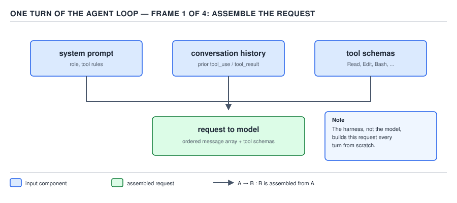

**D-11a** — Assembling the request: the harness concatenates the system prompt, the full prior transcript, every tool definition, and the new user message into one outbound call. Nothing here is model behavior; it is harness bookkeeping that happens before the model sees anything.

**Why it exists:** a language model has no persistent state of its own between calls (§0.1's confabulation and no-memory points apply here directly) — the only way it can act on the world rather than merely describe it is if something outside it is willing to carry out an instruction and hand back the outcome. The loop is that something.

**Gotcha:** step 1 is not incremental. The harness does not "add one message" to a running model session — there is no running model session. Every call is a brand-new request carrying the entire history. This is why the context window (§0.2.1) and its cost accumulate the way they do, and it is why compaction (§0.2, file 02) exists at all: without it, step 1's payload only grows.

> A **turn of the loop** is: assemble the full conversation as the request → the model returns text and/or tool calls → the harness runs any permitted tools and appends their results → repeat until the model returns text with no tool call.

## §0.3.2 A tool is a name, a description, and a JSON schema `[ZERO]` `[DOC]`

**Mental model first.** A tool is not code the model can reach out and run. It is closer to an order form: a name the model can write down, a description telling it when to reach for that form, and a schema saying exactly what fields the form has and what type each field must be. The model never sees or touches the code behind the form — it only ever fills the form in.

Precisely: a **tool** is a JSON object the harness includes in every request, with three parts — `name` (a short identifier), `description` (prose telling the model what the tool does and when to use it), and `input_schema` (a JSON Schema object describing the shape of the arguments a call must supply). The Anthropic API documentation, "Tool use with Claude" (`platform.claude.com/docs/en/agents-and-tools/tool-use/overview`), gives this exact worked example of a tool definition:

```json
{
  "name": "get_weather",
  "description": "Get the current weather for a given location.",
  "input_schema": {
    "type": "object",
    "properties": {
      "location": {
        "type": "string",
        "description": "City and state, e.g. San Francisco, CA"
      }
    },
    "required": ["location"]
  }
}
```

The same page states the mechanism this whole file rests on: "Claude runs the search on Anthropic's infrastructure and returns the cited results in the same response. To have Claude call a function that you define, pass a tool with an `input_schema`, then execute the call when Claude returns a `tool_use` block." Read literally: the caller defines the schema, the caller executes the call. The model's job stops at producing a JSON object shaped like `input_schema` — never at running anything.

Claude Code's own built-in tools — `Read`, `Bash`, `Edit`, and the rest catalogued in §0.3.8 — are exactly this: name, description, `input_schema`, sent in the `tools` array of every request the harness makes, indistinguishable in kind from `get_weather` above. `Read` has an input schema requiring a file path; `Bash` has one requiring a command string; neither is special to the protocol.

**Gotcha:** the description is not documentation for a human reading the code later — it is the *only* signal the model has for choosing between tools. This is the seed of §0.3.6's pitfall.

> A **tool** is a `name` / `description` / `input_schema` triple the harness advertises to the model in every request; the model can only ever produce JSON matching that schema, never execute anything itself.

## §0.3.3 The model does not call the tool — it emits `tool_use` `[ZERO]` `[TRAP]`

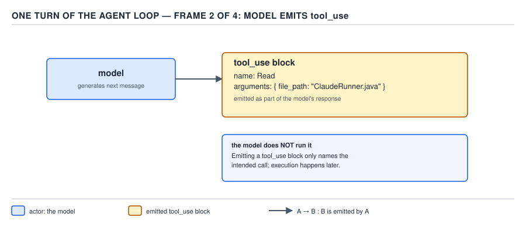

**D-11b** — The model's response is one or more content blocks. A `tool_use` block carries a `name` and an `input` object matching that tool's schema — it is not a function invocation, it is a structured guess about what should happen next.

This is the hinge of the entire guide, so state it with no hedging: **the model does not call the tool.** It emits a `tool_use` content block — a piece of output, exactly as much "just text" as a paragraph of prose, except this text is JSON of the shape `{"type": "tool_use", "name": "...", "input": {...}}` naming a tool and supplying arguments that match its schema. That block goes back to the harness. The **harness** — the program running on your machine, described fully in §0.3.11 — reads that block and decides, independently, whether to actually run the corresponding code.

Why the distinction matters: everything the permission system does — every `allow`, every `ask`, every `deny` rule, every permission mode you will meet in PART 1 — sits at exactly this seam, between "the model asked for something" and "the harness carried it out." If the model calling a tool were the same event as the tool running, there would be nowhere to put a permission check: by the time you could refuse, the damage would already be done. Because the model can only *propose*, the harness gets a checkpoint to accept, ask, or refuse before anything happens. PART 1's entire permission chapter is this one fact, worked out into rules.

**Pitfall:** engineers who have only used a raw chat model (no tools) sometimes carry over the belief that once the model "decides" to do something, it's done — the way a person deciding to open a door is functionally the same as the door opening. The symptom shows up as surprise at a session that stops mid-task waiting for a permission prompt: "why is it just sitting there, it already said it would run the tests?" It said it would; it cannot make that true by itself. The fix is holding the two events apart in your head permanently: *emit* is the model's act, *run* is the harness's act, and there is a decision point between them every single time, even when that decision point auto-approves in under a millisecond.

> A `tool_use` block is the model's output proposing a tool call by name and arguments; the harness is the sole party that decides whether the proposal is executed.

## §0.3.4 A `tool_result` is context — a verbose tool is a context leak `[ZERO]`

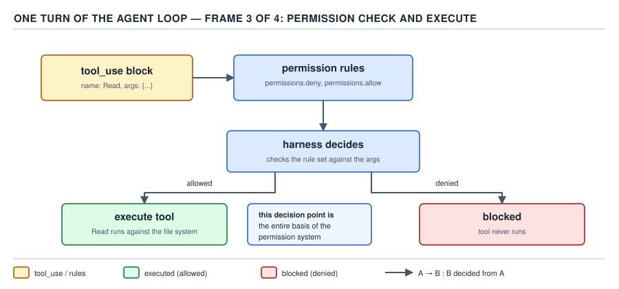

**D-11c** — The harness's checkpoint: permitted → the tool runs and its output becomes a `tool_result`; not permitted → the harness returns a `tool_result` reporting the denial instead, without ever invoking the underlying code.

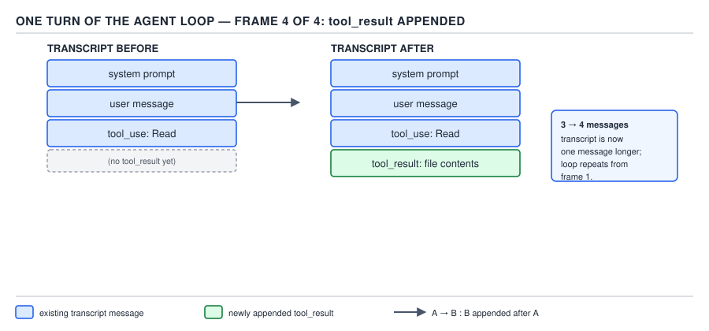

**D-11d** — Whichever branch fired, a `tool_result` block is appended to the conversation, and step 1 of §0.3.1 runs again with that larger transcript as input to the *next* request.

Once the harness has executed a tool (or refused to), it packages the outcome as a `tool_result` message and appends it to the conversation. Nothing about this is special or separate from the rest of the transcript — a `tool_result` is a message like any other, and per §0.3.1 the *entire* conversation, `tool_result` blocks included, is re-sent on the next turn.

That single sentence is the whole mechanism behind an entire category of cost bug: **tool output is context**. If a tool you write, or configure, or reach for returns 40,000 tokens of raw JSON when the model needed one field, every one of those 40,000 tokens is now permanently part of the transcript, billed again on every subsequent turn until compaction (file 02) eventually evicts it, and counted against the context window's finite budget the whole time it sits there. A tool with verbose, uncurated output is not merely "a bit wasteful" — it is a **context leak**, structurally identical to a memory leak: something keeps growing that nothing is pruning, and the program (here, the conversation) eventually can't function.

**Insight:** this is why a well-designed tool's description and its actual return payload are treated as separate design problems in professional harness engineering. `Read` can return a whole file, but a shell command wrapped as a tool for a build system should return a *summary* of the build log, not the log — the summary is a design decision made once, on the tool's behalf, so that every future turn doesn't pay for the log's length.

> A `tool_result` is appended to the transcript and resent on every later turn like any other message; the size of a tool's output is therefore a permanent, recurring cost, not a one-time cost.

## §0.3.5 The turn — and why two different limits both apply `[NUM]`

A **turn** is one full model response plus every tool it triggers and the harness's handling of them — concretely, one pass through steps 2 and 3 of §0.3.1's loop. A session that reads a file, greps for a symbol, edits three lines, and reports "done" in a single uninterrupted stretch of tool calls with no intervening question back to you is, depending on how the harness's flag counts it, one turn or a short run of turns — but it is *not* the same unit as "one exchange with the user." A turn is a unit of **agentic action**, not a unit of **conversation**.

Claude Code's CLI exposes `--max-turns`, documented on the `cli-reference` page as: "Limit the number of agentic turns (print mode only). Exits with an error when the limit is reached. No limit by default." This is a **turn-count** ceiling — it bounds how many times the loop is allowed to go around, regardless of how long each turn takes.

A **wall-clock timeout** is a different axis entirely: it bounds elapsed *time*, regardless of how many or how few turns consumed it. A single turn can be slow (a `Bash` call that hangs waiting on a flaky network resource) or fast (an `Edit` on a three-line file); `--max-turns` has no opinion about either, because it is only counting turns, not seconds.

**Why you need both, worked through:** suppose you run a headless orchestration step (the subject of PART 3's `-p` chapter and PART 4's Java orchestrator) with `--max-turns 20` and no timeout. If one of those 20 turns is a `Bash` call against a hung subprocess, the loop is not "on turn 6 of 20" in any meaningful sense — it is stalled on turn 6 indefinitely, and `--max-turns` will never trip, because the count only increments when a turn *completes*. Conversely, suppose you set a 10-minute wall-clock timeout with no `--max-turns`. A model that is technically making fast, valid tool calls but pursuing an unproductive strategy — retrying a failing `Grep` pattern nine different ways — can burn through 80 fast turns inside those 10 minutes without ever tripping a time limit, and each of those turns costs money (§0.3.4's token accounting, times 80). One limit catches *stuck*; the other catches *thrashing*. Neither substitutes for the other, which is exactly the incident the ROLE of this guide's author carries scar tissue from: "an 80-turn ceiling that produced thirteen green tests, a correct fix, and $5.16 of nothing landed" is a turn ceiling firing correctly on a session that was *not* stuck — it was thrashing, slowly, turn by valid turn, and the ceiling caught the cost without a single hang.

> A **turn** is one model response plus the tool calls it triggers and their handling; `--max-turns` bounds how many turns run, a wall-clock timeout bounds how long they may take, and a runaway session can violate either one without violating the other.

## §0.3.6 The model chooses tools from their descriptions alone `[TRAP]`

There is no side channel. When the model decides whether `Grep` or `Read` or a project-defined MCP tool is the right next step, it has exactly one thing to go on: the `description` string in that tool's schema (§0.3.2), read alongside the conversation so far. It cannot inspect the tool's implementation, cannot see comments in the code behind it, cannot ask a human which one is intended — the description is the entire interface between "what this tool does" and "the model's belief about what this tool does."

**Pitfall:** teams building their own tools (custom MCP servers, project-specific scripts wrapped as tools) sometimes write a description the way they'd write an internal code comment — terse, assuming context only a teammate would have, e.g. a tool named `run_check` described merely as `"runs the check"`. The symptom is a tool that gets called at the wrong moments, or never called when it should be, or called with wrong arguments — not because the underlying code is broken, but because the model genuinely cannot tell `run_check` apart from three other plausible tools without more to go on. The fix is treating a tool description as documentation for a very literal, very fast new hire who has read nothing else about your system: state what the tool does, when to reach for it, what it needs, and — critically — when *not* to use it if a similarly-named sibling exists. **Why people believe it:** the description looks like an internal artifact (it lives in a JSON blob next to implementation code, not in a user-facing doc), so it gets written with a code comment's economy rather than a specification's precision, and the mistake doesn't surface until a live session picks the wrong tool at the wrong moment.

## §0.3.7 A complete loop, end to end, with the token cost stated after every step `[PROVE]` `[NUM]`

Take a concrete request: "rename the method `parse` to `parseEnvelope` on the `ClaudeRunner` class." Walk every turn of the loop from §0.3.1, and state the running token count in context after each step — not "the transcript grew," the actual number.

| Step | What happens | Tokens in context after this step |
|---|---|---|
| Start | System prompt, tool definitions, and the user's request are assembled | 720 |
| 1 — `Grep` | The harness runs a `Grep` for `parse(` across the repository to find every call site; the harness appends the matches as a `tool_result` | 1,640 |
| 2 — `Read` | The model, seeing one clear match in `ClaudeRunner.java`, emits a `tool_use` for `Read` on that file; the harness appends the file contents | 1,740 |
| 3 — `Edit` | The model emits a `tool_use` for `Edit`, renaming the method and its one call site; the harness applies the diff and appends a short confirmation as the `tool_result` | 1,830 |
| 4 — done | The model emits plain text reporting the rename is complete; the loop exits because this response carries no `tool_use` block | 1,830 (unchanged — no tool ran) |

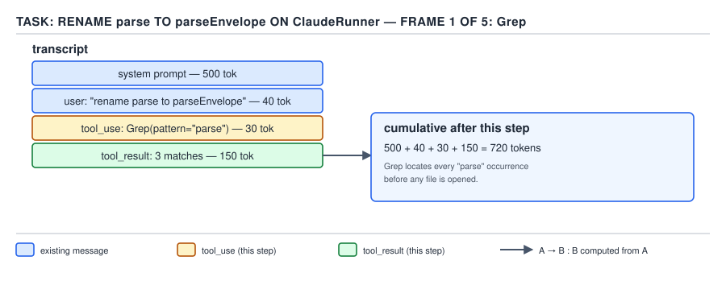

**D-12a** — The assembled starting request for the rename task: system prompt plus tool schemas plus the user's instruction, 720 tokens before any tool has run.

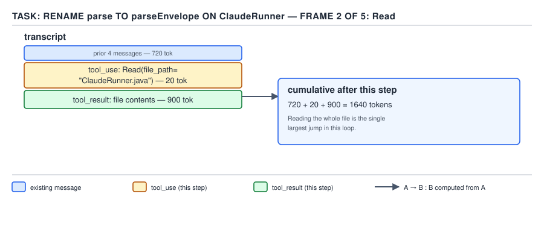

**D-12b** — After the `Grep` call and its `tool_result`, context has grown to 1,640 tokens — the single largest jump in the walk, because a repository-wide search result is the biggest payload in this sequence.

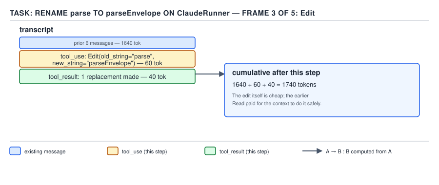

**D-12c** — After `Read` returns the one matching file, context reaches 1,740 tokens — a smaller jump than the `Grep` step, because the model already narrowed the search to one file before reading it.

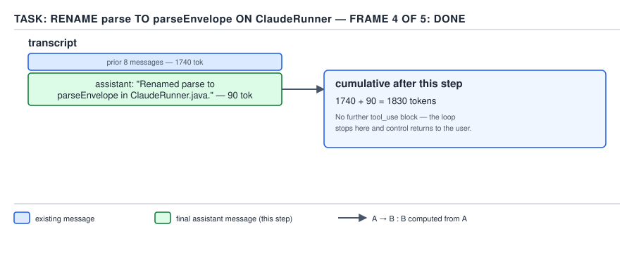

**D-12d** — After `Edit` applies the rename and the harness appends its confirmation, context stands at 1,830 tokens.

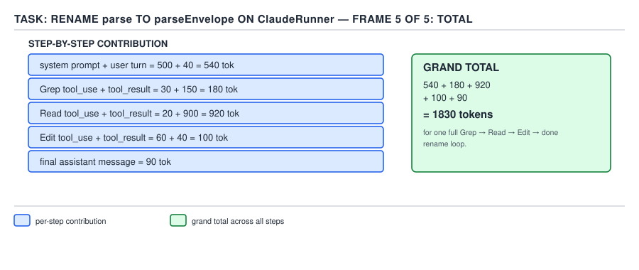

**D-12e** — The full walk summed: 720 tokens to start the task, a further 920 to search, 100 to read the one file it needed, and 90 to apply and confirm the edit — a final transcript of 1,830 tokens to complete a one-line rename, all of it now sitting in context and billed again on every future turn until compaction (file 02) evicts it.

**Insight:** the expensive step was not the edit — the edit itself cost 90 tokens. The expensive step was the *search*, because a repository-wide `Grep` result is, by construction, a payload whose size depends on the repository, not on the task. A larger or noisier codebase would inflate step 1 without changing anything about how simple the underlying rename actually is — which is precisely why §0.3.4's point about a tool's output size being a design decision, not an accident, matters in practice.

## §0.3.8 The built-in tools, by category `[DOC]` `[RESEARCH]`

Every one of these is a `name` / `description` / `input_schema` triple exactly as defined in §0.3.2 — there is no second, more privileged kind of tool underneath. Re-verified against `code.claude.com/docs/en` immediately before writing this section.

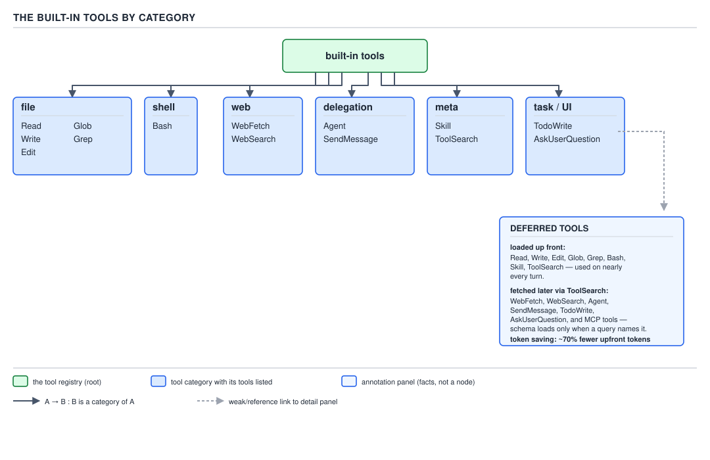

**D-13** — The built-in tools by category. Read the side panel for which schemas load up front and which arrive via `ToolSearch` (§0.3.9).

| Category | Tools | What they cover |
|---|---|---|
| File | `Read`, `Write`, `Edit`, `Glob`, `Grep`, `NotebookEdit` | Reading, writing, editing files and notebooks; finding files and text |
| Shell | `Bash`, `PowerShell`, `Monitor` | Running commands and monitoring a running process |
| Web | `WebFetch`, `WebSearch` | Fetching a URL's content; searching the web |
| Delegation | `Agent`, `SendMessage`, `ListAgents` | Spawning subagents, messaging other agents or sessions, listing addressable agents |
| Meta / discovery | `Skill`, `ToolSearch` | Invoking a packaged skill; searching for and loading a deferred tool's schema (§0.3.9) |
| Task / UI | `TodoWrite`, `AskUserQuestion`, `TaskCreate`, `TaskGet`, `TaskList`, `TaskUpdate`, `TaskStop`, `TaskOutput`, `CronCreate`, `CronList`, `CronDelete` | Tracking a task list, asking the user a clarifying question, and managing scheduled or long-running work |
| Workspace | `EnterWorktree`, `ExitWorktree` | Isolating work in a separate git worktree (the mechanism §2.7.4 grounds in git craft, guide 17) |
| Session control | `EnterPlanMode`, `ExitPlanMode`, `EndConversation`, `ScheduleWakeup`, `WaitForMcpServers`, `Workflow` | Controlling the session's mode and lifecycle |
| Output | `Artifact` | Producing a rich, renderable output artifact separate from chat text |

A meaningful restriction worth stating alongside the catalogue rather than in a footnote: **subagents do not get the full list.** `AskUserQuestion`, `EndConversation`, `EnterPlanMode`, `ExitPlanMode`, `ScheduleWakeup`, `TaskOutput`, `WaitForMcpServers`, and `Workflow` are withheld from every subagent, and a subagent running in the background is restricted further still, to a narrower list built around `Read`, `Grep`, `Glob`, `Bash`, `PowerShell`, `Edit`, `Write`, `NotebookEdit`, `WebFetch`, `WebSearch`, `TodoWrite`, `Skill`, `ToolSearch`, `EnterWorktree`, `ExitWorktree`, `Monitor`, `TaskStop`, `SendMessage`, and `Artifact`, plus whatever MCP tools the session has connected. The reasoning behind *why* a subagent's tool surface is narrowed this way — and how you narrow it further yourself with a `tools` allowlist or `disallowedTools` denylist on a subagent definition — belongs to PART 2's subagents chapter; the fact to hold onto here is only that **the tool list is not a fixed universal constant** — it depends on who (main session vs. subagent vs. background subagent) is running the loop.

**No gotcha beyond §0.3.6's: a longer catalogue does not change how a tool is chosen — it is still description-driven, which is exactly why §0.3.9's deferred loading exists once the catalogue gets large.**

## §0.3.9 Deferred tools and `ToolSearch` — why the full schema of every tool is not loaded up front `[DOC]` `[VERSION]`

Every tool's schema, per §0.3.2, is JSON text, and per §0.3.1 every tool's schema is included in *every single request* — not just the first one. If a session has fifty tools connected (a handful of built-ins plus several MCP servers), all fifty schemas ride along on every turn whether or not that turn uses any of them. Anthropic's tool search documentation states the resulting numbers plainly: "A typical multiserver setup (GitHub, Slack, Sentry, Grafana, and Splunk) can consume ~55k tokens in definitions before Claude does any work," and separately, "Claude's ability to pick the right tool degrades once you exceed 30–50 available tools" — so a large tool catalogue is expensive *and* it actively hurts §0.3.6's description-driven selection, independently of the cost.

`ToolSearch` is Claude Code's harness-side application of the same mechanism the API calls tool search: a tool whose schema loads normally, and behind it, a set of **deferred tools** whose full schemas do **not** ride along in every request — only a compact index of names and short descriptions does. When the model needs a capability it doesn't already see the schema for, it calls `ToolSearch` with a query; the harness matches against that index and expands the matching tool's full schema into context, at that point, on demand. The same documentation reports "over 85 percent" reduction in tokens spent on tool definitions from this scheme, loading typically "only the 3–5 tools Claude needs for a given request" rather than the whole catalogue.

**As of Claude Code v2.1.2xx**, the harness keeps a small set of frequently used tools (the file tools, `Bash`, and a handful more) non-deferred so they're callable without a search round-trip, and defers the long tail — this is the same "keep your 3–5 most frequently used tools non-deferred" guidance the underlying API documents for `defer_loading`. **Unverified:** the exact current list of which specific built-in tools ship non-deferred versus deferred in a stock Claude Code session was not directly enumerated on the pages checked for this file; the categorical claim (a small hot set stays loaded, most MCP and less-common tools defer) is documented, the precise membership list is not.

**Insight:** deferred loading is not a cache in the sense of "loaded once, reused forever" — it is re-evaluated fresh, per request, the same way §0.3.1's whole assembly step is. A tool discovered via `ToolSearch` in turn 3 does not silently stay expanded for free in turn 4; its expanded schema is now part of the transcript (§0.3.4's rule — everything appended is resent), so it is paid for again on every subsequent turn exactly like a `tool_result` would be, until compaction evicts it.

## §0.3.10 Extended thinking: reasoning tokens the model spends before answering `[DOC]` `[NUM]`

**Extended thinking** is reasoning the model emits *before* producing its final answer or its `tool_use` block — a scratch pad the model writes to itself, made of ordinary tokens, that is billed exactly like any other output. The documentation is explicit that there is no free lunch here: "You are charged for all thinking tokens generated, even when collapsed or redacted." Claude Code collapses this reasoning by default in the terminal (`Ctrl+O` toggles verbose display), but "collapsed" is a display choice, not a billing discount.

Three configuration surfaces control it, each stated at the point of the claim:

- **`alwaysThinkingEnabled`** — a boolean saved to `~/.claude/settings.json` (set via `/config`'s thinking-mode toggle) that turns extended thinking on for every session by default, rather than requiring a per-session toggle (`Option+T` / `Alt+T`).
- **`showThinkingSummaries`** — a boolean setting; with it set to `true`, Claude Code shows the full reasoning summary when you expand a collapsed thinking block, rather than a bare stub. The documentation notes this matters specifically because "interactive sessions on the Anthropic API receive redacted thinking blocks by default."
- **The `/effort` levels** — `low`, `medium`, `high`, `xhigh`, `max` — set how much adaptive reasoning the model applies. As documented on `model-config`: `low` is for short, latency-sensitive, non-intelligence-critical tasks; `medium` trades some intelligence for lower token spend; `high` balances the two and is the default on most models; `xhigh` reasons more deeply at higher spend and is the default specifically on Opus 4.7; `max` can help on the hardest tasks but is explicitly documented as "prone to overthinking" with diminishing returns.

**Version note:** a sixth value, `ultracode`, exists as a Claude Code–specific setting layered on top of `xhigh` (it "plans a dynamic workflow for each substantive task with `xhigh` per-message reasoning") and **requires Claude Code v2.1.203 or later** — it is not one of the five core effort levels and is not available on older builds in this same v2.1.2xx line, which is exactly the kind of same-release-line divergence this guide's `## Target version` section warns about.

**No gotcha beyond the billing point already stated: "collapsed" and "free" are not the same thing, and confusing them is the single most common cost surprise this setting produces.**

## §0.3.11 Where "Claude Code" sits: it is the harness `[ZERO]` `[DOC]`

Every mechanism in this file — assembling the request, deciding whether a `tool_use` runs, appending a `tool_result`, counting turns, deferring a tool's schema — is work done by a program running on your machine (or your CI runner), not by the model. That program is what "Claude Code" names. The **model** is the thing that reads a request and emits text or `tool_use` blocks, over the network, with no memory of anything outside that one request (§0.1). The **harness** is everything else: the loop itself, the tool implementations, the permission checks, the settings files, the transcript storage, the terminal or editor rendering.

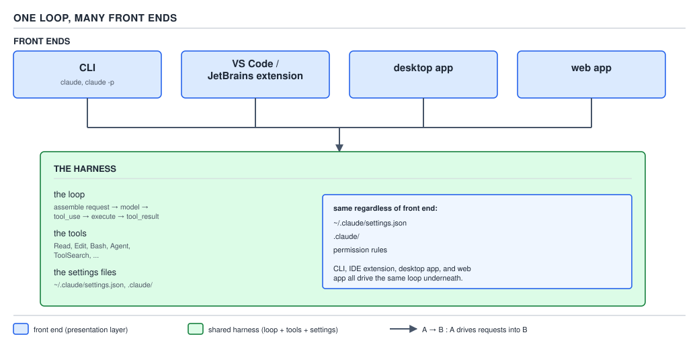

**D-14** — The CLI, the VS Code and JetBrains extensions, the desktop app, and the web app are four different front ends drawing on the identical loop and the identical settings files underneath; none of them is a different model or a different permission engine.

This is why the CLI you type into, the VS Code and JetBrains extensions, the desktop app, and the web app are not four different products with four different behaviors bolted on — they are four different **front ends** rendering and driving the same underlying loop, reading the same settings files (`.claude/settings.json` and its siblings, the whole subject of PART 1), enforcing the same permission rules, and calling the same model. A `PreToolUse` hook you configure once fires identically whether you triggered the tool call by typing in a terminal or by clicking "accept" in an IDE panel, because the hook is wired into the harness's tool-execution step (§0.3.1, step 3), and every front end shares that step.

**Gotcha:** "the model got smarter" and "the harness got better at using the model" are two entirely separate kinds of improvement, and release notes for Claude Code frequently describe the second kind — a new tool, a new permission mode, better context management — with no change to which model is underneath at all. Attributing a harness improvement to the model (or vice versa) will make you wrong about which knob to turn next time something changes.

> **Claude Code is the harness**: the program that assembles requests, runs the loop, executes tools, and enforces permissions. The model is one component it calls; the CLI, IDE extensions, desktop app, and web app are front ends over the same harness and the same settings.

## §0.3.12 The Agent SDK and the API: the same loop, with the harness written by you `[X-REF 21]`

Everything in this file — the request-assembly step, the `tool_use` / `tool_result` exchange, the turn as a unit, deferred tool schemas, even extended thinking — is not proprietary to the Claude Code product. It is the shape of the **Messages API** itself, the same `tools` array and the same `tool_use` / `tool_result` protocol shown in §0.3.2's `get_weather` example, called directly. The **Agent SDK** is a thin layer over that same API that saves you from writing the loop's bookkeeping (the request-reassembly step, the tool-dispatch step, the turn-accounting step) by hand — but it does not replace the harness's job, it *is* a harness, one that you, rather than the Claude Code team, are responsible for wiring up: which tools it exposes, what its permission checks look like, how it renders output, what its turn and timeout limits are. Building on the SDK or the raw API means you have taken on the harness engineer's job this guide's ROLE describes, for your own program instead of for Claude Code. The full treatment — request shape, the Java-specific `ProcessBuilder`-around-`claude -p` pattern, and the headless orchestration this guide's PART 4 builds — is in §3.8 (`sdk-and-api/03-internals-sdk-and-java-options.md`); this paragraph is the whole orientation you need to recognize, on sight, that an SDK-based agent and a Claude Code session are the same mechanism wearing different clothes.

## Pitfalls

**Belief:** "the model called `Bash` and ran the tests." **What actually happens:** the model emitted a `tool_use` block naming `Bash` with a command as its input; that block, by itself, runs nothing. **What actually gets the guarantee:** the harness receiving that `tool_use` block, checking it against the active permission mode and rule set, and only then invoking the real process — a step you can watch happen by setting a restrictive `permissions.deny` rule and observing the exact same `tool_use` block appear in the transcript with no corresponding execution. **Why people believe it:** in ordinary conversational usage the harness auto-approves so quickly and so often that the two events — propose, then execute — appear to be one event, right up until a permission prompt or a `deny` rule makes the gap visible.

**Belief:** "a bigger, more capable tool description costs nothing extra, so write it defensively long." **What actually happens:** every tool's schema — name, description, and `input_schema` together — rides along in every request per §0.3.1, so a bloated description is paid for on every single turn of every session that has that tool available, whether or not it's ever called. **What actually gets the guarantee:** writing the description to the length the model actually needs to disambiguate the tool from its siblings (§0.3.6), and reaching for deferred loading via `ToolSearch` (§0.3.9) once a project's tool count crosses roughly ten, rather than trusting that "more detail is always better" scales for free. **Why people believe it:** a tool description looks like ordinary documentation, and ordinary documentation genuinely is free to make longer; a tool description is billed prose, not free prose.

**Belief:** "one hard limit — either a turn count or a timeout — is enough to keep a run bounded." **What actually happens:** a turn-count ceiling never fires against a session stuck inside one long-running tool call, and a timeout never fires against a session making many small, valid, unproductive turns (§0.3.5's $5.16-of-nothing incident). **What actually gets the guarantee:** setting both `--max-turns` and a wall-clock timeout together, because they bound two independent failure axes. **Why people believe it:** "stuck" and "thrashing" both look, from the outside, like "this is taking too long," so it's easy to assume one limit generalizes to catch both.

## Cheat sheet

| Term | One-line definition | Where it's spent / bounded |
|---|---|---|
| Loop (§0.3.1) | assemble request → model emits → harness executes → repeat | every turn re-sends the whole conversation |
| Tool (§0.3.2) | `name` + `description` + `input_schema` JSON triple | its schema rides in every request while loaded |
| `tool_use` (§0.3.3) | the model's proposal to call a tool | the harness, not the model, decides whether it runs |
| `tool_result` (§0.3.4) | the outcome appended to the transcript | resent, and billed, on every later turn |
| Turn (§0.3.5) | one model response + its triggered tool calls | bounded by `--max-turns`; time bounded separately by a timeout |
| Extended thinking (§0.3.10) | reasoning tokens emitted before the final answer | billed even when collapsed or redacted |
| `ToolSearch` (§0.3.9) | on-demand expansion of a deferred tool's schema | cuts ~85% of up-front tool-definition tokens |
| Harness (§0.3.11) | the program running the loop — Claude Code itself | shared identically across CLI, IDE, desktop, web |

## Self-test

1. What are the three steps of one iteration of the agent loop, in order?
<details><summary>Answer</summary>Assemble the request (system prompt, full prior transcript, tool definitions, latest message) → the model emits text and/or a `tool_use` block → the harness decides whether to run any proposed tool, executes it if permitted, appends a `tool_result`, and the loop repeats from step one if a tool ran.</details>

2. What exactly does a tool call consist of, and who decides whether it actually runs?
<details><summary>Answer</summary>The model emits a `tool_use` content block naming a tool and supplying arguments matching that tool's `input_schema` — this is output, not execution. The harness — the program running the loop, not the model — is the sole party that decides whether that proposed call is actually carried out, checking it against the active permission rules before invoking any real code.</details>

3. Why is a verbose tool described as a "context leak"?
<details><summary>Answer</summary>Every tool's output becomes a `tool_result` message appended to the transcript, and per the loop, the entire transcript is resent on every subsequent turn. A tool that returns far more than the model needs therefore inflates every future request's cost and context-window usage, the same way an unreleased reference inflates a program's memory footprint over time.</details>

4. Define a turn, and explain why `--max-turns` and a wall-clock timeout are not substitutes for each other.
<details><summary>Answer</summary>A turn is one model response plus any tool calls it triggers and the harness's handling of them. `--max-turns` bounds how many turns are allowed to run, regardless of how long each one takes; a wall-clock timeout bounds elapsed time, regardless of how many turns fit inside it. A session stuck in one long tool call never increments the turn counter, so only a timeout catches it; a session making many fast, unproductive turns never exceeds a short timeout, so only a turn ceiling catches it.</details>

5. What determines which tool the model reaches for when two tools could plausibly apply?
<details><summary>Answer</summary>The tool's `description` string, read alongside the conversation so far — that is the model's only signal, since it cannot inspect implementation code or ask a human which tool is intended. A vague or under-specified description produces a misused or unused tool regardless of how well the underlying implementation works.</details>

6. What problem does `ToolSearch` / deferred tool loading solve, and roughly how much does it save?
<details><summary>Answer</summary>Loading every connected tool's full schema into every request gets expensive (a typical multiserver setup can cost ~55k tokens in definitions alone) and actively hurts the model's tool-selection accuracy once the catalogue passes roughly 30–50 tools. Deferred loading keeps only a compact name/description index in context for most tools and expands a tool's full schema on demand when `ToolSearch` matches it, cutting tool-definition token cost by over 85 percent in typical cases.</details>

7. Is "Claude Code" the model, or something else?
<details><summary>Answer</summary>Something else — Claude Code is the harness: the program that assembles requests, runs the agent loop, executes tools, enforces permissions, and manages settings. The model is a separate component it calls over the network on every turn; the CLI, VS Code/JetBrains extensions, desktop app, and web app are different front ends over that same harness and the same settings files.</details>

8. Is extended thinking free when its output is collapsed in the terminal?
<details><summary>Answer</summary>No. Collapsing thinking output is purely a display choice — the documentation states explicitly that all thinking tokens generated are charged, even when collapsed or redacted from view.</details>

## Open questions

**Unverified:** the exact current list of which specific built-in Claude Code tools ship non-deferred (loaded up front) versus deferred (loaded via `ToolSearch` on demand) in a stock v2.1.2xx session — the categorical mechanism and the general "keep 3–5 hot tools non-deferred" guidance are documented, but no page checked for this file enumerated Claude Code's own concrete non-deferred set.

---

**Leaves covered:** 0.3.1–0.3.12 (12 leaves)
**Leaves deferred:** none
**Diagrams included:** D-11 (a–d), D-12 (a–e), D-13, D-14
**Target version:** Claude Code v2.1.2xx (August 2026)
**Lines:** 266
