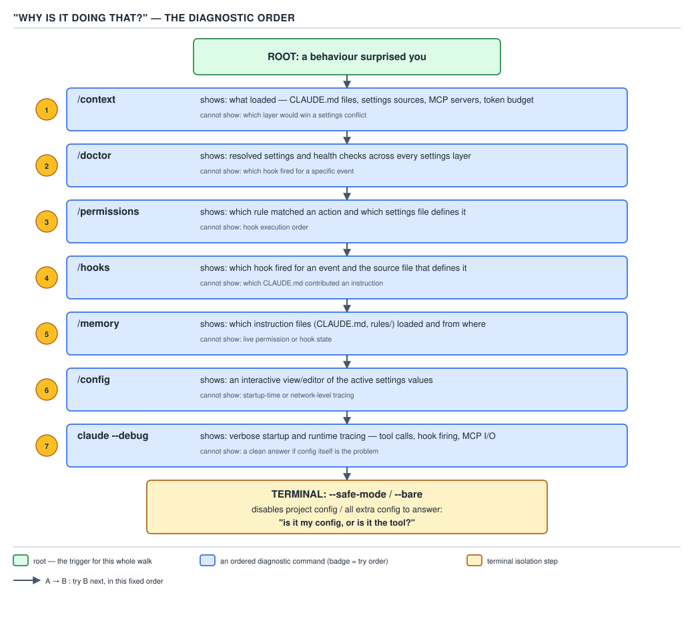

# 21 AI for Coding — orientation in the tool — BASICS (§0.4)

**Target version: Claude Code v2.1.2xx (August 2026).** | **Part 0 of 6** | [Index](../00-index.md)
Previous: [the agent loop](03-basics-the-agent-loop.md) · Next: [the `.claude` folder](../claude-folder/01-basics-anatomy.md)

File 03 built the loop itself: assemble the request, the model emits text or a `tool_use` block, the harness decides whether to run it (§0.3.1–0.3.3). This file is the last one before you touch real configuration, and its job is narrower and more practical: get a session open, know what to type into it, and — above everything else — be able to read what the tool tells you about its own state instead of guessing. That last skill, worked through in §0.4.4, is what the rest of this six-part guide assumes you already have.

## §0.4.1 Install and authenticate `[BUILD]`

Installing the CLI is out of scope for this file — it is a package-manager step that varies by platform and is documented on the `cli-reference` page's own install section. What belongs here is the **first thing you run once it's installed**: proving you are signed in, because every later command in this file assumes an authenticated session.

```bash
claude auth login
```

This opens a browser-based sign-in flow against your Anthropic account. Two flags change which flow runs: `--sso` forces SSO authentication for an organization that requires it, and `--console` signs in through the Anthropic Console for API-key billing instead of a Claude subscription — the two are different billing paths, so picking the wrong one here is why a session might start charging against the wrong account weeks later.

**Prove step:**

```bash
claude auth status
```

```json
{
  "loggedIn": true,
  "email": "you@example-domain.test",
  "authMethod": "claude-subscription"
}
```

The command "show[s] authentication status as JSON," with a `--text` flag for a human-readable form, and it exits with code `0` if logged in and `1` if not — so `claude auth status; echo $?` is a scriptable readiness check, not just a display command.

**What this costs:** nothing in tokens. `auth login` and `auth status` are local CLI operations against a stored credential — neither one sends a request to the model, so neither shows up on a usage bill. This is worth stating explicitly because it is the first of many commands in this file that *look* like they're "asking Claude something" and are not: they are the harness talking to itself.

## §0.4.2 The three ways in `[DOC]`

**Mental model first.** A phone can be picked up for a real-time call, dialed once to leave a voicemail and hang up, or redialed to pick a conversation back up where it left off. Claude Code's three ways in are exactly that split, and confusing them is the single most common reason a scripted `claude` invocation "doesn't remember anything" when a human expected it to.

**Why it exists:** an interactive back-and-forth session and a one-shot call from a CI job have opposite needs. A human wants to see output stream in and ask follow-ups; a script wants a single answer, an exit code, and nothing left hanging open. One binary that only supported one shape would be wrong for the other use half the time.

| Way in | Full command | What it does |
|---|---|---|
| Interactive | `claude` | Opens a live, streaming session in the terminal; you type, it responds, the loop from file 03 runs turn after turn until you stop it |
| One-shot | `claude -p "rename the parse method to parseEnvelope"` | Runs the query once in **print mode**, prints the result, and exits — no interactive prompt, suitable for a pipeline. `-p` is short for `--print` |
| Continue | `claude -c` or `claude -r "<session-id-or-name>" "finish this PR"` | Reopens a prior conversation rather than starting from zero |

**When to reach for which:** interactive for exploratory work where you can't predict the next step; one-shot for a scripted, single-purpose call (PART 3's headless orchestration and PART 4's Java orchestrator are built entirely on `-p`); continue for picking a specific piece of work back up, whether that's "the last thing I was doing" or a named session from days ago.

`-c` / `--continue` "load[s] the most recent conversation in the current directory, skipping background sessions, sessions created with `claude -p` or the Agent SDK, and sessions whose first prompt was `/loop`" — unless you also pass `-p`, in which case `claude -p --continue` *does* include those otherwise-skipped kinds. `-r` / `--resume` either takes a session ID or name directly, or with no argument shows an interactive picker; passing an ID searches "the current project directory and its git worktrees, then every other project on this machine."

```bash
claude -r "auth-refactor" "Finish this PR"
```

**No SVG:** no diagram is assigned to this leaf; the table above is the full map.

**Gotcha:** `claude -p "…"` on its own starts a session with **no** history from anything you did earlier that day — it is not "continue, but non-interactive." If a script needs both properties (script-friendly *and* aware of prior context), it needs `claude -p --continue "…"` or `claude -p -r "<session>" "…"` explicitly; one-shot mode does not imply continuity, and continue mode does not imply one-shot.

> The three ways in are **interactive** (open-ended, streaming), **one-shot** (`-p`, one answer, exits), and **continue** (`-c` for the most recent session, `-r` for a named or picked one) — orthogonal choices about *how long the session runs* and *what history it starts with*, not variations on the same command.

## §0.4.3 The diagnostic ladder — and the order to try it in `[DOC]` `[BUILD]`

**Mental model first.** A session that's "doing something weird" has exactly one honest debugging move available to a level-zero reader: stop asking it to explain itself in prose, and go read the harness's own accounting instead. Seven commands do that, and they are not interchangeable — each one answers a different question, and running them in the wrong order wastes time re-diagnosing something a cheaper command would already have ruled out.

**Why it exists:** everything in file 03 established that the model has no privileged view into its own configuration — it sees only what the harness assembled into the request. When a session behaves unexpectedly, "ask the model why" is asking the wrong party. The diagnostic commands query the harness directly, which is the only party that actually knows.

**How it works, in order, cheapest-and-broadest first:**

1. **`/context`** — is the problem "it forgot something" or "it's slow / expensive"? This is first because it's a live readout of exactly what's currently loaded, and most "it's acting strange" reports turn out to be a context-budget problem, not a reasoning problem. Full treatment in §0.4.4.
2. **`/doctor`** — is the installation itself broken? Checks "installation health (duplicate/leftover installs, `PATH` problems, unparseable settings files)," finds unused skills, MCP servers, and plugins against their context cost, flags slow hooks, and checks for a newer release. Run from a shell as `claude doctor` (no session) for read-only diagnostics with nothing to confirm.
3. **`/permissions`** — is a tool being blocked or auto-denied that you expected to run? Opens rule management by scope, including a review of recent auto-mode denials.
4. **`/hooks`** — is something firing (or not firing) around a tool call that shouldn't be? Displays existing hook configurations so you can see what's wired to which event without reading `hooks.json` cold.
5. **`/memory`** — is `CLAUDE.md` or auto memory the source of an instruction the session keeps repeating (or ignoring)? Lists every `CLAUDE.md` and memory-file location, lets you open any of them, and toggles auto memory.
6. **`/config`** — is a setting (model, effort level, thinking mode) not what you expect? Opens the settings interface, or accepts `key=value` pairs directly, e.g. `/config thinking=false`, which also works from non-interactive `-p` mode.
7. **`claude --debug`** — last resort, when the six commands above didn't surface the cause: full startup and event tracing, optionally filtered, e.g. `claude --debug='mcp,startup'` to narrow to MCP and startup events, or `claude --debug='!1p'` to exclude a category. The filter only binds using the `=` form; a bare `--debug` with a separately space-quoted filter just turns on unfiltered debug mode.



**D-15** — "Why is it doing that?" — the diagnostic order. Read each leaf for what that command can and cannot tell you.

**Code:**

```bash
claude doctor
claude --debug='mcp,startup'
```

**Prove step:** `claude doctor` run from a shell with no active session prints its checklist and exits — no confirmation prompt, nothing changed on disk, purely read-only, which is exactly why it is safe to run first and often.

**What this costs:** all seven are harness-local operations against already-known state (the current context, the installed files, the settings on disk) — none of them sends the conversation to the model, so running through the whole ladder costs zero additional tokens. The only one that reads like it might: it doesn't.

**Gotcha:** running `/doctor` before `/context` is the most common ordering mistake, because `/doctor` sounds like the "something is wrong, diagnose everything" command. It checks installation and configuration hygiene, not what's currently sitting in your context window — a session that's sluggish because it's carrying 40,000 tokens of an old `Grep` result will report perfectly healthy under `/doctor` and show the actual cause immediately under `/context`.

## §0.4.4 Reading a real `/context` — the single most important habit in the guide `[PROVE]` `[BUILD]`

**Mental model first.** `/context` is not a health check with a pass/fail verdict — it is an itemized receipt for a budget that file 02 already told you is finite (§0.2.1). A reader who only ever glances at the top-line percentage and moves on is doing the equivalent of glancing at a restaurant bill's total and never checking that the line items are what was actually ordered. The habit this section teaches is: read every row, and be able to say what put each one there and what would shrink it.

**Why it exists:** the request-assembly step from §0.3.1 happens silently, every single turn — the harness builds it, the model never comments on it, and nothing in the ordinary flow of a session surfaces what's inside it. Without a command that exposes that assembly, a reader has no way to distinguish "the model is confused" from "the model never saw the file because context is already 90% full of something else."

**How it works:** `/context` renders "current context usage as a colored grid," broken into the categories the harness tracks separately, shows optimization suggestions for context-heavy tools and memory bloat, and — critically for a session that's over budget — "displays a warning showing how far over the limit you are and which command frees space" when the conversation exceeds the window. Passing `all` (`/context all`) expands the full per-item breakdown; the collapsed default view is what you'd see first.

Take a concrete session on a 200,000-token context window and walk every row, printing the arithmetic rather than asserting a conclusion:

| Row | Tokens | % of window | Supplied by | Lever that reduces it |
|---|---:|---:|---|---|
| System prompt | 3,200 | 1.60% | The harness's own built-in instructions — loaded before you type anything | None directly; `--bare` (§0.4.9) strips customization layered around it, not this row itself |
| System tools | 6,800 | 3.40% | Built-in tool schemas — `Read`, `Write`, `Edit`, `Bash`, `Grep`, and the rest of §0.3.8's catalogue | Deferred loading via `ToolSearch` (§0.3.9) for the long tail; the hot set stays loaded by design |
| MCP tools | 4,100 | 2.05% | Every connected MCP server's tool schemas (deferred names, or expanded on demand) | Disconnect unused MCP servers; leave more of the catalogue deferred |
| Memory files | 2,120 | 1.06% | `~/.claude/CLAUDE.md` (320) + the project's `CLAUDE.md` (1,800) | Trim `CLAUDE.md` under 200 lines; move procedure into a skill that loads on demand (§0.4.7's skills sibling, PART 1) |
| Custom agents | 900 | 0.45% | Subagent definitions' frontmatter and description strings, loaded so the harness can dispatch to them | Fewer subagents defined project-wide, or shorter descriptions |
| Skill listing | 450 | 0.23% | The name-plus-short-description index of every discoverable skill | Fewer skills auto-discovered; a skill's full body still only loads when invoked |
| Messages | 42,430 | 21.22% | The transcript so far — every prior user message, tool call, and `tool_result`, per §0.3.4's rule that all of it is resent every turn | `/compact` or `/clear` (§0.4.5) |
| Free space | 140,000 | 70.00% | What's left of the 200,000-token window before the next request would need to compact or fail | — |
| **Total** | **200,000** | **100.00%** | — | — |

**D-16** — A real `/context` read row by row.

Every row here is one of §0.3's mechanisms made visible: the system prompt and system tools rows are the fixed opening cost of §0.3.1's request assembly; the MCP row is §0.3.9's deferred-loading discipline in action; the memory and skill-listing rows are what PART 1's configuration surface actually costs once loaded; and the messages row is §0.3.4's "tool output is context" rule, accumulated. Nothing in this table is a mystery once you already have file 03's vocabulary — which is precisely why this command comes first on the diagnostic ladder in §0.4.3.

**Insight:** the "Free space" row is not idle headroom you can ignore — it is the number that tells you how much longer the session can run before something (compaction, a hard failure, or a manual `/clear`) becomes mandatory rather than optional. A session sitting at 30% free space with a large multi-file refactor ahead of it is a session that should compact *now*, on its own terms, rather than mid-task when the harness forces it.

**What this costs:** `/context` itself makes no call to the model — it renders the harness's own running token accounting, the same bookkeeping used to decide when compaction is needed, so reading it as often as you like is free.

**Gotcha:** the categories above are a snapshot, not a constant. Every row except "System prompt" and "System tools" can change size between one `/context` read and the next in the same session — a single large `Read` or a verbose `Bash` output can move "Messages" by thousands of tokens in one turn (§0.3.7 walked exactly this kind of jump). Reading `/context` once at the start of a session and trusting that number for the rest of the session is the mistake this whole section exists to prevent.

## §0.4.5 `/compact` vs `/clear` vs a fresh session `[DOC]`

**Mental model first.** Three of these look like "start over" and only one of them actually discards the conversation's substance while keeping nothing. Treating them as interchangeable "reset" buttons is how a reader loses either work they wanted kept, or money re-paying for context they didn't need to re-load.

**Why it exists:** §0.4.4's "Messages" row only grows. Something has to be able to shrink it, and different situations call for shrinking it by different amounts — sometimes you want a leaner version of the *same* task, sometimes you want a genuinely blank slate, and sometimes you want to try a second approach without touching the first attempt at all.

**How it works:** `/compact [instructions]` "free[s] up context by summarizing the conversation so far," optionally steered by focus instructions, and it "[h]andles rules, skills, and memory files according to specific compaction rules" rather than dropping them along with the rest of the transcript — concretely: "System prompt, CLAUDE.md, memory, and MCP tools reload automatically. Claude Code also re-reads up to five of the files modified most recently, reloads the rules that match them, and re-injects the skills you invoked. **The skill listing does not reload.**" `/clear [name]` instead "start[s] a new conversation with empty context," explicitly "keeping project memory" — the project's `CLAUDE.md` still loads fresh, the way it would for any new conversation, but none of the old transcript survives even as a summary. A brand-new `claude` invocation with neither `-c` nor `-r` behaves the same way as `/clear` from the reader's point of view — new conversation, `CLAUDE.md` reloaded, prior transcript gone — with one practical difference: after `/clear`, the discarded conversation stays one step away, surfaced as a `/resume <session-id> (previous session)` entry at the top of the `/rewind` menu (requires **Claude Code v2.1.191 or later**; on earlier builds, `/resume` and picking it from the list does the same job), whereas a fresh `claude` process needs an explicit `claude -r` to get back to it. `claude --continue --fork-session` is the fourth shape: it keeps the *entire* prior conversation intact under its original session ID and branches a **new** session ID from that point forward, so an experiment can go wrong without touching the original at all — the documentation's own framing is that `/branch` or `--fork-session` is what you reach for "to branch off and try a different approach while preserving the original session intact," as distinct from `/compact`'s in-place summarize.

| Command | Discards | Keeps | `CLAUDE.md` re-read from disk? | Skill invocations re-attached? | Prompt cache survives? | When to use it |
|---|---|---|---|---|---|---|
| `/compact` | The verbatim transcript (raw messages, tool calls, `tool_result`s) | A structured summary; system prompt, `CLAUDE.md`, memory, MCP tools, and up to 5 recently-modified files reload automatically | Yes | Yes — the skills you invoked are re-injected (the skill *listing*, i.e. the discoverable index, is not) | No — the summarized prefix differs from the original transcript, so the cached prefix from before compaction no longer matches | Same task, context getting full, want to keep working without losing the thread |
| `/clear` | The entire conversation | Project memory (`CLAUDE.md` reloads as it would for any new session); nothing else from before | Yes | No | No — brand-new conversation, no shared prefix with the old one | New, unrelated task; want a genuinely blank slate but stay in the same terminal |
| Fresh session (`claude`, no flags) | The entire conversation, same as `/clear` | Same as `/clear` | Yes | No | No | Same as `/clear`, from outside a running session — e.g. a new terminal or a new CI invocation |
| `claude --continue --fork-session` | Nothing | Everything — the full original transcript, verbatim, now also present under a new session ID | Already loaded; not re-read unless the fork also re-triggers session start | Yes — it's still the same messages, just under a new ID | Yes for the shared prefix — since the forked session's history is byte-for-byte identical to the original up to the fork point, that shared prefix is still eligible for a cache hit | Want to try a second, divergent approach without risking or altering the original session |

**D-17** — Four reset semantics compared.

**Code:**

```bash
claude -c --fork-session -p "try the streaming variant of this parser instead"
```

**Gotcha:** "keeping project memory" in `/clear`'s own description is easy to misread as "keeping the conversation, minus some clutter." It means the opposite of that: the *conversation* is gone; only the standing `CLAUDE.md` instructions — which would have loaded into a brand-new session anyway — persist. A reader who runs `/clear` expecting the model to still remember what file it was just editing has confused "project memory" (a file on disk) with "what we were just talking about" (the discarded transcript).

## §0.4.6 `/rewind` and file checkpointing `[DOC]` `[VERSION]`

Claude Code tracks a checkpoint before every user prompt, capturing the file state at that moment, and keeps snapshots for "the 100 most recent checkpoints in a session." `/rewind` (or pressing `Esc` twice on an empty prompt) opens a menu listing every prompt sent so far; picking one offers **Restore code and conversation**, **Restore conversation** (code untouched), **Restore code** (conversation untouched), or **Summarize from/up to here** — a targeted, manual version of `/compact` scoped to one point in the transcript. Whether the checkpointing this depends on is active at all is controlled by the setting `fileCheckpointingEnabled`, which "[t]urn[s] off or on the file snapshots that `/rewind` restores." **As of Claude Code v2.1.191**, resuming into the conversation active before a `/clear` — the "previous session" entry described in §0.4.5 — is available directly from the `/rewind` menu; on earlier builds in the same v2.1.2xx line, the same recovery requires `/resume` and picking the prior session from its list instead, which is exactly the kind of same-release-line divergence this guide's target-version rule exists to flag.

**Gotcha, three separate limitations, not one:** checkpointing does not track files changed by a `Bash` command (`rm`, `mv`, a shell redirect) — only edits made through Claude's own file-editing tools are captured, so a rename done via `mv` inside a `Bash` call cannot be undone through `/rewind`; edits made by most subagents are not restored by rewinding your own session's checkpoints (a foreground-forked skill is the one exception — its edits land in your turn and are captured normally); and a symlinked or hard-linked path is skipped entirely on restore, with Claude Code reporting how many files it had to leave alone rather than silently reverting them incorrectly.

> `/rewind` restores **code**, **conversation**, or **both**, per-checkpoint, from snapshots `fileCheckpointingEnabled` controls; it is not a substitute for `git` — it has no permanent history and does not survive past session cleanup (`cleanupPeriodDays`, §0.4.8).

## §0.4.7 Three prefixes that change what a line of input means `[DOC]`

Three characters at the start of a line change the meaning of everything that follows, and none of them go through the model as an ordinary prompt.

- **`!`** switches to **shell mode**: `! npm test` runs the command directly in your shell, "without going through Claude," and — as of the documented default — the command and its output are added to the conversation *and* Claude responds to that output automatically in the same turn, costing the same as sending a normal prompt. (Before **v2.1.186**, shell mode only added the output to context without triggering a response; the setting `respondToBashCommands: false` restores that older behavior if you want it back.)
- **`@`** triggers file-path autocomplete inline in your prompt — typing `@src/api/` and picking a match inserts a reference to that path so the model reads exactly the file you meant, rather than guessing from a description in prose.
- **`#`** — **Unverified:** no page checked for this file (`commands`, `interactive-mode`, `memory`) documents a leading `#` as a shortcut that saves the rest of the line straight into `CLAUDE.md` or auto memory in the current v2.1.2xx line. What *is* documented is the same outcome reached two other ways: telling Claude in an ordinary message to "add this to `CLAUDE.md`," or opening `/memory` and editing the file directly. A reader who has seen a `#`-prefix memory shortcut described elsewhere is very likely holding version-stale folklore from an earlier product surface; treat the two confirmed mechanisms above as the current ones until this is settled.

> `!` runs a shell command and (by default, since v2.1.186) gets a response to it; `@` inserts an exact file reference instead of a prose description; asking Claude directly to save something, or editing `CLAUDE.md`/auto memory via `/memory`, is this guide's confirmed route to persisted instructions — not an unverified `#` shortcut.

## §0.4.8 Where a session lives on disk, and for how long `[DOC]` `[NUM]`

**Mental model first.** Every session you've ever had with Claude Code is sitting in a folder on your machine right now, in a format you can open with `cat` — not a proprietary database, not something locked behind the CLI.

**Why it exists:** `-c` and `-r` (§0.4.2) need something durable to reconnect to, and `/rewind`'s checkpoints (§0.4.6) need to persist with the conversation they belong to across a resumed session — both depend on the transcript being real files, not an in-memory structure that dies when the process exits.

**How it works:** Claude Code stores session transcripts locally, in plaintext, under `~/.claude/projects/<project>/`, where `<project>` is derived from the git repository so that every worktree of the same repo shares one project folder. Each session is a `.jsonl` file — **JSON Lines**: one complete, independently-parseable JSON object per line, one line per event in the conversation, so `tail -f` or `jq` over the file works the same way it would on any append-only log, with no special tooling required to read it. Retention defaults to **30 days**, controlled by the setting `cleanupPeriodDays` in `settings.json`; past that period, Claude Code's cleanup sweep deletes the session (and, per §0.4.6, its checkpoints) automatically. Auto memory's own files, stored separately under `~/.claude/projects/<project>/memory/`, are explicitly *excluded* from that same retention sweep — they persist until you or Claude edits or deletes them, independent of `cleanupPeriodDays`.

```bash
tail -n 1 ~/.claude/projects/-Users-you-code-my-project/*.jsonl | jq .
```

**Code:** raising retention to 90 days in `settings.json`:

```json
{
  "cleanupPeriodDays": 90
}
```

**Gotcha:** "plaintext" means exactly that — file contents, tool output, and anything you typed are stored unencrypted on local disk, which is why a `.jsonl` transcript is the first thing worth checking for accidentally-captured secrets before sharing a machine or a backup of `~/.claude`.

> A session transcript is one plaintext JSONL file per session under `~/.claude/projects/<project>/`, readable with ordinary tools, kept for `cleanupPeriodDays` (default **30**) before automatic deletion; auto memory's own files are exempt from that sweep.

## §0.4.9 `--safe-mode` and `--bare`: isolating "is it my config or the tool?" `[DOC]` `[VERSION]`

Both flags start a session with less loaded than usual, but they answer different questions and are not interchangeable.

| | Normal session | `--safe-mode` | `--bare` |
|---|---|---|---|
| `CLAUDE.md`, skills, plugins, hooks, MCP servers, custom commands/agents, output styles, workflows, custom themes/keybindings, status line, LSP servers, auto memory | Load | Do **not** load | Do **not** auto-discover (an explicit `--add-dir` skill still loads) |
| Authentication, model selection, built-in tools, permissions | Normal | Normal — this is the key difference from `--bare` | Normal (only `Bash`, file read, and file edit tools available) |
| Managed policy (org-wide hooks, status line, file-suggestion commands) | Applies | Still applies | Not documented as bypassed, but the flag's purpose is scripted speed, not policy isolation |
| Purpose | — | Checking whether *your own customization* is what's causing a problem, including "checking whether a customization is what triggers automatic model fallback" | Starting scripted, one-shot calls faster by skipping auto-discovery entirely; sets `CLAUDE_CODE_SIMPLE` |

Both are documented as available in **v2.1.2xx**, this guide's target line — **Unverified:** neither the CLI reference nor the release-note pages checked for this file state the specific version each flag was *introduced* in, so treat "current in v2.1.2xx" as confirmed and "has always existed" as not.

**Gotcha:** `--safe-mode` keeps permissions active — you can still hit a permission prompt in safe mode — while `--bare` narrows the *tool surface itself* down to three tools regardless of permission settings. Reaching for `--bare` to debug "why does my permission rule not apply" answers nothing, because `--bare` sidesteps the question by removing most of what permissions would otherwise govern.

## §0.4.10 The first-session checklist `[BUILD]`

Do these four things today, in this order, before writing any project configuration:

1. **`/context`** — see what a stock session costs before you add anything to it. Note the "Free space" percentage.
2. **`/doctor`** — confirm the installation itself is clean before you start blaming project-level configuration for something that's actually a broken install.
3. **Open `~/.claude/CLAUDE.md`** with `/memory`, and read it — this is *your* personal, cross-project instruction file (this very guide's author has one; PART 1's memory chapter covers its precedence against a project's own `CLAUDE.md`).
4. **Count its lines**: `wc -l ~/.claude/CLAUDE.md`.

**Prove step:**

```bash
$ wc -l ~/.claude/CLAUDE.md
     125 /Users/you/.claude/CLAUDE.md
```

A number over roughly 200 is worth noting now, because PART 1's memory chapter states the size guidance this checklist is setting you up to act on later: files over that rough threshold "consume more context and may reduce adherence" every single session, for the rest of the time you use this tool.

**What this costs:** `/context` and `/doctor` are, per §0.4.3 and §0.4.4, both free of model cost; opening and reading a file through `/memory` is a local file-open, not a prompt. The entire checklist costs zero tokens and takes under five minutes — there is no reason to defer it past your first real session.

## Pitfalls

**Belief:** "`/doctor` is the everything-is-wrong command, run it first." **What actually happens:** `/doctor` audits installation and configuration hygiene — duplicate installs, broken `PATH`, unused skills against their cost, stale `CLAUDE.md` content — and reports nothing about what's currently sitting in this session's context window. **What actually gets the guarantee:** running `/context` first, per the diagnostic order in §0.4.3, because most "it's acting weird" reports are a context-budget symptom, and `/doctor` will report a perfectly healthy installation while that budget problem sits untouched. **Why people believe it:** the name "doctor" implies a full physical, and nothing in the command's own name hints that it deliberately excludes the live conversation state.

**Belief:** "`/clear` is just a lighter version of `/compact` — it keeps the important parts." **What actually happens:** `/clear` keeps only standing project memory (`CLAUDE.md`, reloaded fresh as it would be for any new session) and discards the entire prior conversation with no summary at all, while `/compact` replaces the conversation with an actual structured summary plus several automatically reloaded files. **What actually gets the guarantee:** reaching for `/compact` when the current task should continue with less baggage, and reserving `/clear` for a genuinely new, unrelated task. **Why people believe it:** both commands are pitched as ways to "free up context," and the shared goal obscures how differently they get there.

**Belief:** "a `#`-prefixed line quickly appends to memory, the way `!` runs a shell command." **What actually happens (as far as this file could verify):** no page checked for this file documents a `#` input-prefix with that behavior in the current v2.1.2xx line; the confirmed routes to persisted memory are asking Claude directly to add something to `CLAUDE.md`, or editing memory files through `/memory`. **What actually gets the guarantee:** use one of those two confirmed routes, and treat a claimed `#` shortcut as something to re-verify against the live docs before relying on it. **Why people believe it:** `!` and `@` are real, well-documented prefixes with exactly this kind of one-character-changes-everything behavior, which makes a third, similarly-shaped shortcut easy to assume exists by pattern-matching against the two that do.

## Cheat sheet

| Command / flag | One-line purpose |
|---|---|
| `claude auth login` / `claude auth status` | Sign in; check sign-in state (exit code 0/1) |
| `claude` | Interactive session |
| `claude -p "…"` | One-shot, print mode, exits after one answer |
| `claude -c` / `claude -r "<id>"` | Continue most recent / resume a named session |
| `/context` [`all`] | Read live token usage row by row — do this first |
| `/doctor` | Installation and configuration hygiene checkup |
| `/permissions` | Manage allow/ask/deny rules and view auto-mode denials |
| `/hooks` | View configured hooks |
| `/memory` | Edit `CLAUDE.md` / auto memory files |
| `/config [key=value]` | Open settings, or set one directly |
| `claude --debug[='filter']` | Full startup/event tracing, last resort |
| `/compact [instructions]` | Summarize in place, several files/rules/skills auto-reload |
| `/clear [name]` | New conversation, project memory only |
| `claude --continue --fork-session` | Branch a new session ID off the current one, original untouched |
| `/rewind` | Restore code, conversation, or both, from a per-prompt checkpoint |
| `fileCheckpointingEnabled` | Setting that turns `/rewind`'s snapshots on or off |
| `cleanupPeriodDays` | Days transcripts are kept (default 30) before deletion |
| `--safe-mode` | Disables customization, keeps permissions — "is it my config?" |
| `--bare` | Skips auto-discovery entirely, three tools only — fast scripted start |

## Self-test

1. What is the difference between `claude -c` and `claude -p --continue`?
<details><summary>Answer</summary>`claude -c` loads the most recent conversation in the current directory but skips background sessions, `-p`-created sessions, Agent SDK sessions, and sessions whose first prompt was `/loop`. Adding `-p` to a continue call (`claude -p --continue`) includes those otherwise-skipped session kinds as well.</details>

2. Put these in the order the diagnostic ladder recommends: `/doctor`, `/context`, `claude --debug`.
<details><summary>Answer</summary>`/context` first (is it a budget problem), `/doctor` next (is the installation itself broken), `claude --debug` last (full tracing, once the cheaper commands haven't surfaced the cause).</details>

3. In the worked `/context` table, which row is the only one likely to change size within the same session without you changing any configuration, and why?
<details><summary>Answer</summary>"Messages" — every tool call and its result gets appended to the transcript per §0.3.4's rule, so a single large file read or verbose command output grows this row by thousands of tokens without any settings change. The other rows (system prompt, system tools, MCP tools, memory files, custom agents, skill listing) only change if configuration itself changes.</details>

4. After `/compact`, does the skill *listing* reload, and does a skill you had actually invoked get re-attached?
<details><summary>Answer</summary>The skill listing (the discoverable name-plus-description index) does not reload. A skill you had actually invoked earlier in the conversation does get re-injected, because compaction specifically preserves the skills you used, distinct from the general index of what's available.</details>

5. Why does `--fork-session` preserve prompt-cache eligibility in a way `/clear` does not?
<details><summary>Answer</summary>Prompt caching is keyed on matching a token prefix. `--fork-session` creates a new session ID whose history is byte-for-byte identical to the original up to the fork point, so that shared prefix can still hit the cache. `/clear` starts a genuinely new conversation with no shared transcript prefix, so there's nothing for a cache lookup to match against.</details>

6. Where do session transcripts live, in what format, and for how long by default?
<details><summary>Answer</summary>Under `~/.claude/projects/<project>/`, as plaintext JSONL — one JSON object per line — kept for 30 days by default, adjustable via `cleanupPeriodDays`. Auto memory's own files under the same project's `memory/` subfolder are excluded from that retention sweep.</details>

7. What's the practical difference between `--safe-mode` and `--bare` for diagnosing a broken permission rule?
<details><summary>Answer</summary>`--safe-mode` disables customization (CLAUDE.md, skills, hooks, plugins, MCP, and more) but leaves permissions and the full built-in tool set active, so a permission problem still reproduces under it. `--bare` narrows the tool surface itself down to Bash and file read/edit regardless of permission rules, which sidesteps the question rather than isolating it.</details>

8. Does running `/context` itself cost tokens?
<details><summary>Answer</summary>No — it renders the harness's own existing token accounting rather than sending anything to the model, so it can be run as often as needed at no additional cost.</details>

## Open questions

**Unverified:** whether a leading `#` at the start of an interactive-mode input is a documented shortcut for saving directly to `CLAUDE.md` or auto memory in the current v2.1.2xx line. No page checked for this file (`commands`, `interactive-mode`, `memory`) describes this behavior; the confirmed mechanisms are asking Claude in conversation to add an instruction, or editing memory files through `/memory`.

**Unverified:** the specific version number at which `--safe-mode` and `--bare` were each introduced. Both are confirmed current and documented as of this guide's v2.1.2xx target; their introduction versions were not stated on the pages checked.

**Unverified:** the exact version `fileCheckpointingEnabled` and the underlying checkpoint mechanism were introduced. The one dated fact found for this area is that resuming the pre-`/clear` conversation directly from the `/rewind` menu requires v2.1.191 or later; checkpointing's own introduction version is not stated on the pages checked.

---

**Leaves covered:** 0.4.1–0.4.10 (10 leaves)
**Leaves deferred:** none
**Diagrams included:** D-15, D-16, D-17
**Target version:** Claude Code v2.1.2xx (August 2026)
**Lines:** 301
