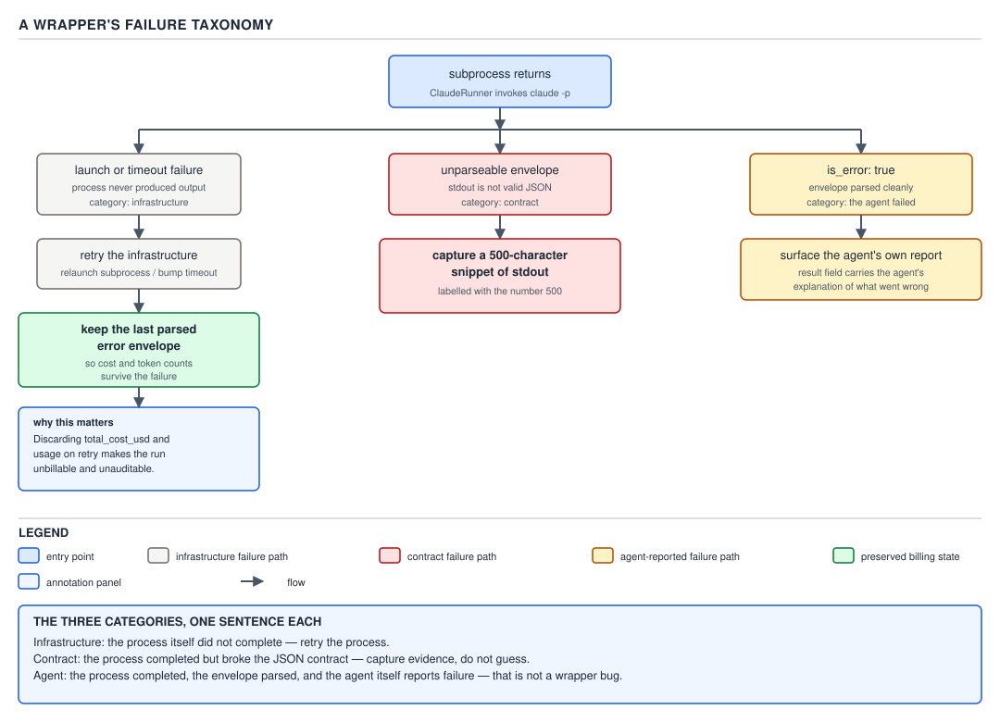

# 21 AI for Coding — a wrapper's failure taxonomy — ADVANCED (INTERNALS) (§3.6.10–3.6.14)

**Target version: Claude Code v2.1.2xx (August 2026).** | **Part 3 of 6** | [Index](../00-index.md)
Previous: [formats, sessions and background execution](03-internals-b-formats-and-execution.md) · Next: [resolution order: parameter, env, default](03-internals-d-resolution-order.md)

The previous file's `--no-session-persistence` pitfall was a live example of the problem this file
names properly: `--output-format json` was passed, the call still failed, and stdout was a bare line
of plain text, not an envelope. That was one instance of a general shape. A wrapper around `claude -p`
does not get one failure mode — it gets three, and they are not interchangeable. This file is that
taxonomy, read out of a real subprocess wrapper: **`harness/src/harness/engine/agent.py`**, under the
read-only root `/Users/rajat.chikkodikar/Desktop/My-files/Codes/_non-clinet-tech/sdlc-harness`. Two
earlier files already drew on this same module for different purposes — `personas/02-cases-persona-
loading.md` walked `load_agent_prompt()` and its `_FRONTMATTER` regex, and `cost-model/03-internals-b-
ceilings-and-reading-it-back.md` quoted `DEFAULT_TIMEOUT` and `DEFAULT_MAX_TURNS` with the 80-turn /
$5.16 incident behind the second. Neither of those passages is repeated here; this file's business is
`run_agent`'s failure handling and the four remaining module constants.

### 1. Three failure classes, not one (§3.6.10)

**Mental model.** A subprocess call has exactly one success path and, naively, one catch-all failure
path — `try` the call, `except Exception` the rest. `run_agent` refuses that shape. It distinguishes
three ways `claude -p` can fail to return a usable result, and treats each one differently, because
each one means something different about *what to do next*.

**Why it exists.** A wrapper that collapses these three into "the call failed, retry" makes a specific,
recurring mistake: it retries a call that cannot possibly succeed on retry. A malformed prompt that
produces an unparseable envelope will produce the same unparseable envelope every time — no amount of
re-running the same subprocess changes what the CLI prints. Naming the classes is what stops a wrapper
from being confidently wrong about which failures are worth a second attempt.

**How it works.** Reading `run_agent`'s loop top to bottom, in `agent.py`, verbatim:

```python
last: Optional[AgentResult] = None
for _ in range(max(1, retries)):
    try:
        proc = subprocess.run(
            cmd, cwd=cwd, env=env, capture_output=True, text=True, timeout=resolved_timeout
        )
    except (subprocess.TimeoutExpired, OSError) as exc:
        last = AgentResult(ok=False, is_error=True, result=f"[agent launch/timeout] {exc}")
        continue
    data = extract_json_envelope(proc.stdout)
    if data is None:
        snippet = (proc.stdout or proc.stderr or "").strip()[:500]
        detail = f": {snippet!r}" if snippet else " (empty stdout and stderr)"
        last = AgentResult(ok=False, is_error=True, result=f"[unparseable agent envelope]{detail}")
        continue
    res = parse_envelope(data)
    if not res.is_error:
        return res
    last = res  # keep the parsed error envelope (cost/tokens preserved)
    if res.subtype == "error_max_turns":
        return res
return last or AgentResult(ok=False, is_error=True, result="[no agent result]")
```

Three distinct branches, each reached by a different condition:

| Class | Trigger | What it means | How this loop treats it |
|---|---|---|---|
| Launch / timeout | `subprocess.run` itself raises `TimeoutExpired` or `OSError` | Infrastructure never produced a process the CLI could run to completion inside — a binary missing from `PATH`, a wall-clock cap hit, a `cwd` that does not exist | Synthesize a failure `AgentResult`, `continue` the loop — worth retrying, because the *next* attempt is a fresh process on (possibly) different infrastructure conditions |
| Unparseable envelope | `extract_json_envelope(proc.stdout)` returns `None` | The subprocess *ran and exited*, but nothing on stdout or stderr is a JSON object — a **contract** violation between what the wrapper expected and what the CLI actually printed | Synthesize a failure `AgentResult` carrying a snippet (§2), `continue` — but see the Pitfall below: this one is not usefully retryable |
| `is_error: true` | The envelope parses, and `parse_envelope` sets `is_error=True` from the `is_error` field | The **agent itself** ran, thought, and reported that it did not succeed at the task — a real, structured, self-reported failure | `parse_envelope`'s `AgentResult` is kept as `last`; the loop retries unless `subtype == "error_max_turns"`, which is treated as terminal |

`[CASE]` The third row's terminal carve-out is its own quoted comment in the source, worth reading in
full because it explains *why* one specific `is_error` shape is not retried like the others:

```python
if res.subtype == "error_max_turns":
    # Turn exhaustion is a TERMINAL signal for this call, never a
    # transient failure to retry inside run_agent's own inner loop —
    # the claude CLI's turn counter resets per invocation, so retrying
    # here would silently just buy 80 more turns under the same
    # "attempt", masking the exhaustion from the continuation
    # mechanism above (AP-12776 AC-5). The parsed envelope (cost,
    # session_id) is preserved on `res`, same as any other error exit.
    return res
```

This is the taxonomy's sharpest point: `is_error: true` is not one thing either. Most agent-reported
errors are worth a fresh attempt inside this same loop. `error_max_turns` specifically is not, because
retrying it *inside `run_agent`* would silently launch a brand-new `claude -p` process with its own
fresh turn counter — the CLI has no memory of the exhausted attempt — so a naive retry here would look
like progress while actually hiding the exhaustion from whatever higher-level continuation logic (a
different leg, with `resume_session_id` set, judged separately) is supposed to see it and decide
whether to grant more turns. The fix is not "retry less" — it is "retry at the right layer."



**D-81** — A wrapper's failure taxonomy. Three branches, three different handlings — and the last
parsed envelope is kept.

`[JAVA]` A Spring Boot engineer reads this loop most naturally as a `ProcessBuilder` plus
`Process.waitFor(Duration)`: the launch/timeout branch is what a `TimeoutException` from
`waitFor(Duration)` or an `IOException` from `ProcessBuilder.start()` would map onto — infrastructure
that never produced a completed process at all. The unparseable-envelope branch has no equally tidy
Java analogue in `java.lang.Process` itself; it is closer to a REST client that got a 200 with a body
that fails `ObjectMapper.readValue()` — the transport succeeded, the contract did not. Where the analogy
breaks: Java's checked-exception discipline tends to push a team toward one `catch` block per exception
*type*, which maps naturally onto class 1, but classes 2 and 3 here are not exceptions at all — they are
both *successful returns* (a `Process` that exited, a JSON object that parsed) that are inspected for
failure *after the fact*, which a Java port has to model as explicit result types rather than
`catch` clauses. `build-it/05-orchestrator-a-the-runner.md` builds that Java port; this file does not
pre-empt it.

**Insight:** the three classes correspond to three different layers a failure can happen at —
operating-system process management, output-format contract, and the agent's own task semantics — and
a wrapper that catches at only one layer (usually `Exception`, i.e. layer 1) is blind to the other two
until a downstream consumer chokes on `None` or silently treats a self-reported task failure as success.

> A wrapper's failure taxonomy is not "did the call fail" but "at which layer" — process launch,
> output-format contract, or agent-reported task outcome — because each layer means something different
> about whether retrying helps.

### 2. The 500-character snippet (§3.6.11)

**Mental model.** When `extract_json_envelope` returns `None`, the wrapper is holding a `proc` that
ran, that produced *some* bytes on stdout or stderr, and that bytes stream is — by definition of having
reached this branch — not a JSON object. The only useful evidence left is *what was actually printed*.

**Why it exists.** `[INCIDENT]` The comment beside the snippet extraction states the cost of not having
it, dated and named:

```python
if data is None:
    # Preserve a snippet of what the subprocess actually printed —
    # without this, a downstream `verdict_unparseable`-style escalation
    # has nothing to root-cause from except live re-runs (a zero-cost
    # envelope failure was only diagnosable by reproducing it
    # interactively — 2026-07-30 calibration finding).
    snippet = (proc.stdout or proc.stderr or "").strip()[:500]
    detail = f": {snippet!r}" if snippet else " (empty stdout and stderr)"
    last = AgentResult(ok=False, is_error=True, result=f"[unparseable agent envelope]{detail}")
    continue
```

**What broke:** before this snippet capture existed, an unparseable envelope produced an `AgentResult`
with no record of what the subprocess had printed. **What it cost:** every occurrence of that failure
was, per the comment, diagnosable only by reproducing it interactively — a human re-running the same
task by hand, hoping to hit the same failure a second time, because the first occurrence left no
artifact. **The fix:** capture up to `[NUM]` **500 characters** of `stdout`, falling back to `stderr` if
`stdout` is empty, and fold that snippet into the synthetic result's message. **The general law:** when
you parse a subprocess's output and the parse can fail, capture the unparseable input at the failure
site — not "log it if you remember to," but make the capture part of the failure path itself, so the
evidence exists exactly once, at the one place a human would otherwise have to reproduce the failure to
get it.

`[PROVE]` Why 500 and not "log everything" or "log nothing": the two easy alternatives both fail for a
different reason. Logging nothing reproduces the pre-fix state above — a human re-running a task by
hand to catch a failure that already happened once. Logging the entire `stdout` unbounded fails the
other direction: a genuinely runaway process (a hung interactive prompt writing megabytes of terminal
redraw, or a misconfigured `--verbose stream-json` firehose) turns one failed call into a multi-megabyte
result object that a caller now has to store, transmit, and render. 500 characters is enough to show a
human or a log aggregator the *shape* of the failure — a stack trace's first lines, an authentication
error message, a shell "command not found" — without the message itself becoming the next incident.
`[TRAP]` **Pitfall:** assuming a truncated 500-character snippet is always sufficient to root-cause a
failure. The symptom: an unparseable-envelope failure whose real cause only appears past character 500
(a long JSON-looking prefix that is actually valid up to a truncation point elsewhere in a huge tool-use
transcript) still leaves the wrapper's log under-informed. The fix: treat the snippet as a triage
signal — "roughly what kind of failure is this" — not a substitute for `--verbose` reproduction when the
snippet itself is inconclusive. **Why people believe it:** the snippet exists specifically to avoid
reproduction, so it is tempting to assume it always succeeds at that goal; it succeeds at the common
case, not the pathological one.

> `extract_json_envelope`'s `None` path captures a bounded snippet of the subprocess's actual output at
> the moment of failure, because a parse failure with no evidence attached converts every future
> occurrence into a live reproduction exercise.

### 3. Keeping the last parsed error envelope (§3.6.12)

**Mental model.** The retry loop's local variable is named `last`, not `last_failure_reason` or
`error_message` — it holds a full `AgentResult`, the same shape a successful call returns, even when the
call it came from failed.

**How it works.** Two of the three assignments to `last` are synthetic — `AgentResult(...)` built by
hand for the launch/timeout and unparseable-envelope classes, because in those two classes there is no
real envelope to keep. The third is different:

```python
res = parse_envelope(data)
if not res.is_error:
    return res
last = res  # keep the parsed error envelope (cost/tokens preserved)
```

When the envelope *did* parse but the agent reported `is_error: true`, `last` is set to the fully
parsed `AgentResult` — not a synthetic stand-in. `parse_envelope` (quoted in full in the previous run
through this file's sibling notes) populates `cost_usd`, `input_tokens`, `output_tokens`,
`cache_read_tokens` and `cache_creation_tokens` from the same `modelUsage` / `usage` fields a successful
envelope carries. A failed attempt that got as far as producing a parseable envelope still spent real
tokens against a real API call, and the envelope is the only record of exactly how many.

**Why it exists.** `[CASE]` If the loop discarded a failed attempt's envelope and only kept, say, a
boolean "this attempt failed," the retry loop's eventual return value — on final exhaustion, `return
last or AgentResult(...)` — would report the failure with no cost or token figures attached. Two
consumers depend on those figures surviving a failed attempt: a billing rollup that sums `cost_usd`
across every attempt of every story (a wrapper that zeroes out a failed attempt's cost is under-billing
against real API spend that already happened), and an audit trail that needs `session_id` and
`num_turns` to answer "what did this failed attempt actually do" after the fact. Discarding the
envelope on failure does not undo the API call that produced it — the money was spent either way — it
only makes the spend and the turns invisible to whoever has to reconcile them later.

**Gotcha.** `[TRAP]` **Pitfall:** believing that only a *successful* call needs its envelope preserved,
on the reasoning that a failed attempt "didn't produce anything worth keeping." The symptom: a modified
version of this loop that does `last = AgentResult(ok=False, is_error=True)` on the `is_error` branch
instead of `last = res` silently loses every cost and token figure the failed attempt actually
generated, and a later cost report for that story undercounts real spend by exactly that amount with no
error raised anywhere — the loss is silent because nothing downstream expects to be told about it. The
fix: on any branch where a real envelope was parsed, keep the real envelope, error or not; only the
launch/timeout and unparseable-envelope branches (§1, rows 1–2) have no real envelope to keep, and they
alone construct a synthetic one. **Why people believe it:** "the call failed" reads as "there is nothing
of value here," when what actually happened is "the call failed *and* an API request was still billed
for it."

> The retry loop keeps the last **parsed** error envelope, not a bare failure flag, because a failed
> attempt that produced a real envelope still spent real tokens — discarding that envelope does not
> undo the spend, it only makes the spend unbillable and unauditable.

### 4. Resolution order: parameter, then environment variable, then default (§3.6.13)

**Mental model.** Every tunable in `run_agent` — timeout, max turns, permission mode, setting sources —
answers the same question the same way: *did the caller of this specific invocation ask for something
explicit? If not, is there an environment-level override for this whole process? If neither, fall back
to a hardcoded default.* That three-step lookup is not implemented once and shared — it is repeated,
by hand, at each parameter, and the repetition is deliberate rather than an oversight this guide is
pointing out as a flaw.

**Why it exists.** `[CASE]` `[JAVA]` A caller three layers up (a `conductor run-pipeline` run) needs to
raise one story's turn cap without a code change, per the `DEFAULT_MAX_TURNS` docstring already quoted
in `cost-model/03-internals-b-ceilings-and-reading-it-back.md`: "this override exists so an operator can
raise the cap for a story that legitimately needs more turns via `HARNESS_AGENT_MAX_TURNS=<n>` in the
environment `conductor run-pipeline` runs under, with zero code change per run." A single hardcoded
constant cannot serve both "the sane default for almost every call" and "an operator's one-off
emergency override" at once — the three-tier lookup is what lets both exist without touching source.

**How it works.** The pattern repeats at four call sites in `run_agent`, quoted here for the two this
file has not already shown elsewhere:

```python
resolved_max_turns = (
    max_turns if max_turns is not None
    else int(os.environ.get("HARNESS_AGENT_MAX_TURNS", DEFAULT_MAX_TURNS))
)
```
```python
cmd += [
    "--permission-mode",
    permission_mode or os.environ.get("HARNESS_PERMISSION_MODE") or DEFAULT_PERMISSION_MODE,
]
cmd += [
    "--setting-sources",
    setting_sources or os.environ.get("HARNESS_SETTING_SOURCES") or DEFAULT_SETTING_SOURCES,
]
```

`[CASE]` The `max_turns` line uses `is not None`, not truthiness (`or`), and the docstring says exactly
why: "checked via `is not None` rather than truthiness so an explicit `max_turns=0` is not silently
treated as omitted." `permission_mode` and `setting_sources` use plain `or` instead, because both are
strings where the empty string is never a meaningful explicit value someone would pass — there is no
"explicit but falsy" permission mode the way there is an explicit but falsy `0` turn count. The
resolution order is the same three tiers in every case; the *operator* (`is not None` vs. `or`) is
chosen per parameter, based on whether that parameter's own falsy value (`0`, `""`) is a legitimate
explicit choice or just noise.

`[JAVA]` The direct Java analogue is a chain of `Optional`:

```java
int resolvedMaxTurns = Optional.ofNullable(maxTurns)
    .orElseGet(() -> Integer.parseInt(
        System.getenv().getOrDefault("HARNESS_AGENT_MAX_TURNS", String.valueOf(DEFAULT_MAX_TURNS))));
```

Where it breaks: `Optional.ofNullable(maxTurns)` on a boxed `Integer` correctly treats an explicit `0`
as present, mirroring Python's `is not None` — but the moment a team "simplifies" the primitive
parameter to an `int` with a sentinel like `-1` for "omitted," the `is not None` / `Optional.ofNullable`
correctness this pattern is built on is gone, and `0` becomes ambiguous again for exactly the reason the
Python comment calls out. The pattern is only as sound as the caller's own decision to use a boxed type
or an `Optional` all the way through, not a primitive with a magic sentinel.

**Gotcha.** `[TRAP]` **Pitfall:** assuming an environment variable set in the *calling* shell always
reaches `run_agent`. The symptom: an operator exports `HARNESS_AGENT_MAX_TURNS` in their own terminal,
runs a pipeline that spawns `run_agent` in a subprocess with an explicit `env=` dict passed through
(the `env` parameter on `subprocess.run`), and the override is silently absent — because `env=None` (the
default) inherits the current process's environment, but a caller that constructs its own `env` dict for
the child process and does not copy `HARNESS_AGENT_MAX_TURNS` into it has, without meaning to, blocked
the override at the subprocess boundary rather than at `os.environ.get` inside `run_agent` itself. The
fix: when the caller of `run_agent` builds a custom `env`, it must deliberately forward every
`HARNESS_*` variable it wants honored — `os.environ.get` inside `run_agent` reads the *current* Python
process's environment, not the child's, so the resolution order described here happens entirely before
the `subprocess.run` call, using `run_agent`'s own environment, which may or may not match what the
child process receives. **Why people believe it:** the three-tier resolution reads as "the environment
variable always works," when it specifically means "the environment variable of the process running
`run_agent`," a distinct thing from the environment of the `claude` subprocess it launches.

The next file, `03-internals-d-resolution-order.md`, takes this same three-tier shape further — every
knob in the harness, not only these four — and is where the full comparison across every resolved
parameter belongs; this file's job was establishing the pattern from real code, not exhausting it.

> Parameter, then environment variable, then hardcoded default — checked with `is not None` where the
> falsy value is a legitimate explicit choice, plain truthiness where it is not — is the shape every
> tunable in `run_agent` resolves through, so a caller can override per-invocation, an operator can
> override per-environment, and neither has to touch source to do it.

### 5. The four module defaults, each with its reason (§3.6.14)

`[CASE]` `[NUM]` `agent.py` declares four defaults at module scope. Two — `DEFAULT_TIMEOUT` and
`DEFAULT_MAX_TURNS` — were already quoted with their full reasoning (the 80-turn / $5.16 incident,
AP-12200) in `cost-model/03-internals-b-ceilings-and-reading-it-back.md`; they are named again here only
so the table is complete, not re-quoted. The other two have not appeared in this guide before:

```python
DEFAULT_PERMISSION_MODE = "acceptEdits"
DEFAULT_SETTING_SOURCES = "user,project"
DEFAULT_TIMEOUT = 1800
DEFAULT_MAX_TURNS = 160
```

| Constant | Value | Reason |
|---|---|---|
| `DEFAULT_PERMISSION_MODE` | `"acceptEdits"` | The floor an unattended agent runs under when no caller overrides it: reads, edits, `mkdir`/`touch`/`mv`/`cp`/`sed` proceed without a prompt (there is no human to prompt), but the docstring for `settings` is explicit that this floor alone does **not** grant `mvn`, `git commit`, `chmod`, or `java` — those need the harness's own `permissions.allow` rules, which is exactly why `settings` (below) matters as much as the mode itself |
| `DEFAULT_SETTING_SOURCES` | `"user,project"` | Restores file-based configuration to an otherwise-isolated `-p` invocation — without it, a headless call would run with none of the harness's own settings loaded at all, since a `-p` call does not implicitly inherit the interactive session's configuration |
| `DEFAULT_TIMEOUT` | `1800` (30 minutes) | The wall-clock backstop, in seconds — covered in full in `cost-model/03-internals-b-ceilings-and-reading-it-back.md`, not repeated here |
| `DEFAULT_MAX_TURNS` | `160` | The turn-count backstop — its full history, including the AP-12200 incident that raised it from 80, is in the same cost-model file |

`[CASE]` `DEFAULT_SETTING_SOURCES`'s reason is spelled out directly in `run_agent`'s own docstring,
worth quoting because it names a second failure mode the resolution order in §4 exists to prevent, not
merely a convenience:

```
`settings` (when given) is a path to a settings JSON file loaded via
`--settings`, evaluated independently of `cwd`. Without it, `--setting-sources
project` resolves against `cwd` — which for the coder/reviewer is the
isolated per-story worktree (engine/cli.py), not the harness repo — so the
harness's own `permissions.allow`/`deny` rules (Bash(*) plus the destructive-
command deny-list) never load and the agent is left with bare `acceptEdits`
defaults (reads/edits/mkdir/touch/mv/cp/sed only — not `mvn`, `git commit`,
`chmod`, `java`). See docs/adr/0016 and the AP-11470 incident.
```

`[INCIDENT]` AP-11470 is the concrete case behind that paragraph: a `project`-scoped setting source
resolves against the agent's own `cwd`, and for a coder or reviewer agent that `cwd` is an isolated
per-story worktree — not the harness repository whose `permissions.allow`/`deny` rules the operator
actually intended to load. The fix in the same codebase is the `settings` parameter (`--settings
<path>`), which loads a settings file by an explicit path independent of `cwd`, so a wrapper that wants
its own permission rules honored inside a subagent's isolated worktree passes `settings` rather than
relying on `--setting-sources project` to find them on its own. The general law is the same one §4
draws out for defaults broadly: a default that resolves relative to something the caller does not
fully control (here, `cwd`) is a default that can silently resolve to nothing.

**Gotcha:** none beyond the AP-11470 case above — the two defaults not already covered elsewhere carry
no additional surprising edge of their own.

## Pitfalls

- **Belief in action:** a subprocess wrapper can catch `Exception` once and retry every failure the
  same way. **Surprising outcome:** an unparseable-envelope failure retries identically forever, because
  the same malformed output is produced by the same conditions every time — the retry never changes the
  outcome. **What actually gets the guarantee:** naming the three classes (launch/timeout, contract,
  agent-reported) and handling `error_max_turns` as terminal rather than retryable inside the same loop.
  **Why people believe it:** a single `try`/`except` around a subprocess call reads as sufficient error
  handling until the failure modes are enumerated individually.
- **Belief in action:** only a successful `claude -p` call needs its cost and token figures preserved.
  **Surprising outcome:** a modified loop that discards the envelope on `is_error: true` silently
  undercounts real API spend, because the failed call still billed real tokens the discarded envelope
  was the only record of. **What actually gets the guarantee:** `last = res` on the parsed-but-failed
  branch, keeping the same `AgentResult` shape a success would return. **Why people believe it:** "the
  call failed" reads as "nothing of value happened," when a request was still sent and billed.
- **Belief in action:** an `os.environ.get("HARNESS_AGENT_MAX_TURNS", …)` override always reaches a
  `subprocess.run` child. **Surprising outcome:** a caller that constructs its own `env=` dict for the
  child process, without copying the variable into it, silently loses the override at the subprocess
  boundary. **What actually gets the guarantee:** the resolution happens in `run_agent`'s own process
  environment before the subprocess is launched — any custom `env` passed to `subprocess.run` must
  forward the `HARNESS_*` variables deliberately. **Why people believe it:** the three-tier resolution
  reads as a property of the override string itself, not of which process's environment is being read.

## Cheat sheet

| Question | Answer |
|---|---|
| Three failure classes | launch/timeout (infra), unparseable envelope (contract), `is_error: true` (agent) |
| Which class is retried unconditionally | launch/timeout, unparseable envelope |
| Which `is_error` subtype is terminal, never retried | `error_max_turns` — the CLI's turn counter resets per invocation, so retrying masks exhaustion |
| Snippet size on unparseable envelope | 500 characters, `stdout` then `stderr` fallback |
| Why keep a failed attempt's parsed envelope | Real tokens were spent producing it; discarding it makes the spend unbillable and unauditable |
| Resolution order for every knob | explicit parameter → environment variable → hardcoded default |
| Operator for `max_turns` | `is not None` — an explicit `0` must not be treated as omitted |
| Operator for `permission_mode` / `setting_sources` | `or` — the empty string is never a meaningful explicit value |
| `DEFAULT_PERMISSION_MODE` | `"acceptEdits"` — the unattended floor; does not by itself grant `mvn`/`git commit`/`chmod`/`java` |
| `DEFAULT_SETTING_SOURCES` | `"user,project"` — restores file-based config to an otherwise-isolated `-p` call |
| `DEFAULT_TIMEOUT` / `DEFAULT_MAX_TURNS` | `1800` / `160` — full incident history in `cost-model/03-internals-b-ceilings-and-reading-it-back.md` |
| AP-11470 | `--setting-sources project` resolves against `cwd`, which for a subagent worktree is not the harness repo — use `--settings <path>` instead |

## Self-test

1. Why does `run_agent` retry a launch/timeout failure but treat `error_max_turns` as terminal, when
   both are, superficially, "the call didn't succeed"?
<details><summary>Answer</summary>A launch/timeout failure means the *next* subprocess attempt runs under conditions that may differ (a transient resource issue, a timeout that a shorter task might not hit again), so retrying can plausibly change the outcome. `error_max_turns` means the CLI exhausted its turn budget — and because that counter resets per invocation, retrying inside the same loop would just launch a fresh process with a fresh 80/160-turn allowance under the same nominal "attempt," silently hiding the exhaustion from the higher-level continuation logic that is supposed to see it and decide whether to grant more turns via a separate `resume_session_id` leg.</details>

2. What does `extract_json_envelope` capture when it returns `None`, and why 500 characters specifically
   rather than "everything" or "nothing"?
<details><summary>Answer</summary>It captures up to 500 characters of `proc.stdout`, falling back to `proc.stderr` if stdout is empty. "Nothing" reproduces the pre-fix state named in the 2026-07-30 calibration finding — every occurrence diagnosable only by live reproduction. "Everything" risks a runaway process turning one failed call's result object into a multi-megabyte payload the caller now has to store and transmit. 500 characters is enough to show the shape of a failure without becoming the next incident.</details>

3. A failed `is_error: true` attempt is about to be discarded by a wrapper that keeps only a boolean
   "did this attempt fail." What is lost, and why does it matter even though the attempt failed?
<details><summary>Answer</summary>The parsed envelope's `cost_usd`, `input_tokens`, `output_tokens`, and the cache token counts are lost. It matters because the API call that produced the failed envelope was still billed — the attempt failing does not refund the tokens spent producing it. Discarding the envelope makes that spend invisible to a billing rollup and unreconstructable for an audit trail, even though the money was spent regardless of the outcome.</details>

4. Why does the `max_turns` resolution use `is not None` while `permission_mode` and `setting_sources`
   use plain truthiness (`or`)?
<details><summary>Answer</summary>Because `0` is a legitimate explicit value for `max_turns` that truthiness would treat as "omitted," silently falling through to the environment variable or default instead of honoring an explicit zero. `permission_mode` and `setting_sources` are strings where the empty string is never a meaningful explicit choice someone would deliberately pass, so plain `or` is safe there without the same ambiguity.</details>

5. An operator exports `HARNESS_AGENT_MAX_TURNS=300` in their shell, but a pipeline that calls
   `run_agent` still runs with 160 turns. What is the most likely cause, given how the resolution order
   actually works?
<details><summary>Answer</summary>The caller of `run_agent` is passing its own `env=` dict to `subprocess.run` and did not forward `HARNESS_AGENT_MAX_TURNS` into it. The three-tier resolution (`os.environ.get(...)`) reads the environment of the *process running `run_agent`*, not automatically the environment of the `claude` child process — but the resolution itself happens before the subprocess launches, using `run_agent`'s own environment, so this specific symptom points instead at a `settings`/`permission`-style boundary elsewhere, most concretely: if a custom `env` is built for the subprocess without copying `HARNESS_AGENT_MAX_TURNS`, the *subprocess's own* view of that variable would be affected, not the resolution inside `run_agent` itself, which already ran by then. The practical fix an operator applies is the same either way: confirm the variable is present in whichever process's environment the relevant `os.environ.get` call actually reads, not assume export in a parent shell is sufficient.</details>

6. What did AP-11470 reveal about `--setting-sources project`, and what is the fix?
<details><summary>Answer</summary>`--setting-sources project` resolves relative to the agent's `cwd`, which for a coder or reviewer subagent is an isolated per-story worktree, not the harness repository. As a result, the harness's own `permissions.allow`/`deny` rules never loaded, leaving the agent on bare `acceptEdits` defaults that cannot run `mvn`, `git commit`, `chmod`, or `java`. The fix is the `settings` parameter (`--settings <path>`), which loads a settings file by an explicit path independent of `cwd`.</details>

## Open questions

None.

---

**Leaves covered:** 3.6.10–3.6.14 (5 leaves)
**Leaves deferred:** none
**Diagrams included:** D-81
**Target version:** Claude Code v2.1.2xx (August 2026)
**Lines:** 430
