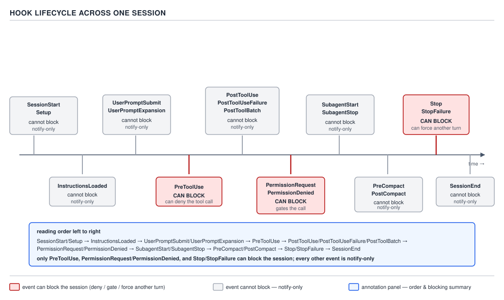

# 21 AI for Coding — what a hook is — INTERMEDIATE (§2.3.1–2.3.5)

**Target version: Claude Code v2.1.2xx (August 2026).** | **Part 2 of 6** | [Index](../00-index.md)
Previous: [how a real engine loads a persona](../personas/02-cases-persona-loading.md) · Next: [the event catalogue](02-the-event-catalogue.md)

Two earlier files promised this one. §1.3.2 said `CLAUDE.md` is context the model *reads and tries* to
follow. The §1.5.26 decision table put a skill's frontmatter in the same bucket — a strong nudge, not
an enforced rule. Both of those files pointed here for the mechanism that is different in kind, not
just in strength: **a hook**. This file cashes that promise.

A hook is code the **harness** — the Claude Code binary itself, not the model — runs at a fixed point
in a session's lifecycle, whether or not the model would have chosen to run it. The model is not
consulted about whether the hook fires. This is the same fact seen from the other side as the
emit-versus-execute split from §0.3.3: the model only ever *emits* a `tool_use` block and the harness
decides whether to run the underlying tool. A hook sits on that same harness side of the boundary, but
instead of deciding about one tool call the model proposed, it runs unconditionally on an event the
harness itself observed — a tool about to run, a session starting, a prompt about to be submitted, a
model response about to be shown. Nothing the model says in its own output changes whether the hook
executes.

## §2.3.1 [ZERO] [DOC] A hook is a guarantee; `CLAUDE.md` and a skill are context

**Mental model.** Picture two ways to get a formatter to run after every edit. The first: write "always
run the formatter after editing a file" into `CLAUDE.md`. The model reads that sentence at the start of
most turns, and most of the time it complies — it calls `Bash(prettier --write ...)` after an `Edit`
because the instruction is fresh in its context and it is a cooperative reader. The second: register a
`PostToolUse` hook on the matcher `Edit|Write` that runs `prettier --write` on the touched file. The
harness runs that hook after *every* matching tool call, in every session, regardless of whether the
model's own reasoning that turn happened to mention formatting at all. The first approach is a
request the model is free to forget, deprioritize under a long context, or simply not think of again
after fifty turns of unrelated work. The second is not a request; it is code the harness executes on
an event, and the model has no vote.

**Why it exists.** Instructions in `CLAUDE.md` and a skill's body are tokens in the context window —
they compete with everything else for the model's attention, and a sufficiently long or busy session
can bury them. There is no mechanism by which prose in the context window can force an action; the
model always retains the option to do something else, whether by oversight, by a bad sampling draw
(recall from §0.1: the same input does not reliably give the same output), or because it judged the
instruction inapplicable this one time. For anything where "usually" is not good enough — enforcing a
formatter, blocking a destructive command, injecting a real timestamp the model cannot fabricate,
recording an audit log entry — the codebase needs a mechanism that does not route through the model's
judgment at all. A hook is that mechanism.

**When to reach for it, and when not.** Reach for a hook when the requirement is "this must happen
every time," full stop — a `PreToolUse` guard on `Bash(rm -rf *)`, a `PostToolUse` formatter, a
`SessionStart` script that stamps the current branch into context. Do not reach for a hook for
"the model should generally know about X" — that is exactly what `CLAUDE.md` and a skill are for, and
building a hook to enforce something that is really just background knowledge adds a script, a
`matcher`, and a maintenance burden for no gain over a paragraph of prose. The two are not competing
mechanisms; they answer different questions. `CLAUDE.md` and skills answer "what should the model
know or default to." A hook answers "what must be true no matter what the model decides."

**How it works.** Hooks are configured once, in a `hooks` block inside a settings file (`settings.json`
at any of the precedence layers from §1.2, or a plugin's own `hooks/hooks.json`), keyed by lifecycle
**event** name — `PreToolUse`, `PostToolUse`, `SessionStart`, and roughly thirty others, catalogued in
full in the next file. Each event fires at one fixed point the harness itself controls: before a tool
runs, after a tool runs, when a session starts, when a prompt is about to be sent, and at thirty-odd other points enumerated in the next file. The
harness walks the configuration for that event, finds every entry whose `matcher` applies to the
current occurrence (§2.3.2 below), and runs every listed handler for each matching entry — synchronously
by default, so a blocking hook can, depending on the event, stop the action it fired on before it
happens. That blocking behavior — which events can actually stop something, and how a handler signals
"stop this" — is the exit-code and JSON-output contract covered in full at §2.3.10–2.3.14, two files
from here; this file's job is only to establish that hooks sit at fixed points with fixed ordering.



**D-49** — The hook lifecycle across one session. Each mark says whether that event can block.

The diagram lays one session out on a time axis and marks every point a hook can attach, from the
session's own start to its end, with a label at each mark stating whether that event's handlers can
block the action they observed or can only observe it after the fact. The next file, §2.3.6–§2.3.9,
enumerates every one of those roughly thirty-two events by name and gives the full which-can-block
table; this file uses the picture only to make one point concrete before the configuration syntax
arrives: a hook is not a vague "runs sometime" mechanism, it is pinned to a specific, named,
ordered position in the session, the same way a `PreToolUse` fires before its tool and nowhere else.

**Code.** The minimal configuration that makes the promise in this leaf's title concrete — a hook that
runs a formatter after every `Write` or `Edit`, unconditionally:

```json
{
  "hooks": {
    "PostToolUse": [
      {
        "matcher": "Write|Edit",
        "hooks": [
          {
            "type": "command",
            "command": "${CLAUDE_PROJECT_DIR}/.claude/hooks/format-on-edit.sh"
          }
        ]
      }
    ]
  }
}
```

```bash
#!/usr/bin/env bash
set -e

INPUT_JSON="$(cat)"
FILE_PATH="$(echo "$INPUT_JSON" | jq -r '.tool_input.file_path // empty')"

if [ -z "$FILE_PATH" ]; then
  exit 0
fi

case "$FILE_PATH" in
  *.java) mvn -q -f "$(dirname "$FILE_PATH")" com.coveo:fmt-maven-plugin:format 2>/dev/null || true ;;
  *.ts|*.tsx|*.js) npx --yes prettier --write "$FILE_PATH" ;;
  *) exit 0 ;;
esac

exit 0
```

`format-on-edit.sh` runs after **every** matching edit, in every session anyone opens against this
project settings file, with no dependence on the model having said anything about formatting that
turn. `${CLAUDE_PROJECT_DIR}` is a harness-supplied environment variable pointing at the project root,
so the hook resolves correctly regardless of the working directory a given session happens to launch
from. The script reads the event's JSON payload from stdin with `jq`, extracts the path the tool just
touched, and formats it by extension — a Java file through the Maven formatter plugin, a TypeScript or
JavaScript file through Prettier. It exits `0` unconditionally at the end: this hook is advisory
tooling, not a gate, so its failure posture is "never block the edit that already happened," which is
why the Java branch also swallows the formatter's own exit status with `|| true`. Full exit-code
semantics — what a nonzero exit does on this event, and what JSON on stdout can additionally signal —
are the next file but one, §2.3.10–2.3.14; this script deliberately stays inside the part of the
contract already settled: exit 0, plain stdout, nothing else.

**Gotcha.** The word "guarantee" describes *whether the hook runs*, not *what the hook accomplishes*.
A `command` or `http` hook runs deterministically, every time its event and matcher fire — that part is
never in doubt. But two of the five handler types this area introduces next, `prompt` and `agent`
(§2.3.3), hand the actual decision back to a model for that one evaluation. The harness's promise to
*invoke* the hook is still absolute; the *verdict* that hook produces is not, because a model producing
that verdict is subject to the same sampling variance as any other model call. A team that reaches for
a `prompt` hook to "guarantee" a security check has built something stronger than a `CLAUDE.md`
instruction — the check is guaranteed to run — but not something as strong as a `command` hook running
a fixed, deterministic script. That distinction is exactly why §2.3.3 calls out `prompt` and `agent` as
the two handler types that put a model back in the enforcement path.

**Insight:** the enforcement asymmetry is total, not partial, for the deterministic handler types. An
instruction that says "always run the formatter" is followed most of the time a busy model happens to
notice it is relevant; a `PostToolUse` hook on `Edit|Write` runs every time, and a model that would
rather skip it has no mechanism by which to skip it — the hook is not a message the model reads, it is
a subprocess the harness spawns.

**Interview:** "What's the difference between putting a rule in `CLAUDE.md` and putting it in a hook?"
— `CLAUDE.md` is context: the model reads it and usually complies, but nothing forces compliance, and a
long session can bury the instruction under later turns. A hook is code the harness runs on a
lifecycle event independent of the model's own reasoning that turn, so it is the only mechanism in the
whole configuration surface that gives an actual guarantee rather than a request.

> A hook is a command, HTTP call, MCP tool call, prompt, or subagent that the harness executes
> automatically at a fixed lifecycle event — never something the model decides to run — which makes it
> the one mechanism in Claude Code's configuration surface that enforces rather than merely requests.

## §2.3.2 [DOC] The configuration schema: event, matcher group, handler list

**Mental model.** A `hooks` block is a three-level nest: an **event name** at the top (`PreToolUse`,
`PostToolUse`, ...), an array of **matcher groups** under that event, and inside each group a `matcher`
string plus an array of **handler objects** that all run when that group's matcher applies to the
current occurrence. Reading a `hooks.json` top to bottom is reading "on this event, for occurrences
that look like this, run these things" — repeated as many times as there are distinct event/matcher
pairs to configure.

**Why it exists.** A single flat list of handlers per event would force every hook author to
re-implement filtering by tool name, agent name, or session-start reason inside their own script. The
`matcher` field pulls that filtering into the configuration layer itself, so a hook author writes a
script that assumes it only ever runs for the cases it cares about, and the harness is the one that
decided which occurrences those were.

**How it works — the full field list.** The complete shape, at the object level:

```json
{
  "hooks": {
    "PreToolUse": [
      {
        "matcher": "Bash",
        "hooks": [
          {
            "type": "command",
            "if": "Bash(rm *)",
            "command": "${CLAUDE_PROJECT_DIR}/.claude/hooks/block-destructive-bash.sh",
            "timeout": 30
          }
        ]
      }
    ]
  }
}
```

- **`matcher`** (optional, string) — filters which occurrences of the event this group applies to.
  Omitted entirely, it means "match everything" for that event. Its evaluation rules are their own
  primary concept below, because getting this field wrong is the single most common way a hook is
  configured and silently never fires.
- **`hooks`** (required, array) — the handler objects that run, in array order, for every occurrence
  the matcher accepts. §2.3.3–§2.3.5 cover the five handler shapes this array can hold.
- **`if`** (optional, string, only on tool-related events) — a permission-rule expression, in the same
  syntax as a `permissions.allow`/`deny` entry (`"Bash(git *)"`, `"Edit(*.ts)"`), that further narrows
  a `command`, `http`, `mcp_tool`, or `prompt`/`agent` handler to only the tool calls it actually
  matches — a second, finer-grained filter layered on top of `matcher`. In the example above, the
  group's `matcher: "Bash"` selects every Bash invocation, and the handler's own `if: "Bash(rm *)"`
  then narrows that further to only the ones that look like an `rm` command, so the script itself never
  has to parse the command line to decide whether it is in scope.
- **`timeout`** (optional, number, seconds) — how long the harness waits for this handler before giving
  up. **[NUM] [VERSION]** the documented default in v2.1.2xx is 600 seconds for `command`, `http`, and
  `mcp_tool` handlers; 30 seconds for `prompt`; 60 seconds for `agent`. The harness lowers the
  `command`/`http`/`mcp_tool` default to 30 seconds specifically on `UserPromptSubmit`,
  `PreModelSwitch`, and `PostModelSwitch`, and to 10 seconds on `MessageDisplay` — events on the
  interactive, latency-sensitive path get a tighter budget than a background event does.
- **`statusMessage`** (optional, string) — text shown in the spinner while this handler is running, so
  a slow hook does not look like the whole session has hung.
- **`once`** (optional, boolean) — documented specifically for skill-frontmatter-declared hooks: if
  `true`, the hook is removed after its first successful run rather than firing on every subsequent
  matching occurrence for the rest of the session.

**Matcher semantics, in detail.** The `matcher` string is evaluated by what characters it contains,
not by a separate `type` flag declaring "this one is a regex":

| Matcher value | Evaluated as | Example | Fires on |
|---|---|---|---|
| Omitted, `"*"`, or `""` | Match everything | *(no matcher key at all)* | every occurrence of the event |
| Only letters, digits, `_`, `-`, spaces, `,`, `\|` | Exact literal, or a list separated by `\|`/`,` | `"Write\|Edit"` | a tool named exactly `Write` or exactly `Edit` — nothing else |
| Contains any other character | Unanchored JavaScript regex | `"^Notebook"` | any tool name starting with `Notebook`, because an **unanchored** regex also matches `git.*` against both `git` and `notgit` unless the author wraps it `^git$` |

What the matcher matches *against* depends on the event, because not every event carries a tool name:
`PreToolUse`/`PostToolUse`/`PostToolUseFailure`/`PermissionRequest`/`PermissionDenied` match against
the tool name (`Bash`, `Edit|Write`, `mcp__.*`); `SessionStart` matches against the session's start
reason (`startup`, `resume`, `clear`, `compact`, `fork`); `SubagentStart`/`SubagentStop` match against
the agent type name; `PreModelSwitch`/`PostModelSwitch` match against the model's canonical name
(`claude-opus-5`, or a regex like `.*opus.*`); `Notification` matches against the notification type
(`permission_prompt`, `auth_success`, `elicitation_dialog`); `ConfigChange` matches against the
settings source that changed (`user_settings`, `project_settings`, `policy_settings`). An MCP tool's
name always has the shape `mcp__<server>__<tool>`, so `mcp__memory__.*` matches every tool from one
server and `mcp__.*__write.*` matches any write-shaped tool from any server.

**Gotcha.** A matcher that silently never fires is the most common hook defect in practice, and it has
three distinct causes that all look identical from the outside — nothing runs, and no error appears
anywhere. First: a typo in a literal matcher, `"Wrtie"` instead of `"Write"`, which is syntactically a
valid literal-list matcher and simply never equals the real tool name. Second: an unquoted assumption
that a bare word like `"git"` behaves as a whole-tool-name filter when the event's actual match target
is not a tool name at all — a `SessionStart` matcher of `"Bash"` matches nothing, because that event
matches against the start reason, not a tool. Third — the regex trap — a matcher containing a character
outside the literal set (a `.`, a `^`, a `*` used regex-style) is unanchored by default, so
`"git.*"` intended to mean "the git tool and nothing else" also matches a hypothetical tool named
`notgit-helper`, and conversely a matcher meant to be broad but written with a stray anchor,
`"^git$"` against an actual tool name of `Bash(git *)` rather than a bare `git`, matches nothing because
the match target was never the literal string the author assumed. None of these three raise a
configuration error; the hook configuration parses cleanly and the handler is simply never invoked.

**Interview:** "You configured a `PostToolUse` hook with `matcher: "Write|Edit"` and it never fires on
`Write` calls. What's the first thing you check?" — that the matcher is being evaluated against what
you think it is: confirm the event actually carries a tool name (`SessionStart` and `ConfigChange` do
not), confirm the literal spelling is exact and case-sensitive, and confirm the matcher does not
contain a stray regex metacharacter that changed its meaning from "exact tool name" to "unanchored
substring pattern."

> `matcher` filters an event's occurrences before any handler runs — a literal string or `\|`/`,`-list
> if it contains only word characters and separators, an unanchored regex otherwise, and "everything"
> if omitted — evaluated against whatever the target event actually carries, which is not always a
> tool name.

## §2.3.3 [DOC] [VERSION] Five handler types, two of which put a model back in the loop

Every entry in a matcher group's `hooks` array is one of five shapes, distinguished by its `type`
field:

| `type` | What it invokes | Deterministic? | Typical use |
|---|---|---|---|
| `command` | a shell command/script | yes | formatting, blocking a dangerous command, injecting context |
| `http` | a POST request to a URL | yes (the call is unconditional; see the sibling comparison below for what the *response* can carry) | a shared policy service, a central audit log |
| `mcp_tool` | a tool on an already-connected MCP server | yes | reusing an MCP server's own logic — for example a security-scan tool — as a hook |
| `prompt` | a single-turn evaluation by a Claude model | no — model judgment | fast, cheap semantic checks ("does this diff touch a secret-looking string") too fuzzy for a regex |
| `agent` | a full subagent, with tools, that can investigate before returning a verdict | no — model judgment, and **[VERSION] experimental** in the current documentation | checks that need to *look* at something — run a linter, read a file — before deciding |

`command`, `http`, and `mcp_tool` are the three that fire and act with no model in the decision path —
they are scripts, network calls, and pre-registered tool logic respectively. `prompt` and `agent` are
the two the previous leaf's gotcha named: the harness's invocation of them is exactly as guaranteed as
any other hook, but the *content* of the verdict they return comes from a model, which reintroduces the
sampling variance a hook otherwise exists to remove. Choosing `prompt` or `agent` is choosing "guarantee
that a model looks at this," not "guarantee a fixed outcome" — a real trade when the check itself is
genuinely fuzzy (does this comment read as hostile) rather than mechanical (does this file match
`*.env`).

`mcp_tool` (supporting fact). **Mechanism:** the handler names an already-configured MCP server and one
of its tools — `{"type": "mcp_tool", "server": "sonar-mcp", "tool": "security_scan", "input":
{"file_path": "${tool_input.file_path}"}}` — and the harness calls that tool the same way it would if
the model had invoked it, substituting `${tool_input.file_path}` and similar placeholders from the
triggering event's own JSON payload before the call. **Gotcha:** the server named must already be
connected for this session; a hook naming a server that failed to start fails the same way any other
call to a disconnected MCP server would. **Definition:** an `mcp_tool` hook reuses a running MCP
server's own tool as deterministic hook logic instead of shipping equivalent logic as a separate
shell script.

`prompt` (supporting fact). **Mechanism:** `{"type": "prompt", "prompt": "Does this diff at
$ARGUMENTS touch a hardcoded credential? Answer yes or no."}` sends that text, with `$ARGUMENTS`
substituted for the event's JSON input, to a model for one single-turn evaluation — no tools, no
follow-up turns, just an answer. `[NUM]` its default timeout is 30 seconds, shorter than a `command`
hook's 600, because it is meant to be a fast, narrow semantic check rather than an investigation.
**Gotcha:** it cannot look at anything beyond what `$ARGUMENTS` already contains — it cannot run `grep`,
open a file, or check a second source, because it has no tools. **Definition:** a `prompt` hook is a
single, tool-less model call used as a fast semantic filter where a regex would be too brittle.

`agent` (supporting fact). **Mechanism:** `{"type": "agent", "prompt": "Investigate whether the file
this edit touched still passes the project's lint config, and report pass or fail."}` spawns a full
subagent with real tools, so it can read the file, run the linter, and reason over the result before
returning a verdict — the investigative counterpart to `prompt`'s single-shot answer. `[NUM]` its
default timeout is 60 seconds. **[VERSION]** the current documentation marks this handler type
**experimental**, which the reader should read literally: its shape may still change in a later
v2.1.2xx point release. **Gotcha:** because it can use tools, it costs materially more than a `prompt`
hook — a full agent turn or more, not one model call — for checks that genuinely need to look at
something rather than just read the event payload. **Definition:** an `agent` hook is a subagent
invocation used as a hook handler, for checks a single prompt cannot answer without first
investigating.

## §2.3.4–§2.3.5 `command` and `http`: the two deterministic handlers, compared as siblings

`command` and `http` are the pair a hook author actually chooses between for a deterministic check —
`mcp_tool` only applies when the logic already lives behind a connected MCP server. The choice is a
real trade-off, not a style preference:

| | `command` | `http` |
|---|---|---|
| Receives | the event's JSON payload on **stdin** | the event's JSON payload as an HTTP **POST body**, `Content-Type: application/json` |
| Can return | exit code plus stdout/stderr (contract in full at §2.3.10–2.3.14) | a JSON response body in the same JSON-output shape as a command hook, per the docs — see the gotcha below for what is not yet confirmed here |
| Latency | a local subprocess spawn — typically single-digit milliseconds to a few seconds for a real script | a real network round trip — DNS, TCP/TLS handshake if HTTPS, server processing — routinely tens to hundreds of milliseconds even to a healthy `localhost` service, more to anything remote |
| Failure posture | whatever the script's own `set -e`/`set +e` and explicit `exit` calls decide | **[DOC]** the documentation states explicitly that "error handling differs from command hooks," pointing to a dedicated HTTP-response-handling section |
| Where it lives | a file inside the repo or the user's home directory — versioned alongside the settings that reference it | a URL — the logic can live anywhere, including a separately deployed and separately versioned service |
| Fences it | none beyond ordinary file permissions | `allowedHttpHookUrls` (a settings-level allowlist — if set, the harness runs an `http` hook only when its `url` matches an entry) and `httpHookAllowedEnvVars` (a settings-level allowlist — only listed env vars are ever interpolated into a header, anywhere in the project) |

**`command` wins** whenever the check is local, has no reason to be shared across machines, and needs
to run even with no network available — a formatter, a `git` state check, a local `rm -rf` guard.
**`http` wins** whenever the actual policy needs to be centrally owned and updated without touching
every developer's checked-in `hooks.json` — one audit-logging endpoint every engineer's session posts
to, one central "is this commit message compliant" service a whole org's Claude Code installs all call
into, updated in one place rather than by editing N repos.

**`command` handler fields**, complete: `command` (required — the shell command or executable path),
`args` (optional — when present, `command` is spawned directly as an executable rather than run through
a shell, with `args` as its argument list), `async` (optional boolean — runs in the background without
blocking the session at all), `asyncRewake` (optional boolean — also backgrounds the hook, but if it
later exits with code 2, the harness wakes Claude and surfaces the hook's stderr, or its stdout if
stderr was empty, as a system reminder, so a long-running background check can still interrupt the
model once it actually fails), `shell` (optional — `"bash"` or `"powershell"`, defaulting to `"bash"`).

```json
{
  "hooks": {
    "PreToolUse": [
      {
        "matcher": "Bash",
        "hooks": [
          {
            "type": "command",
            "if": "Bash(rm *)",
            "command": "${CLAUDE_PROJECT_DIR}/.claude/hooks/block-destructive-bash.sh",
            "timeout": 30
          }
        ]
      }
    ]
  }
}
```

```bash
#!/usr/bin/env bash
set -e

INPUT_JSON="$(cat)"
COMMAND="$(echo "$INPUT_JSON" | jq -r '.tool_input.command // empty')"

case "$COMMAND" in
  *"rm -rf /"*|*"rm -rf ~"*|*"rm -rf *"*)
    echo "block-destructive-bash.sh: refusing a wide-glob rm -rf" >&2
    exit 2
    ;;
  *)
    exit 0
    ;;
esac
```

`block-destructive-bash.sh` reads the tool-call payload from stdin, pulls the actual `Bash` command
string out with `jq`, and pattern-matches against a small set of unambiguously dangerous shapes. This
script's own exit codes are simple on purpose — `2` to signal "stop this" and `0` to signal "proceed" —
because the full meaning of exit code 2 and the accompanying JSON-output contract belong to
§2.3.10–2.3.14, two files ahead; here the script is written to stay inside the part of that contract
already stated in this file's opening leaf: exit `0` on the happy path.

**`http` handler fields**, complete: `url` (required), `headers` (optional — string values, with
`$VAR` or `${VAR}` interpolation, resolved only for names present in `allowedEnvVars`), `allowedEnvVars`
(optional — the allowlist that interpolation requires; a reference to a name not on the list is
replaced with an empty string rather than the real value, and rather than erroring).

```json
{
  "hooks": {
    "PostToolUse": [
      {
        "matcher": "Write|Edit",
        "hooks": [
          {
            "type": "http",
            "url": "https://policy.internal.example/hooks/post-tool-use",
            "headers": {
              "Authorization": "Bearer $POLICY_SERVICE_TOKEN"
            },
            "allowedEnvVars": ["POLICY_SERVICE_TOKEN"],
            "timeout": 10
          }
        ]
      }
    ]
  }
}
```

This block posts the `PostToolUse` payload for every `Write` or `Edit` to a central policy service,
authenticated with a bearer token pulled from `$POLICY_SERVICE_TOKEN` — a value the harness will only
interpolate into the `Authorization` header because that exact name appears in `allowedEnvVars`; naming
any other environment variable in the header string would resolve to an empty string rather than leak
its value. The `timeout` is set to 10 seconds rather than the 600-second default specifically because
this event sits on the interactive path — a slow or hanging endpoint should not stall the session for
ten minutes waiting on a network call the developer never sees.

**Unverified:** the documentation states plainly that HTTP hook error handling "differs from command
hooks" and points to a dedicated "HTTP response handling" section, but that section's content —
specifically, what the harness does when the endpoint is unreachable, times out, or returns a non-2xx
status — was not retrievable from the fetched page content at verification time. Do not assume it
behaves like a `command` hook's exit-code contract; treat the down-endpoint behavior as open until the
full section is confirmed.

**Gotcha (shared by both):** neither handler's failure automatically means "the action it observed did
not happen" — whether a given event's hooks can block anything at all, and what signal makes them do
so, depends on the event, per the which-can-block table two files from here (§2.3.9). A `command` hook
on an event that cannot block, exiting `2`, only ever gets shown to the model as a system reminder, not
enforced as a denial — the guarantee this whole area opened on is a guarantee that the hook *runs*, not
a guarantee that every event lets it *stop* anything.

**Interview:** "Why would you ever use an `http` hook instead of just a local script?" — when the
policy has to be owned and updated centrally rather than per-repository: one endpoint every session
posts to, changed in one place instead of edited into N teams' `hooks.json` files, at the cost of a
real network round trip and a failure mode — an unreachable service — a local script never has.

## Pitfalls

- **Belief:** "Putting 'always run the formatter' in `CLAUDE.md` is functionally the same as a hook,
  just phrased differently." **Symptom:** the formatter runs on most edits during a short session and
  silently stops running once the context fills with fifty turns of unrelated work, with no error
  anywhere — the model simply stopped re-deriving the instruction as relevant. **Fix:** a `PostToolUse`
  hook with `matcher: "Write|Edit"` running the formatter script, which the harness invokes on every
  matching call independent of what is or is not in the model's context that turn. **Why people
  believe it:** both approaches visibly produce the same result most of the time, and the gap only
  shows up under exactly the conditions — a long session, a distracted model — that are hardest to
  notice while they are happening.
- **Belief:** "A matcher like `"git"` on any tool event will catch git-related activity." **Symptom:**
  the hook never fires, with no configuration error, because the tool name the harness actually
  dispatches on `Bash` is `Bash`, not `git` — the matcher needed to be `"Bash"` with a scoped `if:
  "Bash(git *)"` on the handler, or a regex matcher against the command string itself, not a bare
  literal that happens to be a substring of the command a developer expects to see. **Fix:** match on
  the tool name (`"Bash"`) at the group level and narrow with `if` at the handler level, or confirm
  what the event actually matches against before writing the matcher. **Why people believe it:** the
  matcher field visually sits right next to a JSON block that mentions `git`, and it is easy to assume
  it filters on command content rather than on tool identity.

## Cheat sheet

| Concept | One line |
|---|---|
| A hook | code the harness runs on a lifecycle event; the model has no vote on whether it runs |
| `matcher` | literal/`\|`-list if only word chars + separators; unanchored regex otherwise; `"*"`/omitted = everything |
| `if` | a finer permission-rule filter on one handler, layered under the group's `matcher` |
| `timeout` | 600s default for `command`/`http`/`mcp_tool`; 30s for `prompt`; 60s for `agent`; lower on interactive events |
| `command` | local subprocess; stdin JSON in, exit code + stdout/stderr out; fastest, no network dependency |
| `http` | POST to a URL; JSON body in, JSON response out; centrally owned, adds real network latency |
| `mcp_tool` | reuses a connected MCP server's own tool as hook logic |
| `prompt` | one tool-less model call; fast semantic filter; reintroduces model judgment |
| `agent` | full subagent with tools; can investigate before deciding; **experimental** in v2.1.2xx |
| `once` | (skill-frontmatter hooks) removes itself after first successful run |

## Self-test

1. Why is a `PostToolUse` hook on `Edit|Write` a stronger guarantee than a `CLAUDE.md` instruction to
   always format edited files?
   <details><summary>Answer</summary>The hook is code the harness runs on every matching event
   regardless of the model's own reasoning that turn; the `CLAUDE.md` instruction is text the model
   reads and usually follows, but nothing forces compliance, and a long session can bury the
   instruction under later context.</details>
2. Which two handler types reintroduce model judgment into a hook's verdict, and why does that matter
   given the opening claim that a hook is a guarantee?
   <details><summary>Answer</summary>`prompt` and `agent`. The harness's invocation of them is still
   guaranteed — they always run on their event — but the content of the verdict comes from a model
   call, so it carries the same sampling variance any model output does; the guarantee covers
   execution, not the determinism of the result.</details>
3. What does an omitted `matcher` mean?
   <details><summary>Answer</summary>Match every occurrence of that event — equivalent to
   `"*"`.</details>
4. Is `"Write|Edit"` evaluated as a regex or a literal list, and how do you know?
   <details><summary>Answer</summary>A literal list separated by `|`, because it contains only
   letters and the `|` separator character — no character outside that literal-safe set is present, so
   it is not treated as regex.</details>
5. What does `mcp__memory__.*` match?
   <details><summary>Answer</summary>Every tool exposed by the MCP server named `memory` — the pattern
   is an unanchored regex because it contains `.` and `*`, and `mcp__<server>__<tool>` is the naming
   shape every MCP tool follows.</details>
6. Name the three causes of a matcher that silently never fires.
   <details><summary>Answer</summary>A typo in a literal matcher; matching against the wrong target
   for that event (e.g., a tool-name matcher on an event that does not carry a tool name); an
   unintended regex interpretation from a stray metacharacter, either over-matching (unanchored) or
   under-matching (an accidental anchor against the wrong string shape).</details>
7. What does `asyncRewake` add over plain `async`?
   <details><summary>Answer</summary>A plain `async` hook runs in the background and never blocks or
   reports back. `asyncRewake` also runs in the background, but if it later exits with code 2, the
   harness wakes Claude and surfaces the hook's stderr (or stdout if stderr is empty) as a system
   reminder, so a slow background check can still interrupt the session once it fails.</details>
8. What does `allowedHttpHookUrls` do, and what happens if it is unset?
   <details><summary>Answer</summary>When set, it is an allowlist — the harness runs an `http` hook
   only if its `url` matches an entry on the list. If unset, there is no URL-level restriction beyond
   what is written directly in each hook's own `url` field.</details>
9. A header references `$UNLISTED_TOKEN` but `allowedEnvVars` only lists `POLICY_SERVICE_TOKEN`. What
   value lands in the header?
   <details><summary>Answer</summary>An empty string — a reference to a name not present in
   `allowedEnvVars` is replaced with an empty string rather than the real value or an error.</details>

## Open questions

**Unverified:** the exact behavior of an `http` hook when its endpoint is unreachable, times out, or
returns a non-2xx status. The documentation states this "differs from command hooks" and names a
dedicated "HTTP response handling" section, but that section's content was not retrievable from the
fetched page at verification time. Confirm against the live `https://code.claude.com/docs/en/hooks`
page, the "HTTP response handling" anchor specifically, before relying on any assumed fallback
behavior in a production hook.

---

**Leaves covered:** 2.3.1–2.3.5 (5 leaves)
**Leaves deferred:** none
**Diagrams included:** D-49
**Target version:** Claude Code v2.1.2xx (August 2026)
**Lines:** 544
