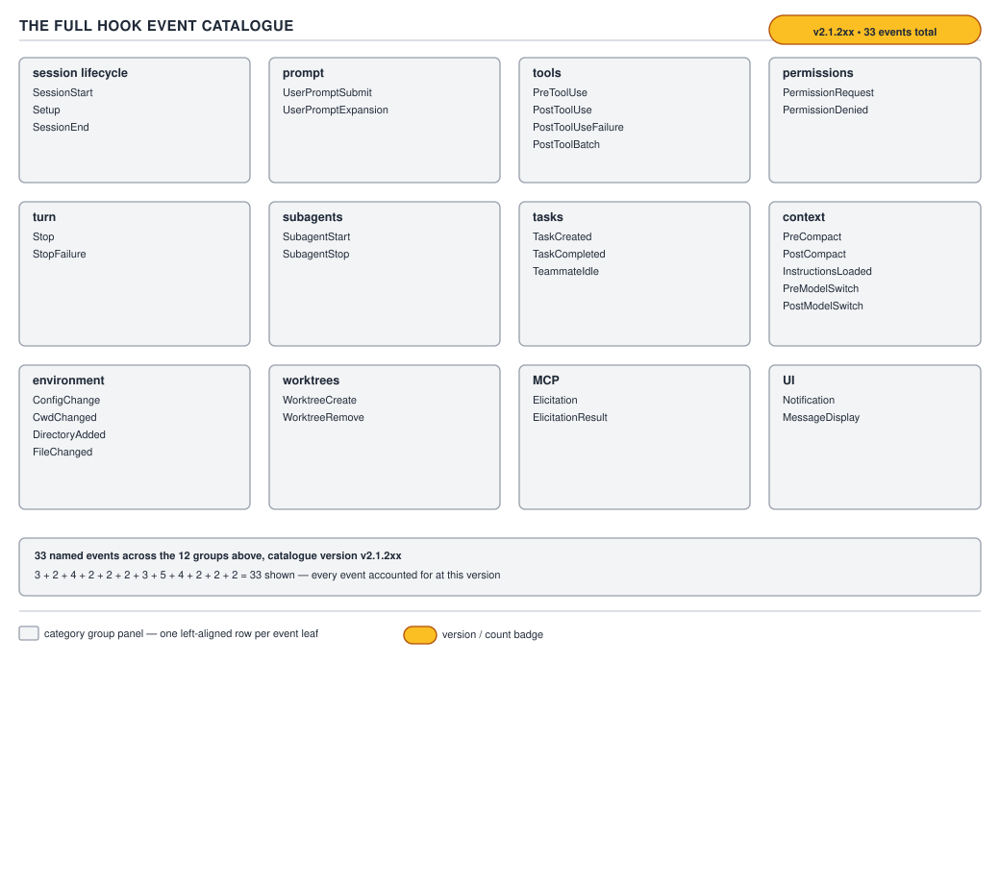

# 21 AI for Coding — the event catalogue — INTERMEDIATE (§2.3.6–2.3.9)

**Target version: Claude Code v2.1.2xx (August 2026).** | **Part 2 of 6** | [Index](../00-index.md)
Previous: [what a hook is](01-basics-what-a-hook-is.md) · Next: [payloads and exit codes](03-payloads-and-exit-codes.md)

The previous file established the guarantee, the configuration schema, the five handler types, and
how a `matcher` string is evaluated. This file answers the two questions that follow directly from
knowing hooks exist at all: *which* moments can I attach to, and *can I stop what is about to
happen at that moment.* Thirty-some event names are not a list worth memorising one at a time — they
are twelve groups, and once the groups are in your head, "is there a hook at the moment I care
about" becomes a lookup rather than a guess.

## §2.3.6 [DOC] [NUM] [RESEARCH] Twelve groups, and a count that is not what the syllabus says

**Mental model.** A Claude Code session is a state machine with about thirty fixed checkpoints
carved into it — the way a CI pipeline has fixed stages (checkout, build, test, deploy) that a
plugin can attach to, rather than "somewhere during the build." Every hook event is one such
checkpoint. Group them by *what part of the session's life they sit on* and the list stops being
thirty-some arbitrary strings and becomes twelve small, learnable clusters.

**Why it exists.** A flat alphabetical list of event names (`ConfigChange`, `CwdChanged`,
`DirectoryAdded`, `Elicitation`, `ElicitationResult`, `FileChanged`, `InstructionsLoaded`,
`MessageDisplay`, `Notification`, `PermissionDenied`, `PermissionRequest`, `PostCompact`,
`PostModelSwitch`, `PostToolBatch`, `PostToolUse`, `PostToolUseFailure`, `PreCompact`,
`PreModelSwitch`, `PreToolUse`, `SessionEnd`, `SessionStart`, `Setup`, `Stop`, `StopFailure`,
`SubagentStart`, `SubagentStop`, `TaskCompleted`, `TaskCreated`, `TeammateIdle`,
`UserPromptExpansion`, `UserPromptSubmit`, `WorktreeCreate`, `WorktreeRemove`) is not something a
reader holds in their head under interview pressure. Grouping by lifecycle phase — the same
organising move a JVM engineer already makes for garbage-collection phases or servlet-filter
stages — turns "name every hook event" into "name the twelve phases, then the two or three events
each phase owns."

**How it works — the count, verified today.** The syllabus this guide was built from states "32
events." **[RESEARCH]** Re-fetching `https://code.claude.com/docs/en/hooks` against the live page on
2026-08-29 finds **33** distinct documented event names, not 32, and the two the syllabus's own
enumeration omits are `PreModelSwitch` and `PostModelSwitch` — a pair added to cover a model
switching mid-session (the user runs `/model`, or Claude Code restores the model a resumed session
was using). **[VERSION]** state this inline the way this file does: on a v2.1.2xx build older than
the one that shipped these two events, a reader will see 31, not 33, and the guide is not wrong —
the binary is.

The twelve groups, with every event verified by name against the live docs page:

| Group | Events | What `matcher` targets |
|---|---|---|
| Session lifecycle | `SessionStart`, `Setup`, `SessionEnd` | start reason (`startup`\|`resume`\|`clear`\|`compact`\|`fork`) / CLI flag (`init`\|`maintenance`) / end reason |
| Prompt | `UserPromptSubmit`, `UserPromptExpansion` | no matcher / command (skill or slash-command) name |
| Tools | `PreToolUse`, `PostToolUse`, `PostToolUseFailure`, `PostToolBatch` | tool name / tool name / tool name / no matcher |
| Permissions | `PermissionRequest`, `PermissionDenied` | tool name / tool name |
| Turn | `Stop`, `StopFailure` | no matcher / error type (`rate_limit`, `overloaded`, …) |
| Subagents | `SubagentStart`, `SubagentStop` | agent type name |
| Tasks | `TaskCreated`, `TaskCompleted`, `TeammateIdle` | no matcher |
| Context & model | `PreCompact`, `PostCompact`, `InstructionsLoaded`, `PreModelSwitch`, `PostModelSwitch` | compaction trigger (`manual`\|`auto`) / compaction trigger / load reason / model canonical name / model canonical name |
| Environment | `ConfigChange`, `CwdChanged`, `DirectoryAdded`, `FileChanged` | settings source / no matcher / how added / literal filenames |
| Worktrees | `WorktreeCreate`, `WorktreeRemove` | no matcher |
| MCP | `Elicitation`, `ElicitationResult` | MCP server name |
| UI | `Notification`, `MessageDisplay` | notification type / no matcher |

That table also discharges §2.3.9 as originally posed: the matcher target genuinely differs by
event, and the differences are exactly the values in the right-hand column above — the *rule* for
how a matcher string is evaluated (literal, list, or regex) was already established in full at
§2.3.2 in the previous file and is not repeated here.



**D-50** — The 32 hook events, grouped. The count and the version are on the canvas because both
move.

**Insight:** the diagram's own count is a snapshot, not a promise — that is precisely the gotcha
this leaf exists to teach, and precisely why the count and the version live together on one canvas
rather than the count alone: a number without a version attached is a number nobody can trust six
months later.

**Code.** A `hooks.json` fragment that reaches into three different groups at once — session
lifecycle, tools, and context & model — is a realistic slice of what a real project's configuration
looks like once more than one concern is wired up:

```json
{
  "hooks": {
    "SessionStart": [
      {
        "matcher": "startup|resume",
        "hooks": [
          {
            "type": "command",
            "command": "${CLAUDE_PROJECT_DIR}/.claude/hooks/branch-context.sh"
          }
        ]
      }
    ],
    "PreToolUse": [
      {
        "matcher": "Bash",
        "hooks": [
          {
            "type": "command",
            "if": "Bash(rm *)",
            "command": "${CLAUDE_PROJECT_DIR}/.claude/hooks/block-destructive-bash.sh"
          }
        ]
      }
    ],
    "PreModelSwitch": [
      {
        "hooks": [
          {
            "type": "command",
            "command": "${CLAUDE_PROJECT_DIR}/.claude/hooks/require-green-build.sh"
          }
        ]
      }
    ]
  }
}
```

`branch-context.sh` runs on the two `SessionStart` reasons that mean "a human just sat down" —
`startup` and `resume` — but not on `clear`, `compact`, or `fork`, so it does not re-stamp branch
context on an in-session compaction. `block-destructive-bash.sh` is the same guard from the
previous file. `require-green-build.sh` sits on a `PreModelSwitch` group with **no `matcher` key at
all**, so it fires on every model switch regardless of which model is being switched to or from —
demonstrated fully in the next leaf, because a model-switch gate is one of the clearer examples of
an event that can genuinely stop something.

**Gotcha.** The count itself is the trap, not any individual event name: a reader who memorises "32"
from a slide, a blog post, or — as this leaf's own re-verification found — from this very topic's
syllabus, will confidently omit `PreModelSwitch`/`PostModelSwitch` from any list they reconstruct
from memory, and the omission will not be caught by anything short of re-reading the live docs page.
Treat any hardcoded count of hook events, including the 33 stated above, as correct **for
v2.1.2xx on 2026-08-29** and nothing stronger.

> A hook event is one of roughly thirty fixed checkpoints the harness carves into a session's
> lifecycle — 33 of them as of Claude Code v2.1.2xx (August 2026), grouped by which phase of the
> session they sit on rather than memorised as a flat list, because the exact count moves release
> to release and the grouping does not.

## §2.3.7 [DOC] [NUM] Which events can block, and with which field

**Mental model.** The question a working engineer actually asks is never "does event X exist" — it
is "if I hook X, can I stop the thing that's about to happen, or can I only watch it happen." Most
of the 33 events cannot stop anything at all; they are notifications the harness fires so a hook can
react, log, or inject context, not gates.

**Why it exists.** Blocking has to be selective. If every event could veto its own action, a
`SessionEnd` hook could refuse to let a session end, a `Notification` hook could refuse to let the
user see a notification — categories of nonsense the harness closes off by design. Blocking power is
reserved for events that sit *before* an action that has not happened yet, or that own a genuine
continue/stop decision about the current turn.

**D-51** — Which events can block, and with which field.

| Event | Can it block? | Field it honours | What a nonzero exit (no field) does | What the model sees |
|---|---|---|---|---|
| `PreToolUse` | Yes | `permissionDecision` (`allow`\|`deny`\|`ask`) in JSON output | exit 2 denies the tool call before it runs | the denial reason, surfaced the same way a manual permission denial is |
| `UserPromptSubmit` | Yes | none named; exit code only | exit 2 stops the prompt from ever reaching the model | stderr fed back as the reason (full JSON/exit contract next file) |
| `UserPromptExpansion` | Yes | none named; exit code only | exit 2 aborts the expansion | stderr fed back as the reason |
| `Stop` | Yes | `decision: "block"` (+ required `reason`) in JSON output | — | `decision: "block"` keeps the turn open instead of letting it end; omitting `decision` allows the stop. The model receives `reason` and keeps working |
| `SubagentStop` | Yes | `decision: "block"` (+ required `reason`) in JSON output | — | same pattern as `Stop`, scoped to the subagent's own turn |
| `PostToolBatch` | Yes | none named; exit code only | exit 2 blocks the remaining calls in the batch | stderr fed back as the reason |
| `TeammateIdle` | Yes | none named; exit code only | exit 2 blocks the idle transition | stderr fed back as the reason |
| `TaskCreated` | Yes | none named; exit code only | exit 2 blocks the task's creation | stderr fed back as the reason |
| `TaskCompleted` | Yes | none named; exit code only | exit 2 blocks marking the task complete | stderr fed back as the reason |
| `ConfigChange` | Yes | none named; exit code only | exit 2 blocks the settings reload | stderr fed back as the reason |
| `PreModelSwitch` | Yes | none named; exit code only | exit 2 blocks the model switch | stderr fed back as the reason |

**`[VERIFIED]`** re-fetched as raw markdown from `https://code.claude.com/docs/en/hooks.md` on
2026-08-30, the `#### Stop decision control` section states this verbatim: "`decision` — `\"block\"`
prevents Claude from stopping. Omit to allow Claude to stop" and "`reason` — Required when `decision`
is `\"block\"`. Tells Claude why it should continue." **Correction:** an earlier pass of this file
described `Stop`/`SubagentStop` as honouring a boolean `continue` field, with `continue: false`
meaning "keep going" — that is wrong on two counts: the field name is `decision` (with a required
`reason`), and `continue` is not scoped to `Stop` at all. `continue` is a **universal, top-level kill
switch present on every event**, defaulting to `true`, where `continue: false` stops Claude entirely
and **takes precedence over any event-specific decision field** — including a `Stop` hook's own
`decision: "block"`. `stopReason` pairs with `continue` and is shown to **the user, not Claude**.

**Pitfall:** to keep Claude working past a `Stop` event, you **block the stop** —
`{"decision": "block", "reason": "..."}`. The intuitive reading ("set `continue: true`" or "a field
literally named `continueReason`") is backwards and does not exist in the schema; this inversion is
exactly what produced the wrong reading above.

**`stop_hook_active` and the 8-consecutive-block cap.** `[VERIFIED]` (same fetch): "In addition to the
common input fields, Stop hooks receive `stop_hook_active`, `last_assistant_message`,
`background_tasks`, and `session_crons`. The `stop_hook_active` field is `true` when Claude Code is
already continuing as a result of a stop hook. Check this value or process the transcript to avoid
blocking on a condition that will never resolve. Claude Code overrides the hook and ends the turn
after 8 consecutive blocks." A `Stop` hook that returns `decision: "block"` without checking
`stop_hook_active` is an infinite-turn generator, bounded only by that 8-block cap — the honest
mechanical answer to "why is a four-minute build in a `Stop` hook dangerous."

The full JSON-output shapes and the complete exit-code contract (0 / 2 / other, stdout vs stderr,
and what "fed back as the reason" precisely means on each row above) are §2.3.10–2.3.14, the next
file — this table's job is only to say *which* events have a lever at all.

**Everything else in the 33 cannot block, at all, from any hook on it:** `PostToolUse`,
`PostToolUseFailure`, `PermissionRequest`, `PermissionDenied`, `StopFailure`, `PreCompact`,
`PostCompact`, `PostModelSwitch`, `SessionStart`, `SessionEnd`, `Setup`, `SubagentStart`,
`InstructionsLoaded`, `CwdChanged`, `DirectoryAdded`, `FileChanged`, `WorktreeCreate`,
`WorktreeRemove`, `Notification`, `MessageDisplay`, `Elicitation`, `ElicitationResult`. **Unverified:**
the documentation separately describes a JSON-only `decision` channel for `PermissionRequest` that
is distinct from the exit-code contract above; whether that channel counts as "blocking" in a sense
this table's binary framing does not capture is not settled here and is deferred to
§2.3.10–2.3.14, which owns the JSON-output contract in full.

**Code.** `require-green-build.sh`, the `PreModelSwitch` guard sketched in the previous leaf, made
complete — it refuses a model switch mid-session if the project's own test suite is currently red,
on the theory that switching models mid-fix is exactly when a half-finished diff gets lost track of:

```bash
#!/usr/bin/env bash
set -e

INPUT_JSON="$(cat)"
FROM_MODEL="$(echo "$INPUT_JSON" | jq -r '.from_model // "unknown"')"
TO_MODEL="$(echo "$INPUT_JSON" | jq -r '.to_model // "unknown"')"

if ! mvn -q -o test >/tmp/require-green-build.log 2>&1; then
  echo "require-green-build.sh: refusing switch from $FROM_MODEL to $TO_MODEL — build is red" >&2
  exit 2
fi

exit 0
```

This is the concrete case for why the "can block" column matters more than the event's mere
existence: a `PostToolUse` hook could run this exact same `mvn -q -o test` and reach the same
verdict, but it would be purely informational — the switch (or the edit, in the earlier
`format-on-edit.sh` example) has already happened by the time `PostToolUse` fires, so there is
nothing left for a nonzero exit to prevent.

**Gotcha.** `PostToolUse` cannot block, and the reason is not an arbitrary design choice: **the tool
has already run.** By the time the harness dispatches `PostToolUse`, the file is already written,
the command has already executed, the side effect already happened in the outside world. A hook on
that event exiting 2 has nothing left to stop — it can still speak to the model (surface a
message, ask it to fix something, log a finding), but it cannot un-run a command or un-write a file.
This is exactly the distinction people get wrong when they reach for `PostToolUse` to build a guard:
**`PostToolUse` cannot prevent, it can only inform.** Prevention lives one event earlier, on
`PreToolUse`, before the tool has run at all.

**Interview:** "You want to stop a dangerous `Bash` command before it executes. Which event, and
why not `PostToolUse`?" — `PreToolUse`, because it fires before the tool runs and can return
`permissionDecision: "deny"` or exit 2 to stop it outright; `PostToolUse` fires after the command has
already executed, so by the time that hook runs there is nothing left to prevent — it can only tell
the model something went wrong after the fact.

## §2.3.8–2.3.9 The event-specific payload: what is always there, and what only shows up per event

**Mental model.** Every hook handler that reads its input — a `command` hook on stdin, an `http`
hook in its POST body — receives one JSON object per invocation. Some keys are on every single one
of the 33 events' payloads, the way `session_id` and a timestamp are on every log line a well-run
service emits; the rest exist only when that particular event has something specific to report, the
way an HTTP access log's status code only makes sense on a response line and not on a connection-open
line.

**Why it exists.** A hook script that has to branch on `hook_event_name` to know which other keys
might be present is doing real, necessary work — the alternative, a payload shape that silently
varies with no name field to key off of, would make every script fragile to which event happened to
invoke it. Naming the event explicitly, on every payload, is what lets one script (or one `matcher`
group's worth of shared logic) safely inspect only the keys it knows belong to the event it was
written for.

**How it works.** A real, complete `PreToolUse` payload, as the harness delivers it on stdin for a
`Bash` call:

```json
{
  "session_id": "a1b2c3d4-e5f6-4789-9abc-def012345678",
  "prompt_id": "550e8400-e29b-41d4-a716-446655440000",
  "transcript_path": "/Users/engineer/.claude/projects/sdlc-harness/transcript.jsonl",
  "cwd": "/Users/engineer/Codes/sdlc-harness",
  "permission_mode": "default",
  "effort": { "level": "medium" },
  "hook_event_name": "PreToolUse",
  "tool_name": "Bash",
  "tool_input": {
    "command": "mvn -q -o test",
    "description": "Run the project test suite",
    "timeout": 120000,
    "run_in_background": false
  },
  "tool_use_id": "toolu_01ABC123DEF456"
}
```

And a `SessionStart` payload, built from the same confirmed common-field set plus the one field
`SessionStart` alone carries:

```json
{
  "session_id": "a1b2c3d4-e5f6-4789-9abc-def012345678",
  "transcript_path": "/Users/engineer/.claude/projects/sdlc-harness/transcript.jsonl",
  "cwd": "/Users/engineer/Codes/sdlc-harness",
  "permission_mode": "default",
  "hook_event_name": "SessionStart",
  "session_start_reason": "startup"
}
```

**Present on effectively every event's payload:** `session_id`, `transcript_path`, `cwd`,
`permission_mode`, `hook_event_name`. **[VERSION]** `prompt_id` joins that common set once a prompt
exists in the session but is absent from a payload fired before the first user turn (v2.1.196+ added
the field at all; on an older build it is simply never present). `effort` (the current effort level —
`low`/`medium`/`high`/`xhigh`/`max`, from §3.5's cost-and-routing material) rides along on tool-use
and turn-adjacent events but is not meaningful on, say, `WorktreeCreate`.

**Event-specific keys**, by the same twelve groups as §2.3.6: tool events (`PreToolUse`,
`PostToolUse`, `PostToolUseFailure`, `PermissionRequest`, `PermissionDenied`) carry `tool_name`,
`tool_input`, `tool_use_id`; `SessionStart` carries `session_start_reason`; `SessionEnd` carries
`session_end_reason` (`clear`\|`resume`\|`logout`\|`prompt_input_exit`\|`other`); subagent events
carry `agent_id` and `agent_type`; `PreModelSwitch`/`PostModelSwitch` carry `from_model` and
`to_model`; `Notification` carries `notification_type`; `FileChanged` carries the changed path list.
The complete field-by-field contract for all 33, plus what each blockable event's JSON output object
is allowed to contain and exactly what a `0`/`2`/other exit code does on each, is §2.3.10–2.3.14 —
this leaf's job is only to establish the shape and the always-vs-sometimes split.

**Code.** `branch-context.sh`, the `SessionStart` handler wired into §2.3.6's `hooks.json`, reading
exactly the payload shown above:

```bash
#!/usr/bin/env bash
set -e

INPUT_JSON="$(cat)"
REASON="$(echo "$INPUT_JSON" | jq -r '.session_start_reason // "unknown"')"
CWD="$(echo "$INPUT_JSON" | jq -r '.cwd')"

if [ "$REASON" = "startup" ] || [ "$REASON" = "resume" ]; then
  BRANCH="$(git -C "$CWD" rev-parse --abbrev-ref HEAD 2>/dev/null || echo "detached")"
  echo "Current branch: $BRANCH" >&2
fi

exit 0
```

Because `SessionStart` cannot block (§2.3.7), this script's only channel to the model is stderr text
on a normal exit — it stamps the branch into context, it does not gate anything.

**Gotcha.** Reading a key that is not guaranteed for the firing event — `tool_name` inside a
`SessionStart` handler, `from_model` inside a `PreToolUse` handler — does not raise an error; `jq`'s
`// empty` or `// "unknown"` fallback (used in every script in this guide) silently produces an empty
or placeholder value, and a script that does not defensively fall back gets a hard `jq` failure on a
key that was never going to be there for that event in the first place. Branch a script on
`hook_event_name` before trusting any event-specific key.

> A hook's stdin payload is one JSON object per invocation, carrying a small fixed core
> (`session_id`, `cwd`, `permission_mode`, `hook_event_name`, and — from v2.1.196 onward — `prompt_id`
> once one exists) present on effectively every event, plus a handful of keys specific to the firing
> event that a script must not assume are present without checking `hook_event_name` first.

## Pitfalls

- **Belief:** "There are 32 hook events" (the figure this very guide's syllabus was built from).
  **Symptom:** an engineer reconstructing the full event list from memory for a design review
  confidently omits `PreModelSwitch` and `PostModelSwitch`, because a stale count anchored their
  mental list at 32 and nothing flagged the gap. **Fix:** treat any hardcoded count of hook events as
  correct only for a stated version, and re-count against the live `hooks` doc page before relying on
  it for anything more consequential than small talk — 33 is correct for v2.1.2xx on 2026-08-29 and
  nothing stronger. **Why people believe it:** the number was accurate at some earlier point release
  and got repeated in slides, blog posts, and this topic's own syllabus without anyone re-checking it
  against a newer binary.
- **Belief:** "If my `PostToolUse` hook exits 2, the edit it's reacting to gets rolled back."
  **Symptom:** the script runs, prints its stderr message, exits 2 — and the file the model just wrote
  stays exactly as written, with no rollback and no error surfaced anywhere obviously connected to the
  hook. **Fix:** move the check to `PreToolUse`, before the write happens, if the goal is actually to
  prevent it; use `PostToolUse` only to inform the model something is wrong after the fact, since the
  tool has already run and there is nothing left an exit code can stop. **Why people believe it:** exit
  code 2 clearly means "stop" on the events that can block, so it is natural to assume the meaning
  carries over uniformly instead of being conditional on the event even having a stop lever at all.

## Cheat sheet

| Item | Value |
|---|---|
| Total hook events, v2.1.2xx, 2026-08-29 | **33** (syllabus said 32; missing `PreModelSwitch`/`PostModelSwitch`) |
| Groups | session lifecycle, prompt, tools, permissions, turn, subagents, tasks, context & model, environment, worktrees, MCP, UI |
| Blocking events with a named JSON field | `PreToolUse` (`permissionDecision`), `Stop`/`SubagentStop` (`decision: "block"` + required `reason`) |
| Blocking events, exit-2-only | `UserPromptSubmit`, `UserPromptExpansion`, `PostToolBatch`, `TeammateIdle`, `TaskCreated`, `TaskCompleted`, `ConfigChange`, `PreModelSwitch` |
| Universal kill switch, every event | `continue: false` (top-level) stops Claude entirely and overrides any event-specific decision; `stopReason` pairs with it and is shown to the user, not Claude |
| Cannot block, ever | the other 22 — includes `PostToolUse` because the tool has already run |
| Always-present payload keys | `session_id`, `transcript_path`, `cwd`, `permission_mode`, `hook_event_name`, `prompt_id` (v2.1.196+, once a prompt exists) |
| Full exit-code / JSON-output contract | §2.3.10–2.3.14, next file |

## Self-test

1. How many hook events does the live docs page document as of v2.1.2xx, 2026-08-29, and which two
   does this topic's own syllabus omit?
   <details><summary>Answer</summary>33. The syllabus's enumeration lists 32 and omits
   `PreModelSwitch` and `PostModelSwitch`.</details>
2. Name the twelve groups the 33 events fall into.
   <details><summary>Answer</summary>Session lifecycle, prompt, tools, permissions, turn, subagents,
   tasks, context & model, environment, worktrees, MCP, UI.</details>
3. Why can't `PostToolUse` block anything, no matter how its hook script exits?
   <details><summary>Answer</summary>The tool has already run by the time `PostToolUse` fires — the
   file is written, the command has executed — so there is nothing left for a nonzero exit to prevent.
   It can still inform the model, but it cannot prevent.</details>
4. Which JSON field does `PreToolUse` honour to make its blocking decision, and which field does `Stop`
   honour?
   <details><summary>Answer</summary>`PreToolUse` honours `permissionDecision` (`allow`/`deny`/`ask`);
   `Stop` (and `SubagentStop`) honours `decision: "block"` with a required `reason` — omitting
   `decision` allows the stop. The boolean `continue` is a separate, universal kill switch on every
   event, not the `Stop` mechanism.</details>
5. A `PreModelSwitch` hook exits 2. What happens, and what does the model see?
   <details><summary>Answer</summary>The model switch is blocked before it takes effect; the model
   sees the hook's stderr fed back as the reason (the full contract for exactly how is
   §2.3.10–2.3.14).</details>
6. What does `matcher` target on a `SubagentStart` hook, versus on a `PreToolUse` hook?
   <details><summary>Answer</summary>`SubagentStart` matches against the agent type name (e.g.
   `Explore`, a plugin-scoped custom agent); `PreToolUse` matches against the tool name (`Bash`,
   `Edit|Write`, `mcp__.*`).</details>
7. Is `prompt_id` guaranteed to be present on every hook payload?
   <details><summary>Answer</summary>No. It requires v2.1.196+ to exist at all, and even on a build
   that new it is absent from any payload fired before the session's first user prompt.</details>
8. Why does `require-green-build.sh` belong on `PreModelSwitch` rather than `PostModelSwitch` if the
   goal is to refuse a switch while the build is red?
   <details><summary>Answer</summary>Only `PreModelSwitch` can block — it fires before the switch
   takes effect. `PostModelSwitch` fires after the switch has already happened and cannot be
   vetoed.</details>

## Open questions

**Unverified:** whether `PermissionRequest`'s separately documented JSON-only `decision` channel
counts as a form of blocking distinct from the exit-code contract this file's D-51 table covers.
Settle by reading the full JSON-output section of `https://code.claude.com/docs/en/hooks`, which
§2.3.10–2.3.14 owns.

---

**Leaves covered:** 2.3.6–2.3.9 (4 leaves)
**Leaves deferred:** none
**Diagrams included:** D-50, D-51
**Target version:** Claude Code v2.1.2xx (August 2026)
**Lines:** 433
