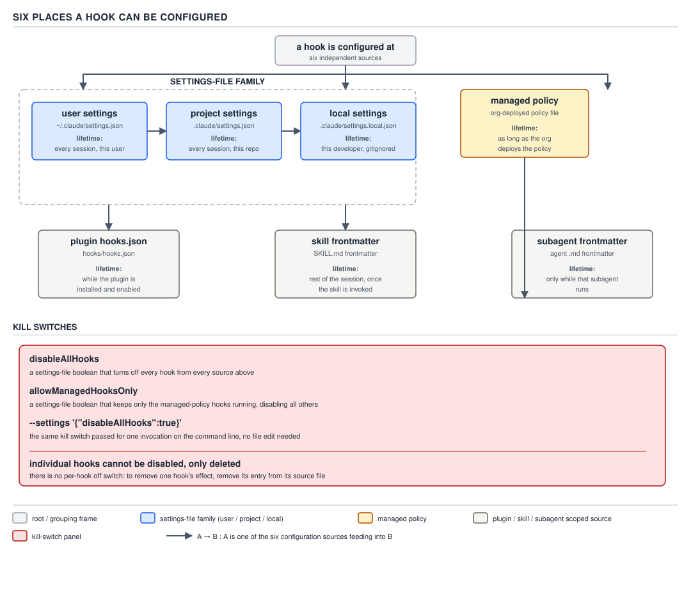

# 21 AI for Coding — the six configuration sources — INTERMEDIATE (§2.3.18–2.3.20)

**Target version: Claude Code v2.1.2xx (August 2026).** | **Part 2 of 6** | [Index](../00-index.md)
Previous: [a hook cannot unblock a deny](04-a-hook-cannot-unblock-a-deny.md) · Next: [advisory hooks, read closely](06-cases-advisory-and-defensive.md)

The previous file settled a question about *authority* — a hook can narrow a decision the permission
rules already made, and it can never widen one. This file settles a different question: *where does a
hook come from in the first place*, and *for how long does it stay*. Every hook this guide has shown
so far lived in a settings file — something the reader could grep. Two of the six sources below do
not: they appear mid-session, driven by something the reader typed, and they are gone again before the
reader can grep for them. Confusing "a hook is not in any file I can find" with "a hook is not running"
is the specific mistake this file exists to close off, and it is exactly the mistake the diagnostic in
§2.3.20 exists to make impossible.

## §2.3.18 [DOC] The configuration sources, and the lifetime of each

**Mental model.** Do not picture hook configuration as one file with an on/off switch next to each
entry. Picture it as six separate registration desks that all feed the same event dispatcher, each desk
staffed on a different schedule. Three desks — user, project, local settings — are open all the time
and their registrations last until someone edits the file. A fourth desk, managed policy, is staffed by
an administrator the reader does not control. A fifth, a plugin's own `hooks/hooks.json`, is open only
while that plugin is switched on. The sixth and seventh desks are the ones that break the "just grep
the settings files" habit: one opens the moment a skill is invoked and stays open for the rest of the
session even after that skill's own turn ends; the other opens only while one specific subagent is
running and closes the instant that subagent finishes. A hook registered at either of the last two
desks was never written to a settings file at all — it exists only in the running session's memory.

**Why it exists.** A single configuration surface would force every hook into the same lifetime as
every other hook — permanent, file-backed, requiring an edit to add or remove. That is the right shape
for an organization-wide `PreToolUse` guard and the wrong shape for "while this one subagent reviews
a diff, tag every file it touches with the review's ticket number" — a rule that has no reason to exist
before that subagent starts or after it stops, and every reason not to leave a stale entry behind in a
settings file once it does. Six sources with six different lifetimes let a hook's lifetime match the
thing it is actually about: a machine-wide policy lives as long as the machine is configured that way; a
skill-scoped hook lives as long as the skill's own usefulness in that conversation; a subagent-scoped
hook lives exactly as long as the subagent that needs it.

**Divergence from this file's own header framing, stated plainly.** The syllabus row that commissioned
this file calls these "six sources," and the row's own primary-concepts line repeats "the six places a
hook can be configured." Re-verified against `https://code.claude.com/docs/en/hooks` on 2026-08-29, the
live "Hook locations" table lists **seven** rows, not six: user settings, project settings, local
settings, managed policy settings, a plugin's `hooks/hooks.json`, skill frontmatter, and subagent
frontmatter. Grouping the settings trio into one family narrows the *conceptual* count to five
(settings-family, managed, plugin, skill, subagent) — still not six by any grouping this file can find.
This is one more instance of the pattern file 04 already flagged twice: a syllabus row's own count is a
work order from 2026-08-29, already stale, not a citable fact. What follows names all seven literal
locations, grouped so the settings trio reads as one family, because that grouping is what actually
helps a reader reason about lifetime.

**How it works — the settings trio, one family.**

| Source | Where it lives | Lifetime | Persists into a brand-new session? | Blocked by `allowManagedHooksOnly`? |
|---|---|---|---|---|
| User settings | `~/.claude/settings.json` | every project on this machine, until edited | yes | yes — user hooks are blocked |
| Shared project settings | `.claude/settings.json`, committed to the repo | this project, for everyone who checks it out, until edited | yes | yes — project hooks are blocked |
| Local settings | `.claude/settings.local.json`, gitignored | this project, this machine only, until edited | yes | yes — local hooks are blocked |
| Managed policy settings | `managed-settings.json`, delivered by MDM, or the `claude.ai` console | org-wide, outside the reader's control | yes | not applicable — `allowManagedHooksOnly` is *itself* a managed-policy key; managed hooks are what it lets through |
| Plugin `hooks/hooks.json` | inside the plugin's own package | as long as the plugin stays enabled; gone the moment it is disabled or uninstalled | yes, if the plugin is still enabled | yes, unless the plugin is force-enabled via managed `enabledPlugins`, which is exempt |
| Skill frontmatter | inside that skill's `SKILL.md` | registered the moment the skill is invoked, and kept running **for the rest of the session**, on turns after the skill's own turn — unless the handler sets `once: true`, in which case it is removed after its first successful run | no — a fresh session has invoked no skill yet | not addressed in the pages this file could reach — see Open questions |
| Subagent frontmatter | inside that subagent's own definition file | registered when that subagent starts, removed the moment it finishes | no — gone even within the same session, long before a new one starts | not addressed in the pages this file could reach — see Open questions |

There is no `/cd` command in v2.1.2xx — re-checked against `https://code.claude.com/docs/en/cli-reference`,
which lists `/add-dir` for granting access to an additional working directory but nothing that changes
the session's project root mid-session. The column above answers the question a `/cd` column would have
been asking for: does this source's registration outlive the current session, or does it have to be
re-earned. The settings trio, managed policy, and an enabled plugin all answer yes. Skill and subagent
frontmatter both answer no — they are re-registered from scratch, from the same file, the next time a
session invokes that skill or spawns that subagent.



**D-54** — The six places a hook can be configured, each with its lifetime. Individual hooks cannot be
disabled, only deleted.

**Code.** The settings trio, one representative body — the same `hooks` shape in all three files,
distinguished only by which file it sits in and who can edit it. Project settings, complete:

```json
{
  "hooks": {
    "PostToolUse": [
      {
        "matcher": "Write|Edit",
        "hooks": [
          {
            "type": "command",
            "command": "${CLAUDE_PROJECT_DIR}/.claude/hooks/format-on-edit.sh"
          }
        ]
      }
    ]
  }
}
```

Managed policy settings, complete, showing the fourth source and its own kill switch in the same file —
the file this guide has not yet shown, because until now nothing in it needed the vantage point of the
administrator who writes it:

```json
{
  "allowManagedHooksOnly": true,
  "hooks": {
    "PreToolUse": [
      {
        "matcher": "Bash",
        "hooks": [
          {
            "type": "command",
            "command": "/opt/claude-code/managed-hooks/block-destructive-bash.sh"
          }
        ]
      }
    ]
  }
}
```

A plugin's `hooks/hooks.json`, complete — the fifth source, scoped to that plugin's own lifetime, not
the project's:

```json
{
  "hooks": {
    "SessionStart": [
      {
        "hooks": [
          {
            "type": "command",
            "command": "${CLAUDE_PLUGIN_ROOT}/hooks/branch-context.sh"
          }
        ]
      }
    ]
  }
}
```

Skill frontmatter, complete — the sixth source, and the first one that is not a settings file at all:

```yaml
---
name: safe-branch-operations
description: Perform git branch operations with a destructive-command guard active for the rest of the session
hooks:
  PreToolUse:
    - matcher: "Bash"
      hooks:
        - type: command
          command: "${CLAUDE_PROJECT_DIR}/.claude/hooks/block-destructive-bash.sh"
---

Use this skill when the task involves rebasing, force-pushing, or deleting branches. The guard below
stays registered for the rest of this session once this skill has been invoked once.
```

Subagent frontmatter, complete — the seventh source, and the shortest-lived of all of them:

```yaml
---
name: readonly-reviewer
description: Reviews a diff without being able to modify it; a PreToolUse hook enforces that boundary for as long as this subagent is running
hooks:
  PreToolUse:
    - matcher: "Write|Edit|Bash"
      hooks:
        - type: command
          command: "${CLAUDE_PROJECT_DIR}/.claude/hooks/block-destructive-bash.sh"
---

Read the diff and the surrounding files. Report findings; do not modify anything. The hook above is
removed the moment this subagent finishes, whether it succeeds or is stopped early.
```

**Gotcha.** A subagent that declares a `Stop` hook in its own frontmatter is not registering a `Stop`
hook at all in the sense file 02's event catalogue defined it — the harness converts a `Stop` declared
inside a subagent's frontmatter into a `SubagentStop`, because "the turn ends" and "this subagent's
sub-conversation ends" are different events, and the subagent has no access to the outer session's own
`Stop`. A reader who copies a top-level `Stop` hook verbatim into a subagent definition, expecting it to
fire when the *subagent's* work concludes, gets exactly that behaviour — just not because `Stop` fired;
`SubagentStop` did, under the name the reader wrote.

> A hook's configuration source determines not just *whether* it exists but *how long* — the settings
> trio and managed policy and an enabled plugin all outlive the current session; a skill's hook lives
> for the rest of the session once that skill has run; a subagent's hook lives only while that one
> subagent is running, and neither of the last two will ever show up in a `grep` of a settings file.

## §2.3.19 [DOC] The kill switches, and why there is no per-hook switch

**Mental model.** There is a master breaker for the whole electrical panel, and there is a lock an
electrician can put on the panel that only the electrician can remove — but there is no individual
switch on any one circuit. That is deliberate: a per-hook switch would let a hook that a security team
depends on be silently flipped off by anyone who found it annoying, one circuit at a time, with no
audit trail beyond "the entry is still there but stopped mattering." The only two states a hook is ever
in are **registered and running** or **gone**.

**Why it exists.** Debugging surprise hook behaviour needs a fast, blunt instrument — "is this my hooks
misbehaving, or is it something else" — that does not require the reader to find and comment out the
specific entry while they investigate. And an organization publishing hooks through managed policy
needs the opposite guarantee: that no local override, however creative, can make its hooks stop running
without the organization's own consent. Two different audiences, two different switches, both blunt on
purpose.

**How it works.** Re-verified against `https://code.claude.com/docs/en/settings-reference` and
`https://code.claude.com/docs/en/hooks` on 2026-08-29:

| Kill switch | Scope it belongs in | What it turns off | What the reader observes afterwards |
|---|---|---|---|
| `disableAllHooks` (boolean) | any settings file — user, project, local, or managed | **all** hooks from every source, plus a custom status line and a custom `@` file suggestion command, at once — "Turn off hooks, a custom status line, and a custom `@` file suggestion command at once," per the settings reference | every hook stops firing; a custom `statusLine` and `@`-suggestion command stop rendering too — a reader who forgot they set this and is only debugging hooks may waste time on an unrelated-looking statusline regression that has the same cause |
| `allowManagedHooksOnly` (boolean) | **managed policy only** | user, project, local, and plugin hooks are all blocked; plugins force-enabled via managed `enabledPlugins` are exempt; `statusLine`, `fileSuggestion`, and `subagentStatusLine` are narrowed to managed settings too; command-source plugins are disabled unless `disableCommandPluginSources` is explicitly set to `false` | only the hooks the organization itself shipped through managed policy still run; every hook the reader or a locally-installed plugin registered simply stops appearing, with no error — it looks exactly like those hooks were deleted |
| `--settings '{"disableAllHooks":true}'` (per-run CLI form) | the command line, for this one invocation | the same thing `disableAllHooks: true` turns off, but only for this run, and only for the layers the command line actually outranks | hooks are off for this one `claude` invocation; the next invocation without the flag is back to whatever the settings files say |

`disableAllHooks` itself **respects the settings precedence the reader already knows** from §1.2.2–3: a
`"disableAllHooks": false` in shared project settings overrides a `true` in user settings, because
project settings sits above user settings in the precedence order (managed → command line → project
local → shared project → user). And it respects one more boundary on top of that ordinary precedence:
**"the `disableAllHooks` setting respects the managed settings hierarchy. If an administrator has
configured hooks through managed policy settings, `disableAllHooks` set in user, project, or local
settings can't disable those managed hooks. Only `disableAllHooks` set at the managed settings level can
disable managed hooks,"** quoted directly from the settings reference. The same logic governs
`allowManagedHooksOnly`: it is a **managed-only** key, so no command-line flag, and no project or user
setting, can ever flag it away — this is the same "managed outranks the command line" fact §1.2.2
already established for permissions, showing up again here for hooks. A managed lock, once set, stays
locked from every vantage point a project or a developer has.

**The practical debugging move.** `--settings '{"disableAllHooks":true}'` pairs with `--safe-mode` and
`--bare`, introduced at §0.4.9, as the fast way to answer the one question a misbehaving session
actually raises: **is it my hooks, or is it something else?** Run the same task once with hooks on and
once with `--settings '{"disableAllHooks":true}'`. If the surprise disappears, the cause is a hook — and
the reader now needs to find *which* one, which is exactly what §2.3.20 is for. If the surprise
persists with all non-managed hooks off, it was never a hook, and the reader stops looking in the wrong
place. This is a strictly faster loop than commenting out settings entries one at a time, because it
does not require guessing which of six sources the offending hook came from before eliminating the
possibility that it is a hook at all.

**Gotcha — there is no way to disable one hook.** Quoted directly, from the "Disable or remove hooks"
section of the hooks page: **"To remove a hook, delete its entry from the settings JSON file. There is
no way to disable an individual hook while keeping it in the configuration."** This is the fact that
turns "one specific hook is misbehaving" from an annoyance into a real debugging problem. The reader
cannot comment out one entry and leave the rest running by flipping a flag next to it — the only
per-hook operation available is deletion, and deleting is not always safe to do casually: the entry
might be shared in a committed project settings file that other engineers rely on, or shipped inside a
plugin the reader does not maintain. The two blunt kill switches above exist precisely because there is
nothing finer-grained underneath them.

**Pitfall:** the wrong belief: "hooks probably have a `disabled: true` field on the individual entry,
the same way a lot of config formats let you toggle one thing off without deleting it." The symptom:
searching the settings reference and the hook object's own field list for such a key and finding
nothing, then either leaving a hook running that should not be, or deleting an entry that a teammate
still needed, because deletion looked like the only option and it is the only option. The fix: use
`disableAllHooks` (all hooks, bluntly) if the goal is temporary and total, or delete the specific entry
if the goal is permanent and specific to that one hook — there is no third, gentler option, and looking
for one wastes debugging time this file exists to save. **Why people believe it:** most configuration
systems the reader has used — feature flags, Spring `@ConditionalOnProperty`, a CI job's `enabled: false`
— do support exactly this per-entry toggle, so assuming hooks work the same way is a reasonable
extrapolation from everywhere else the reader has seen configuration, not a careless guess.

**Interview:** "A teammate says one specific `PostToolUse` hook is producing noisy output and wants it
turned off without touching the others. What do you tell them to do?" — there is no per-hook disable
switch; the only options are deleting that hook's entry from whichever settings file or plugin it came
from, or reaching for `disableAllHooks` if the ask is really "turn everything off for now," which is a
different, blunter request than the one they asked for. Before doing either, use `/hooks` to confirm
which source that specific entry actually lives in — deleting the wrong copy of a similarly-named hook
in the wrong file is a second, avoidable mistake stacked on the first.

> `disableAllHooks` is an all-hooks breaker that also takes down a custom status line and file
> suggestion command; `allowManagedHooksOnly` is a managed-only lock that lets through nothing but
> hooks the organization itself shipped; and neither exists at the level of one hook, because there is
> no such switch — the only way to stop one specific hook is to delete its entry.

`allowManagedHooksOnly` is one member of a broader `allowManaged*Only` family that reaches beyond hooks
into MCP servers, plugins, and other surfaces; the full family, and the organizational reasoning behind
locking each surface independently, is covered in `governance/02-the-lock-family.md`.

## §2.3.20 [DOC] [BUILD] `/hooks` — the read-only browser

**Mental model.** `/hooks` is not a configuration command; it is a window. It does not add, edit, or
remove anything — it answers, for a session the reader is already sitting inside, the one question none
of the six configuration sources can answer on their own: **given everything registered from every
source at once, what is actually active right now, and which file is each entry actually coming from?**

**Why it exists.** §1.1.9, established in PART 1, is the invariant this whole guide has carried since
BASICS: if a behaviour surprised you, some file caused it. Six sources — three of them ordinary files,
one an administrator's policy, one a plugin package, two of them not files at all but in-memory
registrations tied to a skill or a subagent's lifetime — makes "which file" a genuinely hard question to
answer by inspection alone, especially once a skill-scoped or subagent-scoped hook is in play, since
neither one appears in anything the reader can `grep`. `/hooks` exists so the reader never has to
reconstruct the answer from memory or from reading every settings file, every enabled plugin's package,
and the frontmatter of whatever skill or subagent happens to be active, by hand.

**How it works.** Re-verified against `https://code.claude.com/docs/en/hooks` on 2026-08-29, quoted
directly: **"Type `/hooks` in Claude Code to open a read-only browser for your configured hooks. The
menu shows every hook event with a count of configured hooks, lets you drill into matchers, and shows
the full details of each hook handler. Use it to verify configuration, check which settings file a hook
came from, or inspect a hook's command, prompt, or URL."** The menu displays all five handler types this
guide's file 01 already enumerated — `command`, `prompt`, `agent`, `http`, and `mcp_tool` — each labeled
with a `[type]` prefix, and a source tag naming exactly where it came from:

| Source tag shown in `/hooks` | Where it actually came from |
|---|---|
| `User Settings` | `~/.claude/settings.json` |
| `Project Settings` | `.claude/settings.json` |
| `Local Settings` | `.claude/settings.local.json` |
| `Plugin Hooks` | that plugin's own `hooks/hooks.json` |
| `Session Hooks` | registered in memory for the current session — this is the tag under which a skill's or a subagent's frontmatter-registered hook shows up while it is active |

Selecting one hook opens a detail view with its event, matcher, type, source file, and the full
command, prompt, or URL — the same level of detail file 03 required a reader to reconstruct from the
debug transcript by hand, now available as a lookup. The menu itself makes no changes: **"The menu is
read-only: to add, modify, or remove hooks, edit the settings JSON directly or ask Claude to make the
change."**

**Artifact.** Register three hooks across three different sources, then use `/hooks` to confirm all
three are visible and correctly attributed. First, the project settings file, committed:

```json
{
  "hooks": {
    "PostToolUse": [
      {
        "matcher": "Write|Edit",
        "hooks": [
          {
            "type": "command",
            "command": "${CLAUDE_PROJECT_DIR}/.claude/hooks/format-on-edit.sh"
          }
        ]
      }
    ]
  }
}
```

Second, `.claude/settings.local.json`, not committed:

```json
{
  "hooks": {
    "PreToolUse": [
      {
        "matcher": "Bash",
        "hooks": [
          {
            "type": "command",
            "command": "${CLAUDE_PROJECT_DIR}/.claude/hooks/block-destructive-bash.sh"
          }
        ]
      }
    ]
  }
}
```

Third, a skill, invoked once during the session so its `SessionStart`-style registration is live for
the rest of it:

```yaml
---
name: safe-branch-operations
description: Perform git branch operations with a destructive-command guard active for the rest of the session
hooks:
  PreToolUse:
    - matcher: "Bash"
      hooks:
        - type: command
          command: "${CLAUDE_PROJECT_DIR}/.claude/hooks/block-destructive-bash.sh"
---

Use this skill when the task involves rebasing, force-pushing, or deleting branches.
```

**Prove.** After invoking the `safe-branch-operations` skill once in the session:

```text
> /hooks
```

The browser lists, among the events with configured handlers:

```text
PreToolUse (2)
  matcher: Bash
    [command] block-destructive-bash.sh — Local Settings
    [command] block-destructive-bash.sh — Session Hooks

PostToolUse (1)
  matcher: Write|Edit
    [command] format-on-edit.sh — Project Settings
```

Two entries share the same script and the same matcher, `Bash`, but attribute to two different sources
— `Local Settings` (registered for the whole project on this machine, from `.claude/settings.local.json`)
and `Session Hooks` (registered only because the `safe-branch-operations` skill ran once this session,
and gone the moment this session ends). Before this check, the reader would have had to notice from the
debug log alone that `block-destructive-bash.sh` fired *twice* on the same `Bash` call and reason out why;
`/hooks` names both sources directly, without requiring that reconstruction.

**What this costs.** `/hooks` is a local menu rendered by the harness from configuration it already
holds in memory — it makes no model call. Opening it, browsing every event, and inspecting every
handler's detail view costs **0 tokens and $0**, the same as any other slash command that only reads
local state (`/context`, `/doctor`). This is precisely why it is the first move in the debugging loop
from §2.3.19, ahead of `--settings '{"disableAllHooks":true}'`: it costs nothing to check what is
registered before spending a run eliminating hooks as a cause.

**Gotcha.** `/hooks` shows what is *registered*, not what has *matched and fired* on a given tool call —
that finer-grained record, which hooks matched a specific call and how each one exited, lives in the
debug log file 03 already introduced (`claude --debug`), not in this menu. A hook that is registered but
whose matcher never fires for the calls in this session will still appear in `/hooks`, correctly, doing
nothing — the menu answers "what could run," the debug log answers "what actually ran, and with what
exit code."

> `/hooks` is a read-only browser over every hook registered from every source at once, naming the
> event, the matcher, the handler type, and — critically — the exact settings file, plugin, skill, or
> session that registered it; it costs nothing to open because it reads configuration the harness
> already holds, and it is the fastest way to turn "some file caused this" into the name of the file.

## Pitfalls

- **Belief:** "Hooks have a `disabled: true` field on the individual entry, like most config formats
  I've used." **Symptom:** searching the hook object's own fields for a toggle and finding nothing,
  then either leaving an unwanted hook running or deleting an entry a teammate needed because deletion
  looked like the only lever available. **Fix:** there is no per-hook switch — delete the entry to
  remove it for good, or reach for `disableAllHooks` if the actual goal is "everything off for now."
  **Why people believe it:** feature flags, `@ConditionalOnProperty`, and CI's `enabled: false` all
  support exactly this per-entry toggle, so assuming hooks do too is a reasonable extrapolation from
  every other configuration system the reader has used.
- **Belief:** "If I can't find a hook by grepping every settings file in the project, it isn't
  registered." **Symptom:** a `Bash` call gets blocked or narrowed with no visible source anywhere in
  `.claude/settings.json`, `.claude/settings.local.json`, or `~/.claude/settings.json`, because the
  actual source is a skill's or a subagent's frontmatter — neither a settings file nor something `grep`
  across the project tree will ever surface. **Fix:** run `/hooks` and read the source tag; a
  `Session Hooks` entry did not come from any file the project ships — it came from a skill or subagent
  that ran earlier in this same session. **Why people believe it:** every other hook in this guide up to
  this file lived in a settings file, so the habit of "grep the settings files" was correct for five
  sources out of seven and silently wrong for the two that are not files at all.

## Cheat sheet

| Question | Answer |
|---|---|
| How many literal configuration sources does the live "Hook locations" table list? | Seven — user, project, local, managed, plugin, skill frontmatter, subagent frontmatter (this file's own commissioning row said "six"; flagged as stale) |
| Which three read as one family? | User, shared project, local settings — same `hooks` shape, different files, different sharing rules |
| Which two sources are not files at all? | Skill frontmatter (session hooks, rest of the session) and subagent frontmatter (only while that subagent runs) |
| What removes a skill-registered hook early? | `once: true` on that handler — removed after its first successful run |
| What converts a subagent's `Stop` hook? | The harness treats it as `SubagentStop`, because the outer session's `Stop` is not visible to a subagent |
| `disableAllHooks` | all-hooks breaker; also disables a custom status line and `@` file suggestion; any settings file; respects the managed hierarchy |
| `allowManagedHooksOnly` | managed-only lock; blocks user/project/local/plugin hooks; narrows statusline/file-suggestion too; plugins force-enabled via managed `enabledPlugins` are exempt |
| `--settings '{"disableAllHooks":true}'` | per-run form; outranks project and local settings for this invocation only |
| Can one hook be disabled without deleting it? | No — delete the entry, or use one of the two blunt switches above |
| What tells you which source a hook came from? | `/hooks` — read-only, 0 tokens, 0 dollars |
| What tells you whether a registered hook actually fired? | `claude --debug`, not `/hooks` |

## Self-test

1. The syllabus row for this file calls these "the six configuration sources." How many does the live
   documentation actually list, and what are the two this guide's earlier files never showed?
   <details><summary>Answer</summary>Seven. The two not shown before this file are skill frontmatter
   (registered for the rest of the session once that skill is invoked) and subagent frontmatter
   (registered only while that subagent is running).</details>
2. A hook is registered in a skill's frontmatter. The skill runs once, early in the session. Is the
   hook still active five turns later, with no reference to that skill since?
   <details><summary>Answer</summary>Yes — a skill's hook stays registered for the rest of the session,
   on turns after the skill's own turn, unless that handler set `once: true`, in which case it was
   removed after its first successful run.</details>
3. Which single settings key, set only in managed policy, blocks every user, project, local, and
   plugin hook at once?
   <details><summary>Answer</summary>`allowManagedHooksOnly`.</details>
4. A user sets `disableAllHooks: true` in their own `~/.claude/settings.json`. The organization has
   hooks configured through managed policy. Do those managed hooks still run?
   <details><summary>Answer</summary>Yes. `disableAllHooks` respects the managed settings hierarchy —
   a value set in user, project, or local settings cannot disable managed hooks; only
   `disableAllHooks` set at the managed level can do that.</details>
5. A specific `PreToolUse` hook is misbehaving. A teammate asks how to turn off just that one hook.
   What is the actual answer?
   <details><summary>Answer</summary>There is no per-hook disable switch. The only ways to stop it are
   to delete its entry from whichever source registered it, or to use `disableAllHooks` if the goal is
   really to turn everything off.</details>
6. What does `--settings '{"disableAllHooks":true}'` pair with, from §0.4.9, and what question is that
   combination actually answering?
   <details><summary>Answer</summary>`--safe-mode` and `--bare`. Together they answer "is this my
   hooks misbehaving, or is it something else" — running the same task with and without hooks isolates
   whether a hook is the cause.</details>
7. Does `/hooks` tell you whether a registered hook actually fired on a given tool call?
   <details><summary>Answer</summary>No. `/hooks` shows what is registered and from where; whether a
   hook matched and fired, and how it exited, is in the debug log (`claude --debug`), not in this
   menu.</details>
8. What does `/hooks` cost to run, and why does that make it the first step in the debugging loop
   rather than the second?
   <details><summary>Answer</summary>0 tokens and $0 — it is a local menu over configuration the
   harness already holds, with no model call. It costs nothing to check what is registered before
   spending a run eliminating hooks as a cause with `--settings '{"disableAllHooks":true}'`.</details>

## Open questions

**Unverified:** whether `allowManagedHooksOnly` also blocks skill-frontmatter and subagent-frontmatter
hooks. The hooks page's own text names only "your user, project, local, and plugin hooks" as blocked;
it does not explicitly say whether a skill's or a subagent's frontmatter-registered hook is included in
that set or exempt from it. Both are in-memory "Session Hooks" by the time `/hooks` shows them, which
this file could not confirm is the same category the `allowManagedHooksOnly` wording refers to.

---

**Leaves covered:** 2.3.18–2.3.20 (3 leaves)
**Leaves deferred:** none
**Diagrams included:** D-54
**Target version:** Claude Code v2.1.2xx (August 2026)
**Lines:** 507
