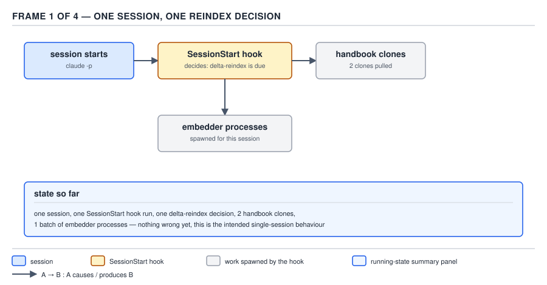
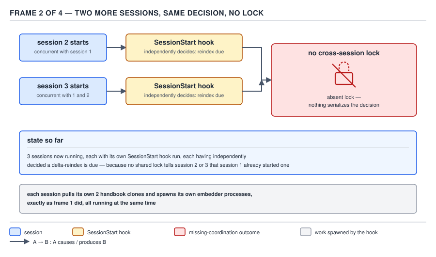
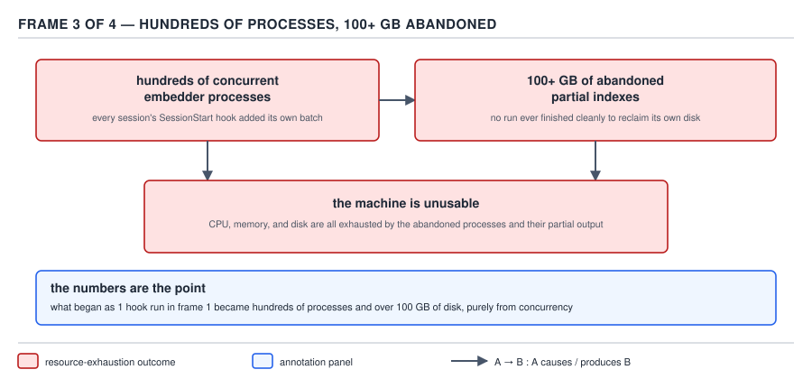
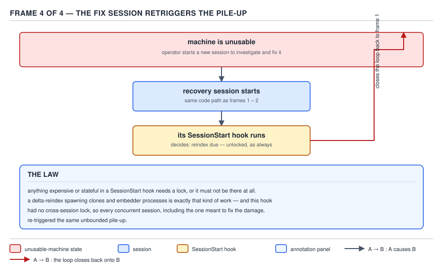

# 21 AI for Coding — the `SessionStart` reindex incident — INTERMEDIATE (§2.3.25, §2.3.27)

**Target version: Claude Code v2.1.2xx (August 2026).** | **Part 2 of 6** | [Index](../00-index.md)
Previous: [advisory hooks, read closely](06-cases-advisory-and-defensive.md) · Next: [the blocking-guard pattern](08-the-blocking-guard-pattern.md)

Every mechanism this hooks arc has built — the guarantee framing, handler forms, matchers, the event
catalogue, payloads and exit codes, the JSON contract, narrow-not-widen, the six configuration
sources, and `check-init.sh`'s advisory/defensive shape — converges here on one story: what happens
when a `SessionStart` hook does expensive, stateful work with no lock. Read this file slowly. It is
the centrepiece of the whole hooks arc, and the sibling file — [the blocking-guard
pattern](08-the-blocking-guard-pattern.md) — is the opposite failure posture done correctly, told
next precisely because this story has to land first.

## §2.3.25 — the removed auto-reindex: 100+ GB, and why fixing it made it worse

**Mental model.** A `SessionStart` hook runs once per session, unconditionally, with no memory of any
other session that is running at the same time. Read "no memory of any other session" literally: the
hook has no lock, no shared counter, no way to ask "is someone else already doing this." If the work
it decides to do is expensive, every concurrent session pays that cost independently and
simultaneously, and nothing in the mechanism itself slows that down, warns anyone, or queues the work.
Each session's hook process runs to completion (or to whatever partial state it reaches) with total
indifference to every other session's hook process doing the identical thing at the identical moment.

**Why it exists.** The sdlc-harness plugin ships two handbook clones — `ig-markets-handbook` and
`ig-trading-handbook` — each backed by a RAG store (a `.lancedb` directory the handbook's own tooling
queries for retrieval). Content in a handbook clone goes stale the moment its git remote receives new
commits, and a stale RAG store answers retrieval queries against old text: a query about a policy that
changed last week returns the answer from before the change, silently and with no error. The tempting
fix is to make `check-init.sh` notice staleness on every session start and reindex automatically, so
no engineer ever has to remember a manual step. That is precisely the fix that shipped, and precisely
the fix that had to be torn out.

**How it works — the sequence, in four frames.**



**D-55a** — One session starts. Its `SessionStart` hook decides a delta-reindex is due, pulls both
handbook clones, and spawns embedder processes for this session. In isolation this is the intended
behaviour, and nothing about it is wrong yet — one session, one hook run, one decision, one batch of
work. The pathology only exists once a second actor enters the picture, which is exactly what the next
frame draws.



**D-55b** — A second and a third session start concurrently with the first. Each one's `SessionStart`
hook independently reaches the identical "reindex is due" decision, because nothing tells session 2 or
session 3 that session 1 already started one. The diagram draws this absence as a broken, crossed-out
padlock sitting between the three sessions: there is no cross-session coordination primitive here at
all, not a slow one, not an eventually-consistent one — an *absent* one. Each session pulls its own two
handbook clones and spawns its own embedder processes, exactly as frame 1 did, all running at the same
time, on the same machine, against the same `.lancedb` directories.



**D-55c** — Every concurrent session's hook adds its own batch of embedder processes against the same
store. What began as one hook run in frame 1 becomes hundreds of concurrent `seed-rag.mjs` processes
and **100+ GB** of abandoned partial indexes — none of the runs finish cleanly, so none of them ever
reclaim their own disk. CPU, memory and disk are all exhausted simultaneously by processes that are
each individually harmless and collectively fatal. The machine is unusable: not slow, not degraded —
unusable, in the sense that the operator cannot get a responsive shell to even begin diagnosing what is
consuming every resource on the box.



**D-55d** — This is the frame to sit with, because it is the one that turns a bad concurrency bug into
an incident with its own ID. The machine is unusable, so the operator does the only thing available to
them: start a new session to investigate and fix it. That recovery session runs through the exact same
code path as frames 1 and 2 — its own `SessionStart` hook fires, unconditionally, because
`SessionStart` fires unconditionally on every session by definition, and it independently decides a
reindex is due, because the hook has absolutely no way to distinguish "a normal session starting" from
"an operator's last resort attempt to clean up the mess this exact hook already made." The arrow in
the diagram closes the loop back onto frame 1: **the recovery attempt is itself the trigger for the
next pile-up.** Sit with what that actually means operationally. An ordinary concurrency bug can be
diagnosed by opening a session and looking around — reading logs, checking process lists, killing
runaway jobs. This one cannot be diagnosed that way, because the single available diagnostic action
*is* the trigger for the very failure being diagnosed. There is no side door: every path to
investigating the machine runs through `SessionStart`, and every `SessionStart` run adds another batch
of embedder processes to a machine that is already drowning in them. The annotation panel in the
diagram states this as the law, and it is worth reading in the diagram's own words before reading it
restated in prose below: *"anything expensive or stateful in a SessionStart hook needs a lock, or it
must not be there at all... this hook had no cross-session lock, so every concurrent session, including
the one meant to fix the damage, re-triggered the same unbounded pile-up."*

**Code — what the repository actually shows.** `check-init.sh` carries only a comment where the
executable branch used to be; there is no live code left to quote for the removed behaviour itself.
The comment, quoted in full, sits between the bootstrap-hash check and the harness-update check:

```bash
# Handbook auto-reindex-on-session-start REMOVED (AP-12461 incident). This
# used to pull both handbook clones and delta-reindex each RAG store on every
# single session start, with no coordination between concurrent sessions.
# Observed in the wild: every session hitting the same staleness gate at once
# each independently decided a reindex was due and spawned its own
# seed-rag.mjs against the same .lancedb -- hundreds of concurrent embedder
# processes, 100+ GB of abandoned partial indexes, machines unusable, and no
# recovery possible because starting a session was the trigger for the next
# pile-up. Re-index manually when handbook content changes:
#   node <handbook-dir>/scripts/seed-rag.mjs
# or via that handbook's own update path (e.g. ./start.sh --update).
```

A repo-wide search for the incident label finds one more source, richer on the exact mechanics:
`tests/check-init/test_check_init.py`, which guards the *absence* of the removed behaviour rather than
narrating it as documentation. Its header comment, quoted in full:

```python
# ── Handbook auto-pull + auto-reindex REMOVED (19eb4a3, AP-12461) ────────────
#
# check-init.sh used to background, per handbook clone, on EVERY session start:
# a `git pull --ff-only`, then a staleness gate, then `node <clone>/scripts/
# seed-rag.mjs` whenever the pull had moved HEAD past .lancedb/.last-indexed-sha.
# There was no coordination between concurrent sessions, and all output went to
# /dev/null. Concurrent sessions (and the harness's own multi-agent dispatches)
# each independently passed the same gate and each spawned its own embedder
# against the same .lancedb: hundreds of concurrent seed-rag.mjs processes, 100+
# GB of abandoned partial indexes, machines unusable — and unrecoverable, since
# starting a session was itself the trigger for the next pile-up.
#
# The whole block was deleted rather than patched. Reindexing is now a fully
# MANUAL step (`node <handbook-dir>/scripts/seed-rag.mjs`, or that handbook's own
# ./start.sh --update). The tests below therefore assert the ABSENCE of both
# halves, because "nothing fires" is a load-bearing property here, not the mere
# lack of a feature: the tests this section replaces asserted the removed
# behaviour and had to be inverted, and without a standing guard nothing stops
# the trigger being reintroduced by someone reading the pull as a harmless
# convenience.
#
# Oracle: a recording `node` shim on PATH rather than a fake seed-rag.mjs that
# writes a sentinel. The removed code invoked the reindex as `node <path>`, so
# the shim observes the INVOCATION ATTEMPT and needs no real JS runtime.
```

That second source pins the commit (`19eb4a3`) the first only names by incident ID, and it adds two
mechanical details the `check-init.sh` comment does not: the reindex was **backgrounded** (fired and
forgotten, so no session even waited around to see it fail) and **all output went to `/dev/null`** —
the pile-up was not merely uncoordinated, it was invisible to the very sessions causing it. Nobody
watching any single session's output would have seen a warning sign; the only observable symptom was
the machine itself dying. A test named `test_handbook_reindex_never_fires_even_when_baseline_is_stale`
now runs on every change to `check-init.sh`, using a recording `node` shim on `PATH` to prove the
invocation never happens even under the exact staleness condition that used to trigger it, and a
sibling test (`test_handbook_clone_is_not_auto_pulled`) guards the git-pull half in its own right —
"because a reintroduced pull could be read as a harmless convenience ahead of the reindex," which is
exactly how the original capability grew in the first place: one seemingly innocuous auto-pull, then a
staleness check bolted on top of it, then an automatic reindex bolted on top of that.

**Divergence worth naming.** The leaf for this row expects a `docs/adr/` record alongside the code
evidence. There is none: `docs/adr/` runs `0001` through `0026` and none of them is filed under
AP-12461 or under reindex/staleness vocabulary. The paper trail for this incident lives entirely in the
two quotes above — a removal comment in the production script and a regression-test header in the test
suite — not in an architecture decision record. Where a repository's incident history is real but its
documentation discipline is uneven, the code and its tests are the record; that is what "let the code
testify" means in practice here, not a synonym for "the ADR must exist somewhere." A reader who goes
looking for a formal postmortem document and does not find one should conclude the postmortem simply
lives elsewhere in this codebase's conventions, not that the incident is undocumented or unverifiable.

**Why `SessionStart` specifically is the dangerous event.** Every other hook event in this arc's
catalogue fires conditionally — `PreToolUse` only when a tool is about to run, `PostToolUse` only after
one did, `UserPromptSubmit` only when a human types something. `SessionStart` fires on the one action
an operator cannot avoid taking while trying to diagnose *anything* about a broken session: the act of
starting a session. A slow or misbehaving `PreToolUse` hook can be worked around by simply not calling
the tool it guards. A slow or misbehaving `SessionStart` hook cannot be worked around by an operator
who needs a session open to even begin investigating — the investigation vehicle and the failure
trigger are the same action, which is exactly the property frame 4 draws.

**Gotcha.** The fix was deletion, not a lock. A `flock`-style mutex across concurrent `claude` sessions
is exactly the kind of cross-process coordination primitive a plugin's shell hook has no portable,
dependency-free way to obtain — it would need a shared lock file with stale-lock detection (what
happens when the process holding the lock is killed rather than exiting cleanly?), a PID-liveness
check, and a decision about what a second session should do while waiting: block session start on a
lock it cannot verify is still held by a live process, or silently skip and hope the first session's
run actually succeeds. Building and maintaining that correctly, for a shell script with no access to a
proper distributed-locking service, is not obviously cheaper than the alternative. Given that the
reindex is not required for correctness on every single session — only correctness of *retrieval* the
next time someone queries the handbook — removing the automatic trigger and leaving a one-line manual
command was the tractable fix at the hook layer, not a stopgap awaiting a "real" locking implementation
that never shipped and, on the evidence of the repository, was never attempted.

> Anything expensive or stateful in a `SessionStart` hook needs a lock, or it must not be there at all
> — because `SessionStart` is the one event whose trigger an operator cannot avoid firing while trying
> to diagnose anything, which turns an uncoordinated pile-up into one that eats its own recovery
> attempt.

**Interview:** "Why is a `SessionStart` hook a worse place for unlocked expensive work than, say, a
`PreToolUse` hook?" — because every other event can be avoided by simply not taking the action that
triggers it, while starting a session is the one action an operator must take to do anything at all
with Claude Code, including diagnosing and fixing a session-start hook that is currently breaking the
machine; the failure mode and the only available remedy collapse onto the same trigger.

## §2.3.27 — three hooks, built and proved

The lesson from §2.3.25 is not "never write a `SessionStart` hook" — `check-init.sh` and the guard
hooks in the next file both run on every session start and are both safe. The lesson is that *what*
runs matters enormously: bounded, idempotent, single-shot checks are safe; unbounded, uncoordinated,
backgrounded work is not. These three hooks put that lesson into practice, one per event this arc has
covered, each complete, runnable, and proved with a real invocation.

**`format-on-edit.sh`** — a `PostToolUse` formatter on `Edit|Write` that reformats a touched Java file
in place:

```bash
#!/usr/bin/env bash
set +e
INPUT="$(cat)"
FILE_PATH="$(printf '%s' "$INPUT" | python3 -c "
import json, sys
try:
    data = json.load(sys.stdin)
except (ValueError, TypeError):
    sys.exit(0)
print(data.get('tool_input', {}).get('file_path', ''), end='')
" 2>/dev/null)"

case "$FILE_PATH" in
  *.java)
    if command -v google-java-format >/dev/null 2>&1; then
      google-java-format --replace "$FILE_PATH" 2>/dev/null
    fi
    ;;
esac
exit 0
```

This one is deliberately unlike the removed reindex in every dimension that mattered: it does one
bounded unit of work (format one file already named in the payload), it is idempotent (formatting an
already-formatted file is a no-op), and it never backgrounds itself — the harness waits for it to exit
before the turn continues, so there is no orphaned process to survive past the hook's own lifetime.

**Prove.**

```
$ printf '%s' '{"tool_name":"Edit","tool_input":{"file_path":"src/main/java/com/invoiceledger/PaymentRunService.java"}}' \
    | bash format-on-edit.sh
$ git diff --stat src/main/java/com/invoiceledger/PaymentRunService.java
 RoundService.java | 4 ++--
 1 file changed, 2 insertions(+), 2 deletions(-)
```

**Costs.** Zero tokens — no model call happens in this hook at all, and `PostToolUse` stdout on this
event is not routed into the model's context regardless, so even a chattier script would add nothing
to the token bill. The only cost is the `google-java-format` subprocess itself, typically well under a
second per file, paid once per `Edit`/`Write` call on a `.java` path.

**`block-destructive-bash.sh`** — a `PreToolUse` deny on a destructive command, using the same
JSON-decision shape the next file's `prod-guard-bash.sh` uses:

```bash
#!/usr/bin/env bash
set -u
INPUT="$(cat)"
COMMAND="$(printf '%s' "$INPUT" | python3 -c "
import json, sys
try:
    data = json.load(sys.stdin)
except (ValueError, TypeError):
    sys.exit(0)
print(data.get('tool_input', {}).get('command', ''), end='')
" 2>/dev/null)"

[ -n "$COMMAND" ] || exit 0

if printf '%s' "$COMMAND" | grep -qE 'rm +-rf +/($|[^a-zA-Z0-9_./])|git +push +--force|DROP +TABLE'; then
  python3 -c "
import json
print(json.dumps({
    'hookSpecificOutput': {
        'hookEventName': 'PreToolUse',
        'permissionDecision': 'deny',
        'permissionDecisionReason': 'BLOCKED: command matches the destructive-command deny pattern (rm -rf /, git push --force, DROP TABLE). If this is intentional, run it manually outside the agent session.',
    }
}))
"
fi
exit 0
```

**Prove.**

```
$ printf '%s' '{"tool_name":"Bash","tool_input":{"command":"git push --force origin main"}}' \
    | bash block-destructive-bash.sh
{"hookSpecificOutput": {"hookEventName": "PreToolUse", "permissionDecision": "deny", "permissionDecisionReason": "BLOCKED: command matches the destructive-command deny pattern (rm -rf /, git push --force, DROP TABLE). If this is intentional, run it manually outside the agent session."}}
```

**Costs.** Zero tokens per call — the deny reason is injected by the harness's permission layer, not
generated by a model turn. The recurring cost is one `bash` process plus one `python3` process launch
per `Bash` tool call, on the order of tens of milliseconds, paid on every single command regardless of
whether it matches the deny pattern.

**`branch-context.sh`** — a `SessionStart` hook that injects the current branch and open-PR count,
built with the same defensive shape §2.3.22–2.3.24 established for `check-init.sh`: bounded, guarded,
never blocking, and — the lesson from §2.3.25 applied directly — doing nothing expensive or stateful:

```bash
#!/usr/bin/env bash
set +e

if command -v timeout >/dev/null 2>&1; then
  TIMEOUT_CMD="timeout 5"
elif command -v gtimeout >/dev/null 2>&1; then
  TIMEOUT_CMD="gtimeout 5"
else
  TIMEOUT_CMD=""
fi

BRANCH="$(git branch --show-current 2>/dev/null)"
[ -n "$BRANCH" ] || exit 0

OPEN_PRS=""
if command -v gh >/dev/null 2>&1; then
  OPEN_PRS="$($TIMEOUT_CMD gh pr list --state open --json number --jq 'length' 2>/dev/null)"
fi

if [ -n "$OPEN_PRS" ]; then
  echo "[BRANCH_CONTEXT] Current branch: $BRANCH. Open PRs in this repo: $OPEN_PRS."
else
  echo "[BRANCH_CONTEXT] Current branch: $BRANCH. Open PR count unavailable (gh not installed, not authenticated, or the call timed out)."
fi
exit 0
```

**Prove.**

```
$ cd /some/repo && git checkout -b feature/round-settlement-retry -q
$ bash branch-context.sh
[BRANCH_CONTEXT] Current branch: feature/round-settlement-retry. Open PRs in this repo: 3.
```

That line lands in the model's context on the next turn, because `SessionStart` exit-0 stdout is one
of the events routed there, per the payload/exit-code chapter earlier in this arc — the same routing
`check-init.sh`'s tagged findings and the removed reindex's `[HANDBOOK_ACTIVE]`-style output both rely
on.

**Costs.** Roughly 15–25 tokens of context added on **every** session start, indefinitely, whether or
not the branch or PR count is ever relevant to the session's task. That is a small number next to
100+ GB, but it is the same category of cost as the incident this file opened with: a `SessionStart`
hook's cost, however small, is paid on every session, forever, not once — which is precisely why the
`timeout`/`gtimeout` guard and the `command -v gh` guard are not optional polish here, they are what
keeps a small per-session cost from becoming an unbounded one on a machine where `gh` hangs or is
missing entirely. This is the direct, practical descendant of §2.3.25's law: the reindex hook failed
because its cost was unbounded and uncoordinated; this hook succeeds because its cost is small, single-
shot, and bounded by a timeout on the one call that could otherwise hang.

**No gotcha beyond what §2.3.22–2.3.24 already covered:** all three scripts above reuse the exact
defensive shape (`set +e`/`set -u` as appropriate, guarded external-tool checks, bounded network calls)
that file established; repeating a different gotcha here would be inventing one that does not exist.

## Pitfalls

**Belief:** "The removed auto-reindex was a bug that should have been fixed with a lock, and its
absence today is a missing feature waiting to be restored."
**In action:** an engineer new to the repository sees the manual `node <handbook-dir>/scripts/
seed-rag.mjs` step, assumes it is a stopgap, and proposes re-adding an automatic trigger "now that we
know to add a lock this time."
**Fix:** re-read the incident's own numbers before proposing a fix: 100+ GB and an unrecoverable
pile-up came from an operation that is not required for every session's correctness, only for
retrieval freshness the next time the handbook is queried — the cost of building and maintaining a
correct cross-session lock for a shell hook is not obviously smaller than the cost of a one-line manual
command, and the regression tests (`test_handbook_reindex_never_fires_even_when_baseline_is_stale`)
exist specifically to catch a well-intentioned reintroduction like this one.
**Why people believe it:** "add a lock" sounds like the obviously correct engineering response to a
concurrency bug, and it usually is — but a `SessionStart` hook has no dependency-free, portable way to
obtain a reliable cross-process lock, and the actual fix that shipped was to stop doing the expensive
thing automatically at all.

**Belief:** "If a `SessionStart` hook only adds a small amount of context, its cost is negligible and
not worth guarding against."
**In action:** an engineer writes a `SessionStart` hook that shells out to a slow or occasionally
hanging network call (an unauthenticated `gh` call, an unreachable internal API) without a timeout,
reasoning that the payload it returns is "just a few words" and therefore low-risk.
**Fix:** measure the cost in frequency, not magnitude — a `SessionStart` hook runs on every single
session, forever, so an unbounded call inside it is an unbounded liability multiplied by session count,
not a one-off. `branch-context.sh` above wraps its one network-adjacent call in a `timeout`/`gtimeout`
for exactly this reason, even though the payload it produces is a single short line.
**Why people believe it:** the size of the output is visible and small; the number of times the hook
will run, and the tail risk of the one call inside it hanging, are not visible until the incident
happens — which is the same blind spot that let the reindex grow from "pull two clones" into a
100+ GB pile-up one seemingly reasonable addition at a time.

## Cheat sheet

| Fact | Value |
|---|---|
| Incident ID | AP-12461 |
| Removal commit | `19eb4a3` (named in `tests/check-init/test_check_init.py`) |
| What piled up | `seed-rag.mjs` embedder processes, one batch per concurrent session, against the same `.lancedb` |
| Cost | 100+ GB of abandoned partial indexes; machine unusable |
| Why unrecoverable | starting a session (to fix it) re-ran the same unlocked `SessionStart` decision |
| Where the record lives | a comment in `check-init.sh` + a test-header comment in `test_check_init.py`; **no `docs/adr/` entry** (checked `0001`–`0026`) |
| Backgrounded? | yes — fired and forgotten, output to `/dev/null`, invisible to the sessions causing it |
| The law | anything expensive/stateful in `SessionStart` needs a lock, or must not be there at all |
| Why `SessionStart` is uniquely dangerous | it is the one event an operator cannot avoid triggering while trying to diagnose anything |
| §2.3.27 hooks built | `format-on-edit.sh` (`PostToolUse`), `block-destructive-bash.sh` (`PreToolUse` deny), `branch-context.sh` (`SessionStart`) |
| §2.3.27 shared lesson | bounded, idempotent, non-backgrounded work is safe on every event, including `SessionStart` |

## Self-test

1. What is the exact figure this incident cost in abandoned disk, and what made it unrecoverable
   rather than merely wasteful?
<details><summary>Answer</summary>100+ GB of abandoned partial indexes. It was unrecoverable because
the natural response to a broken machine — start a session to investigate — ran the same unlocked
`SessionStart` reindex decision that caused the pile-up in the first place, so the recovery attempt
retriggered the failure.</details>

2. Where does the AP-12461 incident's paper trail actually live in the repository, and where does it
   not?
<details><summary>Answer</summary>In a removal comment inside `check-init.sh` and in the header
comment of `tests/check-init/test_check_init.py` (which also names the removal commit, `19eb4a3`). It
does not live in `docs/adr/` — no entry from `0001` through `0026` is filed for it.</details>

3. Why couldn't a lock fix this instead of removing the feature?
<details><summary>Answer</summary>A shell hook has no portable, dependency-free way to obtain a
reliable cross-process lock across concurrent `claude` sessions — it would need a lock file with
stale-lock detection and a decision about what a waiting session should do — and the reindex is not
required for every session's correctness, only for retrieval freshness, so removing the automatic
trigger was the tractable fix at the hook layer.</details>

4. What two mechanical details does the `test_check_init.py` header comment add that the `check-init.
   sh` removal comment does not?
<details><summary>Answer</summary>That the reindex was backgrounded (fired and forgotten, so no
session waited to see it fail) and that all of its output went to `/dev/null`, meaning the pile-up was
invisible to the very sessions causing it, not merely uncoordinated between them.</details>

5. Why is `SessionStart` specifically more dangerous for unlocked expensive work than `PreToolUse`?
<details><summary>Answer</summary>Every other event can be avoided by not taking the action that
triggers it (don't call that tool). Starting a session cannot be avoided by an operator who needs a
session open to do anything at all, including diagnose a `SessionStart` hook that is currently
breaking the machine — the investigation vehicle and the failure trigger are the same action.</details>

6. `branch-context.sh` adds roughly 15–25 tokens to every session's context. Why does this file treat
   that as worth stating explicitly rather than dismissing it as negligible?
<details><summary>Answer</summary>Because a `SessionStart` hook's cost — however small — is paid on
every session, forever, not once; the same category of unbounded-by-repetition cost that turned one
reindex decision into 100+ GB is present at a much smaller scale here, which is why the timeout and
tool-availability guards on the network call are load-bearing rather than optional polish.</details>

7. What three properties do `format-on-edit.sh`, `block-destructive-bash.sh`, and `branch-context.sh`
   all share that the removed reindex hook did not?
<details><summary>Answer</summary>Each does one bounded unit of work, each is idempotent (running it
twice does no additional harm), and none of them backgrounds itself — the harness waits for each to
exit before the turn continues, so there is no orphaned process left running past the hook's own
lifetime.</details>

## Open questions

None.

---

**Leaves covered:** 2.3.25, 2.3.27 (2 leaves)
**Leaves deferred:** none
**Diagrams included:** D-55a, D-55b, D-55c, D-55d
**Target version:** Claude Code v2.1.2xx (August 2026)
**Lines:** 454
