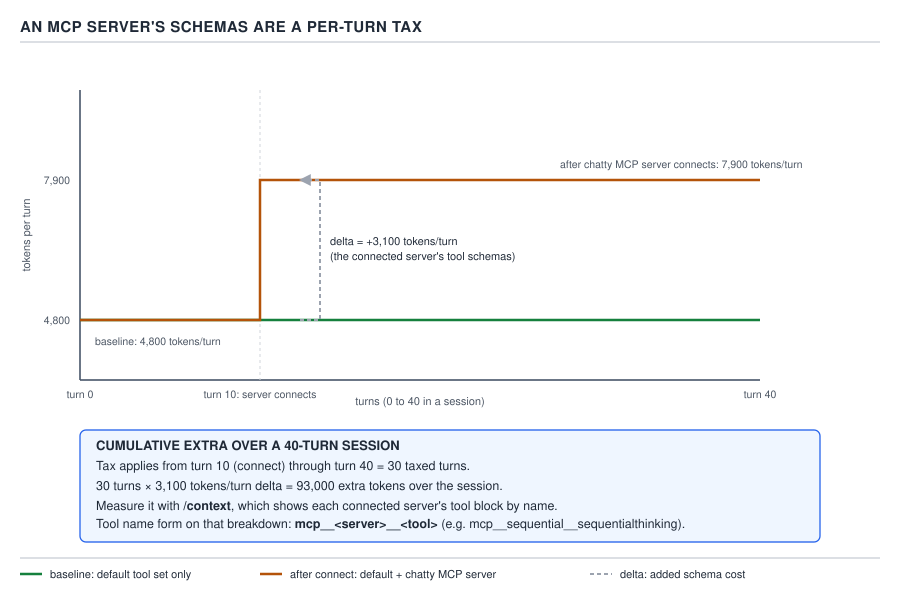

# 21 AI for Coding — the per-turn schema tax — INTERMEDIATE (§2.4.6–2.4.10)

**Target version: Claude Code v2.1.2xx (August 2026).** | **Part 2 of 6** | [Index](../00-index.md)
Previous: [MCP transports and scopes](01-basics-transports-and-scopes.md) · Next: [LSP: symbol lookup versus read-and-grep](03-lsp.md)

The previous file established what MCP is, its three transports, its four configuration scopes, where
each scope's registration actually lives on disk, and the approval gate a `project`-scope server has
to clear before it connects. None of that is repeated here. What it did not do is put a number on the
thing it kept promising: **more tools means more schemas in every request.** This file is that bill.

Two facts the reader already has make the arithmetic land without re-deriving it. §0.2.6 established
that the whole conversation is re-sent on every turn — Claude Code is stateless between calls, so
turn 40 re-transmits everything turns 1 through 39 already sent. §0.2.11 and §3.1's forward reference
established that tool schemas sit in the **stable prefix** assembled before the conversation itself —
the same fixed block on every turn, built-in tools and MCP tools alike. Put those together: an MCP
server's tool list is not a one-off cost paid once at connection time. It is added to that stable
prefix, and the stable prefix goes out **every turn** for the rest of the session. A chatty server
does not cost you once. It costs you on turn 11, and again on turn 12, and again on turn 40.

## §2.4.6 The naming form carries into permissions and hooks `[DOC]`

An MCP tool's canonical name is `mcp__<server>__<tool>` — the form the previous file already showed
you once, live, as `mcp__atlassian-cloud__addCommentToJiraIssue`. §1.4.21 covers what this form means
for the permission system in full: the three rule shapes a settings file actually recognises
(`mcp__server`, `mcp__server__*`, `mcp__server__tool`), and the trap that a **parenthesised** `mcp__`
rule — `mcp__github__create_issue(repo:internal-secrets)`, written on the mistaken assumption that an
MCP tool takes a scoped parameter the same way `Bash(git diff:*)` does — is **silently skipped** at
settings-load time, with the actual parameter-scoping mechanism being `--disallowedTools` on the
command line instead. This file does not re-teach that; the same `mcp__<server>__<tool>` string is
also what a hook's `matcher` field matches against for `PreToolUse`/`PostToolUse` on an MCP tool, and
it is the same string `/context` breaks its token report down by, which is exactly where §2.4.7 uses
it next.

## §2.4.7 The connected-server tax `[NUM]` `[PROVE]`

**Mental model.** Think of the stable prefix as a form the harness re-files with every single request,
never once left in a drawer between turns. The built-in tool catalogue is part of that form's
boilerplate. Connecting an MCP server does not attach a one-time cover letter — it rewrites the form
itself, permanently, for the rest of the session, adding one entry per tool the server exposes. Every
turn from that point on refiles the longer form.

**Why it exists.** The harness has no way to know in advance which of a session's turns will actually
call a given MCP tool, so it cannot selectively include the schema only on the turns that need it —
tool selection happens *because* the model can see the full menu on every turn, the same reasoning
§0.3.2 gave for why the built-in tool list itself is always present rather than fetched on demand. The
cost is the necessary price of the model being able to choose the tool at all.

**How it works, with real numbers.** D-56 draws the arithmetic for a concrete session: a baseline tool
set holding steady at **4,800 tokens per turn**, a chatty MCP server connecting at turn 10 and raising
that to **7,900 tokens per turn** for the remainder of the session — a delta of **+3,100 tokens per
turn**, which is that one server's tool schemas and nothing else. From turn 10 through turn 40 is 30
taxed turns; **30 × 3,100 = 93,000 extra tokens** spent over the rest of that session on schemas the
model may have called only a handful of times, or not at all.



**D-56** — An MCP server's schemas are a per-turn tax. Read the cumulative arithmetic on the canvas.

**Code — measuring it, and doing something about it.** The two things a reader can actually do about
this number are both one command each. First, measure it — `/context` is the same "single most
important habit" instrument named back in §0.4.4, and it breaks its report down by named block,
including each connected server's tool schemas under exactly the `mcp__<server>__*` grouping D-56
labels — `mcp__sequential__sequentialthinking` is the example the diagram itself gives:

```
$ claude
> /context
```

Reading that output for a server the reader is not actively using in this session is the whole
diagnosis. Second, act on it — disconnect a server that is not earning its keep:

```
claude mcp remove sequential
```

`claude mcp remove <name>` takes an optional `-s <scope>` to target a specific scope's registration;
omitted, it removes from the default (`local`) scope, the same scope §2.4.3 named as the one most
registrations land in by default.

**The counterweight — prompt caching.** Every performance claim in this guide carries its cost and its
escape hatch, and this one is no exception. §0.2.8 already established prompt caching: an unchanged
prefix is billed at the **cache-read** price, not full input price, on every turn after the first one
that includes it. A connected server's tool schemas sit inside that same stable prefix, so once the
cache is warm, the 3,100-token delta on turns 11 through 40 is not being paid at full input price 30
times over — it is a cache **write** once, at the turn the server connects (or the first turn after a
cache-affecting edit invalidates the prefix), and a cache **read** on every stable turn after that.
The tax is real — it is still more tokens moving through the request on every turn, and a cache read
is not free, it is merely cheaper than a fresh input token — but a naive "3,100 tokens × 30 turns,
all at full price" multiplication overstates the dollar cost of a session that never touches the
connecting/disconnecting boundary again. **Which dominates:** for a long, stable session that connects
a server once near the start and keeps the same tool set for the rest of the conversation, caching
dominates and the real cost is close to the cache-read rate; for a session that repeatedly connects
and disconnects servers, or edits `.mcp.json` mid-session, each change invalidates the cached prefix
from that point forward and the next turn pays a full cache write again — churn, not the schema
size alone, is what turns the tax expensive.

**Gotcha.** The 4,800/7,900 pair on D-56 is illustrative, not universal — a server with three small
tools costs far less than one with thirty verbose ones, and the reader's own baseline depends on how
many built-in tools and plugins are already active in that session. The number worth internalising is
not "3,100" specifically; it is that the delta is **permanent for the session**, multiplies by every
remaining turn, and is invisible unless you run `/context` to look for it.

> A connected MCP server's tool schemas join the stable, re-sent prefix of every turn for the rest of
> the session — a permanent per-turn tax, not a one-time cost — measurable with `/context` and
> reversible with `claude mcp remove`, and cheaper than a naive multiplication suggests once prompt
> caching prices the unchanged prefix at the cache-read rate rather than full input price.

## §2.4.8 Failure modes, and telling them apart from a permission refusal `[TRAP]`

An MCP server sits outside Claude Code's own process. Once connected, the ways it can go wrong from
inside a session are different in kind from the ways a permission rule denies a built-in tool — a
permission refusal is synchronous and self-labelled ("Claude requested permission to use
`mcp__atlassian-cloud__addCommentToJiraIssue`… denied"); every failure mode below instead looks like
an ordinary tool call that did not behave, with no permission language anywhere in it. This is exactly
the trap named in the syllabus's own worked example: earlier in this very session, a configured MCP
server (`serena`) reported `ConnectionRefused: Unable to connect. Is the computer able to access the
url?` — a **connection failure**, not evidence the server was never configured or that the capability
does not exist. The correct action on seeing that shape of message is to report the connection
failure and let the reader fix or retry it, never to conclude silently that the feature was missing.

| Failure mode | What it looks like from inside a session | How you tell it apart from a permission refusal |
|---|---|---|
| **Server will not start** | A tool call to that server returns an error immediately, or `claude mcp list` shows `✘ Failed to connect` with a transport-level cause — `ENOENT` for a bad `stdio` command (§2.4.2), or `ConnectionRefused` / a DNS failure for `http`/`sse`, exactly the shape this session's own `serena` message took | No permission prompt is ever shown or denied; the tool was never reachable to ask permission for in the first place. `claude mcp list` is the disambiguator — it names the transport-level cause, not a permission decision |
| **Server starts but a tool call errors** | The server shows connected in `claude mcp list`, but a specific tool call comes back with an error in its `tool_result` — a stale OAuth token, a malformed request the server itself rejects, a downstream API returning a 4xx/5xx the server surfaces as-is | Connection status is healthy; only the individual call fails. A permission denial never reaches the server at all, so the server-side error content (an auth message, a downstream status code) is the tell — a denied call has no server-authored error text, only Claude Code's own refusal |
| **Server hangs** | The tool call never returns; the session appears to stall mid-turn with no error and no result, until `MCP_TIMEOUT` (30 seconds by default, per `cli-reference`) elapses and the call is abandoned | A permission refusal is instantaneous — it either prompts or denies within the same turn, never leaves the model waiting. A silent multi-second stall with nothing printed is the hang signature, not a refusal |
| **Malformed tool schema** | The server registers, `claude mcp list` shows it connected, but one specific tool from it is either absent from the model's tool list entirely or the model's calls to it are rejected before they reach the server, because the schema it advertised was not valid JSON Schema | Other tools from the *same* server work normally — the fault is scoped to the one malformed tool's registration, not to the connection or to a permission rule, which would apply per rule, not per malformed schema |

**Pitfall:** the wrong belief is "if it's not a permission prompt, it isn't a permission problem, so
the server must not support this." The symptom is exactly the transcript this session produced: a
tool from a configured server fails with a network-shaped error, and the wrong conclusion is drawn
that the capability was never configured. The fix is to read the failure's own shape — a transport
error, an auth error, a timeout, or a schema rejection — and report *that*, because each one points at
a different fix (retry the connection, re-run `claude mcp login`, raise `MCP_TIMEOUT`, or ask the
server's maintainer to fix its schema respectively), none of which is "the tool doesn't exist." **Why
people believe it:** a permission denial and a connection failure both end the same way — the tool
call did not succeed — so without reading the error text closely, "it didn't work" collapses two
completely different problems into one mental bucket.

## §2.4.9 The governance keys, and which scope locks them `[DOC]`

Five keys govern whether an MCP server is reachable at all, above and beneath the per-server approval
`§2.4.4` already covered for `project`-scope `.mcp.json` entries. Quoted from `settings-reference`,
re-verified immediately before writing this leaf:

| Key | What it locks | Scope |
|---|---|---|
| `allowedMcpServers` | *"Allowlist which MCP servers people can use"* | Any file |
| `deniedMcpServers` | *"Block specific MCP servers by URL, command, or name"* | Any file |
| `allowManagedMcpServersOnly` | *"Make the managed MCP allowlist the only one that applies"* | Managed |
| `disableClaudeAiConnectors` | *"Turn off claude.ai connectors so Claude Code doesn't fetch them"* | Any file |
| `allowAllClaudeAiMcps` | *"Load the claude.ai connectors Claude Code fetches itself alongside a deployed `managed-mcp.json`"* | Managed |

`allowedMcpServers` and `deniedMcpServers` are the two an individual project or user can set from any
of the four settings files — an allowlist and a denylist over which *registered* servers may connect,
independent of the scope mechanics §2.4.3 covered (a server can be correctly registered and still be
blocked here). `allowManagedMcpServersOnly` is the MCP member of the same `allowManaged*Only` lock
family §1.2.15 already introduced for permission rules — `allowManagedPermissionRulesOnly` there,
`allowManagedMcpServersOnly` here — and it carries the identical consequence: once an organization
sets it, a developer's own `allowedMcpServers`/`deniedMcpServers` entries in a project or user file are
not merged alongside the managed list, they are simply not consulted, the same "accepted but inert"
shape as any other `allowManaged*Only` lock. `disableClaudeAiConnectors` and `allowAllClaudeAiMcps`
govern a source this file has not otherwise named — servers Claude Code fetches on its own from
claude.ai's connector registry rather than from a `claude mcp add` registration or a `.mcp.json` — and
`allowAllClaudeAiMcps` specifically exists to let those coexist with an organization's own deployed
`managed-mcp.json` allowlist rather than being shut out by it.

The whole `allowManaged*Only` family — the complete lock list beyond these two members, how several
managed sources combine with each other, and the fallback behaviour for an invalid entry inside a
managed file — belongs to `governance/02-the-lock-family.md`; this leaf names only the MCP-specific
members and the precedence they inherit. That inherited precedence is the one already established:
managed settings sit above every other layer in the five-layer stack (§1.2.2, §1.2.15), which is why
none of `--setting-sources`, a project file, or a user file can route around an `allowManaged*Only`
lock — and, as §2.4.10 shows next, why the command line's own `--mcp-config` is no exception to that
ordering either.

## §2.4.10 `--mcp-config`: per-run servers from the command line `[DOC]`

**Concept.** Every MCP registration covered so far — `local`, `user`, `project`, plugin — is
persistent: written once, loaded on every future session until removed. `--mcp-config` is the one
per-run form: it loads MCP servers from a JSON file or an inline JSON string, for that single
invocation only, with nothing written to disk on the reader's behalf.

**Code.** A full, valid `.mcp.json`-shaped file plus the command line that loads it, registering the
Atlassian server introduced in the previous file for exactly one headless run:

```json
{
  "mcpServers": {
    "atlassian-cloud": {
      "type": "http",
      "url": "https://mcp.atlassian.com/v1/mcp"
    }
  }
}
```

```
claude --mcp-config ./atlassian-run.json \
       --strict-mcp-config \
       --allowedTools "mcp__atlassian-cloud__*" \
       -p "Look up the open Jira issues assigned to me and summarize them"
```

**What `--mcp-config` does to registrations already present: adds, not replaces.** Verified directly
against the installed v2.1.251 binary (`claude --help`) immediately before writing this leaf, because
`cli-reference`'s own text describes what `--mcp-config` loads but does not itself state whether that
load is additive or exclusive: `--strict-mcp-config`'s help text reads *"Only use MCP servers from
`--mcp-config`, ignoring all other MCP configurations."* That a separate flag exists whose entire job
is to make `--mcp-config` **exclusive** is the proof that without it, `--mcp-config` is **additive** —
it layers its servers on top of whatever `local`/`user`/`project`/plugin registrations that invocation
would otherwise have loaded, rather than replacing them. Add `--strict-mcp-config` (as the command
above does) when the intent is "only this file's servers, nothing else this project or user has
registered" — a headless CI run is exactly the case that wants that isolation, so a compromised or
merely stale `user`-scope registration on the runner cannot silently participate.

`cli-reference` also documents a timing detail specific to `-p` (headless, non-interactive) runs:
*"When you pass this flag with `-p`, Claude Code waits for still-pending servers to connect before
running the first turn, up to the `MCP_TIMEOUT` startup timeout, 30 seconds by default; a server with
a cached tool list skips the wait and connects on first use. The wait requires Claude Code v2.1.221 or
later."* **[VERSION]** On an older binary than v2.1.221, that wait does not happen — a headless run
could start its first turn before a slow `--mcp-config` server had finished connecting, which is
exactly the kind of version trap this guide flags inline rather than in a footnote.

**Governance keys still apply.** `--mcp-config` is a loading mechanism, not an escape from
governance — a server it loads is still subject to `allowedMcpServers`/`deniedMcpServers` and, if an
organization has set it, `allowManagedMcpServersOnly` from §2.4.9. Managed settings outrank the
command line in the five-layer stack regardless of which flag put a server in front of the session, so
`--mcp-config` cannot register a server a managed policy has locked out.

**`requiresUserInteraction`, elicitation, and the two hook events.** Quoted from `permissions`,
re-verified immediately before writing this leaf: `dontAsk` mode *"denies... MCP tools marked
`requiresUserInteraction`... even if you've allowed them"*, and separately, *"MCP tools marked
`requiresUserInteraction` also still prompt when a hook returns `\"allow\"`."* `requiresUserInteraction`
is a flag an MCP server itself sets on one of its own tools, at registration time, meaning that tool's
call always needs a live human response — no `allow` rule, and no hook that programmatically returns
`allow`, can silence the prompt for that specific tool. **Elicitation** is the mechanism underneath
it: when a marked tool needs input mid-call, the server sends an elicitation request back through the
connection, and Claude Code surfaces it as a prompt rather than letting the model answer on the
reader's behalf. Two hook events sit around that request, per `hooks`: `Elicitation` fires *"when an
MCP server requests user input during a tool call"*, and `ElicitationResult` fires *"after a user
responds to an MCP elicitation, before the response is sent back to the server"* — both matched by MCP
server name rather than by tool name, and both documented as ignoring an exit-2 hook's
`hookSpecificOutput`, unlike the ordinary `PreToolUse`/`PostToolUse` events this guide covered earlier.

**Gotcha.** `requiresUserInteraction` is set by the *server*, not by the reader's own settings — there
is no local key that adds the flag to a tool the server did not mark that way, and no local key
removes it from one the server did. The reader's only lever over a tool marked this way is whether to
call it at all; the interaction itself cannot be pre-approved.

> `--mcp-config` loads MCP servers for one invocation only, additively unless paired with
> `--strict-mcp-config`, still subject to every governance key above it in the five-layer stack; a
> tool the server itself marks `requiresUserInteraction` always prompts regardless, via the
> `Elicitation`/`ElicitationResult` hook pair that surrounds that prompt.

## Pitfalls

- **Belief in action:** "The default tool set is what it is; connecting one more MCP server for a
  single lookup is basically free." **Surprising outcome:** the server's schemas join the stable
  prefix for the rest of the session, not just the turn that used it — D-56's arithmetic shows +3,100
  tokens/turn compounding to 93,000 extra tokens over 30 remaining turns from one server. **What
  actually gets the guarantee:** check `/context` after connecting anything, and `claude mcp remove
  <name>` a server the session is done with. **Why people believe it:** the connection itself is a
  one-time action, so it reads as a one-time cost — nothing about `claude mcp add` visually signals
  that its effect repeats on every subsequent turn.
- **Belief in action:** "This MCP tool call failed with a network-shaped error, so the feature must
  not be configured / must not exist." **Surprising outcome:** exactly this session's own `serena`
  failure — `ConnectionRefused` — is a connection problem, not an absence of capability, and treating
  it as "doesn't exist" is the wrong diagnosis and the wrong report to give back. **What actually gets
  the guarantee:** read the error's own shape from the table in §2.4.8 — transport failure, server-side
  error, hang, or malformed schema — and report that specific failure rather than concluding the
  capability is missing. **Why people believe it:** a permission denial and a connection failure both
  present as "the call didn't succeed," and without reading the error text the two collapse into one
  bucket in the reader's head.
- **Belief in action:** "`--mcp-config` on the command line replaces whatever servers were already
  registered for this project." **Surprising outcome:** it adds its servers on top of the existing
  `local`/`user`/`project`/plugin registrations — a `user`-scope registration on a CI runner is still
  live during that run unless `--strict-mcp-config` is also passed. **What actually gets the
  guarantee:** pair `--mcp-config` with `--strict-mcp-config` whenever the intent is isolation, which
  is exactly why a separate flag for it exists at all. **Why people believe it:** the flag's own name,
  "config," reads as "the configuration for this run," which sounds total rather than additive.

## Cheat sheet

| Item | Value |
|---|---|
| MCP tool naming form | `mcp__<server>__<tool>` |
| Settings-file rule forms that work | `mcp__server`, `mcp__server__*`, `mcp__server__tool` (§1.4.21) |
| Settings-file rule form that is silently skipped | any `mcp__` rule with parentheses |
| Parameter-scoping mechanism for an MCP tool | `--disallowedTools "mcp__server__tool(param:value)"` on the CLI, never a settings rule |
| D-56 baseline / after-connect / delta | 4,800 / 7,900 / +3,100 tokens per turn |
| D-56 cumulative extra over 40-turn session | 93,000 tokens (30 taxed turns × 3,100) |
| Measure the tax | `/context` |
| Remove the tax | `claude mcp remove <name> [-s <scope>]` |
| What softens the tax | prompt caching — cache-read price on an unchanged prefix, not full input price every turn |
| What defeats the caching discount | connecting/disconnecting servers or editing `.mcp.json` mid-session, invalidating the cached prefix |
| Failure modes | won't start, starts but tool call errors, hangs, malformed schema (see §2.4.8 table) |
| Tell a connection failure from a permission refusal | a refusal is instant and self-labelled; a connection failure has no permission language, only a transport/auth/timeout/schema error |
| `allowedMcpServers` / `deniedMcpServers` scope | Any file |
| `allowManagedMcpServersOnly` / `allowAllClaudeAiMcps` scope | Managed |
| Per-run server config | `--mcp-config <file-or-json...>` |
| Make per-run config exclusive | `--strict-mcp-config` |
| `--mcp-config` default behaviour | additive to existing registrations, not a replacement |
| `-p` startup wait for `--mcp-config` servers | up to `MCP_TIMEOUT` (30s default), v2.1.221+ only; cached tool lists skip the wait |
| A tool marked `requiresUserInteraction` | always prompts, even under `dontAsk` or an `allow`-returning hook |
| Hooks around an elicitation | `Elicitation` (server asks), `ElicitationResult` (after the user answers, before it's sent back) |

## Self-test

1. Why is a connected MCP server's cost described as a "per-turn tax" rather than a one-time
   connection cost?
<details><summary>Answer</summary>Because the whole conversation, including the fixed prefix that carries every tool's schema, is re-sent on every turn (§0.2.6), and a connected server's schemas join that same stable prefix. The cost is not paid once at connection time — it is paid again on every subsequent turn for the rest of the session.</details>

2. Using D-56's own figures, what is the total extra token cost of a server that connects at turn 10
   and stays connected through turn 40?
<details><summary>Answer</summary>The delta is +3,100 tokens/turn (7,900 after connecting minus 4,800 baseline), applied across 30 taxed turns (10 through 40): 30 × 3,100 = 93,000 extra tokens over the session.</details>

3. Why doesn't prompt caching make the connected-server tax disappear entirely?
<details><summary>Answer</summary>Caching prices an *unchanged* prefix at the cheaper cache-read rate rather than full input price — it lowers the cost, it doesn't zero it. The tax reappears at full cache-write cost whenever the prefix actually changes, such as connecting or disconnecting a server or editing `.mcp.json` mid-session, which invalidates the cache from that point forward.</details>

4. A tool call to a configured MCP server comes back with `ConnectionRefused`. What is the correct
   conclusion, and what is the wrong one?
<details><summary>Answer</summary>Correct: this is a connection failure — the server is unreachable right now — and should be reported as such so it can be fixed or retried. Wrong: concluding the capability was never configured or doesn't exist, which is exactly the mistake this guide names using this session's own real `serena` connection failure as the example.</details>

5. How do you tell a hung MCP tool call apart from a permission refusal?
<details><summary>Answer</summary>A permission refusal is instantaneous and self-labelled — it either prompts within the same turn or denies immediately, with no waiting. A hang produces no output at all until `MCP_TIMEOUT` (30 seconds by default) elapses; the silent multi-second stall with nothing printed is the hang's signature, not a refusal's.</details>

6. What does `allowManagedMcpServersOnly` do to a project's own `allowedMcpServers`/`deniedMcpServers`
   entries once an organization sets it?
<details><summary>Answer</summary>It is a member of the `allowManaged*Only` lock family: once set, the managed MCP allowlist becomes the only one consulted, and a project's or user's own `allowedMcpServers`/`deniedMcpServers` entries are accepted by the JSON parser but never merged in or evaluated — the same "accepted but inert" behaviour as any other `allowManaged*Only` lock.</details>

7. Does `--mcp-config` replace a project's existing MCP registrations, or add to them? What flag
   changes that?
<details><summary>Answer</summary>It adds to them by default — a `local`/`user`/`project`/plugin server already registered for that project is still loaded alongside whatever `--mcp-config` supplies. `--strict-mcp-config` makes it exclusive, restricting the session to only the servers `--mcp-config` names.</details>

8. Can a hook that returns `"allow"` silence the prompt for a tool marked `requiresUserInteraction`?
<details><summary>Answer</summary>No. `requiresUserInteraction` is documented to still prompt even when a hook returns `"allow"`, and even under `dontAsk` mode — the flag is set by the server on its own tool and cannot be overridden from the client side.</details>

## Open questions

None.

---

**Leaves covered:** 2.4.6–2.4.10 (5 leaves)
**Leaves deferred:** none
**Diagrams included:** D-56
**Target version:** Claude Code v2.1.2xx (August 2026)
**Lines:** 349
