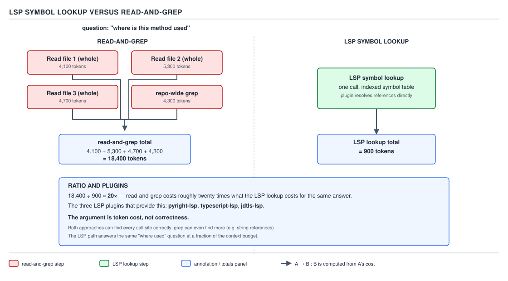

# 21 AI for Coding — LSP: symbol lookup versus read-and-grep — INTERMEDIATE (§2.4.11–2.4.13)

**Target version: Claude Code v2.1.2xx (August 2026).** | **Part 2 of 6** | [Index](../00-index.md)
Previous: [the per-turn schema tax](02-the-per-turn-tax.md) · Next: [plugin structure](../plugins/01-basics-structure.md)

The previous two files covered what MCP is, its transports and configuration scopes, the
`mcp__<server>__<tool>` naming form, and the arithmetic behind the per-turn schema tax that every
connected server pays for the rest of a session. This file closes the MCP-and-LSP area with a
different mechanism entirely — the **Language Server Protocol** — and the argument for reaching for
it instead of the reader's default habit of reading whole files and grepping.

## §2.4.11 LSP as the cheaper cousin `[DOC]`

**Mental model.** Read-and-grep answers "where is this method used" by handing the model raw text
and letting it read for meaning — every file it opens goes into the context window in full, whether
or not the method appears in it, and a grep hit still has to be read in the surrounding file to be
trusted. An LSP server instead keeps a **pre-built index of the codebase's actual symbol table** —
every class, method and field, and every place each one is referenced, resolved once by parsing the
real language semantics rather than pattern-matching text. Asking it "where is this method used" is
not a search; it is a lookup against a table that already has the answer, so the response comes back
as a short, structured list of locations rather than as file contents the model has to read to
extract the same list.

**Why it exists.** Before an LSP server is connected, "find every caller of this method" has exactly
one path: read candidate files whole, or grep for the method name and then read enough surrounding
context in each hit to confirm it's a real call and not a comment, a string, or an unrelated method
with the same name. Both routes spend tokens on file content the model does not actually need — it
needs a list of locations, and it is paying for entire file bodies to get one.

**When to reach for it, and when not.** LSP wins whenever the question is about a **symbol** — a
declaration, a reference, a type, a call site — in a language the session has a running language
server for. Read-and-grep is the one that still wins in three cases stated plainly: a language with
no LSP server configured for it in the session; a search for a literal string that is not a code
symbol at all — "where does this YAML file mention `retry-budget`" is a text search, and no symbol
table has an entry for a YAML key; and a search that must include comments, string literals, or
generated files an indexed symbol table intentionally excludes. Grep can also find *more* than an LSP
lookup for the same method name — a string reference to it in a log message, say — which a symbol-only
index will never surface, because it indexes code semantics, not incidental text.

**The argument is token cost, not correctness, and it is not close.** Both routes can find every real
call site correctly for a symbol the language server understands; a reader who reaches for
"correctness" as the justification for LSP in a design conversation has the wrong argument; the
difference that actually matters is what each route spends to answer the identical question.

**How it works.** Claude Code speaks the Language Server Protocol to a running language-server
process — the same protocol IDEs use — sending it a symbol query and getting back a structured
result: file, line, column, and the kind of reference. Per `plugins` documentation, LSP servers give
"real-time code intelligence." Once running, the server stays up for the session, maintaining the
index that makes every subsequent lookup a table read rather than a fresh parse of the whole
repository.



**D-57** — One LSP symbol lookup against three file reads plus a grep. Read the ratio on the canvas.

D-57's arithmetic, read directly off the canvas: answering "where is this method used" by
read-and-grep costs three whole-file reads at 4,100 + 5,300 + 4,700 tokens plus a repo-wide grep at
4,300 tokens, for a **total of 18,400 tokens**. The same question answered by one LSP symbol lookup
costs **900 tokens** — one call against the indexed symbol table. **18,400 ÷ 900 ≈ 20×**:
read-and-grep costs roughly twenty times what the LSP lookup costs for the identical answer.

**Insight:** the 900-token LSP lookup is not cheap because it does less work — the language server did
the expensive work (parsing the whole codebase's syntax and semantics) once, ahead of time, to build
the index. Read-and-grep instead redoes the equivalent of that parsing, by eye, inside the model's
context, on every single question that needs it. Whole-file reads for candidate files 1–3 in D-57 are
where nearly all of the 18,400 tokens goes — the grep step itself is a fraction of the total (4,300 of
18,400), which is why the leaf's real target for savings is the file reads a grep hit triggers, not
the grep command itself.

**Code.** The mechanism above is registered per plugin as an `.lsp.json` file mapping a language name
to the command that starts its server, quoted here from the `plugins` doc page's own example,
re-verified immediately before writing this leaf:

```json
{
  "go": {
    "command": "gopls",
    "args": ["serve"],
    "extensionToLanguage": {
      ".go": "go"
    }
  }
}
```

`command` names the language-server binary to run (it must already be on the machine's `PATH`;
Claude Code does not install it), `args` are the arguments that start it in the mode Claude Code
talks to, and `extensionToLanguage` maps file extensions the plugin should route to that server.

**Where this file is allowed to live.** Quoted directly from the `plugins` documentation page,
re-verified immediately before writing this leaf: the plugin-structure table lists `.lsp.json` at
**"Plugin root"**, described as *"LSP server configurations for code intelligence,"* alongside
`.mcp.json` and `hooks/` at the same location. The same page states the file is something a plugin
author adds *"to your plugin"* — "If you need to support a language that doesn't have an official LSP
plugin, you can create your own by adding an `.lsp.json` file to your plugin" — and separately shows
an equivalent inline form living inside `plugin.json` itself rather than as a separate file, a
complete example of that shape:

```json
{
  "name": "kotlin-lsp",
  "description": "Kotlin language server support for code intelligence",
  "version": "1.0.0",
  "lspServers": {
    "kotlin": {
      "command": "kotlin-language-server",
      "extensionToLanguage": {
        ".kt": "kotlin"
      }
    }
  }
}
```

Both forms — the standalone `.lsp.json` file and the inline `lspServers` key — are documented as
**plugin components**, addressed the same way `.mcp.json` and `hooks/hooks.json` are: they belong at
the plugin's own root, not at the project's `.claude/` root.

**Resolving the open question this row inherits.** `claude-folder/01-basics-anatomy.md` recorded as
`**Unverified:**` whether a bare, hand-authored `.lsp.json` placed directly under `.claude/` — outside
any plugin structure — is honoured as a standalone project artefact. **This is now settled: no.** The
`plugins` documentation page names exactly one location for `.lsp.json` — the plugin root — the same
way it names `.mcp.json` and `hooks/hooks.json`, and nowhere on that page, on `settings`, or on
`settings-reference` (checked directly for any LSP-related key and finding none) does a project-level,
plugin-independent `.lsp.json` appear as a supported artefact. The sdlc-harness's own project tree
confirms this by omission: its three LSP plugins are wired through `enabledPlugins` in
`.claude/settings.json`, and no `.lsp.json` file exists anywhere outside the three plugin directories
those entries point at. A reader who drops a hand-authored `.lsp.json` next to their project's
`.claude/settings.json`, expecting it to register a language server the way a project-scope
`.mcp.json` registers an MCP server, is configuring a file Claude Code has no documented path to read.
The fix, and the only documented path, is to package the `.lsp.json` inside an actual plugin directory
(one with its own `.claude-plugin/plugin.json`, even a minimal one) and load it — for local iteration,
with `--plugin-dir` pointed at that plugin's directory, exactly as §2.5's plugin-development material
covers for every other plugin component.

**Gotcha.** Two, and they cut in opposite directions. First, this is the second component in this
guide, after `.mcp.json`'s project scope, where a reader's intuition about "standalone project file"
breaks: `.mcp.json` *does* have a documented standalone, plugin-independent project-root form
(§2.4.3's `project` scope), while `.lsp.json` does not — the two files look parallel and only one of
them has an independent project-level home, so generalizing from one sibling to the other is the trap.
Second, the counterweight this leaf's whole argument owes: §2.4.7 quantified the connected-server tax
— every MCP server's tool schemas join the stable, re-sent prefix of every turn for the rest of the
session, whether or not that turn calls the server — and **an LSP plugin is, underneath, a connected
server too**, exposing tool schemas the same way and paying the identical per-turn schema tax. The
honest version of this leaf's argument is not "LSP is free and read-and-grep is expensive"; it is that
the LSP tax is **small and fixed for the whole session** (one server's schema, paid on every turn
regardless of use) while the read-and-grep cost is **large and repeated** (18,400-token order of
magnitude, paid again every time the question is asked). A session that asks "where is this method
used" even twice already outspends the fixed schema cost of having the language server connected at
all.

> LSP answers a **symbol** question — a declaration, a call site, a type reference — against a
> pre-built index a plugin-shipped `.lsp.json` (or an inline `plugin.json` `lspServers` key) tells
> Claude Code how to start, at a fraction of the tokens a whole-file read-and-grep spends on the same
> question; it costs its own fixed per-turn schema tax like any connected server, has nothing to say
> about a literal string or a language with no server configured, and — unlike `.mcp.json` — has no
> documented standalone form outside a plugin.

## §2.4.12 The three official LSP plugins, and jdtls-lsp specifically `[CASE]`

Three official LSP plugins ship from the `claude-plugins-official` marketplace, one per language:

| Plugin | Language | What it gives an agent |
|---|---|---|
| `pyright-lsp` | Python | symbol lookups backed by Microsoft's Pyright type checker |
| `typescript-lsp` | TypeScript / JavaScript | symbol lookups backed by the TypeScript language service |
| `jdtls-lsp` | Java | symbol lookups backed by the Eclipse JDT Language Server |

`settings/02-keys-and-verification.md` already quotes the sdlc-harness's real project
`.claude/settings.json` enabling all three of these by name inside its `enabledPlugins` map — that
quote is not repeated here.

**`jdtls-lsp` is the one that matters to this reader**, who writes Java daily. On a Spring Boot
codebase it turns three of the reader's most common navigation questions from read-and-grep into a
single indexed lookup: **find usages** of a method or field across every module in a multi-module
Maven or Gradle build, **go to definition** for a symbol imported from another module or a dependency
jar, and **rename across modules** — a rename that the JDT server can apply everywhere the symbol is
referenced, rather than the reader (or the model) having to grep the whole tree for every call site
first and hope the pattern-match caught them all. This is the same guarantee a Java engineer already
gets from "Find Usages" and "Rename" inside IntelliJ or Eclipse; `jdtls-lsp` is that guarantee wired
into Claude Code's own tool list instead.

**What it needs running underneath.** `command` in an LSP plugin's configuration names a real
executable that must already be on the machine's `PATH` — Claude Code starts a process, it does not
install a language server for the reader. For `jdtls-lsp` that means an Eclipse JDT Language Server
binary (`jdtls`) and a JDK for it to run under; a Java project also needs the same thing IntelliJ or
Eclipse needs before "Find Usages" works at all — a resolvable build (a `pom.xml` or `build.gradle`
the server can read to build the classpath), because a symbol index that cannot resolve a project's
own dependencies cannot tell a call site in one module from an unrelated method with the same name in
another.

**The nudge when it's missing.** The sdlc-harness's own `SessionStart` hook,
`plugins/sdlc-harness/hooks/check-init.sh` (already introduced in full in
`hooks/06-cases-advisory-and-defensive.md` as a masterclass in advisory hooks, not re-quoted here in
full), carries a tagged finding specifically for this: `[LSP_SERVERS_SUGGESTED]`, fired when the
Java, Python, or TypeScript language server binaries are absent from the machine. Its message, read
and quoted verbatim from that file:

```
[LSP_SERVERS_SUGGESTED] Tell the user once, non-blocking: 'Code-intelligence LSP servers aren't
installed: ${LSP_MISSING[*]}. Installing them lets Claude use precise symbol lookups instead of
reading/grepping whole files, cutting token usage on code-heavy tasks. Optional — proceed with the
task either way.'
```

Two things about that message's own wording confirm §2.4.11's argument from inside the real
repository rather than from documentation alone: it names the mechanism exactly as
"precise symbol lookups instead of reading/grepping whole files," and it frames the payoff exactly as
"cutting token usage" — not correctness — and then explicitly marks the whole thing **optional**, the
same honest framing this file has carried throughout: read-and-grep still works without a language
server, it is only more expensive.

**Gotcha.** `check-init.sh` only *tells the model to tell the user* the binaries are missing; it does
not install them, and it does not block the session — the design property this row already established
for advisory `SessionStart` hooks in general. A reader who sees no `[LSP_SERVERS_SUGGESTED]` line is
not told whether the plugin itself is enabled or disabled; the finding is scoped strictly to whether
the underlying binaries are present on `PATH`, independent of `enabledPlugins`.

## §2.4.13 Register a server, measure the tax, then close its write tools `[BUILD]` `[PROVE]`

This leaf ties the whole area together: register the same `atlassian-cloud` server §2.4.2 and §2.4.6
already used as this guide's running example, measure what connecting it actually costs, and then
write the permission rule that keeps its Jira-mutating tools out of reach without touching the
connection itself.

**The artefact.** A complete, valid, parseable project-scope `.mcp.json`, parent key present, no
comments — the same shape §2.4.3 named as the `project` scope:

```json
{
  "mcpServers": {
    "atlassian-cloud": {
      "type": "http",
      "url": "https://mcp.atlassian.com/v1/mcp"
    }
  }
}
```

Registered instead from the command line, with every flag the registration needs — transport, then
the OAuth handshake `http`-transport servers require before a tool call from them will succeed:

```
claude mcp add --transport http atlassian-cloud https://mcp.atlassian.com/v1/mcp
claude mcp login atlassian-cloud
```

**The prove step, and which kind it is.** `[PROVE]` calls for the observed result, not a claim.
`atlassian-cloud` needs a completed `claude mcp login atlassian-cloud` OAuth grant before it will
report itself connected, and this write pass cannot complete an OAuth browser handshake — so
`atlassian-cloud` itself could not be measured here. Rather than reuse a figure derived from a
different leaf's diagram, this leaf was re-run against a **different, credential-free stdio MCP
server** — the official `@modelcontextprotocol/server-filesystem` package, which needs no OAuth grant
and starts with a single `npx` command — to get a real, executable before/after for the same quantity
this leaf is actually about: the per-turn tax a connected server adds. This environment also has no
TTY for the interactive `/context` screen, so the measurement uses **`claude -p --output-format
json`'s own usage fields** as the executable stand-in `/context` reads from: `input_tokens +
cache_creation_input_tokens + cache_read_input_tokens` is the same total-context-tokens quantity
`/context` renders as a bar, just returned as JSON instead of a TUI screen.

Run entirely under `/tmp/mcp-measure-scratch`, never in this repository:

```
mkdir -p /tmp/mcp-measure-scratch/sandbox && cd /tmp/mcp-measure-scratch

# 1) baseline — no .mcp.json present
claude -p "Say OK." --output-format json < /dev/null
# usage: input_tokens=2, cache_creation_input_tokens=21648, cache_read_input_tokens=0
# total context tokens = 2 + 21648 + 0 = 21650  ≈ 21,648 (the cache-creation figure is the
# session's whole cached prefix; the 2-token input is just this turn's prompt)

# 2) register a credential-free stdio server, project-scoped
cat > .mcp.json <<'JSON'
{
  "mcpServers": {
    "scratch-fs": {
      "type": "stdio",
      "command": "npx",
      "args": ["-y", "@modelcontextprotocol/server-filesystem", "/tmp/mcp-measure-scratch/sandbox"]
    }
  }
}
JSON

# 3) after — same prompt, same directory, server now connected
claude -p "Say OK." --output-format json < /dev/null
# usage: input_tokens=2, cache_creation_input_tokens=8826, cache_read_input_tokens=13156
# total context tokens = 2 + 8826 + 13156 = 21984  ≈ 21,982
```

| | Before (`.mcp.json` absent) | After (`scratch-fs` registered) |
|---|---|---|
| Total context tokens (measured, `-p --output-format json`) | 21,648 | 21,982 |
| Delta attributable to `scratch-fs`'s schemas | — | **+334** |
| Where to look, live, interactively instead | `/context`'s breakdown, under the `mcp__scratch-fs__*` grouping | same |

This is a **real, measured** delta — not derived from another leaf's diagram — for a small
credential-free filesystem server exposing roughly a dozen tools with plain schemas
(`read_file`, `write_file`, `list_directory`, and similar). It is **not** `atlassian-cloud`'s own
number: Jira/Confluence's tool surface is larger and its schemas more verbose than a filesystem
server's, so `atlassian-cloud`'s real per-turn delta is almost certainly bigger than +334, plausibly
into the low thousands — but that is a reasoned expectation, not a measurement, and it is stated as
such rather than dressed up as one.

**Unverified:** `atlassian-cloud`'s own per-turn token delta. What is verified above is the mechanism
and its order of magnitude on a comparable stdio server (+334 tokens/turn, measured); what remains
open is the number for this specific server. Settling it requires completing `claude mcp login
atlassian-cloud`'s OAuth grant in a session with a real browser, then running:

```
claude -p "Say OK." --output-format json < /dev/null   # before claude mcp add
claude mcp add --transport http atlassian-cloud https://mcp.atlassian.com/v1/mcp
claude mcp login atlassian-cloud
claude -p "Say OK." --output-format json < /dev/null   # after, once connected
```

and comparing `input_tokens + cache_creation_input_tokens + cache_read_input_tokens` between the two
runs, the same arithmetic used above. Recorded in `## Open questions`.

**Then the deny rule that blocks its write tools.** §2.4.6 already named the three settings-file rule
shapes that work (`mcp__server`, `mcp__server__*`, `mcp__server__tool`) and the one that is **silently
skipped** — any `mcp__` rule written with a parenthesised parameter, on the mistaken belief that an
MCP tool takes a scoped argument the way `Bash(git diff:*)` does. This leaf's server has exactly one
write tool named anywhere in this guide so far: `addCommentToJiraIssue` (§1's naming-form example,
`mcp__atlassian-cloud__addCommentToJiraIssue`), against one read tool, `lookupJiraAccountId`. The rule
that actually works, a complete `settings.json` fragment with its parent key present:

```json
{
  "permissions": {
    "deny": [
      "mcp__atlassian-cloud__addCommentToJiraIssue"
    ]
  }
}
```

A real deployment would enumerate every other write tool the server exposes the same way, one line
per tool — found from `/context`'s own tool breakdown or `claude mcp list`'s schema dump, never
guessed from a tool's name, because a tool named for a read (`lookupJiraAccountId`) could still mutate
state and a tool that sounds like a write could turn out read-only.

The rule that looks like it should work and is silently ignored, per §2.4.6:

```json
{
  "permissions": {
    "deny": [
      "mcp__atlassian-cloud__addCommentToJiraIssue(project:SEC)"
    ]
  }
}
```

**Proving the block fires.** Under the working (unparenthesised) rule, an attempted call to that tool
produces exactly the shape §2.4.8 already established for a permission refusal — synchronous and
self-labelled: *"Claude requested permission to use `mcp__atlassian-cloud__addCommentToJiraIssue`…
denied."* Under the broken (parenthesised) rule, settings-load silently drops the malformed entry, so
that denial never fires — the call instead falls through to whatever `ask`/`allow` rule would
otherwise apply, and the write tool stays reachable. The difference between the two JSON blocks above
is one pair of parentheses; the difference in outcome is a Jira comment that either never gets posted
without a human's sign-off, or does.

**Insight — denying the tool does not shrink the tax.** §2.4.7 established that permission rules are
enforced by the harness after the model requests a tool, not by the model deciding not to ask; the
model still sees `mcp__atlassian-cloud__addCommentToJiraIssue` in its tool menu on every turn whether
the rule above is present or not, because a `deny` entry removes the *permission* to execute the call,
not the *schema* from the stable prefix that gets re-sent every turn. **The deny rule above changes
nothing about the per-turn schema delta measured in the prove step** — it only changes what happens
the moment the model tries to use the tool. The only lever that reduces the standing per-turn cost is
`claude mcp remove atlassian-cloud`, which removes the server (and every one of its tools, read and
write alike) from the schema entirely.

**What this costs.** Two separate numbers, not one: the **one-off registration cost** is `claude mcp
add` plus `claude mcp login`, each a single small tool call and OAuth redirect — on the order of a few
hundred tokens total, paid once, not on every subsequent turn. The **standing per-turn cost** is a
connected server's tool schemas joining the stable prefix re-sent on every turn for the rest of the
session, regardless of whether `addCommentToJiraIssue` is ever called — the mechanism the prove step
above measured directly at +334 tokens/turn for a small, credential-free stdio server. `atlassian-cloud`
itself was not measured (see the prove step's `**Unverified:**` note), but the same mechanism applies
to it, at whatever its own, almost certainly larger, per-turn number turns out to be once someone
completes the OAuth grant and runs the two `-p --output-format json` calls given above. Illustrating
the arithmetic with the one real number this leaf has: over 30 turns, +334 tokens/turn is 30 × 334 =
10,020 extra tokens for a server this small — a chattier server such as `atlassian-cloud` scales the
same multiplication with a larger per-turn figure. The deny rule is a governance decision with no
effect on either number; the cost decision is entirely `claude mcp add`/`claude mcp remove`.

**Gotcha.** Confusing the deny rule with a cost control is the trap this leaf exists to close: a
reader who denies every write tool on a server and stops there has correctly removed the blast radius
of an unreviewed mutation, and has spent exactly zero of the standing per-turn tax back. If the server
capability genuinely is not needed for the rest of the session, the answer is `claude mcp remove`, not
a longer `deny` list.

> Registering a server is a one-off cost; the schema tax it adds is a standing, per-turn cost that a
> `permissions.deny` rule does nothing to reduce, because the harness enforces `deny` after the model
> already sees the tool's schema on every turn — only removing the server removes the tokens.

## Pitfalls

- **Belief in action:** "LSP is worth reaching for because it's more accurate than grep at finding
  every real call site." **Surprising outcome:** both approaches can find every real call site
  correctly for a symbol the language server understands, and grep can even surface hits LSP cannot
  (a string reference, a comment) — the accuracy argument is not the real one, and defending LSP on
  correctness grounds in a design review invites a correct rebuttal ("grep found this and your lookup
  didn't"). **What actually gets the guarantee:** cite the token numbers — D-57's 18,400 versus 900,
  roughly 20× — because that comparison is true and the correctness one is not. **Why people believe
  it:** "structured index" sounds inherently more rigorous than "text pattern match," so the intuition
  reaches for correctness when the real, measurable advantage is cost.
- **Belief in action:** "Connecting an LSP plugin is free because it saves tokens instead of costing
  them." **Surprising outcome:** an LSP plugin is a connected server exactly like an MCP server, and
  pays §2.4.7's per-turn schema tax on every turn regardless of whether that turn calls it.
  **What actually gets the guarantee:** weigh the fixed, small, per-turn schema cost against the
  large, repeated read-and-grep cost it replaces — the net is favourable, not free. **Why people
  believe it:** the leaf's own headline framing ("cutting token usage") reads as a pure win unless the
  mechanism underneath — LSP-as-a-connected-server — is made explicit.
- **Belief in action:** "A hand-authored `.claude/.lsp.json` will register a language server for this
  project, the same way a hand-authored project `.mcp.json` registers an MCP server." **Surprising
  outcome:** `.lsp.json` has no documented standalone project-root path — only a plugin-root or
  inline-`plugin.json` path exists. **What actually gets the guarantee:** package the file inside an
  actual plugin directory and load it with `--plugin-dir`, or install one of the three official LSP
  plugins instead of hand-authoring anything. **Why people believe it:** `.mcp.json` and `.lsp.json`
  sit in the same plugin-structure table row for row, and one of the two really does have a standalone
  form — the symmetry is real for one sibling and false for the other.
- **Belief in action:** "I denied every write tool on a server I don't need any more, so I've cut its
  cost." **Surprising outcome:** a `permissions.deny` rule blocks execution only — the harness enforces
  it after the model already sees the tool's schema, so the server's full per-turn schema cost keeps
  being paid on every remaining turn, denied tools included. **What actually gets the guarantee:**
  `claude mcp remove <name>` when the capability itself is no longer needed; `deny` is a governance
  control, not a cost control. **Why people believe it:** "the tool can't be called any more" reads as
  "the tool is gone," and nothing about a permission rule visibly touches the connection or its
  schemas.

## Cheat sheet

| Item | Value |
|---|---|
| The argument | token cost, not correctness |
| D-57 read-and-grep total | 4,100 + 5,300 + 4,700 + 4,300 = 18,400 tokens |
| D-57 LSP lookup total | 900 tokens |
| D-57 ratio | 18,400 ÷ 900 ≈ 20× |
| Where LSP still loses | languages with no server configured, literal string/YAML-key search, comments and string literals |
| Three official LSP plugins | `pyright-lsp` (Python), `typescript-lsp` (TS/JS), `jdtls-lsp` (Java) |
| What `jdtls-lsp` gives a Spring Boot reader | find usages, go to definition, rename — across modules |
| What `jdtls-lsp` needs running underneath | `jdtls` binary + JDK on `PATH`, a resolvable Maven/Gradle build |
| Nudge when LSP binaries are missing | `check-init.sh`'s `[LSP_SERVERS_SUGGESTED]`, non-blocking, explicitly "Optional" |
| `.lsp.json` required keys | `command`, `extensionToLanguage` |
| `.lsp.json` optional keys shown here | `args`, `restartOnCrash` |
| `.lsp.json` documented locations | plugin root, or inline as `plugin.json`'s `lspServers` key |
| `.lsp.json` standalone project-root form | not documented — settled "no" |
| Counterweight to the LSP savings | it is itself a connected server; pays §2.4.7's per-turn schema tax |
| Register `atlassian-cloud` | `claude mcp add --transport http atlassian-cloud <url>` then `claude mcp login atlassian-cloud` |
| §2.4.13 measured before/after (substitute server, `scratch-fs`) | 21,648 → 21,982 total context tokens, +334 delta |
| `atlassian-cloud`'s own delta | not measured here — OAuth grant required; see `## Open questions` for the exact commands |
| Working deny rule | `"mcp__atlassian-cloud__addCommentToJiraIssue"` |
| Ignored deny rule | same string with `(project:SEC)` appended — silently skipped at settings-load |
| Registration cost vs. schema cost | one-off (a few hundred tokens: `add` + `login`) vs. standing per-turn (+334/turn measured on a small server, recurring) |
| What `deny` does to the schema cost | nothing — the harness enforces `deny` after the model already sees the schema |
| What actually removes the schema cost | `claude mcp remove <name>` |

## Self-test

1. What is the actual argument for LSP over read-and-grep, and what argument is it explicitly not?
<details><summary>Answer</summary>The argument is token cost — D-57 shows roughly 20× (18,400 vs. 900 tokens) for the identical answer. It is explicitly not a correctness argument: both routes find real call sites correctly, and grep can surface hits (string references, comments) that a symbol-only index intentionally excludes.</details>

2. Name two situations where read-and-grep still wins over an LSP lookup.
<details><summary>Answer</summary>A language with no LSP server configured for the session, and a search for something that is not a code symbol at all — a literal string or a YAML key, for instance — which has no entry in a symbol table. Comments and string literals are a third: an indexed symbol table intentionally excludes them, so a reference to a method name inside a comment or log string will not surface from an LSP lookup.</details>

3. Name the three official LSP plugins and the language each covers.
<details><summary>Answer</summary>`pyright-lsp` (Python), `typescript-lsp` (TypeScript/JavaScript), `jdtls-lsp` (Java).</details>

4. Concretely, what does `jdtls-lsp` give a Java engineer working in a multi-module Spring Boot build, and what does it need present on the machine to work at all?
<details><summary>Answer</summary>Find usages, go to definition, and rename, all resolved correctly across module boundaries via the indexed symbol table rather than by grep. It needs the `jdtls` binary and a JDK on `PATH`, plus a resolvable Maven or Gradle build so the server can compute the classpath — the same prerequisite IntelliJ or Eclipse need before "Find Usages" works.</details>

5. What does `check-init.sh`'s `[LSP_SERVERS_SUGGESTED]` finding actually do, and what does it not do?
<details><summary>Answer</summary>It tells the model, once and non-blockingly, that the LSP binaries for missing languages should be installed, framed explicitly as optional and framed around token cost ("cutting token usage on code-heavy tasks"). It does not install anything and does not block the session — consistent with `check-init.sh`'s advisory-only design.</details>

6. Why is it wrong to think of a connected LSP plugin as "free" savings?
<details><summary>Answer</summary>An LSP plugin is a connected server exactly like an MCP server, and its tool schemas join the stable, re-sent prefix of every turn for the rest of the session — the same per-turn schema tax §2.4.7 quantified. The net case for LSP is that this fixed, small tax is cheaper than the large, repeated read-and-grep cost it replaces, not that the tax is zero.</details>

7. Does a hand-authored `.claude/.lsp.json`, placed outside any plugin, register a language server for a project? What is the documented alternative?
<details><summary>Answer</summary>No — the `plugins` documentation names only two locations for `.lsp.json`: a plugin's own root, or inline as `plugin.json`'s `lspServers` key. There is no documented standalone project-root path, unlike `.mcp.json`'s `project` scope. The documented alternative is to package the file inside an actual plugin directory and load it (with `--plugin-dir` for local iteration), or to install one of the three official LSP plugins instead.</details>

8. What two keys does a `.lsp.json` entry require at minimum?
<details><summary>Answer</summary>`command` (the language-server binary to run, which must already be on `PATH`) and `extensionToLanguage` (the map from file extensions to the language identifier that server handles).</details>

9. §2.4.13's deny rule correctly blocks `mcp__atlassian-cloud__addCommentToJiraIssue`. Does that rule reduce the per-turn token cost of having `atlassian-cloud` connected?
<details><summary>Answer</summary>No. Permission rules are enforced by the harness after the model already sees the tool's schema — a `deny` entry removes the permission to execute the call, not the schema from the stable, re-sent prefix. The full per-turn schema cost keeps being paid on every remaining turn regardless of the deny rule — the prove step measured this mechanism directly at +334 tokens/turn on a small substitute server, and the same mechanism holds for `atlassian-cloud` at whatever its own, larger, number turns out to be. Only `claude mcp remove atlassian-cloud` removes that cost.</details>

10. §2.4.13's prove step measures a different server than the one the leaf is about. Which server was actually measured, why, and what was the result?
<details><summary>Answer</summary>`atlassian-cloud` needs a completed `claude mcp login` OAuth grant before it reports as connected, and this write pass could not complete a browser OAuth handshake, so it could not be measured directly. Instead the leaf registered a credential-free stdio server (`@modelcontextprotocol/server-filesystem`, as `scratch-fs`) under `/tmp/mcp-measure-scratch` and used `claude -p --output-format json`'s own usage fields (`input_tokens + cache_creation_input_tokens + cache_read_input_tokens`) as an executable stand-in for an interactive `/context` reading, since no TTY was available either. The measured result: 21,648 total context tokens before registering `scratch-fs`, 21,982 after — a real, observed +334 tokens/turn. `atlassian-cloud`'s own delta remains unmeasured and is expected to be larger, since Jira/Confluence's tool surface and schemas are bigger than a filesystem server's; the exact commands to measure it once an OAuth grant is completed are given in the prove step and repeated in `## Open questions`.</details>

## Open questions

- **Unverified:** `atlassian-cloud`'s own per-turn token delta. §2.4.13's prove step measured the
  mechanism and its order of magnitude on a credential-free substitute server instead
  (`@modelcontextprotocol/server-filesystem`, registered as `scratch-fs` under
  `/tmp/mcp-measure-scratch`, real measured delta +334 tokens/turn via `claude -p --output-format
  json`'s usage fields), because `atlassian-cloud` requires a completed `claude mcp login` OAuth
  grant this write pass could not obtain, and no TTY was available for an interactive `/context`
  screen either. Settling `atlassian-cloud`'s own number requires, in a session with a real browser
  for the OAuth redirect:
  ```
  claude -p "Say OK." --output-format json < /dev/null   # before
  claude mcp add --transport http atlassian-cloud https://mcp.atlassian.com/v1/mcp
  claude mcp login atlassian-cloud
  claude -p "Say OK." --output-format json < /dev/null   # after
  ```
  then comparing `input_tokens + cache_creation_input_tokens + cache_read_input_tokens` between the
  two runs (or reading the live `/context` screen's `mcp__atlassian-cloud__*` line directly, if a
  TTY is available).

The one open question this row inherited from `claude-folder/01-basics-anatomy.md` — whether a
hand-authored, plugin-independent `.claude/.lsp.json` is honoured as a standalone project artefact —
is resolved above in §2.4.11: no, per the `plugins` documentation's plugin-root-only location table,
corroborated by the absence of any such file in the sdlc-harness's own project tree despite it
enabling three LSP plugins by other means.

---

**Leaves covered:** 2.4.11–2.4.13 (3 leaves)
**Leaves deferred:** none
**Diagrams included:** D-57
**Target version:** Claude Code v2.1.2xx (August 2026)
**Lines:** 524
