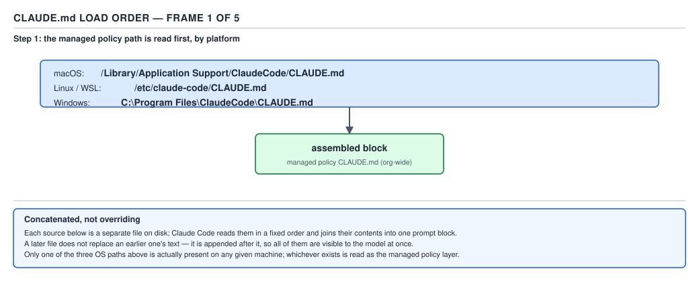
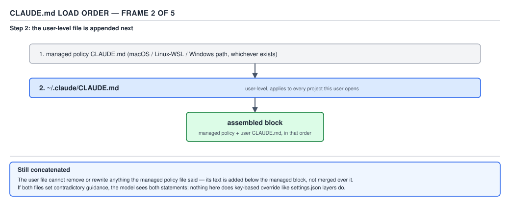
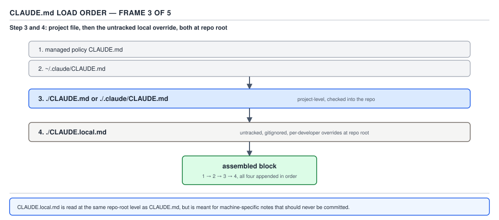
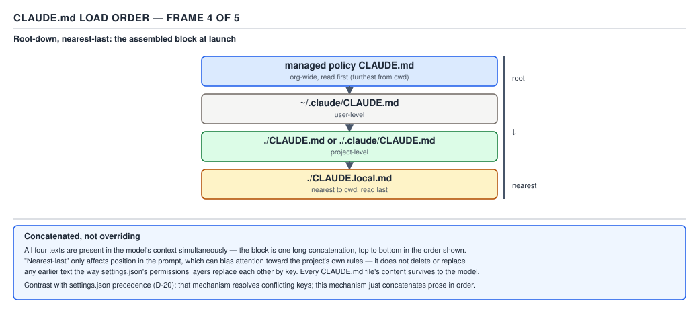
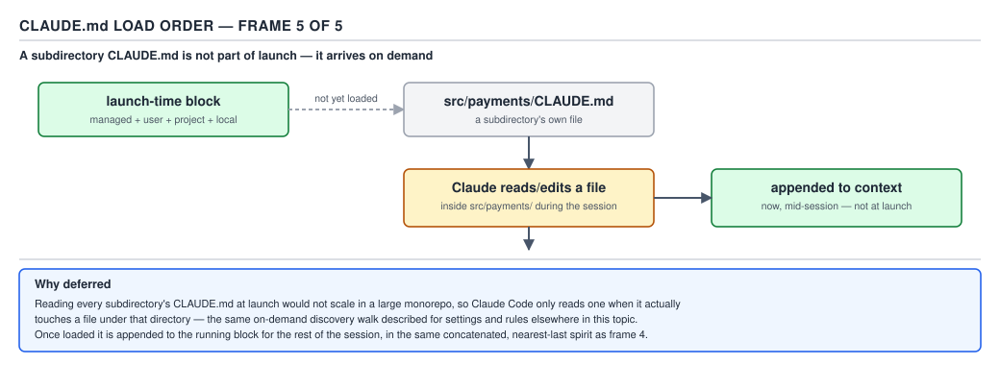
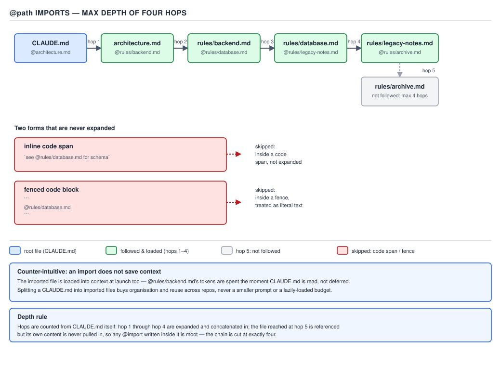

# 21 AI for Coding — `CLAUDE.md` and the memory system — BASICS (§1.3.1–1.3.13)

**Target version: Claude Code v2.1.2xx (August 2026).** | **Part 1 of 6** | [Index](../00-index.md)
Previous: [settings keys and verification](../settings/02-keys-and-verification.md) · Next: [rules and path scoping](02-rules-and-path-scoping.md)

---

This file introduces a family — the instruction-file layers Claude Code reads before your first
message even arrives. Before any detail, the shape of the family:

| Layer | Who writes it | Loaded into | Scope |
|---|---|---|---|
| `CLAUDE.md` files | You | Every session (root files); on demand (subdirectory files) | Managed policy, user, project, or local |
| Auto memory | Claude | Every session (first 200 lines / 25 KB of `MEMORY.md`) | Per repository, shared across worktrees |

**§1.3.1 — two mechanisms, clearly separated.** `CLAUDE.md` files are instructions you write.
Auto memory is notes Claude writes about you and the project as it works — your corrections, your
preferences, project context Claude can't derive from the code. Both load every session, and both
sit on the same footing once loaded: context the model reads, not configuration the harness
enforces. Auto memory's full mechanics — the four note types, `MEMORY.md` as an index, the
200-line/25 KB read limit, the storage directory, the `**Enable or disable**` toggle — are the
subject of `03-auto-memory.md`; here the two are kept separate and no more. `[DOC]`

## The sentence this file exists to land

**§1.3.2.** `CLAUDE.md` and auto memory are **context, not enforced configuration.** Claude reads
them and tries; a hook is the only guarantee. This is the most-missed fact in the whole area — say
it again: **`CLAUDE.md` and auto memory are context, not enforced configuration. Claude reads them
and tries; a hook is the only guarantee.** `[DOC]` `[TRAP]`

**Pitfall:** the wrong belief is that writing "always run `mvn -q test` before committing" into
`CLAUDE.md` makes it a rule the harness enforces, the way a `permissions.deny` entry or a branch
protection rule does. The symptom: it works four times out of five, because the model is a good
instruction-follower on a clear, unambiguous, unconflicting request — and the fifth time, under
context pressure, after a `/compact`, or because a nested `CLAUDE.md` gave a quieter contradictory
instruction, it skips the step, and the skip surfaces as a broken build two hours later with no
error, because nothing was there to stop it. The fix: if the outcome must be guaranteed regardless
of what the model decides, it is not a `CLAUDE.md` line, it is a `PreToolUse` or `PostToolUse` hook
running a real shell command — see `hooks/01-basics-what-a-hook-is.md`. The official docs draw
the same line explicitly: "Settings rules are enforced by the client regardless of what Claude
decides to do. CLAUDE.md instructions shape Claude's behavior but are not a hard enforcement
layer." (`memory`, "Deploy organization-wide CLAUDE.md")

## Concept 1 — the `CLAUDE.md` location hierarchy and how it loads

**Mental model.** Do not picture `CLAUDE.md` files the way you picture Spring's
`application.yml` → `application-{profile}.yml` → environment-variable override chain, where a
narrower source replaces a broader one key by key. Picture instead a set of `log4j` appenders all
writing into the same stream in a fixed order: nothing is replaced, everything that fires ends up
in the final buffer, and the only thing that changes with scope is *where in the buffer* your text
lands.

**Why it exists.** Three audiences need to say "always do X" without stepping on each other: an
organization needs a floor that no individual repo or developer can opt out of; a team needs
instructions checked into source control that every teammate sees; an individual needs private
preferences — a sandbox URL, a personal shortcut — that never get committed. One file could not
serve all three without either leaking secrets into git or losing the org-wide guarantee, so the
four-location hierarchy exists to let each audience write once, in the file its authority owns.

**How it works — the four locations, in load order.** `[DOC]` `[NUM]`

**§1.3.3.**

| Order | Scope | Location | Who it's for |
|---|---|---|---|
| 1 | Managed policy | per-OS, see §1.3.4 | organization-wide, cannot be excluded |
| 2 | User | `~/.claude/CLAUDE.md` | you, across every project |
| 3 | Project | `./CLAUDE.md` or `./.claude/CLAUDE.md` | the team, via source control |
| 4 | Local | `./CLAUDE.local.md` | you, this project only, gitignored |

**§1.3.4 — the managed policy paths, exactly, per the `memory` page:** `[DOC]`

- macOS: `/Library/Application Support/ClaudeCode/CLAUDE.md`
- Linux and WSL: `/etc/claude-code/CLAUDE.md`
- Windows: `C:\Program Files\ClaudeCode\CLAUDE.md`

An organization can also skip the file entirely and put the text directly in
`managed-settings.json` under the `claudeMd` key — this is honored only at the managed/policy
settings layer; setting `claudeMd` in user, project, or local settings has no effect. `[DOC]`

**§1.3.5 — concatenated, not overriding.** `[DOC]` `[PROVE]` All discovered files are concatenated
into context. They do not replace each other the way a narrower Spring property source replaces a
broader one. Across the directory tree the order runs from the filesystem root down to your
working directory, so **the file nearest where you launched Claude is read last**; within one
directory, `CLAUDE.local.md` is appended after `CLAUDE.md` at that same level, so your personal
notes are the very last thing read at that level. Composed with the four-location table above, the
full order for a session in a project root is: managed policy, then `~/.claude/CLAUDE.md`, then
`./CLAUDE.md` (or `./.claude/CLAUDE.md`), then `./CLAUDE.local.md`.

Work it through on a concrete four-level setup with a contradiction planted at two levels:

1. Managed policy (`/etc/claude-code/CLAUDE.md`): "Never commit directly to `main`; every change
   goes through a pull request."
2. User (`~/.claude/CLAUDE.md`): "Use tabs for indentation in every language you touch."
3. Project (`./CLAUDE.md`, checked into git): "Use 2-space indentation. Never commit directly to
   `main` — pair with a reviewer before merging instead."
4. Local (`./CLAUDE.local.md`, gitignored): "This is a scratch sandbox: 4-space indentation for
   throwaway scripts under `scratch/` only."

Concatenation order places these one after another in exactly that sequence — managed, user,
project, local — so by the time the model has "read" the whole memory block, the indentation
instruction it saw **most recently** is the local one, and the second-most-recent is the project
one; the user's tabs preference is the first and oldest thing said on the subject. Nothing was
deleted: all four sentences are present in context simultaneously, which is what "concatenated, not
overriding" means literally. What changes with position is recency, and recency is exactly what an
autoregressive model — one that predicts the next token from everything before it, weighting nearby
tokens more heavily by construction — leans on when two instructions cover the same ground. That is
why the hierarchy is ordered broadest-to-narrowest rather than the other way around: it puts the
most specific, most locally-relevant instruction last, where it has the best chance of winning.

**Insight:** "best chance of winning" is doing real work in that sentence, and it is not a
guarantee. The docs are direct about the failure mode: "If two files give different guidance for
the same behavior, Claude may pick one arbitrarily." Ordering biases the outcome; it does not
decide it. A genuinely contradictory pair of instructions — as opposed to a narrowing one, like
"2-space" refining "use consistent indentation" — is a bug in your `CLAUDE.md` tree regardless of
which one wins, and the fix is to remove the contradiction, not to rely on position.

**§1.3.6 — subdirectory files load on demand, not at launch.** `[DOC]` Every root-and-above
`CLAUDE.md`/`CLAUDE.local.md` in the four locations above loads at session start. A `CLAUDE.md`
sitting inside a subdirectory of your project — say `src/payments/CLAUDE.md` — is different: it is
not read at launch at all. It loads only when Claude reads a file inside that subdirectory during
the session, via the harness's own file tools. The load-timing fact has a direct context-cost
consequence: a repository can carry dozens of subdirectory `CLAUDE.md` files with detailed,
directory-specific instructions and pay **zero** startup context for the ones the session never
touches, because they are never injected until the matching directory is actually visited. This is
the reason to push detail into a subdirectory file rather than growing the root one — the root file
is a startup tax paid on every session; a subdirectory file is a tax paid only by the sessions that
actually work in that corner of the repository.



**D-23a** — the managed policy file is the first frame assembled: organization-wide, present before
anything user- or project-scoped, and not excludable by `claudeMdExcludes`.



**D-23b** — `~/.claude/CLAUDE.md` is appended next: personal, applies to every project, still ahead
of anything project-scoped.



**D-23c** — the project's `./CLAUDE.md` is appended, then `./CLAUDE.local.md` right after it at the
same level, so the gitignored personal file is the last thing read at the project's own scope.



**D-23d** — the four frames concatenated into the one memory block Claude actually sees at launch:
nothing dropped, ordered root-down, no layer overriding another.



**D-23e** — a `CLAUDE.md` inside a subdirectory sits outside that launch-time block entirely; it
is only pulled in the moment Claude reads a file in that directory, mid-session.

**Code.** The real artefact a managed policy takes when it lives inside settings rather than as a
separate file:

```json
{
  "claudeMd": "Always run `mvn -q -pl payments-service test` before committing.\nNever push directly to main; every change goes through a reviewed pull request."
}
```

This is a complete `managed-settings.json` (the file is intentionally minimal here — a real
deployment would carry additional managed keys such as `permissions` alongside `claudeMd`, but
`claudeMd` alone is a valid file). It is deployed by MDM, Group Policy, or Ansible to the per-OS
managed path from §1.3.4, and it is the only way to put policy text in front of every developer on
every repository on a machine without touching version control.

**Gotcha.** A file that exists at one of the four locations but was excluded by
`claudeMdExcludes` (project, user, local, or managed-policy settings layers — except the managed
`CLAUDE.md` file itself, which can never be excluded) never enters the concatenated block at all,
so a developer debugging "why isn't my instruction being followed" needs to check `/context`'s
**Memory files** list before assuming the model ignored a file that loaded correctly — it may
never have loaded.

> A `CLAUDE.md` file is a source of context concatenated at a fixed position determined by its
> scope; it never overrides a file from a different scope, it only competes with it for the
> model's attention by arriving earlier or later in the same block.

## Concept 2 — `@path` imports

**Mental model.** Do not think of `@path/to/file` as a lazy reference the way a Java `import`
statement is a lazy reference to a class the compiler resolves only when the symbol is used.
Think of it as literal textual inlining, the way a C preprocessor `#include` splices the target
file's bytes into the including file before anything else happens — the imported content becomes
part of the same block, at launch, whether or not the session ever needs it.

**Why it exists.** Two real problems: an already-large `CLAUDE.md` becomes easier to maintain when
it is split by topic instead of living as one 900-line wall of text, and a personal preference file
that must survive across git worktrees of the same repository (a gitignored `CLAUDE.local.md` only
exists in the worktree it was created in) needs a stable path outside any one worktree to import
from. `@path` imports solve organization and a specific worktree-sharing gap; they solve nothing
about context size (§1.3.8 below).

**When to reach for it, and when not.** Reach for it to keep a large `CLAUDE.md` navigable, to pull
a pre-existing `AGENTS.md` into Claude Code without duplicating it (`CLAUDE.md` reads `CLAUDE.md`,
never `AGENTS.md`, so a one-line `@AGENTS.md` import is the bridge), or to share one personal
preferences file across worktrees via a `~/`-rooted import. Do not reach for it believing it will
reduce what a session pays in tokens — for that, the sibling mechanism is a **path-scoped rule**
under `.claude/rules/` with `paths:` frontmatter (`02-rules-and-path-scoping.md`), which loads only
when a matching file is opened, or moving the content to a subdirectory `CLAUDE.md` (§1.3.6), which
loads only on demand.

**How it works.** `[DOC]` `[NUM]`

**§1.3.7.** `@path` is resolved **relative to the file that contains the import**, not relative to
the working directory — a `@docs/git-instructions.md` written inside `./CLAUDE.md` resolves against
the project root, and the same string written inside a subdirectory `CLAUDE.md` resolves against
that subdirectory instead. Imports are **recursive**: an imported file may itself contain further
`@path` imports, **to a maximum depth of four hops**. Import parsing explicitly **skips Markdown
code spans and fenced code blocks**, so writing `` `@README` `` inside backticks keeps the text
literal and does not trigger an import, while the same string outside backticks does.

**§1.3.9 — external imports and the approval dialog.** `[DOC]` An import in a project-level memory
file counts as **external** when its resolved path lands outside your working directory — the
canonical case is a project `CLAUDE.md` importing a file from your home directory, such as
`@~/.claude/my-project-instructions.md`, to share personal notes across worktrees. The first time
Claude Code encounters an external import in a project, it shows a one-time approval dialog listing
the files; decline it and the imports stay disabled with no further prompting. The dialog exists
because a project-level `CLAUDE.md` is something **other people can commit** to a shared repository
— an external import is a way for a checked-in file to make Claude Code read something outside the
project boundary that the reviewer of that commit may never have noticed, so the approval gate is
the same "someone else's checked-in file shouldn't silently reach outside the sandbox" reasoning
that governs project-scope hook trust. `~/.claude/CLAUDE.md` and `~/.claude/rules/`, by contrast,
are files **you** wrote yourself, so their imports load without the dialog and are trusted like the
rest of your personal configuration (with one further Cowork-session carve-out that is out of scope
here).



**D-24** — `@path` imports resolve relative to the importing file and recurse to a maximum depth of
four hops; a fifth hop is not followed.

**Code.**

```markdown
See @README for project overview and @package.json for available npm commands for this project.

# Additional instructions
- git workflow: @docs/git-instructions.md

# Individual preferences (personal, shared across worktrees)
- @~/.claude/my-project-instructions.md
```

Bridging an existing `AGENTS.md` without duplicating it:

```markdown
@AGENTS.md

## Claude Code
Use plan mode for changes under `payments-service/src/main/java`.
```

**§1.3.8 — the gotcha, and it is a `[TRAP]`.** `[DOC]` `[TRAP]` An import **does not save
context.** The imported file is expanded and loaded into context at launch alongside the file that
references it — exactly like the preprocessor `#include` in the mental model above, not like a
Java class loaded only when referenced. Splitting a 900-line `CLAUDE.md` into six 150-line imported
files buys organization and readability. It buys **zero** tokens back.

**Pitfall:** the wrong belief is "my `CLAUDE.md` was too big, so I split it into imports and now it
costs less." The symptom: a reader restructures a large file into `@docs/style.md`,
`@docs/testing.md`, `@docs/architecture.md` and three more, runs `/context`, and finds the **Memory
files** total unchanged to the token, because every one of those six files still gets expanded and
injected at launch — nothing about "imported" changes when it loads, only how the source is
organized on disk. The fix, when the actual goal is a smaller startup bill: path-scoped rules
(`02-rules-and-path-scoping.md`) that load only for matching files, or moving directory-specific
material into that directory's own `CLAUDE.md` so §1.3.6's on-demand loading applies. **Why people
believe it:** "import" is the same word Java and Python use for something that genuinely is
lazy — a symbol resolved only when the compiler or interpreter needs it — so the word itself
imports the wrong mental model along with the file.

**No gotcha beyond §1.3.8** for the depth ceiling itself: a fifth-hop import is simply not
followed, with no error and no partial load — it is a hard stop, not a surprising edge.

> An `@path` import is launch-time textual inlining with a four-hop recursion ceiling; it
> reorganizes a `CLAUDE.md` on disk and changes nothing about what loads into context or when.

## Size, cost, and writing instructions that get followed

**§1.3.10 — size guidance.** `[DOC]` `[NUM]` Target **under 200 lines** per `CLAUDE.md` file —
longer files consume more context and measurably reduce adherence to the instructions inside them.
A file over **4 MiB** is skipped entirely rather than partially loaded. Both numbers are stated on
the `memory` page verbatim: "target under 200 lines per CLAUDE.md file. Longer files consume more
context and reduce adherence" and "Claude Code loads a CLAUDE.md file of up to 4 MiB in full and
skips a larger file."

**§1.3.11 — measure what your own file actually costs.** `[PROVE]` `[NUM]` The arithmetic the leaf
asks for: **token count of the file × turns in the session = tokens spent on it**, because the
whole conversation — including every memory file loaded at launch — is re-sent to the model on
every single turn; nothing about `CLAUDE.md` is billed once and forgotten.

Measuring the reader's real global file at `~/.claude/CLAUDE.md`:

```
$ wc -l ~/.claude/CLAUDE.md
     160 /Users/rajat.chikkodikar/.claude/CLAUDE.md
$ wc -m ~/.claude/CLAUDE.md
    6871 /Users/rajat.chikkodikar/.claude/CLAUDE.md
```

160 lines, 6,871 characters. Using the standard estimate from Anthropic's own pricing FAQ — "1
token is approximately 4 characters" — that file is roughly:

```
6,871 characters ÷ 4 characters/token ≈ 1,718 tokens
```

For a session of 40 turns (a normal length for one feature-sized piece of work, not an unusually
long one):

```
1,718 tokens × 40 turns = 68,720 tokens spent on this one file, this one session
```

At Claude Sonnet 5's base input rate — **$2 per million tokens**, checked against
`https://platform.claude.com/docs/en/about-claude/pricing` on 2026-08-29 — the dollar cost of that
one file, in that one session, ignoring caching entirely:

```
68,720 tokens ÷ 1,000,000 tokens/MTok × $2/MTok = $0.137
```

Just under fourteen cents, for one file, in one session, at the sticker rate. **Insight:** in
practice this is an overestimate for most of those 40 turns, because prompt caching bills a cache
**hit** at 10% of the base input rate, and a `CLAUDE.md` sitting at a fixed, early position in
every request is exactly the kind of stable prefix a cache is built for — but the sticker-rate
number is the one to reach for when deciding whether a 900-line personal file is worth its keep,
because cache behavior is an implementation detail you do not control and should not budget
against.

**§1.3.12 — writing instructions that get followed.** `[DOC]` Four axes, each with a real
before/after pair taken from the `memory` page itself:

| Weak (aspirational / vague) | Strong (specific / verifiable) |
|---|---|
| "Format code properly." | "Use 2-space indentation." |
| "Test your changes." | "Run `npm test` before committing." |
| "Keep files organized." | "API handlers live in `src/api/handlers/`." |

The underlying axes: **specific over vague** — a rule with a concrete verb and a concrete target
beats a mood; **verifiable over aspirational** — "run `npm test`" is a thing that either happened
or didn't, "test your changes" has no check; **structured over prose** — markdown headers and
bullets scan the way a table of contents scans, a dense paragraph does not; **consistent over
contradictory** — two rules that disagree leave Claude to "pick one arbitrarily" per §1.3.5's
`[PROVE]` walk, so a periodic pass over the whole `CLAUDE.md` tree (including nested files and
`.claude/rules/`) to remove stale or conflicting lines is not housekeeping, it is the mechanism
working as designed only when there is nothing left for it to be arbitrary about.

**Interview:** "why would you ever write a *worse* instruction by accident?" — because the vague
form is usually the first draft, written before the failure mode that motivated the rule was known
in detail; "keep files organized" is what you write before you know it should have been "API
handlers live in `src/api/handlers/`", and the fix is almost always to go back and make the rule as
specific as the mistake that prompted it.

**§1.3.13 — block-level HTML comments are free.** `[DOC]` Block-level HTML comments in a
`CLAUDE.md` file are stripped **before** the content is injected into context — they cost nothing
in tokens and the model never sees them — but they remain visible to a human opening the same file
in an editor or via the Read tool. That makes them the right place for maintainer-only notes that
would be noise to the model:

```markdown
<!-- maintainer note: this rule exists because a September 2026 incident shipped a migration
     without a rollback script; do not relax it without checking with @platform-team first. -->
- Every schema migration under `db/migrations/` ships with a paired rollback script in the same PR.
```

Comments **inside** fenced code blocks are the one exception — those are preserved verbatim, since
fence contents are treated as literal text, the same rule that keeps `@path` from firing inside a
code span (§1.3.7).

## Pitfalls

- **Belief:** a `CLAUDE.md` instruction is enforced like a permission rule. **Outcome:** it is
  followed reliably until context pressure, a `/compact`, or a contradicting nested file makes it
  slip, with no error to flag the slip. **What actually gets the guarantee:** a `PreToolUse` or
  `PostToolUse` hook running a real shell command (`hooks/01-basics-what-a-hook-is.md`). **Why
  people believe it:** the instruction is written in the imperative ("always run tests") and reads
  identically to a rule, but nothing about the *sentence* changes who enforces it.
- **Belief:** splitting a large `CLAUDE.md` into `@path` imports reduces what a session pays at
  launch. **Outcome:** `/context` shows the same total, because every imported file is expanded and
  loaded at launch exactly like the file that references it. **What actually gets the guarantee:**
  path-scoped rules under `.claude/rules/` (`02-rules-and-path-scoping.md`) or a subdirectory
  `CLAUDE.md` loaded on demand (§1.3.6). **Why people believe it:** "import" is the same word Java
  and Python use for genuinely lazy loading.

## Cheat sheet

| Fact | Value |
|---|---|
| Two mechanisms | `CLAUDE.md` (you write) + auto memory (Claude writes) |
| Enforcement | Neither is enforced; only a hook is |
| Load order | Managed policy → user → project → local (root-down; `.local` after `.md` per level) |
| Managed path (macOS) | `/Library/Application Support/ClaudeCode/CLAUDE.md` |
| Managed path (Linux/WSL) | `/etc/claude-code/CLAUDE.md` |
| Managed path (Windows) | `C:\Program Files\ClaudeCode\CLAUDE.md` |
| Combination rule | Concatenated, never overriding |
| Subdirectory `CLAUDE.md` | Loads on demand, not at launch |
| `@path` resolution | Relative to the importing file |
| `@path` recursion limit | 4 hops |
| `@path` inside code span/fence | Skipped (not imported) |
| `@path` saves context? | No — imported file loads at launch too |
| External import (path outside cwd) | One-time approval dialog, project files only |
| Size target | Under 200 lines |
| Hard skip threshold | Over 4 MiB, file skipped entirely |
| HTML comments | Stripped before injection; free for maintainers |

## Self-test

1. Why is "`CLAUDE.md` instructions are enforced" a wrong belief, and what is the one thing that
   actually enforces an outcome?
<details><summary>Answer</summary>
`CLAUDE.md` is context the model reads and tries to follow; nothing in the harness checks that it
did. Only a hook — a shell command the harness itself runs at a fixed lifecycle event — is a
guarantee, because it executes regardless of what the model decides.
</details>

2. List the four `CLAUDE.md` locations in load order and state which one is read last for a session
   launched in a project root with no subdirectory files involved.
<details><summary>Answer</summary>
Managed policy, then `~/.claude/CLAUDE.md`, then `./CLAUDE.md` (or `./.claude/CLAUDE.md`), then
`./CLAUDE.local.md` — the local file is read last, since `CLAUDE.local.md` is appended after
`CLAUDE.md` at the same directory level.
</details>

3. A project has a `src/payments/CLAUDE.md`. When does it enter context, and what does that save?
<details><summary>Answer</summary>
It is not loaded at session launch. It loads only when Claude reads a file inside
`src/payments/` during the session. That saves the full token cost of the file for every session
that never touches that directory.
</details>

4. Does splitting a 900-line `CLAUDE.md` into six `@path` imports reduce the tokens spent at
   session launch? Why or why not?
<details><summary>Answer</summary>
No. Imported files are expanded and loaded into context at launch alongside the file that
references them — the split changes organization, not what loads or when.
</details>

5. What is the maximum recursion depth for `@path` imports, and what happens at a fifth hop?
<details><summary>Answer</summary>
Four hops. A fifth-hop import is not followed — no error, just not loaded.
</details>

6. Why does writing `` `@README` `` inside backticks not trigger an import?
<details><summary>Answer</summary>
Import parsing skips Markdown code spans and fenced code blocks, so an `@path`-shaped string
inside backticks is treated as literal text rather than an import directive.
</details>

7. Why does an import from `~/.claude/my-project-instructions.md` trigger a one-time approval
   dialog when referenced from a project's checked-in `CLAUDE.md`, but not when referenced from
   your own `~/.claude/CLAUDE.md`?
<details><summary>Answer</summary>
The dialog exists because a project-level `CLAUDE.md` is something other people can commit to a
shared repository, and an external import (one resolving outside the working directory) is a way
for someone else's committed file to make Claude Code read outside the project boundary. Your own
user-scope files are trusted like the rest of your personal configuration.
</details>

8. State the two hard numeric limits on `CLAUDE.md` size and what each one means in practice.
<details><summary>Answer</summary>
Target under 200 lines — longer files measurably reduce adherence. Files over 4 MiB are skipped
entirely rather than partially loaded.
</details>

9. A 160-line, 6,871-character global `CLAUDE.md` runs for 40 turns in a session. Roughly how many
   tokens does it cost across that session, and roughly how much at $2/MTok input?
<details><summary>Answer</summary>
~1,718 tokens per load (6,871 ÷ 4) × 40 turns ≈ 68,720 tokens; at $2/MTok that is about $0.137,
before any prompt-caching discount.
</details>

10. Why are block-level HTML comments in `CLAUDE.md` "free," and what is the one place inside the
    file where a comment is *not* stripped?
<details><summary>Answer</summary>
They are stripped before the content is injected into the model's context, so they cost zero
tokens while remaining visible to a human editing the file directly. Comments inside fenced code
blocks are preserved, since fence contents are treated as literal text.
</details>

## Open questions

None.

---

**Leaves covered:** 1.3.1–1.3.13 (13 leaves)
**Leaves deferred:** none
**Diagrams included:** D-23, D-24
**Target version:** Claude Code v2.1.2xx (August 2026)
**Lines:** 493
