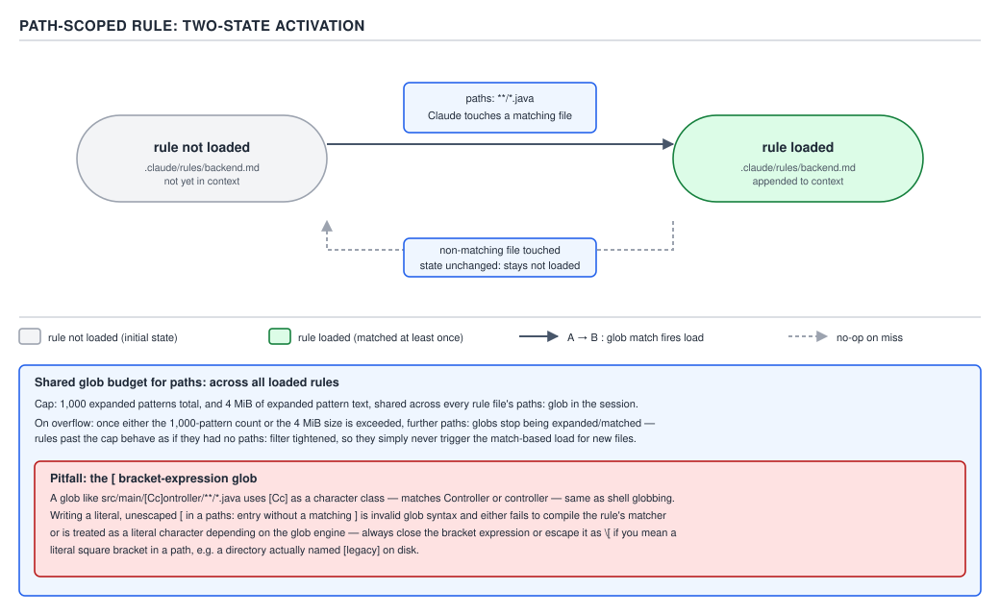

# 21 AI for Coding — rules and path scoping — BASICS (§1.3.14–1.3.20)

**Target version: Claude Code v2.1.2xx (August 2026).** | **Part 1 of 6** | [Index](../00-index.md)
Previous: [`CLAUDE.md` and the memory system](01-basics-claude-md.md) · Next: [auto memory](03-auto-memory.md)

---

The previous file established four `CLAUDE.md` locations, concatenated-not-overriding load order,
`@path` imports capped at four hops, and the load-bearing fact that all of it is **context the
model reads and tries to follow, not configuration the harness enforces.** This file adds the
mechanism that makes a genuinely large instruction set affordable, and everything else that lives
next to it: `.claude/rules/`.

## §1.3.14 — `.claude/rules/`: modular files, discovered recursively

**Mental model.** A single `CLAUDE.md` is one long memo pinned to the office wall — everyone reads
the whole thing every morning whether or not today's work touches half of it. `.claude/rules/` is a
filing cabinet of single-topic memos instead: `code-style.md`, `testing.md`, `security.md`, each
short enough to write and maintain on its own, and — for the ones covered starting at §1.3.15 —
some drawers that only open when the matching file is actually on the desk.

**Why it exists.** A project's instructions grow past what one legible file can hold: coding style,
testing conventions, security requirements, API rules, frontend rules. Cramming all of it into one
`./CLAUDE.md` produces exactly the 900-line wall the previous file warned about — worse adherence,
by the docs' own numbers (§1.3.10), and a file no one wants to open to fix one paragraph. `[DOC]`

**How it works.** `.claude/rules/` sits beside `.claude/CLAUDE.md`:

```text
your-project/
├── .claude/
│   ├── CLAUDE.md           # Main project instructions
│   └── rules/
│       ├── code-style.md   # Code style guidelines
│       ├── testing.md      # Testing conventions
│       └── security.md     # Security requirements
```

Every `.md` file under `.claude/rules/` is **discovered recursively**, so nesting the drawers —
`.claude/rules/frontend/`, `.claude/rules/backend/` — is supported and does not change discovery:
a rule three directories deep is found exactly like one sitting at the top level. `[DOC]`

**The conditional that matters.** `[DOC]` A rule file with **no `paths` frontmatter** is loaded at
launch **with the same priority as `.claude/CLAUDE.md`** — same timing, same "every session, no
matter what you touch" cost. That equivalence is the whole reason §1.3.15 exists: a rule file
without `paths` frontmatter buys organization on disk (one topic per file, easy to review, easy to
own) but buys **zero** context savings, for exactly the reason `@path` imports buy zero savings in
§1.3.8 — it still gets read into the same startup block. The savings arrive only once a rule adds
the `paths:` field, which changes *when* the rule loads rather than merely *where its text lives*.

**Insight:** two different features solve two different problems that look alike from the outside.
Splitting a 900-line `CLAUDE.md` into six imported files, or into six paths-less rule files, is an
*organization* move — smaller units, easier reviews, no change to what a session pays. Adding
`paths:` frontmatter to a rule is a *cost* move — it changes the token bill. Confusing the two is
the natural mistake, because both start with "I split a big file into smaller files."

**Code.** A plain, unconditional rule — no `paths` field, loaded every session exactly like
`.claude/CLAUDE.md`:

```markdown
# Testing conventions

- Every new `@RestController` endpoint ships with a `@WebMvcTest` slice test in the same PR.
- Prefer `assertThatThrownBy` over `try`/`catch`/`fail` for exception assertions.
- Integration tests that hit Testcontainers live under `src/test/java/**/it/`, never under
  `src/test/java/**/unit/`.
```

**Gotcha.** Rules load into context every session, or when matching files are opened — either way
they are always-in-context material, not on-demand material in the sense a skill is. `[DOC]` The
docs draw this line explicitly: for instructions that do not need to sit in context at all until a
specific task starts — a multi-step procedure, a one-off workflow — the sibling mechanism is a
**skill**, which loads only when invoked or when Claude judges it relevant to the prompt; skills are
covered in full in `skills/01-basics-what-a-skill-is.md`. A rule is for *standing* instructions
scoped by file type or subdirectory; a skill is for *procedures* invoked by task.

> A rule file is a `CLAUDE.md` fragment on disk; without `paths:` frontmatter it is loaded exactly
> like `.claude/CLAUDE.md` — recursive file discovery changes where the instruction lives, not when
> it is paid for.

## §1.3.15 — path-specific rules: the mechanism that makes a large instruction set affordable

**Mental model.** Recall the `@RestController` analogy from `01-basics-claude-md.md`'s frame: every
turn resends the whole conversation, the way a stateless controller receives the entire request body
fresh on every call. An always-on `CLAUDE.md` — or a paths-less rule — is a field on that request
body that is *always populated*, on every single call, whether or not the current call has anything
to do with it. A path-scoped rule is closer to a `@RequestParam` that is only present when the
caller actually supplies it: the field exists in the schema, but the bytes only travel on the wire
when the specific route that needs them is hit.

**Why it exists.** Put the alternative the reader already knows from §1.3.10–1.3.11 next to this:
an always-on `CLAUDE.md` is billed on *every turn of every session*, whether the session ever
touches the code area the instruction is about. A team with detailed API rules, detailed frontend
rules, and detailed security rules cannot fold all three into one always-on file without paying for
all three on every turn of every session — including the sessions that only ever touch the frontend.
**Path-specific rules are the one mechanism that makes that large an instruction set affordable at
all**: each rule loads only when Claude actually touches a file the rule's `paths` pattern matches,
so a session that never opens a matching file never pays for the rule, and a session that does pay
starts paying only from the turn it first matches.

**When to reach for it, and when not.** Reach for `paths:` frontmatter for anything scoped to a
directory or file type — API conventions, a frontend component library's rules, security
requirements for a specific service. Do not reach for it for something every session needs
regardless of what it touches (build commands, the project's top-level architecture) — that belongs
in `.claude/CLAUDE.md` itself, where the always-on cost is the correct trade because the content is
needed on every turn anyway.

**How it works.** `[DOC]` A rule file scopes itself with a `paths` field in YAML frontmatter. The
rule "only applies when Claude is working with files matching the specified patterns," and,
precisely stated: **path-scoped rules trigger when Claude reads files matching the pattern, not on
every tool use** — a `Bash` command that happens to touch the directory does not trigger the rule;
a `Read` or `Edit` of a matching file does. `[VERSION]` As of **v2.1.198**, this matching also fires
through a symlinked path into the project directory — for example, a symlinked checkout of the same
repository — so a path-scoped rule is not silently skipped just because the file was reached by a
link rather than the canonical path.



**D-25** — A path-scoped rule activates on file match.

**Code.** A complete, real path-scoped rule file, frontmatter fences and body both shown in full:

```markdown
---
paths:
  - "src/api/**/*.ts"
---

# API development rules

- Every exported handler validates its request body against a schema before touching the database;
  reject with `400` and a structured error body on failure, never a bare `500`.
- Use the project's standard error envelope, `{ "code": string, "message": string, "details"?:
  object }`, for every non-2xx response.
- New endpoints ship with an OpenAPI documentation comment block directly above the handler
  function.
```

Nothing about this frontmatter shape differs from a settings file's JSON — it is YAML, delimited by
`---` fences, sitting above a normal Markdown body — but its effect is entirely different from a
paths-less rule: this file is invisible to context until Claude reads or edits something under
`src/api/`, and it re-enters context the same way after a `/compact`, exactly as a subdirectory
`CLAUDE.md` does per §1.3.6.

**§1.3.15 — the arithmetic that makes the payoff concrete.** `[PROVE]` `[NUM]` Take a real API-rules
file the size of the one above scaled up to a realistic team file: 280 lines, roughly 8,400
characters. Using the same 4-characters-per-token estimate as §1.3.11:

```
8,400 characters ÷ 4 characters/token ≈ 2,100 tokens
```

**Case A — this content is folded into the always-on `./CLAUDE.md`.** Every turn of every session
pays for it, regardless of what that session touches. Over a 40-turn session:

```
2,100 tokens × 40 turns = 84,000 tokens
```

That number is paid identically whether the session ever opens a file under `src/api/` or not.

**Case B — the same content is a path-scoped rule under `src/api/**/*.ts`, in a session that first
touches a matching file at turn 20 and keeps working in that area for the rest of the session.**
Nothing is paid for turns 1–19; the rule enters context at turn 20 and — like every other piece of
context in a re-sent conversation — stays resident for the remaining turns because the whole
conversation is re-sent every turn (§1.3.11):

```
2,100 tokens × 21 turns (turns 20 through 40 inclusive) = 44,100 tokens
```

```
84,000 tokens (Case A) − 44,100 tokens (Case B) = 39,900 tokens saved, ≈ 47.5%
```

And the case the arithmetic does not even need to show: a session that works exclusively outside
`src/api/` all 40 turns pays **0** tokens for this rule under Case B, against the full 84,000 under
Case A. That zero, multiplied across every rule file a team never needed for a given session's task,
is what "the one mechanism that makes a large instruction set affordable" means in practice — it is
not a marginal optimization on one file, it is the difference between a `.claude/` tree that scales
to dozens of topic-scoped rule files and one that cannot.

**Gotcha.** The saving is conditional on the session's own shape: a session that touches every
matching directory from turn 1 pays close to the same total as the always-on case, because the rule
loads immediately and stays resident just as long. Path scoping does not make a rule cheaper in the
worst case; it makes the *average* session — one that only works in a fraction of the codebase —
dramatically cheaper, and it makes the *never-touches-this-area* session free.

> A path-specific rule is a `.claude/rules/` file whose `paths:` frontmatter defers its load until
> Claude reads or edits a matching file, converting an always-billed instruction into one billed
> only by the sessions that actually need it.

## §1.3.16 — `paths` glob mechanics: brace expansion, the shared budget, and the bracket pitfall

**Supporting facts, not a fresh primary concept** — the mechanism above is unchanged; these are the
rules that govern what a `paths` pattern is allowed to look like. `[DOC]` `[NUM]` `[VERSION]`

**Glob basics.** Standard glob syntax: `**/*.ts` matches every TypeScript file at any depth,
`src/**/*` matches every file under `src/`, `*.md` matches only root-level Markdown files,
`src/components/*.tsx` matches components directly inside that one directory.

**Brace expansion.** `[NUM]` A single pattern can name multiple extensions or directories with
brace groups, and **each brace group multiplies the number of expanded patterns**: `src/*.{ts,tsx}`
expands to two patterns (`src/*.ts` and `src/*.tsx`); `{a,b}/{c,d}/*.{ts,tsx}` expands to **eight**
(2 × 2 × 2), because the expansion is a full cross-product across every group in the pattern.

**The shared budget.** `[NUM]` `[VERSION]` A rule's entire `paths` list — not each individual
pattern, the whole list together — shares **one budget of 1,000 expanded patterns and 4 MiB.**
Patterns with no brace groups at all do not count against the budget. **On overflow**, Claude Code
uses any pattern that would exceed the budget **unexpanded**, and its literal, un-expanded braces
then match no files at all — the rule silently loses coverage for that one pattern rather than
erroring. As of **v2.1.217**, that overflow behaviour is the safe failure mode; **before v2.1.217**,
a `paths` value with many brace groups instead **stalled or crashed the CLI at startup** — a version
trap worth carrying explicitly, since a rule file authored against an older mental model may still
be sitting in a repository the reader inherits.

**Pitfall:** the wrong belief is that `[` always opens a harmless literal character in a glob, the
way it reads in ordinary prose. Glob syntax treats `[` as the start of a **bracket expression** such
as `[abc]` (match any one of `a`, `b`, `c`). A pattern containing a `[` that cannot be parsed as a
valid bracket expression — the syllabus's own example, `photos [2024/**` — is an **invalid**
pattern: it matches nothing, silently, while the rule's *other* patterns in the same `paths` list
keep working normally. The fix is to escape the literal bracket: `photos \[2024/**`. `[VERSION]`
**Before v2.1.207**, this failure mode was far worse — one invalid pattern in a rule's `paths` list
made the Read tool **fail outright for every file the rule was evaluated against**, instead of
today's behaviour of that one pattern matching nothing while the rest of the list is unaffected. A
reader who has heard "one bad glob breaks the whole rule" learned the pre-v2.1.207 behaviour; state
both.

**Code.** Multiple patterns and brace expansion together, in one real rule:

```markdown
---
paths:
  - "src/**/*.{ts,tsx}"
  - "lib/**/*.ts"
  - "tests/**/*.test.ts"
---

# TypeScript conventions

- Exported functions carry an explicit return type; no inferred `any` leaks across a module
  boundary.
- Test files import from the package's public entry point, never from an internal `src/` path.
```

`src/**/*.{ts,tsx}` expands to two patterns; the other two lines carry no braces and count as one
pattern each; the list's total expanded-pattern count here is four, nowhere near the 1,000 budget.

## §1.3.17 — user-level rules: same root-down logic as `CLAUDE.md`

**Supporting fact.** `[DOC]` Personal rules in `~/.claude/rules/` apply to every project on the
machine — the right place for preferences that are not project-specific, the same audience
`~/.claude/CLAUDE.md` serves in §1.3.3's table. **User-level rules load before project rules,
which is what gives project rules higher priority** — this is the identical root-down, nearest-last
principle from §1.3.5's `CLAUDE.md` concatenation order, applied to a second file family rather than
a second rule: broader scope loads earlier, narrower scope loads later and gets the recency
advantage an autoregressive model leans on when two instructions cover the same ground. It is one
principle governing two mechanisms, not two separate rules to memorize.

**Symlinks are supported, and cycles are handled.** `[DOC]` `.claude/rules/` — at either scope —
resolves symlinks normally, which is how a team shares one canonical rules directory across many
projects instead of copy-pasting it:

```bash
ln -s ~/shared-claude-rules .claude/rules/shared
ln -s ~/company-standards/security.md .claude/rules/security.md
```

Both link forms work: an entire shared directory linked in as a subdirectory, or a single shared
file linked in directly. **Circular symlinks are detected and handled gracefully** — a cycle does
not hang discovery or crash the session.

**Gotcha.** None beyond the ordering fact above: the mechanism is the same load-order principle
already proven out for `CLAUDE.md`, applied to a directory of files instead of four fixed locations.

## §1.3.18 — `AGENTS.md`: Claude Code does not read it

**Mental model.** `AGENTS.md` is a convention several coding agents settled on independently, the
way `.gitignore` is a convention every VCS-adjacent tool recognizes without a shared specification
behind it. Claude Code did not adopt the filename.

**Why it exists** (as a gotcha, not a feature). A repository that already serves several coding
agents commonly carries an `AGENTS.md` written for those other tools. The gotcha this leaf exists to
correct: **Claude Code reads `CLAUDE.md`, not `AGENTS.md`.** `[DOC]` A repository that has only an
`AGENTS.md` and no `CLAUDE.md` gives Claude Code nothing at session start — not a degraded read, a
complete absence, since a file it never opens contributes zero context regardless of how detailed it
is.

**Pitfall:** the wrong belief is "Claude Code will pick up `AGENTS.md` automatically, the way it
picks up `CLAUDE.md`" — a natural assumption for anyone who has used another agent that does exactly
that, or anyone who assumes "it's just an instructions file, any agent will find it." The symptom:
the reader writes a careful `AGENTS.md`, opens a fresh Claude Code session, and none of it shows up
in `/context`'s **Memory files** list, with no error to explain why — because there was nothing to
error on. The fix is one of the two workarounds below; simply renaming the file is not a workaround
most teams want, since it breaks the other agents that do read `AGENTS.md` by that name.

**How it works — two workarounds, both `[DOC]`.**

1. **The `@AGENTS.md` import.** Create a `CLAUDE.md` whose entire job is to import the existing
   file, then append anything Claude-specific below the import — exactly the `@path` import
   mechanism from `01-basics-claude-md.md`'s Concept 2, applied to this specific bridging use:

   ```markdown
   @AGENTS.md

   ## Claude Code

   Use plan mode for changes under `src/billing/`.
   ```

   Claude loads the imported file at session start, then appends the Claude-specific section after
   it — one file that both tools keep reading, with no duplicated content to drift out of sync.

2. **The symlink.** Where there is nothing Claude-specific to add, a symlink is simpler:

   ```bash
   ln -s AGENTS.md CLAUDE.md
   ```

   The command prints no output on success; confirm it worked by running `/context` in the next
   session and checking that `CLAUDE.md` appears under **Memory files**.

**Why the import is preferable on Windows.** `[DOC]` Creating a symlink on Windows requires
**Administrator privileges or Developer Mode** — a machine-level capability many developer laptops
do not have enabled by default, and one a team cannot assume every teammate can grant themselves.
The `@AGENTS.md` import needs no elevated privilege at all; it is a plain Markdown line any editor
can write. On a mixed-OS team, the import is the version that works unconditionally, while the
symlink is the version that silently fails to set up for exactly the teammates on Windows machines
without Developer Mode enabled — for that reason, prefer the import as the default and treat the
symlink as a same-OS convenience rather than the general answer.

**Gotcha.** `/init` reads `AGENTS.md` into the generated `CLAUDE.md` when
`CLAUDE_CODE_NEW_INIT=1` is set (alongside `.devin/rules/`, `.windsurf/rules/` /
`.windsurfrules`, and `.clinerules`); without that environment variable, `/init` reads only Cursor
rules and Copilot instructions. `[VERSION]` Separately, `/import` (Claude Code **v2.1.213** or
later) appends a one-time copy of `AGENTS.md` and similar files into the matching `CLAUDE.md` and
also carries over MCP servers, commands, subagents and skills from the source agent's configuration
— a broader one-time migration rather than the standing bridge the `@AGENTS.md` import provides.

## §1.3.19 — `claudeMdExcludes` for monorepos

**Supporting fact.** `[DOC]` In a large monorepo, a session working in one team's directory still
discovers and loads every ancestor `CLAUDE.md` above it in the tree by default — including files
written by teams whose instructions are irrelevant to the current work. `claudeMdExcludes` lets a
developer skip specific files or globs from that load. Three properties, all load-bearing:

| Property | Statement |
|---|---|
| Match target | Patterns are matched against **absolute** file paths using glob syntax — not paths relative to the project root or the working directory |
| Where it can be set | **Any settings layer**: user, project, local, or managed policy; **arrays merge across layers** rather than the narrowest layer replacing the others |
| What it cannot touch | It **cannot exclude the managed policy `CLAUDE.md`** — that file always applies, "regardless of individual settings," which is the guarantee an organization-wide floor depends on |

**Code.** A complete, valid exclusion block — the two example exclusions from the documentation,
placed in `.claude/settings.local.json` so the exclusion stays local to one machine rather than
being pushed onto the whole team:

```json
{
  "claudeMdExcludes": [
    "**/monorepo/CLAUDE.md",
    "/home/user/monorepo/other-team/.claude/rules/**"
  ]
}
```

The first pattern skips any top-level `CLAUDE.md` literally named that way anywhere under a
`monorepo` directory; the second skips an entire rules directory belonging to another team, by its
absolute path. Both entries are ordinary glob patterns evaluated against the absolute filesystem
path Claude Code resolves for each candidate memory file — not against a path typed relative to
wherever the session happened to launch.

**Gotcha.** Because arrays merge across layers rather than override, a developer debugging "why is
this file still excluded even though I removed the entry from my local settings" needs to check
**every** settings layer — user, project, local, and managed policy — for a `claudeMdExcludes` entry
that could still be contributing the exclusion, the same multi-layer check §1.3.8's gotcha already
trained the reader to run for `/context`'s **Memory files** list.

## §1.3.20 — `claudeMd` in managed settings

**Supporting fact.** `[DOC]` The `claudeMd` key lets an organization put managed `CLAUDE.md` content
**directly inside `managed-settings.json`**, instead of deploying a separate file to the per-OS
managed path from §1.3.4. **Honoured only at managed/policy scope** — setting `claudeMd` in user,
project, or local settings has **no effect at all**, which is the same one-scope restriction
`01-basics-claude-md.md` already noted in passing and this leaf now states as its own numbered fact.
Precedence is identical to a managed `CLAUDE.md` file dropped on disk: it loads before user and
project `CLAUDE.md`.

**Code.** A complete, valid `managed-settings.json` — no comments, since JSON has none; the
explanation sits in the prose beside it, never inside the object:

```json
{
  "claudeMd": "Always run `make lint` before committing.\nNever push directly to main."
}
```

**Gotcha.** `claudeMd` and `permissions.deny` in the same managed-settings file solve different
problems and are easy to reach for interchangeably by mistake: `claudeMd` is behavioral guidance the
model reads and tries to follow (no stronger a guarantee than any other `CLAUDE.md` content, per
this file's opening reminder); blocking a tool, command, or path outright — the guarantee `claudeMd`
cannot give — is `permissions.deny`, enforced by the client regardless of what the model decides.
Reach for `claudeMd` for "always run `make lint`"; reach for `permissions.deny` for "never allow
`aws s3 rm` to run at all."

## Pitfalls

- **Belief:** Claude Code reads `AGENTS.md` automatically, the same way it reads `CLAUDE.md`.
  **Outcome:** a carefully written `AGENTS.md` contributes zero context to a Claude Code session,
  with `/context`'s **Memory files** list showing nothing for it and no error raised. **What
  actually gets the guarantee:** a `CLAUDE.md` that opens with `@AGENTS.md`, or `ln -s AGENTS.md
  CLAUDE.md` on non-Windows machines. **Why people believe it:** several other coding agents do
  read `AGENTS.md` by convention, and "it's just an instructions file" makes the convention feel
  universal when it is not.
- **Belief:** a `[` in a `paths` glob is always a harmless literal character. **Outcome:** a pattern
  like `photos [2024/**` is parsed as an invalid bracket expression and silently matches nothing,
  while every other pattern in the same rule keeps working — the rule appears to work, minus the
  one directory the broken pattern was supposed to cover. **What actually gets the guarantee:**
  escaping the bracket, `photos \[2024/**`. **Why people believe it:** `[` reads as ordinary
  punctuation in prose and in most non-glob path syntaxes; only glob dialects reserve it for
  bracket-expression matching.
- **Belief:** folding a project's rule files into `.claude/rules/` without `paths:` frontmatter
  already saves context, the way moving code into a shared module saves duplication. **Outcome:**
  every paths-less rule loads at launch with the same priority as `.claude/CLAUDE.md` — identical
  cost to leaving the content in one big file. **What actually gets the guarantee:** adding a
  `paths:` field so the rule defers its load until a matching file is touched (§1.3.15's 84,000 vs.
  44,100 token arithmetic). **Why people believe it:** splitting one large file into several smaller
  files reads as an optimization in almost every other engineering context.

## Cheat sheet

| Fact | Value |
|---|---|
| Discovery | `.claude/rules/*.md`, recursive, subdirectories allowed |
| Rule with no `paths` | Loaded at launch, same priority as `.claude/CLAUDE.md` |
| Rule with `paths` | Loaded only when Claude reads/edits a matching file |
| Path match trigger | File read/edit, not every tool use |
| Symlink path matching | Works as of v2.1.198 |
| Brace expansion example | `{a,b}/{c,d}/*.{ts,tsx}` → 8 patterns |
| Shared `paths` budget | 1,000 expanded patterns / 4 MiB per rule |
| Budget overflow | Offending pattern used unexpanded; its literal braces match nothing |
| Overflow crash fixed | v2.1.217 (before: stall/crash at startup) |
| Invalid `[` pattern | Matches nothing; other patterns in the rule unaffected |
| `[` isolation fixed | v2.1.207 (before: broke the Read tool for every file the rule covered) |
| User rules location | `~/.claude/rules/`, all projects |
| User vs. project rule order | User loads first, project loads later → project wins on recency |
| Symlinked rules | Supported; circular symlinks detected and handled |
| `AGENTS.md` | Not read directly; bridge via `@AGENTS.md` import or `ln -s AGENTS.md CLAUDE.md` |
| Import vs. symlink on Windows | Import preferred — symlink needs Admin/Developer Mode |
| `claudeMdExcludes` match target | Absolute file paths, glob syntax |
| `claudeMdExcludes` scope | Any settings layer; arrays merge |
| `claudeMdExcludes` cannot touch | Managed policy `CLAUDE.md` |
| `claudeMd` (managed settings) | Inline org instructions; honoured only at managed scope |

## Self-test

1. A rule file in `.claude/rules/` has no `paths` frontmatter. When does it load, and at what
   priority relative to `.claude/CLAUDE.md`?
<details><summary>Answer</summary>
It loads at session launch, with the same priority as `.claude/CLAUDE.md` — identical cost to
folding its content directly into that file.
</details>

2. Why is a path-scoped rule "the one mechanism that makes a large instruction set affordable,"
   rather than just a nice-to-have?
<details><summary>Answer</summary>
Because it is the only mechanism (unlike paths-less rules or `@path` imports, both of which load at
launch regardless) that defers loading until Claude actually touches a matching file — a session
that never opens a matching file pays zero tokens for the rule, which is what lets a team maintain
dozens of topic-scoped rule files without every session paying for all of them.
</details>

3. `src/*.{ts,tsx}` and `{a,b}/{c,d}/*.{ts,tsx}` — how many expanded patterns does each produce, and
   what is the shared budget for a rule's whole `paths` list?
<details><summary>Answer</summary>
Two, and eight (a full cross-product across every brace group). The whole `paths` list shares one
budget of 1,000 expanded patterns and 4 MiB; patterns without braces don't count against it.
</details>

4. A `paths` pattern is written as `photos [2024/**`. What happens to it, and to the rule's other
   patterns?
<details><summary>Answer</summary>
It is an invalid bracket expression and matches nothing — silently. The rule's other patterns
continue to work normally (as of v2.1.207; before that version, one invalid pattern broke the Read
tool for every file the rule was evaluated against).
</details>

5. User-level rules in `~/.claude/rules/` load before project rules. What does that ordering give
   project rules, and what earlier fact from this memory area does it mirror?
<details><summary>Answer</summary>
It gives project rules higher priority via recency — the same root-down, nearest-last logic that
orders `CLAUDE.md`'s four locations (managed → user → project → local) in `01-basics-claude-md.md`.
</details>

6. Does Claude Code read `AGENTS.md` directly? Name both workarounds and state which one is
   preferable on Windows and why.
<details><summary>Answer</summary>
No. The workarounds are a `CLAUDE.md` that opens with `@AGENTS.md` (optionally followed by
Claude-specific content), or `ln -s AGENTS.md CLAUDE.md`. The import is preferable on Windows
because creating a symlink there requires Administrator privileges or Developer Mode, while the
import needs no elevated privilege.
</details>

7. State the three properties of `claudeMdExcludes`: what it globs against, where it can be set, and
   what it cannot exclude.
<details><summary>Answer</summary>
It globs against absolute file paths; it can be set at any settings layer (user, project, local,
managed policy) and those arrays merge across layers; it cannot exclude the managed policy
`CLAUDE.md`, which always applies regardless of individual settings.
</details>

8. Where is the `claudeMd` key honoured, and what happens if it is set in a project's
   `.claude/settings.json`?
<details><summary>Answer</summary>
Only at managed/policy scope. Setting it in user, project, or local settings has no effect at all.
</details>

## Open questions

None.

---

**Leaves covered:** 1.3.14–1.3.20 (7 leaves)
**Leaves deferred:** none
**Diagrams included:** D-25
**Target version:** Claude Code v2.1.2xx (August 2026)
**Lines:** 527
