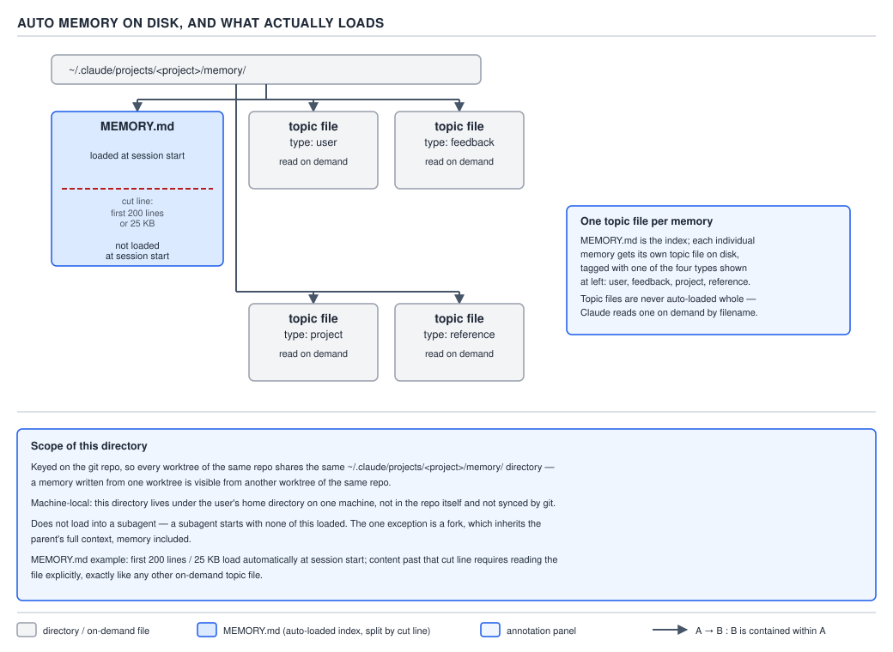
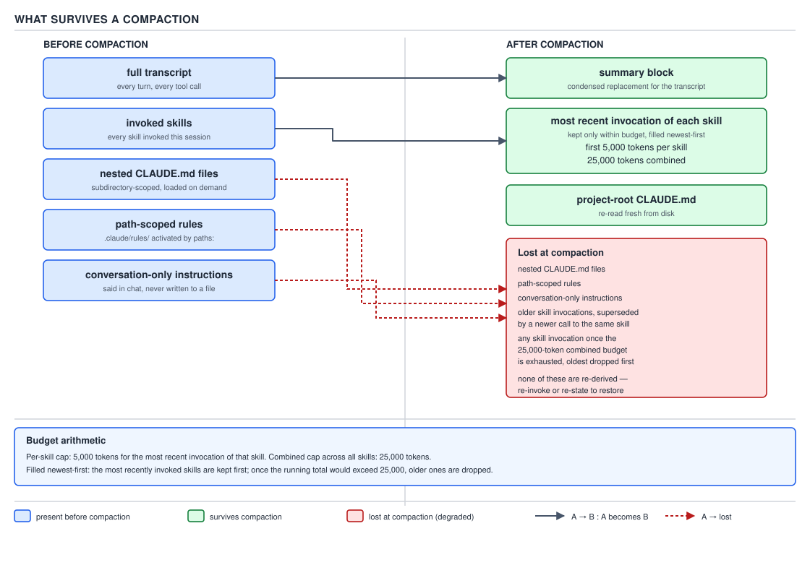

# 21 AI for Coding — auto memory — BASICS (§1.3.21–1.3.28)

**Target version: Claude Code v2.1.2xx (August 2026).** | **Part 1 of 6** | [Index](../00-index.md)
Previous: [rules and path scoping](02-rules-and-path-scoping.md) · Next: [your own instruction files, costed](04-your-own-instruction-files.md)

---

The previous two files covered `CLAUDE.md`'s four locations and concatenated load order, `.claude/rules/`
and its `paths:` frontmatter, and the load-bearing fact underneath all of it: every one of those files
is context the model reads and tries to follow, never configuration the harness enforces. Everything in
this file is a second, independent memory mechanism that sits beside `CLAUDE.md` rather than replacing
it — one you do not write, because Claude writes it for itself.

## §1.3.21 — Auto memory: the four things Claude writes down for itself

**Mental model.** A `CLAUDE.md` file is a memo you leave on Claude's desk before it starts work — you
wrote every line, you control every edit, and it says exactly what you put there. Auto memory is
Claude's own notebook, kept next to that memo: after a session where you correct it, tell it something
about yourself, or hand it context it has no other way to reconstruct, Claude jots a note in its own
words so the next session does not require you to say the same thing twice. You never dictate the
notebook's contents directly — you shape what ends up in it by what you correct and confirm.

**Why it exists.** Before auto memory, every fact that did not live in `CLAUDE.md` had to be re-typed
into chat every session it mattered: "I prefer pnpm, not npm," "the API tests need a local Redis
instance running first," "we decided against the caching layer last sprint, don't suggest it again."
Writing all of that into `CLAUDE.md` by hand works but puts the burden on the human to notice, phrase,
and commit the instruction. Auto memory moves that burden onto Claude: it notices during the
conversation, writes the note itself, and the fact persists into the next session without you doing
anything beyond the correction you were already making.

**When to reach for it, and when not.** `CLAUDE.md` is for content you author deliberately —
build commands, conventions, "always do X" rules a whole team should see in version control. Auto memory
is for the residue of a working session — your personal preferences, corrections you gave Claude,
project context Claude cannot derive from the code or git history. If you find yourself wanting to
promote a recurring auto-memory note into a standing team rule, that is a `CLAUDE.md` edit, not
something to leave to auto memory to keep re-deriving session after session.

**How it works — the four types.** `[DOC]` Claude records the kind of note as a `type` field in the
memory file's own YAML frontmatter, and the documentation names exactly four:

| Type | What it holds |
|---|---|
| `user` | your role, expertise, and working preferences |
| `feedback` | corrections you give Claude and approaches you confirm |
| `project` | ongoing work, deadlines, and decisions that Claude can't derive from the code or git history |
| `reference` | where to find information outside the project, such as an issue tracker or dashboard |

**What it deliberately skips.** `[DOC]` Two categories never turn into a memory, by design:

```
Claude skips anything it can derive from the codebase, such as architecture, file
paths, or debugging fixes. It also skips anything your CLAUDE.md files already say.
```

Both exclusions protect the same budget from the same waste: a memory that duplicates something
Claude could re-derive by reading the repository, or duplicates a line already sitting in `CLAUDE.md`,
would be paid for twice for zero new information.

**It does not save every session.** `[DOC]` Quoted directly:

```
Claude doesn't save something every session. It decides what's worth remembering
based on whether the information would be useful in a future conversation.
```

A quiet session where nothing corrective or preference-revealing happened produces zero new memory
files — this is a judgment call Claude makes, not a fixed cadence.

**No gotcha stated for this leaf beyond the two exclusions above** — the interesting mechanics (where
the four types live on disk, what loads and when, the subagent boundary, the compaction behaviour) are
each their own leaf below.

> Auto memory is four kinds of self-written note — `user`, `feedback`, `project`, `reference` — that
> Claude saves when it judges something worth remembering, skipping anything derivable from the code
> or already stated in `CLAUDE.md`.

## §1.3.22–1.3.23 — Storage layout and the 200-line / 25 KB load limit

**Mental model.** Picture a per-repository filing cabinet Claude keeps for itself, separate from the
project's own files. The cabinet has one master index card pinned to the front — short enough to
glance at every time you open the drawer — and behind it, one folder per topic, each folder opened
only when that specific topic comes up.

**Why it exists.** A flat pile of memory notes with no index would force Claude to read every note
every session just to know what it has, which is exactly the always-on cost `CLAUDE.md` already pays
and auto memory is trying not to duplicate. Splitting "what exists" (the index) from "the detail"
(topic files) lets the cheap part load automatically and the expensive part load only on demand.

**How it works.** `[DOC]` Each project gets its own directory:

```
~/.claude/projects/<project>/memory/
├── MEMORY.md           # Index, one line per memory, loaded into every session
├── user_role.md        # One memory
├── feedback_testing.md # One memory
└── ...                 # Any other topic files Claude creates
```

Three properties of that path, all load-bearing:

| Property | Statement |
|---|---|
| Keying | `<project>` is derived from the git repository, so **all worktrees and subdirectories within the same repo share one auto memory directory** |
| Locality | Auto memory is **machine-local**; files are not shared across machines or cloud environments |
| Retention | The normal session-transcript cleanup sweep (`cleanupPeriodDays`) **excludes the memory directory** — `MEMORY.md` and topic files stay until you or Claude edits or deletes them |

`[DOC]` Outside a git repository the project root is used in place of the repo path, so the sharing
rule degrades to "one directory per working tree" rather than disappearing.

**§1.3.23 — the load limit.** `[DOC]` `[NUM]` Quoted directly:

```
The first 200 lines of MEMORY.md, or the first 25KB, whichever comes first, are
loaded at the start of every conversation. Content beyond that threshold is not
loaded at session start.
```

Two numbers, and either one can be the binding constraint — a 25 KB file of very short lines can blow
the 200-line limit before it reaches 25 KB, and a 200-line file of very long lines can blow the 25 KB
limit before it reaches 200 lines. **Topic files never load automatically at all:** `[DOC]`

```
Claude Code doesn't load topic files such as user_role.md or feedback_testing.md
at startup. Claude reads them on demand using its standard file tools when it
needs the information.
```

**What happens when the index exceeds the limit.** `[DOC]` `[NUM]` This is a graduated response, not
an outright failure:

1. After every write to `MEMORY.md`, Claude Code measures the file against both limits.
2. **Near a limit** — Claude Code reminds Claude to shorten it: one line per entry, move detail into
   topic files, merge or drop stale entries.
3. **Over a limit** — the write still succeeds on disk, but Claude Code returns an error telling
   Claude to rewrite the index, because **everything past the limit is silently dropped on the next
   load** — not an error the human sees, a quiet truncation the next session simply never receives.

`[DOC]` This 200-line / 25 KB ceiling applies only to `MEMORY.md`; a `CLAUDE.md` file loads in full up
to 4 MiB and is skipped entirely past that size — a different limit for a different file, worth
keeping separate in your head from the `CLAUDE.md` "target under 200 lines" style guidance in
`01-basics-claude-md.md`, which is an adherence recommendation, not an enforced cutoff the way
`MEMORY.md`'s limit is.

**§1.3.24 — the toggles.** `[DOC]` `[VERSION]` Auto memory is **on by default**. Five knobs govern it:

| Knob | Effect |
|---|---|
| `/memory` command, auto memory toggle | Flips `autoMemoryEnabled` in **user** settings (`~/.claude/settings.json`) |
| `autoMemoryEnabled: false` in a project's `.claude/settings.json` | Disables it for that one project only |
| `autoMemoryDirectory` (any settings scope: user, project, local, policy, `--settings`) | Relocates the memory directory; must be absolute or start with `~/` |
| `CLAUDE_CODE_DISABLE_AUTO_MEMORY=1` | Disables auto memory via environment variable |
| `modified` frontmatter timestamp | An ISO 8601 write-time stamp Claude Code adds to a memory file that already has frontmatter |

**[VERSION]** The `modified` field is version-gated: quoted directly, "The `modified` field requires
Claude Code v2.1.214 or later." Below that version a memory file's frontmatter never grows the field,
and — stated explicitly in the docs — **Claude Code never adds frontmatter to a file that has none**,
so a pre-existing, frontmatter-less topic file stays that way even after an upgrade to v2.1.214; only
files that already carry frontmatter gain the timestamp on their next write.

**Diagram.**



**D-26** — Auto memory on disk, and what actually loads.

Read the picture as answering §1.3.21–§1.3.23 and §1.3.25 together: which four types of note get
written, where the index and the topic files sit on disk, which of them the 200-line/25 KB gate lets
through at session start versus which stay on the shelf until read on demand, and — the boundary
covered next — which of that loaded material a subagent actually receives.

**Code.** A realistic `MEMORY.md` index and one topic file it points at, both plain Markdown, both
things you could open in an editor today:

```markdown
<!-- ~/.claude/projects/rough/memory/MEMORY.md -->
# Memory index

- `user_role.md` — reader is prepping topic-21 AI-for-Coding notes; treat doc claims as needing
  WebFetch re-verification before writing.
- `feedback_testing.md` — reader corrected a `[CASE]` quote that paraphrased instead of quoting
  verbatim; always paste the fenced block from the real file.
- `project_pipeline.md` — this repository runs two independent pipelines (day/week vs per-topic);
  do not apply day/week generation rules to per-topic files.
```

```markdown
<!-- ~/.claude/projects/rough/memory/feedback_testing.md -->
---
type: feedback
modified: 2026-08-21T14:03:00Z
---

Reader flagged that an earlier `[CASE]` leaf paraphrased a quoted file instead of
quoting it verbatim. Going forward: read the file first, paste the exact fenced
block, then explain it — never reconstruct a quote from memory.
```

**Gotcha.** The index is the only thing paid for automatically; a topic file with genuinely useful
detail is invisible to a session unless Claude's own judgment calls for reading it on demand — which
means an over-detailed `MEMORY.md` line that never prompts Claude to open the topic file behind it is
functionally the same as a memory that was never written.

> Auto memory stores one `MEMORY.md` index plus one topic file per memory under
> `~/.claude/projects/<project>/memory/`, keyed on the git repository so worktrees share it; only the
> first 200 lines or 25 KB of the index loads automatically, and topic files load only when Claude
> reads them on demand.

## §1.3.25 — Auto memory does not load into a subagent

**Mental model.** The main conversation's auto memory is furniture in the main conversation's room.
A subagent gets its own room, built fresh from its own definition — it does not walk into the main
conversation's room and see the furniture there, unless that subagent is specifically a fork of the
conversation rather than an independently-defined agent.

**Mechanism.** `[DOC]` Quoted directly:

```
The main conversation's auto memory isn't loaded into subagents; the exception is
a fork, which inherits the parent conversation and system prompt. A subagent's own
auto memory, enabled with the subagent memory field, is a separate directory.
```

**The consequence, stated plainly.** If the reader is relying on something Claude wrote to auto
memory in the main conversation — "reader prefers `pnpm`," "this project's tests need Redis running
first" — and then delegates a piece of work to a subagent (not a fork), **that memory is simply
absent inside the delegated task.** The subagent does not get a stale copy or a partial copy; it gets
none of it, because it never loaded in the first place. A subagent configured with its own `memory`
field writes to and reads from a directory of its own, entirely separate from the parent's.

**Gotcha.** A fork is the one exception worth remembering precisely: because a fork inherits the
parent conversation and system prompt wholesale, it inherits whatever auto memory had already loaded
into that conversation by the time of the fork — the boundary this leaf describes is a property of
*independently-defined* subagents, not of forks.

> Auto memory does not travel into a subagent's context — a fork excepted, since a fork inherits the
> parent conversation entire — and a subagent with its own `memory` field reads and writes a directory
> that has nothing to do with the parent's.

## §1.3.26 — What survives `/compact`

**Mental model.** Recall from `01-basics-claude-md.md` that the whole conversation is re-sent every
turn. A `/compact` throws most of that conversation away and replaces it with a summary — but three
different kinds of standing instruction come back from that event in three different ways, and
treating all of them as "compaction preserves what mattered" is the trap this leaf exists to close.

**Mechanism.** `[DOC]` `[TRAP]` Quoted directly:

```
Project-root CLAUDE.md survives compaction: after /compact, Claude re-reads it
from disk and re-injects it into the session. Nested CLAUDE.md files in
subdirectories and rules with paths: frontmatter reload as Claude reads files
they apply to.
```

Unpacked into the three-way split the leaf asks for:

| Kind | What happens across `/compact` |
|---|---|
| Project-root `CLAUDE.md` | Actively **re-read from disk and re-injected** into the session as part of the compaction event itself |
| Nested `CLAUDE.md` files, `paths:`-scoped rules | Not re-injected by the compaction event; they reload **only when Claude next reads or edits a matching file** — exactly the same trigger §1.3.15 already established for normal, uncompacted operation |
| An instruction given only in the conversation (never written to a file) | **Gone.** There is nothing on disk for a `/compact` to re-read, so a purely conversational instruction has no path back into context once the turns that carried it are summarized away |

**Diagram.**



**D-27** — What survives a compaction.

**Pitfall:** the wrong belief is that a `/compact` preserves everything that mattered up to that point
— after all, it is presented as a summarization step, not a deletion step. The symptom: partway
through a long session the reader says, in chat, "from now on, skip the confirmation step before
writing files" — Claude complies for the next several turns — a `/compact` fires — and the instruction
silently stops applying, with no error and no warning, because it was never anything but conversation
text, and conversation text is exactly what compaction summarizes away. The fix is to promote any
instruction meant to outlive the current stretch of conversation into a file: a project-root
`CLAUDE.md` line (survives every `/compact` unconditionally), a nested `CLAUDE.md` or `paths:`-scoped
rule (survives, but only re-enters once its match condition fires again), or — if the intent is "never
allow this regardless of what Claude decides" — a hook, which is not context at all and is unaffected
by compaction because it is not part of the conversation the model reads. **Why people believe it:**
"summarize the conversation" reads as "compress it," and compression implies nothing is thrown away —
whereas a `/compact` is closer to "keep the gist, and only the parts written to disk get a second
chance to be re-read in full."

> Compaction re-reads and re-injects project-root `CLAUDE.md` unconditionally, lets nested files and
> `paths:`-scoped rules reload only when next matched, and drops conversation-only instructions
> entirely — with no distinction visible to the reader unless they already know which of the three
> kinds an instruction was.

## §1.3.27 — Finding out what actually loaded

**Supporting fact — a comparison, so a table.** `[DOC]` Several commands and one hook each answer a
different piece of "what is actually in context right now," and none of them substitute for another:

| Mechanism | What it tells you | When to reach for it |
|---|---|---|
| `/context` | The **current session's** loaded **Memory files** list — the ground truth for "did this specific file make it in" | First move whenever an instruction seems not to be followed; per `01-basics-claude-md.md`'s own gotcha, check it after any `/compact` too |
| `/memory` | Every CLAUDE.md, `CLAUDE.local.md`, and other memory file **location** across user and project scopes — including locations for files that don't exist yet — plus the auto memory on/off toggle and a shortcut to open the memory folder | Auditing or editing what exists on disk, independent of whether the current session loaded it |
| `/init` | Regenerates a starting `CLAUDE.md` by analyzing the codebase; with an existing file, **suggests improvements rather than overwriting** | Bootstrapping a new project's `CLAUDE.md`, or sanity-checking whether the current one still matches what Claude would derive fresh |
| `/import` | A **one-time** migration: appends a copy of another agent's instruction files (such as `AGENTS.md`) into the matching `CLAUDE.md`, and carries over MCP servers, commands, subagents, and skills. `[VERSION]` Requires **v2.1.213** or later | Moving an existing multi-agent setup's configuration into Claude Code once, not an ongoing sync |
| `InstructionsLoaded` hook | Logs **exactly** which instruction files loaded, when, and why, as a hook event rather than a slash command | Debugging path-specific rules or lazy-loaded subdirectory files whose load timing `/context`'s single snapshot does not show you |

`/context` and `/memory` answer "what loaded" and "what exists" respectively for the here-and-now;
`/init` and `/import` are write-time tools that change what is on disk rather than report on it; the
`InstructionsLoaded` hook is the only one of the five that produces a timestamped log of load events
rather than a point-in-time snapshot — reach for it specifically when a *timing* question (did this
file load before or after that other one; did it reload after the `/compact`) is what `/context`'s
single snapshot cannot answer.

## §1.3.28 — "Claude ignored my `CLAUDE.md`": the diagnostic ladder

**Mental model.** This is not a checklist to skim once — it is the order of operations for the single
most common complaint in this entire memory area, and skipping a rung produces a wrong diagnosis
further down.

**Why the order matters.** Each rung only makes sense once the rung above it has ruled out a cheaper
explanation. Rewriting an instruction to be more specific before confirming it loaded at all wastes
the rewrite if the real problem was that the file never made it into context in the first place.

**The ladder, in order.** `[DOC]` `[TRAP]`

1. **Did it load at all?** Run `/context` and check the **Memory files** list. If the file is missing
   there, nothing below this rung matters — Claude cannot follow an instruction it never received,
   and no amount of rewording fixes a file that isn't loaded. Confirm the file sits in a location that
   actually gets loaded for this session (`01-basics-claude-md.md`'s four-location table), not, say,
   a nested subdirectory `CLAUDE.md` that only loads once Claude reads a file under that
   subdirectory.
2. **Is it specific enough?** `CLAUDE.md` content is delivered as a user message after the system
   prompt, not baked into the system prompt itself — Claude reads it and tries to follow it, with **no
   guarantee of strict compliance**, especially for vague or conflicting instructions. "Format code
   properly" is not enforceable; "use 2-space indentation" is.
3. **Does another file contradict it?** Check every loaded `CLAUDE.md`, every nested file, and every
   `.claude/rules/` file for a competing instruction covering the same behaviour. Because these files
   are **concatenated, never overridden** (`01-basics-claude-md.md`), two files that disagree both sit
   in context at once, and — quoted directly — "if two rules contradict each other, Claude may pick
   one arbitrarily."
4. **Should it have been a hook?** If the instruction must fire at a specific lifecycle point — before
   every commit, after every file edit — no amount of `CLAUDE.md` wording gets a guarantee, because
   `CLAUDE.md` is context the model reads, not configuration the harness enforces. A hook executes as
   a shell command at a fixed lifecycle event and applies regardless of what Claude decides, which is
   the only way to convert "please do X before every commit" into "X actually runs before every
   commit."

**Pitfall:** the wrong belief is that a `CLAUDE.md` line the reader is confident they wrote correctly
must be working, so the problem has to be that Claude is being unreliable or ignoring instructions on
purpose. The symptom: the reader tightens the wording of an instruction two or three times in a row
with no change in behaviour, because the actual fault was rung 1 — the file never loaded, most often
because it lives in a nested directory whose files load on demand rather than at launch, and the
session never touched a matching file. The fix is running `/context` **first**, before touching the
wording at all, exactly because rung 1 is the cheapest to check and rules out the largest class of
false leads. **Why people believe it:** a careful CLAUDE.md author trusts their own prose, and prose
that reads correctly on the page feels like it must be "in effect" — there is no visual difference
between a file that loaded and one that did not, short of actually running `/context`.

> The diagnostic ladder for "Claude ignored my `CLAUDE.md`" runs load → specificity → contradiction →
> wrong-mechanism, in that order, because each rung is cheaper to check than the next and rules out a
> different, larger class of false lead.

## Pitfalls

- **Belief:** a `/compact` preserves every instruction that mattered up to that point, the way a good
  meeting summary keeps every decision. **Outcome:** an instruction given only in conversation
  silently stops applying right after a `/compact`, with no error to explain why. **What actually gets
  the guarantee:** promote anything meant to outlive the current stretch of conversation into a
  project-root `CLAUDE.md` line (survives every compaction unconditionally) or a hook (not context at
  all, unaffected by compaction). **Why people believe it:** "summarize" implies compression, and
  compression implies nothing is thrown away — compaction instead keeps the gist and gives only
  disk-backed content a second chance to reload in full.
- **Belief:** if `CLAUDE.md` reads correctly and the wording seems clear, the instruction must be
  "in effect." **Outcome:** the reader rewrites an instruction two or three times with no behaviour
  change, because the real fault was that the file never loaded — most often a nested `CLAUDE.md` that
  only loads on demand, in a session that never touched a matching file. **What actually gets the
  guarantee:** run `/context` first and check **Memory files**, before touching the wording at all.
  **Why people believe it:** there is no visual difference on the page between a loaded instruction
  and an unloaded one; only `/context` distinguishes them.
- **Belief:** an auto-memory note the reader relies on inside a delegated subagent task will simply be
  there, because it was there a moment ago in the main conversation. **Outcome:** the subagent behaves
  as if the note never existed — no stale copy, no partial copy, nothing — because independently
  defined subagents never receive the main conversation's auto memory at all. **What actually gets the
  guarantee:** re-state the needed fact in the delegation prompt itself, or use a fork (which inherits
  the parent conversation) instead of an independently-defined subagent when the memory is load-bearing
  for the task. **Why people believe it:** subagents feel like "the same Claude, just busy with a
  sub-task," so context that is obviously present a moment before delegation is assumed to carry over.

## Cheat sheet

| Fact | Value |
|---|---|
| Auto memory types | `user`, `feedback`, `project`, `reference` |
| Skipped | Anything derivable from the codebase; anything already in `CLAUDE.md` |
| Saves every session? | No — Claude decides per session whether anything is worth remembering |
| Storage | `~/.claude/projects/<project>/memory/` — `MEMORY.md` index + one topic file per memory |
| Keying | Derived from the git repo; worktrees and subdirectories share one directory |
| Locality | Machine-local; not shared across machines or cloud environments |
| Retention | Excluded from the `cleanupPeriodDays` transcript sweep |
| `MEMORY.md` load limit | First 200 lines or 25 KB, whichever comes first |
| Over the limit | Write succeeds; error tells Claude to rewrite; overflow silently dropped next load |
| Topic files | Never load at startup; read on demand only |
| Disable | `autoMemoryEnabled: false`, `/memory` toggle, or `CLAUDE_CODE_DISABLE_AUTO_MEMORY=1` |
| Relocate | `autoMemoryDirectory` (any settings scope) |
| `modified` frontmatter timestamp | Requires v2.1.214+; never added to a file with no existing frontmatter |
| Subagent access | Not loaded, except a fork; a subagent's own `memory` field is a separate directory |
| Survives `/compact` | Project-root `CLAUDE.md` — yes, re-read and re-injected |
| Survives `/compact` conditionally | Nested `CLAUDE.md`, `paths:`-scoped rules — reload only on next match |
| Does not survive `/compact` | Conversation-only instructions |
| Diagnostic ladder | Loaded? (`/context`) → specific enough? → contradicted? → should be a hook? |
| Find what loaded | `/context` (session snapshot), `/memory` (file locations), `InstructionsLoaded` hook (timestamped log) |
| Regenerate/migrate | `/init` (fresh or improved `CLAUDE.md`), `/import` (one-time agent-config migration, v2.1.213+) |

## Self-test

1. Name the four auto-memory types and what each holds.
<details><summary>Answer</summary>
`user` (role, expertise, preferences), `feedback` (corrections and confirmed approaches), `project`
(ongoing work, deadlines, decisions not derivable from code or git history), `reference` (where to
find outside information, such as an issue tracker or dashboard).
</details>

2. A `MEMORY.md` file is 220 lines but only 18 KB. Does it load in full at session start?
<details><summary>Answer</summary>
No. The limit is 200 lines *or* 25 KB, whichever comes first — this file hits the 200-line limit
before the 25 KB one, so only the first 200 lines load; the remaining 20 lines are silently dropped
from that session's load.
</details>

3. A subagent is spawned mid-session to handle one delegated task. Does it see the main
   conversation's auto memory? What is the one exception?
<details><summary>Answer</summary>
No — the main conversation's auto memory is not loaded into an independently-defined subagent. The
exception is a fork, which inherits the parent conversation and system prompt wholesale, and therefore
inherits whatever auto memory had already loaded by that point.
</details>

4. After a `/compact`, which of these survives, and how: (a) a project-root `CLAUDE.md`, (b) a
   `paths:`-scoped rule that hasn't matched a file since the compact, (c) "skip the confirmation step"
   typed only into chat ten turns ago?
<details><summary>Answer</summary>
(a) survives — re-read from disk and re-injected as part of the compaction event itself. (b) survives
conditionally — it reloads only once Claude next reads or edits a matching file, so until that happens
it is effectively absent. (c) does not survive — it was never written to a file, so there is nothing on
disk for compaction to re-read.
</details>

5. Put these in diagnostic-ladder order: "does another file contradict it," "did it load at all,"
   "should it have been a hook," "is it specific enough."
<details><summary>Answer</summary>
Did it load at all (`/context`) → is it specific enough → does another file contradict it → should it
have been a hook. Each rung rules out a cheaper explanation before the next, more expensive one is
worth checking.
</details>

6. Which command shows a timestamped log of exactly when an instruction file loaded, distinct from a
   single point-in-time snapshot?
<details><summary>Answer</summary>
The `InstructionsLoaded` hook. `/context` gives a snapshot of what is loaded right now; the hook logs
load events over time, which is what a timing question about path-scoped or lazily-loaded files needs.
</details>

7. What happens to a memory file's frontmatter, version by version, with respect to the `modified`
   timestamp?
<details><summary>Answer</summary>
Before v2.1.214 no memory file ever gets a `modified` field. From v2.1.214 on, any file that already
has YAML frontmatter gains a `modified` ISO 8601 timestamp the next time Claude writes it — but Claude
Code never adds frontmatter to a file that has none, so a frontmatter-less topic file stays
frontmatter-less regardless of the Claude Code version running.
</details>

8. Name the three ways an instruction can end up "surviving" or "not surviving" a `/compact`, and give
   one example instruction for each.
<details><summary>Answer</summary>
Project-root `CLAUDE.md` (e.g. "run `make lint` before committing") — re-read and re-injected
unconditionally. A nested `CLAUDE.md` or `paths:`-scoped rule (e.g. an API-rules file scoped to
`src/api/**`) — reloads only once a matching file is next read or edited. A conversation-only
instruction (e.g. "skip the confirmation step from now on," typed in chat) — gone, with nothing on
disk to re-read.
</details>

## Open questions

None.

---

**Leaves covered:** 1.3.21–1.3.28 (8 leaves)
**Leaves deferred:** none
**Diagrams included:** D-26, D-27
**Target version:** Claude Code v2.1.2xx (August 2026)
**Lines:** 487
