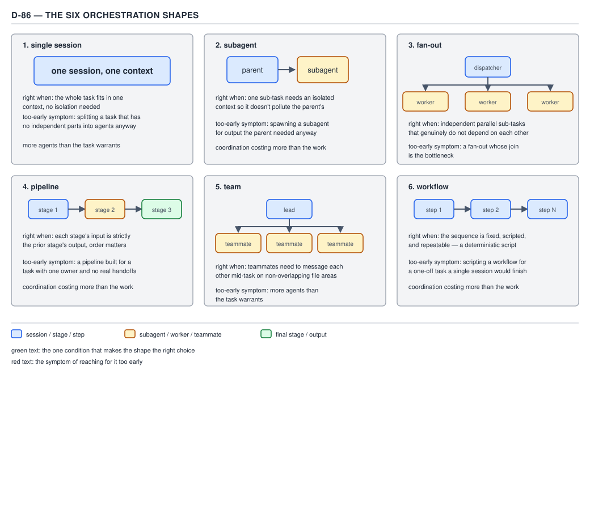
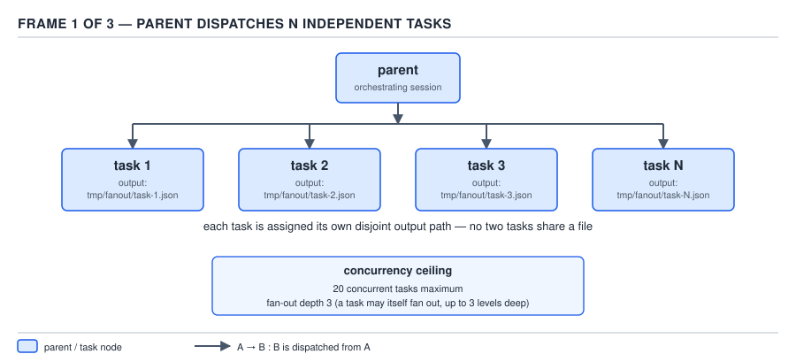
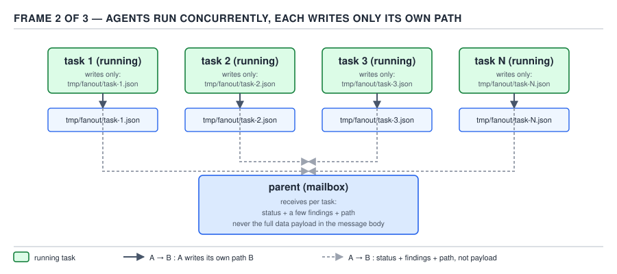
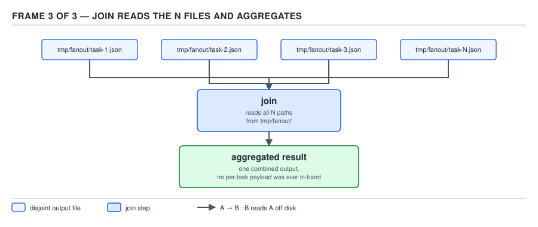
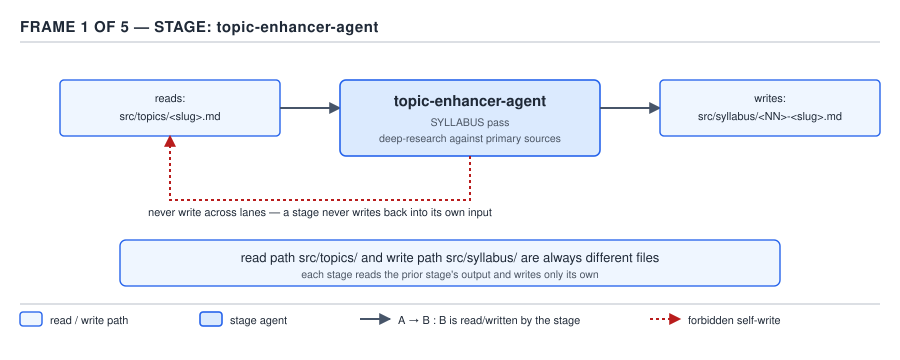
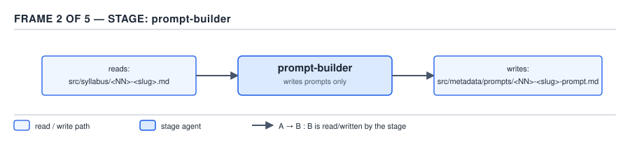
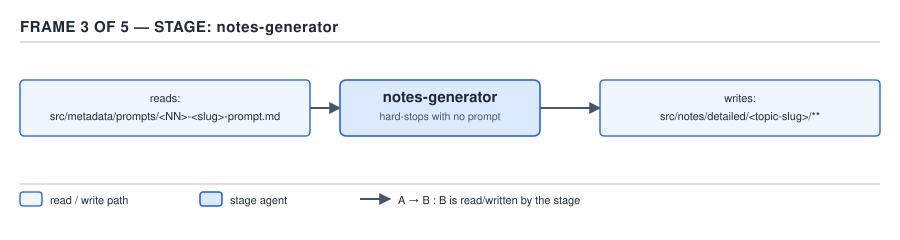
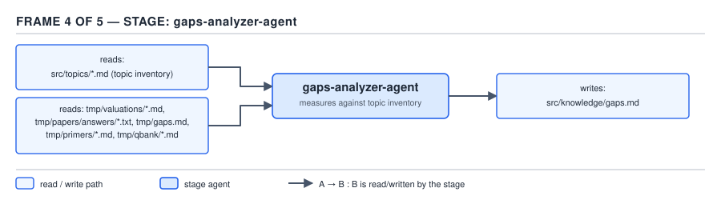
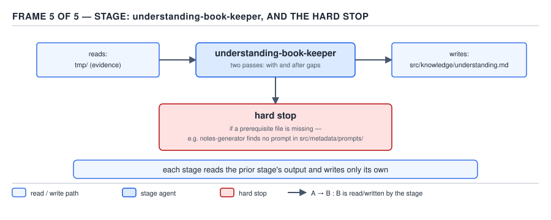

# 21 AI for Coding — orchestration shapes and fan-out — ADVANCED (INTERNALS) (§3.9.1–3.9.4)

**Target version: Claude Code v2.1.2xx (August 2026).** | **Part 3 of 6** | [Index](../00-index.md)
Previous: [Java, and the dependency contract](../sdk-and-api/03-internals-b-java-and-the-dependency-contract.md) · Next: [prose executor versus deterministic conductor](03-internals-b-executor-vs-conductor.md)

The prior files established the subagent context boundary (one message out, a fixed per-dispatch tax, 2.0x marginal cost that climbs to 3-4x for a team), the law that one output path belongs to exactly one writer ever, the return protocol (status, a few findings, a path — never a data payload in the message body), the hard limits (20 concurrent dispatches, fan-out depth 3, and the tool set a subagent never gets), and isolation arithmetic as a budgeting rule. None of that is re-derived here. This file answers a different question: given those costs, **which shape do you actually reach for**, and what do the two structural patterns — fan-out-with-a-join and the pipeline — look like when you build one.

## The six orchestration shapes

**Mental model.** Every task an agent does sits somewhere on two axes: does it need more than one context window, and do the pieces depend on each other's output. Six points on that grid have names, and naming them is the whole point of this leaf — a session, a subagent, a fan-out, a pipeline, a team, and a workflow are not six unrelated features bolted onto Claude Code. They are six answers to "how many contexts, and in what order," and picking the wrong one is a cost decision, not a taste decision.

A **session** is one continuous conversation: one context window, re-sent in full on every turn, with one thread of tool calls. Nothing here has been defined yet if this is the reader's first exposure to it — a **context window** is the argument list of the next model call, not a memory, and a **turn** is one round trip of that call. A session is the default; every other shape exists because some task does not fit inside one.

A **subagent** is a second, isolated context window that a parent session dispatches, does its own work in, and returns a result from — a status line, a few findings, and a path, per the return protocol already established. It exists so that the parent's own context does not have to hold the subagent's exploration, its failed attempts, or its intermediate tool output.

A **fan-out** is a parent dispatching **N subagents that do not depend on each other**, all in one wave, followed by a join step that reads what they each wrote. It exists because independent work that fits in one context window each is faster run in parallel than run one after another inside a single session.

A **pipeline** is the opposite dependency shape: stage 1's output is stage 2's input, stage 2's output is stage 3's input, and the order cannot be reshuffled. It exists because some jobs are genuinely sequential — you cannot build the prompt for a topic before its syllabus exists, and you cannot generate notes before the prompt exists.

A **team** is a set of agents — a lead and one or more teammates — that can message each other mid-task, addressed by name, while working on non-overlapping file areas. It exists for the case a fan-out cannot handle: work that is mostly independent but occasionally needs a live question answered before it can continue, rather than waiting for a join at the end.

A **workflow** is a fixed, scripted, repeatable sequence of steps — a checked-in script or a declarative spec, not a model choosing what happens next turn by turn. It exists because a repeatable operational procedure should not re-derive its own steps from a prompt every time it runs; `harness/src/harness/engine/loop.py`'s `run_loop`, walked later in this file, is a workflow in exactly this sense — its own docstring calls it "100% Python" control flow.

**When to reach for which, and the symptom of reaching too early.** The sibling comparison is the leaf itself — six shapes competing for the same job, and the wrong one is always visible after the fact as coordination that cost more than the work it coordinated.



**D-86** — The six orchestration shapes, each with the condition that picks it and the symptom of reaching too early.

| Shape | Right when | Too-early symptom |
|---|---|---|
| Single session | The whole task fits in one context, no isolation needed | Splitting a task with no independent parts into agents anyway |
| Subagent | One sub-task needs an isolated context so it doesn't pollute the parent's | Spawning a subagent for output the parent needed inline anyway |
| Fan-out | Independent parallel sub-tasks that genuinely do not depend on each other | A fan-out whose join is the bottleneck |
| Pipeline | Each stage's input is strictly the prior stage's output, order matters | A pipeline built for a task with one owner and no real handoffs |
| Team | Teammates need to message each other mid-task on non-overlapping file areas | More agents than the task warrants |
| Workflow | The sequence is fixed, scripted, and repeatable — a deterministic script | Scripting a one-off task a single session would have finished |

**Code.** Each shape has a distinct, real invocation shape in this environment:

| Shape | What the call looks like |
|---|---|
| Single session | An ordinary assistant turn — no `Agent` call at all |
| Subagent | One `Agent({subagent_type: "general-purpose", description: "...", prompt: "..."})` |
| Fan-out | Several `Agent({...})` calls issued inside the **same** assistant turn, so the harness dispatches them concurrently |
| Pipeline | `Agent` calls issued **one at a time, in separate turns**, each reading the previous one's output path before it starts |
| Team | `SendMessage({to: "prompt-builder-21", message: "..."})` addressed to an already-running named agent |
| Workflow | A checked-in script — `harness/src/harness/engine/loop.py`'s `run_loop`, or a shell script wrapping `claude -p` — invoked the same way every time, with no model deciding the next step |

**Gotcha.** The two most common misreads run in opposite directions. Reaching for a team or a workflow when a single session would finish the task is "more agents than the task warrants" — every extra agent is a fixed per-dispatch tax paid for no isolation benefit. The opposite mistake — running six independent sub-tasks one after another inside a single session because a fan-out "felt like overkill" — throws away parallelism the task actually had. Both symptoms are visible only after the fact, which is why the right habit is to name the shape **before** dispatching anything, not to back into one.

> An orchestration shape is a fixed answer to two questions — how many context windows does this task need, and do its pieces depend on each other's output — and the six shapes above are the only six combinations worth naming.

## Fan-out with a join

**Mental model.** A fan-out looks like a starfish: one parent at the center, N independent arms doing unrelated work at the same time, and a join step at the end that reads what each arm left behind. Nothing flows between the arms while they run — that is precisely what makes them safe to run concurrently.

**Why it exists.** Some jobs decompose into pieces that do not need each other's intermediate results — reviewing five independent chapters for a banned-name violation, or dispatching one writer per note file in this very topic's own generation. Running those sequentially inside one session wastes wall-clock time waiting on work that has no dependency on the step before it; running them one context each, concurrently, gets the wall-clock cost down to the slowest single arm instead of the sum of all of them.

**When to reach for it, and when not.** A fan-out wins when the sub-tasks are genuinely independent and each is small enough that a dedicated context is worth its per-dispatch tax. It loses to a single session when the sub-tasks are trivial enough that the tax exceeds the work, and it loses to a pipeline when a later sub-task actually needs an earlier one's output — forcing that dependency through a fan-out either serializes it anyway (defeating the point) or, worse, makes two arms race to write the same file, which is the lane-collision failure the parent file already established as banned.

**How it works.** Three things have to be true simultaneously for a fan-out to be safe, and the three diagram frames below are exactly those three things.



**D-87a** — The parent dispatches N independent tasks in one wave, each one assigned its own disjoint output path before it starts — `tmp/fanout/task-1.json` through `tmp/fanout/task-N.json` — so no two tasks are ever told to write the same file.



**D-87b** — While the tasks run concurrently, each one writes only the path it was assigned — never a sibling's — and reports back to the parent's mailbox with status plus a few findings plus its own path, never the full data payload in the message body. This is the return protocol from the parent file applied at scale: N replies of a few lines each, not N replies of the full artifact.



**D-87c** — The join step, run after every arm reports back, reads all N paths off disk and aggregates them into one combined result. The join never receives a per-task payload in-band; it goes to disk for it, which is the only way a join scales past a handful of tasks without the parent's own context filling up with N copies of the same data.

**[NUM]** Two numbers bound how far a fan-out can be pushed before the harness itself refuses: **20 concurrent tasks maximum** in one wave, and **fan-out depth 3** — a dispatched task may itself fan out into further tasks, but only three levels deep before nesting is refused. A fan-out that needs a 21st concurrent arm, or a fourth level of nesting, is not a bigger fan-out; it is a sign the work should be re-batched or re-shaped into a pipeline of smaller waves.

**Code.** A fan-out with a join, written as a shell script dispatching four independent `claude -p` reviews and then aggregating them:

```bash
#!/usr/bin/env bash
set -euo pipefail

OUT_DIR="tmp/fanout"
mkdir -p "$OUT_DIR"

# Each task gets its own disjoint output path before it starts — D-87a.
for i in 1 2 3 4; do
  claude -p "Review src/notes/detailed/21-ai-for-coding/orchestration/03-internals-a-shapes-and-fan-out.md, section ${i} of 4, for banned throwaway names (Foo, Bar, thread1, MyClass). Report only the line numbers and matched words, nothing else." \
    --output-format json \
    > "${OUT_DIR}/task-${i}.json" &
done
wait   # every arm writes only its own path while this blocks — D-87b

# Join: read all N paths and aggregate. No per-task payload was ever
# passed in-band; every one of them came off disk — D-87c.
jq -s '[.[] | {task_cost_usd: .total_cost_usd, findings: .result}]' \
  "${OUT_DIR}"/task-*.json > "${OUT_DIR}/joined.json"

cat "${OUT_DIR}/joined.json"
```

`wait` is the join's synchronization point — the script blocks until every backgrounded `claude -p` has exited and its file is flushed, before `jq -s` (slurp mode) reads all four JSON files as one array. Nothing here shares state between the four background processes; each opens `--output-format json`, writes one file, and exits.

**Gotcha.** The join is the part everyone forgets to budget for, and it is exactly the failure D-86 names as "a fan-out whose join is the bottleneck." A fan-out's wall-clock time is not the sum of its arms — it is roughly the slowest arm, **plus** the join's own read-and-aggregate cost. A join that re-reads and re-summarizes four full note files, rather than the few findings each arm already extracted and wrote to its own path, has quietly turned an O(1) aggregation step into an O(N) re-analysis step, which is the same mistake as putting a data payload in the return message instead of a path — just moved to the join side of the fan-out instead of the dispatch side.

> A fan-out is a dispatcher and N independent arms, each with a disjoint output path and a status-plus-findings-plus-path reply, joined by one step that reads N files off disk rather than N payloads out of N messages — bounded by a hard ceiling of 20 concurrent tasks and a nesting depth of 3.

## Pipeline: no stage writes its own input

**Mental model.** A pipeline is a relay race, not a starfish: stage 1 hands off to stage 2, stage 2 hands off to stage 3, and no runner ever doubles back to touch the baton after handing it off. The property worth naming is not "stages run in order" — a single session running four steps in a row also runs in order. The property is that **each stage's output is written once, to a path the stage itself never reads again**, which is what makes any one stage re-runnable in isolation without redoing the stages before it.

**Why it exists.** Some jobs cannot be parallelized because stage N+1 genuinely needs stage N's finished output, not a guess at what it will contain. Building a note-generation prompt before its syllabus exists produces a prompt built from nothing; that is not a smaller version of the job, it is a different, wrong job. A pipeline exists to make that dependency explicit and enforced, rather than left to whichever agent happens to run first.

**When to reach for it, and when not.** A pipeline wins when order is a correctness requirement, not just a convenience — stage N+1's input literally does not exist until stage N produces it. It loses to a fan-out when the "stages" turn out not to depend on each other after all, in which case running them sequentially wastes the wall-clock time a fan-out would have reclaimed. It loses to a single session when the whole sequence is short enough, and cheap enough per stage, that the per-dispatch tax of splitting it into separate contexts is not worth paying.

**How it works.** `harness/src/harness/engine/loop.py` is a real, checkable pipeline driver — the deterministic run loop behind the sdlc-harness's `claude -p` orchestration. Its own module docstring states the shape directly:

```
"""The deterministic run loop -- the engine's heart (RFC S1.4).

Control flow is 100% Python: bounded retry, cold feedback handoff between
attempts, a measured done-gate (no model prose), a declarative classifier, and
crash-resume from the checkpoint. Every external effect is an injectable seam
(`run_agent`, the registry's sensors/parsers, `tele`) so the whole loop is
unit-testable with fakes -- no `claude` or network. The loop's job ends at a
gate PASS; it never commits, pushes, or raises an MR (see WorkflowSpec's
module docstring in engine/spec.py) -- no `glab` either.
"""
```

"Cold feedback handoff between attempts" is the pipeline invariant playing out at the attempt level rather than the file-to-file level D-88 shows below. Each attempt `n` writes its own feedback file and never touches a previous attempt's:

```python
def _write_feedback(
    scratch: Path, n: int, signals: Dict[str, Any], last_agent: Dict[str, Any],
    signal_reasons: Optional[Dict[str, Any]] = None,
) -> None:
    fb_dir = scratch / "feedback"
    fb_dir.mkdir(parents=True, exist_ok=True)
    lines = [f"# Attempt {n} feedback", "", "## Signals", ""]
    for k, v in signals.items():
        lines.append(f"- {k}: {v}")
    ...
    (fb_dir / f"loop-{n}.md").write_text("\n".join(lines) + "\n", encoding="utf-8")
```

and the next attempt reads the previous one's file, never the reverse:

```python
prev_feedback = scratch / "feedback" / f"loop-{n - 1}.md" if n > 1 else None
```

Attempt `n` writes `loop-{n}.md` and nothing else; attempt `n+1` reads `loop-{n}.md` as input to `_build_agent_task` but writes only its own `loop-{n+1}.md`. No attempt ever opens a previous attempt's file for writing. That is the same law the file-to-file pipeline below states at a coarser grain, expressed here at the grain of one retry loop's attempts: **read the prior stage's output, write only your own.**

The loop's step sequence inside one attempt (`for step in spec.steps: ...`) carries the same property forward at a finer grain still — `checkpoint.record_step(state_path, step.name, step_signals)` persists each step's own signals the moment it completes, and on resume, `if step.name in completed: continue` skips any step already recorded rather than re-running it. That skip is only safe because a completed step's recorded result cannot be invalidated by a later step in the same attempt — nothing downstream ever rewrites what an earlier step already committed to the checkpoint.

**[SVG]** No diagram is assigned to this leaf directly; D-88, embedded in the next section, draws the identical invariant at the file-to-file grain of this repository's own five-stage pipeline, which is easier to see because each stage's read and write paths are two entire separate files rather than two lines inside one attempt loop.

**Gotcha.** `_finalize_run`, the function that closes out every terminal exit (pass, blocked, or escalated), documents its own exception posture directly in its docstring: it is "Deliberately NOT exception-safe" — a `checkpoint.finalize` or `emit` failure inside it is meant to propagate up to `run_loop`'s outer `try`/`except`, which then renders the whole run as `blocked` with reason `loop_error` rather than silently reporting a `pass` that never actually got checkpointed. The gotcha buried in that choice: it would be easy to "fix" a flaky telemetry call inside `_finalize_run` by wrapping it in a defensive `try`/`except`, and doing so would quietly turn a checkpoint-write failure into a falsely reported success — the exact failure mode the comment calls out by name. A stage that is careful never to write its own input can still be undone by a caller who is too defensive about the write that records whether it succeeded.

> A pipeline stage may read what the prior stage wrote, but it never rewrites what it read or what it already produced itself — which is what lets any single stage, or any single attempt, be re-run in isolation from an unchanged input and reproduce the same result.

## This repository's own per-topic pipeline

**Mental model.** The clearest pipeline example available for this leaf is not hypothetical — it is the five-stage process that generated the very note set this file belongs to. Five agents, five distinct read paths, five distinct write paths, and one hard stop wired into the third stage that this repository has already exercised for real.

**Why it exists.** A topic's note set cannot be written until a prompt exists to write it from; a prompt cannot be built until a syllabus exists to build it from; a syllabus cannot be scored for gaps until notes exist to be tested against. Each of those is a genuine ordering constraint, not a convenience — which is exactly the condition that earns a pipeline rather than a fan-out.

**How it works.** The five stages, each a named agent definition under `.claude/agents/`, in order:

| Stage | Reads | Writes |
|---|---|---|
| `topic-enhancer-agent` (SYLLABUS pass) | `src/topics/<slug>.md` | `src/syllabus/<NN>-<slug>.md` |
| `prompt-builder` | `src/syllabus/<NN>-<slug>.md` | `src/metadata/prompts/<NN>-<slug>-prompt.md` |
| `notes-generator` | `src/metadata/prompts/<NN>-<slug>-prompt.md` | `src/notes/detailed/<topic-slug>/**` |
| `gaps-analyzer-agent` | `src/topics/*.md` + `tmp/` (evidence) | `src/knowledge/gaps.md` |
| `understanding-book-keeper` | `tmp/` (evidence) + `src/topics/*.md` filenames | `src/knowledge/understanding.md` |



**D-88a** — `topic-enhancer-agent`'s SYLLABUS pass reads `src/topics/<slug>.md` and writes `src/syllabus/<NN>-<slug>.md`. Its own spec is explicit about the boundary: "**You do not touch `src/topics/` in this mode. Not one character.**" — the read path and the write path are enforced as disjoint by the agent's own instructions, not just by convention.



**D-88b** — `prompt-builder` reads `src/syllabus/<NN>-<slug>.md` and writes `src/metadata/prompts/<NN>-<slug>-prompt.md`. Its spec states the same disjointness even more bluntly: "**You never write notes.** You never touch `src/topics/`, `src/syllabus/`, `src/knowledge/`, or `tmp/`." A stage that only ever writes one file family cannot corrupt any other stage's input by construction.



**D-88c** — `notes-generator` reads `src/metadata/prompts/<NN>-<slug>-prompt.md` and writes `src/notes/detailed/<topic-slug>/**` — this very file included. Its own spec states the hard stop verbatim: "**If no prompt file exists for the topic, STOP.** Write nothing." followed by "Do not invent scope. Do not fall back to `src/topics/` as a substitute prompt. Do not write a partial set 'to get started'." This is not a hypothetical failure mode; it is the literal instruction this agent runs under every time it is invoked, including the invocation that produced this note set — the prompt at `src/metadata/prompts/21-ai-for-coding-prompt.md` had to exist before this file could be dispatched at all.



**D-88d** — The diagram now draws this stage's real declared read set, matching `gaps-analyzer-agent`'s own spec: `src/topics/*.md` for the topic inventory (each file ends with an `Atomic concept checklist`) plus `tmp/valuations/*.md`, `tmp/papers/answers/*.txt`, `tmp/gaps.md`, `tmp/primers/*.md`, and `tmp/qbank/*.md` for evidence. (The diagram originally labeled this stage's read path as `src/notes/detailed/<topic>/**`, which is not what the agent's spec declares; it has since been corrected to the real input set.) The write path, `src/knowledge/gaps.md`, remains visibly disjoint from every one of those read paths — the invariant the frame exists to illustrate.



**D-88e** — `understanding-book-keeper` reads the same `tmp/` evidence plus `src/topics/*.md` filenames, and writes only `src/knowledge/understanding.md`. Its spec draws the lane boundary against its sibling stage explicitly: "gaps belong to gaps-analyzer (`src/knowledge/gaps.md`) — link, don't duplicate." Two stages, two ledgers, one shared read set, zero overlapping write paths.

**Code.** The lane boundary is not just documentation prose — it is the literal frontmatter each agent definition ships, which is what a dispatcher reads before ever running the agent:

```
---
name: notes-generator
tools: Read, Write, Edit, Glob, Grep, Bash, WebSearch, WebFetch, Agent
model: opus
---
```

`tools` is what the harness actually enforces per dispatch; the "never touch `src/topics/`" and "STOP if no prompt exists" rules above are instructions inside the body, enforced by the agent's own discipline rather than by a permission the harness withholds — the same distinction the parent file's material on subagent tool restriction already drew.

**Gotcha.** "Never write across lanes" reads like a style preference until a real stage crosses it: a `topic-enhancer-agent` that patched `src/topics/<slug>.md` while writing the syllabus would make the syllabus non-reproducible from the guide that supposedly produced it, and every downstream stage's provenance claim ("this prompt came from this syllabus") would become unverifiable without re-diffing the topic guide by hand. The hard stop has the identical shape one level down: a `notes-generator` that filled in "reasonable" scope when no prompt existed would produce a note set that looks complete and passes a skim — the exact failure this whole guide exists to name, because fluency is worthless as a correctness signal (the parent file's §0.1.8 point). A hard stop that refuses to guess is strictly cheaper than a plausible guess that has to be found and re-generated later.

> No stage in this pipeline writes back into the file it read, and a stage with a missing prerequisite refuses to run rather than inventing one — which is what makes any single stage independently re-runnable against unchanged inputs, and what keeps a five-stage pipeline resumable from the middle instead of only from the start.

## Pitfalls

### Believing a fan-out is always faster than a pipeline

**Wrong**

Dispatching `topic-enhancer-agent`, `prompt-builder`, and `notes-generator` for the same topic all in one wave, on the theory that three agents running concurrently beats three running in sequence. `prompt-builder` starts, finds no syllabus at `src/syllabus/<NN>-<slug>.md` yet (its sibling wrote it a few seconds too late), and reports "stop, run `topic-enhancer-agent` first" — the exact stop instruction its own spec carries. The wave produces one failed stage and two wasted dispatches.

**Right**

Dispatch `topic-enhancer-agent` alone, wait for its envelope, then dispatch `prompt-builder`, wait, then `notes-generator`. Three sequential dispatches, each one gated on the previous file actually existing — a pipeline, not a fan-out, because the dependency is real.

**Why people believe it:** concurrency reads as strictly better than sequencing, and it is — for independent work. The mistake is applying that intuition to work that only looks independent because the three stages happen to be three separate agent definitions.

### Assuming a stage that reads a file may also touch it

**Wrong**

`gaps-analyzer-agent` "helpfully" trims a stale section out of `src/topics/<slug>.md` while reading it for the topic inventory, on the theory that it is already open and the fix is small.

**Right**

`gaps-analyzer-agent`'s own constraint list states it directly: "Do not modify files under `tmp/valuations/` or `src/topics/`." Read-only inputs stay read-only, full stop — a fix to `src/topics/` is a different agent's job (`topic-agent`), dispatched separately, so the fix is traceable to the stage whose lane it belongs to.

**Why people believe it:** if an agent already has `Read` and `Edit` in its tool list, nothing in the permission layer stops it from editing a file it merely read — the restriction is a lane rule stated in the agent's own instructions, not a tool grant the harness withholds, which is exactly the same "instruction versus permission" gap this file's earlier section on `allowed-tools` already established.

## Cheat sheet

| Shape | Contexts | Dependency | Right when | Ceiling |
|---|---|---|---|---|
| Single session | 1 | n/a | Whole task fits in one context | n/a |
| Subagent | 2 (parent + 1) | Parent needs isolation, not the sub-task's output inline | One isolable sub-task | Depth 3 |
| Fan-out | 1 + N | None between the N | Independent parallel sub-tasks | 20 concurrent, depth 3 |
| Pipeline | 1 per stage, sequential | Strict: stage N+1 needs stage N's output | Real ordering constraint | n/a (sequential, not concurrent) |
| Team | 1 lead + N teammates | Mostly independent, occasional mid-task message | Non-overlapping files, live questions | Per-team limits from the parent file |
| Workflow | Fixed script | Whatever the script encodes | Repeatable, deterministic procedure | n/a |
| This repo's pipeline | 5 stages | Strict, file-to-file | Generating one topic's full note set | `notes-generator` hard-stops with no prompt |

## Self-test

**Q1.** Why is running five independent chapter reviews inside one session slower, in wall-clock terms, than the same five reviews as a fan-out?

<details><summary>Answer</summary>

A single session runs its tool calls in whatever order the model issues them, one at a time within the turn structure — five independent reviews inside one session still execute sequentially unless they are dispatched as five separate concurrent subagents. A fan-out issues all five `Agent` calls inside the same assistant turn, which the harness runs concurrently, so the wall-clock cost drops from roughly the sum of five reviews to roughly the cost of the single slowest one, plus the join.

</details>

**Q2.** `topic-enhancer-agent`'s SYLLABUS pass and `prompt-builder` both eventually touch a topic's files. Why is this a pipeline and not a fan-out?

<details><summary>Answer</summary>

`prompt-builder` reads `src/syllabus/<NN>-<slug>.md`, which `topic-enhancer-agent` is the one stage that produces. `prompt-builder`'s input does not exist until `topic-enhancer-agent` finishes — that is a strict ordering dependency, the defining property of a pipeline. A fan-out requires the opposite: that neither stage needs the other's output, which is false here.

</details>

**Q3.** What are the two numeric ceilings on a fan-out, and what does exceeding either one mean structurally, not just "it will be slow"?

<details><summary>Answer</summary>

20 concurrent tasks in one wave, and a fan-out depth of 3 (a dispatched task may itself fan out, up to three levels deep). Exceeding either is not merely slow — the harness refuses further dispatch outright, so a design that needs a 21st concurrent arm or a fourth nesting level has to be re-batched into multiple waves or re-shaped into a pipeline of smaller fan-outs, not just given more patience.

</details>

**Q4.** In the fan-out join script, what would go wrong if `wait` were removed?

<details><summary>Answer</summary>

`jq -s` would run against whichever `task-N.json` files happened to already exist and be fully flushed at that point in the script — a race, not a deterministic bug, so it would sometimes join all four files and sometimes join fewer, non-deterministically, because the four backgrounded `claude -p` processes have no guaranteed completion order relative to the script continuing past the loop.

</details>

**Q5.** `loop.py`'s `_write_feedback` writes `loop-{n}.md` and the next attempt reads `loop-{n-1}.md`. Why does no attempt ever open the previous attempt's file for writing?

<details><summary>Answer</summary>

Because each attempt is given a distinct file name (`loop-1.md`, `loop-2.md`, ...) rather than one shared feedback file that every attempt appends to or overwrites. Distinct paths per attempt is what makes the handoff read-only from the next attempt's side — there is no shared mutable file for a later attempt to corrupt, which is the same "read the prior stage's output, write only your own" law stated at the grain of one retry loop.

</details>

**Q6.** Why does `notes-generator` refuse to write a "partial set to get started" when no prompt exists, rather than writing something and flagging it as incomplete?

<details><summary>Answer</summary>

A partial set built from invented scope looks complete on a skim and is not — the exact failure this guide's material on confabulation already established: fluency is worthless as a correctness signal. A hard stop that produces nothing is unambiguous and costs one wasted dispatch; a plausible partial set costs a wasted dispatch plus the cost of someone discovering later that it was wrong, which is strictly more expensive.

</details>

**Q7.** What is `gaps-analyzer-agent`'s real declared input set, and why does the read/write disjointness invariant hold for this stage regardless of exactly which files are in that set?

<details><summary>Answer</summary>

The agent's own spec names `src/topics/*.md` (the topic inventory, each ending in an atomic concept checklist) plus `tmp/valuations/*.md`, `tmp/papers/answers/*.txt`, `tmp/gaps.md`, `tmp/primers/*.md`, and `tmp/qbank/*.md` as its inputs — not `src/notes/detailed/`. The disjointness invariant holds because the stage's one write path, `src/knowledge/gaps.md`, is not itself a member of any of those read paths; the invariant is a property of the write path never colliding with the read set, so it holds for the real, narrower read set the same way it would for any other candidate one.

</details>

**Q8.** A `claude -p` fan-out task returns its full 400-line review as the message body instead of writing it to its assigned path. What has it violated, and what should its reply have looked like instead?

<details><summary>Answer</summary>

It has violated the return protocol established for every dispatch: status, a few findings, and a path, never the full data payload in the message body. Its reply should have been something like "status: ok, 3 findings (banned name at line 42, missing gotcha at line 90, table missing at line 140), written to tmp/fanout/task-2.json" — the parent's join step reads the full detail off disk, not out of the reply text.

</details>

## Open questions

None.

---

**Leaves covered:** 3.9.1–3.9.4 (4 leaves)
**Leaves deferred:** none
**Diagrams included:** D-86, D-87a, D-87b, D-87c, D-88a, D-88b, D-88c, D-88d, D-88e
**Target version:** Claude Code v2.1.2xx (August 2026)
**Lines:** 330
