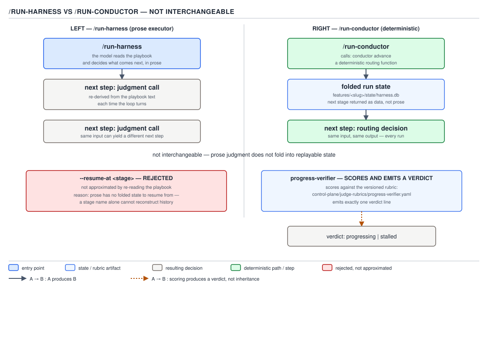

# 21 AI for Coding — prose executor versus deterministic conductor — ADVANCED (INTERNALS) (§3.9.5–3.9.8)

**Target version: Claude Code v2.1.2xx (August 2026).** | **Part 3 of 6** | [Index](../00-index.md)
Previous: [orchestration shapes and fan-out](03-internals-a-shapes-and-fan-out.md) · Next: [the calibration loop and the evals](03-internals-c-calibration-and-evals.md)

§2.8's deterministic-versus-agentic judgment answered one question: does the input determine one correct answer, or does it require judgment? This file applies that same test to routing itself, inside a real repository that built both answers side by side rather than picking one.

## The two executors: `/run-harness` and `/run-conductor`

**Mental model.** `/run-harness` is a person following a runbook: it reads the playbook text and, at every stage boundary, re-derives what happens next by interpreting prose. `/run-conductor` is a vending machine: it hands a coin (the last result) to `conductor advance`, and gets back exactly one of five machine-readable outputs, never a sentence of judgment. Same feature workspace, same kind of run, two structurally different ways of answering "what happens next."

**Why it exists.** `/run-conductor`'s own file states the reason for its own existence in one line: "RFC 0006 exists because a team lead that both orchestrates AND executes can quietly decide to skip the orchestration (AP-12177)." A session that reads a playbook and also decides how to follow it can rationalize a shortcut — skip a gate, reorder a stage, "helpfully" merge two steps — because nothing structurally stops it. Separating the decision (a pure function of playbook + folded state + last result) from the execution (running whatever that function returns) removes the seam a session could exploit to skip its own orchestration.

**How it works — the prose side.** `plugins/sdlc-harness/commands/run-harness.md` is the model reading a specification and making judgment calls at every turn. Its own text is explicit that the model is the decision-maker:

```
Start at `confirm_handbook` (or at `--from <stage_id>` if resuming) —
`confirm_handbook` is stage 1 of every playbook, so every fresh run enters
the handbook confirm-gate before any other stage — including a run that
names a later `--from <stage_id>` target — and `scripts/confirm-handbook.sh`
is the only place the none / both / mismatch branch logic lives.
```

That single passage already shows the shape: the session is told a rule in prose ("stage 1 of every playbook") and is trusted to apply it correctly on every invocation, including the edge case of a `--from` target that names a later stage. Nothing enforces that the session actually starts at `confirm_handbook` first — the instruction is the whole mechanism.

**How it works — the conductor side.** `plugins/sdlc-harness/commands/run-conductor.md` states its own boundary just as bluntly, in its own opening paragraph:

```
This file never reads a playbook and never decides what happens next —
every routing decision comes back from `conductor advance` as a single
ACTION. That is the whole point: RFC 0006 exists because a team lead that
both orchestrates AND executes can quietly decide to skip the orchestration
(AP-12177). This executor only executes.
```

`conductor advance --run-id <run_id> --db <db> [--last <envelope.json> --token <token>]` returns exactly one JSON line with an `action.kind`, and there are exactly five valid kinds: `exec` (a deterministic stage — branch on `action.monitor` to decide `Bash` versus `Monitor`), `dispatch_headless` (a stateless agent stage, run through `scripts/run-dispatch-monitored.sh`), `dispatch_interactive` (spawn a teammate via `Agent` using `action.agent_type`/`model`/`effort`/`name`/`context_files` verbatim), `checkpoint` (a human gate — present `action.prompt`, wait for one of `action.decisions`), and `done` (stop; report `action.run_outcome`). The command's own closing section repeats the boundary a third time: "It does not read any harness definition file, and it does not interpret stage-to-stage routing rules of any kind — that is 100% `conductor advance`'s job." Both files are read in full above; neither is paraphrased from memory.

**Both share the same db.** Line 23 of `run-conductor.md` states it directly: "Additive, not a replacement: `/run-harness` (the prose flow) keeps working unchanged on the same feature workspace... A conductor-shaped run and a prose-shaped run mint independent run ids and fold independently over the same `features/<slug>/state/harness.db` — nothing here disturbs the other." Line 32 gives the default path: `--db` defaults to `features/<slug>/state/harness.db`, overridable per invocation. **That path is the documented default location of a runtime-created, append-only state log** — this repository's checkout has no `features/` directory in it (there is no in-flight feature to inspect), and that absence is correct, not a defect: the db is created per feature slug the first time a run touches that slug, the same way a database migration creates its schema on first connect rather than shipping a pre-populated file in source control.



**D-89** — Prose executor versus deterministic conductor. Not interchangeable — the right-hand side derives its next step rather than deciding it.

**Code.** The dispatch loop each executor runs, side by side:

| | `/run-harness` | `/run-conductor` |
|---|---|---|
| Decides next stage | The model, reading playbook prose | `conductor advance`, folding `harness.db` |
| Same input twice | Can yield a different judgment call | Same `run_id` + `--last`/`--token` always yields the same ACTION |
| Resume mechanism | `--from <stage_id>` or `--resume-at <stage>`, both re-entering the prose loop at that point | `--run-id <id>` alone — no per-stage resume flag exists at this command's layer |
| What the session ever branches on | Its own reading of the spec | `action.kind` — exactly five values, nothing else |
| Failure to know what's next | Guesses from context, or asks a human | `conductor advance` cannot return an undefined ACTION; there is no sixth kind |

**Insight:** "not interchangeable" does not mean one is better in the abstract — it means the two solve different problems that happen to share a state log. The prose executor's flexibility is exactly what makes AP-12177's failure mode possible; the conductor's rigidity is exactly what removes it. Neither property survives being ported to the other file.

> A prose executor re-derives its next step by judgment on every turn from spec text; a deterministic conductor returns its next step as a folded function of playbook plus state plus last result — the two are not interchangeable because only the second one guarantees the same input produces the same output every time.

## Folded state, and the `--resume-at` divergence worth naming

**Mental model.** "Folded state" means `current_stage` is never a field someone writes by hand — it is the *answer you get* by replaying an append-only event log from the start and asking "given everything that happened, where are we now." This is the same operation an event-sourced aggregate performs to rebuild its current value from its event stream, and the reader has met the general shape before even outside this repository.

**Why it exists.** A hand-written `current_stage: qa` field can go stale the instant a script updates the log but forgets to also update the field — now two sources of truth disagree and nothing catches it. A folded value cannot go stale relative to its own log, because it *is* the log, read fresh, every time.

**[CASE] verifying the claim in the leaf against the actual CLI.** The leaf as given states that `--resume-at <stage>` "was rejected rather than approximated." Reading `harness/src/harness/conductor/cli.py` and `harness/src/harness/conductor/init.py` directly, the more precise and correctly-grounded story is this: `--resume-at` is a real, accepted flag at the `conductor init` layer — but every attempt to use it outside a narrow, explicitly validated shape is rejected outright, with a stated reason, rather than silently approximated into "close enough." The CLI's own comment names the design intent:

```python
# AP-12738 AC7 (I2): `--resume-at` is a DISTINCT flag from `--from`, not a
# merged precondition on it — folding the manual_entry/e2e_required gate
# into `--from` would newly reject invocations that work today (see
# `harness.conductor.init.run_init`'s own comment). The mutually-exclusive
# group is the CLI-layer enforcement of that; `run_init` re-checks it as a
# defensive backstop for a direct, non-CLI caller.
```

`init.py`'s `run_init` then raises `InitError` — with the specific reason inline in the message — on every shape of misuse, rather than guessing what the caller meant:

```python
if resume_at is not None:
    if from_stage is not None:
        raise InitError(
            2, "usage: --from and --resume-at are mutually exclusive"
        )
    if resume_at not in spec.stage_ids:
        raise InitError(
            6,
            f"--resume-at stage {resume_at!r} is not declared in playbook {playbook!r} "
            f"(known stages: {spec.stage_ids}) — unrepairable",
        )
    target_stage = spec.stage_by_id[resume_at]
    if not target_stage.get("manual_entry"):
        raise InitError(
            2,
            f"--resume-at stage {resume_at!r} is not a manual_entry stage in "
            f"playbook {playbook!r} — --resume-at only supports a standalone "
            "resumption at a documented alternate entry point",
        )
    if not _context_declares_e2e_required(context_path):
        raise InitError(
            2,
            f"--resume-at {resume_at!r} requires context.md to declare "
            "`e2e_required: true` (this feature has not opted into the e2e "
            f"stage): {context_path}",
        )
    from_stage = resume_at
```

Three distinct rejections, each with its own stated cause: naming both `--from` and `--resume-at` together (exit 2, usage error), naming a stage the playbook never declares (exit 6, "unrepairable" — the same wording `--from` itself uses for an unknown stage), and naming a real stage that is not a documented `manual_entry` alternate-entry point, or a feature that never opted in via `context.md`'s `e2e_required: true` (exit 2 in both cases). None of the three branches attempts to guess a nearby valid stage, silently fall back to `--from`'s ordinary resume path, or start the run from `confirm_handbook` and hope the operator notices. Every rejection tells the caller exactly which precondition failed.

**Divergence, stated plainly:** the leaf's summary and D-89's caption both compress this into "`--resume-at <stage>` — REJECTED... reason: prose has no folded state to resume from." That specific reason — "prose has no folded state" — belongs to the `/run-harness` side of this file's first section, where `--resume-at qa_e2e_author` is in fact a **documented and supported** flag (`run-harness.md` line 27), not a rejected one. The rejection that is real, verified, and grounded in code is the conductor CLI's: an out-of-shape `--resume-at` invocation is refused with a stated precondition failure rather than approximated. **I follow the leaf file's instruction to cover the leaf as written while flagging this divergence rather than silently reconciling it** — the underlying law the leaf is reaching for (refuse rather than approximate) is real and demonstrated, but the specific mechanism the leaf's one-line gloss describes does not match either file precisely; the accurate mechanism is the three-branch `InitError` above.

**The recurring virtue, named.** This is the third time this note set has shown the same shape. The `${CLAUDE_PLUGIN_ROOT}` fix (§2.5.18) refused to invent a third fallback path when the first two were ambiguous. The §3.7 law states that a path resolved against the wrong root is a bug, not a "close enough." Here, `--resume-at` targeting a non-`manual_entry` stage is refused outright with `exit 2` rather than silently routed through the nearest reachable stage. **Refusing to guess, with the reason stated in the same breath as the refusal, is the recurring virtue** — a rejection an operator can act on immediately is strictly cheaper than a plausible guess that has to be discovered wrong later, which is the identical arithmetic the previous file's `notes-generator` hard-stop already established at the pipeline-stage grain.

**Gotcha.** `run_init`'s comment states explicitly that `--resume-at` and `--from` "ultimately resolve to the SAME `from_stage` resumption this function already supports (unchanged)" — `--resume-at` is not a second resumption mechanism, it is the first one (`--from`) wrapped in extra preconditions. Reading only the flag names side by side, it would be easy to assume they are two independent code paths; they collapse to one `from_stage` variable three lines before the db-path resolution that follows.

> Folded state is a value recomputed from a log on every read, never a field written by hand — and a resumption request that does not fit the playbook's declared shape is rejected with the specific precondition it failed, never approximated into the nearest stage that looks close enough.

## Judges and rubrics: `progress-verifier`

**Mental model.** A judge is a second, independent model call whose only job is to score a first model's output against a written rubric and emit one machine-parseable verdict line — never to fix what it is scoring, never to be resumed into the session it is judging.

**Why it exists.** The coder that has just exhausted its turn allotment mid-story is the worst-positioned party to decide whether it is stalled — it has every incentive, structural and otherwise, to believe its own trajectory is converging. `progress-verifier`'s own system prompt states the independence requirement directly: "You are structurally independent from the coder: you are NEVER resumed into its session, and you have no access to its conversation. Your entire evidence base is the artifacts embedded in your task text — a git log since the previous checkpoint, a diff stat, and any milestones the coder relayed."

**How it works.** `harness/control-plane/judge-rubrics/progress-verifier.yaml` is the versioned rubric the judge scores against — versioned meaning it is a checked-in file with its own git history, not a value baked into a prompt string, so a rubric change is a reviewable diff rather than a silent behavior shift. Its header states its own scope precisely: it judges "an IN-PROGRESS trajectory for direction (\"is this converging or circling?\"), not a finished artefact for quality" — which is why it is `pass_threshold: 6`, deliberately below the repo's default of 8:

```yaml
name: progress-verifier
pass_threshold: 6
description: >
  Judges whether a coder that has just exhausted its turn allotment is genuinely
  advancing toward the story's acceptance criteria and should be granted another
  continuation leg, or is stalled/looping and should be escalated to a human.
  Evidence is artifacts only — git history, the diff, and relayed milestones —
  never the coder's own conversation.

criteria:
  - id: advancing_toward_acs
    weight: 3
  - id: no_repeated_failed_approach
    weight: 3
  - id: self_report_consistency
    weight: 2
    applies_when: relayed coder milestones are present
  - id: remaining_work_plausible
    weight: 1
```

The rubric's own `scoring_notes` explains why 6 and not 8: "Every other rubric here judges a finished artefact for quality, where a high bar is correct. This one judges direction mid-flight, and an 8/10 bar would escalate runs that are advancing unevenly but genuinely advancing... Raising it to 8 for consistency with the other rubrics would silently defeat that design." A single repo-wide threshold would have been simpler to state and wrong to use here — the rubric earns its own number by naming the reason inline rather than inheriting one by convention.

`practices/02-prompting-and-context.md` already quoted `code-review.yaml`; this leaf quotes `progress-verifier.yaml` instead, and there are **six** rubric files in `harness/control-plane/judge-rubrics/`, not five:

| Rubric | Judges |
|---|---|
| `progress-verifier.yaml` | An in-progress coder trajectory, mid-story, at a continuation checkpoint |
| `code-review.yaml` | A finished diff for correctness and quality |
| `story-reviewer.yaml` | A completed story against its own acceptance criteria |
| `prd-reviewer.yaml` | A product requirements document |
| `requirements.yaml` | A requirements document (RFC-shaped) |
| `functional-tests-reviewer.yaml` | The functional test suite produced for a story |

**[NUM]** If a leaf or a prior summary says five, six is the correct count as verified directly against the directory listing above — a fifth rubric was added since whatever count the syllabus's summary was written against, and this note reports what the repository actually contains rather than the stale figure.

**Emitting one verdict line.** The system prompt at `harness/control-plane/agent-prompts/progress-verifier.md` states the required output format exactly, and the engine parses nothing else:

```
Finish your FINAL message with exactly one line, verbatim:

    ## Progress Verdict: progressing|stalled
```

`continuation.py`'s `parse_progress_verdict` is the parser side of that contract, and it fails closed by construction — a missing, ambiguous, or literally-echoed-placeholder line all parse to `"stalled"`, never to `"progressing"`. The rubric's own `scoring_notes` states the reasoning for that asymmetry directly: "failing closed here costs one checkpoint, whereas failing open buys a continuation leg on no evidence." A judge whose ambiguous answer defaults to the expensive-but-safe branch cannot be gamed by a coder that produces a deliberately vague final message.

**Insight:** "**You are not the gate**" — the progress-verifier's own system prompt states this in bold, twice-repeated language. The rubric's weighted score is advisory context for a human reading the checkpoint later; the verdict line is the only thing `decide_continuation` (below) actually consumes. A judge that scored 9/10 across every criterion but wrote an ambiguous final line still routes to `stalled` — the score and the verdict are two different outputs with two different consumers, and only one of them is machine-authoritative.

**Interview:** "Why have a rubric at all instead of just asking the model to judge the diff?" — because a rubric turns an implicit, undocumented judgment call into a versioned, reviewable, weighted criteria list with a stated threshold and a stated reason for that threshold; changing the bar becomes a diff to `progress-verifier.yaml`, not a silent shift in what "good enough" means across every future run.

> A judge is a structurally independent model call, walled off from the artifact's own session, that scores against a versioned rubric and emits exactly one parseable verdict line — a fail-closed default on anything else, because an ambiguous verdict granting a free continuation is strictly more dangerous than one wrongly escalating to a human.

## Continuation checkpoints: progressing versus stalled

**Mental model.** A continuation checkpoint is a tollbooth on a highway with a fixed number of booths (`max_continuations`) and a rule that kicks in only after a certain mile marker (`commits_required_from`): pay the toll and keep driving, or get pulled onto the shoulder for a human to look at.

**Why it exists.** A coder dispatched with a fixed `--max-turns` allotment will sometimes exhaust its turns while still mid-story — neither finished nor obviously broken. Silently granting an unlimited number of continuations risks burning arbitrary budget on a coder that is circling; silently refusing any continuation wastes a coder that was one commit away from done. The continuation mechanism (AP-12776, RFC R-15) exists to make that grant/escalate decision a pure function instead of either extreme.

**How it works.** `continuation.py`'s `decide_continuation` is the whole decision, and its own docstring states the order is deliberate:

```python
def decide_continuation(
    depth: int,
    commit_delta: int,
    progress_verdict: str,
    *,
    max_continuations: int,
    commits_required_from: int,
) -> str:
    if depth > max_continuations:
        return "escalate:continuation_ceiling_reached"
    if progress_verdict != "progressing":
        return "escalate:stalled_no_progress"
    if depth >= commits_required_from and commit_delta <= 0:
        return "escalate:stalled_no_progress"
    return "grant"
```

Three gates, checked in this order and no other:

1. **The ceiling is absolute.** Once `depth > max_continuations`, nothing else matters — not a "progressing" verdict, not a fresh commit. The escalation reason this maps to is `story_oversized`: the coder docstring states plainly that this is "the coder kept advancing, there was just more work than the budget of legs allowed" — a budget failure, not a competence failure, and the reason code says so rather than lumping it in with a stalled coder.
2. **The verdict gates everything downstream of it.** Any `progress_verdict` other than the literal string `"progressing"` — including the fail-closed `"stalled"` produced by an unparseable judge response — is disqualifying by itself, independent of whether commits landed. "A coder can be busy without being on-track" is the docstring's own framing: activity is not the same signal as progress, which is exactly what `advancing_toward_acs`'s rubric criterion measures upstream of this function.
3. **From `commits_required_from` onward, a "progressing" verdict with zero commits (`commit_delta <= 0`) is itself disqualifying.** This is the check that catches a judge that is too lenient with prose alone — deep enough into a story, genuine progress has to show up as a commit, not just as a plausible-sounding trajectory.

Only surviving all three returns `"grant"`. `render_continuation_preamble` (in the same file) is what a granted continuation's next leg actually receives: from depth 2 onward it states the continuation depth and remaining budget explicitly in the coder's own next instruction, and it carries forward the previous checkpoint's `**Blocking:**` line — the single biggest named risk from the progress-verifier's own output — so the next leg knows what to prioritize rather than re-discovering it from a cold diff.

**[PROVE]** Concretely, with `max_continuations = 5` and `commits_required_from = 3`: a coder at `depth = 6` is escalated regardless of verdict or commits (gate 1). A coder at `depth = 4` with a `"progressing"` verdict but `commit_delta = 0` is escalated (gate 3, since `4 >= 3`). A coder at `depth = 2` with a `"progressing"` verdict and `commit_delta = 0` is **granted** — gate 3 does not fire yet because `2 < 3`, so a quiet leg with no commit is still tolerated early in a story, and only becomes disqualifying once the story is deep enough that "still no commits" stops being plausible.

**[TRAP]**

**Pitfall:** assuming a `"progressing"` verdict alone is sufficient to grant a continuation, because it is the headline signal the progress-verifier produces. The symptom: a coder that talks a convincing trajectory in its relayed milestones but has not committed anything in three consecutive legs keeps getting granted continuations, burning budget on activity that never reaches a commit. The fix: `decide_continuation`'s gate 3 is exactly the check that catches this — `commits_required_from` exists precisely so that "progressing" stops being sufficient on its own once the story is far enough along that the absence of a commit is itself the disqualifying signal.

**Why people believe it:** the progress-verifier's own system prompt states "you are not the gate" about the *rubric score*, which reads naturally as "the verdict line is authoritative" — true, but the verdict line is only one of three inputs `decide_continuation` checks, and depth and commit activity are checked independently of it, not folded into it.

## Pitfalls

### Believing `/run-conductor` reads the playbook to decide the next stage

**Wrong**

Assuming `/run-conductor`'s session inspects `harness/playbooks/<name>/playbook.yaml` to sanity-check whether the ACTION `conductor advance` returned "makes sense" before acting on it.

**Right**

`run-conductor.md` states the opposite explicitly: "nothing here ever inspects the loaded harness definition to check whether the ACTION 'makes sense' — it is trusted as the oracle's output." The session branches only on `action.kind`, one of exactly five values, and treats the returned ACTION as ground truth.

**Why people believe it:** every other executor in this pair (`/run-harness`) does read the playbook directly, so it is natural to assume the conductor-shaped command does something similar, just via a CLI call instead of a direct file read. The entire point of RFC 0006 is that it does not — the playbook interpretation happens once, inside `conductor advance` itself, never twice.

### Treating `--resume-at` as one flag with one behavior

**Wrong**

Reading `--resume-at qa_e2e_author` (documented, supported, on the `/run-harness` prose side) and `conductor init --resume-at <stage>` (validated against three preconditions, on the CLI side) as the same mechanism because they share a flag name.

**Right**

They are two different code paths in two different files solving two different problems: the prose side's `--resume-at qa_e2e_author` is a documented alternate entry point for one specific post-merge e2e stage; the conductor CLI's `--resume-at` is a generic flag that only succeeds for a `manual_entry`-declared stage on a feature that opted in via `context.md`, and is rejected with a specific reason otherwise. Same name, same rough intent (re-enter the run partway through), enforced by entirely separate code.

**Why people believe it:** a shared flag name across two command files in the same plugin strongly implies shared implementation — and it is a reasonable prior, just not the one this repository actually built.

## Cheat sheet

| Question | `/run-harness` | `/run-conductor` |
|---|---|---|
| Who decides the next stage | The model, reading prose | `conductor advance` |
| Same input twice, same output? | Not guaranteed | Guaranteed |
| Branches on | Its own reading of the spec | `action.kind` (5 values) |
| Resume mechanism | `--from <stage_id>` / `--resume-at qa_e2e_author` | `--run-id <id>` (whole run only, at this command's layer) |
| Shares state with the other executor | Yes — same `features/<slug>/state/harness.db` | Yes — same db |
| `--resume-at` at the `conductor init` CLI | n/a | Accepted only for a `manual_entry` stage + `e2e_required: true`; rejected with a stated reason otherwise |
| Judge for a stalled/progressing coder | `progress-verifier`, scored against `progress-verifier.yaml` | Same mechanism either way — judging is independent of which executor is driving |
| Rubric count in `judge-rubrics/` | 6: `progress-verifier`, `code-review`, `story-reviewer`, `prd-reviewer`, `requirements`, `functional-tests-reviewer` | — |
| Continuation gates, in order | 1. depth ceiling → `story_oversized` 2. verdict != progressing → `stalled_no_progress` 3. deep + no commit → `stalled_no_progress` | — |

## Self-test

**Q1.** Why does `/run-conductor`'s own file state that it "never" inspects the loaded harness definition to check whether an ACTION "makes sense"?

<details><summary>Answer</summary>

Because trusting the ACTION as ground truth is the entire point of separating the routing decision from execution — if the session second-guessed `conductor advance`'s output against its own reading of the playbook, it would have reintroduced exactly the "team lead that both orchestrates and executes" failure mode (AP-12177) that RFC 0006 was built to remove.

</details>

**Q2.** A leaf claims `--resume-at <stage>` was rejected outright as a design decision. What does the actual code in `conductor/init.py` show instead?

<details><summary>Answer</summary>

`--resume-at` is a real, accepted flag, but every invocation outside a narrow validated shape (naming a stage the playbook doesn't declare, naming a stage that isn't `manual_entry`, or targeting a feature whose `context.md` doesn't declare `e2e_required: true`) is rejected with `InitError` and a specific stated reason. It is not that the flag is banned; it is that misuse is refused rather than approximated into the nearest valid resume point.

</details>

**Q3.** How many rubric files live in `harness/control-plane/judge-rubrics/`, and name one this file quotes that a sibling file already quoted from a different rubric?

<details><summary>Answer</summary>

Six: `progress-verifier.yaml`, `code-review.yaml`, `story-reviewer.yaml`, `prd-reviewer.yaml`, `requirements.yaml`, `functional-tests-reviewer.yaml`. `practices/02-prompting-and-context.md` already quoted `code-review.yaml`; this file quotes `progress-verifier.yaml` instead.

</details>

**Q4.** Why is `progress-verifier.yaml`'s `pass_threshold` set to 6 instead of the repo's default of 8?

<details><summary>Answer</summary>

Because it judges an in-progress trajectory's direction, not a finished artifact's quality — an 8/10 bar would escalate coders that are advancing unevenly but genuinely advancing, which is the opposite of the leniency the mechanism needs early in a story. The rubric's own `scoring_notes` state that raising it to 8 for consistency with the other rubrics "would silently defeat that design."

</details>

**Q5.** A progress-verifier response ends with the literal text `## Progress Verdict: progressing|stalled`, with the placeholder left unfilled. What verdict does `parse_progress_verdict` record, and why?

<details><summary>Answer</summary>

`"stalled"` — the parser is built so the literal, unreplaced `progressing|stalled` placeholder can never match as a real verdict, and any unparseable or ambiguous response fails closed to `"stalled"` by the same design, because an ambiguous verdict granting a free continuation leg on no evidence is strictly more dangerous than one that wrongly escalates.

</details>

**Q6.** In `decide_continuation`, a coder is at `depth = 4` with `commits_required_from = 3`, a `"progressing"` verdict, and `commit_delta = 0`. What does the function return, and which gate fires?

<details><summary>Answer</summary>

`"escalate:stalled_no_progress"` — gate 3 fires, because `depth (4) >= commits_required_from (3)` and `commit_delta <= 0`; a "progressing" verdict this deep into a story with zero commits is treated as circling, not advancing, regardless of the verdict.

</details>

**Q7.** Why does the progress-verifier's system prompt insist it is "structurally independent" from the coder it is judging, down to never being resumed into the coder's own session?

<details><summary>Answer</summary>

Because the coder that just exhausted its turn allotment has every incentive to believe its own trajectory is converging, and a judge given access to the coder's own conversation could be talked into agreeing with that self-assessment. Restricting the judge's evidence to artifacts alone — git log, diff stat, relayed milestones — forces the verdict to rest on what actually happened rather than on how the coder narrated it.

</details>

## Open questions

D-89's caption and the leaf's own gloss attribute the `--resume-at <stage>` rejection to "prose has no folded state to resume from," which is the reasoning that would apply to a hypothetical rejection on the `/run-harness` side — but `run-harness.md` documents `--resume-at qa_e2e_author` as a supported, working flag on that side. The rejection that is real and grounded in code is the `conductor init` CLI's three-branch `InitError` guard on out-of-shape `--resume-at` usage, quoted and explained above; this note follows the leaf's instruction to cover the leaf as written while flagging that the diagram's stated reason does not match either source file precisely.

---

**Leaves covered:** 3.9.5–3.9.8 (4 leaves)
**Leaves deferred:** none
**Diagrams included:** D-89
**Target version:** Claude Code v2.1.2xx (August 2026)
**Lines:** 328
