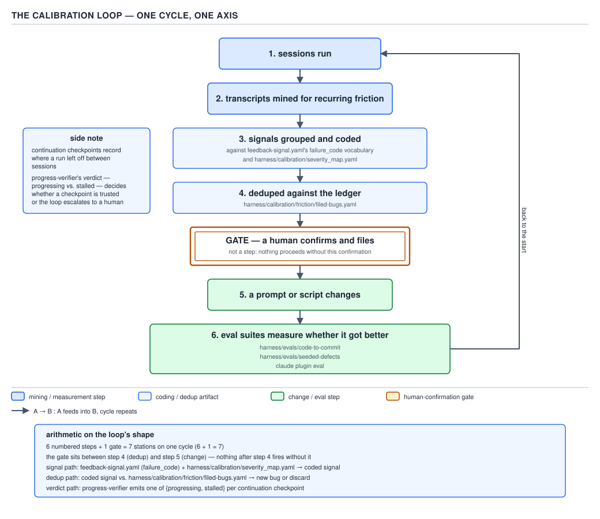

# 21 AI for Coding — the calibration loop and the evals — ADVANCED (INTERNALS) (§3.9.9–3.9.12)

**Target version: Claude Code v2.1.2xx (August 2026).** | **Part 3 of 6** | [Index](../00-index.md)
Previous: [prose executor versus deterministic conductor](03-internals-b-executor-vs-conductor.md) · Next: [evidence, and the checker that switched itself off](../verification/03-internals-a-evidence-and-the-nul-byte.md)

Everything in the previous two files was about a run in flight: six orchestration shapes, fan-out with disjoint paths, the no-stage-writes-its-own-input invariant, and the prose-versus-conductor split. This file is about what happens after a run finishes and someone asks the harness to get better at the next one — the loop that turns a pile of session transcripts into a measurable defect stream, a human-gated filing step, and an eval suite that tells you whether the fix actually helped.

## The failure_code vocabulary, and the gate that guards the loop

**Mental model.** Without a controlled vocabulary, a team lead reading a hundred session transcripts produces a hundred slightly-different sentences about what went wrong — "the coder seemed to miss an edge case," "tests were thin here," "this looked incomplete." With one, the exact same hundred transcripts collapse onto a fixed, enumerable set of buckets, and a bucket is something you can count, rank, and trend over time. `feedback-signal.yaml`'s `failure_code` is that bucket — the same reason an `enum` beats a raw `String` field in the reader's own code: a `String` field for order status admits `"CANCELLED"`, `"Cancelled"`, `"cancel"`, and a typo, and every consumer has to defensively re-normalize; an `OrderStatus` enum admits exactly the values declared, and the compiler catches a typo at the call site instead of a report catching it three months later.

**Why it exists.** `harness/control-plane/schemas/feedback-signal.yaml` states the requirement directly at the `failure_code` field: "Controlled vocabulary for calibrator clustering. Every signal MUST include one. Open-text detail: stays for nuance; failure_code is for pattern matching." Two fields, two jobs — `detail` carries the human sentence for the one engineer who reads that one ticket; `failure_code` carries the machine-groupable key that lets the calibrator answer "how many times has this happened, across how many sessions, this month versus last."

**How it works.** The enum is long — the schema's own comment block groups it by the stage family that emits each code, with a standing note that new stages keep appending to it rather than reusing a near-miss code:

```yaml
enum:
  - ac_coverage_gap         # acceptance criteria missing or incomplete
  - missing_error_flow      # error/edge paths not specified or tested
  - security_gap            # security concern not addressed
  - contract_mismatch       # API/data contract inconsistent with spec
  - test_missing            # tests absent or insufficient
  - setup_incomplete        # setup.md missing or unusable
  - context_insufficient    # producer lacked necessary input context
  - deliverable_missing     # a required deliverable was not produced
  - rubric_threshold_drift  # output quality consistently near threshold
  - spec_ambiguity          # spec unclear; producer guessed incorrectly
  # ... every stage family below appends its own halt/warning codes here,
  # e.g. deploy_ref_mismatch (HALT, no retry), aws_auth_expired,
  # handbook_config_unreadable, friction_playbook_bypass, worktree_handoff_diverged
  - other                   # use sparingly; explain in detail
```

`other` exists, but the schema comment right above it treats it as an escape hatch to be used "sparingly," not a default — a signal that reaches for `other` on the first miss and never gets narrowed defeats the entire point of a closed set, the same way an `OrderStatus.OTHER` value that half the codebase quietly routes through defeats the enum that was supposed to make every status explicit.

`harness/calibration/severity_map.yaml` is the second half of the coding step — it turns a `failure_code` into a rank, not just a bucket:

```yaml
# Ranking formula: frequency × severity × (1 / fix_complexity)
# severity values are 0-10

failure_code_severity:
  security_gap: 10
  contract_mismatch: 8
  missing_error_flow: 7
  ac_coverage_gap: 6
  test_missing: 6
  deliverable_missing: 6
  spec_ambiguity: 5
  context_insufficient: 5
  setup_incomplete: 4
  rubric_threshold_drift: 3
  template_gap: 3
  model_quality: 4
  dependency_missing: 7
  other: 3
  friction_playbook_bypass: 8     # AP-12177 structural bypass — the RFC 0006-closing failure mode
  friction_repeat_correction: 7   # instruction not sticking — highest-value friction signal
  friction_retry_thrash: 6
  friction_silent_dispatch_fail: 5
  friction_dispatch_no_artifact: 4
  friction_correction: 3
  friction_interruption: 2        # noisiest, lowest-signal-per-occurrence detector
```

`frequency × severity × (1 / fix_complexity)` is the whole ranking formula, stated in the file's own header comment — a `failure_code` that fires often, hurts badly, and is cheap to fix outranks one that fires once and would take a rewrite to address. Note the comment on `friction_playbook_bypass: 8` — it is a *mined* friction code (`source: mined_session` in the schema, confidence low by construction) ranked above several *teammate-emitted* codes of nominally comparable severity, because the file's own comment says mined signals are deliberately kept "at/below teammate-emitted severities of comparable shape even where the underlying issue is serious" — an `8` here is already a downward adjustment from what the underlying AP-12177 bypass would score if a teammate had reported it directly.

Deduplication against a ledger is the next station. `plugins/sdlc-harness/agents/calibrator.md` names it directly — `harness/calibration/friction/filed-bugs.yaml`, "team-lead-owned dedup ledger," writable only by the team lead after a human-confirmed filing, never by the calibrator subagent itself. **That file does not exist in this checkout** — `harness/calibration/friction/` is entirely absent from a clean clone, which is correct, not a defect: it is the documented path of a runtime-written ledger, created the first time a `/calibrate` run actually files a bug, the same way a database migration creates its schema on first connect rather than shipping a pre-populated file in source control. `plugins/sdlc-harness/commands/calibrate.md` names the check that reads it: "before filing, load `harness/calibration/friction/filed-bugs.yaml` and skip straight to the next group for any `failure_code` (via its `rollup_key`) already present — a run resumed after a sleep/close never re-confirms or re-files a failure_code it already recorded."



**D-90** — The calibration loop. The human confirmation is a gate, not a step.

**The gate is load-bearing, not ceremonial.** `§0.1.8` established that a model's own fluency — how confidently and coherently it states something — carries zero correlation with whether the statement is correct. Applied here: an agent's own report that "this is a real bug worth filing" is, structurally, the *weakest* evidence anywhere in this loop, because the very same fluency that makes a filed bug read as compelling is present whether or not the underlying pattern is real. `§2.8`'s human-authority rule reserves exactly one class of action for a person: outward-facing and hard to reverse. Filing a Jira ticket under a shared epic that other engineers triage is precisely that class — once filed, it costs a triage pass whether or not it was warranted, and a wrongly-filed ticket cannot be quietly un-filed the way a discarded draft can. `calibrate.md`'s own description of what the human check is actually *for* draws the line exactly where `§2.8` would predict: "it is a check for PII or other sensitive leaks in the built payload... It is explicitly not a judgment call on whether the finding is a 'real' bug, severe enough, or worth engineering time — that assessment belongs to Jira triage after filing." The confirmation gate is narrower than "is this worth filing," and narrower on purpose — the one judgment a human is asked to make here is the one a model has no special standing to make either (spotting a name or hostname that shouldn't leave the machine), while the judgment a model's fluency might tempt it to make unsupervised (is this pattern real and worth someone's time) is routed to Jira triage instead of settled at this gate.

**Insight:** the diagram draws the confirmation as a diamond-shaped gate box, not a numbered step in the same lane as the other six — and that shape is the argument. A step transforms data and the loop continues; a gate can refuse to let anything past it. `calibrate.md` states the mechanical form of that refusal: "Do not proceed to step 3 on silence or an ambiguous reply — ask directly... This is a leak check, not a request for the engineer's opinion on whether the finding matters." Silence does not default to "proceed" the way a step's output defaults to flowing downstream; it defaults to blocked.

**Gotcha.** It is tempting to read "one ticket per `failure_code`" as a dedup optimization and stop there. `calibrate.md` states the actual reason: "6 near-identical 'agent X never confirmed completion' tickets (one per dispatched agent type) would just be noise for the platform team to triage — one ticket listing all 6 affected components is the same defect, filed once." The rollup key is `failure_code`, not `friction_signature` — the vocabulary from the previous section is doing double duty as both the clustering key for measurement and the ticket-granularity key for filing, which is exactly why a code that is too coarse (everything maps to `other`) or too fine (a new code per raw string) breaks both jobs at once.

**Side note — continuation checkpoints, folded into the same loop.** `03-internals-b-executor-vs-conductor.md` already covered `progress-verifier` and `decide_continuation` in full; D-90's side panel exists only to place that mechanism on the same cycle, because a stalled-versus-progressing verdict at a checkpoint is itself a `feedback-signal.yaml` row (`signal_type: judge_reject` or `escalate_to_human`) that feeds the same failure_code clustering this section describes. It is not a second, separate loop — the checkpoint decision and the calibration loop mine the same feedback-log stream, just at different grains (per-continuation versus per-session-pattern).

> A controlled vocabulary turns a pile of session anecdotes into a countable, rankable defect stream; the human confirmation step that gates filing is a refusal point, not a transformation step, because the one judgment routed to a human — is there a leak in this payload — is exactly the judgment a model's own fluency gives it no special authority to make either.

## Evals: the only way to know a prompt change helped

**Mental model.** `§2.7.3` established that a failing test is a machine-checkable specification — the thing a confabulating writer cannot argue its way around, because the test either goes green or it does not. An eval suite is that same idea applied one level up: instead of checking whether *code* satisfies a spec, it checks whether an *agent, prompt, or rubric* still produces the outputs it used to, after someone edits the words that drive it. Prose has no compiler; an eval is the closest substitute.

**Why it exists.** `harness/evals/README.md` states the target directly: "Guards the harness's *output quality* against silent drift. When a quality-bearing artifact changes — a judge rubric, a producer prompt/workflow, or a PRD/story/RFC template — the golden corpus is re-scored and compared to recorded baselines." Without this, a rubric edit that quietly makes `code-review.yaml` stricter (or looser) only surfaces months later, as a trend in filed bugs that nobody can attribute to a specific commit.

**How it works.** Two suites exist in this repository, doing different jobs against different inputs, plus a general-purpose runner that ships with Claude Code itself:

| Suite | Input | What it measures |
|---|---|---|
| `harness/evals/seeded-defects/` + `corpus.yaml` | Frozen golden artifacts (real PRDs, RFCs, story sets) and deliberately flawed ones | Whether a rubric still scores a real artifact at/above baseline, and still scores a planted flaw below 8 |
| `harness/evals/code-to-commit/` | Per-task YAML specs under `tasks/`, run through `runner.py` against fixtures | Whether an end-to-end coding task still lands a working commit, per language/stack |
| `claude plugin eval` (installed Claude Code binary) | `<eval dir>/**/case.yaml` or `prompt.md` + `graders/*.md`, against a target plugin | Whether a plugin's skills/agents/hooks still pass their own scored eval cases, with an optional no-plugin baseline arm for comparison |

`corpus.yaml` is explicit that goldens are referenced **in place**, not copied — "Goldens are referenced in place (not copied) so they track the real artifacts" — so a golden PRD that legitimately improves over time is scored against its *current* text, not a stale snapshot:

```yaml
goldens:
  - id: abs-prd
    rubric: harness/control-plane/judge-rubrics/prd-reviewer.yaml
    artifact: ig-markets-handbook/platforms/ig-markets/projects/account-balance/analysis/product-requirements.md
    note: real published PRD — exemplar for prd-reviewer scoring.

seeded_defects:
  - id: altitude-leak
    rubric: harness/control-plane/judge-rubrics/requirements.yaml
    artifact: harness/evals/seeded-defects/altitude-leak-rfc.md
```

You cannot say "the new rubric is better" without a recorded "before" to compare against — that is what `baselines.yaml` is for, and the file states its own bootstrapping problem plainly: "POPULATED BY THE FIRST REAL EVAL RUN — scores cannot be baked deterministically (they come from an LLM judging the corpus)." Until a first run populates `scores: {}`, `trigger-quality-evals.sh` treats every run as baseline-*establishing*, not gating — there is nothing to regress against yet. Once populated, the file's own rule is one-directional: "baselines may RISE on a reviewed improvement, never silently fall. Lowering a baseline requires an explicit, reviewed commit" — an LLM judge's score is noisy enough (hence the `epsilon: 0.5` jitter band) that a baseline quietly drifting downward run over run would eventually accept a real regression as "normal," so the file makes lowering it a deliberate, reviewed act instead of something that can happen by attrition.

`README.md` states the deterministic-versus-agentic split for the trigger itself: `scripts/trigger-quality-evals.sh` diffs the current ref against a base, "intersects changed paths with the watched set (rubrics, the two workflow.yamls, the prd/story/rfc templates)," and "empty intersection → exit 0, no tokens spent." Only a genuine hit invokes the LLM-judged scoring pass — the routing decision (did anything quality-bearing change) is a deterministic path diff; the scoring itself is "intentionally *not* baked," because scoring an artifact for quality is exactly the judgment call `§2.8` reserves for a model, not a script.

**[DOC]** `claude plugin eval` is a real, installed CLI subcommand — its own `--help` output confirms the shape:

```text
$ claude plugin eval --help
Usage: claude plugin eval [options] [command] [target]

Run eval cases (<eval dir>/**/case.yaml or prompt.md + graders/*.md; the eval
dir is evals/ unless --eval-dir or the manifest says otherwise) against a
plugin and report scored results...

  --ablation <mode>   Run a no-plugin baseline arm and report the score delta
  --judge-model <model>   Override LLM-grader model (default: haiku)
  --max-cost-usd <usd>    Optional hard cost ceiling...
```

**Re-verified against the permitted documentation set as instructed** (`settings`, `settings-reference`, `permissions`, `hooks`, `sub-agents`, `skills`, `memory`, `plugins`, `cli-reference`): the `plugins` guide page (fetched fresh for this leaf) covers authoring skills, agents, hooks, MCP servers, LSP servers, and monitors, but never mentions an `eval` subcommand anywhere in its body. The `cli-reference` page's own CLI-commands table lists `claude plugin` only at the top level — "Manage Claude Code plugins. Alias: `claude plugins`. See plugin reference for subcommands" — and points to a *different* page (`plugins-reference`) for the actual subcommand list, which is **not** one of the nine permitted pages for this leaf set. **Unverified against the permitted doc pages:** whether `claude plugin eval` itself is documented on `code.claude.com/docs/en/` at all — the permitted pages neither confirm nor deny it; what this note instead verifies, per its own escape hatch, is the installed binary's own `--help` text above, which is authoritative for the flag shapes and behavior quoted.

**Insight:** the ablation arm (`--ablation with-without`, the default whenever a plugin resolves) is what makes a plugin eval answer a sharper question than "does this plugin's output look good" — it answers "does having the plugin enabled *change* the score relative to no plugin at all," which is the only honest way to credit a skill or hook with an improvement rather than crediting the base model for work it would have done anyway.

**[TRAP] Over-orchestration.**

**Pitfall:** believing more agents in a pipeline is strictly more thorough — one more reviewer, one more fan-out branch, one more judge pass, each individually justifiable. The symptom shows up three ways at once: more dispatched agents than the task's actual decision points warrant; a pipeline whose coordination overhead (spinning up teammates, waiting on joins, reconciling folded state) costs more wall-clock and token budget than the work being coordinated; and a fan-out whose join step becomes the bottleneck, because every branch has to report back before anything downstream can proceed, so the slowest branch sets the pace for all of them. The fix: before adding another stage or another fan-out branch, ask whether it resolves a genuine decision point (the disjoint-write-path test from `03-internals-a-shapes-and-fan-out.md`) or is being added because "more review" reads as strictly safer — it is not free, and a join that waits on N branches is only as fast as the slowest one.

**Why people believe it:** each individual addition — one more reviewer, one more parallel check — looks locally cheap and locally safer in isolation, and nothing in the harness stops a pipeline from accreting stages one justified-sounding addition at a time; the cost only becomes visible in aggregate, as total latency and total spend, which is exactly the kind of drift the eval suites above exist to catch when it shows up as a rubric or workflow change, but does not catch when it shows up as "we just added another stage."

**[NUM] Concurrency limits that are real, not stylistic.**

Two ceilings are enforced by Claude Code itself, not by convention, per the `sub-agents` documentation:

- **20 concurrent subagents**, by default: "when 20 subagents are running in a session, spawning another with the `Agent` tool fails with `Concurrent subagent limit reached`," and the failure tells the caller not to retry — spawning resumes once the running count drops below 20. Configurable via `CLAUDE_CODE_MAX_CONCURRENT_SUBAGENTS`.
- **Nesting depth 3**, by default: "a subagent can spawn subagents of its own, up to three layers below the main conversation. At the depth limit, Claude Code withholds the `Agent` tool from every subagent except a fork" — so a subagent at the ceiling does its delegated work itself and returns one summary rather than fanning out further. Configurable via `CLAUDE_CODE_MAX_SUBAGENT_SPAWN_DEPTH`.

Neither ceiling is the one that actually bites first in practice. A pipeline can be well inside both — a dozen concurrent branches, two layers of nesting — and still be over-orchestrated, because the practical ceiling that matters is **review capacity**: every dispatched agent that produces an artifact eventually needs a human or a judge to read its output, and that reading capacity does not scale with `CLAUDE_CODE_MAX_CONCURRENT_SUBAGENTS`. A fan-out of 15 branches, all inside the 20-subagent limit, that each need a human to approve their diff before the join proceeds is not throttled by the platform at all — it is throttled by how many diffs one engineer can actually read in a sitting, which is the softer, unenforced ceiling the over-orchestration trap above is actually about.

## Pitfalls

### Believing `failure_code: other` is a safe default when nothing else fits

**Wrong**

Reaching for `other` on the first `failure_code` that does not cleanly match an existing enum value, on the theory that the `detail` field will carry the nuance anyway.

**Right**

`feedback-signal.yaml`'s own comment marks `other` for use "sparingly," and `severity_map.yaml` ranks it at a flat `3` — below every specific code except the lowest-signal friction detectors. A pattern that keeps landing on `other` is invisible to the calibrator's clustering, because clustering groups by `failure_code`, not by parsing `detail` text — the fix is to propose a new enum value once a genuine `other` pattern recurs, not to keep routing it through the escape hatch.

**Why people believe it:** `other` is always available and never blocks a signal from being emitted, so it feels like the safe, non-blocking choice under time pressure — but a controlled vocabulary only does its job if the traffic that should be counted is actually counted under a real bucket.

### Assuming the human-confirmation gate exists to filter out low-value findings

**Wrong**

Treating the `y/n` prompt in `/calibrate` step 3 as the moment an engineer decides whether a mined pattern is "worth" filing, and declining findings that seem minor.

**Right**

`calibrate.md` states the opposite: "it is explicitly not a judgment call on whether the finding is a 'real' bug, severe enough, or worth engineering time — that assessment belongs to Jira triage after filing." The gate checks for PII/sensitive leaks only. The 2026-07-22 policy change documented in `improvement-log.yaml` moved worth-filing triage to Jira precisely because the pipeline had been quietly discarding low-confidence findings before that date, and the fix was to stop deciding "worth" upstream of the human at all.

**Why people believe it:** a human sitting at a confirmation prompt naturally reads their own role as exercising judgment on the content, not just scanning it for one narrow category of leak — the prompt's own wording ("No PII or other sensitive leaks in this preview — file as a Jira bug?") has to be read literally to avoid over-scoping what the human is actually being asked.

## Cheat sheet

| Concept | Key fact |
|---|---|
| `failure_code` | Closed enum in `feedback-signal.yaml`; `detail` carries nuance, `failure_code` carries the countable key |
| Ranking formula | `frequency × severity × (1 / fix_complexity)`, per `harness/calibration/severity_map.yaml` |
| Dedup ledger | `harness/calibration/friction/filed-bugs.yaml` — runtime-written, absent in a clean checkout, keyed by `rollup_key(failure_code)` |
| Human gate | Confirms no PII/leak only — not a worth-filing judgment; that moved to Jira triage (2026-07-22 policy) |
| Ticket granularity | One ticket per `failure_code`, not per raw `friction_signature` |
| `baselines.yaml` | Populated by the first real eval run; may rise, never silently fall |
| `corpus.yaml` | Goldens referenced in place (score ≥ baseline−epsilon); seeded defects must score < 8 |
| `trigger-quality-evals.sh` | Deterministic path-diff trigger; empty intersection → exit 0, no tokens spent |
| `claude plugin eval` | Real installed subcommand; not found on the `plugins` or `cli-reference` permitted doc pages; verified via `--help` instead |
| Concurrent subagent ceiling | 20, via `CLAUDE_CODE_MAX_CONCURRENT_SUBAGENTS` |
| Nesting depth ceiling | 3, via `CLAUDE_CODE_MAX_SUBAGENT_SPAWN_DEPTH` |
| Real bottleneck | Review capacity — unenforced by the platform, usually tighter than either numeric ceiling |

## Self-test

**Q1.** Why does `feedback-signal.yaml` keep both a `detail` field and a `failure_code` field instead of just one free-text field?

<details><summary>Answer</summary>

Because they serve different consumers: `detail` is the human-readable sentence for the one engineer reading that one ticket, and `failure_code` is the closed, countable key the calibrator clusters on to answer "how often has this happened." A single free-text field would make clustering require re-parsing prose every time, the same problem a `String` status field creates versus an enum.

</details>

**Q2.** `harness/calibration/friction/filed-bugs.yaml` does not exist in a clean checkout of this repository. Is that a defect?

<details><summary>Answer</summary>

No. It is a runtime-written dedup ledger — `calibrator.md` states the team lead owns writes to it, only after a human-confirmed Jira filing. It is created the first time a `/calibrate` run actually files a bug, the same way a database migration creates its schema on first connect.

</details>

**Q3.** What is the human confirmation step in `/calibrate` actually checking for, per `calibrate.md`, and what is it explicitly *not* checking for?

<details><summary>Answer</summary>

It checks only for PII or other sensitive leaks (names, hostnames, session/account IDs) in the built Jira payload. It is explicitly not a judgment call on whether the finding is a real, severe, or worth-filing bug — that assessment moved to Jira triage after filing, per the 2026-07-22 policy change.

</details>

**Q4.** Why is a ticket filed per `failure_code` rather than per raw `friction_signature`?

<details><summary>Answer</summary>

Because `severity_map.yaml` itself scores severity at the `failure_code` level, and filing one ticket per near-identical signature (e.g. one per dispatched agent type showing the same underlying friction) would just be triage noise for the platform team — one ticket listing every affected component is the same defect, filed once.

</details>

**Q5.** What does `baselines.yaml` mean by "populated by the first real eval run," and what does the trigger do before that first run?

<details><summary>Answer</summary>

Scores cannot be baked deterministically because they come from an LLM judging the corpus, not from code — so the file ships with `scores: {}`. Before a first real run populates it, `trigger-quality-evals.sh` treats every subsequent run as baseline-establishing, not gating, because there is nothing yet to regress against.

</details>

**Q6.** A rubric change causes a golden artifact's score to drop from 9.1 to 8.9, with `epsilon: 0.5`. Does this count as a regression?

<details><summary>Answer</summary>

No — the drop (0.2) is within the epsilon jitter band (0.5), which exists to absorb the LLM judge's own scoring noise. A regression is a drop that exceeds baseline minus epsilon, i.e. below 8.6 here.

</details>

**Q7.** Is `claude plugin eval` documented on the `plugins` or `cli-reference` pages under `code.claude.com/docs/en/`?

<details><summary>Answer</summary>

No — `plugins` covers authoring skills/agents/hooks/MCP/LSP/monitors but never mentions an eval subcommand, and `cli-reference`'s CLI table lists only the top-level `claude plugin` command, pointing to a separate `plugins-reference` page (not in the permitted set for this leaf) for subcommands. The subcommand's shape is instead verified directly against the installed binary's own `--help` output.

</details>

**Q8.** Why does the over-orchestration trap name "review capacity" as the practical ceiling, when Claude Code itself enforces a 20-concurrent-subagent limit and a nesting depth of 3?

<details><summary>Answer</summary>

Because a pipeline can sit well inside both platform-enforced numbers and still be over-orchestrated — a fan-out of 15 branches (under the 20-subagent ceiling) that each need a human to approve a diff before the join proceeds is throttled by how many diffs one engineer can read in a sitting, a limit the platform does not enforce or even measure.

</details>

## Open questions

Whether `claude plugin eval` is documented anywhere under `code.claude.com/docs/en/` could not be confirmed or denied from the nine permitted pages for this leaf set (`settings`, `settings-reference`, `permissions`, `hooks`, `sub-agents`, `skills`, `memory`, `plugins`, `cli-reference`) — `cli-reference` points to a `plugins-reference` page outside that set for CLI subcommand detail. This note verifies the subcommand's shape against the installed binary's `claude plugin eval --help` output instead, per the leaf's own fallback instruction.

---

**Leaves covered:** 3.9.9–3.9.12 (4 leaves)
**Leaves deferred:** none
**Diagrams included:** D-90
**Target version:** Claude Code v2.1.2xx (August 2026)
**Lines:** 270
