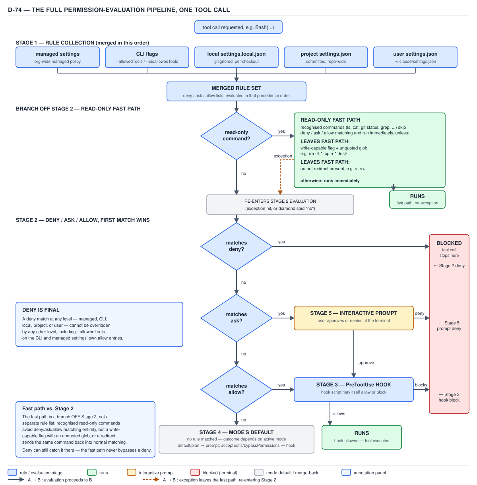

# 21 AI for Coding — the permission-evaluation pipeline — ADVANCED (INTERNALS) (§3.3.1–3.3.4)

**Target version: Claude Code v2.1.2xx (August 2026).** | **Part 3 of 6** | [Index](../00-index.md)
Previous: [compaction hooks and control](../compaction/03-internals-b-hooks-and-control.md) · Next: [three commands traced through matching](03-internals-b-traced-commands.md)

The reader already has eight files' worth of permission mechanism in isolation: the three-list
pipeline and why specificity does not reorder it, why a broad `deny` swallows a narrower `allow`, the
two different things `deny` can mean (`permissions/01-basics-rules-and-order.md`), the Bash
transformation steps and the fixed read-only set (`permissions/02-bash-matching.md`), the fact that
only `Read(path)` and `Edit(path)` rules are ever consulted (`permissions/03-path-rules.md`), the six
permission modes (`permissions/05-modes.md`), and the absolute, cross-layer nature of `deny`
(`permissions/07-precedence-and-overrides.md`). `hooks/04-a-hook-cannot-unblock-a-deny.md` separately
established that a `PreToolUse` hook can narrow an outcome and never widen one. This file's job is
narrower and different from all eight: **assemble every one of those mechanisms into one traced
pipeline, in the order a single tool call actually walks it**, and get the one subtle point — where the
hook sits relative to rule evaluation — exactly right rather than "roughly right."

## §3.3.1 — [DOC] [PROVE] The full pipeline for one tool call

**Mental model.** A tool call is not judged once — it walks a five-stage decision route, and most
calls short-circuit out of it well before the final stage. Picture five checkpoints in a line: the
first checkpoint (rule collection) never rejects anything by itself, it just assembles the rulebook;
the second checkpoint (`deny → ask → allow`) is where most calls are actually decided; a call that
reaches `ask` or falls through unmatched still has to clear a hook before it runs; and only a call that
survives every earlier checkpoint reaches the interactive prompt as a last resort. Nothing about this
route is negotiable per call — the same five stages run for `Bash(npm test)` as for `Write(/etc/hosts)`.

**Why it exists.** Five independent mechanisms — a five-layer settings hierarchy, a three-list rule
pipeline, a fixed built-in exemption, an extensibility hook, and a fallback default — each earn their
place for a different reason (organizational control, fine-grained blocking, unattended reads, dynamic
runtime checks, and a safe default respectively). None of those reasons implies an order on its own.
The order is a design decision layered on top: rules must be fully collected before they can be
checked (stage 1 before stage 2); `deny` and `ask` must resolve before anything extensible gets a say,
or an extension could quietly re-open a blocked call (stage 2 before stage 3); and a mode's default
only applies to what the rules left undecided, so it has to run after them, not instead of them (stage
2 before stage 4).

**How it works.**



**D-74** — The full permission-evaluation pipeline, one tool call from entry to outcome.

**Stage 1 — rule collection.** `permissions/07-precedence-and-overrides.md` §1.4.36 already
established that `deny` behaves as a pool, not a five-layer "highest wins" contest. Re-verified against
`https://code.claude.com/docs/en/settings` on 2026-08-30, the settings-precedence order, highest first,
is:

> Settings precedence, highest first: managed settings, command line, project local, shared project,
> user. A key set at a higher level overrides the same key set lower down.

— *Claude Code settings*, "Settings precedence," re-verified 2026-08-30.

| # | Source | File / mechanism |
|---|---|---|
| 1 | Managed settings | `managed-settings.json`, MDM, or the `claude.ai` console — your organization |
| 2 | Command line | `claude --settings`, `--allowedTools`, `--disallowedTools` — you, this session |
| 3 | Project local | `.claude/settings.local.json` — you, this project |
| 4 | Shared project | `.claude/settings.json` — everyone in the project |
| 5 | User | `~/.claude/settings.json` — you, every project |

For an ordinary settings key with one winning value — `model`, say — this order picks a single winner:
the highest layer that sets the key wins outright. `permissions.deny`, `permissions.ask`, and
`permissions.allow` do not behave that way. `[DOC]` Re-verified against
`https://code.claude.com/docs/en/permissions`:

> Permission rules follow the same settings precedence as all other Claude Code settings, with managed
> settings highest: no other level, including command line arguments, can override a managed
> permission rule.
>
> If a tool is denied at any level, no other level can allow it. For example, a managed settings deny
> can't be overridden by `--allowedTools`, and `--disallowedTools` can add restrictions beyond what
> managed settings define.
>
> The same holds across settings scopes: if user settings allow a permission and project settings deny
> it, the deny rule blocks it. The reverse is also true: a user-level deny blocks a project-level
> allow, because deny rules from any scope are evaluated before allow rules.

— *Configure permissions*, "Settings precedence," re-verified 2026-08-30.

**Stage 1's actual output is not "the winning layer" — it is one merged `deny` list, one merged `ask`
list, and one merged `allow` list, each the union of every layer's entries for that list.** Nothing is
discarded for being at a "lower" layer; every layer's `deny` entries join the same pool, and likewise
for `ask` and `allow`. That merged set of three lists is what stage 2 evaluates.

**Stage 2 — `deny → ask → allow`, first match wins.** `permissions/01-basics-rules-and-order.md` §1.4.2
already worked this pipeline through in isolation:

> Rules are evaluated in order: deny, then ask, then allow. The first match in that order determines
> the outcome, and rule specificity doesn't change the order.

— *Configure permissions*, "Manage permissions," re-verified 2026-08-30.

A match in the merged `deny` list ends the pipeline immediately: **BLOCKED**, a terminal outcome, no
later stage ever runs. A match in `ask` routes to stage 5, the interactive prompt. A match in `allow`
routes to stage 3, the `PreToolUse` hook. No match anywhere falls through to stage 4, the active mode's
default.

**A branch off stage 2 — the read-only fast path.** `permissions/02-bash-matching.md` §1.4.14 already
named the fixed, non-configurable set of Bash commands recognized as read-only —
`ls`, `cat`, `echo`, `pwd`, `head`, `tail`, `grep`, `find`, `wc`, `which`, `diff`, `stat`, `du`, `cd`,
and read-only forms of `git` — and that they run without a prompt in every mode, independent of any
rule in `deny`, `ask`, or `allow`. Placed in the pipeline, that independence is a **branch off stage
2**, not a fourth rule list and not a bypass of `deny`: a recognized read-only command skips
`deny`/`ask`/`allow` matching and runs immediately, *unless* one of two conditions sends it back into
ordinary stage-2 evaluation — covered in full at §3.3.4 below, because the syllabus gives it its own
leaf.

**Stage 3 — the `PreToolUse` hook.** A call that matched `allow` at stage 2, or was approved
interactively at stage 5, or fell to a permissive default at stage 4, still passes through any
registered `PreToolUse` hook before it runs. The hook can itself allow the call (it proceeds to
**RUNS**) or block it (terminal **BLOCKED**, distinct from a stage-2 deny). §3.3.2 below works through
exactly what "before" means here, because the documentation's own wording is more precise — and less
tidy — than a single word implies.

**Stage 4 — the mode's default.** A call that matched nothing in stage 2 does not simply run; it falls
through to whatever the active permission mode does with an unmatched call.
`permissions/05-modes.md` §1.4.25 already tabulated all six modes in full; the two outcomes that matter
for this pipeline are that `default` (Manual) and `plan` mode route an unmatched call to stage 5's
prompt, while `acceptEdits`, `auto`, `dontAsk`, and `bypassPermissions` each have their own default
disposition that, when permissive, still passes through stage 3's hook before the call actually runs.

**Stage 5 — the interactive prompt.** The last resort: a human at the terminal approves or denies. An
approval still passes through stage 3's hook; a denial is terminal.

**[PROVE] Traced end to end for one real call.** Take `claude` running under this project settings
file:

```json
{
  "permissions": {
    "deny": ["Bash(git push *)"],
    "ask": ["Bash(npm publish *)"],
    "allow": ["Bash(npm run *)", "Bash(git commit *)"]
  }
}
```

and this `hooks.json`, registering a `PreToolUse` handler that blocks anything touching a
`.env` file regardless of which rule matched it:

```json
{
  "hooks": {
    "PreToolUse": [
      {
        "matcher": "Bash",
        "hooks": [
          {
            "type": "command",
            "command": "${CLAUDE_PROJECT_DIR}/.claude/hooks/block-destructive-bash.sh"
          }
        ]
      }
    ]
  }
}
```

For the proposed call `Bash(npm run build)`, the pipeline walks:

1. **Stage 1** merges this project's three lists with the (empty, in this example) managed, CLI,
   local, and user layers — nothing to add or remove.
2. **Stage 2 — read-only branch:** `npm run build` is not on the fixed read-only list, so the branch
   does not apply; ordinary matching proceeds. `deny` check: `npm run build` does not match
   `Bash(git push *)` — no match. `ask` check: does not match `Bash(npm publish *)` — no match.
   `allow` check: matches `Bash(npm run *)` — **match**, routes to stage 3.
3. **Stage 3:** `block-destructive-bash.sh` runs, inspects the command text, finds no `.env` reference,
   exits `0` with no decision — the call proceeds.
4. **Outcome: RUNS**, without ever reaching stage 4 or stage 5.

For `Bash(git push origin main)` on the same settings: stage 2's `deny` check matches
`Bash(git push *)` first. **Outcome: BLOCKED at stage 2.** Stages 3, 4, and 5 never execute — not
skipped as an optimization, but genuinely unreachable, because stage 2's `deny` match is a terminal
state in the pipeline, exactly as `permissions/01-basics-rules-and-order.md` established for the
three-list pipeline alone. This is the "deny is final" property this file's terminal note restates for
the whole five-stage version.

**Gotcha.** The five stages are not five independent yes/no gates a call must pass in sequence like a
row of security checkpoints each with veto power — stage 2 alone routes to *either* a terminal
**BLOCKED**, *or* stage 3 directly (on an `allow` match), *or* stage 5 (on an `ask` match), *or* stage 4
(on no match). Stage 3 and stage 5 both feed back into stage 3 before a permissive outcome reaches
**RUNS**. Drawing it as five boxes in a straight line, rather than as a routing diagram with branches,
is the single most common way engineers misremember this pipeline — and is exactly why D-74 is drawn as
a flowchart rather than a numbered list.

> One tool call walks a fixed five-stage route — rule collection, then `deny → ask → allow` with a
> read-only fast-path branch, then the `PreToolUse` hook, then the mode's default, then the
> interactive prompt — and a `deny` match at stage 2 is terminal: no later stage ever runs.

## §3.3.2 — [DOC] Where the `PreToolUse` hook sits, and why it cannot unblock a `deny`

**Mental model.** The syllabus row that names this leaf frames the hook as running "after" rule
evaluation, as if stage 2 and stage 3 were simply adjacent steps in a strict sequence. Read closely,
the documentation says something narrower and more precise, and getting the difference right matters
because a reader who only remembers "hook runs after rules" cannot correctly answer what happens when a
hook *blocks* — that case is not "after" anything.

**How it works, re-verified directly against the live pages on 2026-08-30** (not carried over from an
earlier pass) — `https://code.claude.com/docs/en/permissions`, section "Extend permissions with
hooks":

> When Claude Code makes a tool call, PreToolUse hooks run before the permission prompt, for every
> tool except `EndConversation`. The hook output can deny the tool call, force a prompt, or skip the
> prompt to let the call proceed.
>
> Hook decisions don't bypass permission rules. Claude Code evaluates deny and ask rules regardless of
> what a PreToolUse hook returns: a matching deny rule blocks the call, and a matching ask rule still
> prompts even when the hook returned `"allow"` or `"ask"`. This preserves the deny-first precedence
> described in Manage permissions, including deny rules set in managed settings.
>
> A blocking hook also takes precedence over allow rules. A hook that exits with code 2 stops the tool
> call before permission rules are evaluated, so the block applies even when an allow rule would
> otherwise let the call proceed.

— *Configure permissions*, "Extend permissions with hooks," re-verified 2026-08-30.

The `hooks` page itself, fetched the same session, states only that `PreToolUse` fires "before a tool
call executes" and that a hook with no decision (exit `0`) lets "the tool call continue through the
normal permission flow" — it does not, on this fetch, carry its own prose section stating an ordering
relative to rule evaluation; the load-bearing claim lives on the `permissions` page, in the section
quoted above.

**Reconciling the syllabus's framing with what the docs actually say.** The syllabus row commissioning
this leaf calls the guarantee "the `PreToolUse` hook runs strictly after rule evaluation." That is not
quite what the quoted text says, and `hooks/04-a-hook-cannot-unblock-a-deny.md` §2.3.16 already worked
through the same reconciliation for this exact quote — this section restates it here because this
pipeline's stage ordering depends on getting it right, not because the finding is new:

- A `PreToolUse` hook runs **before the permission prompt** — that is a claim about timing relative to
  stage 5, not about timing relative to stage 2's `deny`/`ask`/`allow` check.
- A **blocking** hook (exit `2`) is stated to stop the call **"before permission rules are evaluated"**
  — which, read literally, places a blocking hook's effect *ahead of* stage 2, not after it.
- What the documentation actually guarantees is **narrower and asymmetric**, not a uniform "hook runs
  second": `deny` and `ask` are evaluated *regardless of* what the hook returned, so a hook's `allow`
  can never suppress a matching `deny` or `ask`. A hook's block, conversely, *does* take effect ahead of
  an `allow` rule that would otherwise have let the call through.

So this file's stage-3-after-stage-2 drawing in D-74 is accurate for the case that matters in
practice — a call that stage 2 already routed to `allow` still visibly passes through the hook next —
but it is not literally what the documentation asserts for a *blocking* hook, which the docs describe
as pre-empting rule evaluation rather than following it. **Both descriptions agree on the one fact this
pipeline needs to be correct:** a hook can only narrow the stage-2 outcome (turn an `allow` into a
block or a forced prompt) and can never widen it (turn a `deny` or `ask` into a proceed). The mechanism
producing that guarantee is "the rules are checked independently of the hook's approval," not a strict
temporal "hook always runs second" — and a reader who states it as strict temporal ordering will
correctly predict every case except an explanation of *why* a blocking hook works, where "it ran after
the rules decided" is not the docs' own account.

`[TRAP]` **Pitfall:** the wrong belief in action: "the `PreToolUse` hook is the last gate before a tool
call runs, positioned strictly after the deny/ask/allow check — so returning `allow` from a hook is a
safe way to double-confirm a call the rules already approved." The symptom: nothing observably breaks
for calls the rules already approved, which is exactly why the belief survives — it only fails silently
on the one case that matters, a hook trying to *reopen* a call the rules denied. **Fix:** hold the
narrower, asymmetric version — a hook can add a block or a forced prompt on top of what the rules
decided, and can never remove one; treat "before" and "after" as informal shorthand for that asymmetry,
not as a literal position in a numbered sequence. **Why people believe it:** the syllabus-level, blog-
level shorthand ("hooks run after permissions") is close enough to right for the common case that it
never gets corrected against the documentation's own more careful wording until a blocking hook's
timing is the specific question being asked.

`[X-REF]` The full worked example — a `deny` rule, a `hooks.json`, a hook script computing a specific
`allow` decision, and the observed **BLOCKED** outcome anyway — lives in
`hooks/04-a-hook-cannot-unblock-a-deny.md` §2.3.16; this leaf does not repeat that artefact quartet, only
the ordering claim it depends on.

> The documentation does not describe a strict "hook runs after rules" ordering — it describes an
> asymmetric guarantee: `deny` and `ask` are evaluated regardless of the hook's output, so a hook can
> narrow the stage-2 outcome and never widen it, which is the fact this pipeline's stage 3 actually
> needs to be true.

## §3.3.3 — [PROVE] Bash matching in detail, three commands traced through it

**Mental model.** A Bash rule never matches the raw string the model emitted. Four transformations run
first, in the order the syllabus names them — separator splitting, wrapper stripping, env-assignment
stripping, then per-subcommand matching — and each one can change which literal text the rule actually
sees. Skipping straight to "does the rule match" without walking those four steps is how an engineer
convinces themselves a rule covers a command it does not.

**How it works, traced for three real commands** against this settings file:

```json
{
  "permissions": {
    "deny": ["Bash(rm -rf *)"],
    "ask": [],
    "allow": ["Bash(npm test *)", "Bash(git commit *)"]
  }
}
```

**Command 1 — `NODE_ENV=test timeout 30 npm test && rm -rf build/`**

1. **Separator splitting.** `permissions/01-basics-rules-and-order.md` §1.4.9 already named the seven
   recognized separators (`&&`, `||`, `;`, `|`, `|&`, `&`, newline). This command splits on `&&` into
   two independent subcommands: `NODE_ENV=test timeout 30 npm test` and `rm -rf build/`. Each is
   matched on its own from here forward; nothing about subcommand 2 is influenced by subcommand 1
   clearing any rule.
2. **Wrapper stripping.** Re-verified against `https://code.claude.com/docs/en/permissions`,
   "Wrappers": `timeout`, `time`, `nice`, `nohup`, `stdbuf`, plus the shell builtins `command` and
   `builtin`, and zsh's `noglob`, are stripped before matching. Subcommand 1's `timeout 30` prefix is
   stripped, leaving `NODE_ENV=test npm test`. Subcommand 2 carries no wrapper.
3. **Env-assignment stripping.** `[DOC]` "Claude Code also strips a leading assignment of certain
   known-safe environment variables, so `Bash(npm test *)` matches `NODE_ENV=test npm test`." —
   *Configure permissions*, "Wrappers," re-verified 2026-08-30. `NODE_ENV` is one of the known-safe
   variables, so the leading assignment on subcommand 1 is stripped, leaving the literal text
   `npm test`. Subcommand 2 has no assignment to strip.
4. **Per-subcommand matching.** `npm test` matches `Bash(npm test *)` in `allow` — subcommand 1
   clears. `rm -rf build/` matches `Bash(rm -rf *)` in `deny` — subcommand 2 is blocked. Because the
   two subcommands are matched independently and a `deny` match is terminal for the call it applies to,
   **the overall tool call is blocked**, attributed to subcommand 2, even though subcommand 1 alone
   would have run unattended. `permissions/01-basics-rules-and-order.md` §1.4.9's "each resulting
   subcommand must clear the deny → ask → allow pipeline on its own" is exactly what is observed here.

**Command 2 — `FOO=bar rm -rf /tmp/scratch/*`**

1. **Separator splitting.** No recognized separator present — one subcommand, the whole string.
2. **Wrapper stripping.** No wrapper prefix present — nothing stripped.
3. **Env-assignment stripping.** `[DOC]` "An allow rule won't match past an assignment of any other
   variable. A deny or ask rule matches past any leading assignment, so `Bash(rm *)` in deny still
   matches `FOO=bar rm -rf tmp/`." — *Configure permissions*, "Wrappers," re-verified 2026-08-30. `FOO`
   is not on the known-safe list, so an `allow` rule would stop at the assignment and not match past
   it — but `deny` is not held to that restriction: a `deny` rule strips *any* leading assignment,
   known-safe or not, before matching. The literal text presented to the `deny` check is
   `rm -rf /tmp/scratch/*`.
4. **Per-subcommand matching.** `rm -rf /tmp/scratch/*` matches `Bash(rm -rf *)` in `deny`. **Outcome:
   blocked.** The asymmetry in step 3 is exactly why: had this been an `allow` rule for
   `Bash(rm -rf *)` instead of `deny`, the unknown `FOO=bar` assignment would have prevented the match
   and the command would have fallen through unmatched — a `deny` rule does not get that same escape,
   by design, because letting an arbitrary env-var prefix defeat a `deny` would make every `deny` rule
   trivially bypassable with `X=1 <dangerous command>`.

**Command 3 — `find src -name "*.log" | xargs -n1 grep -l ERROR`**

1. **Separator splitting.** `|` is a recognized separator, splitting into
   `find src -name "*.log"` and `xargs -n1 grep -l ERROR`.
2. **Wrapper stripping.** `[DOC]` "Bare `xargs` is also stripped, so `Bash(grep *)` matches
   `xargs grep pattern`. Stripping applies only when `xargs` has no flags: an invocation like
   `xargs -n1 grep pattern` is matched as an `xargs` command, so rules written for the inner command do
   not cover it." — *Configure permissions*, "Wrappers," re-verified 2026-08-30. Subcommand 2 carries
   `-n1`, a flag, so the bare-`xargs`-stripping exception does not apply here: `xargs -n1 grep -l
   ERROR` is matched **as an `xargs` invocation**, not as the inner `grep` command. Subcommand 1 has no
   wrapper to strip.
3. **Env-assignment stripping.** No leading assignment on either subcommand — nothing to strip.
4. **Per-subcommand matching.** Subcommand 1, `find src -name "*.log"`, is a recognized read-only
   `find` form (§3.3.4 above) with a *quoted* glob and no write-capable flag, so it takes the read-only
   fast path and runs immediately without ever reaching `deny`/`ask`/`allow`. Subcommand 2,
   `xargs -n1 grep -l ERROR`, matches none of `deny`, `ask`, or `allow` — there is no rule for `xargs`
   at all in this settings file, and it is not on the fixed read-only list — so it falls through to
   stage 4, the active mode's default (a prompt, under Manual mode).

**Gotcha.** All three traces land on a different pipeline exit for what looks, at a skim, like a
similar shape of compound command — one blocked outright (subcommand-level deny), one blocked via an
asymmetric stripping rule an engineer could easily assume worked the other way, and one that runs one
half unattended and prompts for the other half. **There is no single answer to "does this compound
command run" that does not require walking all four transformation steps for every subcommand.**

> Bash matching runs four transformations before any rule is checked — split on the seven recognized
> separators, strip a fixed wrapper list, strip a leading known-safe env assignment for `allow` only
> (`deny`/`ask` strip any assignment), then match each resulting subcommand independently — and a
> compound command's outcome is decided per subcommand, not as one string.

## §3.3.4 — [DOC] The read-only fast path, and the two cases that leave it

**Mental model.** The fast path is not a shortcut around the pipeline's safety property — it is a
narrow, fixed carve-out for commands the harness can already prove are safe, and the two exit
conditions exist precisely because "the command name is on the safe list" stops being sufficient proof
the moment the *arguments* could make it unsafe.

**Why it exists.** Prompting for `ls`, `cat`, or `git log` on every single call would make the tool
unusable — dozens of prompts per session for actions with no destructive potential at all. The
built-in read-only set exists to make that friction disappear specifically where it is safe to,
without touching the `deny`/`ask`/`allow` pipeline that everything else still goes through.

**How it works.** Re-verified against `https://code.claude.com/docs/en/permissions`, "Read-only
commands," on 2026-08-30:

> Claude Code recognizes a built-in set of Bash commands as read-only and runs them without a
> permission prompt in every mode. These include `ls`, `cat`, `echo`, `pwd`, `head`, `tail`, `grep`,
> `find`, `wc`, `which`, `diff`, `stat`, `du`, `cd`, and read-only forms of `git`. The set is not
> configurable; to require a prompt for one of these commands, add an `ask` or `deny` rule for it.
>
> Unquoted glob patterns are permitted for commands whose every flag is read-only, so `ls *.ts` and
> `wc -l src/*.py` run without a prompt.
>
> In Manual mode, commands from this set still prompt in these cases:
>
> * **Unquoted globs for commands with write-capable flags**: commands with write-capable or
>   exec-capable flags, such as `find`, `sort`, `sed`, and `git`, prompt when an unquoted glob is
>   present, because the glob could expand to a flag like `-delete`.
> * **Commands the analysis can't parse**: when Claude Code can't fully parse a command, it asks for
>   approval instead of treating the command as read-only. Commands longer than 10,000 characters
>   always prompt because they exceed what the analysis parses.

— *Configure permissions*, "Read-only commands," re-verified 2026-08-30.

The syllabus for this leaf names exactly two exit conditions — write-capable flags with unquoted globs,
and redirects — so this file covers those two precisely, while noting the docs quoted above list
additional edge cases (`docker` pointed at another daemon, `file` with path-opening flags, Windows
network paths, unparseable commands) that this syllabus does not assign to this leaf.

**[NUM] Case 1 — write-capable flags with unquoted globs.** `find`, `sort`, `sed`, and `git` are on the
read-only list but accept flags that mutate — `find -delete`, `sed -i`, `git add`. An unquoted glob
next to one of these commands could *expand into* one of those flags at shell-execution time, so the
fast path refuses to trust the glob and routes the call back into ordinary stage-2 matching:

```text
find . -name "*.log" -print          → fast path: literal flag, no glob expansion risk, runs immediately
find . -name *.log -delete           → leaves fast path: unquoted glob + write-capable flag (-delete)
```

**Case 2 — redirects.** Re-verified against `https://code.claude.com/docs/en/permissions`,
"Redirections":

> Claude Code checks the target of an output redirection, such as `>`, `>>`, or `2>`, as a file write.
> The check covers your `Edit` allow and deny rules, protected paths, and the working directories. A
> rule such as `Bash(git commit *)` allows the command, not the target. A `/dev/null` target isn't
> checked. A target that starts with `~` or contains a glob character needs approval.

— *Configure permissions*, "Redirections," re-verified 2026-08-30.

A read-only command with a redirect leaves the fast path because the redirect target is itself a
potential write, independent of how safe the command portion is:

```text
git log --oneline                      → fast path: recognized read-only git form, no redirect
git log --oneline > .git/hooks/post-commit  → leaves fast path: redirect checked as a file write
                                             against Edit rules and protected paths
```

`git log --oneline` reads a read-only history view; redirected into `.git/hooks/post-commit`, the same
command portion writes a git hook that runs on every future commit — a case
`permissions/02-bash-matching.md` §1.4.15 already worked through in full for the Bash-matching layer
alone. Placed in the pipeline: the fast-path diamond in D-74 answers "no" the moment a redirect is
present, sending the whole call back into stage 2, where the redirect's target — not the `git log`
portion — is what gets checked against `Edit` rules and protected paths.

**Gotcha.** Leaving the fast path is not the same as being blocked. Both exit conditions route the
call back to **ordinary stage-2 evaluation**, where it can still match `allow`, still fall through to a
mode default, or still be denied — leaving the fast path only removes the free pass, it does not
itself produce an outcome. And re-entering stage 2 does not bypass `deny`: D-74's terminal note applies
here exactly as everywhere else in this pipeline — the fast path never lets a command outrun a matching
`deny` rule, because the fast path is a branch *off* stage 2, and a command that leaves it lands back
inside the same deny-first check.

`[TRAP]` **Pitfall:** the wrong belief: "the built-in read-only list means `find`, `sed`, and `git` are
always unattended, since they're on the safe list." The symptom: `find . -name "*.log" -print` runs
silently, and the engineer generalizes that `find` never prompts — then `find . -name *.log -delete`
suddenly does, which reads as inconsistent behavior from "the same command." **Fix:** the read-only
exemption is conditional on the specific invocation, not the command name — an unquoted glob next to
one of these commands' write-capable flags forfeits the exemption for that call only, and the fix is
either to quote the glob (`find . -name '*.log' -delete`, which stays a literal string) or accept the
prompt. **Why people believe it:** the documentation's own framing — "a built-in set of read-only
commands" — reads as a per-command property when it is actually closer to a per-invocation one for
`find`, `sort`, `sed`, and `git` specifically.

**Interview:** "`grep` is on the built-in read-only list. Does `grep pattern *.log` ever prompt?" — no,
because every flag `grep` accepts is inherently read-only, so an unquoted glob next to it carries no
write risk and the fast path never has a reason to exit for `grep`. The write-capable-flag exit
condition only applies to commands that *have* a write-capable flag in the first place — `find`,
`sort`, `sed`, and `git` — not to every command on the list.

> The read-only fast path skips `deny`/`ask`/`allow` matching for a fixed set of fifteen command
> shapes, but an unquoted glob next to a write-capable flag, or any output redirect, forfeits the
> exemption for that specific call and sends it back into ordinary stage-2 evaluation — the fast path
> never bypasses a `deny`.

## Pitfalls

- **Belief:** "The `PreToolUse` hook runs strictly after the permission rules decide, full stop."
  **Outcome:** true for the case that matters in practice (a hook narrowing an `allow`), but the
  documentation's own wording for a *blocking* hook says it stops the call "before permission rules are
  evaluated" — the opposite temporal direction from the common shorthand. **Fix:** hold the asymmetric
  version instead of a strict ordering: `deny`/`ask` are evaluated regardless of the hook's output, so
  a hook narrows and never widens, independent of which stage runs "first" in wall-clock terms. **Why
  people believe it:** the shorthand is close enough to right for every case except explaining a
  blocking hook's own timing, so it survives until that specific question is asked.
- **Belief:** "`find`, `sed`, and `git` are unattended because they're on the built-in read-only list,
  full stop." **Outcome:** `find . -name "*.log" -print` runs silently; `find . -name *.log -delete`
  prompts, because the unquoted glob sits next to a write-capable flag and forfeits the exemption for
  that call only. **Fix:** quote the glob, or expect the prompt — the exemption is per-invocation for
  these four commands, not blanket per-command. **Why people believe it:** "a built-in set of read-only
  commands" reads as a property of the command name, not of the specific call.

## Cheat sheet

| Stage | What it checks | Terminal outcomes it can produce |
|---|---|---|
| 1 — rule collection | managed → CLI → local project → shared project → user, merged into one `deny`/`ask`/`allow` set | none — assembly only |
| Branch off 2 — read-only fast path | is the command one of 15 recognized read-only shapes, with no write-capable-flag-glob or redirect exception | RUNS (fast path) |
| 2 — deny/ask/allow | first match wins, in that order | BLOCKED (deny) |
| 3 — `PreToolUse` hook | may allow or block regardless of how the call reached it | BLOCKED (hook) |
| 4 — mode's default | only for calls stage 2 left unmatched | routes to stage 3 or stage 5 |
| 5 — interactive prompt | human approves or denies | BLOCKED (prompt deny) |
| Deny finality | a `deny` match at any settings layer cannot be overridden by any other layer, `--allowedTools`, or managed settings | — |
| Fast-path exits | unquoted glob + write-capable flag; any output redirect | re-enters stage 2 |

## Self-test

1. A call matches an `allow` rule at stage 2. Which stage does it go to next, and can that stage still
   block it?
<details><summary>Answer</summary>Stage 3, the `PreToolUse` hook. Yes — a hook can block a call the
rules already allowed; an `allow` match routes to the hook, it does not run the call directly.</details>

2. Does the documentation describe the `PreToolUse` hook as running strictly after `deny`/`ask`/`allow`
   evaluation?
<details><summary>Answer</summary>Not exactly. It says a hook runs "before the permission prompt," and
a *blocking* hook (exit 2) "stops the tool call before permission rules are evaluated." The actual
guarantee is asymmetric — `deny`/`ask` are evaluated regardless of the hook's output — not a strict
temporal "hook runs second."</details>

3. `git log --oneline` is on the read-only list and runs unattended. Does `git log --oneline >
   .git/hooks/post-commit` also run unattended?
<details><summary>Answer</summary>No. The redirect leaves the fast path — the redirect target is
checked as a file write against `Edit` rules and protected paths, independent of how read-only the
command portion is.</details>

4. `find . -name "*.log" -print` runs without a prompt. Why does `find . -name *.log -delete` prompt
   even though `find` is on the read-only list?
<details><summary>Answer</summary>`find` has a write-capable flag (`-delete`), and the unquoted glob
next to it could expand into that flag at shell-execution time, so the fast path forfeits the exemption
for that specific invocation and routes it back into ordinary deny/ask/allow matching.</details>

5. A managed settings file denies `Bash(aws *)`. Can a `PreToolUse` hook returning `permissionDecision:
   allow` make an `aws s3 ls` call run?
<details><summary>Answer</summary>No. `deny` is evaluated regardless of what the hook returns, and a
deny at any settings layer — including managed — cannot be overridden by any other level or by a hook.
The call is blocked at stage 2, before the hook's output is ever consulted for the yes/no
decision.</details>

6. What does stage 1 actually produce — a single winning settings layer, or something else?
<details><summary>Answer</summary>One merged `deny` list, one merged `ask` list, and one merged `allow`
list, each the union of every settings layer's entries for that list — not a single winning layer, the
way an ordinary settings key like `model` resolves.</details>

7. Is leaving the read-only fast path the same as being blocked?
<details><summary>Answer</summary>No. Leaving the fast path only removes the free pass and routes the
call to ordinary stage-2 evaluation, where it can still match `allow`, fall to a mode default, or be
denied. It does not itself produce an outcome.</details>

## Open questions

None.

---

**Leaves covered:** 3.3.1–3.3.4 (4 leaves)
**Leaves deferred:** none
**Diagrams included:** D-74
**Target version:** Claude Code v2.1.2xx (August 2026)
**Lines:** 551
