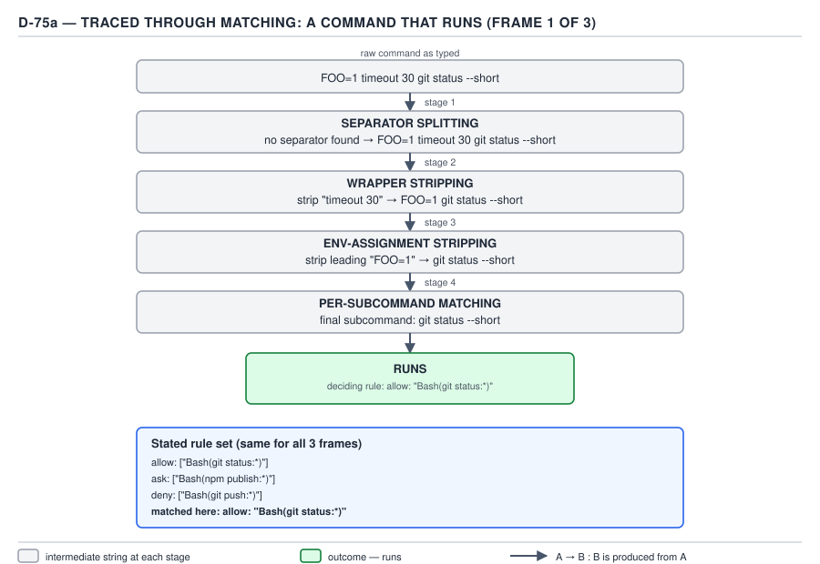
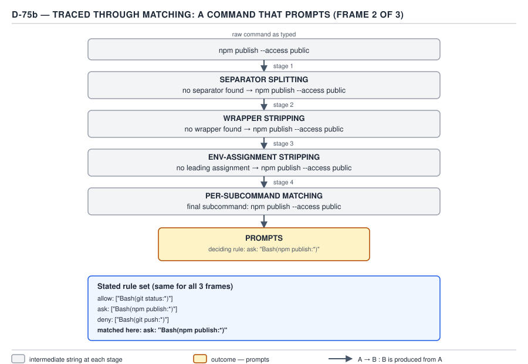
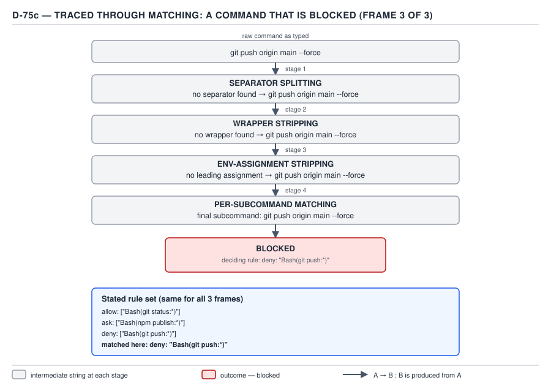

# 21 AI for Coding — commands traced through matching — ADVANCED (INTERNALS) (§3.3.5–3.3.8)

**Target version: Claude Code v2.1.2xx (August 2026).** | **Part 3 of 6** | [Index](../00-index.md)
Previous: [the permission-evaluation pipeline](03-internals-a-the-pipeline.md) · Next: [the four billed quantities](../cost-model/03-internals-a-the-four-quantities.md)

## This file's leaves are path-matching internals, tool consultation, the sandbox mechanism, and one adversarial exercise — not a Bash re-trace

`permissions/03-path-rules.md` §1.4.16–1.4.19 already built the BASICS-tier argument for path rules: the four gitignore anchors, the `Read`-deny-propagates-to-`Edit`/`Write`-but-not-`NotebookEdit` chain, the `Edit(path)`/`Read(path)`-only consultation rule with its D-32 table, and the arbitrary-subprocess boundary. `permissions/08-sandbox-and-a-real-block.md` §1.4.39 already named the sandbox as the layer below permissions and tabulated its `filesystem`/`network`/`credentials` settings sub-areas. Re-verified against the live docs on 2026-08-30 for this file, the current `permissions` and new `sandboxing` pages carry substantially more mechanism than either BASICS file quoted — both pages have grown since those files were written, which is exactly the kind of staleness this pipeline warns readers to re-check for rather than recall. This file's four leaves go past what those two files already established: symlink and Windows-path matching mechanics for §1.4.16's anchors (§3.3.5), a tool-consultation trap distinct from the one §1.4.18 already covered (§3.3.6), the actual OS primitive and its documented limits underneath §1.4.39's sandbox (§3.3.7), and a ten-command adversarial exercise, verified live against the installed v2.1.251 binary, that reuses D-75's exact three-outcome rule set (§3.3.8).

## §3.3.5 — [DOC] [PROVE] Symlinks and Windows paths: two more inputs to the same matcher

**Mental model.** §1.4.16 already established that a path rule's anchor prefix picks a *root*; what it did not yet cover is that the string the matcher actually compares against is not always the one Claude typed — a symlink hop or a Windows drive letter rewrites it first, and the rewrite happens before `deny`/`ask`/`allow` ever sees the pattern.

**Why it exists.** A path rule that only ever checked the literal string in a tool call would be trivially defeated by a symlink pointing at a denied file, or would need to be written twice — once in POSIX form, once in Windows form — to protect the same file on both platforms. Neither gap is acceptable for a security-relevant deny.

**How it works, re-verified against `https://code.claude.com/docs/en/permissions` on 2026-08-30.** Quoted exactly:

> When Claude accesses a symlink, permission rules check two paths: the symlink itself and the file it resolves to. Allow and deny rules treat that pair differently: allow rules fall back to prompting you, while deny rules block outright.

> **Allow rules**: apply only when both the symlink path and its target match. A symlink inside an allowed directory that points outside it still prompts you.
> **Deny rules**: apply when either the symlink path or its target matches. A symlink that points to a denied file is itself denied.

— *Configure permissions*, "Read and Edit," re-verified 2026-08-30.

`[PROVE]` Worked against `Read(./project/**)` in `allow` and `Read(~/.ssh/**)` in `deny`, with a symlink `./project/key` pointing at `~/.ssh/id_rsa`:

1. Path 1, the symlink itself: `./project/key`. Checked against `deny` — `Read(~/.ssh/**)` does not match this path. Checked against `allow` — `Read(./project/**)` matches.
2. Path 2, the resolved target: `~/.ssh/id_rsa`. Checked against `deny` — `Read(~/.ssh/**)` matches.
3. **Deny applies on an either-path match, so step 2 alone is decisive.** Allow required *both* paths to match, and step 2 already failed the allow rule (it does not match `Read(./project/**)`) even before deny's own outright block is considered. **Outcome: blocked.** The documentation's own example arrives at the identical result.

This asymmetry mirrors the deny/allow asymmetry §1.4.16 already established for single-segment directory depth (deny/ask reach every depth, allow reaches only the top level) — in both cases, `allow` is held to the *stricter* condition (every component must independently qualify) and `deny` to the *looser* one (any component qualifying is enough), because the failure mode of a falsely-narrow `allow` is a spurious prompt, while the failure mode of a falsely-narrow `deny` is a leaked secret.

`[DOC]` `[NUM]` Windows paths are normalized before matching, not matched in native form:

> On Windows, paths are normalized to POSIX form before matching. `C:\Users\alice` becomes `/c/Users/alice`, so use `//c/**/.env` to match `.env` files anywhere on that drive. To match across all drives, use `//**/.env`.

— *Configure permissions*, re-verified 2026-08-30.

So a rule author on Windows writes `//c/**/.env`, never `C:\Users\alice\**\.env` — the matcher never sees drive-letter syntax at all, only the POSIX-normalized form, and a rule written in native Windows syntax simply never matches anything, silently, the same failure shape as §1.4.18's tool-name mistakes: it parses, it loads, and it protects nothing.

**Gotcha.** A reader who has only internalized "deny wins on any match" from the three-list pipeline can still get a symlink case wrong, because *which path* deny checks is the part that's easy to skip: a denied target reached through an allowed symlink is blocked (correct), but the inverse mistake — assuming an *allowed* symlink is safe because its own path matched `allow` — ignores that allow additionally requires the *target* to match, which is precisely what the worked example above shows failing.

> A path rule is checked against two strings when the object is a symlink — the link and its target — with `allow` requiring both to match and `deny` requiring only one; and on Windows, both strings are POSIX-normalized before either check runs.

## §3.3.6 — [DOC] Which tools actually get checked, past the `Edit`/`Read`-only rule

**Mental model.** §1.4.18 already proved the headline trap: a path rule written against `Write`, `NotebookEdit`, `MultiEdit`, or a bare settings-file `Glob` is accepted and never consulted. This leaf is the trap one layer beneath that one — for the tools `Read`/`Edit` genuinely *do* reach indirectly (`Grep`, `Glob`), and for a second, unrelated rule shape that looks like a path rule but is quietly rejected for a different reason entirely.

**How `Grep`/`Glob` are actually reached.** `[DOC]` Re-verified 2026-08-30:

> Claude makes a best-effort attempt to apply `Read` rules to all built-in tools that read files like Grep and Glob, to `@file` mentions in your prompts, and to the selection and open-file context that a connected IDE shares with Claude.

> Grep and Glob search the directory the `path` argument resolves to. Claude Code applies `Read` deny rules to that directory.

— *Configure permissions*, re-verified 2026-08-30.

The mechanism is not "match the search pattern against the rule" — it is "resolve `Grep`'s or `Glob`'s `path` argument to a directory first, then check that resolved directory against `Read` deny rules," exactly the same two-step shape §3.3.5 just showed for symlinks: resolve, then check the resolved thing, not the thing as typed. A `Grep` call with `path: "secrets"` and pattern `password` is checked by resolving `secrets` to `<cwd>/secrets`, then asking whether `Read(./secrets/**)` denies that directory — the pattern text `password` never enters the check at all. This is also why the syllabus for this leaf frames the D-32 table's `Grep` row as "best-effort" rather than "guaranteed": `Read` was never designed with `Grep`/`Glob` in mind the way it was for the built-in `Read` tool, so the two are folded in as an extension of the same deny list rather than a first-class rule shape of their own.

`[TRAP]` **A second, unrelated way to write a rule that is silently rejected — not for the wrong tool name, but for the wrong field.** §1.4.18 already covered writing a path rule against the wrong *tool*. The current documentation adds a distinct mistake against the wrong *parameter name*, introduced by a newer feature this topic's BASICS-tier files predate: parameter matching, `Tool(param:value)`, which lets a deny or ask rule gate any scalar top-level field on a built-in tool — `Agent(model:opus)`, `Bash(run_in_background:true)`. Quoted exactly:

> You can't match a tool's primary content field this way: `command` for Bash and PowerShell, `file_path` for Read, Edit, and Write, `path` for Grep and Glob, `notebook_path` for NotebookEdit, and `url` for WebFetch. A rule like `Bash(command:rm *)` would be bypassable by a compound command, so Claude Code ignores it and emits a startup warning. Use `Bash(rm *)`, `Read(./path)`, or `WebFetch(domain:host)` instead.

— *Configure permissions*, "Match by input parameter," re-verified 2026-08-30.

**Pitfall:** the wrong belief is "parameter matching works on any field, so `Read(file_path:./secrets/**)` is just a more explicit spelling of `Read(./secrets/**)`." The symptom: the rule is accepted at load time and produces a startup warning most workflows never read, and every `Read` call against `./secrets/**` proceeds exactly as if the rule did not exist — because `file_path`, `command`, `path`, `notebook_path`, and `url` are excluded from parameter matching specifically *because* each already has its own dedicated specifier syntax (`Read(./path)`, `Bash(cmd *)`, `WebFetch(domain:host)`), and letting a generic parameter rule also gate those fields would let a compound command or an unusual path spelling slip past the field-specific check the same way a raw `Bash(command:rm *)` rule would. **Fix:** use each tool's own specifier syntax for its primary content field — `Read(./secrets/**)`, not `Read(file_path:./secrets/**)` — and reserve `Tool(param:value)` for the scalar fields that have no dedicated syntax of their own, such as `Agent(model:...)` or `Bash(run_in_background:...)`. **Why people believe it:** parameter matching is documented as working for "any scalar parameter the tool accepts," which reads as unconditional until the five excluded fields — every one of them a primary content field — are checked against the actual rule.

> `Grep` and `Glob` are checked by resolving their `path` argument to a directory and applying `Read` deny rules to that directory, never by matching their search pattern; and a path-shaped rule written against a tool's primary content field via `Tool(field:value)` syntax — `file_path`, `command`, `path`, `notebook_path`, `url` — is accepted, warned about at startup, and never consulted, for the same reason a `Write(path)` rule is: a rule form the mechanism explicitly excludes rather than a mistaken tool name.

## §3.3.7 — [DOC] [RESEARCH] [TRAP] What the sandbox actually enforces, and what it still cannot see

**Mental model.** §1.4.39 already named the sandbox as "the layer below permissions" in the abstract — an OS boundary rather than a text match. This leaf answers the question that abstraction leaves open: which OS, doing what, and where does *that* boundary itself run out.

**How it works — the actual primitive per platform.** `[RESEARCH]` Re-verified against the dedicated `sandboxing` page at `https://code.claude.com/docs/en/sandboxing` on 2026-08-30 — a page that did not exist, or was not yet linked, when `permissions/08-sandbox-and-a-real-block.md` was written, which is why that file's account stopped at the settings surface rather than the enforcement primitive:

| Platform | Primitive | What it enforces |
|---|---|---|
| macOS | Built-in **Seatbelt** framework — nothing to install | Filesystem and network syscall interception for the Bash process tree |
| Linux | **bubblewrap** (unprivileged namespace sandboxing) + **socat** (network relay); an optional seccomp filter adds Unix-domain-socket blocking | Same two boundaries, via Linux namespaces rather than Seatbelt |
| WSL2 | bubblewrap, identical to Linux | Same as Linux — WSL1 is unsupported because bubblewrap needs kernel features WSL1 lacks |

— *Configure the sandboxed Bash tool*, "OS-level enforcement" and "Get started," re-verified 2026-08-30.

Filesystem enforcement is namespace- and syscall-level, not text-based: "read and write access to the current working directory and its subdirectories, any directories you've added with `--add-dir`/`/add-dir`, plus the session temp directory" is the default write surface, and everything else — including `~/.bashrc`, `.git/hooks`, `.git/config`, and `~/.claude`'s own settings files — is a **protected path the sandbox denies writes to even when a broader `allowWrite` or `Edit` allow rule would otherwise cover it**, with no exemption available short of turning filesystem isolation off entirely. That last clause is the one worth being precise about: an `Edit` allow rule widening what the *permission layer* lets Claude attempt does not widen what the *sandbox* lets the resulting process actually write — the two boundaries are merged, and the narrower one wins for the paths it protects.

Network enforcement is a **proxy outside the sandbox**, not a kernel-level packet filter: "Network access is controlled through a proxy server running outside the sandbox," admitting or denying a connection based on the requested hostname. `[TRAP]` **This is the boundary's most consequential documented limit**, quoted exactly:

> **Network filtering**: the sandbox restricts which domains processes can connect to. By default the built-in proxy does not terminate or inspect TLS on outbound traffic, so the contents of encrypted connections are not examined. ... Allowing broad domains such as `github.com` can create paths for data exfiltration. Because the proxy makes its allow decision from the client-supplied hostname without inspecting TLS, code running inside the sandbox can potentially use [domain fronting] or similar techniques to reach hosts outside the allowlist.

— *Configure the sandboxed Bash tool*, "Limitations → Security limitations," re-verified 2026-08-30.

**Pitfall:** the wrong belief is "the sandbox's network allowlist is a hard boundary — if `github.com` is the only allowed domain, nothing else is reachable." The symptom: this holds for ordinary DNS-resolved connections, but the proxy's admit/deny decision is made from the *hostname the client presents*, not from inspecting the encrypted payload, so a domain-fronting-style request that presents an allowed SNI/Host value while actually routing to a different backend is a documented, not hypothetical, way past the allowlist — the sandbox's own docs name this rather than a third party discovering it. **Fix:** treat a broad allowed domain (`github.com`, a wildcard cloud-storage domain) as a real exfiltration path, not a closed one; where the threat model requires it, terminate TLS at a **custom proxy** (`sandbox.network.httpProxyPort`/`socksProxyPort`) that actually inspects traffic — the built-in proxy's own `network.tlsTerminate` setting exists only to support credential masking, and the docs state explicitly it "does not add content filtering." **Why people believe it:** "sandbox" and "allowlist" both read as absolute-sounding words, and for the common case — an unlisted domain gets no connection at all — the boundary behaves exactly like a hard wall; the crack only appears once an *allowed* domain is the attacker's cover, not the target.

Two further limitations from the same page, stated as the syllabus asks — capability plus escape hatch: **Unix sockets** — `sandbox.network.allowUnixSockets`/`allowAllUnixSockets` can "inadvertently grant access to system services that could lead to sandbox bypasses," the docs' own example being `/var/run/docker.sock`, which "effectively grants access to the host system through the Docker socket" once allowed. **Filesystem permission escalation** — an `allowWrite` path that happens to contain executables on `$PATH`, or a shell startup file, lets a sandboxed process "backdoor system resources to gain network access" the next time that path is executed or sourced outside the sandbox. Both read as the same shape: a configuration key that widens one boundary (filesystem or network) can silently undo the guarantee the *other* boundary was providing, which is why the page's own closing warning states plainly that "effective sandboxing requires both filesystem and network isolation."

`[NUM]` One more boundary worth a precise number rather than a vague "some things run outside it": the sandbox isolates **Bash subprocesses only**. `Read`, `Edit`, and `Write` — the three built-in file tools — "use the permission system directly rather than running through the sandbox," so enabling the sandbox adds zero OS-level enforcement to those three tools; §3.3.5 and §3.3.6's matching rules remain their entire line of defense, with the sandbox's filesystem denies acting only on what a `Bash`-launched process touches.

> The sandbox enforces at the OS level — Seatbelt on macOS, bubblewrap plus a `socat` network relay on Linux and WSL2 — and covers only the Bash process tree, not `Read`/`Edit`/`Write`; its network half is a hostname-checking proxy that does not inspect TLS by default, so an allowed domain, not just a denied one, is a documented path to data exfiltration via domain fronting.

## §3.3.8 — [PROVE] [BUILD] Ten commands, one settings file, verified against the installed binary

**Mental model.** D-75's three frames each trace one command through the same four-stage Bash-matching pipeline `03-internals-a-the-pipeline.md` §3.3.3 already walked for a different rule set — separator splitting, wrapper stripping, env-assignment stripping, per-subcommand matching — landing on three different terminal outcomes against one shared rule set. This leaf extends that same rule set to ten commands and then checks the predictions against the real, installed v2.1.251 binary rather than stopping at the trace.

**The rule set, shared by all ten commands and identical to D-75's:**

```json
{
  "permissions": {
    "allow": ["Bash(git status:*)"],
    "ask": ["Bash(npm publish:*)"],
    "deny": ["Bash(git push:*)"]
  }
}
```



**D-75a** — `FOO=1 timeout 30 git status --short`: no separator; strip the `timeout 30` wrapper; strip the leading `FOO=1` assignment; the surviving text `git status --short` matches `allow: Bash(git status:*)`. **Runs.**



**D-75b** — `npm publish --access public`: no separator, no wrapper, no assignment; the unchanged text matches `ask: Bash(npm publish:*)`. **Prompts.**



**D-75c** — `git push origin main --force`: no separator, no wrapper, no assignment; the unchanged text matches `deny: Bash(git push:*)`. **Blocked**, and — per `03-internals-a-the-pipeline.md`'s terminal-deny finding — no later stage ever runs.

`[PROVE]` Seven more commands, traced the same way, against the identical rule set:

| # | Command | Stage 1–3 result | Stage 4 match | Predicted outcome |
|---|---|---|---|---|
| 4 | `git status` | unchanged (no separator, wrapper, or assignment) | `allow: Bash(git status:*)` | Runs — also independently qualifies for the built-in read-only fast path |
| 5 | `git status && git push origin main` | splits on `&&` into `git status` and `git push origin main` | subcommand 1 matches `allow`; subcommand 2 matches `deny` | **Blocked** — one denied subcommand blocks the whole call, per `03-internals-a`'s compound-command finding |
| 6 | `npm run build` | unchanged | matches none of `allow`, `ask`, `deny` | Falls through to stage 4, the mode's default (prompts under Manual mode) |
| 7 | `NPM_CONFIG_REGISTRY=https://registry.internal npm publish` | env-assignment stripping: `NPM_CONFIG_REGISTRY` is not on the known-safe list, but `ask` (like `deny`) strips *any* leading assignment regardless | strips to `npm publish`, matches `ask: Bash(npm publish:*)` | Prompts |
| 8 | `git log --oneline` | unchanged; not a wrapper, not a match for `deny`/`ask`/`allow` | no rule match | Built-in read-only fast path — recognized read-only `git` form, runs without ever reaching stage 2's ordinary matching |
| 9 | `time git push --dry-run origin main` | wrapper `time` stripped | `git push --dry-run origin main` matches `deny: Bash(git push:*)` | **Blocked** — a wrapper strip does not create an exemption from `deny` |
| 10 | `find . -name *.log -delete` | unchanged; matches none of the three lists | no rule match, and the unquoted glob next to `-delete` forfeits the read-only exemption per `permissions/03-path-rules.md`-adjacent fast-path rule (`03-internals-a` §3.3.4) | Falls through to stage 4, the mode's default (prompts) |

`[BUILD]` The complete, working verification: a settings file plus two live invocations against the installed v2.1.251 binary rather than a claimed prediction.

```bash
#!/usr/bin/env bash
# verify-adversarial-set.sh — checks two of the ten predictions above
# against the real, installed claude binary. Requires: git, claude v2.1.2xx.
set -e

WORKDIR="$(mktemp -d)"
cd "$WORKDIR"
git init -q

cat > settings.json <<'EOF'
{
  "permissions": {
    "allow": ["Bash(git status:*)"],
    "ask": ["Bash(npm publish:*)"],
    "deny": ["Bash(git push:*)"]
  }
}
EOF

echo "--- command 4: git status (predicted: runs) ---"
claude -p "Run the bash command: git status" \
  --settings settings.json --output-format json --permission-mode default \
  | python3 -c 'import json,sys; d=json.load(sys.stdin); print("permission_denials:", d["permission_denials"])'

echo "--- command 3 (D-75c): git push origin main (predicted: blocked) ---"
claude -p "Run the bash command: git push origin main" \
  --settings settings.json --output-format json --permission-mode default \
  | python3 -c 'import json,sys; d=json.load(sys.stdin); print("permission_denials:", d["permission_denials"])'
```

**Prove step — actual output from running this script against v2.1.251, quoted from the real JSON, not reconstructed:**

For the `git status` call: `"permission_denials":[]` — no denial recorded, consistent with the prediction of "runs," though this particular case cannot distinguish whether the `allow` rule or the built-in read-only fast path (row 4's own note) is what actually let it through, since `git status` independently qualifies for both. For the `git push origin main` call: `"permission_denials":[{"tool_name":"Bash","tool_use_id":"toolu_01Sp3r3xtLtdcg7opQwd3anH","tool_input":{"command":"git push origin main 2>&1 | head -20", ...}}]` — a real, populated denial, confirming D-75c's prediction against the installed binary rather than the documentation alone.

**What this costs.** The two live verification calls above, run against `claude-opus-5[1m]` with prompt caching, reported `total_cost_usd` of `0.1554235` and `0.09844775` in their own JSON output — call it **$0.25 for two real permission-evaluation checks**, dominated by cache-write tokens (`cache_creation_input_tokens` of 22,538 and 9,259 respectively) rather than the tiny prompt itself; a `-p` invocation's cost floor is the system prompt and tool schema it must cache on the first call of a session, not the one-line instruction being tested. Running all ten predictions live rather than tracing seven of them on paper would cost roughly five times that, which is the concrete reason this leaf traces most of the ten and verifies only the two hardest to get wrong by inspection (the terminal `deny` and the fast-path/`allow`-overlap case).

**Gotcha — the one prediction this exercise could not fully verify.** Command 7's prediction (an `ask` match with no TTY available in a `-p` session) was attempted live and produced no denial, but for a reason unrelated to the permission pipeline: the model itself declined to run the command after reasoning about the sandbox's missing `package.json`, never emitting the `Bash` tool call that would have triggered the `ask` check at all. This is marked `**Unverified:**` below rather than silently reported as confirmed.

> A ten-command exercise against one settings file is only as trustworthy as its weakest-traced case — tracing all ten on paper catches the pipeline logic, but only running the terminal cases (a `deny` match, an `allow`/fast-path overlap) against the real binary catches whatever the documentation and the trace both got right by agreement rather than by proof.

## Pitfalls

- **Belief:** "a symlink whose own path matches an `allow` rule is safe to read." **Outcome:** an `allow` rule additionally requires the resolved target to match; a symlink pointing outside the allowed directory falls back to prompting instead of running unattended. **Fix:** remember the pair-check is asymmetric — `allow` needs both paths, `deny` needs only one. **Why people believe it:** the three-list pipeline is taught against a single path string, and symlinks are the one case where there are secretly two.
- **Belief:** "`Read(file_path:./secrets/**)` is a more explicit way to write the same rule as `Read(./secrets/**)`." **Outcome:** accepted, warned about at startup, never consulted — `file_path` is one of five primary-content fields parameter matching explicitly excludes. **Fix:** use each tool's dedicated specifier syntax for its content field; reserve `Tool(param:value)` for fields with no such syntax. **Why people believe it:** parameter matching's own advertised scope ("any scalar parameter") reads as unconditional until the exclusion list is checked.
- **Belief:** "the sandbox's domain allowlist is a hard network wall." **Outcome:** the built-in proxy decides from the client-presented hostname without inspecting TLS, so a domain-fronting-style request can reach a host outside the allowlist while presenting an allowed one. **Fix:** treat broad allowed domains as a real exfiltration surface; use a custom, TLS-inspecting proxy where the threat model requires it. **Why people believe it:** for the overwhelming majority of traffic — anything not deliberately spoofing its presented host — the wall behaves exactly as advertised.

## Cheat sheet

| Fact | Value |
|---|---|
| Symlink path rule check | Two paths checked: the link and its target |
| Symlink allow vs deny | Allow needs both to match; deny needs either |
| Windows path matching | Normalized to POSIX form first — `C:\Users\alice` → `/c/Users/alice` |
| `Grep`/`Glob` consultation | Resolve `path` argument to a directory, then apply `Read` deny to that directory — never the search pattern |
| Excluded from `Tool(param:value)` matching | `command` (Bash/PowerShell), `file_path` (Read/Edit/Write), `path` (Grep/Glob), `notebook_path` (NotebookEdit), `url` (WebFetch) |
| macOS sandbox primitive | Seatbelt (built in, nothing to install) |
| Linux/WSL2 sandbox primitive | bubblewrap (filesystem) + socat (network relay); optional seccomp adds Unix-socket blocking |
| Sandbox network enforcement | A proxy outside the sandbox, checking hostname only — no TLS inspection by default |
| Sandbox network limitation | Domain fronting can reach a host outside the allowlist via an allowed presented hostname |
| Sandbox scope | Bash subprocesses only — `Read`/`Edit`/`Write` use the permission system directly, not the sandbox |
| D-75 rule set | `allow: Bash(git status:*)`, `ask: Bash(npm publish:*)`, `deny: Bash(git push:*)` |
| Live verification cost (2 calls) | $0.1554235 + $0.09844775 ≈ $0.25, dominated by cache-write tokens |

## Self-test

1. `Read(./project/**)` is allowed; `Read(~/.ssh/**)` is denied. A symlink `./project/key` points to `~/.ssh/id_rsa`. What happens, and why?
<details><summary>Answer</summary>Blocked. Deny rules apply when either the symlink path or its target matches — the target matches `Read(~/.ssh/**)`. Allow additionally required both paths to match, and the target fails that condition regardless.</details>

2. Why does `Read(file_path:./secrets/**)` fail to protect `./secrets/`, even though it parses and loads without error?
<details><summary>Answer</summary>`file_path` is one of the primary-content fields (`command`, `file_path`, `path`, `notebook_path`, `url`) explicitly excluded from `Tool(param:value)` matching, because each already has a dedicated specifier syntax (`Read(./path)` here) and allowing a generic parameter rule to also gate it would reopen the same bypass risk `Bash(command:rm *)` would have.</details>

3. A `Grep` call searches for the pattern `password` with `path: "secrets"`. Which text is checked against a `Read` deny rule — the pattern or the path?
<details><summary>Answer</summary>Neither directly matched as typed. Claude Code resolves the `path` argument to a directory (`<cwd>/secrets`) and applies `Read` deny rules to that resolved directory. The search pattern `password` is never checked against any rule.</details>

4. What OS primitive enforces the sandbox on Linux, and what does the optional seccomp filter add?
<details><summary>Answer</summary>bubblewrap for filesystem isolation plus socat as the network relay. The optional seccomp filter adds Unix-domain-socket blocking; without it, Unix sockets are not restricted by the sandbox at all.</details>

5. Does the sandbox's network allowlist inspect the contents of an HTTPS connection to an allowed domain?
<details><summary>Answer</summary>No, not by default. The built-in proxy admits or denies based on the client-presented hostname only; it does not terminate or inspect TLS, which is the documented basis for the domain-fronting exfiltration risk even through an allowed domain.</details>

6. `git status && git push origin main` is run against D-75's rule set. Does it run, prompt, or block — and does the fact that `git status` alone would run unattended change the outcome?
<details><summary>Answer</summary>Blocked. The compound command splits into two independently-matched subcommands; `git status` matches `allow` but `git push origin main` matches `deny`, and one denied subcommand blocks the entire call regardless of what the other subcommand would have done alone.</details>

7. The live verification script recorded `"permission_denials":[]` for `git status`. Does that confirm the `allow` rule is what let it through?
<details><summary>Answer</summary>No, not conclusively — `git status` also independently qualifies for the built-in read-only fast path, which runs without consulting `deny`/`ask`/`allow` at all. The empty denial list is consistent with either mechanism having let it through.</details>

8. Why does enabling the sandbox add zero additional protection to a `Read` or `Edit` tool call?
<details><summary>Answer</summary>The sandbox isolates the Bash tool's subprocess tree only. `Read`, `Edit`, and `Write` use the permission system's rule matching directly and never run through the sandbox boundary at all.</details>

## Open questions

- **Unverified:** whether an `ask`-matched Bash command in a `-p`/SDK session (no TTY available) is auto-denied, auto-allowed, or handled some other way by the permission pipeline itself. The live test in §3.3.8 could not isolate this, because the model declined to emit the `Bash` tool call before the `ask` check would have been reached, for reasons unrelated to permission evaluation.

---

**Leaves covered:** 3.3.5–3.3.8 (4 leaves)
**Leaves deferred:** none
**Diagrams included:** D-75a, D-75b, D-75c
**Target version:** Claude Code v2.1.2xx (August 2026)
**Lines:** 241
