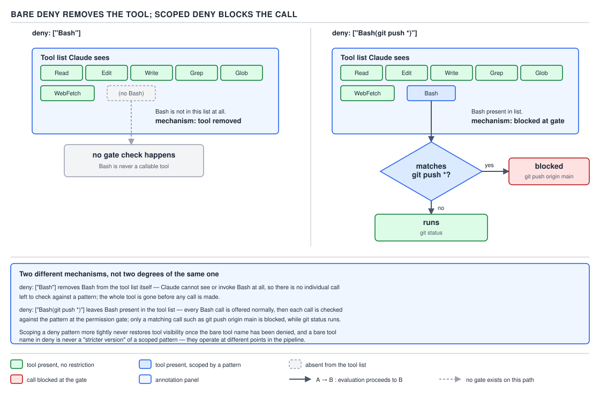

# 21 AI for Coding — permission rules and their order — BASICS (§1.4.1–1.4.10)

**Target version: Claude Code v2.1.2xx (August 2026).** | **Part 1 of 6** | [Index](../00-index.md)
Previous: [your own instruction files, costed](../memory/04-your-own-instruction-files.md) · Next: [Bash matching](02-bash-matching.md)

## The family, before the details

Every permission decision Claude Code makes is a lookup against exactly three lists, checked in a
fixed order. Before any rule syntax, see the shape:

| List | What a match does | Checked |
|---|---|---|
| `deny` | Blocks the call outright | 1st |
| `ask` | Prompts you for approval | 2nd |
| `allow` | Runs the call without prompting | 3rd |

Nothing else participates. There is no fourth list, no per-tool override table, and — this is the
trap the rest of this file exists to remove — no notion that a more tightly-scoped rule in a lower
list beats a broader rule in a higher one. The three lists and that order are the entire mechanism;
everything below is detail on how a single rule is written and matched.

## Enforcement lives in the harness, not the model

You met the mechanism this rests on in PART 0 §0.3.3: the model does not run a command. It emits a
`tool_use` block — a structured request naming a tool and its arguments — and the harness (Claude
Code itself, the program wrapped around the model) decides whether that request actually executes.
**§1.4.1** is the consequence of that split applied to safety: **permission rules are enforced by
Claude Code, not by the model.**

That emit-versus-execute split is the entire basis of the permission system. A prompt, a system
message, or an instruction written into `CLAUDE.md` can shape what the model *tries* — what
`tool_use` blocks it emits — but none of them can change what the harness *allows to run*. The rules
in this file sit entirely on the execute side of that boundary. Telling Claude "never run `rm -rf`"
in `CLAUDE.md` is a request to a next-token predictor that has no persistent memory of having agreed
to it (PART 0 §0.1); a `deny` rule for `Bash(rm -rf *)` is a check the harness runs before the
subprocess is ever spawned, regardless of what the model emitted or why.

`[DOC]` The official documentation states this directly, in a note attached to the permission rules
themselves:

> Permission rules are enforced by Claude Code, not by the model. Instructions in your prompt or
> `CLAUDE.md` shape what Claude tries to do, but they don't change what Claude Code allows. To grant
> or revoke access, use `/permissions`, the rules described here, a permission mode, or a
> `PreToolUse` hook.

— *Configure permissions*, `https://code.claude.com/docs/en/permissions`, re-verified 2026-08-29.

**Insight:** this is why "just tell it not to" is never a security answer on this topic. A prompt
is a request to a sampling process (PART 0 §0.1.2); a `deny` rule is a branch the harness evaluates
before a subprocess exists. One is advisory, the other is a gate.

> Permission rules are enforced by Claude Code, not by the model: the prompt shapes what Claude
> tries, the rules decide what runs.

## The evaluation order: deny, then ask, then allow

**§1.4.2.** The three lists from the opening table are not merely three buckets — they are a
pipeline, walked in a fixed sequence for every tool call the model proposes:

1. Check every `deny` rule across every loaded settings file. Any match → **blocked**, stop.
2. Check every `ask` rule. Any match → **prompt**, stop.
3. Check every `allow` rule. Any match → **run without prompting**, stop.
4. No match anywhere → falls through to the permission mode's default behaviour (PART 1 covers the
   modes at §1.4.25; under the default `manual` mode, an unmatched tool call still prompts).

`[NUM]` Two properties of this pipeline are load-bearing and both are stated as flat facts by the
documentation, not as a tendency:

> Rules are evaluated in order: deny, then ask, then allow. The first match in that order determines
> the outcome, and rule specificity doesn't change the order.

— *Configure permissions*, re-verified 2026-08-29.

"First match wins" means the pipeline stops at the first list that matches — it never continues on to
see whether a later list also matches, because the outcome is already decided. "Specificity does not
reorder" means a narrower rule in a later-checked list cannot promote itself ahead of a broader rule
in an earlier-checked list. Both properties are exercised together in §1.4.3 below.


**D-28** — Permission evaluation: `deny`, then `ask`, then `allow`; first match wins.

A minimal settings object that exercises the pipeline — every key present, nothing implied:

```json
{
  "permissions": {
    "deny": ["Bash(git push *)"],
    "ask": ["Bash(npm publish *)"],
    "allow": ["Bash(npm run *)", "Bash(git commit *)"]
  }
}
```

`git push origin main` matches the `deny` list at step 1 and is blocked before `ask` or `allow` are
ever consulted, even though no rule in `allow` mentions `push` at all. `npm publish` matches `ask` at
step 2 and prompts. `npm run build` and `git commit -m "message"` fall through to `allow` at step 3
and run silently. A command matching none of the six rules — `curl example.com`, say — falls through
to the mode default.

**Gotcha:** the pipeline is per-call, not per-session. Every single tool call the model emits is
re-evaluated against all three lists from scratch; nothing here is cached across calls within a
session except the "don't ask again" rules covered at §1.4.10, which work by *writing a new rule*
into `allow`, not by remembering a prior decision.

## §1.4.3 — a broad deny cannot carry allowlist exceptions

`[TRAP]` `[DOC]` The order from §1.4.2 has a sharp consequence that trips engineers who reason about
these lists as if they were three independent sets rather than a checked-in-sequence pipeline: **a
broad `deny` rule blocks every call it matches, including calls that also satisfy a narrower `allow`
rule.** There is no mechanism for an `allow` entry to punch a hole in a `deny` entry — punching holes
would require re-checking `allow` after `deny` has already matched, and step 1 of the pipeline stops
before step 3 is ever reached.

```json
{
  "permissions": {
    "deny": ["Bash(aws *)"],
    "allow": ["Bash(aws s3 ls)"]
  }
}
```

`aws s3 ls` matches `Bash(aws *)` in `deny` at step 1. The pipeline stops there. It never reaches
step 3, so the fact that `Bash(aws s3 ls)` also sits in `allow` is irrelevant — that rule is dead
code. The same precedence holds one list down: a matching `ask` rule prompts even when a more
specific `allow` rule also matches the same call, for the identical reason — `ask` is checked and
resolved before `allow` is ever consulted.

`[DOC]` Quoting the documentation directly:

> A broad deny rule like `Bash(aws *)` blocks every matching call, including calls that also match a
> narrower allow rule like `Bash(aws s3 ls)`, so a deny rule can't carry allowlist exceptions. The
> same precedence applies between ask and allow: a matching ask rule prompts even when a more
> specific allow rule also matches the same call.

— *Configure permissions*, re-verified 2026-08-29.

**Pitfall:** the belief in action is "I'll deny the dangerous AWS commands broadly, then carve out an
exception for the read-only one I actually need." The engineer writes the `allow` entry above,
restarts Claude Code, and `aws s3 ls` still refuses — the settings changed, the restart happened, and
the tool still says no, which looks like a caching bug. It is not a caching bug: `allow` was never
reached. The fix is to narrow the `deny` rule itself, not widen the `allow` rule: `Bash(aws * !s3)`
does not exist as syntax (there is no negation operator — PART 1 §1.4.13 covers the full syntax
surface), so the working fix is to enumerate the dangerous subcommands in `deny` individually —
`Bash(aws s3 rm *)`, `Bash(aws ec2 terminate-instances *)` — and leave `aws s3 ls` unmatched by any
`deny` rule, at which point the `allow` entry (or the built-in read-only recognition, PART 1 §1.4.16)
takes effect. **Why people believe it:** most permission systems they have used before — file ACLs,
firewall rules, IAM policies with explicit `Deny` and `Allow` statements — do support an explicit
allow-overrides-deny exception in at least some configurations, so the assumption transfers instead
of being re-checked against this specific pipeline.

## §1.4.4 — bare deny removes the tool; scoped deny blocks the call

A `deny` rule is not one mechanism with two spellings — it is **two different mechanisms** that
happen to share a list. Which one you get depends on whether the rule names a bare tool or a scoped
pattern within one.

- **A bare tool name in `deny`** — `Bash`, `WebFetch`, `Read` with no parentheses — removes the tool
  from Claude's context entirely. The model is never told the tool exists; it cannot emit a
  `tool_use` block for a tool it was never given a definition for. This is a much stronger guarantee
  than a refusal: there is no prompt to interpret, no retry to attempt, because there is no tool
  handle in the request at all.
- **A scoped rule in `deny`** — `Bash(rm *)`, `Read(./.env)` — leaves the tool fully visible to the
  model. Claude can still emit `Bash` tool calls; the harness blocks the specific calls that match
  the pattern and lets every other `Bash` call through the rest of the pipeline as normal.

`[DOC]` From the documentation, describing both forms in the same paragraph so the contrast is
explicit:

> Deny rules behave differently depending on whether they name a tool or scope a pattern within one.
> A bare tool name like `Bash` removes the tool from Claude's context entirely, so Claude never sees
> it. Bare-name removal applies to every tool except `EndConversation`: a deny rule can't remove it
> while any other tool remains, and an ask rule never prompts for it. A scoped rule like
> `Bash(rm *)` leaves the tool available and blocks matching calls when Claude attempts them.

— *Configure permissions*, re-verified 2026-08-29.



**D-29** — Bare deny removes the tool; scoped deny blocks the call.

```json
{
  "permissions": {
    "deny": ["WebFetch"]
  }
}
```

versus

```json
{
  "permissions": {
    "deny": ["WebFetch(domain:internal.example.com)"]
  }
}
```

The first strips `WebFetch` out of the model's tool list altogether — the model has no way to attempt
a fetch of any kind, and no permission prompt is ever shown because there is nothing to prompt about.
The second leaves `WebFetch` fully available for every other domain; only calls whose `domain:`
parameter matches `internal.example.com` are blocked, and the model still sees and can call the tool
for anything else.

**Insight:** the practical difference is what the model *knows exists*. A bare deny changes the
model's world model — a tool it cannot see is a tool it will never plan around, so it will not
propose a three-step workaround to reach the same end through another tool. A scoped deny changes
only what *runs* — the model still sees the tool, may still attempt the blocked pattern, and receives
a denial it can reason about and route around (which is not itself a security hole, since the routing
still goes through the same pipeline, but it does mean scoped denial produces visible friction that
bare removal does not).

**Interview:** "What's the difference between denying `Bash` and denying `Bash(rm *)`?" — the bare
form removes the tool from the model's context so it is never offered as an option; the scoped form
keeps `Bash` fully visible and blocks only calls matching the pattern, so the model can still see and
attempt every other shell command.

## §1.4.5 — rule syntax

`[DOC]` Every rule in every list follows one of two shapes:

> Permission rules follow the format `Tool` or `Tool(specifier)`.

— *Configure permissions*, re-verified 2026-08-29.

`Tool` with no parentheses matches every use of that tool — this is the bare form from §1.4.4.
`Tool(specifier)` narrows the match to calls whose relevant field satisfies the specifier; for `Bash`
and `PowerShell` the specifier is matched against the command text (§1.4.6), for `Read`/`Edit` it is
a path pattern, and for `WebFetch` it is a `domain:` value — one specifier grammar per tool (PART 1 §1.4.11–§1.4.20
covers each tool's specifier grammar in full).

One equivalence is worth fixing now because it resolves an apparent inconsistency the reader will
otherwise trip over later: `Bash(*)` and bare `Bash` are the same rule.

> `Bash(*)` is equivalent to `Bash` and matches all Bash commands. As a deny rule, both forms remove
> the tool from Claude's context.

— *Configure permissions*, re-verified 2026-08-29.

No gotcha beyond the one already covered at §1.4.4 — the equivalence is exact, and both spellings of
"deny everything" trigger bare-name removal, not scoped blocking.

## Bash specifiers, the wildcard, and the matching table

`[DOC]` `[TRAP]` A `Bash` specifier does not match a subcommand, a flag, or a token — it matches the
**whole command text**, character for character, with `*` standing in for any run of characters
including spaces. This single fact is the source of every surprising row in the table below, so it
is worth stating as its own claim before the table:

> Bash rules match the whole command text, with `*` standing in for any text.

— *Configure permissions*, re-verified 2026-08-29.

Because the match is against the full string, **where** the `*` sits changes what the rule means, not
just how much it matches. Put the `*` after the subcommand, not before it or in place of it:

> Put the `*` after the subcommand. In `git log --oneline main`, `git` is the program and `log` is
> the subcommand, the word that determines what the program does. Claude Code matches everything
> before the first `*` as written, so those words are what limit the rule: `Bash(git log *)` allows
> only `git log` commands, and `Bash(git *)` allows every git command. Claude Code warns at startup
> about an allow rule with a `*` before the subcommand, such as `Bash(git * main)`.

— *Configure permissions*, re-verified 2026-08-29.

**Pitfall:** the belief in action is "I want to allow reading `main`'s log, so I'll write
`Bash(git * main)` — the `*` is a placeholder for `log`." The surprising outcome is that Claude Code
prints a startup warning naming this exact shape ("has a wildcard before the rest of the command"),
because everything *before* the first `*` is what the rule actually anchors on — here, nothing — so
the `*` is free to absorb the subcommand *and* every option that precedes it, not just the one word
the author had in mind. The fix is to anchor the literal words that must appear first and let the
wildcard trail them: `Bash(git log * main)` allows only `git log` variations against `main`, not
every git subcommand. **Why people believe it:** in ordinary glob syntax (`*.txt`, `src/*`) a
wildcard is a placeholder for "the part I don't care about," with no implication that it can also
swallow the parts before it — but a Bash specifier is one flat string match, not a segmented path
match, so there is no boundary stopping the wildcard from also matching earlier tokens once it is not
anchored by literal text at the very start.

`[NUM]` `[PROVE]` The table the syllabus and the documentation both use to pin this down, reproduced
and worked through row by row:

| Rule | Command 1 | Command 2 | Command 3 | Notes |
|---|---|---|---|---|
| `Bash(npm run build)` | `npm run build` — matches | `npm run build --watch` — no match | `npm test` — no match | No `*` at all: an exact string match, nothing more or less. |
| `Bash(npm run *)` | `npm run build` — matches | `npm run test --watch` — matches | `npm install` — no match | `*` starts right after the anchored subcommand `run`; a trailing `*` with a preceding space also matches the bare `npm run` with nothing after it. |
| `Bash(git log * main)` | `git log --oneline main` — matches | `git log -5 main` — matches | `git log main` — no match | The `*` must consume at least the space between `log` and `main`'s wildcard segment; `git log main` has no such gap to fill (the rule requires text in that position; PART 1 §1.4.12 has the exact grammar), and `git push origin main` fails because `push` is not `log`. |
| `Bash(git * main)` | `git merge main` — matches | `git push origin main` — matches | `git log` — no match | `*` is unanchored on the left, so it absorbs the subcommand and everything before `main` — this is the startup-warning shape from the Pitfall above. |
| `Bash(* --version)` | `node --version` — matches | `bash -c 'echo hi' --version` — matches | `node -v` — no match | `*` here stands for the program itself; only the trailing `--version` is anchored, so any program at all satisfies the rule. |
| `Bash(ls *)` | `ls -la` — matches | `ls` — matches | `lsof` — no match | The space before the trailing `*` is part of the literal match; `lsof` has no space after `ls` so it fails. |
| `Bash(ls*)` | `ls -la` — matches | `lsof` — matches | `ls` — matches | No space before `*`: the wildcard can match zero characters directly after `ls`, so it swallows `lsof` too — the one-character difference from the row above changes which binaries the rule reaches. |
| **`Bash(git * main)` — the security hole** | `git -c core.fsmonitor=<script> diff main` — **matches** | `git -c core.hooksPath=<dir> log main` — **matches** | `git -c protocol.ext.allow=always fetch main` — **matches** | Highlighted separately from the general `git * main` row above because every one of these reads as "diff/log/fetch against `main`" but each smuggles a `-c` config override that makes `git` execute an attacker-named program — the `*` spans options, not just the subcommand, and `-c` is an option. |

**D-30** — The Bash wildcard matching table.

**§1.4.8 — `[TRAP]` `[DOC]` this is a real vulnerability, not a curiosity.** The highlighted row above
is the same rule as the general `git * main` row — there is no separate, more dangerous syntax to
avoid; the everyday form of "allow read-only git against `main`" already has this shape. The symptom
is exactly the false sense of safety the rule's own name implies: an engineer reads `Bash(git * main)`
in a settings file and understands it as "git subcommands scoped to the `main` branch, presumably
read-only inspection like `log` or `diff`." Nothing in the rule enforces read-only, and nothing in it
excludes `-c`. `git -c core.fsmonitor=/tmp/payload.sh diff main` runs `payload.sh` as a filesystem
monitor hook the moment git needs to check file status — which a `diff` triggers unconditionally —
and the command still reads, on its face, like an inspection of `main`. The fix is the same fix as
§1.4.6's pitfall: anchor the subcommand literally and put the wildcard after it, `Bash(git log *
main)` or `Bash(git diff * main)`, so the `*` cannot absorb a `-c` sitting before the subcommand.
**Why people believe it:** the rule's own English reading — "git, wildcard, main" — sounds like it
names a branch-scoped operation, and nothing about the syntax visually signals that the wildcard's
reach extends leftward into the option space that precedes the subcommand.

## Compound commands: matched independently, saved independently

`[DOC]` `[NUM]` A rule written for a single command is not a license for that command plus anything
chained after it. Claude Code parses the shell operators in a proposed command and checks each
resulting subcommand against the full pipeline independently:

> Claude Code is aware of shell operators, so a rule like `Bash(safe-cmd *)` won't give it permission
> to run the command `safe-cmd && other-cmd`. The recognized command separators are `&&`, `||`, `;`,
> `|`, `|&`, `&`, and newlines. A rule must match each subcommand independently.

— *Configure permissions*, re-verified 2026-08-29.

That is seven separators — `&&`, `||`, `;`, `|`, `|&`, `&`, and a literal newline — and every one of
them splits the string before matching begins. `Bash(npm test *)` in `allow` does not authorize
`npm test && rm -rf build/`: `npm test` matches and passes, but `rm -rf build/` is checked on its own
against the same three-list pipeline and, absent its own matching `allow` rule, falls through to a
prompt or a deny.

`[NUM]` The same per-subcommand split governs what gets written when you approve a compound command
interactively:

> When you approve a compound command with "Yes, and don't ask again", Claude Code saves a separate
> rule for each subcommand that requires approval, rather than a single rule for the full compound
> string. For example, approving `git status && npm test` saves a rule for `npm test`, so future
> `npm test` invocations are recognized regardless of what precedes the `&&`. Subcommands like `cd`
> into a subdirectory generate their own Read rule for that path. Up to 5 rules may be saved for a
> single compound command.

— *Configure permissions*, re-verified 2026-08-29.

So `git status && npm test` approved once does not save one rule for the literal compound string —
`git status` is already a recognised read-only command (PART 1 §1.4.16) and needs no rule at all,
and `npm test` gets its own standalone `Bash(npm test)`-shaped entry, reusable regardless of what
precedes it in a future command. A five-way chain such as `cd api && npm ci && npm run lint && npm
test && npm run build` can save up to five separate rules in one approval — one per subcommand that
still needed one after the read-only and already-covered ones drop out.

No gotcha beyond what §1.4.6 through §1.4.8 already establish: because each subcommand is matched
independently against whole-command-text rules, the wildcard-placement trap applies identically
inside a compound command as outside one.

> Compound commands are split on `&&`, `||`, `;`, `|`, `|&`, `&`, and newline before any rule is
> checked, and every resulting subcommand must clear the deny → ask → allow pipeline on its own.

## Pitfalls

- **Belief:** "I denied `Bash(aws *)` broadly and allowed `Bash(aws s3 ls)` narrowly, so the narrow
  allow should still work as an exception." **Outcome:** `aws s3 ls` is blocked anyway, because
  `deny` is checked and resolved before `allow` is ever consulted. **Fix:** narrow the `deny` rule to
  name the dangerous subcommands explicitly and leave the safe one unmatched, rather than widening
  `allow`. **Why people believe it:** most ACL-style systems they have used before do support an
  allow-overrides-deny exception in some form, so the assumption transfers without being re-checked.
- **Belief:** "`Bash(git * main)` lets Claude run read-only git commands against `main`, and nothing
  more." **Outcome:** the same rule permits `git -c core.fsmonitor=<script> diff main`, which
  executes an attacker-named program, because the unanchored `*` spans every option before the
  subcommand, including `-c`. **Fix:** anchor the subcommand literally before the wildcard —
  `Bash(git log * main)` — so `*` cannot reach leftward into option space. **Why people believe it:**
  the rule reads in English as "git, something, main," which sounds branch-scoped and read-only, and
  nothing in the syntax visually signals the wildcard's leftward reach.
- **Belief:** "A rule for one command in `allow` covers that command wherever it appears, including
  chained after `&&`." **Outcome:** `Bash(npm test *)` in `allow` does not authorize `npm test &&
  rm -rf build/` — the `rm -rf` half is checked on its own and can still prompt or block. **Fix:**
  every subcommand in a chain needs its own matching rule; there is no "the first match covers the
  whole line" behaviour. **Why people believe it:** shell users read `&&`-chains as one logical
  operation, but Claude Code's permission check parses the operators and evaluates each piece
  separately.

## Cheat sheet

| Fact | Value |
|---|---|
| Rule lists | `deny`, `ask`, `allow` |
| Evaluation order | deny → ask → allow, first match wins |
| Specificity reorders? | No |
| Bare tool deny (`Bash`) | Removes the tool from the model's context |
| Scoped deny (`Bash(rm *)`) | Tool stays visible; matching calls blocked |
| Rule shape | `Tool` or `Tool(specifier)` |
| `Bash(*)` vs `Bash` | Equivalent, including for bare-name removal |
| Bash specifier scope | Whole command text; `*` = any text, including spaces |
| Wildcard placement rule | Put `*` after the subcommand, never before it |
| Compound separators (7) | `&&`, `||`, `;`, `|`, `|&`, `&`, newline |
| Compound matching | Each subcommand checked independently |
| "Don't ask again" on a compound command | Saves up to 5 separate rules, one per subcommand needing one |

## Self-test

<details><summary>1. What decides whether a proposed tool call actually runs — the model or Claude Code?</summary>
Claude Code (the harness). The model only emits a `tool_use` block naming a tool and arguments; the
harness evaluates that request against the permission rules before anything executes. Prompts and
`CLAUDE.md` can shape what the model tries; they cannot change what the harness allows.
</details>

<details><summary>2. In what order are the three rule lists checked, and does a more specific rule ever jump the queue?</summary>
`deny`, then `ask`, then `allow`. The first list with a match determines the outcome and the check
stops there. Specificity never reorders this — a narrow `allow` rule cannot override a broad `deny`
or `ask` rule that also matches.
</details>

<details><summary>3. `deny` has `Bash(aws *)` and `allow` has `Bash(aws s3 ls)`. Does `aws s3 ls` run?</summary>
No. `deny` is checked first; `Bash(aws *)` matches `aws s3 ls` and the call is blocked. The pipeline
never reaches `allow`, so the narrower allow rule is never consulted.
</details>

<details><summary>4. What is the difference between `"deny": ["Bash"]` and `"deny": ["Bash(rm *)"]`?</summary>
`"deny": ["Bash"]` is a bare tool name: it removes `Bash` from the model's context entirely, so the
model is never even offered the tool. `"deny": ["Bash(rm *)"]` is scoped: `Bash` stays fully visible
and callable, and only calls whose command text matches `rm *` are blocked.
</details>

<details><summary>5. What does a Bash specifier actually match against — the subcommand, a single flag, or something else?</summary>
The whole command text, as one string, with `*` standing in for any run of characters including
spaces. It is not a per-token or per-flag match.
</details>

<details><summary>6. Why does `Bash(git * main)` allow `git -c core.fsmonitor=<script> diff main`?</summary>
The rule anchors nothing before the wildcard, so `*` is free to absorb everything between `git` and
`main` — including `-c core.fsmonitor=<script> diff`, a `-c` config override that makes git execute
an attacker-named program as a filesystem-monitor hook. The rule was never scoped to a read-only
subcommand; it only names the literal word `main` at the end.
</details>

<details><summary>7. `allow` has `Bash(npm test *)`. Does that authorize `npm test && rm -rf build/`?</summary>
No, not the `rm -rf build/` half. Claude Code splits the command on `&&` (one of the seven recognised
separators) before matching, and checks each subcommand independently. `npm test` matches and
passes; `rm -rf build/` is evaluated on its own against the pipeline and, without its own matching
rule, falls through to a prompt or a deny.
</details>

<details><summary>8. How many separate rules can "Yes, and don't ask again" save from one compound command, and how are they scoped?</summary>
Up to 5, one per subcommand that still needs an explicit rule after read-only and already-matched
subcommands are set aside. Each saved rule targets its own subcommand — for example, approving
`git status && npm test` saves a standalone rule for `npm test` that applies regardless of what
precedes it in a future command.
</details>

<details><summary>9. What is the difference between `Bash(ls *)` and `Bash(ls*)`?</summary>
`Bash(ls *)` has a space before the trailing wildcard, so the space is part of the literal match and
`lsof` (no space after `ls`) does not match. `Bash(ls*)` has no space, so the wildcard can match zero
characters right after `ls`, and it also matches `lsof`.
</details>

## Open questions

None.

---

**Leaves covered:** 1.4.1–1.4.10 (10 leaves)
**Leaves deferred:** none
**Diagrams included:** D-28, D-29, D-30
**Target version:** Claude Code v2.1.2xx (August 2026)
**Lines:** 462
