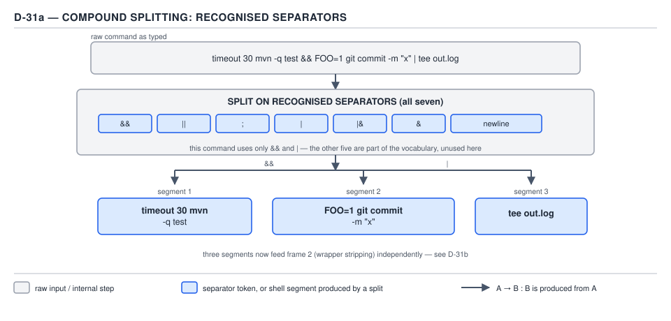
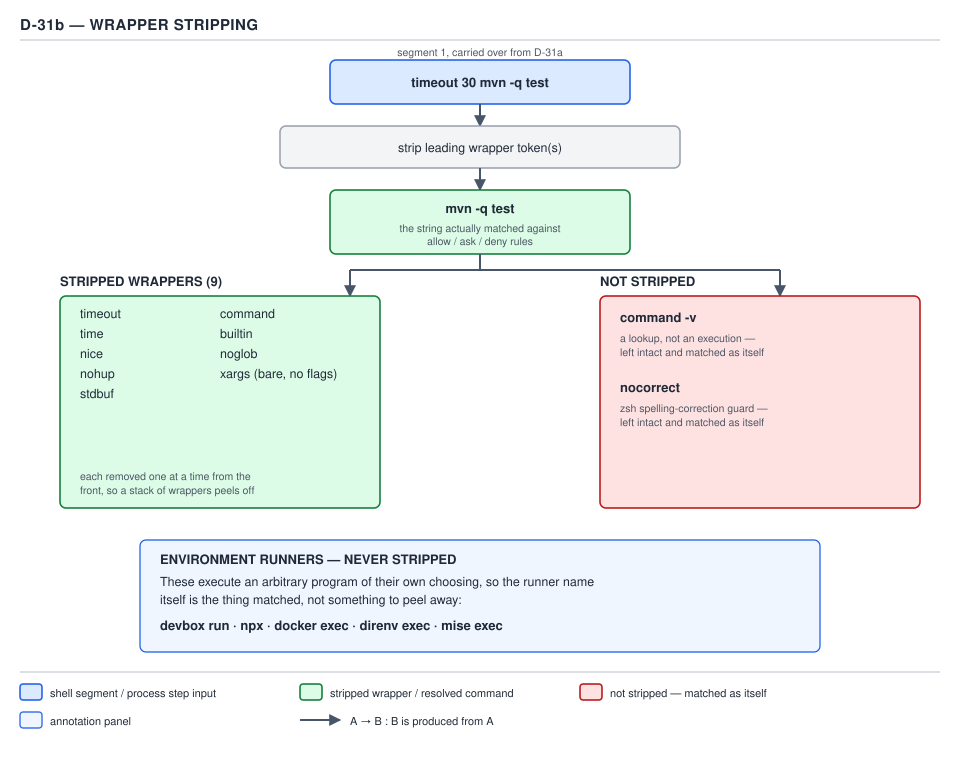
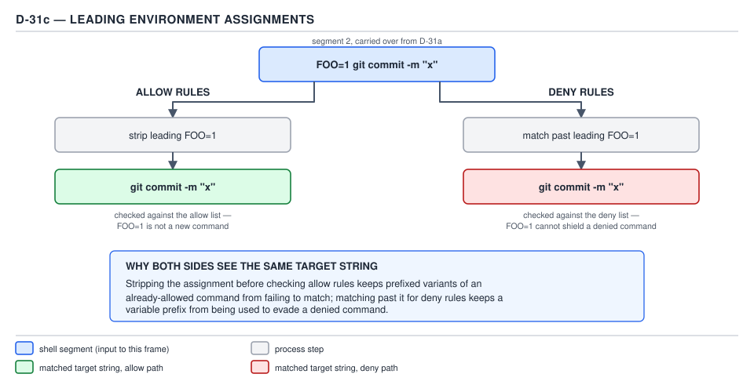
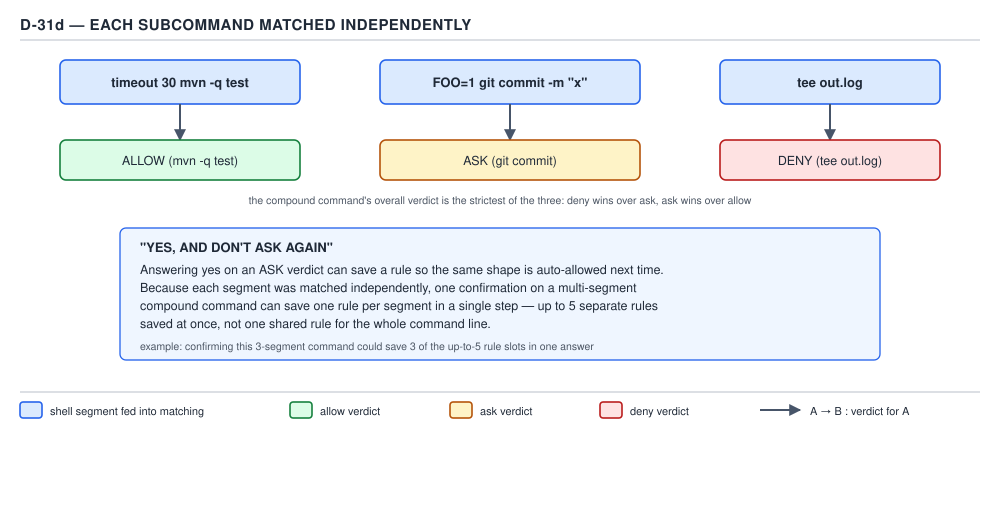

# 21 AI for Coding — Bash matching — BASICS (§1.4.11–1.4.15)

**Target version: Claude Code v2.1.2xx (August 2026).** | **Part 1 of 6** | [Index](../00-index.md)
Previous: [permission rules and their order](01-basics-rules-and-order.md) · Next: [path, web, MCP and Agent rules](03-path-rules.md)

## Everything before matching is a rewrite of the command string

File 01 established that a Bash specifier matches the *whole command text* and that a compound
command is split on seven separators before any list is checked. What it did not cover is that the
string a rule is matched against is not always the string the model wrote. Before `deny`, `ask`, and
`allow` ever see a subcommand, Claude Code runs it through a **transformation pipeline**: split on
separators, strip a fixed set of wrappers, strip a leading known-safe environment assignment (for
allow rules only), and only then check each resulting string against the three-list pipeline from
§1.4.2.

The reason this pipeline exists is ergonomic, not decorative: without it, an allow rule for
`Bash(mvn -q test *)` would need a second, third, and fourth copy to also cover `timeout 30 mvn -q
test`, `nice mvn -q test`, and `CI=true mvn -q test`. Stripping the wrapper and the assignment before
matching means one rule covers the command and its common decorations, at the cost of needing to know
exactly what gets stripped and what does not — the gap between what a reader assumes is stripped and
what actually is stripped is where every trap in this file lives.

Trace one command through all four stages, the same command the diagrams below trace:

```
timeout 30 mvn -q test && FOO=1 git commit -m "x" | tee out.log
```

**Stage 1 — split on separators.** `&&` and `|` are two of the seven recognised separators from
§1.4.9. Splitting on them, left to right, produces three subcommands: `timeout 30 mvn -q test`,
`FOO=1 git commit -m "x"`, and `tee out.log`.

**Stage 2 — strip wrappers.** Only the first subcommand carries one: `timeout 30` is stripped from
`timeout 30 mvn -q test`, leaving `mvn -q test`. The other two subcommands have no wrapper to strip.

**Stage 3 — strip a leading env assignment, for allow rules.** Only the second subcommand carries
one: `FOO=1` is stripped from `FOO=1 git commit -m "x"`, leaving `git commit -m "x"` — but only when
the check being run is an `allow` check; a `deny` or `ask` rule is matched against the *unstripped*
form, `FOO=1 git commit -m "x"` itself. This is the asymmetry the rest of this file explains.

**Stage 4 — match each transformed subcommand independently.** `mvn -q test`, `git commit -m "x"`
(for allow) or `FOO=1 git commit -m "x"` (for deny/ask), and `tee out.log` are each checked against
`deny → ask → allow` on their own, exactly as §1.4.2 describes for any compound command.



**D-31a** — `timeout 30 mvn -q test && FOO=1 git commit -m "x" | tee out.log` split on `&&` and `|`
into three independent subcommands, before any wrapper or assignment is touched.



**D-31b** — `timeout 30 mvn -q test` has its `timeout 30` wrapper stripped, leaving `mvn -q test` as
the string a rule is actually matched against.



**D-31c** — `FOO=1 git commit -m "x"` loses its leading `FOO=1` when an `allow` rule is being
checked; a `deny` or `ask` rule sees the assignment still attached.



**D-31d** — the three transformed strings — `mvn -q test`, `git commit -m "x"`, `tee out.log` — each
run through `deny → ask → allow` on their own, with no re-combination back into the original line.

A settings object that lets this compound command run end to end without a prompt:

```json
{
  "permissions": {
    "allow": [
      "Bash(mvn -q test)",
      "Bash(git commit *)",
      "Bash(tee *)"
    ]
  }
}
```

`Bash(mvn -q test)` matches the wrapper-stripped `mvn -q test`. `Bash(git commit *)` matches the
assignment-stripped `git commit -m "x"`. `Bash(tee *)` matches `tee out.log` directly, since it never
carried a wrapper or an assignment. Three rules, none of which mention `timeout`, `30`, or `FOO`
anywhere.

## §1.4.11 — the fixed wrapper list, and the two things it does not cover

`[DOC]` `[NUM]` The official documentation names the stripped set directly:

> Before matching Bash rules, Claude Code strips a fixed set of wrappers, so a rule like
> `Bash(npm test *)` also matches `timeout 30 npm test`. The stripped wrappers are `timeout`, `time`,
> `nice`, `nohup`, and `stdbuf`, plus the shell builtins `command` and `builtin`, and zsh's `noglob`.
> Each runs its argument as the actual command. Two related forms aren't stripped: the query form
> `command -v`, which looks up a command rather than running one, and zsh's `nocorrect`.

— *Configure permissions*, `https://code.claude.com/docs/en/permissions`, re-verified 2026-08-29.

`[NUM]` A ninth wrapper is stripped by a separate rule with its own condition:

> Bare `xargs` is also stripped, so `Bash(grep *)` matches `xargs grep pattern`. Stripping applies
> only when `xargs` has no flags: an invocation like `xargs -n1 grep pattern` is matched as an
> `xargs` command, so rules written for the inner command do not cover it.

— *Configure permissions*, re-verified 2026-08-29.

| Wrapper | Category | Note |
|---|---|---|
| `timeout` | coreutils time-limiting wrapper | runs its argument as the actual command |
| `time` | shell/coreutils timing wrapper | same |
| `nice` | scheduling-priority wrapper | same |
| `nohup` | hangup-immune wrapper | same |
| `stdbuf` | buffering wrapper | same |
| `command` | shell builtin | forces builtin/external resolution, then runs its argument |
| `builtin` | shell builtin | forces the shell builtin, then runs its argument |
| `noglob` | zsh builtin | disables globbing, then runs its argument |
| `xargs` (bare, no flags) | coreutils | stripped only when it carries no flags at all |

The doc's own contrast paragraph is deliberately placed in the same breath as the stripped list so
the two forms that look identical to `command` and `noglob` but are **not** stripped stand out:

| Not stripped | Why it looks similar | What it actually is |
|---|---|---|
| `command -v` | starts with the stripped word `command` | a lookup — reports whether a name resolves to a command — not an execution, so stripping it would let a rule match a call that never runs anything |
| `nocorrect` | zsh builtin, name pattern close to `noglob` | suppresses spelling autocorrection; it does not delegate execution to its argument the way `noglob` does |

**Interview:** "Does `Bash(npm test *)` in `allow` match `command npm test`?" — yes, `command` is
stripped and the remainder `npm test` matches. "Does it match `command -v npm`?" — no: `command -v`
is the query form, explicitly excluded from stripping, so the rule is checked against the literal
string `command -v npm`, which `Bash(npm test *)` does not match.

### The env-assignment asymmetry, and why it is the safe direction

`[DOC]` `[NUM]` Stage 3 above is not a symmetric rule. The documentation states the allow-side and
the deny/ask-side as two separate sentences on purpose:

> Claude Code also strips a leading assignment of certain known-safe environment variables, so
> `Bash(npm test *)` matches `NODE_ENV=test npm test`. An allow rule won't match past an assignment
> of any other variable. A deny or ask rule matches past any leading assignment, so `Bash(rm *)` in
> deny still matches `AWS_PROFILE=prod rm -rf tmp/`.

— *Configure permissions*, re-verified 2026-08-29.

Read as two rules rather than one: an **allow** rule only reaches through a leading assignment when
the variable is on Claude Code's own known-safe list — `NODE_ENV=test npm test` matches
`Bash(npm test *)` because `NODE_ENV` is on that list, but an assignment of an arbitrary variable is
*not* stripped for allow, so the rule simply fails to match and the call falls through to a prompt or
a deny instead of silently running. A **deny** (or **ask**) rule reaches through *any* leading
assignment, known-safe or not: `AWS_PROFILE=prod rm -rf tmp/` is still blocked by `Bash(rm *)` in
`deny`, because the deny check is run against the command with every leading assignment removed,
unconditionally.

**Insight:** this is the only place in the whole matching pipeline where `allow` and `deny` are given
different transformation rules for the same input, and the direction is exactly the one that fails
closed. If an allow rule stripped an arbitrary assignment the way a deny rule does, an attacker-
controlled or model-generated `SOME_VAR=1 rm -rf important/` could ride through an allow rule written
for `rm` alone — the assignment would have smuggled an unrelated command past a rule that never
intended to authorise it, because the rule's own text never had to account for what could be prepended
to it. Making deny reach through any assignment closes the mirror-image hole: an attacker cannot
prepend a fake assignment to a dangerous command specifically to dodge a `deny` rule, because the
deny check throws every leading assignment away before it looks at the string. Both halves of the
asymmetry serve the same goal — an assignment can never be the mechanism that decides whether a
command is allowed.

No gotcha beyond the asymmetry itself, which is already the surprising part: a reader who assumes
"strips a leading assignment" applies evenly to both lists will write a deny rule they believe an
assignment can slip past, and it cannot.

## §1.4.12 — environment runners are not stripped, and that is a real hole

`[TRAP]` `[DOC]` Every wrapper in §1.4.11's list shares one property: it runs its single argument
*as* the command, so stripping it changes nothing about what could be authorised. A **development
environment runner** does not share that property — it is a program whose entire job is to execute
whatever command line follows a particular subcommand, inside some environment it sets up first. It
is not on the stripped list, and the documentation is explicit that this is deliberate, not an
oversight to be patched:

> This wrapper list is built in and is not configurable. Development environment runners such as
> `direnv exec`, `devbox run`, `mise exec`, `npx`, and `docker exec` are not in the list. Because
> these tools execute their arguments as a command, a rule like `Bash(devbox run *)` matches whatever
> comes after `run`, including `devbox run rm -rf .`. To approve work inside an environment runner,
> write a specific rule that includes both the runner and the inner command, such as
> `Bash(devbox run npm test)`. Add one rule per inner command you want to allow.

— *Configure permissions*, re-verified 2026-08-29.

| Runner | Subcommand that executes its argument |
|---|---|
| `devbox run` | runs the named script or command inside the devbox shell |
| `npx` | runs the named package's binary |
| `docker exec` | runs the given command inside a running container |
| `direnv exec` | runs the given command inside a directory's loaded environment |
| `mise exec` | runs the given command inside mise's tool environment |

**Pitfall:** the wrong belief is that an allow rule written against a runner is scoped to *what the
runner is for* — an engineer writes `Bash(devbox run *)` meaning "let it run our devbox scripts," the
same mental model used for `Bash(npm run *)` in file 01, where the specifier is a whole-command-text
match and the wildcard trails a fixed subcommand. The symptom is that the rule authorises *any*
command the runner can be told to execute, not just the project's own scripts: `devbox run rm -rf .`
matches `Bash(devbox run *)` exactly as well as `devbox run npm test` does, because the rule's `*`
sits after `run` and absorbs everything that follows, including a destructive command that has
nothing to do with the devbox environment the author had in mind. The fix is **runner+inner rules** —
name the runner and the specific inner command together, one rule per inner command, never a
wildcard immediately after the runner's exec subcommand:

```json
{
  "permissions": {
    "allow": [
      "Bash(devbox run npm test)",
      "Bash(devbox run npm run lint)",
      "Bash(docker exec sdlc-postgres pg_isready)"
    ],
    "deny": [
      "Bash(devbox run *)",
      "Bash(docker exec *)"
    ]
  }
}
```

The `deny` entries here are not redundant with the `allow` entries above them: per §1.4.3, `deny` is
checked first and a broad `deny` for the runner blocks every use of it *except* the exact strings also
present in `allow` — wait, that reading is backwards. Because `deny` wins on any match and specificity
never reorders the pipeline, a broad `deny` for `Bash(devbox run *)` sitting alongside a narrower
`allow` for `Bash(devbox run npm test)` would block `devbox run npm test` too, for the exact reason
§1.4.3 gives: `deny` never lets a narrower `allow` carve an exception. The safe pattern is therefore
**allow the exact inner commands, and leave the runner itself unmatched by any rule** — omit the
`deny` entries above entirely, so an unmatched `devbox run rm -rf .` falls through to the permission
mode's default (a prompt under `manual`) rather than being pre-emptively blocked in a way that would
also swallow the legitimate `allow` entries. **Why people believe it:** `Bash(npm run *)` in file 01
genuinely does scope to "npm scripts," because `npm run <script>` cannot itself launch an arbitrary
shell command outside the `package.json` scripts table — the runner class breaks that assumption
specifically because its whole purpose, unlike `npm run`, is to hand an arbitrary command line to a
subprocess.

## §1.4.13 — exec wrappers a prefix rule cannot auto-approve

`[DOC]` A second class of program sits between "fully stripped" and "runs its argument as an
unrelated general-purpose subprocess": exec wrappers whose entire job is still to run one command, the
way `timeout` does, but which Claude Code does not add to the stripped list and does not let a prefix
rule reach through.

> Exec wrappers such as `watch`, `setsid`, `ionice`, and `flock` can't be auto-approved by a prefix
> rule like `Bash(watch *)`, so in Manual mode they always prompt. The same applies to `find` with
> `-exec` or `-delete`: a `Bash(find *)` rule doesn't cover these forms. To approve a specific
> invocation, write an exact-match rule for the full command string.

— *Configure permissions*, re-verified 2026-08-29.

| Wrapper / form | What it does |
|---|---|
| `watch` | repeatedly re-runs a command on an interval |
| `setsid` | runs a command in a new session, detached from the controlling terminal |
| `ionice` | runs a command with a given I/O scheduling class |
| `flock` | runs a command while holding a file lock |
| `find … -exec` / `find … -delete` | runs an arbitrary command, or deletes, for each matched path |

Concretely, "cannot be auto-approved by a prefix rule" means the wildcard-after-subcommand pattern
that works everywhere else in this topic does not work here: `Bash(watch *)` in `allow` never matches
any `watch` invocation, so every `watch` command still stops at a prompt in `manual` mode no matter
how that rule is written. The only way to pre-approve one of these is an **exact-match rule with no
wildcard** for the full string — `Bash(watch -n 5 kubectl get pods)` matches that one invocation and
nothing else, which is the point: the reader at the prompt who wants to stop being asked has to accept
either a prompt every time or an allowlist scoped to the literal command they actually run.

No gotcha beyond the one already stated: a reader who reaches for the same `Bash(watch *)` shape that
worked for `mvn` or `npm` in file 01 will find it silently does nothing, with no startup warning to
flag the mistake the way §1.4.6's leading-wildcard warning does.

## §1.4.14 — the built-in read-only command set

`[DOC]` A fixed set of Bash commands is recognised as read-only and is exempt from prompting
altogether, in every permission mode, independent of any rule in `deny`, `ask`, or `allow`:

> Claude Code recognizes a built-in set of Bash commands as read-only and runs them without a
> permission prompt in every mode. These include `ls`, `cat`, `echo`, `pwd`, `head`, `tail`, `grep`,
> `find`, `wc`, `which`, `diff`, `stat`, `du`, `cd`, and read-only forms of `git`. The set is not
> configurable; to require a prompt for one of these commands, add an `ask` or `deny` rule for it.

— *Configure permissions*, re-verified 2026-08-29.

| Command | Command | Command |
|---|---|---|
| `ls` | `cat` | `echo` |
| `pwd` | `head` | `tail` |
| `grep` | `find` | `wc` |
| `which` | `diff` | `stat` |
| `du` | `cd` | read-only `git` |

`[NUM]` **Not configurable is the point people get wrong.** There is no settings key that adds a
command to this set or removes one from it — the fifteen entries above are the whole list, fixed by
the binary. The only lever a reader has is the one the quote names: writing an explicit `ask` or
`deny` rule for a command that is on this list overrides the free pass for that command specifically,
because §1.4.2's `deny → ask → allow` pipeline still runs first and a matching `deny` or `ask` rule
stops the call before the read-only exemption is ever consulted. There is no equivalent lever to *add*
a command to the read-only set — a project that wants `jq` treated as read-only cannot declare it so;
it can only write `allow` rules for the specific `jq` invocations it wants unattended.

Two classes of case still prompt even though the command is on the list above:

| Case | Why it still prompts |
|---|---|
| Unquoted glob with a write-capable command | `find`, `sort`, `sed`, and `git` accept flags that write or delete (`-delete`, `-i`, `git add`); an unquoted glob could expand into one of those flags, so the glob forces a prompt even though the command itself is on the read-only list |
| Redirected output | `ls > out.txt` and similar add a check on the redirect target (§1.4.15) regardless of how read-only the command portion is |

By contrast, a command on the list whose every flag is inherently read-only tolerates an unquoted
glob with no prompt at all — `ls *.ts` and `wc -l src/*.py` both run unattended, because neither `ls`
nor `wc` has a flag the glob could expand into that writes anything.

**Interview:** "Can I make `jq` part of the built-in read-only set the way `grep` is?" — no; the set
is a fixed, non-configurable list of fifteen entries. The only configuration surface is narrowing —
adding `ask`/`deny` for one of the fifteen — never widening.

## §1.4.15 — redirections add a check on the target path

`[DOC]` A Bash rule matches the command; it says nothing about where that command's output goes. The
documentation states the extra check directly:

> Claude Code checks the target of an output redirection, such as `>`, `>>`, or `2>`, as a file
> write. The check covers your `Edit` allow and deny rules, protected paths, and the working
> directories. A rule such as `Bash(git commit *)` allows the command, not the target. A `/dev/null`
> target isn't checked. A target that starts with `~` or contains a glob character needs approval.

— *Configure permissions*, re-verified 2026-08-29.

Concretely, with a project settings file containing only:

```json
{
  "permissions": {
    "allow": ["Bash(git log *)"]
  }
}
```

`git log --oneline` runs unattended twice over — it matches the `allow` rule, and it is also a
read-only `git` form from §1.4.14. Redirected, the same command portion is still unattended, but the
whole call is not:

```
git log --oneline > .git/hooks/post-commit
```

The `Bash(git log *)` rule still matches `git log --oneline` — the specifier only ever inspected the
command text, never the redirect — but the target `.git/hooks/post-commit` resolves inside `.git/`, a
protected path (the same class of path `bypassPermissions` mode still refuses to write into without
extra safeguards). The redirect check runs against that target independently of the `allow` rule that
cleared the command, and blocks the write: an attacker who could get the model to emit this one line
would otherwise have turned a read-only-looking `git log` into a rewrite of a git hook that runs on
every future commit.

No gotcha beyond the two exemptions already quoted: `/dev/null` is never checked as a target (there is
nothing to protect), and a target starting with `~` or containing a glob character always needs
approval regardless of any `Edit` rule, because the check cannot resolve what it does not yet know the
shape of.

## Pitfalls

- **Belief:** "I wrote `Bash(devbox run *)` in allow, so Claude Code can run our devbox scripts
  without asking." **Outcome:** the same rule matches `devbox run rm -rf .`, because `devbox run` is
  not on the stripped-wrapper list and the rule's wildcard sits after `run`, absorbing whatever
  command the runner is told to execute. **Fix:** write one allow rule per inner command —
  `Bash(devbox run npm test)` — and leave the bare runner unmatched by any rule rather than adding a
  broad `deny` for it, since a broad `deny` for the runner would block the narrower `allow` entries
  too. **Why people believe it:** `Bash(npm run *)` genuinely does scope safely to npm scripts, and
  the runner class looks identical in rule syntax while behaving completely differently underneath.
- **Belief:** "The env-assignment stripping rule works the same way for allow and deny — an
  assignment in front of a command is just noise either way." **Outcome:** `AWS_PROFILE=prod
  rm -rf tmp/` is still blocked by `Bash(rm *)` in deny (the assignment is stripped before the
  deny check runs), but `SOME_VAR=1 rm -rf tmp/` is *not* authorised by an allow rule for
  `Bash(rm *)` written with `rm` alone in mind, because an allow rule only strips leading assignments
  on Claude Code's own known-safe list, not an arbitrary one. **Fix:** treat allow and deny as
  applying two different transformation rules to the same string — deny always sees the command with
  every leading assignment gone; allow only sees it that way for a known-safe variable. **Why people
  believe it:** the two sentences describing this in the documentation sit next to each other and
  read, at a skim, like one symmetric rule rather than two asymmetric ones.
- **Belief:** "The built-in read-only command set is a default I can extend in settings, the way I
  extend `allow`." **Outcome:** there is no key that adds a command to the set; a project cannot
  declare `jq` or any other command read-only, only narrow the fifteen built-in entries with `ask` or
  `deny`. **Fix:** for a command not on the list, write ordinary `allow` rules for the specific
  invocations that should run unattended. **Why people believe it:** most of Claude Code's other
  permission behaviour is settings-driven, so a fixed, non-configurable list reads as an oversight
  rather than a deliberate boundary.

## Cheat sheet

| Fact | Value |
|---|---|
| Stripped wrappers | `timeout`, `time`, `nice`, `nohup`, `stdbuf`, `command`, `builtin`, `noglob`, bare `xargs` |
| Not stripped, despite the resemblance | `command -v`, `nocorrect` |
| `xargs` stripping condition | only when it carries no flags |
| Env assignment, allow rules | stripped only for known-safe variables (e.g. `NODE_ENV`) |
| Env assignment, deny/ask rules | stripped for any variable, always |
| Environment runners (not stripped) | `devbox run`, `npx`, `docker exec`, `direnv exec`, `mise exec` |
| Runner fix | one `allow` rule per runner+inner-command pair |
| Exec wrappers a prefix rule can't reach | `watch`, `setsid`, `ionice`, `flock`, `find -exec`/`-delete` |
| Exec wrapper fix | exact-match rule for the full command string |
| Built-in read-only set | `ls`, `cat`, `echo`, `pwd`, `head`, `tail`, `grep`, `find`, `wc`, `which`, `diff`, `stat`, `du`, `cd`, read-only `git` |
| Read-only set configurable? | No — narrow with `ask`/`deny`, cannot widen |
| Read-only set + unquoted glob on write-capable flags | still prompts |
| Read-only set + redirect | still prompts (redirect check applies) |
| Redirect targets checked | `>`, `>>`, `2>` against `Edit` rules, protected paths, working directories |
| Redirect targets not checked | `/dev/null` |
| Redirect targets always needing approval | start with `~`, or contain a glob character |

## Self-test

<details><summary>1. Does `Bash(npm test *)` in allow match `builtin npm test`? Does it match `command -v npm`?</summary>
Yes to the first: `builtin` is on the stripped-wrapper list, leaving `npm test`, which matches. No to
the second: `command -v` is the explicitly-excluded query form, not the stripped `command`, so the
rule is checked against the literal string `command -v npm`, which does not match.
</details>

<details><summary>2. Why does `Bash(rm *)` in deny still block `AWS_PROFILE=prod rm -rf tmp/`, but `Bash(rm *)` in allow would not authorise `SOME_VAR=1 rm -rf tmp/`?</summary>
Deny rules match past any leading environment assignment, known-safe or not, so the check runs
against `rm -rf tmp/` either way. Allow rules only strip a leading assignment when the variable is on
Claude Code's own known-safe list; an arbitrary variable like `SOME_VAR` is not stripped for allow, so
the rule is checked against the full string `SOME_VAR=1 rm -rf tmp/`, which `Bash(rm *)` does not
match — the call falls through to a prompt or a deny instead of running.
</details>

<details><summary>3. Why is the asymmetry between allow and deny for env assignments the safe direction rather than an inconsistency?</summary>
If allow stripped an arbitrary assignment, a model-generated `SOME_VAR=1 rm -rf important/` could ride
through a rule written to authorise `rm` alone, smuggling a command past a rule that never intended to
cover it. If deny did not reach through any assignment, an attacker could prepend a fake assignment
specifically to dodge a deny rule. Making deny reach through everything and allow reach through only
the known-safe list closes both holes: an assignment can never be the mechanism that decides whether a
command is authorised.
</details>

<details><summary>4. `allow` has `Bash(devbox run *)`. What besides the project's own devbox scripts does this authorise, and why?</summary>
Anything the `devbox run` subcommand can be told to execute, including `devbox run rm -rf .`, because
`devbox run` is not on the stripped-wrapper list — it is an environment runner, not a wrapper — and
the rule's wildcard sits immediately after `run`, absorbing whatever command follows regardless of
what it does.
</details>

<details><summary>5. What is the correct way to allow `devbox run npm test` and `docker exec sdlc-postgres pg_isready` without also authorising arbitrary commands through those runners?</summary>
Write one allow rule per exact runner-plus-inner-command pair — `Bash(devbox run npm test)` and
`Bash(docker exec sdlc-postgres pg_isready)` — and leave the bare runner (`devbox run`, `docker exec`)
unmatched by any deny rule, since a broad deny for the runner would also block the narrower allow
entries under the deny-first pipeline.
</details>

<details><summary>6. Why does `Bash(watch *)` in allow never let a `watch` command skip the prompt, even though the syntax looks identical to `Bash(npm run *)`?</summary>
`watch` is an exec wrapper that Claude Code explicitly does not let a prefix rule auto-approve. Unlike
the stripped wrappers in §1.4.11, `watch` (along with `setsid`, `ionice`, `flock`, and `find -exec`/
`-delete`) always prompts in Manual mode regardless of any prefix rule; the only way to pre-approve
one is an exact-match rule for the full command string, with no wildcard.
</details>

<details><summary>7. Name the fifteen entries in the built-in read-only command set, and state whether the set can be extended.</summary>
`ls`, `cat`, `echo`, `pwd`, `head`, `tail`, `grep`, `find`, `wc`, `which`, `diff`, `stat`, `du`, `cd`,
and read-only forms of `git`. The set cannot be extended — there is no settings key that adds a
command to it. It can only be narrowed, by adding an `ask` or `deny` rule for one of the fifteen.
</details>

<details><summary>8. `ls *.ts` runs without a prompt. `find . -name '*.log'` still prompts even though `find` is on the read-only list. Why the difference?</summary>
`ls` has no flag that writes or deletes, so an unquoted glob passed to it is always safe and the
read-only exemption holds unconditionally. `find` accepts write-capable flags such as `-delete`, so an
unquoted glob forces a prompt even for an invocation that, as written, is purely a search — the risk
is that the glob could have expanded into one of those flags.
</details>

<details><summary>9. `allow` has `Bash(git log *)`. Does `git log --oneline > .git/hooks/post-commit` run without a prompt?</summary>
No. `Bash(git log *)` matches the command portion, `git log --oneline`, and `git log` is also a
read-only `git` form, so the command itself needs no rule at all. But the redirect target
`.git/hooks/post-commit` resolves inside `.git/`, a protected path, and the redirection check runs
against that target independently of the command-matching rule that cleared `git log`. The write is
blocked.
</details>

<details><summary>10. A redirect target is `/dev/null`. Does the redirection check still run? What about a target starting with `~`?</summary>
A `/dev/null` target is never checked — there is nothing there to protect. A target starting with `~`
(or containing a glob character) always needs approval, regardless of any `Edit` allow or deny rule
that might otherwise seem to cover it, because the check cannot resolve what it does not yet know the
concrete shape of.
</details>

## Open questions

None.

---

**Leaves covered:** 1.4.11–1.4.15 (5 leaves)
**Leaves deferred:** none
**Diagrams included:** D-31
**Target version:** Claude Code v2.1.2xx (August 2026)
**Lines:** 488
