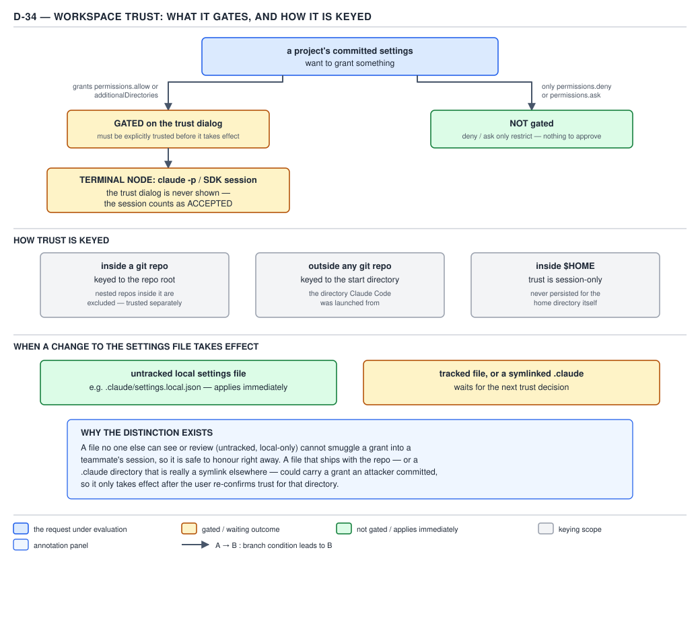

# 21 AI for Coding — working directories and workspace trust — BASICS (§1.4.30–1.4.34)

**Target version: Claude Code v2.1.2xx (August 2026).** | **Part 1 of 6** | [Index](../00-index.md)
Previous: [the six permission modes](05-modes.md) · Next: [local files, precedence and per-run overrides](07-precedence-and-overrides.md)

## The concept: a working directory is a file-access grant, not a configuration root

Files 01–05 covered the rule lists and the six modes — both answer "does this tool call run without
asking." This file answers a different question: "which files can Claude touch at all, and which
`.claude/` configuration governs the session while it does." Those turn out to be two separate grants,
not one, and conflating them is the trap this file exists to name.

**Why it exists.** A coding session usually needs more than one directory — a monorepo with a shared
library, a sibling checkout, a scratch folder outside the repo. Claude Code has to let a session reach
those paths without silently also picking up every `.claude/` file sitting inside them, because a
second directory's hooks or `env` block running unannounced would be a much bigger surprise than being
able to `Read` a file there.

**How it works.** `[DOC]` Re-verified against `https://code.claude.com/docs/en/permissions`,
2026-08-29. The session's **primary working directory** is the directory Claude Code was launched
from, and stays primary until moved with `/cd` (§1.4.31). Three mechanisms widen access beyond it:

| Mechanism | When set | Persists across sessions? |
|---|---|---|
| `--add-dir <path>` | CLI flag at startup | No — startup only |
| `/add-dir` | Slash command mid-session | No — this session only |
| `permissions.additionalDirectories` | A settings file (`settings.json`, etc.) | Yes — read every session |

> Files in additional directories follow the same permission rules as the original working directory:
> they become readable without prompts, and file editing permissions follow the current permission
> mode.

— *Configure permissions*, re-verified 2026-08-29.

**`[TRAP]` Additional directories grant file access, not configuration — and the two mechanisms above
don't even grant the same amount of it.** The documentation states the general rule directly:

> Adding a directory extends where Claude can read and edit files. It doesn't make that directory a
> full configuration root: most `.claude/` configuration is not discovered from additional
> directories, though a few types are loaded as exceptions.

— *Configure permissions*, re-verified 2026-08-29.

The exceptions apply **only** to `--add-dir` / `/add-dir` (including directories the Agent SDK adds
through its `additionalDirectories` / `add_dirs` option, which is passed through as `--add-dir`
underneath). A directory named in `permissions.additionalDirectories` in a settings file loads **none**
of the exceptions below — file access only, full stop:

| Configuration in the added directory | Loaded from `--add-dir` / `/add-dir`? |
|---|---|
| Skills (`.claude/skills/`) | Yes, with live reload |
| Command files (`.claude/commands/`) | Yes, no live reload; on a name clash your project's own command wins |
| Subagents (`.claude/agents/`) | Yes, no live reload |
| `.claude/settings.json` / `.claude/settings.local.json` | Only the `enabledPlugins` and `extraKnownMarketplaces` keys |
| `CLAUDE.md`, `.claude/rules/`, `CLAUDE.local.md` | Only when `CLAUDE_CODE_ADDITIONAL_DIRECTORIES_CLAUDE_MD=1` is set (`CLAUDE.local.md` also needs the `local` setting source, on by default) |

Adding the same monorepo package two ways illustrates the gap:

```json
{
  "permissions": {
    "additionalDirectories": ["../billing-service"]
  }
}
```

```
claude --add-dir ../billing-service
```

The settings-file form lets Claude `Read`/`Edit` inside `../billing-service` and nothing more — its
`.claude/settings.json` hooks, its `.mcp.json`, its skills stay invisible. The `--add-dir` form does
that too, but *additionally* live-reloads `../billing-service/.claude/skills/` into the session and
picks up its `enabledPlugins` list — configuration a reader who only knows the settings-file form would
not expect to see.

**Pitfall:** the wrong belief is "I added the directory, so its `.claude/settings.json` is now in
effect alongside mine." The symptom is a hook or an `env` value defined in the added directory that
never fires, or — worse in the opposite direction — a skill from an `--add-dir` path unexpectedly
firing because live-reloaded skills were not on the mental list of what "just file access" was
supposed to include. The fix: check the table above per configuration type rather than assuming
"added directory" is one uniform grant; `permissions.additionalDirectories` is the strictly narrower of
the two.

## §1.4.31 — `/cd` moves the configuration surface; `--add-dir` never does

`[DOC]` `[VERSION]` `/cd <path>` moves the **primary** working directory rather than adding a second
one, and it requires **Claude Code v2.1.169 or later** to exist as a command at all. On the move:

> Claude Code keeps the conversation, loads the new directory's `CLAUDE.md`, and prompts you to trust
> the workspace if you haven't worked in it before.

— *Configure permissions*, re-verified 2026-08-29.

`[DOC]` As soon as the move completes, Claude Code re-applies the new directory's entire project
configuration surface — the documentation names it as exactly these parts:

1. **Its project settings**, including their permission rules, and its **hooks**.
2. Its **`.mcp.json` servers**, subject to the same server approval as at startup, plus the
   local-scope MCP servers registered in the new directory.
3. The **plugins** its settings enable, its **skills**, and its **subagents**.
4. Its **`env`** values, applied on top of the environment variables from the previous directory's
   settings, which stay in effect rather than being cleared.

That is seven named things — project settings, hooks, MCP servers, plugins, skills, subagents, `env` —
and it is the direct contrast with §1.4.30: `--add-dir` widens *where files can be touched* while
leaving the configuration surface alone; `/cd` replaces *which configuration surface governs the
session* while widening file access as a side effect of moving there. One reader mistake this file
exists to head off is treating them as points on the same spectrum — they are not; one is a file-access
grant, the other is a full context switch.

`[DOC]` `[VERSION]` The trust prompt `/cd` shows for a not-yet-trusted directory lists what accepting
would activate — "the allow rules, additional directories, hooks, and helper commands the directory's
settings would activate" — before you accept. **Before v2.1.246**, `/cd` did not apply the new
directory's settings, hooks, MCP servers, or skills until the session was later resumed, and its trust
prompt did not list what the directory's settings would activate — an older binary's `/cd` looks like
it moved you but is still running under the old configuration until resume.

Two housekeeping details worth carrying: `/cd` disconnects the previous directory's project and
local-scope MCP servers (and any plugin-provided server no longer enabled after the move); it takes
`additionalDirectories` from the *new* directory's settings but keeps whatever you added yourself with
`--add-dir` or `/add-dir`; and hooks the move activates still see `${CLAUDE_PROJECT_DIR}` pointing at
the project root where the session originally started, not the new directory.

```
claude --add-dir ../billing-service
> /cd ../billing-service
```

The first line only widens access, per §1.4.30. The second line, run inside that same session, replaces
the active project settings, hooks, MCP servers, plugins, skills and subagents with `../billing-service`'s
own — and, being a move into a directory not yet trusted, opens the workspace-trust prompt covered next.

**Gotcha:** restricting or disabling `/cd` targets goes through a `Cd` permission rule (file 04) — a
`deny` on `Cd` blocks the move itself, before any of the seven-part re-application above has a chance to
run.

## §1.4.32 — workspace trust: what it gates, and why the gate is one-sided

`[DOC]` Re-verified against `https://code.claude.com/docs/en/permissions`, 2026-08-29:

> `permissions.allow` rules and `permissions.additionalDirectories` entries in a project's
> `.claude/settings.json` grant capability, so Claude Code applies them only after you accept the
> workspace trust dialog for that folder. The dialog lists the rules and directories the folder would
> grant so you can review them first. `deny` and `ask` rules aren't affected, since they only restrict.

— *Configure permissions*, re-verified 2026-08-29.

The asymmetry is deliberate rather than an oversight. An `allow` rule and an `additionalDirectories`
entry both **widen** what a session may do without a prompt — exactly the class of change a stranger's
committed settings file should not get to make unreviewed. A `deny` or `ask` rule only **narrows**
what runs without a prompt, or forces a prompt where none existed — applying either of those before
you have even opened the trust dialog cannot let a hostile repository do anything it couldn't already
do; it can only make Claude Code more cautious inside that repository than it would otherwise have
been. Gating the permissive direction and not the restrictive one is the safe asymmetry, not an
inconsistency.

## §1.4.33 — how trust is keyed

`[DOC]` Re-verified against `https://code.claude.com/docs/en/permissions`, 2026-08-29. Trust is not
a single global switch; where and how it is stored depends on where the session started:

| Where you started Claude Code | What the trust is keyed to | What it covers |
|---|---|---|
| Inside a git repository | The **git repository root** | The whole repository, **except** any git repository nested inside it (a submodule, or any other embedded `.git`) — that nested repo needs its own trust decision. In a worktree, the key is the main checkout's root, matching how saved permission rules are keyed. |
| Outside any git repository | The **directory you started Claude Code from** | Every subdirectory of that start directory, again **except** a git repository nested inside it (for example, a clone sitting under a scratch folder). Each such covered subdirectory then counts, for later purposes, as "a folder whose parent you trusted." |
| Inside your home directory (`$HOME`) | Nothing written to disk | Trust for the **current session only** — closing the session forgets it, and the next session in `$HOME` prompts again. |

"Excluding nested repos" is concrete, not abstract: trusting `~/projects/platform` (a git repo root)
covers every ordinary subdirectory under it, but if `~/projects/platform/vendor/reporting-lib` is
itself a separate git checkout (a submodule, or just another repo dropped in place), that inner
directory is **not** covered by the outer trust — Claude Code treats it as its own trust boundary with
its own key, and working inside it re-triggers the dialog (interactively) or the untrusted-folder
behavior of §1.4.34 (in `-p`/SDK).



**D-34** — Workspace trust, and how it is keyed. The highlighted terminal is the one to remember: a
`-p` or SDK session never shows the dialog. (The same panel also anticipates the tracked-versus-untracked
local-settings-file distinction covered in full in the next file, §1.4.35 — not covered here.)

```json
{
  "permissions": {
    "allow": ["Bash(mvn test)", "Bash(./gradlew build)"],
    "additionalDirectories": ["../billing-service"]
  }
}
```

Committed as `.claude/settings.json` at a repository's root, this file's two lines only take effect for
a given machine once that machine's session has accepted the trust dialog keyed to that repository's
git root — until then the rules exist on disk but are inert.

## §1.4.34 — `[TRAP]` a `-p` or SDK session never shows the trust dialog

`[DOC]` Re-verified against `https://code.claude.com/docs/en/permissions`, 2026-08-29 — quoted exactly:

> Claude Code shows the trust dialog in interactive sessions only. A `claude -p` run or an SDK session
> never shows it, and trusting a parent folder doesn't count for these rules.

— *Configure permissions*, re-verified 2026-08-29.

**Divergence from the syllabus, stated plainly.** The leaf behind this section reads "a `-p` or SDK
session never shows the trust dialog and counts as accepted," implying the committed `allow` rules and
`additionalDirectories` from an untrusted repository run anyway. The current documentation says the
opposite for that general case. The same page's table of "what runs before you trust a folder" gives
the `-p`/SDK row for exactly `permissions.allow` rules and `additionalDirectories`:

> Not used. Claude Code prints a `this workspace has not been trusted` warning to stderr.

— *Configure permissions*, re-verified 2026-08-29.

So a fresh clone, run for the first time as `claude -p "run the tests"` with nobody having trusted it
yet, does **not** silently pick up its committed `allow` rules — it runs with those rules absent and a
warning on stderr, which is the safe direction, not the dangerous one. This file corrects the leaf here
rather than repeating it: **"never shows the dialog" is true; "and therefore counts as accepted for
`allow`/`additionalDirectories`" is not** — that phrase in the docs describes a narrower, different
case (below), not this one.

**Where "counts as accepted" genuinely appears — and why it still adds up to the same hole.** The
phrase is real, but it names a specific internal check: whether `.claude/settings.local.json` is
tracked in git (making it repository-supplied) or untracked (making it "normally your own file," per
the next file's leaf). Telling the two apart requires running `git`, and:

> Claude Code runs git to tell the two apart, and it runs git only once you've trusted the folder: you
> accepted the trust dialog for it or for a parent directory whose trust extends to it, or you're in a
> `-p` or SDK session, which counts as accepted.

— *Configure permissions*, re-verified 2026-08-29.

Concretely: in a `-p`/SDK session, an **untracked** `.claude/settings.local.json` — the common case,
since teams routinely `.gitignore` it as a personal file — has its rules applied immediately, with no
trust dialog ever shown and none needed, because it is treated as your own file regardless of whether
this exact folder has been trusted before. A **tracked** `settings.local.json`, or `.claude` itself
being a symlink, is instead treated as repository-supplied and falls back to the ordinary untrusted-`-p`
behavior above — not used, warning printed — exactly like a tracked `.claude/settings.json`.

**The actual supply-chain shape, once both halves are correct.** Trust, once granted for a
repository-root key, is stored (`hasTrustDialogAccepted` under that path in `~/.claude.json`) and is
never re-asked for on content grounds — Claude Code does not re-open the dialog because the *ruleset*
in `.claude/settings.json` changed, only because the *folder* was never trusted before. A CI runner
that checks out the same repository root path repeatedly, where a human trusted that path once
interactively (or an administrator pre-seeded `hasTrustDialogAccepted: true` for it), reaches every
later `-p`/SDK invocation already trusted — with no dialog to skip, because there is nothing left to
skip. From that point on, whatever `permissions.allow` list the currently checked-out commit happens
to contain runs unreviewed in every pipeline invocation, because trust attaches to the path, not to the
commit's content, and a `-p`/SDK run has no mechanism to ever re-surface a dialog even if that commit
just changed the allow list to something nobody has looked at. A repository that merges a pull request
adding `"Bash(curl * | sh)"` to its committed `allow` list inherits an already-trusted CI path's silence
the very next pipeline run.

**Pitfall:** the wrong belief is "the trust dialog is a control that protects CI, because CI runs `-p`
and `-p` never got a chance to accept anything." The symptom is the reverse of the belief: a first,
never-trusted `-p` run is in fact the *safe* case (rules withheld, warning printed) — the danger sits
one step later, once any human or script has trusted that exact path a single time, after which every
subsequent `-p`/SDK run in that path silently executes whatever `allow` rules the current commit
contains, with no re-review keyed to the change. The fix: never let a CI identity's trust be established
against a path that untrusted contributors' commits can land in — `claude -p --setting-sources user`
(reading no project settings at all) or `claude -p --bare` (also skipping hooks, skills, commands,
subagents and `.mcp.json`) removes the committed `allow` list from the equation entirely, rather than
relying on trust state to keep gating it. **Why people believe it:** the dialog *is* the review
mechanism for interactive use, and CI is "just Claude Code running non-interactively," so it reads as
the same protection minus the popup — it is instead a protection that requires exactly the popup, and
CI structurally cannot produce one.

## Pitfalls

- **Belief:** "Adding a directory with `permissions.additionalDirectories` also picks up its
  `.claude/settings.json`." **Outcome:** hooks, `env` values, and MCP servers defined there never load;
  only file reads and edits work. **Fix:** use `--add-dir`/`/add-dir` if you specifically want the
  narrow set of exceptions (skills, commands, subagents, `enabledPlugins`/`extraKnownMarketplaces`,
  gated `CLAUDE.md` support) — `additionalDirectories` in a settings file never loads any of them.
  **Why people believe it:** "directory" reads as one concept; the docs split it into two grants of
  different width depending on which of the three mechanisms added it.
- **Belief:** "`/cd` is just a fancier `--add-dir` that also switches the primary directory." **Outcome:**
  a reader expecting only a widened file-access scope is surprised when hooks, MCP servers, plugins,
  skills, subagents and `env` values all change out from under the session. **Fix:** treat `/cd` as a
  full context switch — project settings, hooks, MCP servers, plugins, skills, subagents, `env`, all
  seven, re-applied — never as an incremental grant. **Why people believe it:** both commands take a
  path argument and both "add" somewhere to the session's reach, so they read as the same operation at
  different strengths.
- **Belief:** "a `-p`/SDK session skipping the trust dialog means an untrusted repo's `allow` rules run
  unreviewed on the very first automated run." **Outcome:** the opposite happens on that first run — the
  rules are withheld and a warning goes to stderr; the real hole opens only once that exact repository
  path has been trusted by any means and stays trusted indefinitely, because trust is keyed to the path
  and never re-checked against the current commit's content. **Fix:** keep CI's trusted checkout paths
  free of untrusted contributions, or strip project settings from the automated run entirely with
  `--setting-sources user` or `--bare`, rather than counting on the dialog to have ever been the gate
  for that path. **Why people believe it:** "never shows the dialog" and "counts as accepted" both
  appear in the documentation near each other, but the second phrase names a narrower, different check
  (tracked-versus-untracked `settings.local.json`) than the one the belief assumes it names.

## Cheat sheet

| Fact | Value |
|---|---|
| Primary working directory | Set at launch; moved only by `/cd` |
| Widen file access only | `--add-dir` (startup), `/add-dir` (session), `permissions.additionalDirectories` (persistent, settings file) |
| `additionalDirectories` (settings key) loads config too? | No — file access only, never |
| `--add-dir` / `/add-dir` config exceptions | Skills (live), commands (no live reload), subagents (no live reload), `enabledPlugins`/`extraKnownMarketplaces`, gated `CLAUDE.md`/rules |
| `/cd` minimum version | v2.1.169+ |
| `/cd` re-applies (7 things) | Project settings, hooks, MCP servers, plugins, skills, subagents, `env` |
| `/cd` trust-prompt listing fixed in | v2.1.246 (before: settings/hooks/MCP/skills applied only after resume, no prompt preview) |
| Trust gates | `permissions.allow`, `additionalDirectories` from committed settings |
| Trust does NOT gate | `deny`, `ask` (they only restrict) |
| Trust key, inside a repo | Git repository root, excluding nested repos |
| Trust key, outside a repo | The start directory, excluding nested repos under it |
| Trust key, in `$HOME` | Session-only, never written to disk |
| `-p`/SDK + untrusted folder + committed `allow`/`additionalDirectories` | Not used; `this workspace has not been trusted` warning to stderr |
| `-p`/SDK "counts as accepted" for | The git check distinguishing tracked vs. untracked `settings.local.json` only |
| Strip project settings from an automated run | `--setting-sources user`, or `--bare` |

## Self-test

<details><summary>1. You add `../billing-service` via `permissions.additionalDirectories` in your settings file. Does its `.claude/settings.json` hooks now run?</summary>
No. `permissions.additionalDirectories` entries grant file access only and load no configuration
exceptions at all — that is the narrower of the two mechanisms. Only `--add-dir`/`/add-dir` load the
small documented exception list (skills, commands, subagents, `enabledPlugins`/`extraKnownMarketplaces`,
gated `CLAUDE.md`), and hooks are not on that list either way.
</details>

<details><summary>2. Name the seven things `/cd` re-applies from the new directory, and contrast it with `--add-dir` in one sentence.</summary>
Project settings, hooks, MCP servers, plugins, skills, subagents, and `env`. `--add-dir` only widens
which files can be read or edited; `/cd` replaces the entire configuration surface the session runs
under.
</details>

<details><summary>3. Why are `deny` and `ask` rules in a project's committed settings not gated by workspace trust, while `allow` rules are?</summary>
`allow` and `additionalDirectories` widen what runs without a prompt, which is exactly the capability an
unreviewed repository should not get to grant; `deny` and `ask` only narrow it or add a prompt, so
applying them before trust is accepted cannot let a hostile repository do anything it couldn't already
do — it can only make the session more cautious.
</details>

<details><summary>4. A submodule sits inside a git repository whose root you've already trusted. Is the submodule covered by that trust?</summary>
No. Trust keyed to a git repository root explicitly excludes any git repository nested inside it, such
as a submodule — that nested repository is its own trust boundary and triggers its own trust decision
(the dialog interactively, or the untrusted-folder behavior in `-p`/SDK).
</details>

<details><summary>5. Does a first-ever `claude -p` run in a repository nobody has trusted apply its committed `permissions.allow` rules?</summary>
No. The documentation states that case is "Not used," with a `this workspace has not been trusted`
warning printed to stderr — the safe default, not the dangerous one. A syllabus or note claiming the
opposite (that `-p` "counts as accepted" for these rules) is describing a different, narrower check.
</details>

<details><summary>6. What does "`-p`/SDK counts as accepted" actually govern?</summary>
Only whether Claude Code runs `git` to tell a tracked `.claude/settings.local.json` (repository-supplied,
held until trust) apart from an untracked one (treated as your own file, applied immediately). It does
not mean committed `permissions.allow` rules from `.claude/settings.json` run unreviewed in a `-p`/SDK
session on an untrusted folder.
</details>

<details><summary>7. Where does the real supply-chain risk from workspace trust sit, once the two halves above are both accounted for?</summary>
In trust being sticky per path and never re-checked against content: once a repository-root path has
been trusted once (by a human interactively, or by a pre-seeded `hasTrustDialogAccepted`), every later
`-p`/SDK run in that same path applies whatever `allow` rules the currently checked-out commit contains,
with no dialog to skip and no re-review triggered by the ruleset having changed.
</details>

<details><summary>8. Two ways to keep a `claude -p` CI run from ever using a repository's committed `permissions.allow` list, regardless of trust state.</summary>
`--setting-sources user` (reads no project settings or `.mcp.json` at all) or `--bare` (also skips
hooks, skills, custom commands, subagents, and `.mcp.json` servers from the project, while still
applying `env` and helpers such as `awsAuthRefresh` from project settings).
</details>

## Open questions

None.

---

**Leaves covered:** 1.4.30–1.4.34 (5 leaves)
**Leaves deferred:** none
**Diagrams included:** D-34
**Target version:** Claude Code v2.1.2xx (August 2026)
**Lines:** 378
