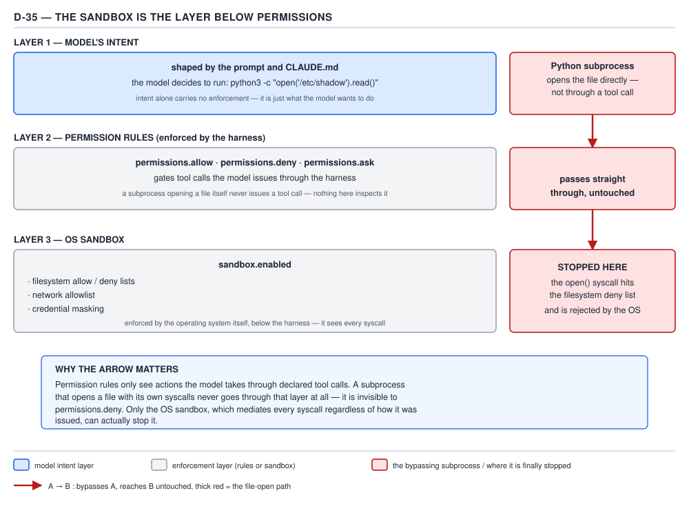

# 21 AI for Coding — the sandbox, and a real permission block — BASICS (§1.4.39–1.4.41)

**Target version: Claude Code v2.1.2xx (August 2026).** | **Part 1 of 6** | [Index](../00-index.md)
Previous: [local files, precedence and per-run overrides](07-precedence-and-overrides.md) · Next: [what a skill is](../skills/01-basics-what-a-skill-is.md)

## This file applies seven files of rules to two things: an OS boundary, and one settings.json

Files 01–07 built the permission system leaf by leaf: the three rule lists and their evaluation
order, the Bash transformation pipeline, path rules and their tool coverage, web/MCP/Agent/Cd rule
forms, the six permission modes, directory trust, and settings-file precedence. None of that
apparatus is re-taught here. This file does two things with it. First, it names the layer that sits
*underneath* every rule this set has covered — the sandbox — and states exactly what it catches that
no rule, however carefully written, ever could (§1.4.39). Second, it writes one real `settings.json`
for one real repository and proves, rule by rule, that it does what it claims (§1.4.40). Then it closes
the whole permission area by reading the sdlc-harness's own project settings and asking why its
`Bash(*)` allow rule, paired with a deny-list, is engineering rather than an author who gave up
(§1.4.41).

## §1.4.39 — the sandbox is the layer below permissions

`[DOC]` `[RESEARCH]` File 03 already forced the question this leaf answers: §1.4.19 established that a
`Read`/`Edit` deny rule stops the built-in file tools and a fixed set of recognised Bash commands
(`cat`, `head`, `tail`, `sed`), but does nothing at all to an arbitrary subprocess that opens the same
file through its own interpreter —

```python
python3 -c "print(open('./secrets/token.txt').read())"
```

— run through the `Bash` tool, sails straight past a `Read(./secrets/**)` deny, because the permission
layer never inspects what a running process does internally; it only ever inspected which *command
name* Claude Code chose to launch, and `python3 -c "..."` is not one of the recognised file-reading
forms. That is not a bug in the rule — it is the outer boundary of what a permission rule, as a
mechanism, is even capable of expressing. The **sandbox** is Claude Code's answer to exactly that gap,
re-verified against the documentation immediately before writing this leaf:

> Permissions and sandboxing are complementary security layers: permissions control which tools Claude
> Code can use and which files or domains it can access, and apply to Bash, Read, Edit, WebFetch, MCP,
> and every other tool; sandboxing provides OS-level enforcement that restricts the Bash tool's
> filesystem and network access, and applies only to Bash commands and their child processes.

— *Configure permissions*, `https://code.claude.com/docs/en/permissions`, re-verified 2026-08-29.

Read that scope statement precisely: sandboxing does not gate `Read`, `Edit`, `WebFetch`, or MCP tool
calls directly the way a permission rule does — it gates the **Bash tool's own subprocess tree**, at
the operating system, regardless of which command name is inside it. That is exactly the shape of the
hole §1.4.19 identified: a `python3` interpreter opening a file handle is invisible to the *permission*
layer because the permission layer only recognises command names, but it is not invisible to the
*sandbox*, because the sandbox does not ask what the command is called — it asks what system calls the
process (and everything it forks) actually makes, and refuses the ones that fall outside a filesystem
and network boundary configured independently of any `Read`/`Edit`/`WebFetch` rule.

**Why an OS-level boundary catches what a rule cannot, in one paragraph:** a permission rule is a
string match against text Claude Code chose to construct — a tool name plus an optional specifier — so
its entire field of view is bounded by what Claude Code's own tool-dispatch code recognises as
"reading a file" or "reaching a host." A subprocess that never goes through a recognised code path —
a Python script calling `open()`, a compiled binary making a raw `connect()` syscall, a `curl` invoked
from inside a shell script the rule engine never separately parsed — simply never presents a string for
any rule to match against. The sandbox instead sits between the process and the kernel: every `open()`,
every `connect()`, every `execve()` a Bash-launched process or any of its children performs is
intercepted at the OS level, so the enforcement point is the same regardless of whether the process
calls itself `cat`, `python3`, or a name the permission engine has never heard of. The rule engine
enforces *policy about tool calls it can see*; the sandbox enforces *a boundary the kernel itself
refuses to let a process cross*, which is why it is correctly described as the layer below permissions
rather than an alternative to them.



**D-35** — The sandbox is the layer below permissions. Follow the arrow: a Python subprocess opening a
file directly passes straight through the rule layer and is stopped only by the OS.

`[RESEARCH]` The settings surface this leaf names — re-verified against `settings-reference` on
2026-08-29, since this area drifts release to release — is a `sandbox` object with four sub-areas:

| Sub-area | Representative keys | What it governs |
|---|---|---|
| Top-level enable | `sandbox.enabled` | turns on Bash sandboxing on macOS, Linux, and WSL2 |
| Filesystem | `sandbox.filesystem.denyRead`, `denyWrite`, `allowRead`, `allowWrite`, `disabled` | which paths a sandboxed Bash process (and its children) may open, independent of any `Read`/`Edit` rule |
| Network | `sandbox.network.allowedDomains`, `deniedDomains`, `strictAllowlist` | which hosts a sandboxed Bash process may reach, independent of any `WebFetch` rule |
| Credentials | `sandbox.credentials.envVars`, `sandbox.credentials.files` | unsetting or masking an environment variable or credential file inside the sandboxed process's view of the world |

**One paragraph each**, as the leaf asks:

**Filesystem allow/deny.** `sandbox.filesystem.denyRead` and `denyWrite` name paths no sandboxed
process may touch regardless of which command tries; this is the OS-level backstop for exactly the
`python3 -c "open(...)"` case above — a path denied here is denied to *every* subprocess Bash ever
spawns, not only to the command names the permission engine happens to recognise. The documentation
states plainly that this is additive with, not a replacement for, the permission layer's own path
rules: **"filesystem restrictions in the sandbox combine the `sandbox.filesystem` settings with `Read`
and `Edit` deny rules; both are merged into the final sandbox boundary."** A path can end up blocked
because a `Read` deny named it, because `sandbox.filesystem.denyRead` named it, or both — the union
wins, which is the correct default for a boundary whose entire job is to fail closed.

**Network allowlist.** `sandbox.network.allowedDomains` and `deniedDomains` play the equivalent role
for outbound network access from inside a sandboxed Bash process: a `WebFetch(domain:...)` permission
rule governs the `WebFetch` *tool*, but a sandboxed `curl` or `pip install` running as a Bash child
process is checked against the sandbox's own domain lists, and the documentation states the same
merge: **"network restrictions combine `WebFetch(domain:...)` permission rules with the sandbox's
`allowedDomains` and `deniedDomains` lists."** `sandbox.network.strictAllowlist` (user or managed scope
only) turns a host outside the allowlist from "prompt" into "deny outright" — the network equivalent of
choosing `deny` over `ask` for a path.

**Credential masking.** `sandbox.credentials.envVars` and `sandbox.credentials.files` unset or mask a
named environment variable or credential file specifically inside the view a sandboxed process gets —
an AWS key exported into the shell's environment for the *session* can still be masked away from
`Bash`'s own subprocess tree, so a compromised or confused command running inside the sandbox cannot
read it even though the outer session (and the model reasoning about the session) never lost access to
it. This is the credential-scoped sibling of the filesystem and network boundaries: the same principle
— restrict what the sandboxed subprocess tree can observe, at a layer no permission rule reaches —
applied to secrets specifically rather than to paths or hosts in general.

A minimal, complete, parseable settings object turning on the two boundaries this leaf discussed —
filesystem and network — for the same `secrets/` directory §1.4.17 already denied at the permission
layer:

```json
{
  "sandbox": {
    "enabled": true,
    "filesystem": {
      "denyRead": ["./secrets/**"]
    },
    "network": {
      "allowedDomains": ["repo.maven.apache.org", "registry.npmjs.org"]
    }
  }
}
```

`sandbox.enabled: true` turns on Bash sandboxing at all; without it, everything else in the `sandbox`
object is inert configuration that never gets consulted, the same way a `deny` rule with a typo'd tool
name parses cleanly and does nothing. `sandbox.filesystem.denyRead` restates the `secrets/` boundary at
the OS level, so it now also covers the `python3 -c "open(...)"` case §1.4.19 showed slipping past the
permission-only version of the same rule. `sandbox.network.allowedDomains` narrows every sandboxed
Bash process's outbound reach to the two package registries a Java/Spring Boot build actually needs,
rather than leaving the default network posture open to anywhere a compromised or confused build step
might try to exfiltrate to.

**Insight:** "add the sandbox" is not a strictly stronger version of "write more permission rules" —
it is a categorically different enforcement point, which is exactly why the documentation frames the
two as complementary rather than one superseding the other. A team that sandboxes Bash but writes no
`Read`/`Edit` deny rules at all still leaves every *other* tool — `Read`, `Edit`, `WebFetch`, every MCP
tool — governed by permission rules alone, because the sandbox's scope is stated explicitly as "the
Bash tool's filesystem and network access," not "every tool Claude Code has." Defence in depth here
means: permission rules for tool-level policy across every tool, and the sandbox specifically for the
one tool — `Bash` — whose subprocess tree can otherwise escape every path- and domain-shaped rule the
permission engine knows how to write.

No gotcha beyond the one already stated as the reason this leaf exists: a reader who has internalised
"I denied `Read(./secrets/**)`, so nothing can read that path" has already been shown the counter-
example at §1.4.19, and the fix is this section, not a cleverer permission rule — there is no
permission-rule shape that closes the arbitrary-subprocess gap, because the gap is definitionally
outside what a rule can see.

> The sandbox is OS-level enforcement, beneath the permission engine, that restricts what a Bash
> command and everything it spawns can touch on disk and on the network — catching exactly the
> arbitrary-subprocess case no `Read`/`Edit`/`WebFetch` rule can ever see.

## §1.4.40 — a real permission block for a Java/Spring Boot repository, proved rule by rule

`[BUILD]` `[PROVE]` The five requirements: allow the build and test commands, deny `git push`, deny
reads of `.env` and `secrets/**`, deny `rm -rf`. Here is the complete, valid, parseable artefact —
every parent key present, no comments, because JSON does not support them:

```json
{
  "permissions": {
    "allow": [
      "Bash(mvn -q test *)",
      "Bash(mvn -q verify *)",
      "Bash(./mvnw spring-boot:run *)"
    ],
    "deny": [
      "Bash(git push *)",
      "Read(./.env)",
      "Edit(./.env)",
      "Read(./secrets/**)",
      "Edit(./secrets/**)",
      "Bash(rm -rf *)"
    ]
  }
}
```

This parses as valid JSON — confirmed against the actual file, not asserted:

```
$ python3 -m json.tool settings.json > /dev/null && echo "valid JSON"
valid JSON
```

**Requirement 1 — allow the build and test commands.** The commands a Java/Spring Boot engineer
actually types are `mvn -q test`, `mvn -q verify`, and `./mvnw spring-boot:run`. Each allow entry
carries its `*` **after the subcommand** — `Bash(mvn -q test *)`, not `Bash(mvn *)` — for the reason
file 02 already proved with `devbox run *`: a wildcard placed right after the tool name (`mvn`) rather
than after the specific subcommand (`test`) absorbs *every* subcommand Maven has, including
`mvn org.apache.maven.plugins:maven-antrun-plugin:run` or `mvn -Dexec.args='rm -rf /' exec:exec` —
both of which are ordinary Maven invocations that execute arbitrary code, not build steps. `Bash(mvn -q
test *)` dodges that specific trap: the wildcard only ever absorbs trailing arguments to the already-
named `test` goal — `-Dtest=OrderServiceTest`, `-DskipITs`, `-o` — never a different goal entirely.

Trace `mvn -q test` through the pipeline exactly as file 01 defined it (`deny` → `ask` → `allow`, first
match wins) and file 02's transformation stages: no compound separators, no wrapper to strip, no
leading assignment. Checked against `deny`: none of `Bash(git push *)`, `Read(./.env)`,
`Edit(./.env)`, `Read(./secrets/**)`, `Edit(./secrets/**)`, `Bash(rm -rf *)` match a Bash command that
starts with `mvn` — no denial. Checked against `ask`: empty list, no match. Checked against `allow`:
`Bash(mvn -q test *)` matches `mvn -q test` (the wildcard matches the empty trailing string, exactly as
file 02's Self-test 1 already established for `builtin npm test`-shaped rules). **Outcome: runs
unattended.** **Deciding rule:** the allow entry `Bash(mvn -q test *)`. `mvn -q verify` and `./mvnw
spring-boot:run` trace identically against their own allow entries and both run unattended for the
same reason.

**Requirement 2 — deny `git push`.** Trace `git push origin main`. No wrapper, no assignment. Checked
against `deny` first: `Bash(git push *)` matches — the wildcard, again placed after the subcommand
(`push`), absorbs `origin main`. **Outcome: blocked, before `ask` or `allow` is ever consulted.**
**Deciding rule:** the deny entry `Bash(git push *)`. The same placement discipline as requirement 1
matters here for the opposite reason: a broader `Bash(git *)` deny would also match `git status` and
`git log --oneline`, both of which are on §1.4.14's built-in read-only exemption list and would
otherwise run unattended in every mode — an explicit `deny` for the whole `git` tool name overrides
that free pass "for that command specifically," per file 02's own citation of the documentation, so a
careless `Bash(git *)` here would silently start prompting for (or blocking) every harmless `git log`
the reader runs all day. Trace `git status` against this actual settings object to confirm the scoped
version does not have that side effect: no separator, no wrapper, no assignment; checked against
`deny` — `Bash(git push *)` does not match `git status` (different subcommand text entirely); checked
against `ask` — empty; falls through to the built-in read-only exemption, which still applies because
no `deny`/`ask` rule named `git status` or the bare `git` tool. **Outcome: `git status` still runs
unattended, `git push` is blocked.** The scoped deny gets exactly one behaviour and not the other.

**Requirement 3 — deny reads of `.env` and `secrets/**`.** `Read(./.env)` and `Read(./secrets/**)` use
the gitignore pattern syntax file 03 established at §1.4.16: `./` anchors both at the session's current
directory, and the trailing `/**` on the second denies the whole `secrets/` directory at any depth. A
`Read` tool call against `.env` is checked against `deny` first — `Read(./.env)` matches. **Outcome:
blocked.** **Deciding rule:** `Read(./.env)`. So is `cat .env` run through `Bash`, because `cat` is one
of the file commands §1.4.19's own quote names as recognised against `Read`/`Edit` rules even inside
Bash. **Outcome: blocked.** **Deciding rule:** the same `Read(./.env)` entry, reached through Bash's
recognised-command path rather than the built-in `Read` tool. But `python3 -c "print(open('.env').read())"`
run through `Bash` is checked against the same deny list and matches nothing — not `Bash(git push *)`,
not `Read(./.env)` (a different specifier *type* entirely; `Read(...)` is never checked against a
`Bash` call unless the command text is one of the recognised file-command forms, and `python3` is not
one of them), not `Bash(rm -rf *)`. **Outcome: runs, and prints the file's contents.** This is
precisely §1.4.19's finding, reproduced against this exact settings object rather than asserted in the
abstract, and it is exactly what §1.4.39's `sandbox.filesystem.denyRead: ["./secrets/**"]` exists to
close — permissions alone stop here.

`Edit(./.env)` and `Edit(./secrets/**)` sit alongside the `Read` denies for a reason worth stating
precisely rather than approximately: per §1.4.17, a `Read` deny on this target version *already*
propagates to the `Edit` and `Write` tools on the same path (edits since v2.1.208, writes since
v2.1.228, both active on v2.1.2xx) — so `Read(./.env)` alone already blocks an `Edit` tool call
rewriting `.env`. The explicit `Edit` deny is not closing a gap in that propagation; it is making the
intent readable without requiring a reviewer to already know the v2.1.208/v2.1.228 propagation rule by
heart, and it is defence against exactly the kind of version regression §1.4.17 flags as a real trap.
What neither `Read(./.env)` nor `Edit(./.env)` reaches, and what this settings object does **not**
attempt to close because none of the five requirements ask for it, is `NotebookEdit` — per §1.4.17 and
§1.4.18 together, the only lever that ever blocks a `NotebookEdit` call is a bare, path-less
`"deny": ["NotebookEdit"]`, which removes the tool project-wide rather than scoping to `.env` or
`secrets/`. A Spring Boot repository with no `.ipynb` files in it has no reason to pay that cost here.

**Requirement 4 — deny `rm -rf`.** Trace `rm -rf target/`, an entirely ordinary manual "clean the
build output" command a Java engineer might type by hand instead of `mvn clean`. No wrapper, no
assignment. Checked against `deny`: `Bash(rm -rf *)` matches — the wildcard absorbs `target/`.
**Outcome: blocked.** **Deciding rule:** `Bash(rm -rf *)`. This is the rule that needs the most care of
the five, for the reason the leaf names directly: **a broad deny cannot carry exceptions.** File 01
already established that `deny` wins on any match regardless of how a co-existing `allow` is written,
and file 02's own `devbox run` pitfall proved the same shape concretely — a narrower `allow` sitting
next to a broader `deny` for the same command family does not carve out an exception, because
specificity never reorders the three-list pipeline. Concretely: adding `Bash(rm -rf target/)` to
`allow` in this same settings object would **not** re-open cleaning the build directory, because
`Bash(rm -rf *)` in `deny` still matches `rm -rf target/` first, and `deny` is checked before `allow`
is ever consulted — the two entries are not in conflict from Claude Code's point of view, `allow` is
simply never reached. Writing `Bash(rm -rf *)` into `deny` is therefore not "deny `rm -rf` except for
the safe cases" — there is no rule form that means that — it is "deny every `rm -rf` this session ever
issues, full stop, including the ones a human would call harmless," and the reader must decide that is
the trade-off they want (running `mvn clean` instead, since Maven's own clean plugin never shells out
through `Bash(rm -rf ...)` in the first place) rather than discovering it the first time a legitimate
cleanup command gets blocked.

**What this costs.** Every blocked command in this table is not a one-time charge — the tool_use block
the model emitted, and the denial `tool_result` Claude Code hands back explaining which rule fired, both
become part of the conversation, and Part 0's own finding is that **the whole conversation is re-sent
on every subsequent turn.** A denied `git push` looks like roughly 40 output tokens for the attempted
`tool_use` (the tool name, the command string, the call id) plus roughly 60 input tokens for the
`permissionDecisionReason` text Claude Code returns — call it **100 tokens, once, that then rides along
in the input side of every following turn for the rest of the session.** A session that runs another 40
turns after that one blocked attempt before its next compaction pays `40 × 100 = 4,000` extra input
tokens for a single command that never ran — the cost of a denial is not the denial itself, it is the
denial's permanent seat in the context window until compaction evicts it.

## §1.4.41 — the sdlc-harness's `Bash(*)`, and the deny-list it is actually paired with

`[CASE]` The repository's own project settings — read directly, not from memory:

```
/Users/rajat.chikkodikar/Desktop/My-files/Codes/_non-clinet-tech/sdlc-harness/.claude/settings.json
```

```json
{
  "permissions": {
    "allow": ["Read(**)", "Edit(**)", "Bash(*)", "mcp__atlassian-cloud__*"]
  }
}
```

(The file also carries an `enabledPlugins` key alongside `permissions`, not reproduced here since it is
not what this leaf grounds.) Four allow entries, no `deny` key at all **in this file**: everything
Claude reads or edits, every Bash command, and every tool the `atlassian-cloud` MCP server exposes.
Taken alone, this project settings file is the single broadest `allow` block this whole permission area
has shown — which is exactly why the leaf's premise, that a deny-list exists somewhere and pairs with
it, needs to be checked rather than assumed. It is not in this file. Grepping the repository for it
turns up the actual mechanism, which diverges from where the leaf's wording points:

```
plugins/sdlc-harness/hooks/hooks.json
plugins/sdlc-harness/hooks/prod-guard-bash.sh
plugins/sdlc-harness/hooks/prod-guard-lib.sh
plugins/sdlc-harness/hooks/prod-guard-session-start.sh
```

`hooks.json` registers `prod-guard-session-start.sh` on `SessionStart` and, separately,
`prod-guard-bash.sh` is the `PreToolUse` (`Bash` matcher) enforcement half. `prod-guard-lib.sh` is
where the actual deny content lives, and it is not a `permissions.deny` array — it is a Bash array
checked by a hook script, quoted verbatim:

```bash
# The exact permission-deny strings bootstrap must have written to user
# scope (mirrors this repo's own project-scope .claude/settings.json deny
# list — same categories; see RFC 0002 §6.1 table). ALL must be present —
# partial credit is not fail-closed.
PROD_GUARD_REQUIRED_DENY_MARKERS=(
  "Bash(aws cloudformation delete-stack*)"
  "Bash(aws cloudformation update-stack*)"
  "Bash(aws cloudformation create-stack*)"
  "Bash(aws cloudformation execute-change-set*)"
  "Bash(aws ecs update-service*)"
  "Bash(aws lambda update-function-configuration*)"
  "Bash(aws lambda list-functions*)"
  "Bash(aws iam list-*)"
  "Bash(aws ssm * --name /prod/*)"
  "Bash(aws ssm * --path /prod/*)"
  "Bash(aws * --profile *prod*)"
)
```

And the function that actually checks it, also quoted verbatim:

```bash
prod_guard_verified() {
  [[ -f "$PROD_GUARD_USER_SETTINGS" ]] || return 1
  python3 - "$PROD_GUARD_USER_SETTINGS" <<'PY'
import json, sys

path = sys.argv[1]
required = [
    "Bash(aws cloudformation delete-stack*)",
    "Bash(aws cloudformation update-stack*)",
    "Bash(aws cloudformation create-stack*)",
    "Bash(aws cloudformation execute-change-set*)",
    "Bash(aws ecs update-service*)",
    "Bash(aws lambda update-function-configuration*)",
    "Bash(aws lambda list-functions*)",
    "Bash(aws iam list-*)",
    "Bash(aws ssm * --name /prod/*)",
    "Bash(aws ssm * --path /prod/*)",
    "Bash(aws * --profile *prod*)",
]
try:
    with open(path) as f:
        data = json.load(f)
except (OSError, ValueError):
    sys.exit(1)

deny = set(((data.get("permissions") or {}).get("deny")) or [])
harness_root = (data.get("env") or {}).get("HARNESS_ROOT")
sys.exit(0 if (all(m in deny for m in required) and harness_root) else 1)
PY
}
```

**This is the finding the leaf's own wording does not anticipate.** The eleven strings above are
ordinary `Bash(...)` deny-rule text, but they do not live in `permissions.deny` in *this repository's*
`.claude/settings.json` — that file has no `deny` key at all. They are the **required contents of the
developer's own *user-scope* `~/.claude/settings.json`**, whose presence a `PreToolUse` hook
re-verifies on every single Bash call before letting a harness-workflow entrypoint or a matching AWS
command through. The deny-list is real, the strings are real `permissions.deny` syntax, and they are
enforced — but the enforcement mechanism is a guard script re-checking a *different settings file at a
different scope* on every call, not a `permissions.deny` array sitting next to the `Bash(*)` this leaf
opened with. `prod-guard-bash.sh`'s own header comment states why a `permissions.deny` block alone,
even a correctly-written one, would be fail-open here, quoted verbatim:

```
# This is the ENFORCING half (prod-guard-session-start.sh is advisory-only).
# The prod-AWS deny-list is the sole control protecting production, and
# `permissions.deny` alone is fail-open for three reasons (§6.3): the
# install→bootstrap window has no guard at all; a workspace-only new user
# has no pre-existing project deny-list; and `/run-harness` runs from any
# CWD, where project-scope permissions never apply.
```

Read against file 06's own trust-and-scope material: a *project*-scope `permissions.deny`, even one
checked into `.claude/settings.json` exactly as carefully as §1.4.40's five-rule block above, only ever
applies while the session's working directory is inside that project — and `/run-harness`, by this
comment's own account, is designed to run from *any* CWD. A deny-list scoped to the project is
therefore not present at all the moment the harness is invoked from outside it, which is exactly the
gap a *user*-scope deny-list, re-verified independently of CWD by a hook rather than assumed present
because a file loaded once, is built to close.

**Why `Bash(*)` plus a deny-list is a considered choice, not laziness.** The design property doing the
work is **deny-first, first-match-wins** — the same pipeline files 01 and 02 already proved: `deny` is
checked before `allow`, unconditionally, regardless of how broad the matching `allow` entry is. That
means the security value of this configuration never came from `Bash(*)` being narrow — it is not
narrow, it authorises everything — it comes entirely from what sits in the deny list (here, re-checked
by the hook rather than declared once in a file) being complete for the one class of catastrophic
action that matters: mutating or reading sensitive production AWS state. Given that the enforcement
lever is deny, not allow, the only question left is which one is cheaper to keep complete: an
enumerated allow-list, or an enumerated deny-list. For an engine whose entire job is running arbitrary
build, test, and git commands **across unknown repositories** — this repo's own `harness/` package
spawns `claude -p` against whatever project a playbook points it at — an enumerated allow-list would
have to predict, in advance, the exact command shapes of every build tool, every test runner, every
lint command, and every git workflow any future target repository will ever use. That list cannot be
completed once; it grows every time the harness meets a new repository's own tooling, and until it
grows, every new project either stalls on a prompt (breaking the unattended, headless operation this
engine exists for) or forces the operator toward per-tool wildcards broad enough to reopen exactly the
`Bash(mvn *)`-shaped hole §1.4.40 avoided — at which point the "safety" of the allow-list was never
real, only unread. A deny-list inverts the burden onto the side that is actually small and
enumerable: there are eleven ways to mutate or read production AWS state this repository cares about,
not an unbounded number of ways to run a build. `Bash(*)` plus a complete, independently re-verified
deny-list is the version of "restrict what matters" that stays complete as the set of repositories the
harness touches grows; an enumerated allow-list is the version that either stalls unattended operation
or silently stops meaning anything.

## Pitfalls

- **Belief:** "I denied `Read(./secrets/**)`, so nothing running in this session can read that
  directory, full stop." **Outcome:** a `python3 -c "print(open('./secrets/token.txt').read())"`
  invocation through `Bash` reads the file anyway, because no permission rule of any shape reaches an
  arbitrary subprocess (§1.4.19), and this belief survives right up until the exact command in §1.4.40
  demonstrates it against a real settings object. **Fix:** add `sandbox.enabled: true` with
  `sandbox.filesystem.denyRead: ["./secrets/**"]` — the sandbox enforces at the OS level, below where
  any rule's text-matching can reach. **Why people believe it:** a `Read` deny already reads as
  generous — it silently covers `Edit` and `Write` too (§1.4.17) — so the natural next assumption is
  that the coverage is total, when it is total only across the tools the permission engine recognises.
- **Belief:** "`Bash(rm -rf *)` in deny, plus `Bash(rm -rf target/)` in allow, gets me 'blocked by
  default, except for cleaning the build output.'" **Outcome:** the narrower allow entry is never
  reached — `deny` wins on any match regardless of how specific a co-existing `allow` entry is, so
  `rm -rf target/` stays blocked exactly like every other `rm -rf` invocation. **Fix:** decide, before
  writing the rule, whether the trade-off is acceptable — deny every `rm -rf` this session issues and
  use `mvn clean` (which never shells out through a raw `rm -rf` Bash call) for the safe case, rather
  than trying to carve an exception a broad deny cannot carry. **Why people believe it:** allow-lists
  and deny-lists read like two independent sets a reader can freely add to; the first-match-wins
  pipeline from file 01 makes them asymmetric, and that asymmetry is easy to forget under a rule this
  destructive-looking, where the instinct is to reach for an exception rather than accept the trade-off.
- **Belief:** "the sdlc-harness's `Bash(*)` with no visible `deny` key means the repository ships with
  no destructive-command protection at all." **Outcome:** grepping only `.claude/settings.json` finds
  no `deny` array and stops there, missing that the actual control is a `PreToolUse` hook
  (`prod-guard-bash.sh`) re-verifying a required deny-list at *user* scope on every Bash call. **Fix:**
  when a leaf or a reviewer names "the deny-list," check the plugin's `hooks/` directory and its
  `PreToolUse` registrations before concluding one does not exist — a hook-enforced check and a
  `permissions.deny` array are two different mechanisms that can protect the same commands. **Why
  people believe it:** every other permission example in this topic keeps `allow` and `deny` in the
  same settings file, so a reader has no trained instinct to look for enforcement living in a script
  instead.

## Cheat sheet

| Fact | Value |
|---|---|
| Sandbox scope | the `Bash` tool's filesystem and network access, and everything it spawns — not every tool |
| Sandbox enable key | `sandbox.enabled` (macOS, Linux, WSL2) |
| Filesystem keys | `sandbox.filesystem.denyRead`, `denyWrite`, `allowRead`, `allowWrite`, `disabled` |
| Network keys | `sandbox.network.allowedDomains`, `deniedDomains`, `strictAllowlist` |
| Credential keys | `sandbox.credentials.envVars`, `sandbox.credentials.files` |
| Filesystem merge rule | sandbox filesystem settings + `Read`/`Edit` deny rules are merged into one boundary |
| Network merge rule | sandbox domain lists + `WebFetch(domain:...)` rules are merged into one boundary |
| What only the sandbox catches | an arbitrary subprocess (e.g. `python3 -c "open(...)"`) reading/writing outside any rule's reach |
| Build/test allow trap | put `*` after the subcommand — `Bash(mvn -q test *)`, never `Bash(mvn *)` |
| `git push` deny trap | scope to the subcommand — `Bash(git push *)`, never `Bash(git *)` (kills the read-only exemption for `git status`/`git log`) |
| `.env`/`secrets/**` denies | `Read(...)` + `Edit(...)`, gitignore syntax, `./` anchors at cwd |
| `rm -rf` deny trap | a broad `deny` cannot carry an exception — a narrower co-existing `allow` is never reached |
| sdlc-harness project settings | `Read(**)`, `Edit(**)`, `Bash(*)`, `mcp__atlassian-cloud__*` — no `deny` key |
| sdlc-harness deny-list, actually | 11 `Bash(aws ...)` markers required in **user**-scope settings, re-verified by `prod-guard-bash.sh` on every Bash call |
| Why user scope, not project scope | project-scope permissions don't apply once CWD leaves the project; `/run-harness` runs from any CWD |
| Why `Bash(*)` + deny is not laziness | deny is small and enumerable (11 markers); an allow-list across unknown repositories is not |

## Self-test

<details><summary>1. A `Read(./secrets/**)` deny rule is in place. Does it stop a Python one-liner, run through Bash, that opens a file under `secrets/` directly?</summary>
No. Permission rules only match tool names and command text the permission engine recognises; a
`python3 -c "open(...)"` invocation is not one of the recognised file-command forms, so no `Read` rule
is ever checked against it (§1.4.19). Only `sandbox.filesystem.denyRead` at the OS level closes this.
</details>

<details><summary>2. Which tools does the sandbox restrict directly, per the documentation?</summary>
Only the `Bash` tool's filesystem and network access, and everything a Bash-launched process spawns.
It does not directly gate `Read`, `Edit`, `WebFetch`, or MCP tool calls — those stay governed by
permission rules; the two layers are complementary, not one replacing the other.
</details>

<details><summary>3. Why is `Bash(mvn -q test *)` written with the `*` after `test` rather than as `Bash(mvn *)`?</summary>
A wildcard placed right after the tool name (`mvn`) absorbs every Maven subcommand, including ones
that execute arbitrary code disguised as a build step, such as `mvn -Dexec.args='rm -rf /' exec:exec`.
Placing the wildcard after the already-named subcommand (`test`) only ever absorbs trailing arguments
to that one goal.
</details>

<details><summary>4. `deny` has `Bash(rm -rf *)`. `allow` also has `Bash(rm -rf target/)`. Does `rm -rf target/` run?</summary>
No. `deny` is checked before `allow` and wins on any match regardless of specificity; `Bash(rm -rf *)`
matches `rm -rf target/` first, so the narrower `allow` entry is never reached. A broad `rm -rf` deny
cannot carry an exception.
</details>

<details><summary>5. Why does this file's `deny` use `Bash(git push *)` instead of `Bash(git *)`?</summary>
`Bash(git *)` would also match `git status` and `git log`, both on the built-in read-only exemption
list — and an explicit deny rule for a command on that list overrides its free pass specifically. The
scoped `Bash(git push *)` blocks only the destructive subcommand and leaves the harmless, read-only
`git` invocations running unattended as before.
</details>

<details><summary>6. The sdlc-harness's `.claude/settings.json` has `Bash(*)` in allow and no `deny` key. Does that mean nothing stops a destructive AWS command?</summary>
No. The project settings file has no `deny` key, but `plugins/sdlc-harness/hooks/prod-guard-bash.sh`,
a `PreToolUse` hook on every Bash call, re-verifies that eleven required `Bash(aws ...)` deny markers
are present in the *user*-scope `~/.claude/settings.json` before letting a harness entrypoint or a
matching AWS command through. The enforcement is a hook re-checking a different settings file, not a
`permissions.deny` array in this repository's own project settings.
</details>

<details><summary>7. Why is the sdlc-harness's required deny-list kept at user scope rather than in the project's own `.claude/settings.json`?</summary>
`prod-guard-bash.sh`'s own comment gives three reasons a project-scope deny-list would be fail-open:
the install-to-bootstrap window has no guard at all, a workspace-only new user has no pre-existing
project deny-list, and `/run-harness` runs from any CWD, where project-scope permissions never apply.
A fixed-path user-scope check is CWD-independent by construction, matching how the harness is actually
invoked.
</details>

<details><summary>8. Name the design property that makes `Bash(*)` plus a deny-list a considered choice for an engine running arbitrary commands across unknown repositories, rather than laziness.</summary>
Deny-first, first-match-wins evaluation means the security value never came from `allow` being narrow —
it comes entirely from the deny-list being complete. A deny-list only has to enumerate the small,
bounded set of catastrophic actions (here, eleven AWS markers); an allow-list would have to predict, in
advance, the unbounded set of legitimate build/test/git command shapes across every repository the
engine will ever touch — which either stalls unattended operation on unknown repositories or degrades
into wildcards broad enough to reopen the same holes a narrow allow-list was supposed to prevent.
</details>

## Open questions

None.

---

**Leaves covered:** 1.4.39–1.4.41 (3 leaves)
**Leaves deferred:** none
**Diagrams included:** D-35
**Target version:** Claude Code v2.1.2xx (August 2026)
**Lines:** 553
