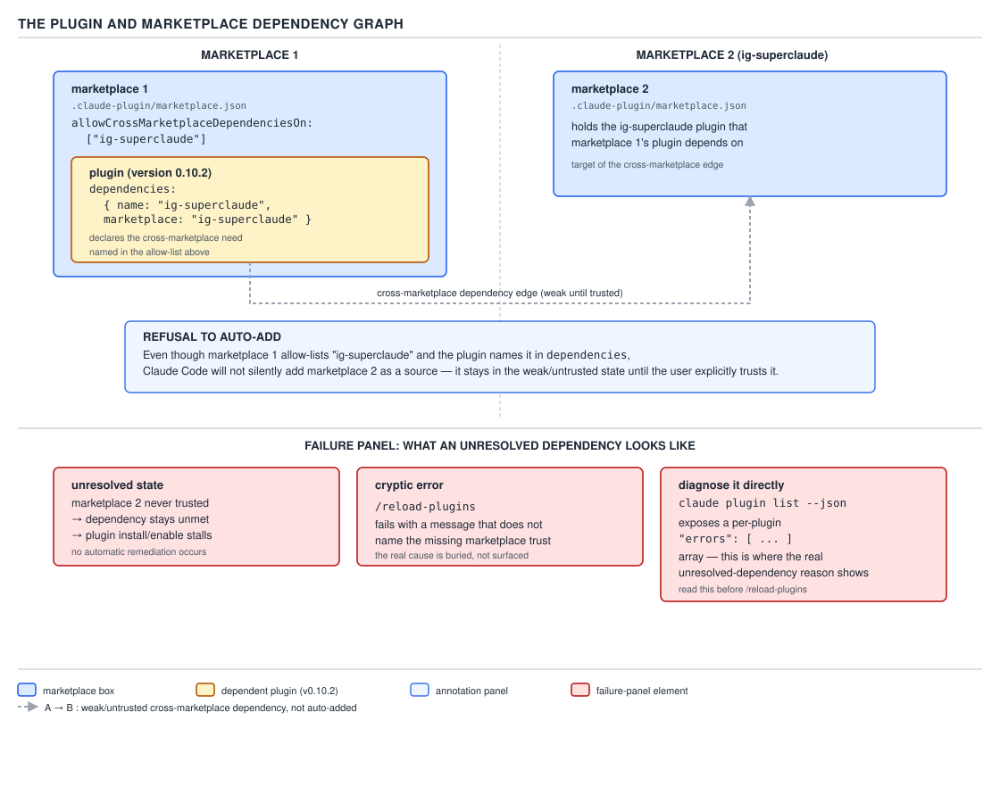

# 21 AI for Coding — marketplaces and cross-marketplace dependencies — INTERMEDIATE (§2.5.9–2.5.12)

**Target version: Claude Code v2.1.2xx (August 2026).** | **Part 2 of 6** | [Index](../00-index.md)
Previous: [namespacing and what a plugin contributes](02-namespacing-and-skills-dir.md) · Next: [plugin governance](04-governance.md)

The previous two files answered "what is a plugin, what does it contribute, how does it version and
namespace itself." This file answers the question that comes right after: **where does a plugin come
from, and what happens when the plugin you installed needs a second plugin that lives somewhere
else?** A marketplace is the catalog a plugin is installed from; a cross-marketplace dependency is one
plugin in one catalog declaring that it needs a plugin published in a different catalog. The mechanism
that governs the second case is the practically important half of this file, because it fails in a way
that gives almost no signal at the point of failure.

## §2.5.9 The marketplace manifest: `.claude-plugin/marketplace.json` `[DOC]`

**Mental model.** If `plugin.json` is a plugin's ID card, `marketplace.json` is the catalog binder
that ID card gets filed into. A marketplace is not a plugin itself — it carries no `skills/`, no
`hooks/`, no `agents/` of its own — it is a single JSON file that says "here is a list of plugins, and
here is where each one's source code actually lives."

**Why it exists.** `claude plugin install <name>` has to resolve a bare plugin name to an actual
source — a git subdirectory, a local path, a URL — without the user typing that source by hand every
time. A marketplace is the indirection layer that makes `claude plugin install sdlc-harness` work
without the caller knowing whether `sdlc-harness` is a GitHub subdirectory, a `git-subdir` checkout
pinned to a SHA, or a plain relative path.

**How it works.** The manifest lives at `.claude-plugin/marketplace.json` — the same `.claude-plugin/`
folder from D-58 in the first file of this set, and the same trap applies: nothing else belongs in
that folder alongside it. The schema, verified against the installed v2.1.251 binary and against
Anthropic's own published `claude-plugins-official` catalog:

| Field | Required? | Purpose |
|---|---|---|
| `$schema` | Optional | Points at Anthropic's marketplace JSON Schema for editor validation |
| `name` | Required | The marketplace's own identifier — what a user writes after the `@` when installing (`plugin@marketplace`) and what a plugin's `dependencies[].marketplace` field points at |
| `description` | Required | Shown when the marketplace is listed or browsed |
| `owner` | Required | An object, at minimum `{ "name": "..." }`; Anthropic's own also carries an `email` |
| `plugins` | Required | An array of plugin entries, each naming the plugin and where its source resolves |
| `allowCrossMarketplaceDependenciesOn` | Optional | An array of marketplace names this marketplace's plugins are permitted to declare a `dependencies[].marketplace` pointer into — §2.5.10 below |

**Code.** A complete, valid `marketplace.json` for a marketplace that publishes `sdlc-harness` and
pre-declares that its plugins may depend on the `ig-superclaude` marketplace:

```json
{
  "$schema": "https://anthropic.com/claude-code/marketplace.schema.json",
  "name": "sdlc-harness",
  "description": "The sdlc-harness marketplace — engineers add this via /plugin marketplace add to install the sdlc-harness plugin as a standalone product.",
  "owner": {
    "name": "IG Group"
  },
  "allowCrossMarketplaceDependenciesOn": ["ig-superclaude"],
  "plugins": [
    {
      "name": "sdlc-harness",
      "source": "./plugins/sdlc-harness",
      "description": "AI-SDLC harness — deterministic multi-agent workflows for running Claude agents across the software development lifecycle."
    }
  ]
}
```

Each entry in `plugins[]` needs at least `name` and a `source`; `source` can be a relative path (as
here, for a plugin that ships in the same repository as its marketplace), a `git-subdir` object with
its own `url`, `path`, `ref` and `sha` for a plugin hosted elsewhere, or a plain git URL. Anthropic's
own `claude-plugins-official` manifest uses the `git-subdir` form for nearly every entry, because the
plugin's code and the marketplace's catalog live in different repositories there.

**Gotcha.** `plugins[]` entries do not need `version` — that field belongs to the plugin's own
`plugin.json`, established in the previous file. A marketplace only routes to a source; it does not
duplicate the plugin's own metadata, and a marketplace author who copies `version` into the catalog
entry is maintaining a second, unread copy of a fact the plugin already owns.

> A marketplace is a `.claude-plugin/marketplace.json` catalog naming itself, its owner, and a
> `plugins[]` list of sources to resolve bare plugin names against; it optionally allow-lists other
> marketplaces its own plugins may declare a cross-marketplace dependency on.

## §2.5.10 Cross-marketplace dependencies and the refusal to auto-add `[DOC]`

**Mental model.** A plugin's `dependencies` field, introduced in the previous file's field table, can
point at a plugin published in a *different* marketplace from its own. That is a cross-marketplace
dependency, and it is exactly the situation `allowCrossMarketplaceDependenciesOn` exists to gate:
marketplace 1 has to explicitly say "my plugins are allowed to reach into marketplace 2," and even
then, Claude Code will not silently add marketplace 2 to the user's machine on the strength of that
allow-list alone.

**Why it exists.** Without a gate, installing one plugin from one marketplace could implicitly pull in
a second, entirely unrelated marketplace's catalog just because a `dependencies` entry named it —
which means the set of sources Claude Code trusts on your machine would grow by transitive closure of
whatever any installed plugin's author decided to depend on. The gate makes that expansion an explicit
two-part act: the *publishing* marketplace has to opt in via `allowCrossMarketplaceDependenciesOn`,
and the *installing user* still has to add the target marketplace themselves.

**How it works.** `sdlc-harness` (marketplace 1 above) allow-lists `ig-superclaude`. Its plugin then
declares the dependency in its own `plugin.json`:

```json
{
  "name": "sdlc-harness",
  "description": "AI-SDLC harness for running Claude agents across the software development lifecycle.",
  "version": "0.10.2",
  "dependencies": [
    {
      "name": "ig-superclaude",
      "marketplace": "ig-superclaude"
    }
  ]
}
```

Both conditions — the allow-list entry and the `dependencies` entry naming a marketplace that appears
in it — are necessary, but neither is sufficient to make the dependency resolve automatically.
**Claude Code refuses to auto-add a marketplace the user has not explicitly trusted.** Installing
`sdlc-harness` does not silently register `ig-superclaude` as a marketplace on the user's machine, even
though `sdlc-harness`'s own manifest says it is allowed to depend on it. Onboarding documentation for a
plugin with a cross-marketplace dependency has to instruct the user to add **both** marketplaces:

```bash
claude plugin marketplace add ig-group/sdlc-harness
claude plugin marketplace add ig-group/ig-superclaude-framework
claude plugin install sdlc-harness@sdlc-harness
```

Until the second `marketplace add` runs, the dependency edge stays in the weak, untrusted state D-59
below draws it in.



**D-59** — The plugin and marketplace dependency graph. The crossing edge stays weak until the user
explicitly trusts the other marketplace.

**Insight.** This is the same trust pattern the reader has already met twice, restated for a third
kind of content boundary. Workspace trust (§1.4.32) gates whether a repository's own `.claude/`
settings get to exercise their `allow` rules on this machine at all — a cloned repo's permission rules
do not take effect until the user has trusted that workspace. An external `@path` import (§1.3.9)
triggers a one-time approval prompt before Claude Code will pull in content from outside the current
file tree. `allowCrossMarketplaceDependenciesOn` is the same law applied to marketplaces: **content
declaring authority over what runs on your machine does not gain that authority just because something
you already trust points at it — a human has to extend trust explicitly, every time the boundary
being crossed is a new one.** The allow-list narrows *which* marketplaces a dependency edge is even
allowed to name; the user's own `marketplace add` is the actual grant of trust, and the harness will
not perform that second step on the user's behalf no matter how the first step is configured.

**Gotcha.** What refusing to auto-add buys you is a fixed, auditable set of trusted sources: the list
of marketplaces on a machine only grows when a human runs `claude plugin marketplace add`, never as a
side effect of `claude plugin install`. The cost is exactly the failure mode the next section walks
through — a dependency that looks like it should just work, because both halves of the *permission* to
depend are in place, but does not, because the *trust* to fetch from is a separate and unmet
condition.

## §2.5.11 The unresolved dependency: a cryptic error and the diagnostic that actually explains it `[TRAP]` `[DOC]`

**Mental model.** An unresolved cross-marketplace dependency does not fail loudly. Install succeeds.
The plugin appears enabled. Nothing in the ordinary flow of using Claude Code points at the missing
marketplace as the cause of whatever goes wrong next — which, per the invariant carried since §1.1.9,
means the actual cause is sitting in a file or a field the reader has not looked at yet, and there is a
diagnostic command whose entire job is to name it.

**Why it exists — or rather, why the failure is this shape.** The install step for `sdlc-harness`
above only has to resolve *its own* source; it does not have to resolve every dependency before it
will let the plugin register as installed, because doing otherwise would mean one missing dependency
blocks the whole plugin from ever appearing at all, including in diagnostic tooling. So the harness
installs the plugin, records that a dependency is unmet, and defers the failure to whatever later
moment actually needs that dependency's content — which is exactly when the "nearly silent" gotcha in
the leaf's own wording bites.

**How it works.** Reproduced directly against the installed v2.1.251 binary: adding the `sdlc-harness`
marketplace and installing its plugin **without** first adding `ig-superclaude` succeeds at the
install step —

```bash
claude plugin marketplace add ig-group/sdlc-harness
claude plugin install sdlc-harness@sdlc-harness -y
```

```text
Adding marketplace…✔ Successfully added marketplace: sdlc-harness
Installing plugin "sdlc-harness@sdlc-harness"...✔ Successfully installed plugin: sdlc-harness@sdlc-harness (scope: local)
```

— and gives no indication that anything is wrong. The reader's next move, on seeing a plugin behave as
if half of it is missing, is very often `/reload-plugins`, and that command's failure is exactly the
kind D-59's failure panel names: a generic reload error that does not itself say "marketplace
`ig-superclaude` was never added." **Unverified:** the precise text `/reload-plugins` prints for this
case — it only runs inside an interactive session (`claude -p "/reload-plugins"` returns `"/reload-
plugins isn't available in this environment."` rather than exercising the command), so the exact
cryptic wording could not be captured non-interactively for this file; recorded in Open questions.

What **is** directly verified is the diagnostic that actually explains the failure. `claude plugin
list --json` carries a per-plugin `errors` array, and this array is where the real cause of the
unresolved-dependency state shows up:

```json
[
  {
    "id": "sdlc-harness@sdlc-harness",
    "version": "0.10.2",
    "scope": "local",
    "enabled": true,
    "installPath": "/Users/rajat.chikkodikar/.claude/plugins/cache/sdlc-harness/sdlc-harness/0.10.2",
    "installedAt": "2026-08-29T19:05:08.386Z",
    "lastUpdated": "2026-08-29T19:05:08.386Z",
    "projectPath": "/Users/rajat.chikkodikar/Desktop/My-files/rough",
    "errors": [
      "Dependency \"ig-superclaude@ig-superclaude\" is not installed — run `claude plugin install ig-superclaude@ig-superclaude`, or check that its marketplace is added"
    ]
  }
]
```

That `errors` array is only present on the plugin object that actually has a problem — a healthy
install has no `errors` key at all, rather than an empty array — and the message names the exact
missing plugin identifier, the exact command that would install it, and the actual root cause ("check
that its marketplace is added") in one line. This is the same shape the reader should now expect from
every "surprised by behaviour" moment in this topic: a diagnostic command exists, it names the file or
field responsible, and reading it first is strictly faster than guessing from symptoms.

**Pitfall:** the wrong belief is that a plugin either installs cleanly or fails outright, so a
successfully-reported install means every one of its dependencies is satisfied. The symptom is a
plugin that shows as `enabled: true`, causes no install-time error, and then behaves as if a piece of
it is missing — and the reader's first instinct, running `/reload-plugins`, produces a message that
does not name the actual cause. The fix is to run `claude plugin list --json` and read that specific
plugin's `errors` array before doing anything else; it is the one place the harness actually states
which dependency is unmet and what command would fix it. **Why people believe it:** every other
manifest error covered so far in this plugin set — a malformed `plugin.json`, a misplaced
`.claude-plugin/` sibling — either fails install outright or is silently ignored with no partial state
in between, so "installed means complete" is a reasonable generalization right up until a dependency
crosses a marketplace boundary.

> An unresolved cross-marketplace dependency does not block install and does not surface at
> `/reload-plugins` with a clear cause; `claude plugin list --json`'s per-plugin `errors` array is the
> diagnostic that actually names the missing marketplace and the fix.

## §2.5.12 The command surface: `/plugin`, marketplaces, and the two session-only flags `[DOC]`

**Mental model.** Everything above is configuration a marketplace or a plugin author writes once. This
section is the commands a *user* runs, sorted by whether they change what is registered on the machine
permanently or only for the current session.

**How it works — verified against `claude plugin --help`, `claude plugin marketplace --help`, and the
`plugins` documentation page on the installed v2.1.251 binary:**

| Command | Scope | What it does |
|---|---|---|
| `/plugin` | Interactive session | Opens the plugin manager UI — browse, install, and an **Errors** tab that surfaces load failures (a failed LSP server, a `--plugin-url` fetch that failed) |
| `claude plugin marketplace add <source>` | Persistent | Registers a marketplace from a URL, a local path, or a `owner/repo` GitHub shorthand; `--scope user\|project\|local` controls where it is declared, `--sparse <paths...>` limits the checkout for a monorepo |
| `claude plugin install <plugin>` (`i`) | Persistent | Installs from a registered marketplace; `plugin@marketplace` disambiguates when more than one marketplace publishes the same name; `--scope user\|project\|local` (default `user`); `-y`/`--yes` skips the confirmation prompt for a plugin that runs a command during install |
| `/reload-plugins` | Interactive session | Reloads plugins, skills, agents, hooks, plugin MCP servers, and plugin LSP servers without restarting the session — the command to run after editing a plugin you are developing, or after a dependency install |
| `claude plugin init\|new <name>` | Persistent (skills-dir) | Scaffolds a plugin at `~/.claude/skills/<name>/`; auto-loads next session as `<name>@skills-dir` with no marketplace or install step |
| `claude plugin validate <path>` | One-off check | Validates a plugin or marketplace manifest, or the skills, agents, and commands in a directory; prints `✔ Validation passed` or `✔ Validation passed with warnings`; `--strict` treats warnings as failures |
| `claude plugin list` | One-off check | Lists installed plugins; `--json` for machine-readable output including the `errors` array from §2.5.11; `--available` (requires `--json`) additionally lists plugins available from registered marketplaces but not yet installed |
| `--plugin-dir <path\|.zip>` | Session-only | Loads a plugin directly from a directory or a `.zip` archive for the current session, bypassing install and marketplace entirely; repeatable for multiple plugins; a same-named local copy takes precedence over an installed marketplace plugin for that session (except a plugin managed settings force-enables or force-disables) |
| `--plugin-url <url>` | Session-only | Fetches a plugin `.zip` archive from a URL at startup, for the current session only; repeatable, or space-separated inside one quoted value; a failed fetch or an invalid archive is recorded as a load error reviewable in `/plugin`'s Errors tab rather than aborting the session |

**Code.** The two session-only flags exist specifically so a plugin under development, or a CI-built
archive, never has to touch a marketplace to be tried:

```bash
claude --plugin-dir ./sdlc-harness --plugin-dir ./readonly-reviewer
```

```bash
claude --plugin-url "https://example.com/mvn-test-runner.zip https://example.com/readonly-reviewer.zip"
```

Neither invocation registers anything persistent — closing the session and starting a new one without
the flag drops the plugin entirely, which is exactly the property that makes them safe for trying an
untrusted or in-progress build without extending any of the marketplace trust discussed in §2.5.10.

**Gotcha.** `claude plugin install` resolves against *registered* marketplaces only — it has no
knowledge of a marketplace that merely allow-lists a name in
`allowCrossMarketplaceDependenciesOn`. Running `claude plugin install ig-superclaude@ig-superclaude`
still fails with "marketplace not found" until `claude plugin marketplace add` has been run for it
first; the allow-list in §2.5.10 changes what a *dependency* is permitted to name, not what the
`install` command is able to resolve on its own.

## Pitfalls

- **Belief:** allow-listing a marketplace in `allowCrossMarketplaceDependenciesOn` and naming it in a
  plugin's `dependencies` is enough for the dependency to resolve on install. **Surprising outcome:**
  install succeeds, the plugin reports `enabled: true`, and the dependency stays unmet with no
  install-time error. **What actually gets the guarantee:** the user must separately run `claude
  plugin marketplace add` for the target marketplace — Claude Code will not auto-add it no matter how
  the allow-list and `dependencies` are configured. **Why people believe it:** the allow-list reads
  like a permission grant, and it is easy to conflate "permitted to depend on" with "will fetch from."
- **Belief:** a plugin either installs cleanly or fails outright, so a clean install report means every
  dependency is satisfied. **Surprising outcome:** the plugin behaves as if part of it is missing, and
  `/reload-plugins` fails with a message that does not name the actual cause. **What actually gets the
  guarantee:** run `claude plugin list --json` and read that plugin's `errors` array — it names the
  missing dependency and the exact install command that fixes it. **Why people believe it:** every
  other manifest failure in this plugin set fails loudly or is silently ignored outright; a *partial*
  install state with a deferred, hidden error is the exception, not the rule.

## Cheat sheet

| Question | Answer |
|---|---|
| `marketplace.json` required fields | `name`, `description`, `owner`, `plugins` |
| `marketplace.json` optional fields covered here | `$schema`, `allowCrossMarketplaceDependenciesOn` |
| What a `plugins[]` entry needs at minimum | `name`, `source` |
| What gates a cross-marketplace `dependencies` entry | Target marketplace listed in `allowCrossMarketplaceDependenciesOn` of the publishing marketplace |
| Does the allow-list auto-add the target marketplace | No — the user must run `claude plugin marketplace add` for it separately |
| Diagnostic for an unresolved dependency | `claude plugin list --json` → per-plugin `errors` array |
| Does a healthy plugin have an `errors` key | No — the key is absent, not an empty array |
| Persistent marketplace commands | `claude plugin marketplace add\|list\|remove\|update` |
| Persistent install command | `claude plugin install <plugin>[@marketplace]` |
| Session-only plugin loading | `--plugin-dir <path\|.zip>`, `--plugin-url <url>` (repeatable) |
| Reload without restart | `/reload-plugins` |
| One-off manifest check | `claude plugin validate <path>` (`--strict` promotes warnings to errors) |
| Skills-dir plugin scaffold | `claude plugin init <name>` → `~/.claude/skills/<name>/`, loads as `<name>@skills-dir` |

## Self-test

1. What are the four required fields in `marketplace.json`, and what does `allowCrossMarketplaceDependenciesOn` add on top of them?
<details><summary>Answer</summary>
`name`, `description`, `owner`, and `plugins`. `allowCrossMarketplaceDependenciesOn` is optional and
names other marketplaces this marketplace's own plugins are permitted to declare a
`dependencies[].marketplace` pointer into.
</details>

2. A plugin's `dependencies` field names a marketplace that its own marketplace's
   `allowCrossMarketplaceDependenciesOn` lists. Does installing the plugin automatically add that
   target marketplace?
<details><summary>Answer</summary>
No. The allow-list only permits the dependency to be *declared*; Claude Code refuses to auto-add a
marketplace the user has not explicitly trusted. The user must run `claude plugin marketplace add`
for the target marketplace separately, and onboarding for such a plugin must instruct adding both.
</details>

3. Name the two other places in this topic that use the same trust pattern as
   `allowCrossMarketplaceDependenciesOn`, and state the one law all three share.
<details><summary>Answer</summary>
Workspace trust gating a cloned repository's `allow` rules (§1.4.32), and the one-time approval prompt
for an external `@path` import (§1.3.9). The shared law: content from somewhere else does not silently
gain authority over what runs on your machine — a human has to extend trust explicitly, every time a
new boundary is crossed.
</details>

4. You install a plugin with an unresolved cross-marketplace dependency. `claude plugin install`
   reports success. What is the fastest way to find out what is actually wrong, and what does it tell
   you?
<details><summary>Answer</summary>
`claude plugin list --json`. The affected plugin carries an `errors` array naming the exact unmet
dependency (`"<plugin>@<marketplace>" is not installed`) and the exact command to fix it — faster and
more precise than `/reload-plugins`, which fails without naming the actual cause.
</details>

5. Does a plugin with no problems show an empty `errors` array in `claude plugin list --json`?
<details><summary>Answer</summary>
No. A healthy plugin object has no `errors` key at all; the key's presence, not its emptiness, is what
signals a problem.
</details>

6. What is the difference in persistence between `claude plugin install` and `--plugin-dir`?
<details><summary>Answer</summary>
`claude plugin install` registers the plugin persistently at the chosen scope (`user`, `project`, or
`local`) so it loads on future sessions. `--plugin-dir` (like `--plugin-url`) loads the plugin only for
the current session; it is not written to any settings file and disappears the next time Claude Code
starts without the flag.
</details>

7. `claude plugin install ig-superclaude@ig-superclaude` fails with "marketplace not found" even
   though `sdlc-harness`'s manifest allow-lists `ig-superclaude`. Why?
<details><summary>Answer</summary>
`claude plugin install` resolves only against marketplaces registered on this machine via `claude
plugin marketplace add`. An allow-list entry in another marketplace's manifest changes what a
*dependency* is permitted to name; it does not register the target marketplace for `install` to
resolve against.
</details>

## Open questions

- **Unverified:** the exact text `/reload-plugins` prints when it fails against an unresolved
  cross-marketplace dependency. The command only runs inside an interactive session — `claude -p
  "/reload-plugins"` returns `"/reload-plugins isn't available in this environment."` instead of
  exercising the real code path — so the precise cryptic wording could not be captured
  non-interactively for this file. The mechanism it fails to explain (the missing marketplace trust)
  is independently confirmed via the `errors` array in §2.5.11.

---

**Leaves covered:** 2.5.9–2.5.12 (4 leaves)
**Leaves deferred:** none
**Diagrams included:** D-59
**Target version:** Claude Code v2.1.2xx (August 2026)
**Lines:** 386
