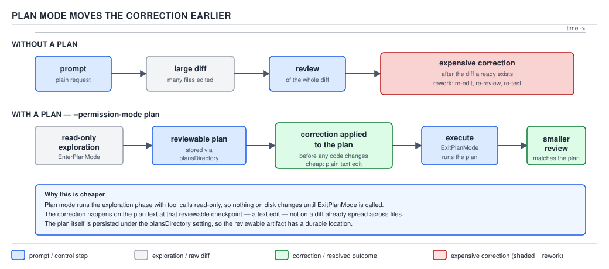

# 21 AI for Coding — plan mode, test-first and small tasks — INTERMEDIATE (§2.7.1–2.7.4)

**Target version: Claude Code v2.1.2xx (August 2026).** | **Part 2 of 6** | [Index](../00-index.md)
Previous: [isolation arithmetic](../context-economy/03-isolation-arithmetic.md) · Next: [prompting and giving the agent what it needs](02-prompting-and-context.md)

The previous file in this area was about where you put work — a subagent's isolated context versus
the main session. This file is about *when* you let the agent commit to an approach at all. Three
practices, one underlying argument: the cheapest place to catch a wrong idea is before it becomes
code, the cheapest way to know code is right is a test that can say so without asking the model, and
the cheapest unit to review is the smallest one that still means something on its own.

## 1. Plan mode as a first-class step

**Mental model.** A `default`/manual session is the agent driving with its hands already on the
wheel — every tool call it proposes is a step toward a diff sitting in your working tree, and you
approve or deny each one as it comes. Plan mode is the agent sitting in the passenger seat with a map
first: it can look at anything (read files, run read-only shell commands) but it is physically
prevented from touching the vehicle. It hands you a route before you start driving.

**Why it exists.** Left to `default` mode, an agent working a change of any size interleaves
exploration and editing in the same turn sequence: read three files, edit one, read two more, edit
another. By the time you see a "done" message, the edits already exist in your working tree, and any
correction you make is a correction *to committed work* — you are asking the agent to undo or amend
files it has already changed. Plan mode separates the two phases on purpose: an entire exploration
pass happens with **zero write access**, and the artefact you review is prose, not a diff.

**How it works.** `plan` is one of Claude Code's six permission modes — `default` (aliased
`manual`), `acceptEdits`, `plan`, `auto`, `dontAsk`, `bypassPermissions` — set per session with
`--permission-mode plan` on the CLI, or as the session default via `defaultMode` in a settings file.
Quoting the **permissions** documentation page directly:

> `plan` — Claude reads files and runs read-only shell commands to explore but doesn't edit your
> source files; with auto mode available, classifier-approved commands also run. Labeled Plan in the
> CLI and the VS Code extension.

Internally, the model reaches for two tools to move through this phase: it calls `EnterPlanMode` to
signal that it is switching into exploration-and-propose behaviour, does its read-only work, then
calls `ExitPlanMode` with the plan text as the payload — that call is what the harness intercepts and
shows you as the plan to approve, reject, or send back with feedback. **Insight:** the harness, not
the model, decides whether `ExitPlanMode`'s proposed plan actually unblocks editing — approving it is
what flips the session (for that turn onward) out of the read-only constraint, the same
harness-not-model enforcement that governs every other permission decision in this guide.

Where the plan text itself is written is configurable: **`plansDirectory`**, documented on the
**settings-reference** page as "Choose where plan mode writes plan files," scoped to any settings
file (`~/.claude/settings.json`, project `.claude/settings.json`, `.claude/settings.local.json`, or
managed settings) — so an organization can force plans into a reviewable, checked-in location rather
than leaving them wherever a developer's session happens to drop them. **Unverified:** the
settings-reference page does not state what directory `plansDirectory` defaults to when the key is
absent; treat "unset" as "wherever the currently installed binary's built-in default is" rather than
assuming a specific path — recorded below in Open questions.



**D-64** — Plan mode moves the correction earlier. The shaded rework is what the plan buys you.

The two lanes in D-64 are the two ways this session could have gone. Without a plan: prompt, a large
diff appears, you review it, you find the problem, and the correction happens *after the diff
exists* — everything from "review" onward, shaded, is rework. With a plan: read-only exploration
produces a reviewable plan, you correct the plan directly, *then* the agent executes against the
corrected plan, and the review at the end is smaller because the mistake never made it into code.

```bash
claude --permission-mode plan \
  "Add a cursor-based pagination parameter to the report export endpoint. \
Read the current handler and its tests before proposing anything."
```

Every flag here matters: `--permission-mode plan` is what forces the read-only constraint for the
whole session rather than trusting the prompt to ask nicely for it, and the prompt itself is written
to invite exploration ("read... before proposing") because a plan built without reading the existing
handler is a plan built on guesses.

To make `plan` the default for a whole team rather than something each developer has to remember to
type, set it in a checked-in project settings file:

```json
{
  "defaultMode": "plan",
  "plansDirectory": ".claude/plans",
  "permissions": {
    "allow": [
      "Read",
      "Grep",
      "Glob"
    ]
  }
}
```

This is a complete, valid `.claude/settings.json` — `defaultMode` makes every session in this
repository start in plan mode, `plansDirectory` checks the written plans into a predictable, greppable
location instead of scattering them, and the `permissions.allow` list is redundant with what plan mode
already grants but documents the intent for a reader who has not memorized the mode table.

**Gotcha.** Plan mode restricts *editing*, not *shell execution* uniformly. The built-in read-only
commands (`cat`, `ls`, `grep`, and similar) still run without prompting inside plan mode, exactly as
they would outside it — but any other shell command still goes through the regular ask flow while you
are planning, it is not silently blocked and it is not silently allowed. **Version trap:** before
v2.1.212, enabling the sandbox's `autoAllowBashIfSandboxed` behaviour let sandboxed Bash commands run
without prompting even inside plan mode, on the theory that the sandbox boundary was itself the
safety check; from v2.1.212 onward, plan mode explicitly **skips** that substitution, so a sandboxed
but non-read-only shell command still prompts you while you are still in the exploration phase. A
reader who learned plan mode on an older build and assumes "sandboxed means silent even in plan mode"
will be surprised the first time a sandboxed `mvn test` still asks for approval mid-plan.

> Plan mode is a permission mode that grants read-only exploration and withholds every edit until you
> approve a proposed plan, moving the point where a mistake is caught from after the diff to before
> it.

## 2. Why a plan beats a better prompt: the correction moves earlier

**Mental model.** A better prompt reduces the *chance* the agent goes down the wrong path. A plan
reduces the *cost* of the agent having gone down the wrong path anyway, because you catch it before
it is expressed as 900 lines of Java rather than after. These are not competing techniques — write
the better prompt too — but only one of them changes what a mistake costs once one happens, and
mistakes happen at a rate no prompt drives to zero.

**Why it exists.** A prompt is a single shot at steering a stochastic process (§0.1.2: the model
samples from a distribution, it does not compute a guaranteed answer). No matter how well specified
the prompt is, there is a nonzero chance the agent picks an approach you would have rejected — the
wrong table to add the cursor column to, a `Serializable` cursor token where you wanted a plain
Base64 string, a retry loop where you wanted a single attempt with a clear failure. The question this
practice answers is not "how do I make that probability zero" — you cannot — but "given that it will
sometimes happen, where do I want to be standing when it does."

**How it works — the arithmetic.** Take the two lanes in D-64 and cost them, with a stated
assumption up front: this is an illustrative estimate to make the *shape* of the argument concrete,
not a documented token-per-line constant from Anthropic — treat the constants below as "on this
order," not as a benchmark.

Assume typical Java-shaped diff text tokenizes at roughly 9 tokens per line (identifiers, braces,
generics, and punctuation push code above plain-English prose, which runs closer to 12–15 tokens per
line for short lines but averages lower per character on longer ones; 9 is a reasonable middle
estimate for a mixed diff of production code and test code).

**Lane 1 — no plan, correction after the diff:**

| Step | Tokens |
|---|---|
| Agent writes the 900-line diff | 900 × 9 ≈ 8,100 (generated, billed as output) |
| You review it, find the wrong approach, describe the fix | ≈ 200 (your turn, billed as output on your side of the API but small) |
| Because the whole conversation resends every turn (§0.2.1: the context window is the argument list of the *next* call, not a memory), the 8,100-token diff is resent as input on every subsequent turn until it either leaves the window or the session compacts | 8,100 × 2 more turns before it is fixed ≈ 16,200 (resent as input) |
| Agent regenerates a corrected diff of similar size | ≈ 8,100 (generated again) |
| **Total** | **≈ 32,400 tokens**, two extra round trips, one discarded diff |

**Lane 2 — plan first, correction to the plan:**

| Step | Tokens |
|---|---|
| Agent writes a ~50-line plan at ~12 tokens/line | ≈ 600 (generated) |
| You correct one paragraph of the plan | ≈ 150 (your turn) |
| Agent executes the corrected plan directly into the 900-line diff, once | 900 × 9 ≈ 8,100 (generated, same cost either way — the code has to be written regardless) |
| **Total additional cost of the correction itself** (excluding the diff you'd pay for either way) | **≈ 750 tokens, one extra round trip** |

The diff-generation cost is identical in both lanes — you always pay to write the 900 lines once they
are right. What plan mode buys you is not writing the code more cheaply; it is **not paying twice to
write it**, and not re-paying to re-read the wrong version on every turn in between. Roughly 32,400
tokens of rework collapses to roughly 750 tokens of plan correction — on the order of 40× on this
illustrative shape, and the gap widens, not narrows, as the diff gets bigger, because the wasted
generation and the wasted re-reading both scale with diff size while the plan-correction cost does
not.

**No separate diagram for this leaf:** D-64, embedded under §1 above, already sets out both lanes;
re-embedding it here would duplicate the same picture for the same argument.

**Code:** the artefact for this concept is the same `claude --permission-mode plan` invocation shown
in §1 — the economic argument is a property of *when* the correction happens, not a different command
line.

**Gotcha — what plan mode costs.** This argument is not "plan mode is free, always use it." Plan
mode has a real cost of its own: it is **always at least one extra round trip** — read, propose, wait
for your approval — even on the change that would have gone fine without it, and the plan is only
worth that round trip if you actually **read** it. A plan approved with a reflexive "looks good,
proceed" without being read is pure overhead: you paid the extra turn and got none of the earlier
correction, because the correction only happens if a human eye catches the wrong table or the wrong
serialization choice while it is still a paragraph. Reserve plan mode for the changes where being
wrong is expensive — cross-cutting refactors, anything touching a persisted schema, anything larger
than a handful of files — and let `acceptEdits` handle the small, low-consequence edits where the
round trip costs more than the correction it would occasionally catch.

> Plan mode is worth its extra round trip exactly when the cost of a wrong diff, discovered late,
> exceeds the cost of reading a plan, checked early — which is a property of the change's blast
> radius, not a rule to apply uniformly.

## 3. Test-first: a failing test is a specification a machine can check

**Mental model.** Asking the agent "does this work?" and accepting its prose answer is asking the
generator to grade itself. Asking `mvn test` "does this work?" is asking something that cannot be
talked into a wrong answer by a plausible-sounding sentence. Test-first with an agent means writing
the check *before* the thing it checks exists, so "done" has a definition that does not route through
the model's own opinion of its work.

**Why it exists.** §0.1.8 established **confabulation**: the model produces a wrong answer with
*exactly the same fluency, grammar, and confident tone* as a right one, because both are generated by
the identical token-by-token sampling process — fluency carries zero information about correctness.
That fact has a direct, practical consequence here. If you ask an agent "did you finish the
pagination cursor correctly?" its "yes, it handles the edge cases" is generated the same way whether
it is true or not — you cannot use the model's confidence as your correctness signal. A failing test,
by contrast, is not generated by the model at all once it is written; it is executed by the JVM, and
the JVM does not confabulate. It is a **machine-checkable specification**: a claim about behaviour
that something other than the thing being graded gets to verify.

**How it works.** The loop is: write the test first, run it and confirm it fails (this step matters —
a test that "passes" before the implementation exists is checking nothing), implement until it
passes, then stop. The agent is never asked to self-report success; it is asked to make a concrete,
externally-run check go from red to green, and the check was written before the implementation could
bias what it asserts.

```java
class CursorPaginationTest {

    private final ReportExportService service = new ReportExportService(new InMemoryReportRepository());

    @Test
    void secondPageStartsAfterTheLastRowOfTheFirstPage() {
        var firstPage = service.exportPage(new PageRequest(null, 2));
        assertThat(firstPage.rows()).hasSize(2);

        var secondPage = service.exportPage(new PageRequest(firstPage.nextCursor(), 2));

        assertThat(secondPage.rows())
            .extracting(ReportRow::rowId)
            .doesNotContainAnyElementsOf(
                firstPage.rows().stream().map(ReportRow::rowId).toList());
    }

    @Test
    void exhaustedCursorReturnsAnEmptyFinalPageRatherThanRepeatingRows() {
        var lastRow = service.exportPage(new PageRequest(null, Integer.MAX_VALUE))
            .rows()
            .getLast();

        var afterLast = service.exportPage(new PageRequest(Cursor.after(lastRow.rowId()), 2));

        assertThat(afterLast.rows()).isEmpty();
        assertThat(afterLast.nextCursor()).isNull();
    }
}
```

Both tests are written and run — and confirmed **red**, because `ReportExportService` does not exist
yet — before the agent is told to implement it. The second test in particular encodes a requirement
("no repeated rows once the cursor is exhausted") that is easy to state in a sentence and easy for a
generated implementation to silently violate; a test catches it, a prose "looks correct" review often
does not.

**Pitfall:** a test-first workflow only works if the test can actually fail against a wrong
implementation. The wrong belief is "I asked it to write a test first, so I'm covered." The symptom
is an agent producing `assertTrue(true)`, or a test built by first writing the implementation and then
deriving assertions from whatever that implementation happens to return — a test that passes against
any implementation, correct or not, because it was never run red. The fix: require the run-and-observe-
red step as part of the workflow, not just the file's existence, and read the test's assertions
yourself before accepting the implementation that makes them pass — a test-shaped file is not the
same guarantee as a test that can fail.

**No diagram for this leaf:** the manifest assigns D-64 to §2.7.1–2.7.2; test-first has no diagram of
its own in this file's set.

This is one fact seen from two ends: §0.1.8 says fluency proves nothing about a model's *claims*; this
leaf says a failing test is what you check *instead of* the claim. For the craft of writing good
tests — the pyramid, what a passing suite does and does not tell you, JUnit 5 patterns beyond this one
example — see [`16-testing.md`](../../../../topics/16-testing.md); this file only owes you the
connection to why test-first matters specifically when the thing writing the code cannot be trusted to
grade itself. §4.7.4, later in this guide, builds a verification harness that generalizes this same
idea past a single JUnit test into an automated pass/fail gate around an agent's whole task.

> Test-first turns "is this correct?" from a question the model answers about itself into a question
> a test runner answers about the code, which is the only form of that question a confabulating writer
> cannot talk its way around.

## 4. Small diffs and reviewability

**Mental model.** A 900-line pull request and nine 100-line pull requests contain the same code, but
only one of those shapes gets a review that actually catches something — a human reviewer's attention
degrades across a diff long before the diff runs out of lines. The same degradation applies to a task
you hand an agent: a single sprawling instruction covering five unrelated changes produces a diff no
one, including the agent's own self-review, inspects carefully end to end.

**Why it exists.** The argument is identical to the one that already governs code review and is not
special to agents: a reviewer (human or the "read your own diff before submitting" step some agents
run) can hold a small, coherent change in working memory and check it against intent; a large,
multi-concern change forces either skimming or hours of review, and skimming is where regressions get
through. Handing an agent a small, single-concern task — "add the cursor parameter to this one
endpoint," not "modernize the reporting module" — produces a diff sized for the same reviewing
attention span a small PR gets.

**How it works.** Smallness alone does not guarantee isolation between tasks running concurrently,
which is where **worktree isolation** earns its place as the mechanism rather than just a convention.
A `git worktree` gives each task its own working directory and branch, checked out from the same
repository, so two small agent tasks running at the same time cannot stomp each other's uncommitted
files even though they share one `.git`. `sdlc-harness`'s own engine takes exactly this position, in
its own words:

```
8. **Per-story git worktree** (branch `harness/<slug>`) under the gitignored scratch dir.
   The engine never mutates the engineer's checkout; parallel runs can't race. Teardown
   via `git worktree remove`/`prune`, never `rm -rf`.
```

— `docs/adr/0016-deterministic-stateless-workflow-engine.md`, decision point 8 (path
repo-relative to the sdlc-harness root). The design property this protects is that the *engineer's
own checkout* stays untouched no matter how many story-sized tasks the harness runs, and that two
concurrent per-story runs cannot race on the same files; without a dedicated worktree per task, two
small tasks running against the same working directory would be exactly the failure mode small tasks
are supposed to avoid — one task's half-finished edit becomes the input another task reads.

```bash
git worktree add ../work/harness/report-pagination -b harness/report-pagination
claude --permission-mode acceptEdits --cwd ../work/harness/report-pagination \
  "Add cursor-based pagination to the report export endpoint. \
Scope: this endpoint only. Do not touch the CSV export path."
git worktree remove ../work/harness/report-pagination
```

The `--cwd` flag points the session at the worktree rather than the main checkout, the prompt states
the scope boundary explicitly ("this endpoint only... do not touch") because a worktree isolates
*files on disk*, not *the model's willingness to wander*, and `git worktree remove` tears the isolated
copy down once the branch has been reviewed and merged or discarded.

| Task shape | Typical diff size | Reviewer attention | Worktree needed? |
|---|---|---|---|
| Single endpoint, one concern | tens of lines | full, catches logic errors | optional — low collision risk even in the shared checkout |
| One story, several files, one feature | hundreds of lines | partial — reviewer checks the parts they know | yes, if any other task might run concurrently |
| "Modernize the reporting module" | thousands of lines, cross-cutting | skimmed at best | isolation does not fix this — the task itself needs splitting first |

**Gotcha.** Worktree isolation prevents two tasks from **colliding on disk**; it does nothing to
prevent one task from being **too large to review**, and the two problems look similar from the
outside because both eventually show up as "the diff was hard to trust." A worktree around a
five-concern prompt still produces a five-concern diff — isolation is necessary once you run tasks
concurrently, but it is not a substitute for actually keeping each task small.

For the review discipline itself — what makes a commit and a diff reviewable, rebase and bisect as the
tools that keep history small and legible — see
[`17-git-craft.md`](../../../../topics/17-git-craft.md); this file only owes you the mechanism that
makes concurrent small tasks safe. §3.7, later in this guide, walks an incident that turns on exactly
this per-story worktree: a `--setting-sources project` resolution against the worktree silently
dropped an entire permission block, which is a failure mode that only exists because the isolation
mechanism itself has settings-resolution edges worth knowing before you rely on it.

> A small, single-concern task keeps a diff reviewable the same way a small PR does; a git worktree
> per task keeps concurrent small tasks from corrupting each other's working directory, which is a
> different guarantee that reviewability alone does not provide.

## Pitfalls

- **Belief:** "plan mode means nothing can go wrong until I approve." **What actually happens:**
  plan mode blocks *edits*, not every shell command — a non-read-only command you didn't expect can
  still prompt you mid-plan, and if you are auto-approving prompts out of habit you can approve a
  side-effecting command while still "just planning." **What gets the guarantee:** read the exact
  wording — plan mode restricts writes to your source files, not shell execution as a category — and
  keep an eye on what you're approving even inside a plan session. **Why people believe it:** the mode
  is named and marketed around "nothing gets edited," which is true for files but silently narrower
  than "nothing happens."
- **Belief:** "I asked for a test first, so the implementation is verified." **What actually
  happens:** a test written to accompany code the model already wrote, or a test with no real
  assertion, passes regardless of correctness — the red step never ran. **What gets the guarantee:**
  require and observe the test failing against nothing (or against a stub) before implementation
  starts, and read what the test actually asserts. **Why people believe it:** "test-first" is
  evaluated by the file's existence rather than by whether the file was ever run red, and a green
  suite looks identical either way.
- **Belief:** "the task runs in its own worktree, so it's safe to hand it a broad, multi-concern
  prompt." **What actually happens:** isolation prevents file collisions between *concurrent* tasks;
  it does not shrink a five-concern diff into something a reviewer can hold in their head. **What
  gets the guarantee:** scope the prompt to one concern regardless of whether a worktree is in play;
  use the worktree for concurrency safety and small prompts for reviewability — they are two separate
  levers. **Why people believe it:** both problems present as "the diff was hard to trust," so fixing
  one feels like it should have fixed the other.

## Cheat sheet

| Practice | Command / setting | What it buys | What it costs |
|---|---|---|---|
| Plan mode | `--permission-mode plan`, `defaultMode: "plan"` | catches a wrong approach as a paragraph, not a diff | one extra round trip; a plan nobody reads is pure overhead |
| Plan location | `plansDirectory` in any settings file | checked-in, reviewable plan files instead of scattered ones | one more settings key to keep consistent across the team |
| Test-first | write the test, confirm red, implement to green | a machine-checkable "done," immune to confabulated self-reports | discipline to actually run it red first — a test-shaped file is not the same guarantee |
| Small task + worktree | `git worktree add <path> -b <branch>`, `--cwd <path>` | concurrent tasks can't collide on disk; small diffs stay reviewable | one more setup/teardown step per task; isolation alone doesn't shrink an oversized prompt |

## Self-test

1. What exactly does `plan` mode prevent, and what does it not prevent?
<details><summary>Answer</summary>It prevents edits to your source files. It does not prevent every
shell command from running — built-in read-only commands still run silently, and any other shell
command still goes through the normal ask flow while the session is in plan mode, it is not blocked
outright and not silently allowed either.</details>

2. Name the two internal tool calls the model uses to move into and out of plan-mode proposal
behaviour.
<details><summary>Answer</summary>`EnterPlanMode` to switch into read-only exploration, and
`ExitPlanMode`, whose payload is the plan text the harness shows you for approval, rejection, or
revision.</details>

3. In the cost comparison in §2, why is the 8,100-token diff-generation cost identical in both lanes,
and what is the actual delta plan mode buys?
<details><summary>Answer</summary>You always pay to generate the correct 900-line diff once, in
either lane — that cost isn't avoidable. What plan mode saves is paying to generate a *wrong* diff
first, paying to have it resent as context on the following turns, and paying to generate the
corrected version afterward. The delta is the roughly 750-token cost of correcting a paragraph versus
the roughly 32,400-token cost of writing, re-reading, and rewriting a discarded diff.</details>

4. Why does §0.1.8's confabulation argument make test-first more than just "good practice"?
<details><summary>Answer</summary>Because the model's own report of whether its code is correct is
generated with the same fluency whether it's true or not — fluency carries no information about
correctness. A test run by the JVM is not generated by the model at all once it's written, so it is
the first check in the loop that the thing being graded cannot talk its way around.</details>

5. What is the actual failure mode a "test-first" workflow has if you skip confirming the test fails
first?
<details><summary>Answer</summary>The test can be written after (or alongside) an implementation that
already makes it pass — `assertTrue(true)`, or assertions derived from whatever the code already
returns — so it passes regardless of whether the logic is correct. It was never run red, so a green
result proves nothing.</details>

6. Does a per-task git worktree make it safe to hand an agent a large, multi-concern prompt?
<details><summary>Answer</summary>No. A worktree prevents two concurrent tasks from colliding on disk;
it does nothing to shrink an oversized, multi-concern diff into something a reviewer can hold in
their head. Isolation and reviewability are two separate levers — keep the prompt scoped to one
concern regardless of whether a worktree is in play.</details>

7. Your team enables `autoAllowBashIfSandboxed` and relies on it to keep plan-mode sessions quiet
while exploring. On v2.1.220, does a sandboxed, non-read-only shell command still prompt during plan
mode?
<details><summary>Answer</summary>Yes. From v2.1.212 onward, plan mode explicitly skips the sandbox
substitution that would otherwise let a sandboxed command run silently — a non-read-only sandboxed
command still goes through the normal ask flow while you are planning. Before v2.1.212 that
substitution applied inside plan mode too, so a team that learned the behaviour on an older build will
be surprised by the change.</details>

8. What does `plansDirectory` control, and where can it be set?
<details><summary>Answer</summary>It chooses where plan mode writes its plan files. It is scoped to
"any file," meaning it can be set in `~/.claude/settings.json` (user), project
`.claude/settings.json`, `.claude/settings.local.json` (local), or managed settings deployed by an
organization.</details>

## Open questions

**Unverified:** the settings-reference page documents what `plansDirectory` does and where it can be
set, but does not state what directory plan mode uses when the key is left unset. Settling this would
require observing the installed v2.1.251 binary write a plan with no `plansDirectory` configured and
noting the path it chooses, which was out of scope for this file's verification pass.

---

**Leaves covered:** 2.7.1–2.7.4 (4 leaves)
**Leaves deferred:** none
**Diagrams included:** D-64
**Target version:** Claude Code v2.1.2xx (August 2026)
**Lines:** 448
