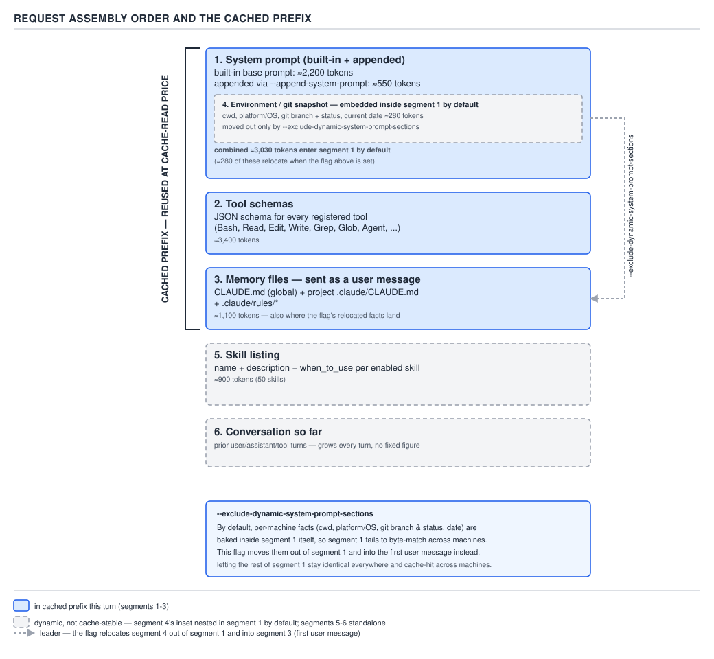

# 21 AI for Coding — request assembly order — ADVANCED (INTERNALS) (§3.1.1–3.1.4)

**Target version: Claude Code v2.1.2xx (August 2026).** | **Part 3 of 6** | [Index](../00-index.md)
Previous: [PART 2 — the interview wrap-up](../91-interview-intermediate.md) · Next: [the skill listing and the transcripts](03-internals-b-listing-and-transcripts.md)

PART 0 §0.2.11 named the five things that consume the window before you type anything and promised
this section would explain the order they arrive in and why. §0.4.4 taught you to read `/context`
row by row rather than trust the top-line percentage, and D-16 tabled a real one. §0.2.8 taught
prompt caching and why appending to a request is cheap while editing its beginning is not. This file
pays all three debts at once: the literal segment order the harness assembles on every turn, which
segments are stable enough to be cached, and the one mechanical fact — where `CLAUDE.md` actually
lives — that the last two PARTs kept telling you to trust and are about to show you why.

### 1. The assembled request, segment by segment

**Mental model first.** A request is not "the conversation plus some setup." It is six ordered
segments concatenated into one API call, and the harness rebuilds all six of them from scratch on
every single turn — nothing about a running session is stateful on the model's side (§0.2.4). The
only thing that makes this affordable is that most of the six segments are byte-identical from one
turn to the next, so the API can skip recomputing them (§0.2.8's cached prefix). Assembly order is
therefore not a cosmetic detail — it is the thing that decides which segments are cheap and which
are not.

**Why it exists:** a stateless call has to carry everything the model needs on every turn: who it
is, what it can do, what it's been told about this project, what machine it's running on, what
extra procedures it can reach for, and what's been said so far. Six distinct kinds of information,
six segments.

**How it works.** `[DOC]` `[PROVE]` No single documentation page prints this list as a numbered
sequence — it has to be assembled from `settings-reference`, `cli-reference`, and `memory`, and then
checked against a real `/context` read. Doing that assembly:

1. **System prompt** — the harness's built-in instructions, plus anything appended with
   `--append-system-prompt` or substituted with `--system-prompt`.
2. **Tool schemas** — the JSON schema for every registered tool (§0.3.2), built-in and MCP.
3. **Memory files, as a separate `user` message** — `CLAUDE.md` (global, managed, project, local),
   `.claude/rules/*`, and the auto-memory `MEMORY.md` index. **Not part of the system prompt** — the
   next section proves this from the documentation's own words.
4. **Environment / git snapshot** — cwd, platform/OS, git branch and status, current date.
5. **Skill listing** — name, description, and `when_to_use` per discoverable skill (file `b` covers
   this segment in depth, along with the conversation transcript).
6. **The conversation so far** — every prior user/assistant/tool message, per §0.3.4's rule that
   tool output is context.

**D-69** — Request assembly order, and the cached prefix. Every segment carries its token figure.

**Where this order came from, and where it should make you suspicious.** §0.4.4's `/context` table
groups the same material into eight rows — System prompt (3,200 tokens), System tools (6,800), MCP
tools (4,100), Memory files (2,120), Custom agents (900), Skill listing (450), Messages (42,430),
Free space — and that table has no separate row for "environment/git snapshot" at all. That is the
expected shape, not a contradiction: `/context` reports *budget categories*, not *literal message
order*, and a few hundred tokens of environment facts are cheap enough that the harness's own
accounting folds them into the System prompt row rather than breaking them out. The six-segment list
above is the literal per-message assembly order; the `/context` table is a coarser lens on the same
tokens. Where the two disagree on a number, trust `/context` for cost and this section for order —
they are answering different questions, not competing on the same one.

**The one order fact confirmed word-for-word in the documentation**, and it is the single most
important sentence in this file, is segment 3's placement. Section 2 below proves it.

**Insight:** the fact that a request is six concatenated segments, not one blob, is exactly why
`--append-system-prompt` (segment 1), a `.claude/rules/` file (segment 3), and a skill body (segment
5, loaded on demand) all *feel* like the same kind of "extra instructions" from the outside but carry
completely different weight and completely different cache behavior on the inside. Which segment a
piece of text lands in determines both.

> A Claude Code request is six ordered segments — system prompt, tool schemas, memory as a `user`
> message, environment/git snapshot, skill listing, conversation — rebuilt from scratch every turn.

### 2. Where `CLAUDE.md` actually lives, and why that is the whole point

**Mental model first.** Picture two versions of the same request. In the wrong one, `CLAUDE.md`'s
text is spliced into the system-prompt block, sitting alongside the harness's own built-in
instructions as if you had co-authored them. In the real one, the system prompt ships first,
untouched, and `CLAUDE.md` arrives afterward in its own `user`-role message — the same channel a
question typed into the terminal uses. Everything §1.3.2, §1.5.26, and §2.3.1 told you about memory
files being *guidance* rather than *policy* is a direct consequence of that one placement fact, not
a separate design choice layered on top of it.

**Why it exists:** the model has exactly two roles of input that carry different enforcement weight
— `system` and `user` — and no third "trusted-but-not-the-system-prompt" role exists. Memory content
is written by a human, changes per project, and needs to be re-read fresh at points a genuine system
prompt is not (`/compact` re-reads it from disk); the assembly puts it where content with those
properties belongs.

**How it works.** `[DOC]` `[TRAP]` Re-verified against `https://code.claude.com/docs/en/memory` on
2026-08-30, in the page's own troubleshooting section for "Claude isn't following my `CLAUDE.md`":

> "CLAUDE.md content is delivered as a user message after the system prompt, not as part of the
> system prompt itself. Claude reads it and tries to follow it, but there's no guarantee of strict
> compliance, especially for vague or conflicting instructions."

That is the exact claim leaf 3.1.2 makes, in the documentation's own words, not inferred from
behavior. The same page states the general law one section earlier, for both memory mechanisms at
once: "Claude treats them as context, not enforced configuration. To block an action regardless of
what Claude decides, use a PreToolUse hook instead."

**D-70** — `CLAUDE.md` is a user message, not the system prompt. The left panel is the belief; it is
false.

**Consequence 1 — this is why `CLAUDE.md` is guidance and not policy.** A `system`-role instruction
sits in a privileged position the model is trained to weight heavily and not question. A `user`-role
message — no matter how many times the file says "non-negotiable" or "ENFORCE ALWAYS" in its own
prose — is conversational input the model can weigh, argue with, or silently deprioritize under
competing instructions, exactly the way it would weigh anything else a user said. The reader's own
global `CLAUDE.md` for this project claims "HIGHEST PRIORITY" and "OVERRIDE any default behavior"
for its output rules — those words carry no more enforcement weight than any other sentence in a
`user` message, because that is the message role they arrive in. Nothing in `CLAUDE.md`'s own text
can change which role delivers it.

**Consequence 2 — this is why `--append-system-prompt` behaves differently.** §2.2.1–2.2.4 covered
the four persona flags and the failure mode of reaching for the wrong one; this is the mechanical
reason underneath it. `--append-system-prompt` extends segment 1 itself — it ships in the
privileged `system` role, before memory even loads, and it persists even in a project with no
`CLAUDE.md` at all. Putting the identical sentence in `CLAUDE.md` instead delivers it in segment 3,
as `user`-role content, after the system prompt, with the weaker enforcement Consequence 1 just
described. The documentation states the practical corollary directly: "For instructions you want at
the system prompt level, use `--append-system-prompt`. This must be passed every invocation, so it's
better suited to scripts and automation than interactive use." Same words, two different channels,
two different guarantees — never the same guarantee twice.

**Pitfall:** writing "ENFORCE ALWAYS" or "MUST" in `CLAUDE.md` and treating a violation as a bug in
the harness. The symptom is Claude apparently "ignoring" an instruction it read and, per the doc
quote above, genuinely tried to follow. The fix is not stronger wording — it is moving the rule to
the layer that actually enforces it: a `PreToolUse` hook (see `hooks`, PART 1) for anything that must
hold regardless of what the model decides, or `--append-system-prompt` for anything that must hold
inside the model's own weighting but does not need per-tool-call enforcement.

> `CLAUDE.md` is a `user` message sent after the system prompt, not a part of the system prompt —
> which is the entire mechanical reason it is guidance rather than policy.

### 3. The cached prefix, and why the ordering is not arbitrary

**Mental model first.** Every segment before the point where something starts changing turn-to-turn
is free to reuse on the next call; every segment after that point is not. Assembly order is
therefore a cost decision as much as a structural one: put the parts that never change first, and
the boundary between "cached" and "not cached" sits as far right as it can go.

**Why it exists:** §0.2.8 already established that a cache read costs roughly 10% of a fresh input
token and a cache write costs the same as an uncached token — a one-time premium paid so every
subsequent turn that reuses the prefix is nearly free. That only pays off if the prefix is actually
stable across calls. An assembly order that put the conversation first and the system prompt last
would invalidate the cache on every single message, because the conversation is the one segment
guaranteed to change every turn.

**How it works.** `[NUM]` `[DOC]` Segments 1–3 — system prompt, tool schemas, memory-as-user-message
— are the candidate cached prefix in D-69: none of them changes within a session unless the reader
edits `CLAUDE.md`, adds a tool, or restarts with different flags. Segments 4–6 sit after that
boundary and are excluded from the stable prefix by construction: the environment/git snapshot
changes with `cwd` and `git status`, the skill listing changes as skills are added mid-session
(file `b` covers this in more depth), and the conversation grows every turn by definition.

Re-verified against `https://code.claude.com/docs/en/cli-reference` on 2026-08-30, the flag that
protects this boundary is `--exclude-dynamic-system-prompt-sections`:

> "Move per-machine sections from the system prompt (working directory, environment info, memory
> paths, git-repo flag) into the first user message. Improves prompt-cache reuse across different
> users and machines running the same task. Only applies with the default system prompt; ignored
> when `--system-prompt` or `--system-prompt-file` is set. Use with `-p` for scripted, multi-user
> workloads"

**The docs and the diagram now agree.** The documentation says these per-machine facts — cwd,
environment info, memory *paths* (not memory file *content*), the git-repo flag — live **inside the
built-in system prompt by default**, and `--exclude-dynamic-system-prompt-sections`'s job is to
relocate them out of segment 1 and into the first `user` message. D-69 now draws it that way: the
environment/git snapshot sits nested inside the system-prompt block, and the flag is what pulls it
out into the first user message — not a separately-drawn segment 4 that was already outside the
cached prefix from the start. (D-69 originally drew the environment/git snapshot as its own,
already-separate segment; the diagram has since been corrected to nest it inside the system prompt,
matching the documentation.) Without the flag, those facts are baked into segment 1 itself, which
means the *whole* system prompt, per-machine parts included, fails to match byte-for-byte across two
different machines or two different working directories, and the cache misses on segment 1 as a
unit. With the flag, segment 1 shrinks to only the parts that are identical everywhere, those parts
cache-hit across machines, and the per-machine facts move to a `user` message the model still reads
on every turn but which no longer has to match anyone else's for the earlier segments to hit cache.
`[NUM]` The practical payoff: a fleet running the same scripted task (`-p`) across many CI machines
or many users' laptops gets cache hits on segment 1 that it would not get at all without the flag,
because "the same built-in prompt, plus a different `cwd`" is otherwise a different string on every
machine. The cached-prefix bracket in D-69 spans segments 1–3, with segment 1's combined total
(built-in system prompt plus the nested environment/git snapshot, before the flag relocates it)
landing at ≈3,030 tokens.

**Interview:** "Why isn't the environment snapshot just part of the cached prefix?" — because it
changes per machine and per turn (a new `cwd`, a fresh `git status`), and putting a segment that
never matches twice ahead of a segment that could have matched would poison the cache for everything
after it; ordering the stable segments first, and giving `--exclude-dynamic-system-prompt-sections`
a way to pull the last per-machine parts out of segment 1, is what keeps the prefix boundary as far
right as possible.

> The cached prefix is the run of leading segments identical across calls; `--exclude-dynamic-
> system-prompt-sections` widens it by moving per-machine facts out of the system prompt and into
> the first user message.

### 4. Tool schemas as a cost line

**Mental model first.** Every registered tool's schema is not documentation the model consults on
demand — it is tokens sitting in segment 2 of every single request, whether or not that tool is ever
called this session. A tool you never use still costs exactly as much as one you call fifty times.

**Why it exists:** the model chooses a tool "from its description alone" (§0.3.6), which means the
full name, description, and JSON input schema of every candidate tool has to be in context before
the model can pick one — there is no lazy-lookup step inside a single model call.

**How it works.** `[NUM]` `[PROVE]` §0.4.4's `/context` table gives the concrete split: **System
tools, 6,800 tokens (3.40% of a 200,000-token window)** for the built-in catalogue (`Read`, `Write`,
`Edit`, `Bash`, `Grep`, and the rest of §0.3.8's list), and **MCP tools, 4,100 tokens (2.05%)** for
every connected MCP server's schemas on top of that. Summed, that single example session spends
**10,900 tokens — 5.45% of the entire window — on tool schemas before a single message is
exchanged**, and that arithmetic scales linearly with server count: two MCP servers of similar size
roughly double the MCP-tools row, three roughly triple it, independent of which tools actually get
called.

§0.3.9 named the mitigation and this is its cost justification worked through: deferred tools plus
`ToolSearch` change which tools sit permanently in segment 2. A deferred tool's *name* still costs a
few tokens as an index entry, but its full JSON schema — the expensive part, easily 100–300 tokens
per tool once parameters, descriptions, and enum values are counted — loads only when `ToolSearch`
resolves it, and only for the remainder of that session. Ten deferred tools sitting as index entries
rather than fully-expanded schemas is the difference between paying roughly 10 tokens each up front
(≈100 tokens) versus roughly 200 tokens each (≈2,000 tokens) — a **saving on the order of 1,900
tokens, roughly 0.95% of the window**, that recurs on every single turn of the session for as long as
those tools stay unresolved, not just once. `[NUM]`

**Pitfall:** connecting five MCP servers "just in case" and treating the cost as free because no
tool from them has been called yet. The `/context` MCP-tools row is billed the moment the server
connects and its schemas load, not the moment a tool from it executes — an unused server is a
standing tax on every request for the rest of the session.

**Interview:** "Does an unused tool cost anything?" — yes, its full schema sits in segment 2 of every
request regardless of whether it is ever invoked; the fix is disconnecting unused MCP servers and
leaving the long tail of built-in tools deferred behind `ToolSearch` rather than loaded up front.

No gotcha beyond the pitfall above: the mechanism is a flat per-tool token tax with no surprising
edge case once you know it is charged at connection time, not call time.

> Tool schemas are a fixed per-turn cost proportional to the number of registered tools, independent
> of how many of them are actually called — which is exactly what deferred loading and `ToolSearch`
> exist to shrink.

## Pitfalls

| Belief in action | Surprising outcome | What actually gets the guarantee | Why people believe it |
|---|---|---|---|
| Writing "MUST" / "ENFORCE ALWAYS" in `CLAUDE.md` will be obeyed like a system instruction. | The model still deviates under a competing instruction, because the text arrived as a `user` message, not a `system` one. | A `PreToolUse` hook for anything that must hold regardless of the model's decision; `--append-system-prompt` for anything that needs system-role weight without per-call enforcement. | `CLAUDE.md` reads like a config file and sits at the top of every session, so it feels authoritative — but the message *role* it ships in, not its content or its wording, is what the model actually weighs. |
| An MCP server you haven't used any tools from yet is "free" until you call one. | Its schemas load into segment 2 the moment it connects, taxing every request from then on. | Disconnect servers you are not actively using this session; leave the long tail deferred behind `ToolSearch`. | The cost of a tool call is visible (you see the result); the cost of a tool's schema sitting unused in context is invisible unless you read `/context`. |
| The environment/git snapshot is a small, fixed, always-cached line item. | By default it lives inside the system prompt itself, so it can break the cache for the *whole* system prompt across machines, not just for itself. | `--exclude-dynamic-system-prompt-sections` for scripted, multi-machine workloads (`-p`) where the same task runs on many `cwd`s or many users. | It looks like "just a few facts about the machine," so it is easy to assume it is cheap and isolated rather than embedded in the segment everyone else's stability depends on. |

## Cheat sheet

| Segment | Contents | In default cached prefix? | Cost lever |
|---|---|---|---|
| 1. System prompt | Built-in + `--append-system-prompt` / `--system-prompt` | Yes | `--exclude-dynamic-system-prompt-sections` pulls per-machine facts out |
| 2. Tool schemas | Every registered tool's JSON schema, built-in + MCP | Yes | Disconnect unused MCP servers; defer tools behind `ToolSearch` |
| 3. Memory (`user` message) | `CLAUDE.md` (all scopes), `.claude/rules/*`, `MEMORY.md` index | Yes | Keep `CLAUDE.md` under 200 lines |
| 4. Environment/git snapshot | cwd, platform/OS, git branch+status, date | No (or moved here by the flag) | `--exclude-dynamic-system-prompt-sections` |
| 5. Skill listing | name + description + `when_to_use` per skill | No | Fewer auto-discovered skills |
| 6. Conversation | Prior user/assistant/tool messages | No | `/compact`, `/clear` |

## Self-test

1. Which message role does `CLAUDE.md` content arrive in, and what is the one documentation
   sentence that proves it?

Answer
It arrives as a `user`-role message, sent after the system
prompt — the `memory` page states: "CLAUDE.md content is delivered as a user message after the
system prompt, not as part of the system prompt itself."

2. Why does `--append-system-prompt` produce a stronger guarantee than the identical sentence placed
   in `CLAUDE.md`?

Answer
Because it extends segment 1, the `system`-role message itself,
which the model is trained to weight more heavily and not question — whereas the same text in
`CLAUDE.md` ships as segment 3, a `user`-role message the model can weigh, argue with, or
deprioritize like any other conversational input.

3. Name the three segments D-69 marks as the default cached prefix.

Answer
System prompt, tool schemas, and memory files (the `user` message
carrying `CLAUDE.md` and related files) — segments 1 through 3.

4. What does `--exclude-dynamic-system-prompt-sections` actually move, and to where?

Answer
Per-machine sections of the default system prompt — working
directory, environment info, memory paths, and the git-repo flag — out of the system prompt and into
the first user message, so the remaining system prompt stays byte-identical across machines and
cache-eligible.

5. A session connects three MCP servers and never calls a tool from any of them. Is that session
   paying any cost for them, and if so, where does it show up?

Answer
Yes — the MCP tools row in `/context` (4,100 tokens for one
server in the worked example) is billed the moment the servers connect and their schemas load into
segment 2, independent of whether any tool from them is ever called.

6. If a reader wants a rule enforced "regardless of what Claude decides," which mechanism actually
   gives that guarantee, and why doesn't `CLAUDE.md`?

Answer
A `PreToolUse` hook, because hooks execute as shell commands at
fixed lifecycle events and apply mechanically; `CLAUDE.md` cannot give that guarantee because it is
context delivered in a `user` message, which the documentation itself calls "not enforced
configuration."

7. Work the arithmetic: a session has System tools at 6,800 tokens and MCP tools at 4,100 tokens on
   a 200,000-token window. What percentage of the window do tool schemas alone consume?

Answer
(6,800 + 4,100) / 200,000 = 10,900 / 200,000 = 0.0545 = 5.45% of
the window, before a single message is exchanged.

8. Does `/context`'s row layout match D-69's six-segment assembly order one-for-one? Explain the
   discrepancy.

Answer
No — `/context` groups tokens into budget categories (System
prompt, System tools, MCP tools, Memory files, Custom agents, Skill listing, Messages, Free space)
and has no separate row for the environment/git snapshot, folding its small cost into the System
prompt row. D-69's six segments describe literal per-message assembly order; `/context` describes
cost accounting. They answer different questions and are expected to disagree on granularity.

## Open questions

None — every claim in this file is either quoted verbatim from `memory` or `cli-reference` (both
re-verified 2026-08-30), or worked arithmetic from the `/context` figures already tabled in
§0.4.4/D-16. §3 records that D-69 originally drew the environment/git snapshot as its own separate
segment and has since been corrected to nest it inside the system prompt, matching the
documentation.

---

**Leaves covered:** 3.1.1–3.1.4 (4 leaves)
**Leaves deferred:** none
**Diagrams included:** D-69, D-70
**Target version:** Claude Code v2.1.2xx (August 2026)
**Lines:** 327
