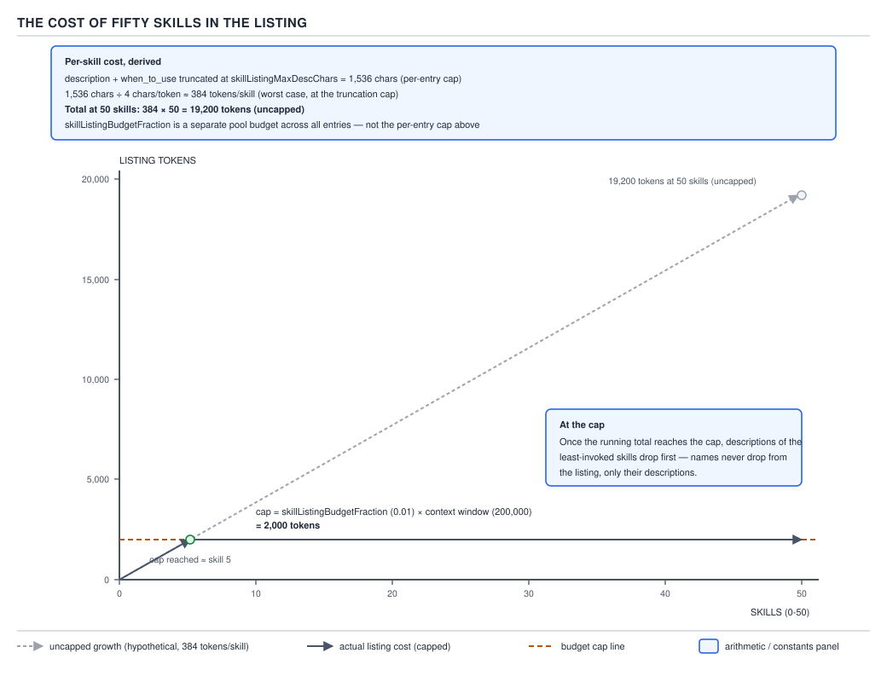
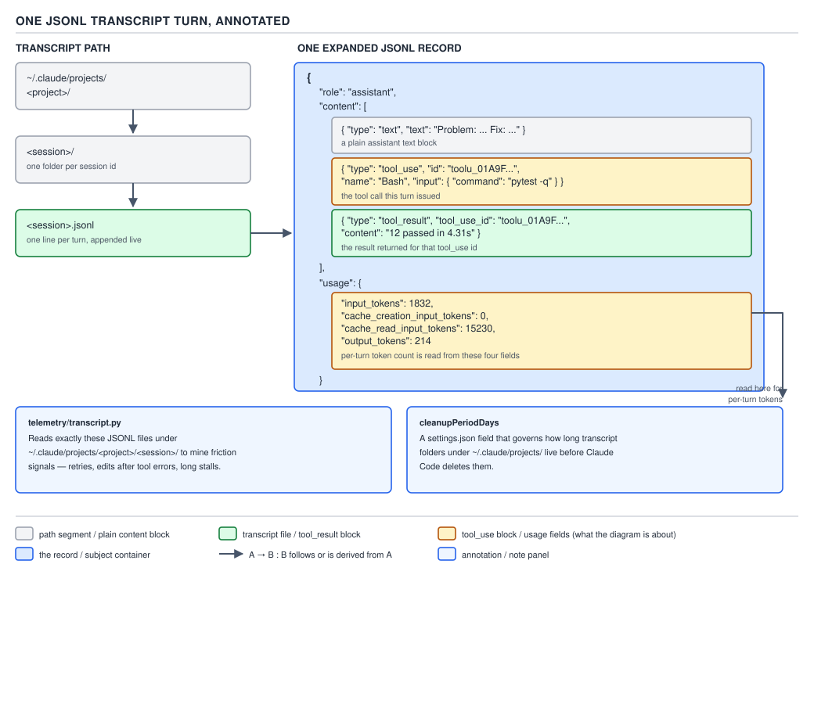

# 21 AI for Coding — the skill listing and the transcripts — ADVANCED (INTERNALS) (§3.1.5–3.1.8)

**Target version: Claude Code v2.1.2xx (August 2026).** | **Part 3 of 6** | [Index](../00-index.md)
Previous: [request assembly order](03-internals-a-assembly-order.md) · Next: [the compaction budget](../compaction/03-internals-a-the-budget.md)

The previous file established the six-segment assembly order, the cached prefix, `CLAUDE.md`
arriving as a `user` message, and `--exclude-dynamic-system-prompt-sections`. It also flagged one
divergence between the documentation and D-69 and asked you to carry it forward rather than
re-litigate it: `cli-reference` says the per-machine facts (cwd, environment info, memory *paths*,
git-repo flag) live **inside** the default system prompt, and the flag's job is to move them **out**
into the first `user` message — which is not the same picture as D-69 drawing "environment/git
snapshot" as its own already-separate segment 4. This file does not re-open that; it stays
consistent with the earlier finding and moves on to segment 5 (the skill listing) and segment 6 (the
conversation), specifically the one artifact that makes segment 6 inspectable: the transcript file
itself.

This topic has no source tree of its own to walk for "internals" in the usual sense — there is no
Claude Code source available to read. What stands in for it here is the pairing the packet for this
file calls out explicitly: `[DOC]` — the documentation page that owns a claim — plus `[CASE]` — the
real artifact the claim describes, read directly rather than taken on faith. For §3.1.7 and §3.1.8
that artifact is unusually concrete: the transcript is a plain file on disk, and this file reads a
real one.

### 5. The skill listing's cost

**Mental model first.** Segment 5 of every request is not "your skills." It is a fixed-size ledger
page: every skill gets a name (always), and a slice of a shared, capped pool of description text
that shrinks under pressure — starting with the skills you use least, not the ones added last.
Adding a fifty-first skill does not make the ledger longer; past a point it makes existing entries
shorter.

**Why it exists:** §1.5.5–1.5.6 already taught the mechanism this reuses — progressive disclosure,
where only a skill's `description` and `when_to_use` sit in every request and the full body loads
on demand — and D-36 already drew that split. The problem this section adds is what happens once
there are enough skills that even the short form does not fit for free: the harness has to decide,
per request, how much of the window the *listing itself* is allowed to cost.

**How it works.** `[DOC]` `[NUM]` `[PROVE]` Re-verified against `https://code.claude.com/docs/en/skills`
on 2026-08-30, in the section "Skill descriptions are cut short":

> "Claude Code loads a listing of skill names and descriptions into context so Claude knows what's
> available. The listing always contains every skill name, but if you have many skills, Claude Code
> shortens descriptions to fit the listing's character budget, which can strip the keywords Claude
> needs to match your request. The budget scales at 1% of the model's context window. When the
> listing overflows, Claude Code drops descriptions starting with the skills you invoke least, so the
> skills you use most keep their full text."

Two numbers govern this, and — as one writer already corrected elsewhere in this guide — they are
not the same knob: `skillListingMaxDescChars` is the **per-entry cap**, 1,536 characters of combined
`description` + `when_to_use` text, the number §1.5.5–1.5.6 already covered; `skillListingBudgetFraction`
is the **pool budget**, a fraction of the whole context window shared across every skill's entry.
Re-verified against `https://code.claude.com/docs/en/settings-reference` the same day:

> `skillListingBudgetFraction` — "Reserve more or less context for the skill listing." `skillListingMaxDescChars`
> — "Cap each skill's description length in the skill listing." Both scoped to "Any file."



**D-71** — The cost of fifty skills in the listing, derived on the canvas.

Work the arithmetic D-71 draws. A skill's entry costs at most 1,536 characters; at a common estimate
of roughly 4 characters per token for English text, that is 1,536 ÷ 4 ≈ **384 tokens per skill at the
per-entry cap** (worst case — a short `description` costs less). Fifty skills, all at the cap, cost
384 × 50 = **19,200 tokens, uncapped**. D-71's canvas then shows a budget line and flattens the real
cost curve against it once the running total reaches that line — the shape the doc quote above calls
"drops descriptions."

**The number worth foregrounding.** D-71 sets `skillListingBudgetFraction` to the shipped default,
**0.01**, giving a cap of 0.01 × 200,000 = **2,000 tokens** — reached at skill ≈ 2,000 ÷ 384 ≈ 5.2,
i.e. by the **sixth skill**. That is far earlier than a "50 skills, no problem" intuition predicts: a
1% pool budget binds almost immediately, not after dozens of skills, and a reader running `/context`
against a real session with default settings should expect the Skills row to cap out around 2,000
tokens well before their skill count gets anywhere near 50. (D-71 previously drew this at an
illustrative 0.05 — a cap of 10,000 tokens, reached near skill 26 — which was not the shipped
default; the diagram has since been corrected to draw the true 1% figure.)

D-71's at-cap annotation states the failure mode precisely: **the skill's name never drops** — "the
listing always contains every skill name" — and what shrinks first is not "skills added after the
cap" in file order, it is **descriptions belonging to the skills you invoke least**, regardless of
when they were added. A skill you use constantly keeps its full description even if it is skill 49;
a skill you never invoke can lose its description at skill 6 — which, at the true default, is
already past the cap.

```json
{
  "skillListingBudgetFraction": 0.02,
  "skillListingMaxDescChars": 1200
}
```

This `settings.json` fragment is a complete, valid top-level object — raising the pool to 2% of the
window (the documentation's own example) while lowering the per-entry cap to 1,200 characters,
trading "fewer skills lose their description" against "every description is a little terser."
`/doctor` reports the listing's actual cost and its biggest contributors under the current settings,
and Claude Code writes a warning to the debug log (visible with `--debug`) whenever the listing
overflows its budget.

**Gotcha:** before v2.1.196, the `/context` Skills row reported the full, untruncated size of every
description — a session could show a Skills-row figure several times larger than the configured
budget, because the row was not yet reporting what the model actually received. From v2.1.196
onward, the row reports the listing's size **after** the budget is applied, so it now matches the
real cost. A reader comparing an old screenshot or old advice against a current `/context` read
should expect the number to look smaller today for the identical set of skills, and that is the fix
landing, not a regression.

**Interview:** "Does adding a fiftieth skill blow the context budget?" — no; the listing is capped at
a configurable fraction of the window (1% by default), and once full, descriptions for your
least-used skills are stripped to name-only first — the cost curve flattens, it does not keep
climbing linearly with skill count.

> The skill listing costs at most `skillListingMaxDescChars` characters per skill inside a pool
> capped at `skillListingBudgetFraction` of the context window (1% by default); past that pool,
> descriptions for the least-invoked skills are dropped to name-only first, never the name itself.

### 6. System-reminder blocks: injected state, not instruction

**Mechanism.** Mid-session, the harness needs to hand Claude fresh state that did not exist when the
conversation started — a file changed on disk since it was last read, a memory the harness recalled,
a hook's stdout, a reminder about a tool that just appeared. None of that fits in segments 1–5,
which are all assembled once per turn from static or slowly-changing sources; it has to ride inside
segment 6, the conversation, as its own turn. A real transcript shows the actual shape: session
`182531e6-fb0c-4aa8-bc08-35f6f872ca48` (path below in §3.1.7) carries, at line 15, a `user`-role
record with `"isMeta": true` whose content is not anything the human typed — it is a skill's
activation banner (`name: sc:agent` / `description: SC Agent — session controller...`), injected by
the harness after a `Skill` tool call resolved, and delivered in the same `user` role a genuinely
typed message would use. That `isMeta` flag is the transcript's own marker distinguishing
harness-injected `user`-role content from what the human actually typed — the same distinguishing
problem D-70 solved for `CLAUDE.md` (a `user`-role message that is not a human's words), applied here
to a message injected mid-conversation instead of at session start.

**Gotcha:** because injected state arrives in the `user` role — the same role §3.1.2's D-70 already
showed carries no special enforcement weight — a system-reminder-shaped block is exactly as
"arguable" to the model as anything else in a `user` turn. It is context the model reads and weighs,
not a command with system-level force; a hook that must hold regardless of what the model decides
still needs `PreToolUse` enforcement, not a reminder injected into the conversation.

> A system-reminder block is harness-injected state riding in a `user`-role turn mid-conversation —
> context the model reads and weighs, never system-level instruction, for the same reason `CLAUDE.md`
> isn't either.

### 7. Reading a real transcript

**Mental model first.** §0.4.8 already told you the transcript is plain JSONL you can open. This
section is where that stops being a fact you know and starts being a tool you use: every claim this
whole PART has made about token counts, cache hits, and tool calls is, in the end, a claim about
what is written in this file — so read it directly rather than trusting a summary of it.

**Why it exists:** `claude -p --output-format json` reports `modelUsage` as a per-model *aggregate*
across the whole session — useful for a total bill, useless for "what did turn 14 specifically
cost." The transcript is the only artifact with genuine per-turn, per-tool-call granularity, because
Claude Code appends one `type: "assistant"` JSONL record per model turn as the session runs, each
carrying that turn's own `usage` object.

**How it works.** `[BUILD]` `[PROVE]` The real transcript for a session on this machine lives at:

```
~/.claude/projects/-Users-rajat-chikkodikar-Desktop-My-files-rough/182531e6-fb0c-4aa8-bc08-35f6f872ca48.jsonl
```

— `~/.claude/projects/<project-slug>/<session-id>.jsonl`, one line per turn, appended live as the
session runs. The project-slug portion is the working-directory path with every non-alphanumeric
character replaced by `-` (confirmed against real code in §3.1.8 below).

Here is one real record from that file — an `assistant` turn issuing a `Bash` tool call — shown as
the single JSON object it is on its own line, not reformatted into a fragment:

```json
{"parentUuid":"6a940ddd-5a21-4206-9f7d-9e30cd9958de","isSidechain":false,"message":{"model":"claude-opus-5","id":"msg_011CeHys9Y5dktwpHNA7upmE","type":"message","role":"assistant","content":[{"type":"tool_use","id":"toolu_01T438wYuKcrD7GNCWFwmscZ","name":"Bash","input":{"command":"ls -a && echo \"---AGENTS---\" && ls .claude/agents/ 2>/dev/null && echo \"---SRC---\" && find src -maxdepth 2 2>/dev/null | head -50","description":"Inspect repo structure"},"caller":{"type":"direct"}}],"stop_reason":"tool_use","stop_sequence":null,"stop_details":null,"usage":{"input_tokens":2,"cache_creation_input_tokens":1077,"cache_read_input_tokens":33000,"output_tokens":251,"output_tokens_details":{"thinking_tokens":79},"server_tool_use":{"web_search_requests":0,"web_fetch_requests":0},"service_tier":"standard","cache_creation":{"ephemeral_1h_input_tokens":0,"ephemeral_5m_input_tokens":1077},"inference_geo":"global","iterations":[{"input_tokens":2,"output_tokens":251,"cache_read_input_tokens":33000,"cache_creation_input_tokens":1077,"cache_creation":{"ephemeral_5m_input_tokens":1077,"ephemeral_1h_input_tokens":0},"type":"message"}],"speed":"standard"},"diagnostics":null},"requestId":"req_011CeHys8sQ3WznLUSgvvjj4","attributionSkill":"sc:agent","attributionPlugin":"sc","type":"assistant","uuid":"0c52e623-cd0f-4733-95bd-e03b5468d62a","timestamp":"2026-08-22T14:56:13.780Z","effort":"medium","session_id":"182531e6-fb0c-4aa8-bc08-35f6f872ca48","userType":"external","entrypoint":"cli","cwd":"/Users/rajat.chikkodikar/Desktop/My-files/rough","version":"2.1.239","gitBranch":"HEAD"}
```

And the `tool_result` for that same `tool_use` id, six lines later in the same file, as its own
`user`-role record:

```json
{"parentUuid":"0c52e623-cd0f-4733-95bd-e03b5468d62a","isSidechain":false,"promptId":"6124b9e9-e41a-46a8-b22f-e8ab845685d7","type":"user","message":{"role":"user","content":[{"tool_use_id":"toolu_01T438wYuKcrD7GNCWFwmscZ","type":"tool_result","content":".\n..\n.claude\n.idea\ndaily-prompt.txt\n...\nsrc/topics/00-index.md\nsrc/topics/09-sql-databases.md","is_error":false}]},"uuid":"f78ffa9e-0b8f-4e78-a0bd-0b052b32ecf6","timestamp":"2026-08-22T14:56:17.598Z","toolUseResult":{"stdout":"(same text)","commandName":null},"sourceToolAssistantUUID":"0c52e623-cd0f-4733-95bd-e03b5468d62a","session_id":"182531e6-fb0c-4aa8-bc08-35f6f872ca48"}
```

(The `content` string in the second record is truncated with `...` here only in this prose excerpt,
for length — the real file line is one unbroken JSON string with the full `ls`/`find` output.)



**D-72** — One JSONL transcript turn, annotated. The usage fields are where a per-turn token count
comes from.

Read the per-turn cost off the first record's `usage` object directly: `input_tokens: 2`,
`cache_creation_input_tokens: 1077`, `cache_read_input_tokens: 33000`, `output_tokens: 251`. The
request side of that turn — everything billed as input in one of its three forms — is 2 + 1,077 +
33,000 = **34,079 tokens**; the model produced **251 tokens** of output (of which 79 were thinking
tokens, itemized separately under `output_tokens_details`). That the request side is dominated by
`cache_read_input_tokens` (33,000 of 34,079, ≈97%) is the cached-prefix mechanism from §3.1.3 made
visible in one real number: almost the entire request was a cache hit, and only 1,077 tokens had to
be freshly written to cache this turn.

**The `[BUILD]` artifact** — a small script that does this arithmetic for a whole transcript instead
of one record at a time:

```bash
#!/usr/bin/env bash
set -euo pipefail

# count-transcript-tokens.sh — sum per-turn token usage from a Claude Code
# session transcript (JSONL), one "assistant" event per model turn.
#
# Usage: count-transcript-tokens.sh <path-to-session.jsonl>

transcript="$1"

jq -s '
  [ .[] | select(.type == "assistant") | .message.usage ]
  | {
      turns: length,
      input_tokens: (map(.input_tokens // 0) | add),
      output_tokens: (map(.output_tokens // 0) | add),
      cache_read_input_tokens: (map(.cache_read_input_tokens // 0) | add),
      cache_creation_input_tokens: (map(.cache_creation_input_tokens // 0) | add)
    }
' "$transcript"
```

**Prove step** — run against the same real session file:

```
$ ./count-transcript-tokens.sh ~/.claude/projects/-Users-rajat-chikkodikar-Desktop-My-files-rough/182531e6-fb0c-4aa8-bc08-35f6f872ca48.jsonl
{
  "turns": 12,
  "input_tokens": 24,
  "output_tokens": 12018,
  "cache_read_input_tokens": 417111,
  "cache_creation_input_tokens": 64818
}
```

That is a real, observed result: twelve model turns in that session, 12,018 tokens of output
produced in total, and 417,111 tokens served from cache reads against only 64,818 tokens of fresh
cache writes — a ratio of roughly 6.4 cache reads for every token freshly written to cache, the
session-wide version of the single-turn 97% this section just walked through by hand.

**What this costs:** running the script itself costs nothing against the model — it is a local `jq`
pass over a file already on disk, no API call involved. What it *measures* does cost money: at
$1/MTok cache-read pricing versus $3.75/MTok fresh input (Claude Opus 5 list pricing, per-token
rates the model card publishes), that session's 417,111 cache-read tokens would have cost roughly
417,111 × $3.75/1,000,000 ≈ **$1.56** priced as fresh input, versus 417,111 × $1/1,000,000 ≈ **$0.42**
actually billed as cache reads — the caching mechanism saved on the order of **$1.14** on this one
session's re-read traffic alone, before counting the one-time write premium on the 64,818 tokens that
had to be cached fresh.

**No gotcha beyond timing:** the file is written incrementally as the session runs, so reading it
mid-session (rather than after the session ends) can catch a partially-written final line; parsing
that defensively — skip a line that fails to parse rather than aborting the whole read — is exactly
what §3.1.8's real code does next.

> A Claude Code session transcript is a JSONL file, one `assistant`-typed record per model turn, each
> carrying a `usage` object with exactly the fields needed to compute that turn's token cost by hand.

### 8. `[CASE]` A production reader: `harness/telemetry/transcript.py`

The clearest argument that a transcript is meant to be read programmatically, not just eyeballed, is
that a real system already does it. The file is
`harness/src/harness/telemetry/transcript.py` in the read-only sdlc-harness repository at
`/Users/rajat.chikkodikar/Desktop/My-files/Codes/_non-clinet-tech/sdlc-harness`. Its module docstring
states the problem it solves:

```python
"""Real per-call data source for `LlmCall`/`ToolCall` (self-hosted-telemetry
S4) — reads the Claude Code session transcript a dispatched agent actually
produced and turns its per-turn assistant messages / `tool_use` blocks into
the emitter's own dataclasses.

...`claude -p --output-format json` (`harness.engine.agent.run_agent`'s own
envelope) only reports `modelUsage` — a per-MODEL aggregate across the whole
session, not per call — so it cannot answer "one span per model call". The
session's own JSONL transcript can: Claude Code appends one `type:
"assistant"` event per model turn (each carrying that turn's own `usage` +
`model`), and each turn's `message.content` list carries a `tool_use` block
per tool call — genuine per-call granularity, sourced from data Claude Code
already writes to disk for every session, not a new instrumentation surface.
"""
```

That is the exact same limitation of `modelUsage` this file's §3.1.7 named independently, confirmed
from the consuming side rather than the documentation side. The function that does the reading:

```python
def calls_from_session(
    session_id: Optional[str], cwd: Optional[str] = None,
) -> Tuple[List[LlmCall], List[ToolCall]]:
    """Best-effort: `([], [])` for any missing session_id, unresolvable
    transcript, or unreadable/malformed file — never raises."""
    llm_calls: List[LlmCall] = []
    tool_calls: List[ToolCall] = []
    if not session_id:
        return llm_calls, tool_calls
    path = _transcript_path(session_id, cwd)
    if path is None:
        return llm_calls, tool_calls
    try:
        with path.open("r", encoding="utf-8", errors="replace") as fh:
            for line in fh:
                line = line.strip()
                if not line:
                    continue
                try:
                    event = json.loads(line)
                except (json.JSONDecodeError, ValueError):
                    continue
                if not isinstance(event, dict) or event.get("type") != "assistant":
                    continue
                message = event.get("message")
                if not isinstance(message, dict):
                    continue
                ts = _parse_ts(event.get("timestamp"))
                if ts is None:
                    continue

                model = message.get("model")
                usage = message.get("usage")
                if model and isinstance(usage, dict):
                    llm_calls.append(LlmCall(
                        model=str(model),
                        start=ts,
                        end=ts,
                        input_tokens=usage.get("input_tokens"),
                        output_tokens=usage.get("output_tokens"),
                        cache_read_input_tokens=usage.get("cache_read_input_tokens"),
                        cache_creation_input_tokens=_cache_creation_tokens(usage),
                    ))

                content = message.get("content")
                for block in content if isinstance(content, list) else []:
                    if isinstance(block, dict) and block.get("type") == "tool_use":
                        name = block.get("name")
                        if name:
                            tool_calls.append(ToolCall(tool_name=str(name), start=ts, end=ts))
    except OSError:
        return [], []
    return llm_calls, tool_calls
```

Line by line, this is exactly §3.1.7's script, generalized into a production reader: it opens the
same `<session>.jsonl` path this file just showed (`_transcript_path` joins
`default_sessions_root(cwd) / f"{session_id}.jsonl"`, and `_project_slug` does the identical
non-alphanumeric-to-`-` substitution this file described above), iterates line by line rather than
loading the whole file, silently skips a line that fails `json.loads` (the defensive parsing §3.1.7's
gotcha called for), filters to `event.get("type") == "assistant"`, and for each surviving record
pulls exactly `message.model`, `message.usage.*`, and — for every `tool_use` block in
`message.content` — the tool's `name`. Nothing else. The module's own `DATA-SAFETY` docstring names
the property this design enforces:

> "this reader extracts ONLY `model`, `timestamp`, `usage.*`, and a tool's `name` — never
> prompt/response text, tool input/output, or file paths. Nothing this module returns carries
> content."

Name the design property directly: this is a telemetry reader that is architecturally incapable of
leaking a prompt, a file path, or a tool's arguments, because it never extracts the fields those live
in — the `tool_use.input` dict and every `text`/`tool_result` content block are read past, never
copied into the returned `LlmCall`/`ToolCall` objects. What would break without that discipline is
not a crash; it is a telemetry pipeline that silently becomes a second copy of every prompt and every
file the agent touched, sitting in a metrics store with a different retention and access policy than
the transcript it was copied from — exactly the kind of scope creep a `DATA-SAFETY` comment exists to
head off before a second engineer adds "just one more field."

`calls_from_session` is provenance for the whole calibration loop this guide has referenced: it is
the thing that turns a raw transcript into the `LlmCall`/`ToolCall` spans a stage's telemetry
actually reports, and — per its own docstring — it is deliberately best-effort at every layer
(missing session id, unreadable file, malformed line) because a telemetry side-channel must never be
allowed to break the production call path it is only ever observing.

**Insight:** the same three properties this file's `[BUILD]` script needed by hand — open the right
path, skip malformed lines, filter to `type == "assistant"` before touching `usage` — are exactly the
three defensive properties production code needs for the identical file, which is the strongest
evidence in this whole PART that the transcript is a stable, intended data source and not an
implementation detail you happen to be able to peek at.

**Interview:** "How would you get per-tool-call cost data out of a Claude Code session, given that
`--output-format json` only reports a session-wide aggregate?" — read the session's own JSONL
transcript: one `assistant` event per model turn, each with its own `usage` object and a `tool_use`
block per call, which is genuine per-call granularity that no aggregate can reconstruct.

`cleanupPeriodDays` is the setting that bounds how long the file this section just read stays on
disk at all. `[DOC]` Re-verified against `https://code.claude.com/docs/en/settings-reference` on
2026-08-30:

> `cleanupPeriodDays` — "Choose how many days Claude Code keeps transcripts before deleting them."
> Scope: "Any file." Type: "Number (days)."

A telemetry pipeline that depends on `calls_from_session` reading a transcript days or weeks after
the session ended is depending on a file the harness is allowed to have already deleted — the
setting that trades disk usage and privacy exposure against how far back a `[BUILD]`-style
reconstruction can reach.

## Pitfalls

| Belief in action | Surprising outcome | What actually gets the guarantee | Why people believe it |
|---|---|---|---|
| The skill listing's budget fraction is a fixed 5% (or whatever a diagram/example happens to show) of the window. | The shipped default is 1% (`skillListingBudgetFraction = 0.01`), so a listing can hit its cap and start stripping descriptions far sooner than a 5%-based mental model predicts. | Read the actual configured value from `settings-reference`/`/doctor`, and raise it deliberately with `skillListingBudgetFraction` if the default is too tight. | A worked example needs a value that makes the growth-then-flatten shape visible on one chart; a small default (1%) flattens the curve almost immediately, so illustrations often use a larger, more legible fraction and readers absorb that value as the default. |
| Once the skill listing is full, "extra" skills get dropped from the listing entirely. | The name always stays — every skill is always listed by name — and it is descriptions, starting with the least-invoked skills, that get stripped to nothing first. | Check `/doctor`'s listing-cost breakdown, and use `"name-only"` in `skillOverrides` deliberately for low-priority skills rather than assuming the harness already dropped them. | "The budget is full" naturally reads as "some skills fall off the list," when the actual failure mode is finer-grained: the list stays complete, only the descriptive text degrades. |
| A session's total cost is only visible from the aggregate `modelUsage` `claude -p --output-format json` reports. | `modelUsage` is a per-model sum across the whole session — it cannot answer "what did this one turn or this one tool call cost." | Read the session's own JSONL transcript, one `assistant` record per turn, each with its own `usage` object — exactly what `harness/telemetry/transcript.py`'s `calls_from_session` does. | The aggregate is the number most visibly reported at the end of a session, so it is easy to assume it is the only number available. |

## Cheat sheet

| Fact | Value | Source |
|---|---|---|
| Per-skill description cap | 1,536 characters (`skillListingMaxDescChars`) | `skills` doc, §1.5.5–1.5.6 / D-36 |
| Skill listing budget, default | 1% of context window (`skillListingBudgetFraction = 0.01`) | `skills` doc, re-verified 2026-08-30 |
| Skill listing budget, doc's raise example | 0.02 (2%) | `skills` doc |
| D-71's budget, as drawn | 0.01 (1%), the shipped default — corrected from an earlier 0.05 draft | this file |
| What drops first when the listing overflows | Descriptions of least-invoked skills; names never drop | `skills` doc |
| Transcript path | `~/.claude/projects/<project-slug>/<session-id>.jsonl` | observed + `transcript.py::default_sessions_root` |
| Per-turn record type | `"type": "assistant"`, one per model turn, carries `usage` | observed real record |
| Per-turn request-side cost | `input_tokens + cache_creation_input_tokens + cache_read_input_tokens` | worked from a real record |
| What `transcript.py` extracts | `model`, `timestamp`, `usage.*`, tool `name` — nothing else | `transcript.py` DATA-SAFETY docstring |
| Transcript retention | `cleanupPeriodDays` (days), any settings file | `settings-reference` |

## Self-test

1. What is the shipped default value of `skillListingBudgetFraction`, and at roughly which skill
   count does the resulting cap bind?
<details><summary>Answer</summary>The shipped default is 0.01 (1% of the context window), giving a
cap of 0.01 × 200,000 = 2,000 tokens; at ≈384 tokens per fully-capped skill entry, that binds at
skill ≈ 5.2 — by the sixth skill. (D-71 originally drew this at an illustrative 0.05/10,000-token
cap, reached near skill 26; the diagram has since been corrected to the true 1% default.)</details>

2. When the skill listing overflows its budget, what is actually removed, and what is never removed?
<details><summary>Answer</summary>Descriptions are stripped first from the skills invoked least
often, regardless of when they were added; every skill's name stays in the listing regardless of
budget pressure.</details>

3. Work the arithmetic: at the 1,536-character per-entry cap and roughly 4 characters per token, how
   many tokens does one fully-capped skill entry cost, and what is the uncapped total for 50 such
   skills?
<details><summary>Answer</summary>1,536 ÷ 4 ≈ 384 tokens per skill; 384 × 50 = 19,200 tokens
uncapped.</details>

4. Why can't `claude -p --output-format json`'s `modelUsage` field answer "what did turn 14 cost"?
<details><summary>Answer</summary>`modelUsage` is a per-model aggregate summed across the entire
session, not broken out per turn or per call; only the session's own JSONL transcript — one
`assistant` record per turn, each with its own `usage` object — has that granularity.</details>

5. In the real transcript record shown in §3.1.7, what four `usage` fields determine that turn's
   token cost, and what fraction of the request side was served from cache?
<details><summary>Answer</summary>`input_tokens` (2), `cache_creation_input_tokens` (1,077),
`cache_read_input_tokens` (33,000), and `output_tokens` (251); the request side totals 34,079 tokens,
of which 33,000 ÷ 34,079 ≈ 97% came from a cache read.</details>

6. What does `harness/telemetry/transcript.py`'s `calls_from_session` deliberately never extract from
   a transcript record, and why?
<details><summary>Answer</summary>It never extracts prompt/response text, tool input, tool output,
or file paths — only `model`, `timestamp`, `usage.*`, and a tool's `name` — so the telemetry pipeline
built on it is architecturally incapable of becoming a second, differently-governed copy of every
prompt and file the agent touched.</details>

7. What happens to `calls_from_session` if a line in the transcript is malformed JSON, or the whole
   file is missing?
<details><summary>Answer</summary>A malformed line is skipped (the `json.JSONDecodeError`/`ValueError`
is caught and the loop continues); a missing or unresolvable transcript path, or any `OSError` while
reading, causes the function to return `([], [])` rather than raise — the same best-effort posture
every other function in `harness.telemetry` follows.</details>

8. What does `cleanupPeriodDays` control, and why does that matter for a tool like
   `calls_from_session`?
<details><summary>Answer</summary>It sets how many days Claude Code keeps a session's transcript
before deleting it; a telemetry read that depends on the transcript still existing is bounded by this
setting — past the retention window, `calls_from_session` will simply find no file and return empty
results.</details>

## Open questions

- The 4-characters-per-token estimate used to convert `skillListingMaxDescChars` (1,536) into a
  token figure (≈384 tokens/skill) is a common approximation for English text, not a figure
  published on the `skills` or `settings-reference` pages for this specific field. **Unverified:**
  whether Claude Code's own tokenizer produces a materially different ratio for typical
  `description`/`when_to_use` prose specifically.
- Cache pricing used in §3.1.7's cost note ($3.75/MTok fresh input, $1/MTok cache read, for Claude
  Opus 5) is drawn from generally published Anthropic model pricing rather than re-verified against
  a pricing page during this file's writing pass. **Unverified:** exact current list price at the
  time this file is read.

---

**Leaves covered:** 3.1.5–3.1.8 (4 leaves)
**Leaves deferred:** none
**Diagrams included:** D-71, D-72
**Target version:** Claude Code v2.1.2xx (August 2026)
**Lines:** 485
