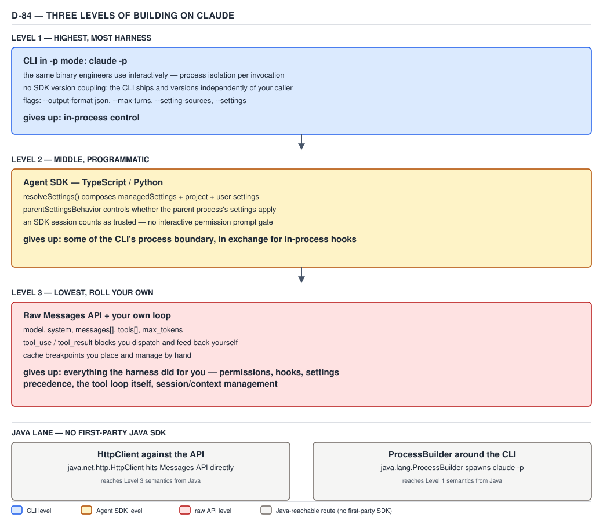

# 21 AI for Coding — three levels of building on Claude — ADVANCED (INTERNALS) (§3.8.1–3.8.4)

**Target version: Claude Code v2.1.2xx (August 2026).** | **Part 3 of 6** | [Index](../00-index.md)
Previous: [the fix, and the law it establishes](../setting-sources-incident/03-internals-b-the-fix-and-the-law.md) · Next: [Java, and the dependency contract](03-internals-b-java-and-the-dependency-contract.md)

PART 0 §0.3.12 (`ground-zero/03-basics-the-agent-loop.md`) promised this file would pay off one paragraph: that the Agent SDK and the raw Messages API are not siblings of Claude Code — they are **the same loop, with the harness written by you.** Everything in §0.3.1's three steps (assemble the request, the model emits `tool_use`, the harness decides and executes) is not a Claude Code feature. It is the shape of the Messages API itself. What changes across the three levels below is only *who wrote the harness half of that loop* — Anthropic, a thin SDK layer, or you, line by line.

## §3.8.1 The three levels, and what each gives up `[DOC]`

**Mental model first.** Picture the agent loop from §0.3.1 as a single mechanism with a sliding cover plate. At the top, the plate is fully closed — you never see the loop, you only see a terminal that reads and writes text, and every piece of harness engineering (permission checks, settings resolution, transcript storage, compaction) happens behind the plate. At the bottom, the plate is gone entirely — you are looking directly at the request and response JSON, and every one of those harness responsibilities is now a blank space with your name on it. The Agent SDK sits at the middle: the plate is half-open, kept closed over the bookkeeping (turn accounting, request reassembly, tool dispatch) but pulled back over the decisions (which tools exist, what gets approved, what gets logged).

**Why this exists:** three different engineering problems want three different amounts of "someone else already solved the boring parts." A CI job that needs to run the exact same coding agent your engineers use interactively wants zero divergence risk — level 1. A product team building a support-ticket triage agent with its own UI, its own tool catalogue, and its own idea of what "approved" means wants programmatic control without re-deriving the request-assembly loop — level 2. A team that needs a permission model, a context strategy, or a billing model Claude Code's harness does not offer at all — a fully custom approval queue gated on an external risk score, say — has no choice but level 3, because level 3 is the only level where every one of those knobs is actually yours to turn.

**How it works, level by level:**

| | Level 1 — CLI in `-p` mode | Level 2 — Agent SDK (TypeScript/Python) | Level 3 — raw Messages API, your own loop |
|---|---|---|---|
| What you call | `claude -p "<prompt>" --output-format json` as a subprocess | `query()` / `ClaudeSDKClient` from `@anthropic-ai/claude-agent-sdk` or `claude-agent-sdk` | `client.messages.create(...)` directly, or `client.messages.stream(...)` |
| Who assembles the request | The Claude Code harness, entirely | The SDK, using `resolveSettings()` to compose `managedSettings` + project + user settings before the first call | You — `model`, `system`, `messages[]`, `tools[]` on every call, by hand |
| Who runs the agent loop (§0.3.1) | The harness's internal loop; invisible to the caller | The SDK's loop: it reassembles the request, dispatches `tool_use` blocks to your registered tool handlers, and re-invokes | You — read `tool_use` blocks off the response, execute them yourself, append `tool_result` blocks, call `create()` again |
| Settings and permission surface | Whatever `.claude/settings.json` and friends resolve to for that directory, unmodified | `resolveSettings()` plus `parentSettingsBehavior`, which controls whether the parent process's settings apply at all — this is a knob level 1 does not expose | None — there is no settings file concept here unless you build one |
| Process/version coupling | None — the CLI binary versions and ships independently of your calling code | Tight — the SDK package version and the installed `claude` binary version must be compatible; a mismatch is a real, encounterable failure mode | None to Claude Code at all — you depend only on the Messages API's stability guarantees |
| **Gives up** | **In-process control** — you cannot intercept a tool call mid-flight in your own process; you get a JSON envelope back at the end (or a stream of JSON lines) and that is the entire interface | **Some of the CLI's process isolation**, in exchange for in-process hooks, typed results, and streaming callbacks | **Everything the harness did for you** — permission checking, hook execution, settings precedence, context compaction, session persistence, cost accounting, retry classification, the tool-execution loop itself |
| Who it is for | CI/CD steps, batch jobs, anything that wants "the exact tool engineers use, headless" with zero divergence risk | Products embedding a Claude-driven agent with their own UI and their own tool catalogue, who still want the harness's loop mechanics for free | Teams whose permission model, context strategy, or billing model is not the one Claude Code ships — the price of the freedom is rebuilding what §0.1–§0.3 spent this whole guide teaching you to respect |



**D-84** — Three levels of building on Claude, and what each gives up.

**The framing that matters:** "gives up" is the axis to read this table on, not "which is more powerful." Level 3 is not a worse version of level 1 — it is the only level where you can change the loop's rules at all, which is exactly why a product with its own permission model or its own context-management strategy has no alternative but to go there. The honest cost is that every failure mode this guide has spent three parts teaching you to respect as *the harness's job* — a stuck tool call that a turn ceiling alone won't catch (§0.3.5), a `tool_result` that leaks 40,000 tokens of raw JSON into every future turn (§0.3.4), a permission check that silently no-ops because a path resolved against the wrong `cwd` — becomes **your bug to write, find, and fix**, not Anthropic's or the Claude Code team's.

**Code — level 1, the invocation:**

```bash
claude -p "Summarize the failing tests in this repository and propose one fix." \
  --output-format json \
  --max-turns 20 \
  --permission-mode acceptEdits \
  --setting-sources user,project
```

**Code — level 2, the Agent SDK (TypeScript), showing exactly the two knobs the table names:**

```typescript
import { query } from "@anthropic-ai/claude-agent-sdk";

const result = query({
  prompt: "Summarize the failing tests in this repository and propose one fix.",
  options: {
    // resolveSettings() composes managedSettings with project/user settings
    // before the first request is assembled — this is not optional plumbing,
    // it is the SDK doing §1.2's precedence chain on your behalf.
    settingSources: ["user", "project"],
    // parentSettingsBehavior controls whether the settings of the *process
    // that launched this SDK session* apply at all. "isolated" means this
    // agent's settings resolution starts clean, ignoring whatever the parent
    // Node/Python process already had loaded.
    parentSettingsBehavior: "isolated",
    permissionMode: "acceptEdits",
    maxTurns: 20,
  },
});

for await (const message of result) {
  if (message.type === "result") {
    console.log(message.result, message.total_cost_usd);
  }
}
```

**Gotcha — re-verified, and subtler than the diagram's shorthand suggests.** The syllabus behind this leaf, and D-84 itself, both say "an SDK session counts as trusted — no interactive permission prompt gate." Re-verifying against `code.claude.com/docs/en/permissions` (2026-08-30) for the SDK specifically, rather than repeating that phrasing, turns up the same subtlety `permissions/06-directories-and-trust.md` already found for `-p`: quoted exactly —

> Claude Code shows the trust dialog in interactive sessions only. A `claude -p` run or an SDK session never shows it, and trusting a parent folder doesn't count for these rules.

— true, and —

> [`permissions.allow` rules and `additionalDirectories` in `.claude/settings.json`] Not used. Claude Code prints a `this workspace has not been trusted` warning to stderr.

— for the exact case of "`claude -p` or the SDK, folder never trusted." **"An SDK session counts as trusted" is not the general rule; it is the syllabus's shorthand for one narrow internal check** — whether an untracked `.claude/settings.local.json` is treated as "your own file" (applied without a dialog) versus repository-supplied (held back like `.claude/settings.json`). For that one check, and only that one, being in a `-p` or SDK session is treated the same as having accepted the dialog. For the general case — a fresh SDK session against a repository nobody has ever trusted — the committed `permissions.allow` list and `additionalDirectories` are **withheld**, exactly as they are for a `-p` run, with the same stderr warning. Building the Agent SDK into a service does not silently grant it more trust than a headless CLI call would; it inherits the identical untrusted-folder posture, and the identical "danger arrives after the first human ever trusts that exact path" shape §1.4.34's incident describes. Do not carry "SDK session, so trust doesn't apply" into a security review — the correct sentence is "SDK session, so *the dialog* doesn't apply, and until someone has triggered the equivalent of accepting it once, the capability grants it would have unlocked stay off."

**Case — a real system that chose level 1, and said why.** The **sdlc-harness** (`/Users/rajat.chikkodikar/Desktop/My-files/Codes/_non-clinet-tech/sdlc-harness`) is a production Python engine that runs every agent step as a `claude -p` subprocess, never the Python Agent SDK. `harness/src/harness/engine/agent.py` states the shape in its module docstring:

```
"""Stateless agent invocation (`claude -p`) + envelope parsing (RFC §1.7).

Agents are stateless: a fresh `claude -p` per call, full brief in, one JSON
envelope out. No `--resume` — cross-attempt memory is a cold feedback file
(handled by the loop), never a session. This module owns:
  - loading a persona `.md` and STRIPPING its `--- … ---` frontmatter
    (kept for callers that still want the raw body; not the identity seam),
  - building + running the `claude -p` command with a timeout,
  - tolerant extraction of the JSON envelope from noisy stdout,
  - parsing cost/tokens (modelUsage → top-level fallback).

The `run_agent` function is an injectable seam: tests swap it for a fake with
the same signature (no subprocess, no network). `parse_envelope` /
`extract_json_envelope` are pure and unit-tested directly.
"""
```

The choice is not an oversight — it is a named architectural rule. `docs/rfc/0001-harness-structural-refactor.md` lists the pattern the engine deliberately keeps:

```
2. **Strict acyclic layering + SDK quarantine** — vendor SDKs isolated behind a zero-SDK contract; engine stays vendor-agnostic. (We enforce this with `import-linter`, not a workspace.)
```

Two design properties fall directly out of this, and both would break under level 2: **process isolation as a test seam** — `run_agent` is a plain function with a subprocess boundary, so a test can swap it for a fake that returns a canned envelope with zero network calls and zero installed SDK, which is exactly how `tests/evals/test_code_to_commit_runner.py` and its siblings run without a `claude -p` call or cost; an in-process Agent SDK client is much harder to fake cleanly, because the loop, the tool dispatch, and the settings resolution all happen inside the same process as the test. **Vendor neutrality** — the engine's own words are "engine stays vendor-agnostic," naming a second vendor SDK (Codex) explicitly elsewhere in the same document; a subprocess boundary around a CLI binary is the cheapest point at which "which AI vendor" stops being a fact the engine's core logic needs to know.

**No gotcha beyond the trust point above: the rest of §3.8.1 is a static comparison table, not a stateful mechanism, so it has no separate surprising edge of its own.**

> Three levels sit between you and the same underlying loop — the CLI in `-p` mode, the Agent SDK, and the raw Messages API — and each one you descend trades a specific piece of harness engineering (process isolation, then settings/permission bookkeeping, then the loop itself) for a specific increase in what you are allowed to change.

## §3.8.2 The Messages API shape — enough to read one `[DOC]` `[RESEARCH]`

**Mechanism.** The Messages API's `create` call takes a flat set of top-level parameters, not a nested "conversation object." Verified directly against the installed `anthropic` Python client (`anthropic==0.117.0`, cached under `uv`, inspected rather than recalled) rather than the Claude Code documentation pages this guide is otherwise restricted to — the Agent SDK and the raw Messages API are documented on `platform.claude.com`, outside the nine `code.claude.com/docs/en/` pages this guide's `[DOC]` obligation is scoped to, so this leaf is grounded in the installed library's own type definitions instead of an out-of-scope URL. `Client.messages.create()`'s signature carries, among others: `max_tokens: int` (required), `messages: Iterable[MessageParam]` (required), `model: ModelParam` (required), `system: Union[str, Iterable[TextBlockParam]]`, `tools: Iterable[ToolUnionParam]`, `tool_choice`, `stream: Literal[False]` for the non-streaming path (a separate `stream()` method covers server-sent-event streaming), `temperature`, `top_k`, `top_p`, `stop_sequences`, and `thinking` (§0.3.10's extended-thinking config, at this level rather than Claude Code's `/effort`). A minimal, complete, real request:

```json
{
  "model": "claude-opus-4-6-20260115",
  "max_tokens": 1024,
  "system": "You are a build-fix assistant for a Java 21 / Spring Boot 3.x repository.",
  "messages": [
    { "role": "user", "content": "The build fails with a NullPointerException in ClaudeRunner.parseEnvelope. Diagnose it." }
  ],
  "tools": []
}
```

The response `Message` object (also read directly from the installed client's `types/message.py`) carries `id`, `content: List[ContentBlock]`, `stop_reason`, and a `usage` object with `input_tokens`, `output_tokens`, `cache_creation_input_tokens`, and `cache_read_input_tokens` — the four billed quantities §3.4 already introduced by name, confirmed here as literal response fields rather than a derived metric.

**Gotcha:** there is no `"system"` role inside `messages[]` — `system` is a distinct top-level parameter, and a request that instead puts a system-role entry into the `messages` array is simply malformed, not merely unconventional. This is the field-level version of §0.3.1's "the whole conversation is reassembled every call": `system` rides along unchanged on every request the same way the rest of the transcript does.

> The Messages API is a flat request — `model`, `system`, `messages[]`, `tools[]`, `max_tokens`, and a handful of sampling and thinking controls — sent whole on every call, with no server-held conversation state between requests.

## §3.8.3 Tool use at the API level — writing the dispatch loop yourself `[DOC]`

**Mechanism.** At the raw API level, §0.3.3's "the model does not call the tool" is not a design philosophy you take on faith — it is the literal absence of any code that would do otherwise. `create()` returns a `Message` whose `content` list may include a `ToolUseBlock` (confirmed from the installed client's `types/tool_use_block.py`: `id: str`, `input: Dict[str, object]`, `name: str`, `type: Literal["tool_use"]`). Nothing about that object executes anything. You read `name`, dispatch to whatever function your own code has registered under that name, run it, and package the outcome as a `ToolResultBlockParam` (from `types/tool_result_block_param.py`: `tool_use_id: str`, `type: "tool_result"`, `content`, `is_error: bool`) appended as a new `user`-role message. Then you call `create()` again with the grown `messages[]` list — you are, by hand, performing every step of §0.3.1's loop that Claude Code's harness and the Agent SDK otherwise perform for you.

A complete, minimal loop, real and runnable, using the same installed client:

```python
import json
from anthropic import Anthropic

client = Anthropic()

TOOLS = [{
    "name": "run_build",
    "description": "Run the Maven build and return the last 200 lines of output.",
    "input_schema": {"type": "object", "properties": {}, "required": []},
}]


def run_build() -> str:
    # Real tool body elided only here for length; in production this shells
    # out via subprocess.run(["mvn", "-q", "test"], capture_output=True) and
    # returns a curated tail of stdout, per §0.3.4's "a tool's output size is
    # a design decision" rule.
    return "BUILD FAILURE: ClaudeRunner.java:42: NullPointerException"


def run_loop(user_prompt: str) -> str:
    messages = [{"role": "user", "content": user_prompt}]
    while True:
        response = client.messages.create(
            model="claude-opus-4-6-20260115",
            max_tokens=1024,
            tools=TOOLS,
            messages=messages,
        )
        messages.append({"role": "assistant", "content": response.content})

        tool_uses = [b for b in response.content if b.type == "tool_use"]
        if not tool_uses:
            text_blocks = [b.text for b in response.content if b.type == "text"]
            return "\n".join(text_blocks)

        tool_results = []
        for block in tool_uses:
            if block.name == "run_build":
                output = run_build()
            else:
                output = f"Unknown tool: {block.name}"
            tool_results.append({
                "type": "tool_result",
                "tool_use_id": block.id,
                "content": output,
            })
        messages.append({"role": "user", "content": tool_results})
```

This is the harness-engineer's job §0.3.12 warned about, made concrete: `run_loop` is doing exactly what the Claude Code harness's step 3 does (§0.3.1), with no permission check, no turn ceiling, no compaction, and no cost accounting — all four are now missing by construction, not by oversight, until you add them.

**Gotcha:** there is no built-in stopping condition here beyond "the model stopped asking for tools." Without your own turn limit, a model that keeps calling `run_build` because the fix never lands will loop until you add the bound yourself — the raw API has no `--max-turns` to borrow.

**Java** does not have a first-party Agent SDK to write this loop for it, but the loop's shape is language-agnostic: a request/response record pair, a `switch` over the response's content blocks, and a mutable transcript list you append to before looping. **PART 4 §4.5 builds this for real in Java** — a `ClaudeRunner` wired around `claude -p --output-format json` (level 1, not the raw API) with a matching `ClaudeEnvelope` record and an `AgentTimeoutException` for the missing turn/wall-clock bound this section just demonstrated going unenforced. See `build-it/05-orchestrator-a-the-runner.md`; it is not rebuilt here.

> A `tool_use` block from the raw Messages API and a `tool_result` block back are ordinary JSON your own code produces and consumes — the "loop" at this level is nothing more than a `while` loop over `messages.create()` that you write, dispatch, and bound yourself.

## §3.8.4 Prompt caching at the API level — cache breakpoints and what they cost `[DOC]` `[NUM]`

**Mechanism.** A cache breakpoint is a `cache_control` field attached to a specific content block — confirmed from the installed client's `types/cache_control_ephemeral_param.py`: `{"type": "ephemeral", "ttl": "5m" | "1h"}`, defaulting to `5m` when `ttl` is omitted. Anthropic's server caches everything **up to and including** that block for the given time-to-live; a later request whose prefix matches the cached prefix exactly reuses it instead of reprocessing those tokens. This is the API-level version of the same idea §0.2 (context window/compaction) built on top of: a long, stable prefix — a system prompt, a large tool catalogue, a big pasted file — does not need to be paid for at full price on every turn if it is marked as a breakpoint.

```json
{
  "model": "claude-opus-4-6-20260115",
  "max_tokens": 1024,
  "system": [
    {
      "type": "text",
      "text": "You are a build-fix assistant for a Java 21 / Spring Boot 3.x repository. <30,000 tokens of house style rules and API references omitted only in this illustration, never in a real request>",
      "cache_control": { "type": "ephemeral", "ttl": "1h" }
    }
  ],
  "messages": [
    { "role": "user", "content": "The build fails with a NullPointerException in ClaudeRunner.parseEnvelope. Diagnose it." }
  ],
  "tools": []
}
```

`cache_control` can also sit on a `tool_result` block (per `types/tool_result_block_param.py`), which matters directly for §3.8.3's loop: a large, stable `run_build` output that will be referenced again later in the same session is a legitimate breakpoint candidate, for the same reason a verbose tool result is a cost concern in §0.3.4 generally.

**`[NUM]`, and where this file draws the line honestly.** Anthropic's pricing model for prompt caching charges a **premium** to write a new cache entry and a **discount** to read a cache hit, relative to that model's ordinary input-token price — this mechanism is well established and is what makes a cache breakpoint a cost trade rather than a free win. This file does not print the exact write and read multipliers as a verified number: they live on `platform.claude.com`'s pricing and prompt-caching pages, outside both the nine `code.claude.com/docs/en/` pages this guide's `[DOC]` obligation is scoped to and the installed Python client's own source (pricing is not encoded in the SDK — only the `ttl` enum and the `usage` field names are). Rather than repeat a remembered figure as fact, this is marked **Unverified:** below and left as an open question naming exactly which page would settle it, per this file's research protocol.

**Gotcha:** a cache breakpoint you set once is not automatically maintained by the API the way §0.2's compaction budget is maintained by the Claude Code harness — if the TTL lapses before the next request arrives (a `5m` breakpoint against a session that goes idle for six minutes), the next call is a full cache write again, at the write premium, not a free carry-forward. Placing a breakpoint is a bet that the next request lands inside the TTL window; a `1h` breakpoint is the tool for a session with irregular pacing, a `5m` one for a tight, fast-turnaround loop.

> A cache breakpoint is a `cache_control: {"type": "ephemeral", "ttl": "5m"|"1h"}` marker on a content block, telling the API to cache everything up through that block for reuse by a later request with the same prefix — paid for at a write premium once, and at a read discount on every hit inside the TTL, never for free.

## Pitfalls

- **Belief:** "an SDK session counts as trusted, so wiring the Agent SDK into a service is safer against an untrusted repository's `allow` rules than shelling out to `claude -p`." **Outcome:** the two are identical — a fresh SDK session against a folder nobody has trusted withholds `permissions.allow` and `additionalDirectories` exactly like a `-p` run, printing the same stderr warning; "counts as accepted" only ever applied to one narrow untracked-`settings.local.json` check, never to the general permission surface. **Fix:** treat SDK and `-p` as the same untrusted-folder posture for security review purposes; gate trust at the path (`hasTrustDialogAccepted`) or strip project settings with `--setting-sources user` / `settingSources` excluding `project`, not by choosing one calling convention over the other. **Why people believe it:** the phrase "counts as accepted" is real and does appear in the documentation, just attached to a narrower claim than the one it gets generalized into.
- **Belief:** "writing your own loop against the raw Messages API is strictly more work for no benefit, so always prefer the SDK or the CLI." **Outcome:** teams needing a permission model, context strategy, or billing model Claude Code does not ship (a custom risk-scored approval queue, a bespoke context-eviction policy) find there is no lever at levels 1 or 2 to pull — the SDK's `parentSettingsBehavior` and `resolveSettings()` compose *Claude Code's* settings model, not an arbitrary one. **Fix:** pick level 3 deliberately when the requirement is "change a rule the harness enforces," not as a default; for everything else, levels 1 and 2 give the same loop for less code. **Why people believe it:** "more code" reads as "worse" outside the specific case where the extra code is the only place the needed control actually lives.
- **Belief:** "a cache breakpoint's TTL renews itself as long as the session keeps going." **Outcome:** a `5m` breakpoint against a session idle for six minutes silently falls back to a full-price cache write on the next call, with no error — the cost just goes up quietly. **Fix:** match the TTL to the actual pacing of the calling pattern (`1h` for irregular, human-paced sessions; `5m` for a tight agent loop that always calls back inside the window), and treat a `[NUM]`-worthy cost claim here as unverified until measured against `platform.claude.com`'s current pricing page rather than assumed stable across model releases. **Why people believe it:** "cache" in every other context (browser caches, CDN caches) implies persistence until evicted, not a fixed clock that resets on read alone.

## Cheat sheet

| Level | Call shape | Settings/permission source | Version coupling | Gives up |
|---|---|---|---|---|
| 1 — CLI `-p` | `claude -p ... --output-format json` subprocess | `.claude/settings.json` and friends, unmodified | None (CLI versions independently) | In-process control |
| 2 — Agent SDK | `query()` / `ClaudeSDKClient` (TS/Python) | `resolveSettings()` + `parentSettingsBehavior` | SDK package version ↔ installed `claude` binary | Some process isolation, for in-process hooks |
| 3 — raw Messages API | `client.messages.create(...)`, your own loop | None — you build it | None to Claude Code | Everything the harness did: permissions, hooks, settings precedence, compaction, session state, cost accounting, retry classification |
| Java route | `HttpClient` → Level 3 semantics, or `ProcessBuilder` around `claude -p` → Level 1 semantics | — | — | No first-party Java Agent SDK |
| Messages API fields | `model`, `system`, `messages[]`, `tools[]`, `max_tokens`, `tool_choice`, `stream`, `thinking` | — | — | No server-held conversation state |
| `tool_use` block | `id`, `name`, `input`, `type: "tool_use"` | — | — | Does not execute anything |
| `tool_result` block | `tool_use_id`, `content`, `is_error`, `type: "tool_result"` | — | — | You build the dispatch, not the API |
| Cache breakpoint | `cache_control: {"type": "ephemeral", "ttl": "5m"\|"1h"}` | — | — | Write premium once, read discount per hit inside TTL |

## Self-test

1. What is the one-sentence difference between what the CLI gives up and what the raw Messages API gives up?
<details><summary>Answer</summary>The CLI in `-p` mode gives up in-process control — you get a subprocess boundary and a final JSON envelope, nothing mid-flight. The raw Messages API gives up everything the harness does for you: permission checking, hook execution, settings precedence, context compaction, session persistence, cost accounting, and the tool-execution loop itself, all of which become code you must write.</details>

2. Is "an SDK session counts as trusted" true for a fresh, never-trusted repository's committed `permissions.allow` rules?
<details><summary>Answer</summary>No. It never shows the trust dialog, which is true, but for an untrusted folder the committed `allow` rules and `additionalDirectories` are withheld exactly as they are for `claude -p`, with a `this workspace has not been trusted` warning printed to stderr. "Counts as accepted" is the syllabus's shorthand for a narrower internal check — whether an untracked `.claude/settings.local.json` is treated as the caller's own file — not a statement about the general permission surface.</details>

3. In the raw Messages API, where does the system prompt go, and why does the answer matter?
<details><summary>Answer</summary>In the top-level `system` parameter, never as a `"system"`-role entry inside `messages[]` — there is no such role. It matters because it is a direct, field-level instance of the request being reassembled and resent whole on every call (§0.3.1); `system` is not special-cased into some persistent slot on the server.</details>

4. What two fields does a `tool_use` block carry that your own dispatch code reads, and what does the block never do by itself?
<details><summary>Answer</summary>`name` (which tool was requested) and `input` (the arguments, matching that tool's schema). By itself the block never executes anything — the calling code is entirely responsible for looking up `name`, running the corresponding function, and packaging the result as a `tool_result` block keyed to the original block's `id` via `tool_use_id`.</details>

5. Why does sdlc-harness quote "SDK quarantine" as a reason to prefer `claude -p` subprocesses over the Python Agent SDK?
<details><summary>Answer</summary>Because a subprocess boundary keeps the engine's core logic vendor-agnostic — `run_agent` is an injectable seam tests can fake with no subprocess and no network — and isolates a vendor SDK (Claude's or, named explicitly in the same document, Codex's) behind a contract the rest of the engine never has to know about. An in-process Agent SDK client would put the loop, tool dispatch, and settings resolution inside the same process as the code under test, making that isolation much harder to hold.</details>

6. What happens to a `5m` cache breakpoint if the next request arrives seven minutes later?
<details><summary>Answer</summary>The TTL has lapsed, so the cached prefix is gone; the next request is a full cache write again at the write premium, not a discounted hit and not a free carry-forward. The TTL should be chosen to match the actual pacing of the calling pattern, not assumed to renew on its own.</details>

7. Name one thing PART 4's Java orchestrator (`ClaudeRunner`) builds that this file deliberately does not.
<details><summary>Answer</summary>The actual `ProcessBuilder`-around-`claude -p` implementation with its `ClaudeEnvelope` record and `AgentTimeoutException` for a missing turn/wall-clock bound — this file only names that the raw loop has no such bound built in and points forward to `build-it/05-orchestrator-a-the-runner.md` where it is built for real.</details>

## Open questions

**Unverified:** the exact prompt-caching write and read price multipliers relative to a model's ordinary input-token price — the mechanism (a write premium, a read discount, a `5m`/`1h` TTL choice) is confirmed from the installed `anthropic` Python client's own `CacheControlEphemeralParam` type, but the numeric multipliers live on `platform.claude.com`'s pricing and prompt-caching pages, outside both the nine `code.claude.com/docs/en/` pages this guide's `[DOC]` obligation is scoped to and the installed client's source. Settle by checking `platform.claude.com/docs/en/build-with-claude/prompt-caching`.

**Unverified:** whether Anthropic publishes a first-party Java client library for the raw Messages API itself (distinct from the Agent SDK, which is confirmed TypeScript/Python only) — this file follows the dispatch's and D-84's framing that the two Java-reachable routes are `HttpClient` against the API and `ProcessBuilder` around the CLI, but did not independently confirm the absence or presence of an official Java Messages-API client against a permitted source this session.

---

**Leaves covered:** 3.8.1–3.8.4 (4 leaves)
**Leaves deferred:** none
**Diagrams included:** D-84
**Target version:** Claude Code v2.1.2xx (August 2026)
**Lines:** 284
