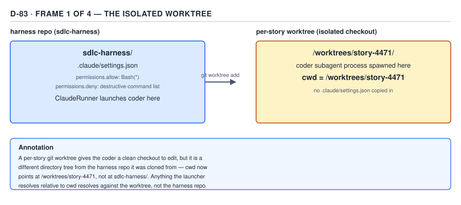
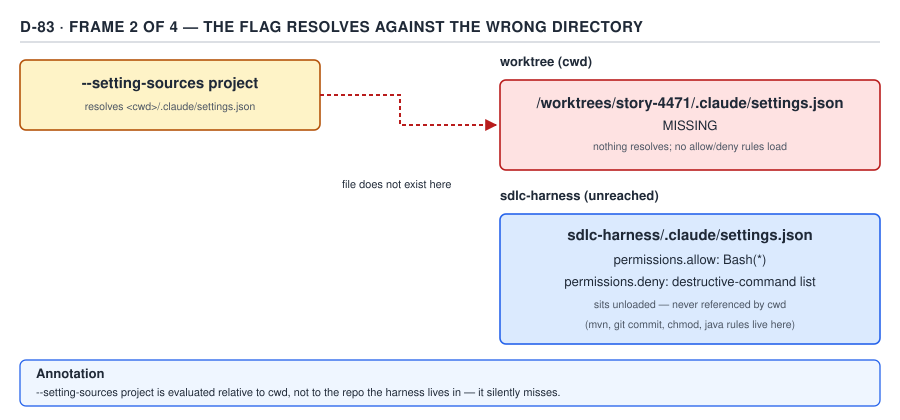
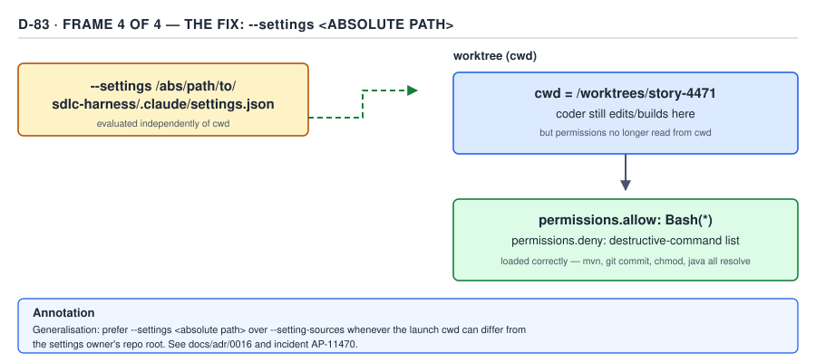

# 21 AI for Coding — the `--setting-sources` failure — ADVANCED (INTERNALS) (§3.7.1–3.7.5)

**Target version: Claude Code v2.1.2xx (August 2026).** | **Part 3 of 6** | [Index](../00-index.md)
Previous: [resolution order: parameter, env, default](../headless/03-internals-d-resolution-order.md) · Next: [the fix, and the law it establishes](03-internals-b-the-fix-and-the-law.md)

Four earlier files set this up without resolving it, deliberately. §1.2.6 established that a
worktree's *local* settings file — `.claude/settings.local.json` — is read from the **main
checkout's root**, not from the worktree itself. §1.2.16 drew the line between `--setting-sources`
(which layers load at all) and precedence (which loaded layer wins), and declined to say what
happens when a layer that should load, doesn't. §1.4.26 named the gap `acceptEdits` leaves open —
a build tool, a VCS command, a `chmod` — and called it "the point of the §3.7 incident" without
saying what the incident was. §3.6.15–3.6.18, the previous file, traced `run_agent`'s
resolution chain to its fourth site, `settings`, and stopped at the observation that it is the one
knob with no default — "the escape hatch... when `cwd` is not what the caller assumed." This file
is where all four threads land. The grounding is the real `sdlc-harness` engine at
`/Users/rajat.chikkodikar/Desktop/My-files/Codes/_non-clinet-tech/sdlc-harness` — specifically
`harness/src/harness/engine/agent.py`, `harness/src/harness/engine/workspace.py`,
`harness/src/harness/engine/cli.py`, and `docs/adr/0016-deterministic-stateless-engine.md`, whose
"Follow-up (AP-11470 fix — 2026-07-08)" section is the incident's own paper trail.

### 1. The setup: an isolated per-story git worktree (§3.7.1)

**Mental model.** Picture two engineers sharing one git remote but never one working directory —
each checks out their own copy, edits it, and pushes, so neither can stomp on the other's
uncommitted state. `sdlc-harness` gives every **story** (one unit of coder work) that same
isolation from every *other* story, and from the engineer's own terminal session, by giving it a
private `git worktree`: a second working directory backed by the same `.git` object store, on its
own branch, that the engine creates, edits inside, commits inside, and tears down — all without
ever touching the checkout the engineer is looking at.

**Why it exists.** `[CASE]` The module docstring states the property directly:

```python
"""Per-story git worktree isolation (RFC Phase 0 #8).

The engine NEVER mutates the engineer's checkout. Every attempt's coder edits,
verify build/test, commit and push run inside a dedicated linked worktree on
branch `harness/<slug>`, created under the gitignored scratch dir. Two runs =>
two stories => two worktrees => no branch race. The worktree persists across
crashes (so resume reuses the same edits) and is torn down via
`git worktree remove` + `prune` — NEVER `rm -rf` (CLAUDE.md rule).
"""
```

`workspace.py`

Two runs racing on the same branch would corrupt each other's edits; two runs each in their own
worktree cannot, because a linked worktree is a distinct directory tree with its own index and its
own `HEAD`, sharing only the object database. ADR 0016 makes this a named decision (point 8, "Per-
story git worktree... The engine never mutates the engineer's checkout; parallel runs can't race")
and a named positive consequence ("Isolation: worktree kills the parallel-run branch race").

**How it works.** `[CASE]` `ensure_worktree` in `workspace.py` is the single call site:

```python
def ensure_worktree(repo: str, story: str, worktree_path: str, base: Optional[str] = None) -> str:
    """Create the story's worktree if absent, reuse it if already present.

    Returns the worktree path. Raises WorkspaceError on git failure.
    """
    branch = branch_name(story)
    wp = os.path.abspath(worktree_path)

    if wp in _registered_worktrees(repo) and os.path.isdir(worktree_path):
        return worktree_path  # reuse — a resumed run's edits live here

    # Not a live worktree: clear any stale registration, then create.
    _git(repo, "worktree", "prune")
    parent = os.path.dirname(worktree_path)
    if parent:
        os.makedirs(parent, exist_ok=True)

    if _branch_exists(repo, branch):
        _git_ok(repo, "worktree", "add", wp, branch)
    else:
        base_ref = base or _default_base(repo)
        _git_ok(repo, "worktree", "add", "-B", branch, wp, base_ref)
    return worktree_path
```

`workspace.py`

`cli.py` resolves `worktree_path` as an absolute path under a per-story scratch directory and hands
it to `run_agent` as `cwd`:

```python
worktree_path = str(scratch / "worktree")
...
result = run_loop(
    ...
    cwd=worktree_path,
    ...
)
```

`cli.py` (paraphrasing the surrounding call for length; the `cwd=worktree_path` line itself is
verbatim)



**D-83a** — Frame 1 of 4. The coder subagent process is spawned with `cwd` pointing at
`/worktrees/story-4471`, not at the `sdlc-harness` checkout that holds `.claude/settings.json`
with the harness's `Bash(*)` allow rule. Nothing has gone wrong yet — this is only the setup.

`[CASE]` A reproduction, run in a disposable scratch repository under `/tmp` (never inside
`sdlc-harness`, which stays read-only), confirms the ordinary case first — the case where a git
worktree behaves exactly as expected: a tracked `.claude/settings.json` committed on the base
branch **is** checked out into a fresh worktree, because `git worktree add` is a normal checkout of
tracked content, not a sparse or symlinked view.

```
$ ls -la /tmp/ssi-repro/.claude/          # main checkout
settings.json

$ git -C /tmp/ssi-repro worktree add -b story/4471 /tmp/ssi-repro-wt main
$ ls -la /tmp/ssi-repro-wt/.claude/       # freshly created worktree
settings.json
```

That is worth stating precisely because `agent.py`'s own docstring (quoted in full in §2 below)
asserts the worktree "has no `.claude/` directory at all," and a plain worktree of a repo whose
`.claude/settings.json` is already tracked does **not**, by itself, produce that condition — `git
ls-files .claude/` in the real `sdlc-harness` repo confirms `.claude/settings.json` has been
tracked since 2026-04-17, three months before the 2026-07-08 incident date in ADR 0016's Follow-up.
**Unverified:** exactly which condition made this specific incident's worktree lack a `.claude/`
directory — the story branch cut from a base ref that predated that commit, a worktree created
before the file was added and never refreshed, or another repo-state detail not visible in the
static code — is not settled by anything in the repository or its docs; recorded in `## Open
questions`. What *is* settled, and is the actual mechanism this file exists to teach, is
independent of that detail: **whatever the reason a worktree's checked-out tree lacks
`.claude/settings.json`, `--setting-sources project` has no fallback to the main checkout when it
does** — which §2 shows directly from the documentation.

**Gotcha.** No gotcha in the isolation mechanism itself — a linked worktree correctly shares the
object database and correctly gives each story its own index and `HEAD`. The gotcha belongs to the
*settings* resolution built on top of it, not to the worktree, and is the subject of §2–§4.

> A per-story git worktree gives the engine a private, race-free checkout per story by creating a
> second working directory on its own branch, sharing only the `.git` object store with the
> engineer's own checkout — and every subprocess the engine launches inside it runs with `cwd`
> pointing at that worktree, not at the repository root.

### 2. The mechanism: `--setting-sources project` resolves against `cwd` (§3.7.2)

**Mental model.** `--setting-sources` answers *which* settings layers participate at all — user,
project, local — a question §1.2.16 already separated from precedence. What that file left open is
*where* the CLI looks to satisfy "project": not a fixed path baked into the binary, but a directory
it has to be told, and the only directory it is ever told is the process's own working directory.

`[DOC]` Re-verified against `https://code.claude.com/docs/en/settings`, 2026-08-30. The page states
plainly where the shared project file is read from:

> Claude Code reads the shared `.claude/settings.json` from the session's primary working
> directory, so to use a file committed at the repository root, start Claude Code there.

— *Claude Code settings*, re-verified 2026-08-30.

The **same page**, in the section on the project-local file, draws the one worktree carve-out that
exists — and draws it narrowly:

> If you start Claude Code in a subdirectory of a git repository, it reads and writes that file at
> the repository root and applies the approval across the whole repository. In a
> [worktree](https://code.claude.com/docs/en/worktrees), it uses the file at the main checkout's root.

— *Claude Code settings*, re-verified 2026-08-30.

That sentence is about `.claude/settings.local.json` only — the file Claude Code itself writes when
you approve a command with "don't ask again," covered by §1.2.6. **The shared project file,
`.claude/settings.json`, gets no such carve-out anywhere on the page.** It is read from "the
session's primary working directory," full stop, and a linked worktree's primary working directory
is the worktree, not the main checkout. This is precisely the asymmetry a reader who over-
generalises §1.2.6 will miss: "local settings follow you back to the main checkout in a worktree"
is true; "project settings follow you back to the main checkout in a worktree" is not documented
anywhere, and the harness's own incident is what happens when an engineer assumes it is.

`[CASE]` `run_agent` in `agent.py` documents exactly this in its own docstring, and it is the site
three other files in this part have already quoted pieces of:

```python
`settings` (when given) is a path to a settings JSON file loaded via
`--settings`, evaluated independently of `cwd`. Without it, `--setting-sources
project` resolves against `cwd` — which for the coder/reviewer is the
isolated per-story worktree (engine/cli.py), not the harness repo — so the
harness's own `permissions.allow`/`deny` rules (Bash(*) plus the destructive-
command deny-list) never load and the agent is left with bare `acceptEdits`
defaults (reads/edits/mkdir/touch/mv/cp/sed only — not `mvn`, `git commit`,
`chmod`, `java`). See docs/adr/0016 and the AP-11470 incident.
```

`agent.py`

and the command assembly one screen below it never varies the flag by `cwd`:

```python
cmd += [
    "--setting-sources",
    setting_sources or os.environ.get("HARNESS_SETTING_SOURCES") or DEFAULT_SETTING_SOURCES,
]
```

`agent.py` — `DEFAULT_SETTING_SOURCES = "user,project"`, the previous file's §2



**D-83b** — Frame 2 of 4. `--setting-sources project` resolves `<cwd>/.claude/settings.json` —
here, `/worktrees/story-4471/.claude/settings.json` — and finds nothing. `sdlc-harness/.claude/
settings.json`, with its `Bash(*)` allow rule and destructive-command deny-list, sits two directory
levels away, unreached, because nothing about the flag's resolution ever looks there.

A full, real invocation of the affected command, exactly as `run_agent` assembles it before the
fix (`settings` unset, `HARNESS_AGENT_SETTINGS` unset):

```
claude -p "implement the story per the attached plan" \
  --agent backend-architect \
  --output-format json \
  --max-turns 160 \
  --permission-mode acceptEdits \
  --setting-sources user,project
```

Run with `cwd=/worktrees/story-4471` and no `.claude/` directory present there, this line loads the
**user**-scope settings (`~/.claude/settings.json`, resolved from the home directory, independent
of `cwd`) and attempts, and fails, to load the **project**-scope settings — the harness's own
`.claude/settings.json` never enters the picture.

**Gotcha.** `[TRAP]` **Pitfall:** treating `--setting-sources project` as "load the project's
settings" in the way a person means "the project" — the repository the engineer thinks of as home.
The symptom: the flag does exactly what it says, using the CLI's own definition of "project" (the
process's working directory), which silently diverges from the engineer's the instant a launcher
sets `cwd` to anything other than the repository root. **The fix:** read "project" in
`--setting-sources` as "whatever `.claude/` sits under `cwd` right now," never as "the repository
this code lives in," and treat any subprocess launcher that sets a non-repo-root `cwd` — a
worktree, a container mount, a CI checkout step — as a place this resolution needs re-checking.
**Why people believe it:** the project-local carve-out for `.claude/settings.local.json` (§1.2.6)
is real, documented, and specifically about worktrees, so it reads as evidence that "project" scope
in general is worktree-aware; it is aware for exactly one of the two project-scoped files, and
`.claude/settings.json` — the one carrying the harness's own permission rules — is not it.

> `--setting-sources project` resolves `.claude/settings.json` from the session's primary working
> directory with no worktree fallback to the main checkout — unlike `.claude/settings.local.json`,
> which the documentation explicitly redirects to the main checkout's root in a worktree.

### 3. The consequence: the harness's own rules never load (§3.7.3)

`[CASE]` The file that should have loaded, read directly from the read-only repository:

```json
{
  "permissions": {
    "allow": ["Read(**)", "Edit(**)", "Bash(*)", "mcp__atlassian-cloud__*"]
  },
  "enabledPlugins": {
    "pyright-lsp@claude-plugins-official": true,
    "typescript-lsp@claude-plugins-official": true,
    "jdtls-lsp@claude-plugins-official": true,
    "sdlc-harness@sdlc-harness": true
  }
}
```

`.claude/settings.json`, `sdlc-harness` repository root

`Bash(*)` is the one line that matters here: an `allow` rule matching every Bash command, which is
what lets a headless coder run `mvn`, `git commit`, `chmod`, or `java` without a human present to
answer a permission prompt. **Note the divergence:** ADR 0016's own Follow-up describes "the
deny-list this ADR believed was protecting the run" as failing to load alongside the allow rule,
and a regression-guard test (`tests/scripts/test_harness_improvements.py`,
`test_project_settings_allows_headless_bash`) asserts this exact file's four allow entries by name
— but this project-scope file, as read here, carries **no `permissions.deny` key at all**. ADR 0026
(`docs/adr/0026-prod-read-access-seam.md`) places the harness's destructive-command and prod-write
denials at **user** scope instead — `~/.claude/settings.json`, "L1: Blanket deny... in user-scope
`~/.claude/settings.json`" — and per §2's doc quote, user-scope settings resolve from the home
directory, independent of `cwd`. Taken at face value, that would mean the deny-list survives a
worktree-`cwd` mismatch that the allow rule does not, since `--setting-sources user,project` still
loads the `user` layer correctly. **Unverified:** whether the specific incident's deny rules lived
in a different location at the time (project scope, before a later reorganisation) is not settled
by the current file tree, and is recorded in `## Open questions`. The teaching point that does not
depend on resolving it: **`Bash(*)` is a project-scope rule, project scope is the layer this
incident silently drops, and `Bash(*)` failing to load is sufficient on its own to produce every
symptom in §4** — a missing deny rule would only matter for the failure mode this incident did not
produce (destructive commands running unchecked), not the one it did (safe commands refused).

**Insight:** an `allow` rule and a `deny` rule failing to load have opposite blast radii. A deny
rule silently missing is a safety regression — the agent can now do something it should have been
stopped from doing, with no symptom until the wrong thing actually happens. An allow rule silently
missing is a productivity regression with an immediate, loud symptom — the agent is now blocked
from something it should have been allowed to do, on the very first attempt. AP-11470 is entirely
the second kind: nothing dangerous ran, because nothing beyond the bare permission-mode default
ran at all.

### 4. The observed symptom, precisely (§3.7.4)

`[CASE]` `[NUM]` ADR 0016's Follow-up states the observed shape directly:

```
Symptom (AP-11470, ABS Recon Tier D): the coder could Write/Edit freely
(acceptEdits's own baseline) but every other Bash command — mvn, git commit,
chmod, java — hard-denied with "This command requires approval," since a
headless -p process has no human to answer that prompt.
```

`docs/adr/0016-deterministic-stateless-engine.md`

The syllabus names four working commands — `mkdir`, `touch`, `mv`, `cp` — and `agent.py`'s own
docstring, quoted in §2, names five: `mkdir`, `touch`, `mv`, `cp`, `sed`. **Both undercount.**
`permissions/05-modes.md` in this same guide re-verified the documented `acceptEdits` set against
`https://code.claude.com/docs/en/permission-modes` and found **seven** filesystem commands, not
four or five: `mkdir`, `touch`, `rm`, `rmdir`, `mv`, `cp`, `sed`, plus ordinary file edits — every
one of them scoped to the working directory or `additionalDirectories`. `rm` and `rmdir` are absent
from `agent.py`'s own comment, which is itself a stale, incomplete restatement of the mode default
it is describing — a divergence inside the very source file the incident is grounded in. It does
not change which commands should have worked, because `rm` and `rmdir` are auto-approved by
`acceptEdits` regardless of whether any settings file loads at all; it changes how completely the
comment states the set it is relying on.

| Command | Ran without a prompt? | Why |
|---|---|---|
| Read, Edit (file tools) | Yes | `acceptEdits` baseline — not a Bash command at all |
| `mkdir`, `touch`, `rm`, `rmdir`, `mv`, `cp`, `sed` | Yes | The full seven-command `acceptEdits` filesystem allowlist (`permissions/05-modes.md`, §1.4.26), independent of any settings file |
| `mvn` | No — hard-denied | Not in the `acceptEdits` allowlist; needs `Bash(*)` from project settings, which never loaded |
| `git commit` | No — hard-denied | Same |
| `chmod` | No — hard-denied | Same |
| `java` | No — hard-denied | Same |


**D-83c** — Frame 3 of 4. The split is exactly the `acceptEdits` boundary from `permissions/05-
modes.md` §1.4.26: everything on the left is auto-approved by the *mode* alone, with no settings
file required; everything on the right needed `permissions.allow`/`deny` from a settings layer that
never resolved.

`[PROVE]` The failure is legible precisely because it is not "permissions are broken" — it is a
symptom that names its own cause, once the reader knows the mechanism: every working command is in
the mode's own default allowlist, and every refused command is outside it. A build that fails this
way looks nothing like a broken build and nothing like a broken permission system; it looks like an
agent that can edit files correctly and then, at the moment it needs to compile or commit, behaves
as if no configuration exists at all — because for the project layer, none does. ADR 0016 records a
second-order confirmation of the same defect class nine days after the fix first landed: a later
commit (`a8c0bbb`, per the regression-guard test `test_project_settings_allows_headless_bash`)
deleted the entire `permissions` object from this file while migrating other keys to plugin and
user scope, silently reverting the fix and leaving every headless coder unable to commit its own
work until the regression test caught it — a second, independent occurrence of exactly this
symptom, from an unrelated cause, nine days apart.

**Gotcha.** `[TRAP]` **Pitfall:** debugging this by inspecting the permission *rules* — rereading
`permissions.allow`, checking `deny` patterns, looking for a typo in `Bash(*)`. The symptom gives no
reason to suspect the rules are wrong, because they are not being evaluated at all; the settings
file that would carry them was never read. **The fix:** when a subset of commands is refused in a
pattern that exactly matches one permission mode's bare defaults, check whether a settings *layer*
loaded before checking whether a *rule* is correct — `claude --setting-sources project --settings
- <<'EOF'` style dry runs, or simply confirming `<cwd>/.claude/` exists, answers the question in
seconds. **Why people believe it:** a permission refusal reads as a permissions-configuration
problem by default, and the actual defect — an entire settings layer silently absent — produces no
error distinguishable from "the rule was written wrong."

### 5. The fix, and where it lands (§3.7.5)

`[CASE]` `cli.py` computes the escape hatch `run_agent`'s docstring names, resolved against the
harness's own root rather than `cwd`:

```python
# Resolved against harness_root (the injected root, never __file__-derived
# or worktree_path) — see run_loop()/run_agent() docstrings for why cwd
# can't be used for this.
agent_settings = args.agent_settings or str(harness_root / ".claude" / "settings.json")
```

`cli.py`

and `agent.py` appends it as a flag independent of `--setting-sources` entirely:

```python
resolved_settings = settings or os.environ.get("HARNESS_AGENT_SETTINGS")
if resolved_settings:
    cmd += ["--settings", resolved_settings]
```

`agent.py`

A test in `tests/engine/test_agent_envelope.py` pins the resulting command line directly:

```python
def test_run_agent_settings_flag_passed_when_given(monkeypatch, tmp_path):
    ...
    run_agent("coder", "task", cwd=str(tmp_path / "wt"), persona="backend-architect",
              settings=settings_path)

    cmd = captured["cmd"]
    assert "--settings" in cmd and cmd[cmd.index("--settings") + 1] == settings_path
```

`tests/engine/test_agent_envelope.py`



**D-83d** — Frame 4 of 4. `--settings <absolute path to sdlc-harness/.claude/settings.json>` loads
`permissions.allow`'s `Bash(*)` correctly regardless of where `cwd` points, because the flag
resolves against the path given, not against the process's working directory — `mvn`, `git commit`,
`chmod`, and `java` all resolve once it is present.

This section stops at naming the fix and showing it in the code — **why `--settings` is the right
fix rather than a workaround, the generalisation this incident yields for any subprocess launcher
with a movable `cwd`, and the general law it establishes are the next file's job (§3.7.6–3.7.9)**,
not this one's. What this file has done is establish, in order: an isolated worktree moves `cwd`
away from the repository (§1); `--setting-sources project` has no fallback for that move, unlike
the narrower `.claude/settings.local.json` carve-out (§2); the harness's own `Bash(*)` allow rule is
exactly what that move drops (§3); the drop produces a legible, mechanism-named symptom rather than
an opaque one (§4); and a `--settings <absolute path>` flag already exists in the real code as the
resolution the reader can see coming (§5). The next file picks up from here.

## Pitfalls

- **Belief in action:** "the worktree carve-out for `.claude/settings.local.json` (§1.2.6) means
  project settings in general follow a worktree back to the main checkout." **Surprising outcome:**
  the shared `.claude/settings.json` — the file carrying `Bash(*)` and any deny rules — has no such
  carve-out; it is read from "the session's primary working directory" with no worktree exception,
  so it silently finds nothing when that directory is an isolated worktree with no `.claude/` of
  its own. **What actually gets the guarantee:** treat the two project-scoped files as having
  different worktree behaviour and check each independently — `.claude/settings.local.json`
  resolves at the main checkout's root; `.claude/settings.json` resolves at `cwd`, full stop. **Why
  people believe it:** both files live under the same `.claude/` directory and are usually discussed
  together as "project settings," so a documented exception for one reads as applying to both.
- **Belief in action:** a subset of Bash commands being refused means a permission *rule* is wrong
  — a typo in an `allow` pattern, a `deny` rule matching too broadly. **Surprising outcome:** no
  rule is being evaluated at all; the entire settings *layer* that would carry the rules never
  loaded, and the refused commands are exactly the ones outside the bare `acceptEdits` default
  (`mvn`, `git commit`, `chmod`, `java`), while the ones inside it (`mkdir`, `touch`, `rm`, `rmdir`,
  `mv`, `cp`, `sed`, plus edits) keep working with no settings file at all. **What actually gets the
  guarantee:** check whether `<cwd>/.claude/` exists and holds the expected file before re-reading
  any rule text. **Why people believe it:** a permission denial looks, by default, like a
  permissions-configuration defect, and this failure produces no error that distinguishes "the rule
  is wrong" from "the rule was never read."

## Cheat sheet

| Question | Answer |
|---|---|
| Why does `cwd` differ from the harness repo | Every coder/reviewer leg runs inside its own isolated per-story git worktree (`ensure_worktree`, `workspace.py`), never the engineer's checkout |
| Where does `--setting-sources project` resolve `.claude/settings.json` from | The session's primary working directory (`cwd`) — no worktree fallback, per `settings` (docs) |
| What DOES fall back to the main checkout in a worktree | Only `.claude/settings.local.json` — a separate, narrower carve-out (§1.2.6) |
| What's in `sdlc-harness/.claude/settings.json` | Two keys: `permissions.allow` (`Read(**)`, `Edit(**)`, `Bash(*)`, `mcp__atlassian-cloud__*`) and `enabledPlugins` (four plugins) — no `deny` key in this file |
| What broke when the project layer didn't load | `Bash(*)` never applied — the agent fell back to bare `acceptEdits` defaults |
| What still worked | `mkdir`, `touch`, `rm`, `rmdir`, `mv`, `cp`, `sed`, plus file edits — the full `acceptEdits` allowlist, needing no settings file |
| What was refused | `mvn`, `git commit`, `chmod`, `java` — anything needing an explicit `Bash(*)`/`allow` rule |
| The escape hatch | `--settings <absolute path>` — evaluated independently of `cwd`, unlike `--setting-sources` |
| Regression after the fix | `a8c0bbb` deleted the entire `permissions` object 9 days later, reverting the fix until a guard test caught it |

**D-83** — the worktree, the miss, the symptom, and the fix, across D-83a–D-83d.

## Self-test

1. Why does `--setting-sources project` fail to find `sdlc-harness/.claude/settings.json` when the
   coder runs inside its own worktree?
<details><summary>Answer</summary>Because the shared project settings file is read from the session's primary working directory — `cwd` — with no worktree fallback to the main checkout. The coder's `cwd` is set to the isolated per-story worktree (`workspace.py`'s `ensure_worktree`), a separate directory tree that, in this incident, had no `.claude/` directory of its own, so "project" settings resolved against it and found nothing.</details>

2. Which project-scoped settings file *does* redirect to the main checkout's root inside a
   worktree, and which does not?
<details><summary>Answer</summary>`.claude/settings.local.json` redirects to the main checkout's root — the documentation states this explicitly as a worktree carve-out. `.claude/settings.json`, the shared project file carrying `permissions.allow`/`deny`, has no such carve-out and is read from `cwd` as-is.</details>

3. What exactly was refused during the incident, and what kept working — and why does that split
   matter for diagnosis?
<details><summary>Answer</summary>`mvn`, `git commit`, `chmod`, and `java` were all hard-denied; `mkdir`, `touch`, `rm`, `rmdir`, `mv`, `cp`, `sed`, and ordinary file edits kept working. The split matters because it exactly matches the `acceptEdits` mode's own bare-default allowlist versus everything outside it — meaning the symptom itself names the cause: no settings layer beyond the mode default was ever consulted, because the project layer never loaded.</details>

4. Why doesn't the missing deny-list in this incident matter for the symptom actually observed?
<details><summary>Answer</summary>Because the symptom observed was commands being wrongly refused, not commands wrongly permitted. A missing `allow` rule (`Bash(*)`) produces exactly that refusal symptom. A missing `deny` rule would only produce a symptom if a destructive command had actually been attempted and incorrectly allowed through — which did not happen in this incident, regardless of which settings layer the deny rules live in.</details>

5. What does `--settings <path>` do differently from `--setting-sources project` that makes it the
   fix?
<details><summary>Answer</summary>`--settings <path>` loads a specific settings file by absolute path, evaluated independently of `cwd` — it does not depend on where the process happens to be launched. `--setting-sources project` only says that a project layer should be consulted; it still has to find that layer by walking from `cwd`, which is exactly the step that fails inside a worktree with no local `.claude/`.</details>

## Open questions

- What made this specific incident's worktree lack a `.claude/` directory, given that
  `.claude/settings.json` was already tracked in `sdlc-harness` three months before the incident
  date — a story branch cut from a base ref that predated that commit, a stale worktree never
  refreshed, or another repo-state detail not recoverable from the static code or docs.
- Whether the harness's destructive-command deny-list lived at project scope (and would therefore
  have been dropped by this same defect) at the time of the AP-11470 incident, given that the
  currently-tracked `.claude/settings.json` carries no `deny` key and ADR 0026 places the harness's
  documented deny rules at **user** scope instead, which resolves independently of `cwd`.

---

**Leaves covered:** 3.7.1–3.7.5 (5 leaves)
**Leaves deferred:** none
**Diagrams included:** D-83a, D-83b, D-83c, D-83d
**Target version:** Claude Code v2.1.2xx (August 2026)
**Lines:** 489
