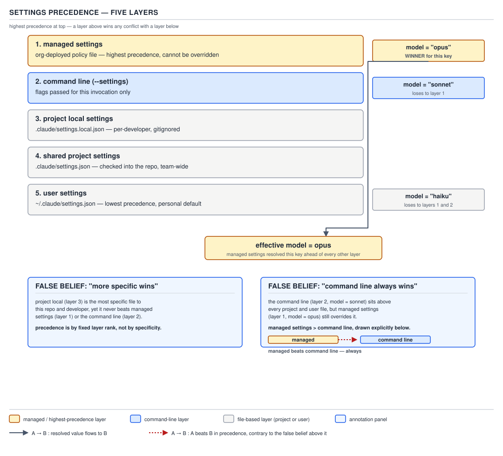

# 21 AI for Coding — settings files and precedence — BASICS (§1.2.1–1.2.8)

**Target version: Claude Code v2.1.2xx (August 2026).** | **Part 1 of 6** | [Index](../00-index.md)
Previous: [the `.claude` folder](../claude-folder/01-basics-anatomy.md) · Next: [settings keys and verification](02-keys-and-verification.md)

Every configurable behaviour in Claude Code — which model starts a session, which shell commands
run without asking, which hooks fire on which event — lives in a JSON file, and more than one of
those files can exist at once. Before any individual key is worth knowing, you need the map of
*which file wins* when two of them disagree. That map is a five-layer stack, not a single file, and
getting the stack wrong is the single most common source of "I set this and it didn't take" reports
against this tool.

## The family: four settings files, and who each one reaches

| File | Scope | Who it reaches | Typical contents |
|---|---|---|---|
| `~/.claude/settings.json` | User | You, in every project on this machine | Personal preferences — theme, default model, your own permission rules |
| `.claude/settings.json` | Shared project | Everyone working in the folder that contains it; in a git repository, everyone who clones it **once you commit the file** | Team permissions, hooks, plugins, the environment variables the project needs |
| `.claude/settings.local.json` | Project local | You, in this one project only | Personal overrides for one project, and testing before you share |
| managed settings | Managed | Everyone your organization deploys it to | Security policy and compliance requirements |

**[DOC]** Quoting `settings` (`https://code.claude.com/docs/en/settings`, re-verified before this
leaf was written): "In the File column, `~/.claude` is the `.claude` folder in your home
directory, and a bare `.claude` is the `.claude` folder inside your project." A bare `.claude` is
always relative to a project, never to your home directory — the tilde is the only thing that
distinguishes the user file from the shared project file when you're reading a path out of context.

**Mechanism.** Four files, four physical locations, one merged view: Claude Code does not pick one
file and ignore the rest, it reads all of the ones that exist and combines them key by key. **Gotcha:**
reading only the shared project file to predict behaviour is a common mistake — your own
`settings.local.json` or a managed file you've never opened can be silently changing what you see.

> **The four settings files together form the raw material the precedence stack (below) orders — none
> of them is "the" settings file, and none of them is optional to check when a key behaves oddly.**

## §1.2.2 The precedence order: five layers, managed on top

### Mental model

Think of the five layers as a stack of transparent sheets laid on a light table, managed settings on
top, user settings on the bottom, all shining through the same layout. For any single key, the sheet
closest to the top that draws anything on that key is the one you see — everything a lower sheet drew
underneath it is invisible, not merged, not averaged, not blended, just occluded. That's the whole
model: **highest sheet that sets the key wins**, and a lower sheet's value for that same key never
shows through, no matter how "close to you" that lower sheet is.

### Why it exists

An organization needs security policy that cannot be quietly switched off by an individual engineer's
laptop configuration; an individual engineer needs personal defaults (their preferred theme, their own
standing permission approvals) that don't require editing a file the whole team shares; a team needs
one shared file that ships with the repository so a fresh clone behaves the same for everyone; and any
of those three needs to be overridable for a single invocation without touching a file at all. Five
layers is the smallest stack that gives each of those four needs its own home without one need
clobbering another.

### How it works

**[DOC]** **[NUM]** Quoting `settings` §"Settings precedence", re-verified immediately before this
leaf: "In order, highest precedence first:" followed by an explicit five-item list. Restated here as
the ordered list that leaf 1.2.2 asks for, **five layers**, highest first:

1. **Managed settings** — `managed-settings.json`, an MDM policy, or server-managed settings from
   the claude.ai console. Deployed by your organization.
2. **Command line** — flags and JSON passed with `claude --settings`, scoped to one session.
3. **Project local settings** — `.claude/settings.local.json`, your personal overrides for one
   project.
4. **Shared project settings** — `.claude/settings.json`, checked into source control.
5. **User settings** — `~/.claude/settings.json`, your personal defaults for every project.

A key set at a higher layer overrides the same key set at any lower layer, full stop — there is no
tie-break by specificity, only by layer.



**D-20** — Settings precedence, five layers: managed at the top, user at the bottom.

### Code

Two files that collide on purpose, to make the layer rule concrete rather than abstract. A managed
settings file locks which models a session may ever run:

```json
{
  "permissions": {
    "deny": ["Bash(aws iam *)"]
  },
  "availableModels": ["claude-opus-4-8", "claude-sonnet-5"]
}
```

And a command line invocation, issued by an individual engineer who wants a model outside that list
for one session:

```
claude --settings '{"model":"claude-haiku-4-5"}' -p "Refactor the retry loop in ClaudeRunner.java"
```

The engineer's `--settings` value is layer 2; the organization's `availableModels` is layer 1. Layer 1
wins: the session refuses `claude-haiku-4-5` and Claude Code will not start with a model outside the
managed list, no matter what the command line asked for. **[DOC]** quoting `settings`: "the lock is
[`availableModels`](/docs/en/settings-reference#availablemodels), which constrains `/model`,
`--model`, and the `model` key in your own files." Note the file's plain `model` key (not shown here)
only sets the *starting* model and can still be changed later with `/model` — it is `availableModels`
that is the actual, unswitchable lock, and that lock outranks the command line by layer, not by field
name.

### Gotcha

Merging is per-key, not per-file: a lower layer's file is not "replaced" wholesale by a higher layer's
file, only the specific keys the higher layer sets are shadowed. A shared project file's twelve other
keys still apply even when a managed file overrides one of them. List-valued keys such as
`permissions.allow` are a further exception to plain shadowing — they merge across layers by
concatenation rather than override, which is §1.4's material; don't assume every key behaves like the
scalar `model` key above.

> **Settings precedence is a five-layer stack — managed, command line, project local, shared
> project, user — in which the highest layer that sets a given key wins that key outright.**

## §1.2.3 `[TRAP]` The order is not "more specific" and not "CLI always wins"

Two beliefs are both common on this subject and both wrong.

**Wrong belief 1 — "more specific wins."** By analogy with CSS specificity or Java's
most-derived-override-wins, an engineer assumes the file closest to the actual work — project local,
because it's the one file scoped to exactly this repository and this person — should always win. It
does not: project local sits at layer 3, below command line and below managed, and a managed key or a
`--settings` flag overrides it regardless of how specific the local file is.

**Wrong belief 2 — "the command line always wins."** By analogy with how flags usually override
config files in ordinary CLI tools, an engineer assumes `--settings` is the final word for that
invocation. It is layer 2 of 5 — one layer below the top. It beats project local, shared project, and
user settings, but it does **not** beat managed settings.

**Pitfall:** the wrong belief in action is exactly the scenario above — an engineer passes
`--settings '{"model":"claude-haiku-4-5"}'`, expects the flag to be authoritative because "I typed it
on the command line, that has to win," and instead the session starts on a model from the managed
`availableModels` list. The symptom is a flag that looks broken: no error, no warning printed by
default, the session simply runs on a different model than the one just typed. A developer who
doesn't know layer 1 outranks layer 2 concludes `--settings` is buggy and either stops trusting the
flag or, worse, starts trying to route around an org policy that was deliberately placed there. The
fix is not a different flag — it's the mental model above: **check `/status` for which settings
source actually won** before assuming a flag misbehaved, and treat a managed override as a policy
decision to raise with whoever owns it, not a bug to work around.

**Why people believe it:** every other config-precedence system they've used — CSS, Spring
`@Profile`, environment variables shadowing a properties file — really does reward specificity or
reward the last thing set. Claude Code's stack is a fixed organizational hierarchy instead: policy,
then session, then person-on-this-repo, then team, then person-everywhere. It is answering "whose
authority is this," not "who spoke most recently or most narrowly."

**Interview:** *"If I pass `--settings` on the command line, does that override my organization's
managed settings?"* — No. The precedence order, highest first, is managed, command line, project
local, shared project, user; managed settings sit above the command line and nothing you pass with
`--settings` can override a key a managed file sets, apart from a short list of security-sensitive
exceptions where Claude Code deliberately honors the *stricter* of the two values (that exception list
is §1.4's material, not this leaf's).

Permission `deny` rules specifically follow an even stricter rule than the five-layer stack above: a
`deny` at *any* level cannot be overridden by any other level, including `--allowedTools` and managed
settings — that evaluation order is §1.4.36's material in `permissions/05-directories-and-trust.md`,
not duplicated here.

## §1.2.4 Which files the tool creates, and when

**[DOC]** Quoting `settings` §"Find or create your settings files": "Installing Claude Code doesn't
create any settings file." Nothing appears until one of two things happens.

- **`~/.claude/settings.json`** (user) is written **the first time you change an option in the
  `/config` menu that it stores in user settings**, such as the theme.
- **`.claude/settings.local.json`** (project local) is written **the first time you give a standing
  approval on a permission prompt**, such as choosing "Yes, and don't ask again" for a Bash command.

**Mechanism.** Both files start out absent; both are created lazily by a specific user action, not by
installation and not by first launch. The shared project file (`.claude/settings.json`) is never
created for you at all — you write it by hand, or it arrives already committed in a repository someone
else set up. Managed settings are deployed by an organization; an individual engineer never creates
that file.

**Gotcha:** a few `/config` options — the documentation names **"Show tips"** as one — save to
`.claude/settings.local.json` instead of the user file even though they read like personal,
every-project preferences. Don't assume every `/config` change lands in the user file just because it
feels like a "me, everywhere" preference.

> **Installing Claude Code creates no settings file; the user file appears on your first stored
> `/config` change, and the project local file appears on your first "don't ask again" approval.**

## §1.2.5 `[VERSION]` Where the local file lands in a git repository

### Mental model

`.claude/settings.local.json` behaves like a piece of repository metadata that happens to live outside
git's index, not like a plain file relative to wherever you happened to launch the terminal. It follows
the repository, not your shell's current directory.

### Why it exists

A permission approval you grant while three directories deep in a monorepo needs to apply the next
time you're at the repository root, or in a sibling directory of the same repository — otherwise
"don't ask again" would mean "don't ask again, but only from this exact subdirectory," which defeats
the point of a standing approval.

### How it works

**[DOC]** **[VERSION]** As of **Claude Code v2.1.2xx**, quoting `settings` §"Where Claude Code keeps
the local file in a git repository": "If you start Claude Code in a subdirectory of a git repository,
it reads and writes that file at the repository root and applies the approval across the whole
repository." That is the general rule — **repository root, not the directory you started in.**

Four exceptions pull the file back to the starting directory instead, all quoted from the same
section: **outside a git repository, when the repository root is your home directory, on Windows, or
when the repository root or its `.git` or `.claude` entry isn't owned by your user.** In any of those
four cases the local file sits alongside `.claude/settings.json` in the directory you started from,
exactly as if there were no repository-root rule at all.

**[VERSION]** This root-relocation behaviour is itself new relative to older Claude Code releases:
"Before v2.1.211, Claude Code kept the file in the starting directory." An engineer who last read the
documentation, or last hit this behaviour, before that release will describe the old starting-directory
rule as current — it isn't, in v2.1.2xx. The old file is not orphaned: "It still reads a file an
earlier version left there alongside the root file; where both set the same key, the root's value
applies, and permission rules from both files apply" — both sets of `permissions.allow` rules are
honored, but a scalar key conflict is decided in the root file's favour.


**D-21** — Where `settings.local.json` lands.

### Code

A project local settings file, complete and valid on its own, exactly as Claude Code would write it
after you approve a `mvn test` invocation with "don't ask again":

```json
{
  "permissions": {
    "allow": ["Bash(mvn test:*)"]
  }
}
```

If your repository root is `~/workspace/order-service` and you launch Claude Code from
`~/workspace/order-service/services/billing/`, that approval is written to and read from
`~/workspace/order-service/.claude/settings.local.json` — not from
`~/workspace/order-service/services/billing/.claude/settings.local.json` — and the `mvn test:*`
allowance applies no matter which subdirectory of `order-service` you're in when you launch next.

### Gotcha

**[VERSION]** Root-relocation is about *which file* Claude Code reads and writes, not about *where a
path inside that file resolves*: "Paths in the file don't anchor at the repository root: a permission
rule that starts with `/` or a relative sandbox path anchors at the session's primary working
directory instead." Don't conflate the two — the file's location moved to the repository root in
v2.1.211, but a `/`-prefixed or relative path written inside that file still resolves against wherever
you started the session, not against the repository root. **Also note, and don't rely on this without
checking `/status` first:** reading the shared `.claude/settings.json` from a directory you moved to
with `/cd` mid-session, rather than from the directory you started in, "requires Claude Code v2.1.246
or later" — an engineer on an older v2.1.2xx point release will see the pre-`/cd` project file still in
effect.

> **`.claude/settings.local.json` is read from and written to the repository root, not the directory
> you launched from, as of v2.1.211 — with four exceptions that fall back to the starting directory,
> and one caveat that in-file paths still resolve against the starting directory regardless.**

## §1.2.6 Worktrees: the local file follows the main checkout

**[DOC]** Quoting `settings` §"Where Claude Code keeps the local file in a git repository": "In a
[worktree](https://code.claude.com/docs/en/worktrees), it uses the file at the main checkout's root." A git worktree is a
second working directory checked out from the same repository, with its own branch but sharing the
same underlying `.git` object store as the original clone — Claude Code treats a worktree not as its
own repository for this purpose, but as an extension of the checkout it was created from.

**Mechanism.** Start a session inside a worktree and the permission approvals you grant are read from,
and written to, `.claude/settings.local.json` at the **main checkout's** root — not at the worktree's
own root, even though the worktree has its own directory tree, its own branch, and looks like an
independent checkout to everything else you run inside it.

**Gotcha:** approve a Bash command "don't ask again" while working in a worktree, and that approval
now applies to every worktree of the same repository and to the main checkout itself, because they're
all reading the one file at the main checkout's root. An engineer expecting worktree isolation — "this
is a separate directory, so my approvals here should stay here" — gets a shared file instead. This is
the seed of a larger incident about `--setting-sources project` silently dropping a permission block
under exactly this worktree/root interaction; that incident is resolved in full in §3.7, not here.

> **A worktree has its own files and its own branch, but its `.claude/settings.local.json` is always
> the one file at the main checkout's root — approvals granted in a worktree are shared, not
> isolated.**

## §1.2.7 Committing `.claude/settings.json`: what teammates get, and why it's a code-review question

**[DOC]** Quoting `settings` §"Share settings with your team": "Commit `.claude/settings.json` so
everyone who clones the repository gets the same permissions, hooks, telemetry, and plugins. Each
teammate can still override it for themselves in their own `.claude/settings.local.json`, so personal
exceptions don't need a commit."

**Mechanism.** A shared project file is an ordinary tracked file until you commit it; before that, per
`settings`, "it's a file on your disk like any other and nobody else has it." Once committed, every
`git clone` and every `git pull` that touches it changes what Claude Code does for that teammate the
next time they run a session in that checkout — with no further action from them.

A minimal shared project file, complete and valid:

```json
{
  "permissions": {
    "allow": ["Bash(git status)", "Bash(git diff:*)", "Bash(mvn -q test)"]
  }
}
```

**Why this belongs in code review, not just any commit.** `permissions.allow` entries decide which
shell commands run on a teammate's machine without a prompt the moment they trust the folder, and
`hooks` entries (not shown above; §1.4's material) run a shell script of your choosing on events like
every file write or every session start — both are **executable policy checked into source control**,
not passive configuration. A pull request that adds `Bash(rm -rf *)` to `permissions.allow`, or adds a
`PostToolUse` hook that curls an external URL, is a pull request that changes what silently executes on
every teammate's machine the next time they pull — exactly the kind of change a reviewer would flag
immediately in a `.sh` file, and exactly as consequential when it arrives inside a JSON file instead.
Treat a diff to `.claude/settings.json` as a diff to executable code, not as a diff to a
preferences file.

**Gotcha:** committing the file doesn't make it take effect immediately for every teammate — see
§1.2.8 next. A reviewer who approves a `permissions.allow` addition and expects it live for the whole
team on merge will be surprised that some of it waits for each teammate's own trust decision.

> **Commit `.claude/settings.json` to give every clone the same permissions, hooks, telemetry, and
> plugins — and review it exactly like code, because permissions and hooks are executable policy, not
> preferences.**

## §1.2.8 Which keys never apply from a repository file, and which wait for trust

**[DOC]** Quoting `settings` §"A committed key doesn't reach teammates," two separate mechanisms, both
real, easy to conflate:

1. **Some keys never apply from `.claude/settings.json` at all.** "Claude Code ignores the key in a
   repository file. Look for `User, local, or managed`, `User or managed`, `Managed`, or `Global
   config` in the Scope column of the [All settings](/docs/en/settings-reference#all-settings) index;
   those keys never apply from the shared file" — with one documented exception,
   `autoContinueAtUsageLimit`, which a repository file can still switch *off* even though it can't turn
   it on. This is a permanent restriction by key, unrelated to trust: no amount of trusting the folder
   makes a `User or managed`-scoped key take effect from a committed file, because that key was never
   readable from a project file in the first place.
2. **Other keys apply from the repository file, but only after workspace trust.** "`permissions.allow`
   rules, `permissions.additionalDirectories`, `extraKnownMarketplaces`, and most
   [`env`](/docs/en/settings-reference#env) values apply only after each teammate trusts the folder.
   Until then they still see prompts and don't get plugins from a marketplace the file declares. `deny`
   and `ask` rules apply right away."

**Mechanism.** Point 1 is a keyspace restriction — checked once, at the settings-reference level, by
which files a key's `Scope` column names. Point 2 is a runtime gate on an otherwise-eligible key — the
key *can* come from a project file, but Claude Code withholds it from a specific teammate's session
until that teammate has explicitly trusted the folder, precisely so that cloning a hostile repository
and opening it doesn't silently grant it standing permissions or a private environment variable.

**Gotcha:** `deny` and `ask` rules are the deliberate exception to the trust gate — they apply
immediately, untrusted or not, because withholding a *restriction* until trust is established would
mean the dangerous window (before trust) is also the permissive window, which is backwards for a
security control.

The full workspace-trust mechanism — what "trusting a folder" means procedurally, which prompt
triggers it, and how it interacts with `permissions.additionalDirectories` — is §1.5.10's material and
is covered in full in `permissions/05-directories-and-trust.md`; this leaf states only that the gate
exists and which keys sit behind it, not how the gate itself is cleared.

> **A key with `Scope: User, local, or managed` (or stricter) never applies from a repository file at
> all, regardless of trust; a key that is eligible from a repository file but touches permissions,
> directories, or the environment still waits for workspace trust before it applies — except `deny`
> and `ask`, which apply immediately.**

## Pitfalls

**Belief in action:** "the command line always wins, so `--settings` is the escape hatch for any
managed policy I disagree with." **Surprising outcome:** a session started with an explicit
`--settings` model override still runs the managed-locked model, silently, with no error. **What
actually gets the guarantee:** check `/status` to see which settings source is currently winning a
given key before assuming a flag is broken, and raise a genuine policy disagreement with whoever
controls the managed file rather than trying to flag your way around it. **Why people believe it:**
every other CLI tool they've used treats a command-line flag as the final word for that invocation;
Claude Code's stack puts organizational policy above session-scoped flags on purpose.

**Belief in action:** "my `.claude/settings.local.json` approvals are scoped to the subdirectory I was
in when I approved them." **Surprising outcome:** the approval is written to the repository root (or
the main checkout's root, in a worktree) and applies across the whole repository, and across every
worktree of it. **What actually gets the guarantee:** if you want an approval scoped to one
subdirectory only, you need a permission rule with an explicit path, not a bare "don't ask again"
click — see the path-anchoring caveat in §1.2.5. **Why people believe it:** the file lives under
`.claude/` inside the directory you were working in, so it reads as directory-scoped the same way a
`.gitignore` in a subdirectory is.

**Belief in action:** "I committed a `permissions.allow` change to `.claude/settings.json`, so it's
live for the team as soon as they pull." **Surprising outcome:** teammates who haven't yet trusted the
folder keep seeing prompts for the newly allowed command. **What actually gets the guarantee:** the
rule does apply, but only after each teammate's own trust decision — communicate that a pull requires
a one-time trust step, don't assume the merge alone finishes the rollout. **Why people believe it:** a
merged commit is normally the end of the rollout story for config; here it's the start of a per-teammate
gate.

## Cheat sheet

| Question | Answer |
|---|---|
| Precedence order, highest first | managed → command line (`--settings`) → project local → shared project → user |
| "More specific wins"? | No. Fixed layer order regardless of file specificity. |
| "Command line always wins"? | No. Managed settings outrank it. |
| Does installing Claude Code create a settings file? | No — none. |
| When is `~/.claude/settings.json` created? | First stored `/config` change (e.g. theme). |
| When is `.claude/settings.local.json` created? | First "Yes, and don't ask again" approval. |
| Where does the local file live in a repo? | Repository root, not the starting directory (v2.1.211+). |
| Exceptions to the root rule | Outside a repo; repo root is `$HOME`; Windows; foreign-owned root/`.git`/`.claude`. |
| Local file in a worktree | Main checkout's root, shared across all worktrees. |
| Does committing `.claude/settings.json` apply instantly for teammates? | Only `deny`/`ask` immediately; `allow`, `additionalDirectories`, `extraKnownMarketplaces`, most `env` wait for trust. |
| Does any key never apply from a repo file at all? | Yes — anything scoped `User, local, or managed`, `User or managed`, `Managed`, or `Global config`. |

## Self-test

1. What are the five settings layers, highest precedence first?
<details><summary>Answer</summary>Managed settings, command line (`--settings`), project local (`.claude/settings.local.json`), shared project (`.claude/settings.json`), user (`~/.claude/settings.json`). A key set at a higher layer overrides the same key at any lower layer.</details>

2. You pass `--settings '{"model":"claude-haiku-4-5"}'` and the session starts on a different model
   anyway, with no error. What's the most likely cause?
<details><summary>Answer</summary>A managed `availableModels` list constrains which models any session may run, and managed settings outrank the command line. The CLI flag isn't being ignored due to a bug — layer 1 (managed) is beating layer 2 (command line) exactly as the precedence order specifies.</details>

3. True or false: "more specific wins" describes Claude Code's settings precedence.
<details><summary>Answer</summary>False. The order is a fixed organizational hierarchy — policy, session, person-on-this-repo, team, person-everywhere — not a specificity rule. Project local settings, despite being the most specific to you-and-this-repo, sit below both managed settings and the command line.</details>

4. Does installing Claude Code create any settings file?
<details><summary>Answer</summary>No. The user file is created on your first stored `/config` change (such as changing the theme); the project local file is created on your first standing permission approval ("Yes, and don't ask again"). The shared project file is never auto-created — you write it or inherit a committed one.</details>

5. You start Claude Code from a subdirectory three levels deep in a git repository and approve a Bash
   command with "don't ask again." Where is that approval stored, and what version behaviour governs
   this?
<details><summary>Answer</summary>At the repository root's `.claude/settings.local.json`, not the subdirectory you started in — this has been true since v2.1.211; before that release Claude Code kept the file in the starting directory instead.</details>

6. Name the four exceptions where the local settings file stays in the starting directory instead of
   the repository root.
<details><summary>Answer</summary>Outside a git repository; when the repository root is your home directory; on Windows; and when the repository root or its `.git` or `.claude` entry isn't owned by your user.</details>

7. You're working inside a git worktree and approve a command "don't ask again." Which file receives
   that approval?
<details><summary>Answer</summary>The `.claude/settings.local.json` at the main checkout's root, not a file scoped to the worktree — worktrees share the main checkout's local settings file, so the approval applies across all worktrees and the main checkout.</details>

8. Your team merges a PR adding a new entry to `permissions.allow` in the committed
   `.claude/settings.json`. A teammate pulls the change. Does the new permission apply to their very
   next session immediately?
<details><summary>Answer</summary>Not necessarily. `permissions.allow` is one of the keys that waits for workspace trust — the teammate must first trust the folder before the new rule takes effect; until then they still see the permission prompt for that command.</details>

9. Why should a `permissions.allow` or `hooks` change in `.claude/settings.json` get the same
   code-review scrutiny as a change to a shell script?
<details><summary>Answer</summary>Because both are executable policy, not passive preferences: an `allow` rule lets a shell command run on every teammate's machine without a prompt once trusted, and a `hooks` entry runs an arbitrary script on an event like every file write or session start. A malicious or careless addition to either executes silently on merge, the same risk profile as a malicious commit to a `.sh` file.</details>

10. A key's `Scope` column in the settings reference reads `User or managed`. Will setting that key in
    `.claude/settings.json` and having your team trust the folder make it apply?
<details><summary>Answer</summary>No. Scope restriction and the trust gate are two different mechanisms. A key scoped `User or managed` (or `User, local, or managed`, `Managed`, or `Global config`) never applies from a repository file at all, regardless of trust — trust only unlocks keys that are otherwise eligible from a project file, such as `permissions.allow`.</details>

## Open questions

None.

---

**Leaves covered:** 1.2.1–1.2.8 (8 leaves)
**Leaves deferred:** none
**Diagrams included:** D-20, D-21
**Target version:** Claude Code v2.1.2xx (August 2026)
**Lines:** 464
