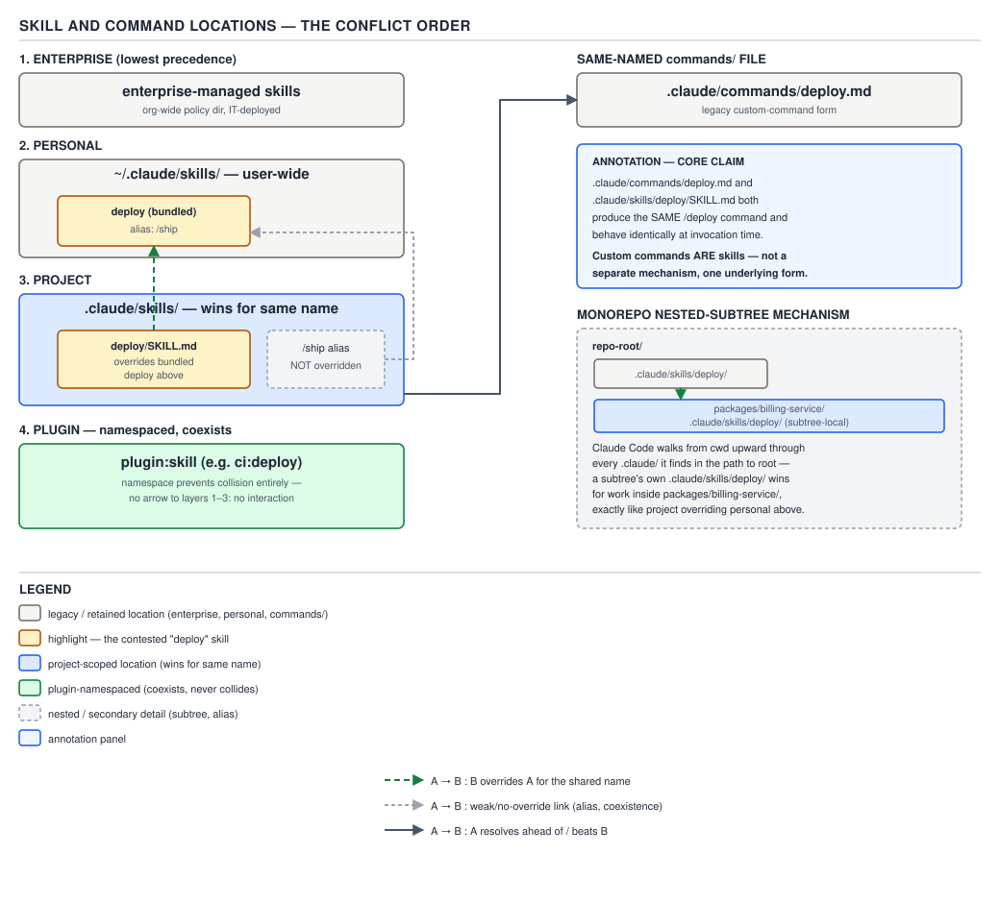
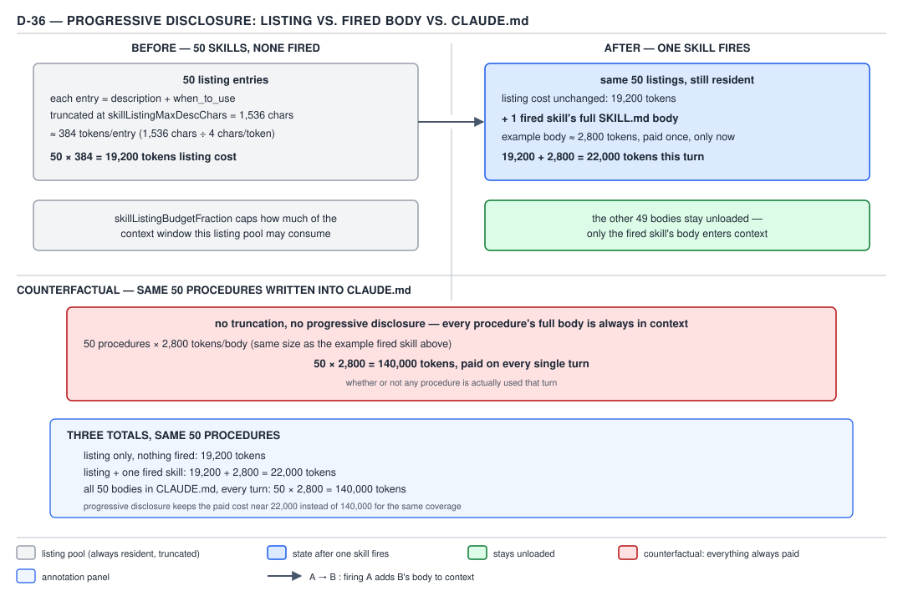

# 21 AI for Coding — what a skill is — BASICS (§1.5.1–1.5.5)

**Target version: Claude Code v2.1.2xx (August 2026).** | **Part 1 of 6** | [Index](../00-index.md)
Previous: [the sandbox, and a real permission block](../permissions/08-sandbox-and-a-real-block.md) · Next: [frontmatter and invocation](02-frontmatter-and-invocation.md)

## The map before the streets: four locations, one command surface

Every skill — wherever it lives — ends up producing the same thing: a `/name` you can type, and a
body of instructions Claude can also load on its own. Before any mechanism, here is the family this
file introduces:

| Location | Path | Applies to | Wins over |
|---|---|---|---|
| Enterprise | managed-settings skills dir (IT-deployed) | every user in the org | nothing else here — lowest of the four levels |
| Personal | `~/.claude/skills/<name>/SKILL.md` | all your projects | project, for a same-named skill |
| Project | `.claude/skills/<name>/SKILL.md` | this project only | a bundled skill and a same-named `commands/` file |
| Plugin | `<plugin>/skills/<name>/SKILL.md` | wherever the plugin is enabled | nothing — namespaced, cannot conflict |

And, sitting beside all four as a fifth legacy shape: `.claude/commands/<name>.md`. §1.5.1 exists to
collapse the idea that this fifth shape is a separate system.

## §1.5.1 — custom commands are skills `[DOC]` `[VERSION]` `[TRAP]`

State this first because it overturns the article you probably already read: **a custom command and a
skill are the same underlying mechanism, not two competing ones.**

**Concept.** `.claude/commands/deploy.md` and `.claude/skills/deploy/SKILL.md` both create a typable
`/deploy` command, and both behave identically at invocation time — same substitution rules, same
argument handling, same way of entering the conversation.

**Why it exists.** Claude Code shipped custom commands (flat `.md` files under `.claude/commands/`)
before it shipped skills. Skills arrived later as a superset: the same idea, plus a directory for
supporting files, frontmatter to control who invokes it, and the ability for Claude to load it
automatically rather than only on explicit `/name` invocation. Rather than running two parallel
systems, Claude Code merged them — a command file is now read as the degenerate case of a skill (no
frontmatter beyond what the file happens to have, no supporting-file directory).

**When to reach for which.** There is no live choice here — this is not two mechanisms competing for
the same job. If you are starting new, write a skill; you get the directory and the frontmatter for
free and lose nothing. A `.claude/commands/*.md` file you already have keeps working untouched — the
merge did not require you to migrate anything.

**How it works.** `[DOC]` The official skills page states this exact claim, verbatim:

> "**Custom commands have been merged into skills.** A file at `.claude/commands/deploy.md` and a
> skill at `.claude/skills/deploy/SKILL.md` both create `/deploy` and work the same way. Your
> existing `.claude/commands/` files keep working. Skills add optional features: a directory for
> supporting files, frontmatter to control whether you or Claude invokes them, and the ability for
> Claude to load them automatically when relevant."
> — [`code.claude.com/docs/en/skills`](https://code.claude.com/docs/en/skills)

Two files that both exist and share the name `deploy` are the same conflict, whichever shape they
take: the docs state directly that "if a skill and a command share the same name, the skill takes
precedence" — so `.claude/commands/deploy.md` plus `.claude/skills/deploy/SKILL.md` in the same
project resolves to the skill running when you type `/deploy`.

`[VERSION]` **What is true in v2.1.2xx:** one system, "skills," with commands as a legacy on-ramp into
it. **What used to be true, and what still gets asked:** early Claude Code documentation and most
existing blog posts describe "custom slash commands" and "skills" as two separate features — commands
for quick reusable prompts, skills (then newer) for richer, auto-invoked capabilities with bundled
files. That split is stale. An interviewer or colleague who asks "what's the difference between a
custom command and a skill" is asking a v2.0-era question; the v2.1.2xx answer is that there isn't
one, beyond the optional features a `SKILL.md` gives you access to.



**D-37** — Skill and command locations, and the conflict order. Custom commands are skills.

**Code.** The minimal pair that makes the claim concrete — two files, same effective command:

`.claude/commands/checklist-refresh.md`:

```markdown
Walk the open PR's file list and confirm the pre-merge checklist: tests updated, changelog entry
added, no `TODO` left in the diff. Report any unchecked item as a blocking comment.
```

`.claude/skills/checklist-refresh/SKILL.md` (the same behavior, now as a skill):

```yaml
---
description: Confirms the pre-merge checklist against the open PR's diff — tests, changelog, no leftover TODOs.
---

Walk the open PR's file list and confirm the pre-merge checklist: tests updated, changelog entry
added, no `TODO` left in the diff. Report any unchecked item as a blocking comment.
```

Type `/checklist-refresh` against either one and the result is indistinguishable. The second form
additionally lets Claude fire it unprompted when a PR-review conversation matches the `description` —
the command form cannot do that, because command files carry no `description` field for Claude to
match against.

**Pitfall:** believing you must "migrate" `.claude/commands/` files to skills before some deprecation
date. **Symptom:** wasted effort converting working command files that nothing was going to break.
**Fix:** commands keep working indefinitely — convert opportunistically, when you want a feature (auto
invocation, a supporting-files directory, `disable-model-invocation`) that only the `SKILL.md` shape
gives you, not on a schedule.

**Interview:** "Are commands and skills different systems in Claude Code?" — one-line answer: no,
since the v2.1 merge a command file is just a skill without the optional directory or frontmatter;
both resolve to the same `/name` and the skill form wins a same-name conflict.

> A custom command and a skill are the same mechanism at two levels of feature completeness, not two
> mechanisms.

## §1.5.2 — what a skill *is* `[ZERO]`

Every term here, defined in place, because the reader has just spent a whole area (permissions, §1.4)
learning about **tools** — the built-in capabilities like `Bash`, `Read`, `Edit` that Claude calls to
act on the world — and will otherwise fold "skill" into that same bucket. It does not belong there.

A **skill** is a plain **markdown file** — text, not executable code — that lives at a known path
(`SKILL.md`, inside a directory named after the skill) and holds two things: a small block of
**YAML frontmatter** (key–value configuration between `---` fences at the top of the file) and a
**body** of prose instructions. When the skill is invoked — either you type `/name`, or Claude decides
the conversation matches the skill's `description` — Claude Code takes that body text and **injects**
it into the conversation as if you or the system had typed it. Claude then reads those instructions
and acts on them using its ordinary tools.

Three distinctions worth drawing explicitly, because each one is a plausible wrong guess:

- **A skill is not code.** Nothing in a `SKILL.md` file executes on its own. The body is text Claude
  reads and follows: contrast with a `Bash` tool call, which really runs a subprocess, or a hook
  script, which really executes. (A skill's body *can* contain a `` !`command` `` line that Claude
  Code runs and substitutes the output of — "dynamic context injection," out of scope for this file —
  but that is the harness pre-processing the file's text before injection, not the skill file itself
  running.)
- **A skill is not a tool.** A tool (§1.4's subject) is a capability Claude calls with structured
  arguments and gets a structured result back — `Read(file_path)`, `Bash(command)`. A skill produces
  no structured result; it produces more conversation context. Claude does not "call" a skill the way
  it calls `Bash`; the harness loads the skill's text in, and then Claude proceeds using its normal
  tools as instructed by that text.
- **A skill is not a plugin.** A plugin (§1.6, later in this area) is a distributable package that can
  bundle skills, agents, hooks, and MCP servers together, with its own install/enable lifecycle and
  marketplace metadata (`plugin.json`, `marketplace.json`). A single skill is one ingredient a plugin
  can ship; a plugin is not required to contain any skill at all, and a skill does not require a
  plugin to exist — most skills in this file are plain files with no plugin wrapper.

**Gotcha:** because the frontmatter and body of a skill *look* like configuration, it is tempting to
treat `SKILL.md` as declarative settings the way `settings.json` is. It is not — the body is prose
that Claude interprets, so its effect depends on how clearly it is written, not on a fixed schema the
harness enforces. A vague instruction produces vague behavior; a `SKILL.md` file has no equivalent of
a JSON validator to catch an ambiguous sentence.

> A skill is a markdown file of instructions the tool injects into the conversation on invocation —
> not code that runs, not a tool Claude calls, and not a plugin.

## §1.5.3 — the four locations and the conflict order `[DOC]`

**Concept.** Skills are discovered from four places, and Claude Code needs a deterministic rule for
what happens when two of them define a skill with the same name.

**Why it exists.** The same four-tier shape recurs everywhere in Claude Code's configuration
(settings, permissions, memory) because the same organizational need recurs: an org wants a floor
everyone gets, a person wants defaults across their own projects, a project wants overrides scoped to
itself, and a third party wants to ship a capability that cannot collide with any of the above.

**When to reach for which.** Enterprise for anything IT must guarantee is present (compliance
checklists, security scanners) regardless of what a project or a person configures. Personal
(`~/.claude/skills/`) for a skill you want in every project you touch — a personal `mvn-test-runner`
you always want, say. Project (`.claude/skills/`) for a skill scoped to one codebase — its `deploy`
skill for its own deployment target, not yours. Plugin for a skill you want to distribute to other
people without it fighting for the same bare name they might already have.

**How it works.** `[DOC]` The official page states the resolution rule in four separate properties,
and all four matter:

1. **"Across levels, enterprise overrides personal, and personal overrides project."** The docs' own
   worked example: "with a `deploy` skill in both `~/.claude/skills/` and your project's
   `.claude/skills/`, `/deploy` runs the personal one." **Personal beats project.** Hold that fact
   apart from what PART 2 covers for subagents — the *agent* precedence the reader meets there runs
   the other way (project beats personal). Two different families, two different orders; do not
   carry this file's rule forward as if it generalized.
2. **"A skill at any of these levels also overrides a bundled skill with the same name, but not the
   bundled skill's aliases."** Example from the docs: a project `code-review` skill replaces the
   bundled `/code-review`, but typing the bundled alias `/review` never reaches your replacement — the
   alias still points at the original.
3. **"Plugin skills use a `plugin-name:skill-name` namespace, so they can't conflict with other
   levels."** A plugin's `deploy` skill becomes `/my-plugin:deploy`, not `/deploy`, so it loads
   *alongside* a project `deploy` skill rather than fighting it for the name.
4. **"If you have files in `.claude/commands/`, those work the same way, but if a skill and a command
   share the same name, the skill takes precedence."** This is §1.5.1's merge claim, restated as a
   conflict rule: `.claude/commands/deploy.md` plus `.claude/skills/deploy/SKILL.md` in the same
   project resolves `/deploy` to the skill.


**D-37** — Skill and command locations, and the conflict order. Custom commands are skills.

**Code.** A concrete collision, worked through: your team has a bundled `/code-review` (ships with
Claude Code) and an alias `/review` pointing at it. You add a project skill:

```yaml
---
name: readonly-reviewer
description: Runs a read-only review pass against the open diff using this repo's own review checklist.
allowed-tools: Read Grep Glob
---

Review the current diff for correctness issues only. Do not edit any file — this pass is read-only.
Check against docs/review-checklist.md in this repository, and report findings as a plain list, most
severe first.
```

If this file is saved at `.claude/skills/code-review/SKILL.md` (directory named `code-review`, not
`readonly-reviewer` — the command name comes from the directory, not the `name:` field, for a personal
or project skill), typing `/code-review` now runs this project skill instead of the bundled one. Typing
`/review` — the bundled alias — still runs the original bundled reviewer, per rule 2 above.

**Gotcha:** rule 1's direction is the one every reader gets backwards on first read, because
"enterprise overrides personal" sounds like it should mean enterprise skills always run — it means
enterprise wins *the same-name conflict*, not that enterprise skills are somehow preferred targets for
invocation generally. And rule 1 only decides ties between enterprise/personal/project; it says
nothing about plugin (rule 3, namespaced out of the fight) or commands (rule 4, loses to any skill).

**Interview:** "You have a `deploy` skill defined both personally and in the project — which one
runs?" — one-line answer: the personal one; personal beats project, the opposite of the precedence
order for subagents.

> Same-named skills resolve enterprise beats personal beats project, a project skill beats a bundled
> skill (but never its alias), plugin skills cannot conflict at all, and any skill beats a same-named
> command file.

## §1.5.4 — nested skills: the monorepo mechanism `[DOC]`

**Mechanism, three beats.** A `.claude/skills/` directory does not have to sit at the repository root.
The docs state it plainly: "Skills also load from nested `.claude/skills/` directories below your
working directory. When Claude reads or edits a file in a subdirectory, skills from that
subdirectory's `.claude/skills/` become available." Concretely: a session starts at a monorepo's root,
Claude edits a file under `packages/frontend/`, and from that point on skills defined in
`packages/frontend/.claude/skills/` are available for the rest of the session — even though the
session never `cd`'d there. If the nested skill's name collides with one already loaded (a root
`deploy`, say), the nested one does not overwrite it; it appears under a directory-qualified name
(`packages/frontend:deploy`) so both stay reachable, and invoking the bare name still loads the
root-project skill together with an appended note telling Claude to also consider the qualified
variant for files in that directory.

**Gotcha:** the nested skill is not available at session start — it activates lazily, the first time
Claude touches a file in that subtree, not the moment the session opens. A skill sitting in
`packages/frontend/.claude/skills/` will not appear in `/` autocomplete and cannot be invoked by name
until Claude has read or edited something under `packages/frontend/`.

**Insight:** this is the exact same on-demand loading principle the reader has already met twice —
once for nested `CLAUDE.md` files (a subdirectory's memory file loads only once work touches that
subtree) and once for path-scoped rules (a permission rule keyed to a glob applies only when a
matching path is in play). Three different configuration surfaces — memory, permissions, skills — all
converge on one design law: **configuration for a subtree of the repository is not paid for until the
session actually enters that subtree.** A monorepo with forty packages does not pay the cost of forty
packages' worth of nested skills, memory files, and path rules on every single turn — only the
handful whose subtree the current turn actually touches.

> A skill's own `.claude/skills/` directory, nested anywhere below the working directory, becomes
> available the first time Claude reads or edits a file in that subtree — the same lazy, subtree-local
> loading the reader has already seen for nested memory files and path-scoped permission rules.

## §1.5.5 — progressive disclosure `[DOC]` `[NUM]`

**Mental model.** Picture two separate things sitting in the conversation: a one-line entry in a
table of contents, and the chapter that entry points to. Claude always has the table of contents open.
It only opens the chapter when it decides — or you tell it — to use that specific entry. Fifty
chapters cost you fifty lines of table of contents; you never pay for fifty chapters of *reading*
unless you actually read fifty chapters.

**Why it exists.** The reader has already paid the cost this idea is designed to avoid, twice: once in
`memory/01-basics-claude-md.md`, where every line of `CLAUDE.md` sits in context on every single turn
for the life of the session whether or not that turn needs it, and again in
`memory/04-your-own-instruction-files.md`, where the same always-on cost was shown to compound as
project instruction files grow. A skill inverts that: **only the frontmatter's `description` (and,
where set, `when_to_use`) sits in context up front — the body loads only when the skill actually
fires.** The docs state the mechanism directly: "Unlike CLAUDE.md content, a skill's body loads only
when it's used, so long reference material costs almost nothing until you need it."

**How it works.** `[DOC]` Two frontmatter fields feed the always-resident listing: `description`
("what the skill does and when to use it... Claude uses this to decide when to apply the skill") and
`when_to_use` ("additional context for when Claude should invoke the skill... appended to
`description` in the skill listing"). Their *combined* text is truncated in the listing — the docs
name the cap directly: "the combined `description` and `when_to_use` text is truncated at **1,536
characters** in the skill listing to reduce context usage." That number, and what governs how large a
share of the context window the whole listing pool may take, belongs to the next file
(§1.5.6) — noted here only as the reason the always-resident part of a skill stays cheap regardless of
how long its body is.

`[NUM]` **The arithmetic**, worked rather than asserted, for fifty skills where the listing text runs
right up against the cap:

```
Per-skill listing cost:
  1,536 characters ÷ 4 characters/token  ≈ 384 tokens/entry

Fifty skills, none fired (the always-resident cost):
  50 entries × 384 tokens/entry = 19,200 tokens

Fifty skills, one fires this turn:
  listing cost (unchanged, all 50 still resident)      19,200 tokens
  + that one skill's full SKILL.md body (example size)  2,800 tokens
  -------------------------------------------------------------
  = 22,000 tokens paid this turn

Counterfactual — the same 50 procedures written as CLAUDE.md sections instead:
  no listing/body split, no truncation — every body is always resident
  50 procedures × 2,800 tokens/body = 140,000 tokens, paid on EVERY turn,
  whether or not that turn uses any of them
```

Three totals, same fifty procedures: **19,200** tokens resident with nothing fired, **22,000** once one
fires, against **140,000** tokens per turn if the same fifty procedures had instead been pasted into
`CLAUDE.md`. The gap between 22,000 and 140,000 is the entire claim: fifty skills cost almost nothing
because forty-nine of their bodies are never paid for on a turn that only needs the fiftieth; fifty
`CLAUDE.md` sections cost the full 140,000 on *every* turn because `CLAUDE.md` has no mechanism to load
only the section the turn needs — the whole file is resident or none of it is.



**D-36** — Progressive disclosure: fifty listing entries against one loaded body, and the `CLAUDE.md`
counterfactual.

**Code.** A `SKILL.md` sized the way the arithmetic above assumes — a compact `description`, a body
long enough to be worth deferring:

```yaml
---
name: mvn-test-runner
description: Runs the correct Maven test module for the file(s) currently being edited, using this repo's multi-module reactor layout, and reports failures with the exact re-run command. Use when the user asks to run tests, verify a change, or asks why a test is failing after an edit.
---

## Determine the module

This repository is a multi-module Maven reactor. Map the edited file's path to its owning module by
matching the longest `pom.xml`-bearing ancestor directory. Do not run `mvn test` from the repo root —
the reactor is large enough that a full-repo run takes several minutes.

## Run the scoped test

Run `mvn -pl <module> -am test` from the repo root, where `<module>` is the artifact id of the module
found above. `-am` builds that module's own dependencies first so a change in a shared module is
picked up.

## Report failures

For each failing test, quote the assertion message and the file:line of the failing assertion, then
give the single command to re-run just that test: `mvn -pl <module> -Dtest=<ClassName>#<methodName>
test`.
```

Before this skill fires, only its `description` line — one paragraph, comfortably inside 1,536
characters — sits in context. The four-section body above (module lookup, scoped run, failure
reporting) loads only on the turn a matching request actually invokes it, and is gone from that
resident-listing cost until the next time it fires.

**Insight:** the mechanism that makes this possible is not "skills are smaller than `CLAUDE.md`
sections" — a skill's body can be just as long, sometimes longer, than the `CLAUDE.md` paragraph it
replaces. The saving comes entirely from *when* the body is read: a `CLAUDE.md` section has no
"invocation" — it is concatenated into every prompt regardless of relevance — while a skill's body is
gated behind a decision (yours, or Claude's match against `description`) that most turns never trigger.

**Interview:** "Why move a long procedure out of `CLAUDE.md` and into a skill?" — one-line answer:
`CLAUDE.md` content is paid on every turn regardless of relevance, while a skill's body is paid only on
the turn it actually fires — the always-resident cost drops from the full body size to roughly
`description` length (≈384 tokens at the 1,536-character cap) per skill.

> Progressive disclosure keeps only a skill's `description` (plus `when_to_use`) resident at all
> times, and defers the body until the skill actually fires — the reason fifty skills cost thousands
> of tokens while fifty `CLAUDE.md`-resident procedures of the same size cost hundreds of thousands,
> every single turn.

## Pitfalls

- **Belief:** "commands and skills are two separate systems, so I need to know which one to reach
  for." **Outcome:** wasted decision-making on a distinction that stopped existing at the v2.1 merge.
  **What actually gets the guarantee:** treat `.claude/commands/*.md` as the legacy on-ramp into the
  same mechanism a `SKILL.md` provides; write new work as a skill for the extra frontmatter features,
  and leave working command files alone. **Why people believe it:** most existing documentation and
  blog content predates the merge and still describes two features.
- **Belief:** "enterprise-level configuration always wins, so an enterprise skill always overrides a
  personal one in practice." **Outcome:** correct for the same-name tie-break, but easy to
  over-generalize into "enterprise is preferred for invocation," which is not what the rule says.
  **What actually gets the guarantee:** the rule fires only on a literal name collision; with no
  collision, all four locations' skills are simply available side by side. **Why people believe it:**
  the phrase "enterprise overrides personal, personal overrides project" reads like a global ranking
  rather than a narrow tie-break rule.
- **Belief:** "a big `SKILL.md` body is expensive the moment it exists, the same way a big `CLAUDE.md`
  is." **Outcome:** engineers under-write skill bodies to keep them "light," losing detail the skill
  needed. **What actually gets the guarantee:** only the `description`/`when_to_use` pair is
  always-resident (capped at 1,536 characters); the body's size only matters on the turn it fires —
  write it as long and precise as the task needs. **Why people believe it:** the intuition transfers
  directly from `CLAUDE.md`, where size really is an always-on cost.

## Cheat sheet

| Fact | Value |
|---|---|
| A skill, in one sentence | Markdown file of instructions, injected into context on invocation — not code, not a tool, not a plugin |
| Commands vs. skills | Same mechanism since the merge; skill wins a same-name tie against a command |
| Four locations | Enterprise, Personal (`~/.claude/skills/`), Project (`.claude/skills/`), Plugin (`plugin:skill`, namespaced) |
| Same-name tie-break | Enterprise beats Personal beats Project; any of the three beats a bundled skill (not its alias); plugin never conflicts; skill beats same-named command |
| Precedence direction vs. subagents | Opposite — subagents (PART 2) run project beats personal |
| Nested skills | `.claude/skills/` below cwd loads lazily, first time a file in that subtree is touched; collision → directory-qualified name |
| Progressive disclosure | Only `description` + `when_to_use` resident always; body loads on fire only |
| Listing cap | 1,536 characters combined `description` + `when_to_use` (detail deferred to next file) |
| 50-skill arithmetic | 19,200 tokens idle; 22,000 with one fired; 140,000 if the same content lived in `CLAUDE.md` |

## Self-test

1. What is the one-sentence difference between how `.claude/commands/deploy.md` and
   `.claude/skills/deploy/SKILL.md` behave when you type `/deploy`?
<details><summary>Answer</summary>
No difference in behavior — both produce the identical `/deploy` command since custom commands were
merged into skills; the skill form additionally supports a supporting-files directory, invocation-
control frontmatter, and automatic loading by Claude.
</details>

2. Why is a skill "not a tool" even though Claude ends up using tools while a skill's instructions are
   active?
<details><summary>Answer</summary>
A tool is a structured capability Claude calls with arguments and gets a structured result back
(`Read`, `Bash`). A skill produces no structured result at all — it is text injected into the
conversation that Claude then reads and acts on using its ordinary tools. The skill itself never
executes anything.
</details>

3. A `deploy` skill exists both at `~/.claude/skills/deploy/` and at the current project's
   `.claude/skills/deploy/`. Which one runs when you type `/deploy`, and does that generalize to
   subagents?
<details><summary>Answer</summary>
The personal one — personal beats project for skills. It does not generalize: subagent precedence
(PART 2) runs the opposite direction, project beats personal.
</details>

4. A project defines its own `code-review` skill. The bundled `/code-review` has an alias `/review`.
   After adding the project skill, what does typing `/review` do?
<details><summary>Answer</summary>
It still runs the original bundled reviewer. A same-named skill overrides the bundled skill itself,
but never the bundled skill's aliases — `/review` was never renamed to point at the project skill.
</details>

5. Why can a plugin's `deploy` skill never collide with a project's `deploy` skill?
<details><summary>Answer</summary>
Plugin skills are namespaced as `plugin-name:skill-name` (e.g. `ci:deploy`), so the plugin's command
is `/ci:deploy`, not `/deploy` — a different name entirely, coexisting with any bare `deploy` skill
rather than competing for the same name.
</details>

6. A monorepo session starts at the repo root. `packages/billing-service/.claude/skills/` defines a
   skill. When does that skill first become invocable, and why not sooner?
<details><summary>Answer</summary>
The first time Claude reads or edits a file under `packages/billing-service/` — not at session start.
Nested skills load lazily, scoped to the subtree they sit in, the same way nested `CLAUDE.md` files and
path-scoped permission rules only apply once work actually enters that subtree.
</details>

7. What exactly is resident in context before any skill has fired, for a session with fifty skills
   installed?
<details><summary>Answer</summary>
Only each skill's `description` (plus `when_to_use` if set), combined and truncated at 1,536
characters per skill — roughly 384 tokens each, ≈19,200 tokens total for fifty skills. None of the
fifty bodies are loaded.
</details>

8. Why does the same fifty procedures written into `CLAUDE.md` cost roughly 140,000 tokens on every
   turn, while as fifty skills they cost about 22,000 tokens on a turn where only one fires?
<details><summary>Answer</summary>
`CLAUDE.md` has no invocation gate — every section is concatenated into every prompt regardless of
relevance, so all fifty bodies (≈2,800 tokens each here) are paid every turn: 50 × 2,800 = 140,000.
Skills gate the body behind firing: the fifty listings stay resident (≈19,200 tokens) but only the one
fired skill's body (≈2,800 tokens) is added, for ≈22,000 tokens that turn.
</details>

## Open questions

None.

---

**Leaves covered:** 1.5.1–1.5.5 (5 leaves)
**Leaves deferred:** none
**Diagrams included:** D-36, D-37
**Target version:** Claude Code v2.1.2xx (August 2026)
**Lines:** 479
