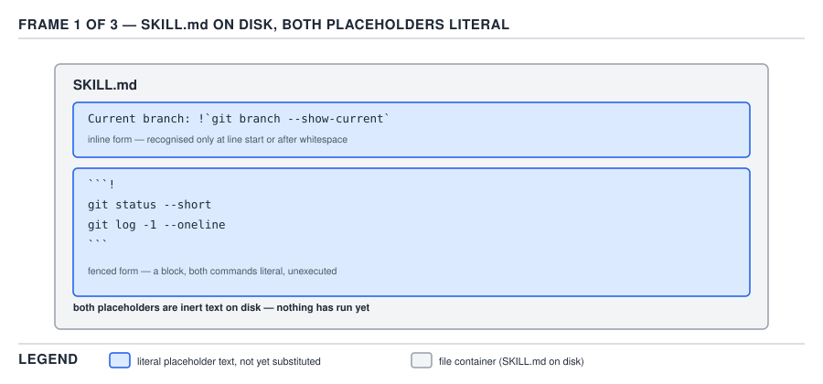
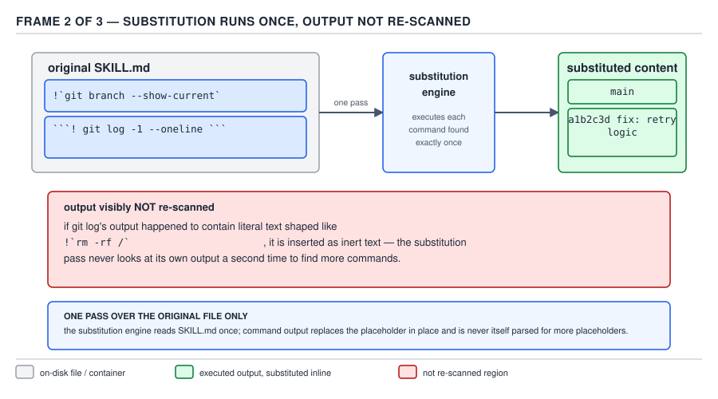
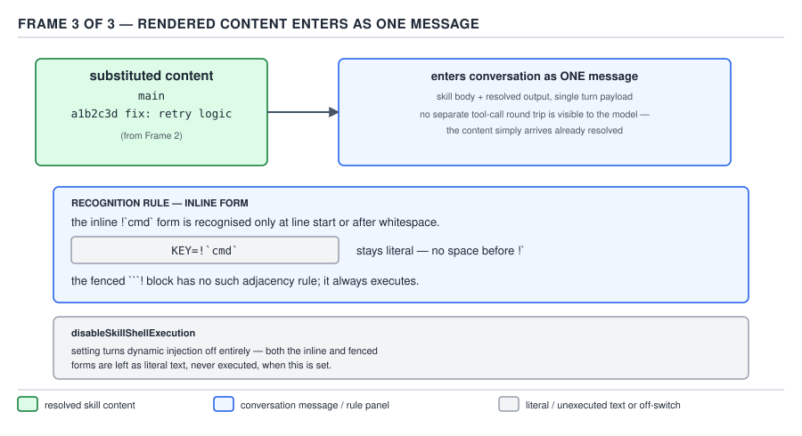

# 21 AI for Coding — substitution and dynamic injection — BASICS (§1.5.11–1.5.14)

**Target version: Claude Code v2.1.2xx (August 2026).** | **Part 1 of 6** | [Index](../00-index.md)
Previous: [skill frontmatter and who may invoke](02-frontmatter-and-invocation.md) · Next: [the content lifecycle and supporting files](04-lifecycle-and-supporting-files.md)

The previous file finished the frontmatter block: every field it can hold, the listing budget, and
the three settings that decide who may invoke a skill. This file stays inside `SKILL.md`'s body — the
markdown after the closing `---` — and covers the two things that make that body dynamic rather than
static text: the placeholders the harness fills in from the invocation, and a shell command whose
*output*, not its text, becomes part of what the model reads.

### §1.5.11 — the seven string substitutions `[DOC]`

**Concept.** A `SKILL.md` body is not sent to the model verbatim. Before it becomes part of the
conversation, Claude Code walks the text once and replaces a fixed set of placeholder tokens with
real values — the arguments the user typed after `/skill-name`, or facts about the running session.

**Why it exists.** Without substitution, a skill's instructions can only be generic prose — "review
the branch the user names" — and the model has to re-derive which branch, which session, which
directory from context every single time the skill fires. Substitution lets the skill author write
the specific fact directly into the instructions once, and have the harness fill in the specific
value per invocation, which is cheaper and cannot be misread the way a paraphrased instruction can.

**How it works.** `[DOC]` Confirmed against the current skills page. Seven forms matter here (two
more — `${CLAUDE_PROJECT_DIR}` and the plugin-only `${CLAUDE_PLUGIN_ROOT}` / `${CLAUDE_PLUGIN_DATA}`
— belong to plugin- and project-path resolution and are covered where those subjects are taught):

| Form | Expands to | Worked example |
|---|---|---|
| `$ARGUMENTS` | The full argument string as typed, unparsed. If no other placeholder consumes an argument, Claude Code appends it to the content as `ARGUMENTS: <value>` instead of silently dropping it. | `/branch-context main feature/pricing` with a body containing only `$ARGUMENTS` → the model sees the literal text `main feature/pricing`. |
| `$ARGUMENTS[N]` | One argument by 0-based index, using shell-style quoting so a quoted value counts as one argument. | `/branch-context "release candidate" hotfix` → `$ARGUMENTS[0]` expands to `release candidate`. |
| `$N` | Shorthand for `$ARGUMENTS[N]` — `$0` is the first argument, `$1` the second. | Same invocation → `$0` expands to `release candidate`, `$1` to `hotfix`. |
| `$name` | A named positional argument declared in the `arguments` frontmatter field; names map to positions in the order listed. | See the worked pair below — `$branch` needs `arguments: [branch]` in the same file to mean anything. |
| `${CLAUDE_SESSION_ID}` | The current session's ID string. | A body line `logs/${CLAUDE_SESSION_ID}.log` expands to a path such as `logs/8f2e-…-91ab.log`, one log file per session. |
| `${CLAUDE_EFFORT}` | The active effort level: `low`, `medium`, `high`, `xhigh`, or `max`. Ultracode reports as `xhigh` — it is not a sixth level. | A body line `Effort is ${CLAUDE_EFFORT}.` on a session running at `high` expands to `Effort is high.` |
| `${CLAUDE_SKILL_DIR}` | The directory holding this skill's own `SKILL.md`. For a plugin skill this is the skill's own subdirectory, not the plugin root. | `${CLAUDE_SKILL_DIR}/scripts/run.sh` expands to the absolute path of that script regardless of the shell's current working directory — see the frontmatter pairing in §1.5.12. |

The named form needs both halves to mean anything. The frontmatter declares the names and their
order; the body just uses them:

```yaml
---
name: branch-context
description: Summarize the current branch state against a target branch
arguments: [branch]
---

Compare the working tree against $branch and summarize what would land if it were merged now.
```

Invoked as `/branch-context main`, `$branch` expands to `main`. `arguments` accepts either a
space-separated string or a YAML list; `arguments: branch target` and `arguments: [branch, target]`
declare the same two names in the same order, and the second position would then answer to `$target`.

An indexed placeholder with no matching argument — `$1` when only one argument was passed — is left
in the content unchanged; a named placeholder with no matching argument expands to an empty string
instead. Those are two different failure shapes for what looks like the same mistake, and the
difference is worth holding onto: a stray `$1` in the model's context is visibly wrong, while a named
placeholder that silently vanishes into empty string produces prose that reads as if nothing was ever
there.

**Gotcha.** To write a literal `$` immediately before a digit, `ARGUMENTS`, or a declared name — as in
"the fee is $1.00" — escape it: `\$1.00`. Only a single backslash directly before the token escapes
it; a doubled backslash (`\\$1`) leaves both backslashes in place and `$1` still expands. The escape
covers only these argument placeholders — a backslash never blocks a `${CLAUDE_*}` substitution.

> **Definition.** A string substitution is a fixed placeholder token in a skill's body that Claude
> Code replaces with an argument value or a session fact before the content ever reaches the model.

### §1.5.12 — dynamic context injection: the command runs, the output replaces the placeholder `[DOC]`

**Concept.** Picture the agent loop as it has been built up so far: the model emits a `tool_use`
block, the harness decides whether to run it, and only after that does the result come back as a new
message the model reads on the next turn — a full round trip that costs a turn. Dynamic context
injection is not that. `` !`command` `` is a placeholder inside a skill's markdown body, and Claude
Code runs the named shell command **while it is assembling that body into content**, before anything
is sent to the model at all. The command's stdout — not the command text, not a description of what
it did — replaces the placeholder in place. The model never sees `` !`git branch --show-current` ``;
it sees whatever that command printed, already sitting in the prose as if the skill author had typed
it there by hand.

**Why it exists.** A skill's whole value is that its instructions are fixed once and reused every
time it fires. But some facts a fixed instruction needs are not fixed — the current branch, the
current test failure count, today's date — and asking the model to "go find out" spends a real tool
call and a real turn on a fact a one-line shell command already has. Injection collapses that: the
fact is baked into the content before the model is even invoked, so the skill hands the model a fact
rather than an instruction to go compute one.

**How it works.** `[DOC]` Two forms, confirmed against the current skills page:

- **Inline**, for a single value: `` !`command` `` sits anywhere in a line of prose and is replaced by
  that command's stdout.
- **Fenced**, for multi-line output: a code block opened with ` ```! ` (instead of the usual
  ` ```bash ` or a bare ` ``` `) runs every line inside it as shell and replaces the whole block with
  the combined output.

**Insight:** this is not the model calling a tool. There is no `tool_use` block, no permission prompt
tied to a turn, no entry in the transcript as a separate step — the command runs as part of turning
the file on disk into the message that gets sent, which is why it costs no turn and the model has no
opportunity to decline or negotiate over it. The decision to run it was made by whoever wrote the
`SKILL.md`, at write time, not by the model at inference time.



**D-39a** — the file as it sits on disk: an inline `` !`git branch --show-current` `` inside a line of
prose, and a fenced ` ```! ` block below it, both still literal text, nothing has run yet.



**D-39b** — the harness walks the file exactly once: the inline command and the fenced block both
execute, and each placeholder is replaced by that command's stdout in place, in the same pass.



**D-39c** — the fully substituted text — branch name and environment lines already inlined — is what
actually lands in the model's context as one user-turn message; no separate tool-result message, no
extra turn.

**Code.** A complete `SKILL.md` using both forms, every frontmatter field shown, for a skill that
hands the model the current branch and the current environment before asking it to reason about
either:

```yaml
---
name: branch-context
description: Summarize the current git branch and local environment before starting work
arguments: [target]
allowed-tools: Bash(git branch:*) Bash(git status:*) Bash(node --version) Bash(git diff:*)
---

## Branch
- Current branch: !`git branch --show-current`
- Ahead/behind $target: !`git rev-list --left-right --count $target...HEAD`

## Environment
```!
node --version
git status --short
```

## Your task
Using the branch and environment facts above, summarize what is uncommitted and whether this branch
is ahead of, behind, or diverged from $target, then flag anything that looks like it would fail a
merge into $target.
```

Invoked as `/branch-context main`, the harness first expands `$target` to `main` (§1.5.11's
substitution pass), then runs `git branch --show-current`, `git rev-list --left-right --count
main...HEAD`, and the two lines inside the fenced block, and only then sends the model a message
where every one of those five placeholders is already replaced by real stdout — a branch name, a pair
of ahead/behind counts, a Node version string, and a short-status listing.

The security consequence is worth stating plainly rather than glossing over: this runs a shell
command on the reader's own machine every single time the skill fires, with no confirmation prompt
for that specific command, because it never goes through the ordinary tool-permission path at all —
see §1.5.13's `Insight` and the abort behavior below. A skill file is something the reader might
install from someone else's repository or a plugin marketplace; an inline `` !`command` `` in that
file is not advice, it is code that will execute. That is exactly why §1.5.14's kill switch exists.

### §1.5.13 — three mechanics that bite `[DOC]` `[TRAP]`

**Concept.** Three consequences of "runs once, before anything is sent" are not obvious from the
happy-path example above, and each one produces a specific, quiet failure if the reader assumes
injection behaves like a normal templating pass.

**Why it exists.** None of the three is an accident — each is a direct, minimal consequence of the
timing already established in §1.5.12: a single walk over the *original* file, done once, before the
model is in the loop at all.

**How it works.** `[DOC]`

1. **Substitution runs once, over the original file.** The harness makes a single pass. It does not
   loop until no placeholders remain.
2. **Command output is not re-scanned.** Because of (1), if a command's stdout happens to contain the
   literal text `` !`some-other-command` ``, that text is not a placeholder to expand — it is inert
   text sitting inside content that already replaced a placeholder. "A command cannot emit a
   placeholder for a later pass to expand," in the documentation's own words.
3. **The inline form needs line start or whitespace.** `` !`command` `` is only recognized as
   injection when the `!` is the first character of a line or is immediately preceded by whitespace.
   `` KEY=!`cmd` `` has `!` immediately after `=`, not whitespace — so the whole token is left as
   literal text and the command never runs.

**Pitfall:** the wrong belief is "I can build a shell key=value line like `` BRANCH=!`git branch
--show-current` `` and the model will see `BRANCH=main`." The actual outcome is that the model sees
the literal characters `` BRANCH=!`git branch --show-current` `` — the backtick text, untouched, with no error
anywhere in the transcript to say the command never ran. The fix is to always put a space (or a line
start) before the `!`: `` BRANCH: !`git branch --show-current` `` runs correctly, because `!` now
follows a space. **Why people believe it:** every other shell and templating context they've used —
Bash variable assignment, Make, CI YAML — treats `KEY=$(cmd)` or `KEY=${cmd}` as an ordinary,
whitespace-agnostic substitution, so the whitespace requirement here looks like an arbitrary
restriction rather than a real parsing rule, and nothing in the failure output points back to it.

A second, related failure mode from mechanic (2): a skill that greps a log file for troubleshooting
text and that log happens to contain a literal `` !`rm -rf /` `` string from an earlier run's output —
that text is safe, because it arrived as command *output*, already past the one substitution pass, and
is never handed to the shell. The danger runs the other way: only the *original* `SKILL.md` file's own
placeholders are live; nothing generated at runtime, from any source, ever gets a second chance to be
interpreted as one.

**No SVG for this leaf beyond D-39** — the three mechanics are consequences of the single pass already
pictured in D-39b, not a new diagram-worthy shape.

> **Definition.** Injection substitution is a single, non-recursive pass over the literal file: it
> replaces exactly the `` !`command` `` and ` ```! ` tokens present in the original text with their
> commands' stdout, does not re-run on the result, and only recognizes the inline form at line start
> or after whitespace.

### §1.5.14 — `disableSkillShellExecution`, and why an org sets it `[DOC]`

**Concept.** `disableSkillShellExecution` is a boolean settings key that turns injection off outright
for skills and custom commands coming from **user**, **project**, **plugin**, or
**additional-directory** sources — the four discovery locations this file set's first note already
mapped. With it set to `true`, every `` !`command` `` and ` ```! ` block in an affected skill is
replaced with the literal text `[shell command execution disabled by policy]` instead of being
executed. Bundled skills (the ones Claude Code ships) and managed skills are not affected by this
setting.

**How it works.** `[DOC]` The key lives in [settings](../settings/) — a complete, minimal project
settings file that turns injection off for that project:

```json
{
  "$schema": "https://json.schemastore.org/claude-code-settings.json",
  "disableSkillShellExecution": true
}
```

**Why an org might set it.** Connect this to the governance distinction the reader has already met
elsewhere in PART 1: a `CLAUDE.md` file, an instruction in a `SKILL.md` body, a `description` string —
all of that is *context*, text the model reads and may or may not act on, and a human reviewing it can
always refuse the suggestion. An injected `` !`command` `` is not context — it is *execution*, code
that runs on the machine unconditionally, before the model or the reader ever gets a look at it, the
moment the skill fires. An org's threat model treats a skill pulled from a shared repository, a
plugin marketplace, or a colleague's dotfiles as untrusted input in exactly the way it treats an
unreviewed pull request: the org is willing to let untrusted *text* sit in a prompt, because a human or
the model can decline to act on text, but it is not willing to let untrusted text *run a shell command*
merely because someone typed `/skill-name`. Setting the key in **managed settings** — the layer users
cannot override — is the practical version of this: it removes shell injection as an attack surface
for every skill an ordinary contributor might install, without touching the skills the org itself ships
and vets. The full governance treatment — managed settings' place in the precedence chain, and the
broader "text vs. execution" trust boundary — belongs to §2.9, not here.

**Gotcha.** The setting is a blunt instrument by source, not by individual skill: it is all-or-nothing
across every user, project, plugin, and additional-directory skill in the session, so an org relying
on it accepts that one trusted, injection-dependent skill and one untrusted one are switched off
together.

No `[CASE]` grounding is required for this row. The best real example of `` ```! `` composing another
command's file is §1.5.21, two files later, in the `sdlc-harness` command set — named here only as a
forward pointer, not covered.

> **Definition.** `disableSkillShellExecution` is a settings boolean that replaces every dynamic
> injection placeholder in user, project, plugin, and additional-directory skills with a fixed policy
> string instead of running it, leaving bundled and managed skills untouched.

## Pitfalls

- **Belief in action:** "I can put `KEY=!`cmd`` anywhere and the harness will fill in `cmd`'s output
  the way a shell would expand `KEY=$(cmd)`." **Surprising outcome:** the model receives the literal
  backtick text, because `!` did not follow whitespace or a line start, and nothing in the run reports
  a failure. **What actually gets the guarantee:** write the placeholder with a preceding space or at
  the start of a line — `KEY: !`cmd`` or a line that begins with `!`cmd``. **Why people believe it:**
  every other tool they know (Bash, Make, CI YAML) expands `$(cmd)` or `${cmd}` regardless of what
  character sits in front of it, so a whitespace-sensitive rule looks invented rather than a genuine
  parsing boundary.

## Cheat sheet

| Item | Fact |
|---|---|
| `$ARGUMENTS` | Full raw argument string; unconsumed arguments are appended as `ARGUMENTS: <value>` |
| `$ARGUMENTS[N]` / `$N` | One argument by 0-based index; shell-quoting groups multi-word values |
| `$name` | Needs `arguments: [name, …]` in frontmatter; unmatched → empty string |
| `${CLAUDE_SESSION_ID}` | Current session ID |
| `${CLAUDE_EFFORT}` | `low` \| `medium` \| `high` \| `xhigh` \| `max` (ultracode reports `xhigh`) |
| `${CLAUDE_SKILL_DIR}` | This skill's own directory (plugin skill → its subdir, not plugin root) |
| Inline injection | `` !`command` ``, recognized only at line start or after whitespace |
| Fenced injection | ` ```! ` block, multi-line, whole block replaced by combined stdout |
| Timing | Runs while content is assembled, **before** the model sees anything — costs no turn |
| Re-scan? | No — one pass over the original file only; command output is never re-expanded |
| Unmatched indexed placeholder | Left in content unchanged (visible failure) |
| Unmatched named placeholder | Expands to empty string (silent failure) |
| Kill switch | `disableSkillShellExecution: true` in settings — user/project/plugin/additional-dir only |

## Self-test

1. What replaces `` !`git branch --show-current` `` in the message the model reads, and when does
   that replacement happen relative to the model being invoked?
<details><summary>Answer</summary>The literal text is replaced by the command's stdout — e.g. the
branch name — and this happens while the skill's markdown is being assembled into content, before the
message is ever sent to the model. It is not a tool call and costs no turn.</details>

2. Why does `` KEY=!`cmd` `` fail silently instead of running `cmd`?
<details><summary>Answer</summary>The inline injection form is only recognized when `!` is the first
character of a line or is immediately preceded by whitespace. Here `!` immediately follows `=`, so the
whole token is left as literal text and no command runs — with no error reported.</details>

3. A command injected by a skill writes the text `` !`whoami` `` to its own stdout. Does that
placeholder get expanded on the same pass?
<details><summary>Answer</summary>No. Substitution runs once over the original file; command output is
inserted as plain text and is never re-scanned for further placeholders.</details>

4. What is the difference between an unmatched indexed placeholder like `$2` and an unmatched named
placeholder like `$branch` (with no `arguments: [branch]` declared, or the argument simply not
supplied)?
<details><summary>Answer</summary>An indexed placeholder with no corresponding argument is left in the
content unchanged, visibly wrong. A named placeholder with no matching argument expands to an empty
string, which silently removes text rather than flagging the gap.</details>

5. Which four skill sources does `disableSkillShellExecution` affect, and which two kinds of skill
does it leave untouched?
<details><summary>Answer</summary>It affects user, project, plugin, and additional-directory skills.
Bundled skills (shipped with Claude Code) and managed skills are not affected.</details>

6. Why would an org set `disableSkillShellExecution` in managed settings rather than just telling
people not to write injection into their skills?
<details><summary>Answer</summary>Because an injected `` !`command` `` is execution, not context — it
runs unconditionally the moment the skill fires, before any human or model review can happen. Text in
a CLAUDE.md or a skill body can be ignored by the model or caught by review; a shell command already
ran. The org's threat model treats untrusted skills (from a shared repo or marketplace) the way it
treats an unreviewed PR — fine to read, not fine to execute automatically — and setting the key in
managed settings, which users cannot override, is the only way to make that non-optional.</details>

7. What does `${CLAUDE_SKILL_DIR}` resolve to for a plugin skill, and why does that matter for a
bundled script?
<details><summary>Answer</summary>The skill's own subdirectory within the plugin, not the plugin's
root directory. It matters because a bash injection command that references
`${CLAUDE_SKILL_DIR}/scripts/run.sh` resolves correctly regardless of the shell's current working
directory, and the same variable can appear in `allowed-tools` so the exact resolved command is
pre-approved without a permission prompt.</details>

8. A skill has `arguments: [branch, target]` and is invoked as `/skill-name main`. What does `$target`
expand to?
<details><summary>Answer</summary>An empty string — only one argument was supplied, so the second
declared name has no matching position and a named placeholder with no match expands to empty string
rather than being left literal.</details>

## Open questions

None.

---

**Leaves covered:** 1.5.11–1.5.14 (4 leaves)
**Leaves deferred:** none
**Diagrams included:** D-39
**Target version:** Claude Code v2.1.2xx (August 2026)
**Lines:** 348
