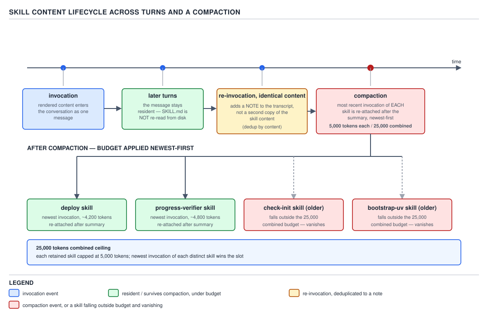

# 21 AI for Coding — the content lifecycle and supporting files — BASICS (§1.5.15–1.5.18)

**Target version: Claude Code v2.1.2xx (August 2026).** | **Part 1 of 6** | [Index](../00-index.md)
Previous: [substitution and dynamic injection](03-substitution-and-injection.md) · Next: [three real skills, read closely](05-cases.md)

The last three files built `SKILL.md` piece by piece: the frontmatter fields, who may invoke it,
and the placeholders and shell injection that make its body dynamic. Every one of those files
treated "the skill runs" as the end of the story. It is not. §0.2.4 and §0.2.6 already established
that the transcript only grows and is re-sent whole on every turn, and §1.3.26 already covered what
of an instruction file survives a compaction summary. This file asks the question those two facts
imply for a skill specifically: once a skill's content lands in that transcript, what happens to it
ten turns later, and what happens to it across a compaction? The answer changes how you should write
a `SKILL.md` body, and this file is the last stop before Part 1 closes on three real skills read
end to end.

### §1.5.15 — the content lifecycle: one message, and it stays `[DOC]`

**Concept.** Picture invoking a skill as dropping a message into the transcript by hand — not a
lookup Claude performs each time it needs the instructions, but a literal, permanent insertion. Once
`/mvn-test-runner` renders and enters the conversation, that rendered text is a message like any
other user or tool message. It sits in the transcript at the turn it was invoked, and every later
turn re-sends the whole transcript to the model, so that message rides along unchanged, forever,
until something evicts it.

**Why it exists.** The alternative — re-reading `SKILL.md` from disk before every turn a skill might
apply to — would mean paying the file's token cost repeatedly for no new information, since the file
has not changed. Inserting it once and letting ordinary transcript persistence carry it forward is
strictly cheaper, and it composes with everything the harness already does with a growing
transcript. The cost of a skill is paid once per invocation, not once per turn.

**How it works.** `[DOC]` Re-verified against the current skills page immediately before writing
this file. Quoting the mechanism directly:

> "When you or Claude invoke a skill, the rendered `SKILL.md` content enters the conversation as a
> single message and stays there across later turns... Claude Code does not re-read the skill file
> on later turns."

Two consequences follow directly, and both are `[DOC]`:

- **The file is not re-read.** If you edit `SKILL.md` after invoking it once in a session, the
  transcript still holds the *old* rendered content until you invoke the skill again. Live change
  detection (Part 1's second file) updates what a *fresh* invocation renders — it does not reach
  back and patch a copy already sitting in the transcript.
- **A re-invocation with identical rendered content does not duplicate it.** Quoting again: "When
  Claude re-invokes a skill whose rendered content is identical to the copy already in context,
  Claude Code adds a short note that the skill is already loaded rather than a second copy of the
  content." The dedup is by rendered content, not by name — a skill invoked twice with different
  arguments, or with a `` !`command` `` placeholder that produced different output the second time,
  renders differently each time, and Claude Code appends the full content again rather than a note.

Now embed the picture before going further, because the next leaf continues directly from this
mechanism into what a compaction does to it.



**D-40** — Skill content across turns and a compaction. Watch the two oldest invocations fall outside
the budget.

**Code.** The consequence this leaf exists to land is a writing rule, not an API: *write standing
instructions, not one-time steps.* A skill body that says "now do step 3" is still sitting in the
transcript, unchanged, twenty turns later, long after step 3 has been done — and the model rereads
that sentence on every subsequent turn as if it were still live guidance. Compare the two bodies
below. Both are real, invocable skills; only the phrasing of the instructions differs.

Wrong — reads as a one-time script, decays into noise after the first turn it applies to:

```yaml
---
name: mvn-test-runner
description: Run the Maven test suite and report failures
disable-model-invocation: true
allowed-tools: Bash(mvn test *)
---

Now run `mvn test` and paste the failing test names into your next reply. Then wait for me to tell
you which one to fix first.
```

Twenty turns after this fires, "wait for me to tell you which one to fix first" is still sitting in
the transcript, still being re-read by the model on every turn, describing a moment that has already
passed. It gives the model nothing useful to do with it and nothing to correct against if the
conversation drifts.

Right — a standing rule the model can apply at any later turn, not just the one it was invoked on:

```yaml
---
name: mvn-test-runner
description: Run the Maven test suite and report failures
disable-model-invocation: true
allowed-tools: Bash(mvn test *)
---

Whenever you believe a change is ready to hand back, run `mvn test` first and report the failing
test names before claiming the change is done. Never report success on a change you have not run
this command against since your last edit to a Java file.
```

The second body reads correctly whether the model consults it on the turn it was invoked, or on
turn thirty after three more edits — because it states a condition ("whenever... before claiming
done"), not a step number.

**Gotcha.** If a skill "seems to stop working" after its first response, the content is almost
never gone — `[DOC]` "the content is usually still present and the model is choosing other tools or
approaches." The fix is not to re-invoke it out of habit; it is to strengthen the `description` and
the instructions so the model keeps preferring the skill, or to back the behavior with a
[hook](../hooks/01-basics-what-a-hook-is.md) that enforces it deterministically instead of hoping the model
rereads a buried sentence correctly. The one case where re-invoking *is* the right fix is the one
the next leaf explains: content that a compaction has genuinely dropped.

> **Definition.** The skill content lifecycle is the rule that a skill's rendered `SKILL.md` content
> enters the transcript once, as an ordinary message, is never re-read from disk on later turns, and
> is deduplicated by content rather than replaced on re-invocation.

### §1.5.16 — skills through a compaction: 5,000 tokens each, 25,000 combined, newest-first `[DOC]` `[NUM]`

**Mechanism.** A compaction replaces the bulk of the transcript with a summary once the context
fills — the mechanics of when and how that trigger fires belong to the harness-wide compaction
material, not repeated here. What matters for a skill specifically is what a compaction does to the
messages skill invocations occupied. `[DOC]` Re-verified immediately before writing this leaf,
quoted directly:

> "When the conversation is summarized to free context, Claude Code re-attaches the most recent
> invocation of each skill after the summary, keeping the first 5,000 tokens of each. Re-attached
> skills share a combined budget of 25,000 tokens. Claude Code fills this budget starting from the
> most recently invoked skill, so older skills can be dropped entirely after compaction if you have
> invoked many in one session."

Unpack that into rules rather than prose, because the numbers only mean something once you can run
them:

1. **Per-skill cap: 5,000 tokens.** Only the most recent invocation of a *given* skill survives at
   all — an older invocation of the same skill is not separately re-attached, it is simply gone,
   dedup'd out of consideration before the budget math even starts. If that surviving invocation's
   rendered content is longer than 5,000 tokens, it is truncated to the first 5,000.
2. **Combined cap: 25,000 tokens.** All re-attached skills, across every distinct skill invoked in
   the session, share one 25,000-token pool.
3. **Fill order: newest-first.** Claude Code walks skills from most-recently-invoked to
   least-recently-invoked, adding each one's (capped) size to a running total. A skill is
   re-attached in full (up to its own 5,000-token cap) if the running total after adding it is still
   ≤ 25,000. The first skill in that walk whose addition would exceed 25,000 does not partially
   attach — it and everything older than it in the walk simply do not survive the compaction.

D-40's own worked case uses exactly these numbers: `deploy` at roughly 4,200 tokens and
`progress-verifier` at roughly 4,800 tokens both survive comfortably (4,200 + 4,800 = 9,000, nowhere
near the 25,000 ceiling), while two older invocations shown on the same canvas, `check-init` and
`bootstrap-uv`, are pushed entirely out of the budget by other skills invoked in between and vanish.

**Arithmetic.** `[PROVE]` Work a full session through the same two numbers. Six skills get invoked
across a long session, oldest to newest:

| Order invoked (oldest → newest) | Skill | Rendered size | Size after the 5,000 per-skill cap |
|---|---|---|---|
| 1 (oldest) | `bootstrap-uv` | 7,200 tokens | 5,000 |
| 2 | `check-init` | 3,000 tokens | 3,000 |
| 3 | `mvn-test-runner` | 5,500 tokens | 5,000 |
| 4 | `readonly-reviewer` | 6,800 tokens | 5,000 |
| 5 | `progress-verifier` | 4,800 tokens | 4,800 |
| 6 (newest) | `deploy` | 4,200 tokens | 4,200 |

A compaction now fires. Claude Code walks newest-first and accumulates against the 25,000 combined
ceiling:

```
1. deploy               +4,200  → running 4,200   (fits, 4,200 ≤ 25,000)
2. progress-verifier     +4,800 → running 9,000    (fits)
3. readonly-reviewer     +5,000 → running 14,000   (fits)
4. mvn-test-runner       +5,000 → running 19,000   (fits)
5. check-init            +3,000 → running 22,000   (fits — 3,000 ≤ 25,000 - 19,000 = 6,000 remaining)
6. bootstrap-uv          +5,000 → would be 27,000  (does NOT fit — 5,000 > 25,000 - 22,000 = 3,000 remaining)
```

`deploy`, `progress-verifier`, `readonly-reviewer`, `mvn-test-runner`, and `check-init` all survive
the compaction, re-attached after the summary, none of them truncated below their capped size.
`bootstrap-uv` — the oldest invocation in the session — is the one that does not fit, and it does not
partially attach at 3,000 of its 5,000 capped tokens. It is dropped entirely. That final row is the
one this file's diagram draws directly: an older invocation whose combined position in the walk puts
it past the ceiling simply vanishes, in whole, not in part.

**Gotcha.** `[TRAP]` **Pitfall:** the wrong belief is "I invoked it once this session, so it's
covered for the rest of the session." The symptom: a long session invokes five or six different
skills, a compaction fires midway through, and the earliest ones invoked stop influencing the model
at all — with no error, no warning, just silent absence, because they lost the newest-first walk
against skills invoked after them. The fix `[DOC]`: "If the skill is large or you invoked several
others after it, re-invoke it after compaction to restore the full content." Re-invocation is not
paranoia here — it is the documented recovery path once you know a compaction has happened.

> **Definition.** Skill re-attachment through compaction keeps the newest invocation of every
> distinct skill, capped at 5,000 tokens each, filled newest-first against a shared 25,000-token
> ceiling, so the oldest invocations in a long session are the ones a compaction can drop entirely.

### §1.5.17 — `context: fork`, `agent:`, `background:`: running the skill off to the side `[DOC]` `[VERSION]`

**Concept.** Everything in §1.5.15 and §1.5.16 assumed a skill's content lands inline, in the main
conversation, competing for the same transcript and the same compaction budget as everything else.
`context: fork` is the escape from that: instead of the rendered `SKILL.md` body becoming a message
in the current conversation, it becomes the entire prompt handed to a brand-new subagent that has no
access to the conversation history at all. The subagent does its work — however many tool calls,
however much exploration — in its own isolated context, and only its final summary comes back.

**Why it exists.** A skill whose job is genuinely verbose — read forty files, run a long build, walk
a diff commit by commit — pays that verbosity twice if it runs inline: once while the subagent does
the work, and again forever afterward as dead weight sitting in the main transcript, subject to the
exact 5,000/25,000-token compaction fate just worked through above. Forking moves all of that cost
into a context that gets thrown away when the subagent finishes, and only the distilled answer
enters the main conversation. The shape is: verbose work in, small answer out.

**How it works.** `[DOC]` `[VERSION]` Three frontmatter fields cooperate:

- **`context: fork`** — the field that turns the whole mechanism on. Without it, the skill always
  runs inline regardless of the other two fields.
- **`agent:`** — which subagent type executes the forked skill: a built-in (`Explore`, `Plan`,
  `general-purpose`) or any custom subagent defined under `.claude/agents/`. Omitted, it defaults to
  `general-purpose`. The choice matters for what the subagent starts with: `Explore` and `Plan` skip
  loading `CLAUDE.md` and git status to keep their own context small, so a forked skill pinned to
  `agent: Explore` sees only the rendered `SKILL.md` content plus the `Explore` agent's own system
  prompt — nothing else.
- **`background:`** — as of **Claude Code v2.1.218**, a forked skill runs in the background by
  default (`background: true` is the default value): you keep working in the main conversation while
  the subagent runs, and its result arrives when it completes. Set `background: false` to instead
  block the invoking turn until the forked subagent finishes. **Before v2.1.218, forked skills always
  blocked the turn** — `background` did not exist yet, so this is a version trap in the other
  direction from most: the *newer* behavior (background by default) is the one worth stating
  explicitly, since colleagues who last touched this before v2.1.218 will expect a blocking call.

Several situations force a blocking wait regardless of what `background` says: non-interactive `-p`
runs and the Agent SDK, `CLAUDE_CODE_DISABLE_BACKGROUND_TASKS=1`, invoking a forked skill while an
earlier invocation of that same skill is still running, and a scheduled task firing with the skill
as its prompt.

**When this is the right shape.** Reach for `context: fork` when the skill's own instructions are an
actionable *task* — "research this," "review this diff," "refresh this checklist against the
current codebase" — not when the skill is reference material like coding conventions the main
conversation should keep applying turn after turn. `[DOC]` "`context: fork` only makes sense for
skills with explicit instructions. If your skill contains guidelines like 'use these API
conventions' without a task, the subagent receives the guidelines but no actionable prompt, and
returns without meaningful output." This is exactly the isolation argument the reader will meet in
full in Part 2 of this topic (`subagents/`) — a forked skill's subagent is, mechanically, a subagent
invocation, and everything Part 2 says about what a subagent starts with and what it can see applies
here too.

**SVG.** No new diagram earns its place here — the shape (verbose work isolated, small answer
returned) is the same shape Part 2's subagent diagrams cover in depth; repeating it here would be the
duplication this file's dispatch explicitly asks not to happen.

**Code.** A real forked skill, invoked as a task rather than left to Claude's judgment:

```yaml
---
name: checklist-refresh
description: Re-walk the onboarding checklist against the current repository and flag stale steps
context: fork
agent: general-purpose
background: true
disable-model-invocation: true
---

Read docs/onboarding-checklist.md end to end. For every numbered step, verify against the current
repository whether the step is still accurate: does the referenced file still exist at that path,
does the referenced command still run, is the referenced script still present. Report back only the
steps that are now wrong, each with the line number and a one-sentence correction. Do not report
steps that are still accurate.
```

Invoking `/checklist-refresh` hands that entire body to a fresh `general-purpose` subagent as its
task. It runs in the background; the main conversation is free to continue, and only the list of
stale steps — not the forty-odd file reads it took to find them — lands back in the transcript this
file has spent two leaves describing the fate of.

**Gotcha.** `[TRAP]` **Pitfall:** treating `background: true` as "fire and forget" the way a shell
background job works. A backgrounded fork's edits land **outside your session's checkpoints**, so
`/rewind` cannot undo them — reverting requires git, same as any other change made outside the
session's own undo mechanism. The fix: know before you fork a skill that mutates files whether you
are prepared to revert with git rather than `/rewind` if the result is wrong.

> **Definition.** `context: fork` runs a skill's rendered content as the whole prompt to an isolated
> subagent chosen by `agent:`, backgrounded by default since v2.1.218 unless `background: false`
> forces the invoking turn to wait, keeping the skill's own verbosity out of the main transcript
> entirely.

### §1.5.18 — a skill is a directory: supporting files and `${CLAUDE_SKILL_DIR}` `[DOC]`

**Mechanism.** Every prior file in this set treated `SKILL.md` as if it were the skill. It is only
the *required* file. A skill's home is a directory, and Claude Code will happily leave anything else
in that directory alone until `SKILL.md`'s own body tells the model to go read it. `[DOC]` "Skills
can include multiple files in their directory. This keeps `SKILL.md` focused on the essentials while
letting Claude access detailed reference material only when needed. Large reference docs, API
specifications, or example collections don't need to load into context every time the skill runs."

A real layout, for a skill whose reference material is genuinely large — a full Maven test-failure
triage guide that would be wasteful to inline into every invocation:

```
mvn-test-runner/
├── SKILL.md                    (required — overview, and a pointer to the reference file)
├── reference.md                (triage guide: common failure categories, what each one usually means)
└── scripts/
    └── summarize-failures.sh   (executed by the Bash tool, never loaded as text)
```

`${CLAUDE_SKILL_DIR}` is the substitution (introduced in §1.5.11, three leaves back) that makes this
layout portable: it resolves to the directory holding *this skill's own* `SKILL.md`, so a script
reference written with it resolves correctly whether the skill sits under `~/.claude/skills/`,
`.claude/skills/`, or inside a plugin, without the skill author hardcoding any of those paths.

**Code.** The `SKILL.md` in that directory points at `reference.md` rather than inlining its
contents — the reference file's tokens are paid only on the turn Claude actually opens it, not on
every invocation of the skill:

```yaml
---
name: mvn-test-runner
description: Run the Maven test suite, summarize failures, and triage them against known categories
allowed-tools: Bash(mvn test *) Bash(${CLAUDE_SKILL_DIR}/scripts/summarize-failures.sh *)
---

Run `mvn test`, then pipe the output through
`${CLAUDE_SKILL_DIR}/scripts/summarize-failures.sh` to get a structured list of failing tests.

For any failure whose category is unclear from the summary, read
[reference.md](reference.md) — it lists the common failure categories (flaky test timing,
stale test fixtures, a real regression) and what distinguishes each one — before deciding how to
report it.

Never report success on a change you have not run this against since your last edit to a Java file.
```

That last sentence is a deliberate callback to §1.5.15's standing-instructions rule — this body still
obeys it even while introducing supporting files. The reference material only costs tokens on the
turn Claude follows the link; every other invocation pays only for the `SKILL.md` body shown above.
`[DOC]` The house limit backing this pattern: "Keep `SKILL.md` under 500 lines. Move detailed
reference material to separate files" — the 500-line figure is a recommendation about the required
file, not a hard ceiling enforced by the harness, and it exists precisely so the split above is worth
doing before `SKILL.md` itself becomes the thing paying a cost on every invocation.

**Gotcha.** No gotcha in the mechanism itself — a directory with unreferenced files is inert, and a
directory whose `SKILL.md` never mentions `reference.md` simply means that file is dead weight nobody
reads, not a bug. The one adjacent question — what a skill's directory looks like when it is a real,
complete, working example rather than this section's illustrative layout — is what the very next
file in this set answers directly; §1.5.19 is not covered here.

> **Definition.** A skill is a directory: `SKILL.md` is the only required file in it, and anything
> else — `references/`, scripts, data — is read only when `SKILL.md`'s own body points at it,
> typically via `${CLAUDE_SKILL_DIR}` so the path resolves regardless of where the skill is
> installed.

---

## Pitfalls

- **Belief:** "I fixed a typo in the skill, so the model already sees the fix." **Outcome:** the
  transcript still holds whatever was rendered at the last invocation — §1.5.15's file-is-not-re-read
  rule applies to your own edits exactly as much as anyone else's. **What actually gets the
  guarantee:** invoke the skill again in the current session to render the edited file fresh.
  **Why people believe it:** editing a source file and having every future read reflect it is how
  every other file in the repository behaves; a skill's rendered copy inside an active transcript is
  the one place that is not true until re-invoked.

- **Belief:** "the skill fired once this session, it's covered." **Outcome:** a compaction can drop
  it entirely if enough newer skills were invoked after it, per §1.5.16's newest-first, 25,000-token
  walk, with no error shown. **What actually gets the guarantee:** re-invoke the skill after a
  compaction if you suspect it mattered and the model's behavior suggests it forgot. **Why people
  believe it:** most context does persist across a compaction in some form (a summary), so it is easy
  to assume a skill's content does too, in full, indefinitely.

- **Belief:** "`context: fork` with `background: true` means I don't need to check on it, git or
  otherwise." **Outcome:** a backgrounded fork's file edits sit outside the session's checkpoints, so
  `/rewind` silently cannot touch them. **What actually gets the guarantee:** treat any file change
  from a backgrounded forked skill as git-revertible only, and check the diff before trusting it.
  **Why people believe it:** every other edit Claude makes inline in the session is checkpointed and
  `/rewind`-able, so it is a reasonable but wrong extrapolation that a forked skill's edits work the
  same way.

## Cheat sheet

| Fact | Value |
|---|---|
| Skill content enters the transcript | Once, as one message, at invocation |
| Re-read from disk on later turns? | No |
| Re-invocation, identical rendered content | Dedup'd to a short note, not a second copy |
| Re-invocation, different rendered content (args or `!` output changed) | Full content appended again |
| Per-skill cap after compaction | 5,000 tokens (of that skill's most recent invocation only) |
| Combined cap after compaction | 25,000 tokens, across all re-attached skills |
| Fill order after compaction | Newest invocation first; the first one that doesn't fit, and everything older, vanishes |
| Recovery after a compaction drops a skill | Re-invoke it |
| Field that forks a skill into a subagent | `context: fork` |
| Field that picks the subagent type | `agent:` (default `general-purpose`) |
| Field controlling blocking vs background | `background:` (default `true`, requires v2.1.218+) |
| Forked skill's file edits vs `/rewind` | Not checkpointed; revert with git only |
| Required file in a skill directory | `SKILL.md` only |
| How supporting files get read | On demand, via a link `SKILL.md` makes, usually through `${CLAUDE_SKILL_DIR}` |
| Recommended `SKILL.md` size | Under 500 lines (move detail to separate files) |

## Self-test

1. You edit `SKILL.md` for a skill already invoked earlier in the current session, but do not
   re-invoke it. Does the model see your edit on the next turn?
<details><summary>Answer</summary>No. The rendered content already sitting in the transcript from the earlier invocation is unchanged; Claude Code does not re-read the file on later turns. You must invoke the skill again in this session for the model to see the edited version.</details>

2. A skill is invoked twice in the same session with the same arguments and no `` !`command` ``
   placeholders. What lands in the transcript the second time?
<details><summary>Answer</summary>A short note that the skill is already loaded, not a second copy of the full content — Claude Code deduplicates by comparing the rendered content, and identical content produces a note instead of a duplicate message.</details>

3. Six skills are invoked in a session, oldest to newest, with capped sizes (after the 5,000-token
   per-skill ceiling) of 5,000; 3,000; 5,000; 5,000; 4,800; 4,200. A compaction fires. Which ones
   survive?
<details><summary>Answer</summary>Walking newest-first: 4,200 (running 4,200) fits; +4,800 (9,000) fits; +5,000 (14,000) fits; +5,000 (19,000) fits; +3,000 (22,000) fits, since 22,000 ≤ 25,000; the oldest, +5,000, would bring the running total to 27,000, which exceeds 25,000, so it does not fit and is dropped entirely. Five of the six survive; only the single oldest invocation is dropped.</details>

4. What has to be true of a `context: fork` skill's own body for the pattern to make sense at all?
<details><summary>Answer</summary>The body has to contain an actionable task, not just reference guidelines. A forked subagent receives the rendered SKILL.md content as its entire prompt with no conversation history; guidelines with no task ("use these API conventions") give it nothing to act on and it returns without meaningful output.</details>

5. Before Claude Code v2.1.218, what did a `context: fork` skill do when invoked, regardless of any
   setting?
<details><summary>Answer</summary>It always blocked the invoking turn until the forked subagent finished. The `background` field, and background-by-default forking, did not exist before v2.1.218.</details>

6. A forked skill runs in the background and edits three files. You decide the result was wrong and
   type `/rewind`. What happens to those three files?
<details><summary>Answer</summary>Nothing — `/rewind` does not touch them, because a backgrounded fork's edits apply outside the session's checkpoints. Reverting them requires git.</details>

7. Where does a skill's supporting reference material actually get read from, and when?
<details><summary>Answer</summary>From the skill's own directory (never inlined into SKILL.md), and only when SKILL.md's body points at it — typically via a markdown link the model follows, using ${CLAUDE_SKILL_DIR} in any script or file path so it resolves regardless of where the skill is installed.</details>

## Open questions

None.

---

**Leaves covered:** 1.5.15–1.5.18 (4 leaves)
**Leaves deferred:** none
**Diagrams included:** D-40
**Target version:** Claude Code v2.1.2xx (August 2026)
**Lines:** 433
