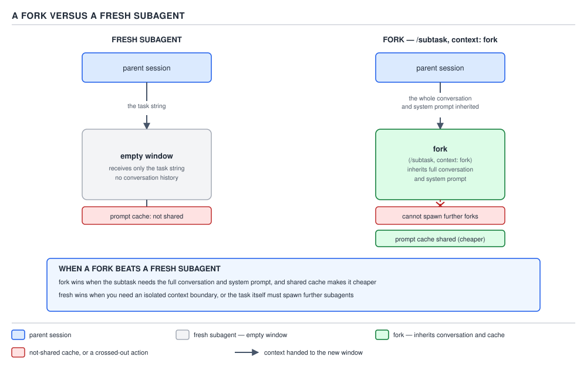

# 21 AI for Coding — built-ins, foreground and background, and forks — INTERMEDIATE (§2.1.11–2.1.15)

**Target version: Claude Code v2.1.2xx (August 2026).** | **Part 2 of 6** | [Index](../00-index.md)
Previous: [the subagent context boundary](02-the-context-boundary.md) · Next: [limits and where the 2× comes from](04-limits-and-cost.md)

## §2.1.11 The four built-ins, and what each one gives up

**Concept.** Every subagent dispatched from a session is either a custom definition the reader wrote — `readonly-reviewer`, `mvn-test-runner` — or one of four built-ins Claude Code ships and can choose without any definition file existing at all: `Explore`, `Plan`, `general-purpose`, and `claude`. `[DOC]`

**Why it exists.** The parent model has to be able to delegate even in a repository with zero custom agent definitions — a fresh checkout, a one-off session, a reader who has never written a `.claude/agents/` file in their life. Without a built-in roster, delegation would be a feature the reader has to opt into by authoring definitions first; with it, "go search the codebase for X" or "go do this multi-step task" always has somewhere to land.

**How it works, per built-in, on the authority of the `sub-agents` doc page, re-verified by WebFetch immediately before this file was written (2026-08-29):**

| Built-in | Purpose (quoted) | Tools | What it gives up |
|---|---|---|---|
| `Explore` | "A fast, read-only agent optimized for searching and analyzing codebases." | Read-only tools; "Write and Edit are denied." Model inherits from the main conversation, capped at Opus on the Claude API. | `CLAUDE.md` and git status — the exception the previous file's §2.1.8 already named. Cannot modify anything it finds. |
| `Plan` | "A research agent used during plan mode to gather context before presenting a plan." | Read-only tools; Write and Edit denied. | Same exception as `Explore`: `CLAUDE.md` and git status skipped. |
| `general-purpose` | "A capable agent for complex, multi-step tasks that require both exploration and action." | "Every tool available to subagents." | Nothing beyond the subagent-wide restrictions in §2.1.14 — chosen when a task needs both reading and writing, or reasoning across dependent steps. |
| `claude` | The catch-all: "When a task doesn't fit a more specialized agent." | Every tool available to subagents, same as `general-purpose`. | Nothing extra — but it is also the default agent Claude Code reaches for when a **background** session is dispatched with no other type requested (§2.1.12). |

The tie-back to §2.1.8: that file established Explore and Plan as "the only subagents that omit CLAUDE.md and git status" without saying why those two specifically. The doc's own framing answers it — both exist "to keep research fast and inexpensive," and a read-only search agent has no use for project-wide behavioural rules it cannot act on anyway; `CLAUDE.md` tells a subagent how to *write* code in this repository, which is exactly the one thing Explore and Plan are forbidden from doing.

**Code.** A dispatch that lets the parent pick automatically names no type at all — the same `Agent` tool call shape used throughout this note set:

```
Agent({
  description: "Locate every caller of the retry-budget config",
  prompt: "Search the sdlc-harness engine package for every call site that reads DEFAULT_MAX_TURNS. Report file paths and line numbers only, no summary of the retry logic itself.",
  subagent_type: "Explore"
})
```

Omitting `subagent_type` entirely, per the doc, falls back to `general-purpose` "if the session still has that type" — a session can, in principle, have that built-in disabled by settings, which is why the fallback is conditional rather than absolute.

`Explore` additionally takes a thoroughness level as part of its dispatch — "quick for targeted lookups, medium for balanced exploration, or very thorough for comprehensive analysis" — which trades cost for coverage inside the read-only budget the built-in already operates under:

```
Agent({
  description: "Find every place DEFAULT_MAX_TURNS is read or overridden",
  prompt: "Search harness/src/harness/engine and harness/control-plane for every read of DEFAULT_MAX_TURNS, including settings.json overrides and per-playbook overrides. List file, line, and the resolved value at that point.",
  subagent_type: "Explore"
})
```

is a "quick" job if it names one exact constant; the same call over "every configuration value that can change agent behaviour at runtime" is a "very thorough" job, and asking for `quick` on that broader question is the reader trading completeness for tokens without saying so out loud.

**Gotcha.** `general-purpose` and `claude` look interchangeable from the tool table alone — both get every subagent tool — but they answer different questions. `general-purpose` is what the parent reaches for when *it* decides a task needs exploration and action together; `claude` is what a **background** dispatch defaults to when nothing more specific is requested. Naming `claude` explicitly in a foreground dispatch works, but it is not the built-in's primary purpose, and a reader who sees `claude` show up unrequested in a task list is usually looking at a background session's default, not a deliberate foreground choice.

> The four built-ins are the delegation targets that exist with zero configuration: `Explore` and `Plan` trade write access and project context for speed, `general-purpose` and `claude` keep the full toolset and differ only in which situation reaches for them by default.

## §2.1.12 Foreground versus background: two modes, one real trade-off

**Mental model.** A foreground subagent is a phone call — the parent is on the line, cannot do anything else, and the other party's questions come straight to the parent as they happen. A background subagent is a text message sent to a contractor — the parent goes back to its own work, and when the contractor hits something that needs a decision, that question shows up as a notification the parent can act on without dropping what it was doing. The two differ in exactly one thing: whether the parent's own turn is blocked while the subagent runs.

**Why it exists.** Some delegated work has an answer the parent's very next sentence depends on — "does this file exist" gates whatever the parent says next, so there is nothing useful for the parent to do except wait. Other delegated work is a long errand — running the full test suite, refactoring a module — where the parent has plenty it could still say or do while that errand is in flight, and forcing it to sit idle for the whole duration would waste exactly the turns background mode exists to reclaim.

**When to reach for it, and when not.** The choice is not usually the reader's to make explicitly — Claude Code decides for each dispatch — but the reader can force it, and knowing when to force which is the actual skill. Force **foreground** — via `CLAUDE_CODE_DISABLE_BACKGROUND_TASKS=1`, or by a subagent's own logic needing the result before it can proceed — when the very next step is a hard dependency on this subagent's output. Force **background** — via a subagent definition's `background: true` frontmatter field — for a long-running errand whose result the parent does not need immediately: a full `mvn test` run, a large multi-file refactor, anything the reader would rather keep working alongside rather than wait on.

**How it works.** The doc states the decision as an ordered set of cases, the first one that applies wins, quoted from the `sub-agents` page:

1. An in-process agent-team teammate's spawn always runs in the foreground; a teammate cannot force background at all — "Claude Code refuses with an error to spawn a teammate's subagent whose definition sets `background: true`."
2. If `CLAUDE_CODE_DISABLE_BACKGROUND_TASKS=1` is set, every subagent in every kind of session runs in the foreground, full stop — this overrides everything below it.
3. Where **fork mode is on** — the default in an interactive session — "Claude Code runs the subagent in the background, forks and non-fork subagents alike, and Claude can't ask for the foreground." This is the counter-intuitive current default: in an ordinary interactive session today, background is not the exception, it is what happens unless something above overrides it.
4. Where fork mode is off — the default in headless mode (`-p`) and in the Agent SDK unless explicitly turned on — Claude runs the subagent in the background by default and switches to foreground only "when it needs the result before continuing." A subagent's own `background: true` field keeps it backgrounded even in that case.

**Insight:** this is the version trap worth calling out by name. The folklore version of this mechanism — "foreground is the default; background is something you opt into with a flag" — describes headless mode and the Agent SDK, not an ordinary interactive session in v2.1.2xx, where fork mode being on by default flips the framing entirely: background is the default there, and the parent cannot even request foreground for a case-3 dispatch.

Worked through case by case, the same dispatch — `readonly-reviewer` reviewing a pending diff — lands differently purely on session shape:

| Session | Fork mode | Result |
|---|---|---|
| Ordinary interactive session, no override set | On (default) | Case 3 applies: background, unconditionally — the parent cannot force foreground even by asking for the result immediately |
| Same session, `CLAUDE_CODE_DISABLE_BACKGROUND_TASKS=1` | On, but overridden | Case 2 applies before case 3 is ever reached: foreground, in every kind of session |
| `claude -p "review this diff"` (headless) | Off by default | Case 4 applies: background by default, foreground only if the script's own logic needs the result before continuing |
| An agent-team teammate dispatches `readonly-reviewer` | Irrelevant — case 1 wins first | Foreground, always, regardless of fork mode or the env var |

Reading the table down is the point: cases 1 and 2 are absolute overrides that never consult fork mode at all, and only once neither applies does fork mode's own on/off state decide anything.

**How permission prompts surface from a background agent.** "When a background subagent reaches a tool call that needs permission, Claude Code surfaces the prompt in your main session and names the subagent that is asking." The reader answers it inline, in the main session, without switching context to the subagent itself — and if the answer is a lasting grant rather than a one-off approval, "Claude Code applies your answer to the whole session, including your main conversation," not just to that one subagent's remaining run.

**What a background subagent gives up beyond permission handling.** A background subagent — other than a fork — runs with a smaller built-in tool set than a foreground one: `Read`, `Grep`, `Glob`, `Bash`, `PowerShell`, `Edit`, `Write`, `NotebookEdit`, `WebFetch`, `WebSearch`, `TodoWrite`, `Skill`, `ToolSearch`, `EnterWorktree`, `ExitWorktree`, `Monitor`, `TaskStop`, `SendMessage`, and `Artifact` — everything else, `Agent` and `ExitPlanMode` aside (which follow their own separate rules regardless of foreground or background), is simply not available to it.

**Code.** Forcing a subagent to stay backgrounded regardless of what the parent would otherwise request:

```markdown
---
name: mvn-test-runner
description: Runs the full Maven test suite against the current branch and reports pass/fail counts with failure detail. Use when a story's branch needs verification before merge.
tools: Read, Bash, Grep
background: true
model: sonnet
maxTurns: 30
---

You run the project's test suite and report results. You do not fix
failing tests yourself.

1. Run `mvn -B test` from the repository root.
2. Parse the Surefire summary for pass/fail/error/skipped counts.
3. For every failure, report the test class, the method, and the
   assertion message — not the full stack trace.
4. Report a single verdict: ALL PASS, or FAILURES with the list above.
```

Forcing the opposite — every subagent in the session to foreground, overriding even case 3 above — is a session-wide environment setting, not a per-agent frontmatter field:

```json
{
  "env": {
    "CLAUDE_CODE_DISABLE_BACKGROUND_TASKS": "1"
  }
}
```

**Gotcha.** A background subagent's result does not interrupt the parent's current turn to deliver itself — "a background subagent's results reach Claude as a completion notification in a later turn," and if the reader asks about progress before that notification lands, the honest answer is "still running," not a fabricated status update. A reader who dispatches `mvn-test-runner` in the background and then, two sentences later, asks "did the tests pass" is asking a question the parent cannot yet answer correctly — the notification has not arrived — which is exactly the shape of race this note set's own fork-usage guidance elsewhere warns against: state status, never guess at a result that has not come back.

**Interview:** "You dispatch a long-running subagent and immediately need to keep asking the assistant questions in the same session — does that block you?" — Not by default in an interactive session, because fork mode is on there and background is the case that applies; the parent keeps taking turns, any permission prompt the subagent hits surfaces inline with the subagent named, and the result itself lands as a completion notification whenever the work finishes, not as something the reader has to poll for.

> Foreground blocks the parent's turn until the subagent returns and passes permission prompts straight through; background lets the parent keep working and surfaces permission prompts as they arise, with the result itself arriving as a later notification — and in an ordinary interactive session today, background is the default the parent cannot even override for most dispatches.

## §2.1.13 Forks: the exception to every rule the last two files established

**`[VERSION]`** Forking as a first-class mechanism — the `/subtask` command specifically — requires **Claude Code v2.1.212 or later**. A reader on an earlier v2.1.2xx build does not have the slash command, though the underlying `fork` subagent type and `context: fork` skill field may still be present depending on exact build.

**Mental model.** Every subagent the previous file described starts as an empty room with a note taped to the door — the task string is the only thing in it, and everything the parent has ever said or seen stays outside. A fork is the opposite move entirely: instead of an empty room, the parent hands over a photocopy of its entire office — every file on the desk, every sticky note, the whole conversation to date — and says "you take it from here." That photocopy is why a fork is cheap: it is not drawn from scratch, it is a copy of something that already existed, and copying a cache hit is far cheaper than generating a new room's contents from nothing.

**Why it exists.** The previous file's whole boundary — task string in, one message out, nothing of the parent's history crosses — is exactly right when the delegated task is self-contained: reviewing a diff, running a test suite, searching a codebase. It is exactly wrong when the task is "keep going on what we were just doing, but off to the side, without derailing the main thread" — a long tangent the reader wants explored without paying for it in the main context window, where the *point* is that the tangent needs everything the main conversation already has, not a fresh briefing of it.

**When to reach for it, and when not.** A fork beats a fresh subagent exactly when the task depends on conversational history the reader does not want to re-type into a task string — "take the refactor plan we just agreed on and go implement it across the other twelve files, but keep that out of my main context" is a fork-shaped task, because writing an equivalent task string for a fresh `general-purpose` subagent would mean re-stating the whole plan the conversation already contains. A fresh subagent beats a fork exactly when the inheritance is precisely what the reader does not want: a subagent meant to give an *independent* second opinion — this note set's own `code-review` skill spawning a fresh reviewer specifically so it "won't see my analysis, so it can give an independent read" — would be sabotaged by forking, because a fork inherits the very analysis the independence was supposed to route around.

**How it works.** Three invocation shapes surface the same mechanism:

1. **`/subtask`**, a slash command that forks the current conversation into a subagent directly.
2. **The `Agent` tool with `subagent_type: "fork"`** — "Claude can spawn a fork by requesting the `fork` subagent type," available only where fork mode is on.
3. **A skill's own `context: fork` frontmatter field** — the reader met this exact field in this topic's `skills/04-lifecycle-and-supporting-files.md` (§1.5.17) as a one-line forward pointer; this is where it gets paid off. A skill declared with `context: fork` runs as a fork whenever it is invoked, "whether or not fork mode is on" for the session as a whole — the skill's own frontmatter overrides the session-level default.

Quoted directly, on what a fork inherits: "A fork is a subagent that inherits the entire conversation so far instead of starting fresh... a fork sees the same system prompt, tools, model, and message history as the main session." And on cost: "Because a fork's system prompt and tool definitions are identical to the parent, its first request reuses the parent's prompt cache. This makes forking cheaper than spawning a fresh subagent for tasks that need the same context." A fresh subagent's first request pays full price to populate its context from nothing; a fork's first request is a cache hit against context that already exists, because nothing about it — system prompt, tool list, message history — differs from what the parent just paid to have loaded.



**D-44** — A fork versus a fresh subagent. Note the shared prompt cache on the fork, and that a fork cannot spawn further forks.

**Code.** The three shapes, complete:

```
/subtask Continue the retry-budget refactor we just agreed on: apply it to every caller of ClaudeRunner.run() outside the engine package, using the same DEFAULT_MAX_TURNS constant, and report which files changed.
```

```
Agent({
  description: "Apply the agreed refactor to the remaining callers",
  prompt: "Apply the retry-budget refactor to every caller of ClaudeRunner.run() outside the engine package.",
  subagent_type: "fork"
})
```

```markdown
---
name: implement-story
description: Implements a single story end to end from its PRD, using the full conversation context already established for this feature. Use once a story's plan has been agreed in the current session.
context: fork
tools: Read, Write, Edit, Bash, Grep, Glob
model: sonnet
---

Implement the story exactly as scoped in the plan already agreed in this
conversation. Do not re-derive scope from the PRD alone — the plan already
narrowed it.
```

Isolating a fork's file edits from the reader's own checkout, where the fork is going to touch files the reader is not ready to see changed yet, is a parameter on the dispatch itself, not a frontmatter field: `Agent({ ..., subagent_type: "fork", isolation: "worktree" })` writes the fork's edits to a separate git worktree instead of the parent's.

**Gotcha.** "A fork can't spawn further forks." A fork that itself dispatches the `Agent` tool with `subagent_type: "fork"` does not get a second layer of the same cheap-inheritance mechanism — nesting stops at one level, so a task that seems to want a *chain* of forks each building on the last has to be restructured as one fork doing more work per dispatch, not a fork spawning a fork spawning a fork.

**Pitfall:** treating a fork as simply "a subagent, but with extra context" and reaching for it as the default choice whenever a task feels related to the current conversation. The belief is that more inherited context can only help. The symptom is exactly the independent-review case above: a fork asked to sanity-check the parent's own reasoning inherits that reasoning wholesale and tends to agree with it, because it is not actually a second opinion — it is the same opinion re-read from a photocopy of the same desk. **Fix:** reach for a fresh subagent whenever the value of the delegation is *not* having seen what the parent has seen; reach for a fork only when the value is precisely that it has.

**Interview:** "When would you fork a conversation instead of spawning a plain subagent, and what's the one thing a fork can never do that a fresh subagent can?" — Fork when the delegated work needs the conversation's existing context and you want to avoid re-typing it into a task string, and the shared prompt cache makes it cheaper than a fresh subagent for that same context; the one thing it can never do is spawn a further fork of its own — nesting stops at one level, unlike ordinary subagents which can nest up to the depth limit in §2.1.14.

> A fork is a subagent that inherits the parent's entire conversation, system prompt, and tool list, sharing its prompt cache for a cheaper first request — the opposite of a fresh subagent's clean-room start — at the cost of losing independence and the ability to spawn further forks of its own.

## §2.1.14 The limits, with numbers, and what actually happens at each one

**Concept.** Three separate ceilings govern how many subagents can exist and how they nest, plus a fixed list of tools a subagent is never handed regardless of type. All four are enforced by the harness, not the model — hitting one is a hard stop, not a suggestion the model can talk its way past.

**Why it exists.** Nothing stops a model from *wanting* to spawn an unbounded tree of subagents, each spawning more — every one of them looks individually reasonable at the moment it is requested. Left unchecked, that is an unbounded fan-out of concurrent processes and an unbounded nesting depth, either of which can run a session out of resources or turn a debugging session into an un-traceable web of delegation nobody can reason about afterward. The limits exist to make delegation a bounded resource with a predictable failure mode, the same discipline a connection pool or a thread pool applies to any other resource a system can otherwise over-allocate.

**How it works, per limit, quoted from the `sub-agents` doc page, re-verified immediately before this file was written (2026-08-29):**

| Limit | Value | Env var / setting | What happens when you hit it |
|---|---|---|---|
| Concurrent subagents | **20** (default) | `CLAUDE_CODE_MAX_CONCURRENT_SUBAGENTS` — "any positive whole number." Requires **v2.1.217 or later**. | "Spawning another with the Agent tool fails with `Concurrent subagent limit reached`, and the error tells Claude not to retry." The count is a live gauge, not a one-shot rejection: spawning succeeds again as soon as the running count drops below 20. Sessions with ultracode active are exempt — the limit isn't enforced there. |
| Nesting depth | **3** layers below the main conversation (default) | `CLAUDE_CODE_MAX_SUBAGENT_SPAWN_DEPTH` — set to the number of layers wanted. | "At the depth limit, Claude Code withholds the `Agent` tool from every subagent except a fork, so a subagent at the limit does its delegated work itself and returns one summary." A fork at the limit keeps `Agent` in its tool list, but calling it "returns an error instead of spawning" — the tool is present but non-functional there, a different failure shape from simply not having the tool. |
| Combined `description` routing budget | **~15,000 tokens**, combined across every custom agent's `description`, built-ins excluded | No env var — trimmed by editing the definitions themselves | "Claude Code shows a warning at startup with the total token count." Nothing is silently dropped at this ceiling the way the previous file's routing-budget leaf implied — the current doc frames it as a startup warning the reader is expected to act on by trimming `description` fields and moving detail into each agent's own system prompt, "which only loads when that subagent runs." |
| Tools never available in a subagent | `AskUserQuestion`, `EndConversation`, `EnterPlanMode`, `Workflow` | Not configurable — a fixed exclusion list | The tool name simply is not offered to the subagent at all; a subagent whose task would require one of them cannot call it under any circumstance, frontmatter setting, or model instruction. |

**Divergence flag:** this file's own dispatch names exactly those four tools as "never available in a subagent," matching the leaf as written. The current doc page lists a longer exclusion set for the *first filter that applies to every subagent regardless of foreground or background*: `Agent` (once at the depth limit above), `AskUserQuestion`, `EndConversation`, `EnterPlanMode`, `ExitPlanMode` (unless `permissionMode` is `plan`), `ScheduleWakeup`, `TaskOutput`, `WaitForMcpServers`, and `Workflow`. The four named in the manifest are real and are never available — nothing in them is wrong — but a reader relying on this table as an exhaustive list should know the current doc names five more conditionally-withheld tools beyond them.

D-45 is rendered as the table above rather than an SVG, per this file's manifest entry.

**D-45** — Subagent limits, and the tools that are never there.

**Pitfall:** an author writes a subagent whose task genuinely needs a human decision partway through — "check with the user whether this migration should also touch the archived-orders table" — and reaches for `AskUserQuestion` inside that subagent's own logic, expecting it to pause and surface a choice the way it would in the main session. **Symptom:** the tool is not there at all; the subagent either guesses at an answer and proceeds, silently picking a side of a decision nobody was asked to make, or its final message comes back asking to be asked — a question relayed one turn too late, after whatever the subagent already did on the wrong assumption is already done. **Fix:** a human-authority gate belongs outside the subagent, not inside it — the parent asks the question *before* dispatching, and the task string the subagent receives already contains the answer as a settled fact ("the archived-orders table is out of scope for this migration"), never as an open question the subagent is expected to resolve on its own.

**Interview:** "What happens if a subagent's task requires asking the user something mid-task?" — It cannot: `AskUserQuestion` is one of the tools withheld from every subagent regardless of type, foreground or background. The decision has to be made by the parent before dispatch and handed down as a fact in the task message, or the subagent has to return early with the question as part of its one final message for the parent to relay.

**Insight:** the four rows above are not one limit repeated four times — each fails in a genuinely different shape, and confusing one for another produces a different debugging story. The concurrent-subagent ceiling is a **hard reject at the call site**: the `Agent` tool call itself fails immediately, with an error message telling the model not to retry. The nesting-depth ceiling is **selective tool withdrawal**: nothing about the subagent's own dispatch fails, but the one tool it would need to go one layer deeper — `Agent` — silently stops being offered to it (or, for a fork specifically, stays offered but errors on use, a third shape nested inside the second). The description budget is **a startup-time warning with no runtime failure at all** — nothing rejects, nothing withdraws, the session simply tells the reader a number is too big and expects them to act on it. And the excluded-tools list is **permanent non-existence**: there is no threshold to cross and no warning to heed, because the tool was never in the offered set for any subagent in the first place. A reader who expects "hit a limit" to always look like an error message will misdiagnose the second and third shapes as bugs rather than as the designed behaviour they are.

> Twenty concurrent subagents, three layers of nesting, and a fixed set of tools no subagent — however it is configured — is ever handed: three separate ceilings, each with a distinct, harness-enforced failure mode rather than a soft warning the model can reason its way around.

## §2.1.15 Naming rules

**Mechanism.** A subagent's `name` is restricted to lowercase letters and hyphens. Two characters are specifically rejected: a colon, "reserved for plugin-scoped identifiers such as `my-plugin:reviewer`," and a leading hyphen. Both failures are silent from the model's point of view — "Claude Code doesn't load a file whose name contains [a colon] and logs an error to the debug log," and a name starting with `-` gets the same treatment: "Claude Code skips the file and writes an error to the debug log."

**Gotcha, and a version trap.** "Before v2.1.218, such [colon-containing] names were accepted." A reader who copies a subagent definition named with an internal colon from an older tutorial or an older project checkout will find it silently fails to load on a current v2.1.2xx binary — no error surfaces in the conversation itself, only in the debug log, so the symptom looks exactly like "the subagent I wrote just isn't there" rather than "the subagent I wrote has an invalid name."

> A subagent's `name` may use only lowercase letters and hyphens; a colon (reserved for `plugin:agent` scoping since v2.1.218) or a leading hyphen makes the harness skip the file and log the failure rather than the conversation.

## Pitfalls

- **Belief in action:** "This subagent needs to sanity-check my plan, so I'll fork the conversation — more context can only make its review sharper." **Surprising outcome:** the fork inherits the exact reasoning the review was meant to check, and tends to rubber-stamp it rather than catch what it missed, because it is reading the same desk from a photocopy, not looking at the problem fresh. **What actually gets the guarantee:** dispatch a fresh, non-fork subagent for anything whose value depends on independence — `readonly-reviewer` given only the diff and a description of what "correct" means, nothing else — and reserve forking for continuation work where shared history is the point. **Why people believe it:** every other axis of "more information" in this note set has been an unambiguous good — a fuller task string, a preloaded skill, a wider `CLAUDE.md` hierarchy — so it is natural to assume inherited conversation is the same kind of good, when for an independent check it is the opposite.
- **Belief in action:** "I set `CLAUDE_CODE_DISABLE_BACKGROUND_TASKS=1` because I want to be asked for confirmation, so background subagents must be the ones I don't get prompted from." **Surprising outcome:** background subagents surface every permission prompt into the main session exactly like foreground ones do — the setting controls whether the subagent runs concurrently with the parent's turn, not whether it asks permission at all — so a reader who never sees a prompt from a background dispatch was granted broad permissions elsewhere, not protected by backgrounding. **What actually gets the guarantee:** permission scope is controlled by the permission system covered in this topic's PART 1, independently of foreground or background; backgrounding only changes whether the parent's own turn blocks while waiting. **Why people believe it:** "background" sounds like "hidden," and it is tempting to assume something running out of sight also acts out of sight, when the doc is explicit that permission prompts are the one thing that always surfaces regardless.

## Cheat sheet

| Item | Value |
|---|---|
| `Explore` | Read-only search; no `CLAUDE.md`, no git status; Write/Edit denied |
| `Plan` | Read-only research for plan mode; same exceptions as `Explore` |
| `general-purpose` | Every subagent tool; exploration + action, complex multi-step |
| `claude` (catch-all) | Every subagent tool; default agent for a background dispatch with no type requested |
| Foreground | Blocks the parent's turn; permission prompts pass straight through |
| Background | Parent keeps working; result arrives as a later completion notification; smaller built-in tool set unless it's a fork |
| Fork mode default | On in interactive sessions (background wins, can't force foreground); off in headless `-p` / SDK unless enabled |
| Force foreground everywhere | `CLAUDE_CODE_DISABLE_BACKGROUND_TASKS=1` |
| Force one subagent to stay background | `background: true` in its frontmatter |
| Fork invocation | `/subtask` (v2.1.212+), `Agent({subagent_type: "fork"})`, or a skill's `context: fork` frontmatter |
| Fork inherits | Entire conversation, system prompt, tools, message history; shares parent's prompt cache |
| Fork cannot | Spawn a further fork |
| Concurrent subagent limit | 20 default, `CLAUDE_CODE_MAX_CONCURRENT_SUBAGENTS` (v2.1.217+), else `Concurrent subagent limit reached` |
| Nesting depth limit | 3 default, `CLAUDE_CODE_MAX_SUBAGENT_SPAWN_DEPTH`; at limit, `Agent` withheld (forks: tool present but errors) |
| Description routing budget | ~15,000 tokens combined, startup warning past it |
| Tools never available (this leaf's four) | `AskUserQuestion`, `EndConversation`, `EnterPlanMode`, `Workflow` |
| Tools never available (current doc, fuller) | Adds `Agent` (at depth limit), `ExitPlanMode` (unless plan mode), `ScheduleWakeup`, `TaskOutput`, `WaitForMcpServers` |
| Naming | Lowercase + hyphens only; no `:` (reserved for `plugin:agent`, enforced since v2.1.218), no leading `-` — both fail silently to the debug log |

## Self-test

1. Which two built-ins skip `CLAUDE.md` and git status, and why those two specifically?
<details><summary>Answer</summary>`Explore` and `Plan`. Both are read-only research agents whose job is a fast, inexpensive lookup or plan-mode research pass — they cannot write code, so project-wide behavioural rules meant to shape how code gets written have nothing to act on inside them.</details>

2. In an ordinary interactive session today, is background or foreground the default for a subagent dispatch, and what changed to make it that way?
<details><summary>Answer</summary>Background is the default, because fork mode is on by default in an interactive session, and case 3 of the decision order states that with fork mode on, Claude Code runs every subagent — forks and non-forks alike — in the background, and the parent "can't ask for the foreground." This inverts the older folklore that foreground is the default and background is opt-in, which is still accurate for headless mode (`-p`) and the Agent SDK, where fork mode is off unless explicitly turned on.</details>

3. What happens when a background subagent needs a permission the reader hasn't already granted?
<details><summary>Answer</summary>The prompt surfaces in the main session, naming the subagent that's asking, and the reader answers it there without switching context. If the answer is a lasting grant (not a one-off approval), it applies to the whole session, including the main conversation, not just that subagent's remaining run.</details>

4. Name the three ways to invoke a fork, and state which of them ties back to a field the reader has already seen in this note set.
<details><summary>Answer</summary>`/subtask` (v2.1.212+), the `Agent` tool with `subagent_type: "fork"`, and a skill declared with `context: fork` frontmatter. The third ties back to `skills/04-lifecycle-and-supporting-files.md` §1.5.17, where `context: fork` was first named as a forward pointer.</details>

5. Why is a fork's first request cheaper than a fresh subagent's first request?
<details><summary>Answer</summary>A fork's system prompt, tool definitions, and message history are identical to the parent's at the moment it spawns, so its first request is a hit against the parent's already-populated prompt cache. A fresh subagent's context is built from its own definition alone, with nothing to reuse from the parent, so its first request pays full price.</details>

6. A subagent hits the nesting depth limit. What can it still do, and what can't it do?
<details><summary>Answer</summary>It can do the delegated work itself and return one summary — it keeps every other tool. What it loses is the `Agent` tool: Claude Code withholds it entirely, except for a fork, which keeps `Agent` in its inherited tool list but gets an error instead of a spawn if it tries to call it.</details>

7. A subagent's task requires asking the reader a yes/no question partway through. What actually happens, and what's the fix?
<details><summary>Answer</summary>Nothing asks anything — `AskUserQuestion` is withheld from every subagent regardless of type. The subagent either guesses and proceeds, or its one final message comes back asking to be asked, one turn too late. The fix is to resolve the decision before dispatch and hand it down as a settled fact in the task string, keeping the human-authority gate outside the subagent entirely.</details>

8. What's the practical difference between hitting the concurrent subagent limit and hitting the description routing budget?
<details><summary>Answer</summary>The concurrent limit is a hard stop: a new `Agent` call fails outright with `Concurrent subagent limit reached` until the running count drops below 20. The description budget is a soft warning: crossing ~15,000 combined tokens shows a startup warning naming the total, but nothing is described as being silently dropped — the reader is expected to trim descriptions and move detail into each agent's own system prompt.</details>

9. What breaks if a subagent definition is named `plugin:reviewer` on a build at or after v2.1.218, and what did the same name do before that version?
<details><summary>Answer</summary>At or after v2.1.218, the colon makes Claude Code skip loading the file entirely and write an error to the debug log — no conversation-visible error, just a missing subagent. Before v2.1.218, such colon-containing names were accepted and loaded normally, which is why an older tutorial or checkout can carry a name that silently stops working on a current binary.</details>

## Open questions

None.

---

**Leaves covered:** 2.1.11–2.1.15 (5 leaves)
**Leaves deferred:** none
**Diagrams included:** D-44, D-45
**Target version:** Claude Code v2.1.2xx (August 2026)
**Lines:** 285
