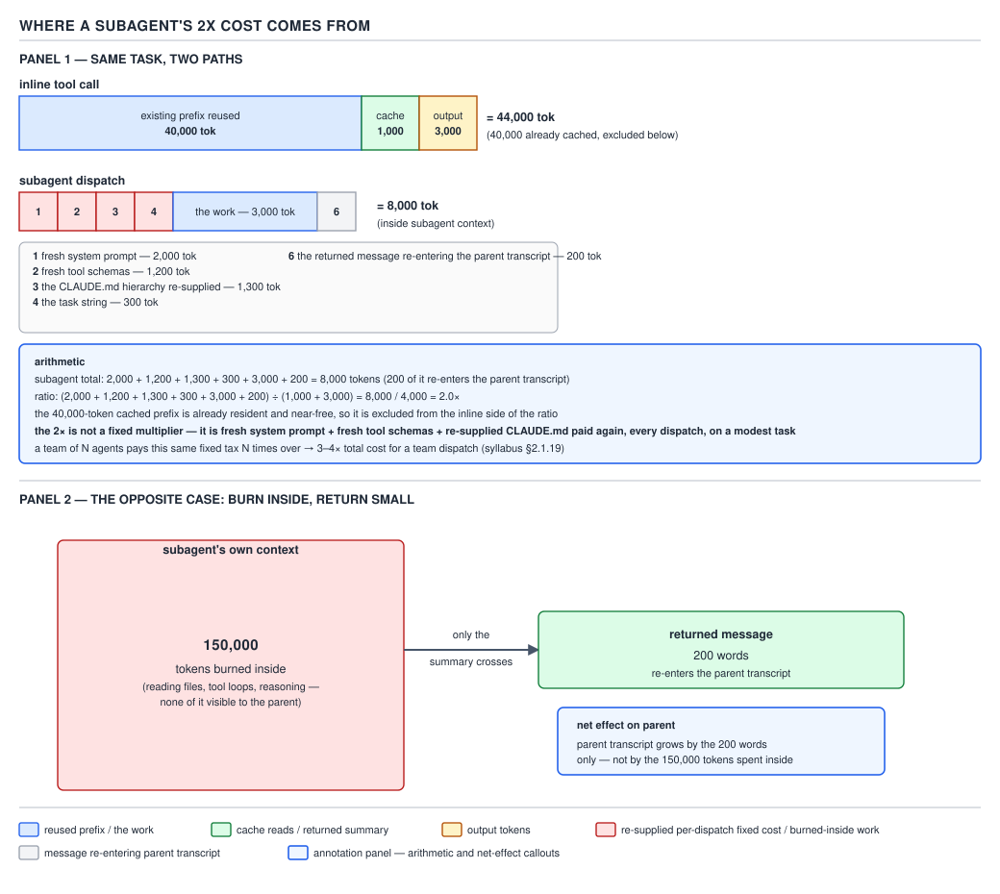

# 21 AI for Coding — persistence, invocation, and where the 2× comes from — INTERMEDIATE (§2.1.16–2.1.19)

**Target version: Claude Code v2.1.2xx (August 2026).** | **Part 2 of 6** | [Index](../00-index.md)
Previous: [built-ins, foreground and background, and forks](03-builtins-and-forks.md) · Next: [pointer bodies and versioned prompts](05-cases-pointer-bodies.md)

## §2.1.16 Persistent subagent memory

**Mechanism.** A subagent definition can carry a `memory` field with one of three values, and each maps to a fixed directory:

| `memory:` value | Directory | Use case |
|---|---|---|
| `user` | `~/.claude/agent-memory/<name-of-agent>/` | learnings the reader wants every project's copy of this subagent to carry forward |
| `project` | `.claude/agent-memory/<name-of-agent>/` | project-specific knowledge, checked into version control, shared with teammates |
| `local` | `.claude/agent-memory-local/<name-of-agent>/` | project-specific knowledge the reader does not want in git |

This is a **per-subagent-name** store, not a per-session store: every dispatch of `readonly-reviewer`, regardless of which parent session spawned it, reads and writes the same `~/.claude/agent-memory/readonly-reviewer/` directory (for `memory: user`). Per the docs page, "the subagent's system prompt includes instructions for reading and writing to the memory directory," and it also "includes the first 200 lines or 25KB of `MEMORY.md` in the memory directory, whichever comes first, with instructions to curate `MEMORY.md` if it exceeds that limit" — so the subagent itself is responsible for keeping its own memory file from growing without bound, the same discipline the reader has already met for the main session's own auto memory.

**Choosing a scope.** The three values are not interchangeable defaults — each answers a different question about who else should see what the subagent learns. `user` is for a habit that belongs to the reader personally and travels with them regardless of which repo they are in — a code-style preference, a set of shortcuts for reading unfamiliar stack traces — because `~/.claude/agent-memory/<name>/` sits outside every project entirely. `project` is for knowledge that is true of *this codebase* and should be true for every teammate dispatching the same subagent — `mvn-test-runner`'s flaky-test list is a fact about this repository's test suite, not about the individual running it, so it belongs in git where a second engineer's dispatch inherits it on the next `git pull` rather than rediscovering it cold. `local` is for the same shape of project-specific knowledge with one bit flipped: the reader does not want it in git at all, typically because it is scratch state (a running list of files a review subagent has already flagged this sprint) that would just be repo noise for a teammate who checks it out fresh. Per the official guidance, **`project` is the recommended default** precisely because shareability is usually the point — a memory nobody else benefits from is barely different from the subagent doing that reasoning over again every dispatch. The failure mode particular to `project` is scope drift: because the file is shared and editable by any teammate's dispatch, a `MEMORY.md` that accumulates one team's project-specific quirks (their favorite phrasing, a workaround for a local one-off outage) alongside genuinely durable facts becomes misleading for the next engineer who trusts it uncritically — the subagent curates its own file, but curation is not the same as review, and nothing stops a bad entry from persisting until someone notices the reviewer's advice does not match the codebase.

**Pitfall:** the reader believes setting `memory: project` on a subagent's frontmatter is sufficient by itself to get persistent, versioned memory. In fact `memory` rides on top of **auto memory**, not underneath it: "Subagent memory is part of auto memory: if you turn auto memory off, with the `autoMemoryEnabled` setting or `CLAUDE_CODE_DISABLE_AUTO_MEMORY`, the `memory` field has no effect and the subagent launches without the memory instructions or the memory tool access." The symptom is silent: no error, no warning at dispatch time — `readonly-reviewer`'s `memory: project` field is simply inert, the subagent never reads or writes `MEMORY.md`, and a reader who disabled auto memory globally months earlier — because they didn't want the main session silently writing to `~/.claude/projects/<project>/memory/` — has no reason to connect that unrelated decision to this subagent's amnesia. The fix is to check `autoMemoryEnabled` (or the absence of `CLAUDE_CODE_DISABLE_AUTO_MEMORY`) first, before debugging the subagent's frontmatter or its prompt, whenever a `memory`-bearing subagent behaves as if it has never seen the project before.

To actually exercise the scope day to day, the docs frame it as two habits stated directly to the subagent rather than a flag the reader sets once: ask it to consult memory before starting ("Review this PR, and check your memory for patterns you've seen before") and to update memory after finishing ("Now that you're done, save what you learned to your memory") — the memory field only supplies the directory and the read-in-context behavior; building it into a working knowledge base is a conversational habit, not a one-time configuration step.

```yaml
---
name: mvn-test-runner
description: Runs the Maven test suite, reports failures with file:line, and remembers flaky tests across runs.
tools: Bash, Read, Grep
memory: project
---

You run `mvn -q test` and summarize failures as file:line plus the assertion
message. Read MEMORY.md before you start: it lists tests already known to be
flaky. Skip re-flagging those unless they now fail for a different reason.
After the run, update MEMORY.md with any newly-flaky test you observed twice
in a row.
```

`mvn-test-runner` with `memory: project` writes to `.claude/agent-memory/mvn-test-runner/MEMORY.md`, checked into git, so every teammate's dispatch of the same subagent inherits the flaky-test list instead of rediscovering it.

> A subagent's `memory` field points it at one of three fixed directories — `user`, `project`, or `local` scope — where its own `MEMORY.md` persists across every dispatch of that subagent name, curated by the subagent itself and gated entirely on auto memory being enabled.

## §2.1.17 Resuming a subagent

**Mechanism.** Ordinarily, "each subagent invocation creates a new instance rather than continuing an earlier one" — a fresh subagent, as covered in `02-the-context-boundary.md`, starts from nothing every time it is dispatched. Resuming is the opt-in exception: "to continue an existing subagent's work instead of starting over, ask Claude to resume it. Resumed subagents retain their full conversation history, including all previous tool calls, results, and reasoning." Mechanically, the parent does this the same way it resumes anything addressable: "Claude uses the `SendMessage` tool with the agent's ID or name as the `to` field to resume it" — the identical mechanism this session used to keep talking to the writer subagents dispatched alongside this one.

**Where the transcript lives.** "When a subagent completes, Claude receives its agent ID... you can also ask Claude for the agent ID if you want to reference it explicitly, or find IDs in the transcript files at `~/.claude/projects/{project}/{sessionId}/subagents/`. Each transcript is stored as `agent-{agentId}.jsonl`." This is the same JSONL transcript format the reader met for the main session in §0.4.8 — one JSON object per line, readable with `jq` or `tail -f`, no special tooling — just filed one directory level deeper, under the parent session's own folder rather than at the project root. Retention follows the parent's rule too: "Claude Code deletes subagent transcripts after the `cleanupPeriodDays` retention period, 30 days by default, following the retention sweep rules" — the same setting and the same default the reader already configured for the main session.

**Gotcha — the constraint that trips a reader up.** "Subagent transcripts persist within their session. You can resume a subagent after restarting Claude Code by resuming the same session" — resuming a subagent is bounded by resuming the *parent* session first (`claude --resume`, covered in cli-reference); there is no standalone `claude --resume-agent <id>` that reattaches to a subagent transcript orphaned from a session the reader has already abandoned. A subagent id captured at dispatch time and pasted into a new, unrelated session will not resolve to anything — the id is meaningful only inside the parent session whose folder produced it.

**Insight.** This constraint is not an arbitrary product limitation — it falls directly out of where the JSONL transcript is filed. A subagent's transcript lives at `~/.claude/projects/{project}/{sessionId}/subagents/agent-{agentId}.jsonl`: the `{sessionId}` segment is the *parent's* id, not the subagent's own. There is no top-level index of subagent ids that spans sessions, because the subagent was never meant to be an independent, freestanding conversation — it is addressable exactly as far as the parent conversation that spawned it is addressable, and no further. Resuming a subagent is therefore not a second, separate resume mechanism layered on top of session resume; it is the *same* mechanism, `claude --resume`, applied one level up, followed by a `SendMessage` to the id or name it already knows about.

**A second constraint worth knowing before relying on this.** Not every subagent can be resumed at all: "the built-in Explore and Plan agents are one-shot and return no agent ID, so they can't be resumed" — a reader who dispatches the built-in `Explore` agent for a first pass and then tries to resume it for a follow-up question has nothing to resume, no matter how healthy the parent session is, because those two built-ins never hand back an id in the first place. Reach for `general-purpose` or a custom subagent definition instead whenever the plan depends on a second, continued dispatch.

**Version trap `[VERSION]`.** As of v2.1.198, a resumed subagent also treats messages sent to it from the agent that launched it as ordinary task direction — including a mid-task course correction — and acts on them within its own permission settings, rather than treating everything arriving after the initial dispatch as a fixed, unchangeable brief. Before that behavior, the working mental model of "hand it a task, wait for a return" was closer to correct; a reader relying on older written guidance that describes a subagent as unable to be redirected mid-flight is describing a pre-v2.1.198 world.

**Interview:** "How would you make a code-review subagent iterative — first pass, address feedback, second pass?" Dispatch it once by name, then resume the same subagent (by id or name, via `SendMessage`) for the second pass instead of dispatching a fresh one; the resumed instance already has the diff and its own first review in context, so the second pass is "now check the fix" rather than "review this from scratch again."

> Resuming a subagent means addressing an existing agent id or name through `SendMessage` so it continues its own full history rather than starting cold; its transcript lives as `agent-{agentId}.jsonl` under the parent session's own project folder, and is reachable only through that still-resumable parent session.

## §2.1.18 Invocation: three levels

**Mechanism.** A subagent is invoked in exactly one of three ways, ordered from "Claude decides" to "every session, no decision at all":

| Level | Form | Guarantee | Available in headless `-p`? |
|---|---|---|---|
| Natural language | name the subagent in the prompt, e.g. "Use the `mvn-test-runner` subagent to fix the failing tests" | Claude typically delegates, but is still choosing; no special syntax forces it | Yes — the model can still choose to call `Agent` |
| Explicit `@`-mention | `@"mvn-test-runner (agent)"` via the typeahead, or typed by hand as `@agent-mvn-test-runner` (or `@agent-<plugin>:<name>` for a plugin-scoped one) | forces that exact subagent, removing the model's choice | No — `@`-mention is an interactive-session input mechanism, not available when there is no interactive prompt to type into |
| `claude --agent <name>` / `"agent"` setting | whole session runs as that subagent from the first turn | the subagent's system prompt **replaces** the default Claude Code system prompt entirely, "the same way `--system-prompt` does"; `CLAUDE.md` files and project memory still load through the normal message flow | Yes — it is a session-startup flag, orthogonal to `-p` |

**Choosing a level.** The three are not stylistic variants of the same call — each buys a different amount of certainty at a different cost of flexibility. Natural language costs nothing to set up and is right whenever the reader is comfortable with Claude sometimes choosing not to delegate — for a one-off, low-stakes ask, that judgment call is usually fine. The `@`-mention costs one extra keystroke sequence and buys certainty for a single turn: reach for it exactly when the choice of subagent is a decision the reader has already made and does not want re-litigated by the model — "run the review with `readonly-reviewer`, specifically, not whatever review approach the model would improvise." The session-wide flag or setting costs the most — an entire session locked to one persona — and buys a guarantee that holds across every turn without the reader restating it: right for a CI job, a dedicated review terminal, or a teammate who should never accidentally get default Claude Code behavior when they meant to be running the flaky-test triage subagent.

The session-wide flag and the settings-file form apply to the whole session before the first message is sent — not a single dispatch inside an already-running conversation — and one overrides the other in a fixed order: "the CLI flag overrides the setting if both are present," so a `.claude/settings.json` with `"agent": "mvn-test-runner"` checked in for the whole team can still be overridden per-invocation with `claude --agent readonly-reviewer` on a single run. The choice also survives past the session that made it: per the docs, resuming a `--agent` session with `claude --resume` restores the agent's system prompt, tool restrictions, and model along with the conversation, so the persona is not something the reader has to re-apply by memory on every `--resume`.

**Headless consequence.** In non-interactive mode (`-p`), there is no interactive prompt for the reader to type a message into at all, which removes exactly one of the three levels outright: the `@`-mention typeahead is an interactive-session input mechanism and has nothing to attach to in `-p`. Natural language still functions, in the sense that the model can still choose to call the `Agent` tool on its own initiative from within the piped prompt, and `claude --agent <name>` still functions because it is a session-startup flag evaluated before the first message, orthogonal to whether that first message came from a human typing or from `-p`'s piped input. A CI pipeline that needs a guaranteed persona under `-p` therefore has exactly one reliable lever — `--agent` at startup (or the `agent` setting) — because the other guaranteed form, `@`-mention, does not exist in that mode and natural language is a request, not a guarantee.

```json
{
  "agent": "mvn-test-runner"
}
```

```bash
claude --agent readonly-reviewer
```

**Code — natural language and forced mention, side by side:**

```text
Use the mvn-test-runner subagent to fix the failing tests
```

```text
@"readonly-reviewer (agent)" look at the diff on this branch before I open the PR
```

**Gotcha.** `--agent` is a *replacement*, not an addition — running `claude --agent readonly-reviewer` does not give the reader an interactive session with `readonly-reviewer` available as one option among several; it makes `readonly-reviewer`'s system prompt the *only* system prompt for that entire session, exactly as if the reader had passed `--system-prompt` with `readonly-reviewer`'s prompt text pasted in. A reader expecting to still ask general questions in that session and get the default Claude Code behavior back has, instead, locked the whole session into one persona until they exit and restart without the flag.

**Insight.** The word "replaces" is doing more work here than it first appears to. This is not merely swapping which text sits at the top of the context window — the main thread's default toolset, its default permission posture, and its default model selection all move with the swap too: `--agent` hands the *entire session* the subagent's system prompt, tool restrictions, and model, not the system prompt alone. That is a materially larger act than picking a subagent for one dispatch, which is exactly why it is the one invocation level that persists across `--resume` (see above) — it is describing what kind of session this is, not what task is being run inside it. Confusing it with a scoped, one-turn delegation is the single most common misreading of the three levels, because natural language and `@`-mention both *do* behave like scoped, one-turn delegations, and `--agent` looks superficially like a third member of that family when it is actually a different kind of thing.

**Interview:** "You want a CI job that always runs as a specific review persona, no drift. Which invocation form?" `claude --agent readonly-reviewer` (or the `agent` setting checked into `.claude/settings.json` if every session in the repo should default to it) — natural language and `@`-mention both depend on a human or the model making a per-turn choice, which a CI job cannot do.

## §2.1.19 The cost model: where the 2× comes from, and when it wins anyway

**Mental model.** A subagent dispatch is not "the same conversation, just delegated" — it is closer to starting a second `claude` process from cold: nothing the parent already paid to build is reusable, because none of it exists yet on the subagent's side. Every one of those cold-start costs is paid again, on top of whatever the actual task costs to complete, and that repeated cold start is the entire reason a subagent is commonly described as costing "roughly 2×" the tokens of doing the same work inline.

**Why it exists — the actual charge sheet.** Four things are re-supplied on every dispatch: a fresh system prompt, fresh tool schemas for every tool the subagent is allowed to use, the `CLAUDE.md` hierarchy re-supplied (this note set's PART 1 covered why every layer of it loads as one of the first user-turn messages), and the task string itself. None of these can be served from the parent's existing cached prefix, because a fresh, non-fork subagent starts with none of the parent's prefix at all — that is exactly what "the full context boundary" in `02-the-context-boundary.md` established: nothing crosses in except what the dispatch explicitly hands down. **Provenance:** the documentation states the mechanism — a fresh system prompt, fresh tool schemas and a re-supplied `CLAUDE.md` hierarchy on every dispatch — but prints no numeric multiplier; "roughly 2×" and "3–4× for a team" are this guide's own derived figures, worked through below with the arithmetic shown rather than asserted.



**D-46** — Where a subagent's 2× comes from, and the case where it wins anyway. Read the token figure on each segment.

**How it works, with the arithmetic printed.** Panel 1 of D-46 puts one modest task through two paths side by side. Inline, as one more tool call in an already-running conversation, the reader already has a 40,000-token prefix resident and cached from prior turns — that portion is already paid for and near-free to re-read, so it sits outside the comparison — leaving only the *marginal* cost of this one call: a small amount of fresh cache-adjacent processing (1,000 tok) and the output (3,000 tok), for **4,000 marginal tok**. Dispatched to a fresh subagent instead, the same task pays four fixed, per-dispatch costs before a single token of the actual work happens — fresh system prompt (2,000 tok), fresh tool schemas (1,200 tok), the `CLAUDE.md` hierarchy re-supplied (1,300 tok), the task string (300 tok) — then the work itself (3,000 tok), then the returned message re-entering the parent transcript (200 tok):

```
subagent total: 2,000 + 1,200 + 1,300 + 300 + 3,000 + 200 = 8,000 tokens
ratio: (2,000 + 1,200 + 1,300 + 300 + 3,000 + 200) ÷ (1,000 + 3,000) = 8,000 / 4,000 = 2.0×
```

That ratio is a sum over a sum, and it is deliberately comparing marginal cost to marginal cost: the numerator is everything the subagent must pay from cold — the four fixed per-dispatch costs plus the work plus the returned message — and the denominator is only what the inline path pays *beyond* its already-resident, already-cached 40,000-token prefix. Excluding that resident prefix from the denominator is the right comparison, not a thumb on the scale: it is already sunk cost for the inline path and would not recur whether or not this particular call happened, so counting it would understate how much heavier the subagent path actually is for this task. On that basis the subagent costs twice what the inline call costs, **2.0×**, driven entirely by the four fixed per-dispatch costs (2,000 + 1,200 + 1,300 + 300 = 4,800 tok) that a same-conversation tool call never pays at all.

**A team of agents: 3–4×.** The syllabus figure for a team dispatch — several subagent members working the same task rather than one — is **3–4×**, and it comes from the same fixed tax rather than a new mechanism: every one of the N members pays its own copy of the 4,800-token fixed cost (fresh system prompt, tool schemas, `CLAUDE.md`) independently, so the fixed-tax portion alone already scales linearly with team size instead of being paid once. On top of that, a team's lead pays for coordination that a single dispatch never generates at all — the messages assigning work to each member, and the messages each member sends back that the lead must read to synthesize a final answer, all of which land in the *lead's own* transcript and are re-sent on every subsequent turn the same way any other transcript growth is. Two or three members each repaying the fixed tax, plus that coordination overhead, is what pushes the total from a single dispatch's 2× up to 3–4× for a team — which is also why this note set's house rule elsewhere caps concurrent teammates rather than leaving team size unbounded. The full orchestration-pattern treatment — when a team beats N sequential single dispatches, and where the coordination messages actually come from — belongs to §3.9, not here.

**The escape hatch — Panel 2, the case it still wins by a mile.** The number that actually decides most real dispatch choices is not the total-token ratio above; it is what crosses back into the *parent's* transcript, which — per §0.2.6 — is what gets re-sent, and re-billed, on every subsequent turn for the rest of the session. Panel 2 makes the case: a subagent burns 150,000 tokens inside its own, isolated context — reading files, looping over tool calls, reasoning through dead ends — none of which the parent ever sees, and returns a 200-word summary. **The parent's transcript grows by those 200 words, not by 150,000 tokens.** Run that same 150,000-token exploration inline instead, and every one of those 150,000 tokens becomes part of the conversation history the parent re-sends on turn after turn until the next `/compact` or `/clear` — the exact quadratic cost curve this note set's PART 0 worked through in §0.2.6.

```
inline exploration: 150,000 tokens added to parent transcript, re-sent every future turn
subagent exploration: 150,000 tokens burned and discarded inside the subagent's own
                       transcript; ~200 words (roughly 260-300 tokens) re-enter the parent
```

**Insight:** the "2×" and the "isolation win" are not in tension — they are two different ledgers. The 2× is end-to-end tokens burned across the whole request; the isolation win is what specifically lands in the *parent's* long-lived, quadratically-costed transcript. A subagent can lose on the first ledger and win overwhelmingly on the second, and for any task whose exploration-to-summary ratio is lopsided — which most "go read these fifteen files and tell me what's wrong" tasks are — the second ledger is the one that determines the actual session-long bill.

**Gotcha.** A reader who reads "2×" as "always twice the bill, regardless of shape" is missing which two quantities are actually being divided: the fixed per-dispatch tax (4,800 tok here) is nearly constant regardless of task size, so the ratio it produces depends entirely on how large the inline path's *marginal* cost would have been — a task with a bigger marginal inline cost (more genuinely new processing, less already-cached) dilutes the same fixed tax toward a smaller multiple, and a task with almost no marginal inline cost at all (nearly everything already cached) can push the ratio well past 2×. 2.0× is this worked example's answer, not a law of nature.

**Interview:** "Isn't a subagent always more expensive — why would anyone use one, and for a team even more so?" State the 2× honestly, with the arithmetic — a fresh subagent dispatch pays a fixed per-dispatch tax (4,800 tok: system prompt, tool schemas, `CLAUDE.md`) that a same-conversation tool call never pays, which on a modest task doubles the marginal cost, and a team of agents multiplies that same tax by team size plus coordination overhead, landing at 3–4× — **and then** give the escape hatch: for work whose value is mostly exploration rather than the final answer, the token that matters is not the subagent's own total burn but how much re-enters the parent's transcript, and a 150,000-token exploration returning a 200-word summary keeps the parent's re-sent history two to three orders of magnitude smaller than doing the same exploration inline. This note set's `context-economy/03-isolation-arithmetic.md` (§2.6.10) turns this same argument into a repeatable budgeting rule with its own diagram (D-63); this file only establishes where the multiplier comes from.

**Interview:** "When do you specifically choose *not* to use a subagent?" Whenever the task is small enough that the fixed 4,800-token tax is a large fraction of the total bill and the work has no exploratory, mostly-throwaway shape worth isolating — a quick, single-file fix the reader could just as well ask inline, where the marginal cost of one more tool call in an already-cached conversation is a few hundred to a couple of thousand tokens, not the 8,000-token cold start a fresh dispatch pays regardless of how small the task turns out to be. The fixed tax does not scale down with task size, so it is precisely the *small* tasks where a subagent's total-token overhead is worst, and precisely the *large, exploratory* tasks where the parent-transcript ledger flips the decision the other way.

> A subagent costs a fixed per-dispatch tax — fresh system prompt, tool schemas, and `CLAUDE.md` paid again — that roughly doubles the marginal cost of a modest task (2.0× worked here) and multiplies further for a team (3–4×, the same tax paid per member plus coordination); the tradeoff that actually decides most dispatches is not that total, but how much of a large, exploratory burn re-enters the parent's own re-sent transcript.

## Pitfalls

- **Belief in action:** "Subagents cost 2× so I should never dispatch one for a research task, since research is exactly where I'd burn a lot of tokens." **Surprising outcome:** the reader keeps a 150,000-token file-reading spree inline instead, and the parent's transcript — not the subagent's total burn — is what balloons and gets re-sent, at full quadratic cost, on every subsequent turn for the rest of the session. **What actually gets the guarantee:** dispatch exactly the large, exploratory, mostly-throwaway tasks to a subagent, because those are the ones where the 200-word return dwarfs the 150,000 tokens it cost to produce it; reserve inline work for small tasks where the subagent's fixed tax would be the larger share of the bill. **Why people believe it:** "2×" reads as a blanket verdict on subagents rather than as a statement about one specific ledger — the total-token one — leaving the parent-transcript ledger, the one that usually matters more, unexamined.
- **Belief in action:** "I'll grab the subagent's id from this session's output and resume it from a brand-new session tomorrow to keep going." **Surprising outcome:** the id resolves to nothing outside the parent session that produced it — resuming a subagent is bounded by first resuming the same parent session via `claude --resume`. **What actually gets the guarantee:** resume the parent session, then resume the subagent by id or name inside it via `SendMessage`. **Why people believe it:** the subagent's own transcript is a standalone JSONL file with its own id, which looks self-contained the same way the main session's transcript does, obscuring that it is filed and reachable only underneath its parent's own folder.

## Cheat sheet

| Item | Value |
|---|---|
| `memory: user` | `~/.claude/agent-memory/<name>/` — cross-project |
| `memory: project` | `.claude/agent-memory/<name>/` — versioned, shared |
| `memory: local` | `.claude/agent-memory-local/<name>/` — not versioned |
| Memory gate | requires `autoMemoryEnabled` (or unset `CLAUDE_CODE_DISABLE_AUTO_MEMORY`) — off disables the field entirely |
| `MEMORY.md` curation limit | first 200 lines or 25KB, whichever comes first; subagent curates past that |
| Resume a subagent | `SendMessage` with its id or name as `to`; retains full prior history |
| Subagent transcript path | `~/.claude/projects/{project}/{sessionId}/subagents/agent-{agentId}.jsonl` |
| Subagent transcript retention | `cleanupPeriodDays`, default 30 days — same setting as the main session |
| Resume constraint | subagent id resolves only inside its still-resumable parent session |
| Invocation: natural language | name it in the prompt; Claude decides whether to delegate |
| Invocation: forced | `@"name (agent)"` picker, or typed `@agent-<name>` / `@agent-<plugin>:<name>` |
| Invocation: session-wide | `claude --agent <name>`, or `"agent"` in `settings.json`; flag overrides setting |
| `--agent` effect | replaces the default system prompt entirely, like `--system-prompt`; `CLAUDE.md` still loads normally |
| `--agent` across `--resume` | persists — system prompt, tool restrictions and model are restored with the conversation |
| Recommended memory scope | `project` — the docs default, because shareability across teammates is usually the point |
| Built-ins that can't resume | `Explore`, `Plan` — one-shot, return no agent ID; use `general-purpose` or a custom subagent instead |
| Headless (`-p`) invocation | natural language and `--agent`/`agent` setting both work; `@`-mention does not (no interactive prompt to type into) |
| Fixed per-dispatch tax (D-46 figures) | system prompt 2,000 + tool schemas 1,200 + `CLAUDE.md` 1,300 + task string 300 = 4,800 tok |
| D-46 worked ratio | (4,800 + 3,000 + 200) ÷ (1,000 + 3,000) = 8,000 / 4,000 = **2.0×** marginal cost, resident 40,000-tok cached prefix excluded from the denominator |
| Team of agents | **3–4×** — same fixed tax paid once per member, plus coordination messages landing in the lead's transcript |
| Isolation win (D-46 Panel 2) | 150,000 tok burned inside, ~200 words re-enter parent transcript |

## Self-test

1. A team wants `mvn-test-runner`'s flaky-test list shared via git but not `readonly-reviewer`'s scratch notes. Which `memory` values for each?
<details><summary>Answer</summary>`mvn-test-runner`: `memory: project`, so `.claude/agent-memory/mvn-test-runner/` is versioned and every teammate's dispatch reads the same list. `readonly-reviewer`: `memory: local`, so `.claude/agent-memory-local/readonly-reviewer/` exists per checkout and never enters git.</details>

2. Auto memory is disabled project-wide with `CLAUDE_CODE_DISABLE_AUTO_MEMORY`. A subagent's frontmatter still declares `memory: project`. What happens?
<details><summary>Answer</summary>Nothing — the field has no effect. Subagent memory is part of auto memory, so disabling auto memory removes both the memory instructions in the subagent's system prompt and its access to the memory tooling, regardless of what the `memory` field says.</details>

3. Why can't a reader resume a subagent from a brand-new session tomorrow, even with its exact agent id in hand?
<details><summary>Answer</summary>A subagent's transcript is filed under its parent session's own folder — `~/.claude/projects/{project}/{sessionId}/subagents/agent-{agentId}.jsonl` — and resuming it is bounded by first resuming that same parent session. A new session has no path to that folder through its own id.</details>

4. Which of the three invocation levels forces a specific subagent regardless of what the model would otherwise choose?
<details><summary>Answer</summary>The explicit `@`-mention — `@"name (agent)"` via the typeahead or typed as `@agent-<name>` — removes the model's choice entirely. Natural language still lets Claude decide whether to delegate at all, and `--agent`/the `agent` setting decides the whole session's persona up front rather than choosing a subagent for one task.</details>

5. `.claude/settings.json` sets `"agent": "mvn-test-runner"` for the whole team. One reader runs `claude --agent readonly-reviewer` locally. Which wins, and why?
<details><summary>Answer</summary>`readonly-reviewer`, for that one invocation — the CLI flag overrides the setting whenever both are present. The settings-file default still applies to every session that doesn't pass the flag.</details>

6. In D-46's Panel 1, why is the 40,000-token cached prefix excluded from the ratio's denominator, and what would happen to the 2.0× figure if it were included instead?
<details><summary>Answer</summary>It is excluded because it is already resident and cached from prior turns — sunk cost the inline path pays once regardless of whether this particular call happens, and near-free to re-read. Counting it in the denominator (44,000 instead of 4,000) would swamp the fixed per-dispatch tax and make the subagent's 8,000 tokens look barely worse than inline (8,000 / 44,000 ≈ 0.18×), which would misrepresent the actual marginal cost this dispatch adds.</details>

7. A subagent burns 150,000 tokens exploring a codebase and returns a 200-word answer. What is the actual token cost added to the parent's own transcript, and why does that number matter more than the subagent's total burn?
<details><summary>Answer</summary>Only the roughly 260-300 tokens of the 200-word returned message enter the parent's transcript. It matters more than the subagent's total burn because the parent's transcript is what gets re-sent, and re-billed, on every subsequent turn for the rest of the session (§0.2.6) — the 150,000 tokens burned inside the subagent are paid once and then discarded.</details>

8. Why does a team of agents cost 3–4× rather than 2×, and where does that extra cost actually land?
<details><summary>Answer</summary>A single subagent pays the 4,800-token fixed tax once. A team of N members pays that same fixed tax N times over, one copy per member, so the fixed-tax portion alone already scales linearly with team size instead of staying constant. On top of that, the lead pays for coordination — assigning work to each member and reading each member's reply to synthesize a final answer — and that coordination lands in the lead's own transcript, re-sent on every subsequent turn the same as any other transcript growth. Two or three members repaying the tax plus that coordination overhead is what pushes the total from a single dispatch's 2× to a team's 3–4×.</details>

9. A reader dispatches the built-in `Explore` agent, likes its first pass, and asks Claude to resume it for a follow-up question. What happens, and what should they have used instead?
<details><summary>Answer</summary>There is nothing to resume — `Explore` (and `Plan`) are one-shot built-ins that return no agent ID, so `SendMessage` has no id or name to address. For work that needs a second, continued dispatch, use `general-purpose` or a custom subagent definition, both of which return an agent ID and support resumption.</details>

10. A CI pipeline runs under `-p` and needs a guaranteed review persona with no chance of the model choosing differently. Which of the three invocation levels is actually available, and which is not?
<details><summary>Answer</summary>`claude --agent readonly-reviewer` (or the `agent` setting) works under `-p` because it is a session-startup flag evaluated before the first message. Natural language also still functions but is a request, not a guarantee — the model can still decline to delegate. The `@`-mention typeahead does not exist under `-p` at all, since there is no interactive prompt to type a mention into.</details>

## Open questions

None.

---

**Leaves covered:** 2.1.16–2.1.19 (4 leaves)
**Leaves deferred:** none
**Diagrams included:** D-46
**Target version:** Claude Code v2.1.2xx (August 2026)
**Lines:** 215
