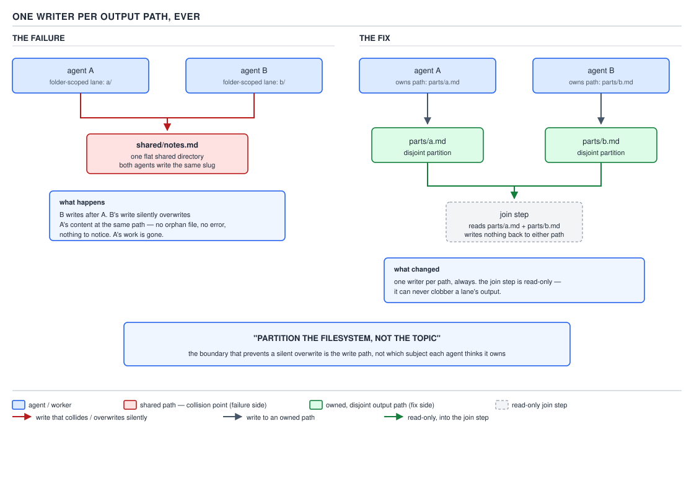

# 21 AI for Coding — write boundaries, withheld tools and the return protocol — INTERMEDIATE (§2.1.23–2.1.25)

**Target version: Claude Code v2.1.2xx (August 2026).** | **Part 2 of 6** | [Index](../00-index.md)
Previous: [pointer bodies and versioned prompts](05-cases-pointer-bodies.md) · Next: [personas: the four flags](../personas/01-the-four-flags.md)

This file closes the subagents area. `01-basics-definition-and-precedence.md` through
`05-cases-pointer-bodies.md` covered where a subagent is defined, its context boundary,
the built-ins, forks, the 2× cost, and pointer bodies. What is left is the three things
that decide whether a fleet of subagents is safe to run unattended: **what a subagent's
definition can and cannot stop it from touching**, **what happens when two of them are
allowed to write to the same place**, and **how a subagent hands its work back without
flooding the parent's context** — the very thing `05-cases-pointer-bodies.md` §2.1.21
described as a convention now becomes a rule with an arithmetic behind it.

## §2.1.23 A subagent's write boundary, and the tools it never gets

**Mental model.** A subagent definition carries two independent kinds of restriction
that look similar on the page and are enforced completely differently. One is a
sentence in the agent's own prose — "you may write to X, never to Y" — that the model
reads and is expected to obey. The other is the shape of the `tools` field itself: a
tool that is not on that list cannot be emitted as a `tool_use` block at all, because
the harness never offers it to the model in the first place. The first is a rule the
agent follows. The second is a door that was never built.

**Why it exists.** `calibrator` (`plugins/sdlc-harness/agents/calibrator.md`) mines
session transcripts for recurring friction and, per its own description, "hands each
distinct pattern to the team lead for Jira filing" rather than filing anything itself.
`progress-verifier` (`plugins/sdlc-harness/agents/progress-verifier.md`) — quoted in
full in `05-cases-pointer-bodies.md` for its pointer-body shape, not repeated here —
judges a stalled coder from git log and diff stat alone. Both are invoked
unsupervised, inside an automated pipeline, with no human reading every token they
produce. The write boundary is the only thing standing between "mines a pattern" and
"silently rewrites the playbook it was asked to critique."

**How it works.** `calibrator.md`'s own body draws the boundary explicitly:

```text
## Write boundaries

You may write to:
- `harness/calibration/.last-calibration` (Phase 2)
- `harness/calibration/friction/` — Phase 0's mined-{date}.yaml only (the miner CLI writes
  this, invoked by you as a subprocess; you never hand-author it)

You may NOT write to:
- `harness/calibration/friction/filed-bugs.yaml` (team-lead-owned dedup ledger — written
  only after a human-confirmed Jira filing, never by this agent)
- `harness/playbooks/`, `harness/control-plane/`, `features/`, or anything outside
  `harness/calibration/friction/` and `.last-calibration`

**No Jira API tool is ever given to this agent.** Filing a friction bug is a
human-confirmed, team-lead-altitude action (see `plugins/sdlc-harness/commands/calibrate.md`).
You mine and group the pattern; the team lead builds, previews, confirms, and files.
```

Two write paths, four things it may not touch, and a Jira sentence — that much
matches the leaf. But read the file for what the leaf does *not* claim, and the
divergence is the real lesson: **`calibrator.md`'s frontmatter has no `tools:` field
at all.** The whole file, reproduced above and in `05-cases-pointer-bodies.md`, is
`name`, `description`, and body prose — no `tools:` line, no `disallowedTools:` line.
`progress-verifier.md` is the same shape. Per the `sub-agents` documentation page,
re-verified against `https://code.claude.com/docs/en/sub-agents` for this leaf:

> [`tools`] Inherits every tool available to subagents if omitted.

Omitting `tools:` is not a restriction — it is the opposite: the widest possible
grant, everything the main conversation can reach, built-ins and MCP tools alike,
minus only the short list the harness always strips from every subagent and the
extra list it strips from background subagents specifically. `03-builtins-and-forks.md`
covered that filter; nothing about it is Jira-specific. The sdlc-harness's own
project settings, `.claude/settings.json`, grant `mcp__atlassian-cloud__*` at the
`permissions.allow` layer, project-wide:

```json
{
  "permissions": {
    "allow": ["Read(**)", "Edit(**)", "Bash(*)", "mcp__atlassian-cloud__*"]
  },
  "enabledPlugins": {
    "pyright-lsp@claude-plugins-official": true,
    "typescript-lsp@claude-plugins-official": true,
    "jdtls-lsp@claude-plugins-official": true,
    "sdlc-harness@sdlc-harness": true
  }
}
```

Nothing in `calibrator.md` narrows that inheritance. So "capability denied at the
tool layer" is **not what this file does** — it is what the leaf's own headline
implies, and the file diverges from it. What `calibrator.md` actually relies on is
that the atlassian MCP server, wherever it is configured (`.mcp.json` is not present
in this checkout — it is provisioned at runtime, the same pattern this topic's
grounding table already flags for `filed-bugs.yaml` and `severity_map.yaml`'s
sibling `friction/` directory below), does not itself expose a "file a bug" tool
call that bypasses the human-confirmation script. The prose sentence is doing real
work here precisely *because* the tool layer was not asked to do it.

**Insight:** withholding a tool by simply not declaring one and withholding it by
never granting the capability that would reach it are different guarantees with
different failure modes, and a reader who cannot tell them apart will misjudge every
subagent security review they ever do.

So: what does an explicit tool restriction guarantee, and what does it not?

| It guarantees | It does not guarantee |
|---|---|
| The model cannot emit a `tool_use` block for a name outside `tools:` — there is no schema for it, so there is no permission prompt to click through and no `bypassPermissions` escape hatch, because permission modes only gate tools that exist for the agent in the first place | That the same *effect* is unreachable through a tool that **is** granted — `Bash(*)` can `curl` a REST endpoint directly if nothing in `permissions.deny` blocks it, regardless of whether a dedicated API tool was ever offered |
| A hard, config-level ceiling independent of what the system prompt says — even a compromised or confused model cannot un-omit a tool from its own offered list | That a fork or child dispatch spawned by the subagent inherits the same restriction; each definition's `tools:` field is evaluated on its own terms (`03-builtins-and-forks.md`) |
| That omitting `tools:` is read correctly by anyone auditing the file — the field's absence is a fact worth grepping for | That omission *means* restriction — per the doc text quoted above, omission is the widest possible grant, not the narrowest |

**Interview:** "How would you stop a subagent from filing a ticket itself?" — the
correct answer is not "add a sentence telling it not to," it is "never put a
ticket-filing tool in its `tools:` list, and verify the list is explicit rather than
omitted" — the sentence is a second layer, useful for a human reviewer, not a control.

**Pitfall:** reading "no Jira API tool is ever given to this agent" and concluding
the frontmatter enforces it, because the sentence sits next to write-boundary prose
that *is* enumerated precisely. The fix is to open the file and check for a `tools:`
key before trusting any capability claim about a subagent — a sentence and a schema
field are not the same evidence.

**Why people believe it:** the two kinds of restriction are printed in the same
Markdown body, in the same tone, right next to each other, and the reader has no
visual cue that one is machine-enforced and the other is not.

`progress-verifier.md`'s "Out of scope" section is the same pattern from the other
direction — it is entirely prose ("Never resume, inspect, or infer the coder's own
`claude` session… Never write a verdict to a file or via a shell command") with no
`tools:` field narrowing it either. Its real guarantee is behavioral, not
configuration-level: the engine "captures your response text directly," so even if
`progress-verifier` had `Write` available, following the contract never calls for
using it. `05-cases-pointer-bodies.md` already quoted the full file for its
pointer-body shape; the two boundary sections above are the only new excerpt needed
here.

One path named in this topic's grounding table is worth checking rather than
assuming: `calibrator.md` cites `harness/calibration/friction/filed-bugs.yaml` as
the team-lead-owned dedup ledger, and `harness/calibration/severity_map.yaml` for
weights. In this checkout, `harness/calibration/` contains exactly
`improvement-log.yaml` and `severity_map.yaml` — the severity map is real and at the
path the agent names. **The `friction/` directory itself, and therefore
`filed-bugs.yaml` and any `mined-{date}.yaml`, are absent.** That is the honest
finding, not a gap in the search: both are written at runtime by the miner CLI and
the team-lead filing script the agent's own body names, so a clean checkout has
nowhere to have created them yet. The calibration loop that produces them gets its
full treatment in §3.9.9; here the point is narrower — a write-boundary line
naming a file that does not yet exist is not a defect in the agent definition, it
is a statement about a file this agent (or its subprocess) is expected to create.

No diagram for this leaf — the manifest assigns none to §2.1.23, and the picture
that matters belongs to the next leaf instead.

> A subagent's write boundary is enforced wherever it is a `tools:` restriction, and
> merely documented wherever it is prose — the two look identical on the page and
> the difference is invisible without checking whether the field is present at all.

## §2.1.24 One writer per output path, ever

**Mental model.** Two carpenters can each be told "you own the north wing" and "you
own the south wing" and never collide — as long as neither of them is also handed a
single shared toolshed where both are told to leave finished cabinets. The wings are
a partition. The toolshed is not, and it does not matter that each carpenter's
*intention* was to leave their cabinet in a clearly labeled spot: two people can
both, in good faith, decide the same spot is where their piece belongs.

**Why it exists.** `05-cases-pointer-bodies.md` §2.1.20 named "genuinely parallel
work with non-overlapping writes" as one of the three conditions under which
dispatching subagents pays for its own overhead. That condition has a silent
precondition nobody states out loud until it is violated: "non-overlapping" has to
be true of the **filesystem paths actually written**, not of the **topics** the
agents were told to cover. Those are not the same claim, and mistaking one for the
other is exactly how a lane collision happens.

**How it works — the failure.** Take a concrete, worked case with real numbers
rather than "the agents overwrote each other": two review subagents are dispatched
in parallel, each given a folder-scoped lane —
`docs/review/payment-service/` and `docs/review/notification-service/` — **plus**
one flat shared directory, `docs/review/findings/`, that both were told to drop
their final write into because "findings live in one place." Both agents,
independently and reasonably, derive the same slug for their output from the
pattern they were both given: the payment reviewer finishes at T+31s and writes
`docs/review/findings/timeout-retry.md` — 640 bytes, four findings. The
notification reviewer, working a completely different module, also decides its
one relevant finding belongs under the name `timeout-retry.md`, because its own
module has a retry-on-timeout bug too, and finishes at T+42s. Its write is a
plain overwrite of the same path: the second `Write` call replaces the file's
bytes outright. **The result is one file on disk, 210 bytes, one finding, written
by the second agent — and the first agent's 640 bytes and four findings do not
exist anywhere.** No `.timeout-retry.md.orig`, no `-1`/`-2` suffix, no error from
either subagent — both reported success, because from each one's point of view its
own `Write` call did exactly what it was asked. **There is no orphan file left
behind to notice the loss even happened.** A reader who goes looking for the
missing findings after the fact has nothing to grep for; the evidence that there
were ever two writers is gone along with the payment reviewer's output.



**D-47** — One writer per output path, ever. The second write leaves no orphan
behind to notice.

**How it works — the fix.** The two lanes were real partitions
(`payment-service/` and `notification-service/` never collide by construction —
different agents, different root paths, no path under one root is ever a path
under the other). The shared `findings/` directory was not a partition at all; it
was one path space with two writers pointed at it by a naming convention that both
could satisfy. The fix is not "give the shared directory better naming rules" — a
better slug scheme only raises the collision's improbability, it does not remove
the writer count from the same path to one. The fix is a disjoint filesystem
partition all the way down: `docs/review/payment-service/findings/timeout-retry.md`
and `docs/review/notification-service/findings/timeout-retry.md` are two different
paths by construction, regardless of what either agent names its file, and a
**join step** — a third pass, dispatched only after both writers finish, with
**no write tools at all** — reads both lanes and produces the merged summary. The
join step is where "shared" belongs: after the write, in a read-only pass, never
during it as a shared write target.

```json
{
  "review-payment": {
    "description": "Reviews the payment-service module in isolation.",
    "tools": ["Read", "Grep", "Glob", "Write(docs/review/payment-service/**)"]
  },
  "review-notification": {
    "description": "Reviews the notification-service module in isolation.",
    "tools": ["Read", "Grep", "Glob", "Write(docs/review/notification-service/**)"]
  }
}
```

Scoping `Write` itself to a glob rooted under each agent's own folder — rather than
trusting the dispatch instructions to keep two agents inside their assigned lane —
turns "please stay in your folder" from a convention into the same kind of
config-level guarantee §2.1.23 drew for a withheld tool: a `Write` call outside the
glob is not merely discouraged, it is not an offered capability, the identical
mechanism as an omitted tool name, applied to a path pattern instead of a tool name.

**Gotcha.** The law is **"partition the filesystem, not the topic,"** and the
distinction is the entire content of this leaf, not a restatement of it. Partitioning
by topic *feels* disjoint — "payment reviews" and "notification reviews" sound like
two different things — and it is not, because a path is decided by a naming
convention applied independently by each agent, and two independent agents can
legitimately, correctly, without any bug in either one's reasoning, decide the same
file belongs to their topic. Partitioning by filesystem path removes the ambiguity
at the only layer that can enforce it: the layer the two `Write` scopes above are
written in.

**Insight:** a lane collision produces no error, no warning, no stack trace, and no
orphan — the only observable symptom is a finding count that is lower than expected,
which is indistinguishable from "the second module just had fewer issues" unless
someone happens to remember what the first pass found.

> Parallel writers must partition the filesystem, not the topic — folder-scoped
> lanes plus one flat shared directory is not a partition, a same-slug collision
> silently overwrites the earlier write with no orphan left to notice it happened,
> and the fix is one writer per output path, enforced by scoping `Write` itself
> to each agent's own glob, with any cross-lane merge done by a separate,
> write-free join step.

## §2.1.25 The return protocol: one message, a path, never a payload

**Mental model.** `05-cases-pointer-bodies.md` §2.1.21 already put this as a
convention — "findings go to a file, the message stays small" — because that is
how `calibrator` behaves in practice. This leaf converts it into a rule with teeth,
because §0.2.6 already established the fact that makes the rule non-optional: the
entire conversation transcript is re-sent as the argument list to every subsequent
call, so anything a subagent puts in its own returned message is not consumed once
— it is paid for again on every single turn the parent has left in the session.

**Why it exists.** A subagent's return value is not a function's return value
disappearing into a stack frame once it is used. It becomes a permanent line item
in the parent's context, replayed on every future request for the rest of that
session. A subagent that reasons carefully, runs the right commands, and then
pastes 3,000 tokens of raw findings into its final message has done the isolation
work for nothing — the parent's context grew by exactly what the subagent was
dispatched to prevent it from growing by.

**How it works — the envelope.** The rule is: return **status, a few findings, and
a path** — never the payload itself. Concretely, for a review-shaped subagent:

```text
status: complete
findings: 4 issues found (2 high, 1 medium, 1 low) — see report for full detail
path: docs/review/payment-service/findings/timeout-retry.md
```

Three lines. Not "here is what I found:" followed by the four issues in full, their
stack traces, and the surrounding code context — that content lives at the path,
written once, and is read back in only if and when the parent (or a human) actually
needs it.

**The arithmetic.** §0.2.6 already established that the whole transcript is
re-sent every turn — that is not being re-derived here, it is the fact this
arithmetic runs on. Assume a session with 20 turns left after the subagent returns,
and compare the two shapes of return:

| Return shape | Tokens in the message | Cost over the remaining 20 turns |
|---|---|---|
| 3,000-token payload pasted into the message body | 3,000, added once to every subsequent request | 3,000 × 20 = **60,000 tokens** re-sent, because it is now permanently part of the transcript being replayed |
| `path:` line (≈15 tokens) + one on-demand `Read` of the file when actually needed | ≈15 tokens in the transcript from that point on, plus the file's tokens paid exactly once, only if read | 15 × 20 = 300 tokens of transcript replay, **plus at most one read** of the 3,000-token file if it is ever needed — worst case 3,300 tokens total, best case 300 |
| Same payload, but the parent never ends up needing it | 3,000, replayed regardless | still 60,000 — a cost paid whether or not the content is ever used again |

A path costs roughly 15 tokens once and is re-paid 20 times for 300 tokens total; a
pasted payload costs 3,000 tokens and is re-paid 20 times for 60,000 — **a 200×
difference for the identical information**, and the path version only pays the
full 3,000 again if someone actually opens the file, which a pasted payload cannot
avoid even when nobody does.

**Gotcha.** The rule degrades exactly when a reader treats "findings" as license to
paste a short excerpt "just to be safe" — three lines of context here, a stack
trace there — because each one is small in isolation and each one is permanent
once it lands. The discipline is not "keep the message short," it is "the message
names where the content lives; it never contains the content," with no size
threshold that makes an exception.

**Interview:** "Why does a subagent return a path instead of its findings?" —
because the return message becomes a permanent line in the parent's transcript,
re-sent every subsequent turn, while a path is read back in only on demand — the
same working-set argument that makes compaction and context economy matter
everywhere else in this topic, applied to the one message that crosses the
subagent boundary.

**Code.** A `test-runner` built to this contract, [BUILD] and [JAVA] together — a
read-only subagent for a Java 21 / Spring Boot 3.x repository, restricted at the
`tools:` layer the way §2.1.23 described, not by a sentence:

```json
{
  "test-runner": {
    "description": "Runs the Maven test suite for a Java 21 / Spring Boot 3.x module and reports a grep-able verdict.",
    "model": "haiku",
    "tools": ["Read", "Grep", "Glob", "Bash(mvn test *)"]
  }
}
```

The `Bash(mvn test *)` scope is the same mechanism as `Write(docs/review/**)` in
§2.1.24's fix — a glob narrowing what the tool can be invoked with, not a sentence
asking it to behave. `model: haiku` matches `04-limits-and-cost.md`'s guidance for
case one of §2.1.20: verbose stdout collapsing to a small answer does not need a
larger model's reasoning, it needs a cheap one that can read a Maven summary and
classify it.

The dispatch instructs the agent to run the suite, capture the summary, write the
full log to a fixed path, and end its own final message with exactly one
grep-able line:

```text
Run: mvn test -pl payment-service -am
Then, whatever the outcome, write the complete stdout+stderr to
target/test-runner/last-run.log, and end your final message with exactly one
of these two lines and nothing else on that line:

VERDICT: PASS 47/47
VERDICT: FAIL 3/47 — see target/test-runner/last-run.log
```

**Prove step.** The caller does not read the subagent's prose to find out what
happened — it greps the one line the contract fixed in advance:

```console
$ claude -p --agent test-runner "Run the payment-service test suite" \
    --output-format json | jq -r '.result' | grep '^VERDICT:'
VERDICT: FAIL 3/47 — see target/test-runner/last-run.log
```

That `grep` either matches or it does not; there is no free-text response to parse,
no "the tests seem to have mostly passed" ambiguity, and the caller (a script, a
CI step, or another subagent) makes its pass/fail branch off a fixed string rather
than off model prose — the same "no model prose in the gate" discipline
`docs/adr/0016-deterministic-stateless-engine.md` states for the harness's own
done-gate.

**What this costs.** A `haiku`-model subagent reading a Maven summary and emitting
three lines is a few hundred output tokens against whatever the test run's own
stdout volume is — the point of the dispatch, per §2.1.20's case one, is that the
stdout (which can run to thousands of lines for a large suite) is paid for once
inside the subagent's own context and never enters the parent's transcript at all;
the parent pays only for the `VERDICT:` line plus the fixed system-prompt-and-tool
overhead `04-limits-and-cost.md` priced as the 2× floor.

No gotcha beyond the one already stated above: the fixed verdict line only holds
its guarantee as long as nothing downstream is tempted to also grep the full log
"just to double check" on every run — that reintroduces exactly the payload cost
this leaf exists to avoid.

## Pitfalls

- **Belief:** "the agent's Markdown says it never writes to X, so it never will."
  **Symptom:** a subagent with no `tools:` field restricts nothing beyond the
  built-in strip list — it can reach any tool the main session can, including any
  MCP tool a project's own settings allow broadly, and only a human reading the
  prose (or an audit) enforces the sentence. **Fix:** check for an explicit
  `tools:` field before trusting a capability claim; scope `Write`/`Bash` to a
  glob when the guarantee needs to be real. **Why people believe it:** the write
  boundary and the tool restriction are printed in the same prose block, in the
  same voice, with no visual distinction between "enforced" and "documented."
- **Belief:** "folder-scoped lanes are enough to make parallel writers safe."
  **Symptom:** D-47's collision — a shared flat directory inside otherwise
  disjoint lanes lets two agents legitimately pick the same output path, and the
  second write erases the first with no orphan left to notice. **Fix:** scope
  `Write` itself to each agent's own glob, all the way down, and merge with a
  separate write-free join step. **Why people believe it:** partitioning by topic
  looks disjoint on a whiteboard; it only stops being disjoint once two agents
  independently decide the same file belongs to their topic, which a design
  review rarely simulates.
- **Belief:** "returning findings in the final message is fine as long as they're
  short." **Symptom:** the message is re-sent on every subsequent turn for the
  rest of the session, so even a "short" 3,000-token payload compounds to tens of
  thousands of re-sent tokens over a long session. **Fix:** return status, a few
  findings, and a path — write the payload to a file and let it be read on
  demand. **Why people believe it:** the cost is invisible at dispatch time; it
  only shows up as a slowly growing bill turns later.

## Cheat sheet

| Question | Answer |
|---|---|
| Does an agent's write-boundary prose stop a `Write` call? | No — only an explicit `tools:`/`Write(glob)` restriction is enforced at the tool layer |
| Does omitting `tools:` restrict anything? | No — per the docs, omission inherits every tool available to subagents, the widest grant, not the narrowest |
| What does a `tools:` restriction guarantee? | The model cannot emit that `tool_use` block at all — no prompt to click past |
| What does it not guarantee? | That the same effect is unreachable through a different granted tool (e.g. `Bash` reaching an API directly), or that a forked child inherits the same restriction |
| Is "folder-scoped lanes" a safe parallel-write partition? | Only if every path either agent can write to is disjoint — a shared flat directory inside the lanes is not a partition |
| What is the fix for a lane collision? | Scope `Write` to a glob per agent; merge with a separate, write-free join step |
| What crosses back from a subagent to its parent? | Status, a few findings, and a path — never the payload |
| Why does the payload cost so much more than a path? | The transcript is re-sent every turn; a payload in the message is paid on every future turn, a path is paid once, on demand |

## Self-test

1. `calibrator.md` says "No Jira API tool is ever given to this agent." Is that
   enforced by a `tools:` field?
   <details><summary>Answer</summary>No. `calibrator.md`'s frontmatter has no
   `tools:` field at all, which per the documentation means it inherits every
   tool available to subagents, not a restricted set. The sentence is prose, not
   configuration — the project's own `.claude/settings.json` even allows
   `mcp__atlassian-cloud__*` broadly, and nothing in `calibrator.md` narrows
   that.</details>
2. What is the practical difference between an omitted `tools:` field and an
   explicit, narrow one?
   <details><summary>Answer</summary>Omitted inherits everything the main
   session can reach (minus the built-in strip lists). An explicit list is a
   hard ceiling — only the named tools can ever be emitted as a `tool_use`
   block, regardless of what the system prompt says.</details>
3. Two subagents are each given their own folder to write into, plus one shared
   `findings/` directory both are told to drop a summary in. Is this a safe
   parallel-write partition?
   <details><summary>Answer</summary>No. The two folders are disjoint, but the
   shared directory is one path space with two potential writers, and both
   agents can independently and reasonably pick the same filename. That is the
   D-47 collision — the second write silently overwrites the first with no
   orphan left behind.</details>
4. What is the general law D-47 establishes?
   <details><summary>Answer</summary>Partition the filesystem, not the topic —
   one writer per output path, ever, enforced by scoping the write tool itself
   to a glob per agent, with any cross-lane merge done by a separate,
   write-free join step.</details>
5. Why does a same-slug collision leave no orphan file behind?
   <details><summary>Answer</summary>Because a `Write` call to an existing path
   replaces its bytes outright rather than creating a numbered or suffixed
   copy — both agents report success, and the only symptom is that the earlier
   agent's content simply no longer exists anywhere.</details>
6. Why is returning a path cheaper than returning the findings directly, even
   when the findings are short?
   <details><summary>Answer</summary>The whole conversation transcript is
   re-sent as part of every subsequent request. A payload pasted into the
   return message becomes a permanent line in that transcript, paid again on
   every future turn; a path is a few tokens paid once, plus at most one
   on-demand read if the content is ever actually needed.</details>
7. For a 3,000-token payload versus a ~15-token path, over 20 remaining turns,
   what is the token cost of each?
   <details><summary>Answer</summary>The payload: 3,000 × 20 = 60,000 tokens of
   replay. The path: 15 × 20 = 300 tokens of replay, plus at most one 3,000-token
   read if the file is opened — worst case 3,300, best case 300. Roughly a 200×
   difference for the same information.</details>
8. In the `test-runner` example, why does the contract fix an exact
   `VERDICT: PASS n/n` / `VERDICT: FAIL n/n — see <path>` line instead of letting
   the agent describe the outcome in prose?
   <details><summary>Answer</summary>So the caller can `grep` a fixed string
   rather than parse free-text model output — the same "no model prose in the
   gate" discipline the harness's own deterministic done-gate uses, avoiding
   ambiguity like "the tests seem to have mostly passed."</details>
9. Does `progress-verifier.md`'s "Out of scope" section rely on a `tools:`
   restriction the way `calibrator.md`'s write-boundary section might be assumed
   to?
   <details><summary>Answer</summary>No — it too has no `tools:` field. Its
   guarantee is behavioral: the engine captures its final message text
   directly as the verdict, so even if `Write` were available, the contract
   never calls for using it.</details>
10. Why does scoping `Write(docs/review/payment-service/**)` in the `tools:`
    field succeed where telling the agent "please only write inside your own
    folder" fails?
    <details><summary>Answer</summary>The glob-scoped tool restriction is
    enforced the same way an omitted tool is — the harness never offers a
    `Write` call outside the glob as a valid option, so there is no compliance
    to fail. A prose instruction is a rule the model can misapply the same way
    the two review agents in D-47 both "correctly" picked the same shared
    filename.</details>

## Open questions

None.

---

**Leaves covered:** 2.1.23–2.1.25 (3 leaves)
**Leaves deferred:** none
**Diagrams included:** D-47
**Target version:** Claude Code v2.1.2xx (August 2026)
**Lines:** 508
