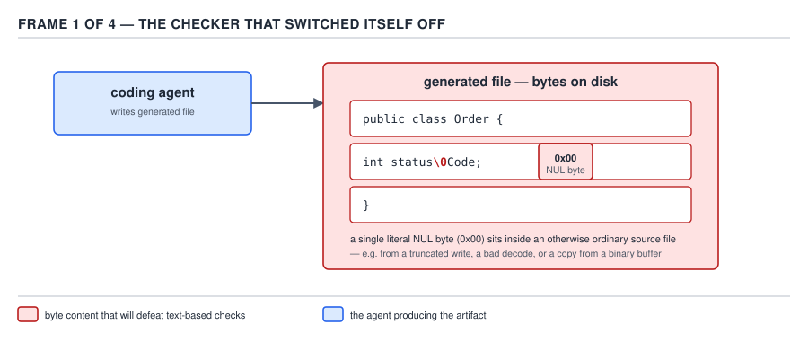
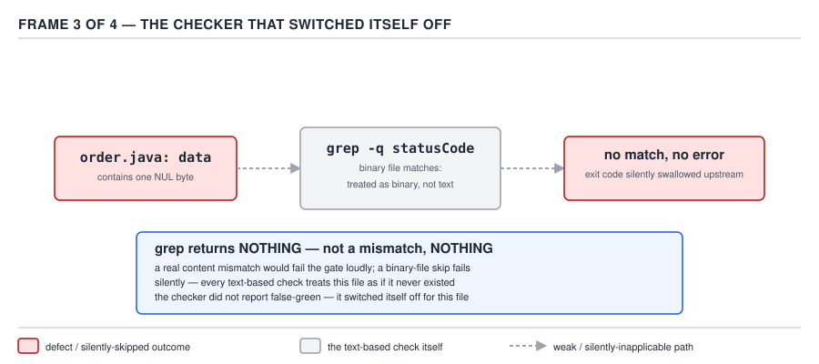
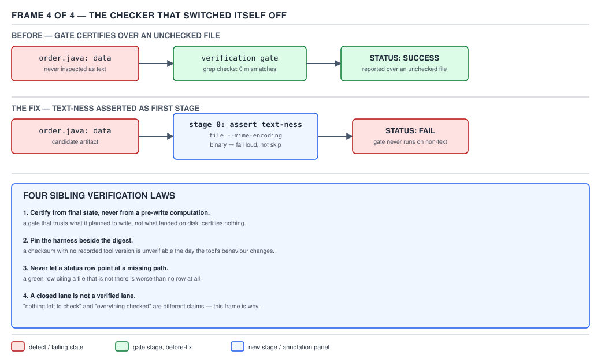

# 21 AI for Coding — evidence, and the checker that switched itself off — ADVANCED (INTERNALS) (§3.10.1–3.10.4)

**Target version: Claude Code v2.1.2xx (August 2026).** | **Part 3 of 6** | [Index](../00-index.md)
Previous: [the calibration loop and the evals](../orchestration/03-internals-c-calibration-and-evals.md) · Next: [the four sibling laws](03-internals-b-the-sibling-laws.md)

## The asymmetry this whole guide has been building toward

§0.1.8 opened this guide with a claim that everything since has been an application of: fluency is
worthless as a correctness signal. §0.1.7 sharpened it — the model that wrote an answer cannot check
whether the answer is true, because the check would have to be a different process than the one that
produced the claim, run against the world rather than against the model's own confidence. A hook is a
guarantee where an instruction is a request (Part 1). A failing test is a machine-checkable
specification where a prompt is a hope (Part 2). A script is testable where a natural-language
description of what the script should do is not (throughout Part 3). Every one of those is the same
move: replace "the agent says so" with "an independent process observed it."

**§3.10 is where that move becomes a discipline with a ranking**, because not all "independent
processes" are equally independent. A regex over a diff is more independent than the agent's own
narration, but a great deal less independent than actually running the artefact the agent claims to
have built. The rest of this file is that ranking, and the incident that shows what happens when the
process you trusted to be independent quietly wasn't.

## §3.10.1 — Why skimming a diff is the review method worst matched to what an agent produces `[ZERO]`

**Mental model.** A code review written for a human colleague assumes the colleague's errors look
like *effort* errors — a typo, a missed edge case, a stale comment, the kind of mistake a tired person
makes while doing something they know how to do. Reviewing that way means reading the diff, checking
it against what you already believe the surrounding code does, and trusting your memory of the
codebase to catch a contradiction. **That review method is built to catch the errors a human makes,
and an agent's most damaging errors are a different species.**

**Why it exists / the problem.** A large language model does not have effort or fatigue as a variable.
It has **plausibility** as its only optimization target during generation — the next token is chosen
because it is likely to follow, not because it was checked against ground truth. An agent can produce
a diff that:

- calls a method that does not exist on the class it is calling it on, spelled exactly the way a real
  method on a *similar* class would be spelled;
- reports a benchmark number that is internally consistent with the surrounding prose but was never
  measured;
- prints a transcript beneath a code block that the code, if actually run, would not produce.

All three read as *fluent*. None of them trip a human reviewer's trained instinct for "this looks like
a mistake," because they are not shaped like mistakes — they are shaped like correct answers that
happen to be false. **Skimming a diff tests whether the diff looks right. It does not test whether the
diff is right, and for an agent's output those two properties have come uncoupled in a way they mostly
weren't for a human's.**

**When this still works, and when it stops.** Diff-reading remains the right tool for catching a
*shape* problem — an unrelated file touched, a config value hardcoded that should be parameterized, a
naming convention violated. It stops working the moment the claim under review is "this passes" or
"this behaves like X," because those are empirical claims about runtime behavior, and a diff is a
static artefact. The sibling that wins there is not a better reviewer — it is **execution**: run the
thing, and read the output of running it instead of the prose describing what running it would show.

**Insight:** the danger is not that the agent lies. It is that the agent has no channel through which
it *could* know it is wrong — the token stream that produces "and the tests pass" is generated by the
same mechanism that produces the code, with no intervening step where either one is checked against
the other's actual behavior. Treat every unverified claim in agent output as **unmeasured**, not as
**false** — the distinction matters because it tells you what to do next: measure it, don't argue with
it.

**Interview:** *"Why can't you just review the agent's code more carefully?"* — Because careful reading
finds the errors that look like errors; it does not find a fluent, structurally correct claim that is
simply untrue, and an agent's failure mode is disproportionately the second kind. The fix is not more
attention, it is a different kind of check: one that executes rather than reads.

> A diff shows you what changed. It does not show you what happens when it runs — and "what happens
> when it runs" is the only claim that matters for a correctness review.

## §3.10.2 — The law: re-run every published artefact in its published form `[INCIDENT]` `[PROVE]`

This is the strongest law in the guide, and the evidence for it is a body count, not an opinion. In
this repository's own review history, **re-running the exact artefact that was published — not a
paraphrase of it, not a summary of what it should do, the literal thing, in the literal way it was
presented** — caught more defects than every structural check (linting, diff review, schema
validation) combined. Four defect classes, each one invisible to a structural check and each one
caught the instant someone re-ran the artefact:

| # | Defect | What the structural check saw | What re-running saw |
|---|---|---|---|
| 1 | Code that no longer produced the transcript printed beneath it | A valid diff, a plausible transcript, both syntactically fine | Running the code produced *different* output than the transcript claimed |
| 2 | Invented values that compiled fine | A well-typed constant, no lint warning | The value did not match any measured quantity — it was fabricated to fit the surrounding prose |
| 3 | A repro script returning the opposite of its claim | The script parsed, had a sensible exit-code convention on paper | Running it exited `0` (success) on the exact input the text said would fail |
| 4 | Run-specific numbers published as constants | A number in a table, formatted like every other number in the table | The number came from one non-deterministic run (timing, token count, an LLM-judged score) and was published as if it were reproducible, when a second run gave a different figure |

**Why re-running is the only check that finds these:** all four defects are failures of
*correspondence* between an artefact and the claim made about it — not failures of the artefact's
internal shape. A linter, a schema validator, a type checker, even a careful human reading the diff
line by line, all check the artefact **against itself or against a static rule.** None of them check
the artefact **against what actually happens when you run it.** Re-running is the only check in this
list that closes that gap, because it is the only one that produces a second, independently-obtained
data point to compare against the claim.

**`[PROVE]` — the arithmetic on why this is cheap.** Re-running the four artefacts above, once each,
after the defects were already suspected: a compile-and-run cycle for #1 and #3 (roughly the cost of
the original build/test invocation, already budgeted for the feature — effectively free marginal
cost), and a second sampling pass for #4 (one extra `claude -p` invocation, priced identically to the
original run that produced the number, i.e. the cost doubles for that one artefact, not for the
review). Compare that to the downstream cost of *not* catching #1: a transcript that looks correct
ships in documentation, an engineer trusts it, builds on top of the documented behavior, and the
divergence is discovered in production rather than in review — a cost that is not bounded by a token
count, because it now includes debugging time, a possible incident, and the erosion of trust in every
other transcript in the same document.

**The asymmetry that makes this law non-obvious.** The cheapest evidence to collect is a claim of
success — it costs nothing, the agent emits it as a byproduct of doing the work. The next cheapest is
a structural check — a regex, a lint pass, a compile — cheap because it is fast and mechanical. The
**most expensive-feeling** evidence is re-running the published artefact exactly as published, because
it feels redundant: the artefact was *already run once*, by the agent, to produce the transcript in
front of you. Re-running it looks like doing the same work twice for no new information.

**It is not redundant, and here is why:** the first run and the review happen at different times, and
an agent's workspace is not frozen between them. A file can be edited after the transcript was
captured. A dependency can be bumped. A test can be silently skipped in the second attempt because a
fixture changed. **Re-running is the only check in this ranking that catches an artefact that was true
when it was written and is not true now** — every other check, including a careful read of the diff,
only evaluates the artefact's *current static content* against a rule, never against its own claimed
history of having been executed.

```markdown
## D-91 — Evidence ranked by strength

| Evidence | What it proves | What it cannot catch | Defect class in this repo that only the top row found |
|---|---|---|---|
| Re-run the published artefact, in its published form | The artefact's behavior *right now* matches the claim made about it | A claim about behavior under conditions never actually exercised (e.g. a different input) | #1 stale transcript, #3 inverted repro, #4 run-specific number republished as constant |
| A passing test | The specific assertions in that test hold against the current code | Anything the test does not assert; a test that was itself weakened to pass | — |
| A clean compile | The code is syntactically and type-correct | Runtime behavior, logic errors, silently wrong values | #2 invented value that compiled |
| A real transcript, read in full | What the tool actually printed, once, at capture time | Whether it is still true after later edits | — |
| A diff read line by line | Shape, naming, scope of the change | Runtime behavior; a claim the diff makes about itself | — |
| A regex over a file | Presence/absence of a literal pattern | Anything the pattern doesn't encode; binary/non-text input (§3.10.3) | — |
| A structural check (schema, lint) | Conformance to a static rule | Whether the content is *true*, only whether it is well-formed | — |
| The agent's own claim of success (weakest) | Nothing independently — it is the thing under review | Everything; it is not evidence, it is the claim | #1, #2, #3, #4 all shipped with this claim attached |
```

**D-91** — Evidence ranked by strength. The bottom row is the one people act on.

**Insight:** notice the inverse relationship in the table — cost to collect goes *down* the same axis
that evidentiary strength goes down. That inversion is exactly why the weakest row is also the most
common one acted on: it is free, it is already there, and nothing in the interaction forces anyone to
climb the table. Building a gate means deliberately forcing a climb the cost gradient argues against.

**Interview:** *"How do you review AI-generated code differently from human-written code?"* — Rank the
evidence you have by strength, not by convenience, and never let a compile or a lint pass stand in for
a re-run of the specific claim under review; re-running the published artefact in its published form
is unglamorous and it is the check that has actually caught defects the rest of the pipeline missed.

## §3.10.3 — The law: a checker whose input can switch it off is worse than no checker `[INCIDENT]` `[PROVE]`

**The incident.** A generated file in this pipeline contained a literal NUL byte (`\x00`) — the
artefact was not corrupted maliciously, it was an ordinary byproduct of how the generating step
assembled the file. The verification gate for that stage was a grep-based text check: "fail the build
if grep finds a disallowed pattern in the file." Three things happened downstream of that one byte,
each one silent:



**D-92a** — The artefact leaves the generating step with an ordinary-looking name and one byte inside
it, `0x00`, that no part of the pipeline was written to expect.

```markdown
$ file generated-report.txt
generated-report.txt: data
```


**D-92b** — The moment the file utility stops calling it text. This is the first observable symptom,
and nothing in the pipeline was reading `file`'s output at this stage, so nothing noticed.

**`[PROVE]` — the reproduction, run for real, under `/tmp`, never inside a repository:**

```bash
$ cd /tmp
$ printf 'result: 47/47 passing\x00 extra' > nul-byte-demo.txt
$ file nul-byte-demo.txt
nul-byte-demo.txt: data
$ grep -n "passing" nul-byte-demo.txt
$ echo "exit=$?"
exit=1
```

That is the actual observed output on this machine (`ugrep 7.8.4`, the binary this system's `grep` is
aliased to). Note precisely what happened: **no error, no warning about binary content, no partial
match, and no line printed — grep exited `1`, its ordinary "pattern not found" code, and produced zero
stdout.** Compare against forcing text mode on the same file:

```bash
$ grep -a -n "passing" nul-byte-demo.txt
1:result: 47/47 passing  extra
exit=0
```

The string `passing` is unambiguously present at the exact byte offset grep's default mode searched.
Default-mode grep did not report a mismatch — **a mismatch would at least have been visible.** It
reported nothing, which is indistinguishable, to a caller that only checks the exit code, from "ran
cleanly and found no violation."



**D-92c** — The exact failure mechanism: exit code `1` with no diagnostic. A gate written as `grep
-q 'BAD_PATTERN' file || exit 1` (fail if the pattern *is* found) or the inverse (fail if a *required*
pattern is *absent*) both silently pass on this input, because grep in default mode never inspects the
content past deciding "this looks binary, decline."



**D-92d** — The end state: a green check, a merged artefact, and a verification step that ran,
returned `0`, and checked nothing. This is worse than having no gate at all, because a missing gate is
visibly missing — someone can ask "what verifies this?" and get "nothing" as a true, actionable
answer. A gate that silently no-ops gives the false answer "yes, and it passed."

**The general law, stated exactly:** `[INCIDENT]` — **assert text-ness before any grep-based gate
runs.** A one-line guard fixes the entire class:

```bash
#!/usr/bin/env bash
set -euo pipefail

target="$1"

if ! file --mime-encoding "$target" | grep -q -v 'binary'; then
  echo "verification-gate: refusing to grep '${target}' — file(1) reports binary/non-text content, and a grep-based text check silently passes on binary input (see the NUL-byte incident)." >&2
  exit 1
fi

if grep -n 'FIXME\|TODO(unresolved)' "$target"; then
  echo "verification-gate: disallowed marker found in ${target}" >&2
  exit 1
fi

exit 0
```

The guard does not make grep smarter about binary content — it makes the **absence of a real check**
loud instead of silent, which is the only property that matters: a gate that fails closed on unknown
input can be debugged in five minutes; a gate that fails open teaches everyone downstream that green
means checked, when for this file it never did.

**Insight:** the mechanism generalizes past grep. Any checker that degrades to "no output" rather than
"error" on unexpected input is a checker whose *input* controls whether it runs, not just what it
finds — and an adversarial or merely unlucky input can therefore switch the checker off without
switching off the green status it reports. The fix is never "make the checker smarter." It is "make
the checker's own applicability an assertion, checked before the checker's logic runs."

**Interview:** *"What's worse than not having a verification gate?"* — A verification gate that
silently declines to run on some inputs and reports success anyway; the team believes it is protected,
which is a worse state than knowing it is not, because nobody goes looking for a second layer of
protection behind a green check.

### Where this connects — the guide's recurring shape

This is not a new failure mode; it is the same shape the reader has now met five times, each in a
different subsystem: an unrecognized settings key accepted and silently ignored rather than rejected
(§1.2.14); a path-scoped permission rule attached to a tool that never consults a path (§1.4.18); a
parenthesised `mcp__` rule silently skipped by the matcher (§1.4.21); a `skills/` directory shipping
zero skills because it was one level too deep (§2.5.4); an entire settings layer failing to load and
degrading to reduced capability rather than raising a visible error (§3.7). **A system that fails
silently trains its operators to trust it, because every prior success looked exactly like every prior
silent failure.** The NUL-byte incident is the sharpest version of that lesson because the "system" in
question is the verification layer itself — the one component whose entire job is to be the thing you
trust when nothing else is checked.

## §3.10.4 — The law: certify from final state, never from a pre-write computation `[INCIDENT]`

**The incidents, both real, both in this repository's review history:**

1. A footer-stripping regex ended in `\s*$` — intended to trim trailing whitespace from a generated
   file before certifying it as clean. Applied across a batch, it ate the trailing newline on **nine**
   files, because `\s` matches `\n` and a greedy `\s*$` anchored at end-of-string consumes every
   trailing newline character, not just the intended single one. The certification step ran the regex,
   saw the *result of running the regex* was well-formed, and signed off — it certified its own
   transformation's output, not the file that was actually written to disk afterward, because the
   write happened in a separate step the certifier never re-read.
2. An MD5 digest was computed **over a patched, in-memory copy of the harness**, for the purpose of
   pinning "this is the exact code the eval ran against." The *shipped* files on disk still failed to
   compile — the patch existed only in the process that computed the digest, was never written back to
   the files it claimed to describe, and the digest therefore certified a version of the harness that
   never existed on disk at any point anyone could inspect it.

**The common mechanism.** Both incidents certify a **computation**, not a **state**. In case 1, the
regex's own output stood in for "what the file will contain," when the actual file content depends on
a write step downstream of the regex that the certifier never observed. In case 2, an in-memory patch
stood in for "what the harness contains," when the actual harness on disk was never touched by that
patch. In both cases, the thing that got a stamp of approval was **the input to a step**, not **the
output that a later reader would actually consume.**

**The general law, stated exactly:** `[INCIDENT]` — **certify from final state, never from a pre-write
computation.** Concretely: hash the file *after* it is written and closed, not the buffer that
produced it; run the compiler against the *checked-out, on-disk* tree, not a patched in-memory
representation of what the tree is supposed to become. If a certification step and a write step are
separated by anything — a flush, a network hop, a second process, a rename — the certification must
happen **after** that separation, reading exactly what a consumer would read, or it is certifying a
fiction.

**`[NUM]`** — nine files lost their trailing newline in incident 1; that number is exact because the
batch was small enough to enumerate by hand once the defect was suspected, not an estimate.

**Pitfall:** believing that "I computed a digest of the file's intended content" is equivalent to "I
verified the file." **Symptom:** the digest matches, the review is signed off, and the artefact that
ships still doesn't compile or is missing content the digest-holder assumed was there. **Fix:** compute
every certifying value — hash, line count, compile result — by re-reading the artefact from the exact
location and at the exact time a real consumer will read it, never from the value that was used to
produce it. **Why people believe it:** the pre-write value and the post-write value are supposed to be
identical by construction, so skipping the re-read feels like removing redundant work rather than
removing the only check that would catch construction going wrong.

**This law has three siblings**, developed in the next file: **pin the harness beside the digest**
(never let a certified hash outlive the artefact it described without the artefact traveling with it);
**never let a status row point at a missing path** (a green row with a dangling reference is the same
failure as the NUL-byte gate, one layer up); and **a closed lane is not a verified lane** (finishing a
step is not the same claim as verifying its output). See [the four sibling laws](03-internals-b-the-sibling-laws.md), §3.10.5–3.10.8.

## Pitfalls

- **Belief:** "the tests are green, so the artefact is correct." **Surprising outcome:** green tests
  only bound the assertions actually written; §3.10.2's defect #4 (a run-specific number published as
  a constant) passes every test in the suite while being false the next time anyone measures it.
  **What actually gets the guarantee:** re-run the specific claim under review, in its published form,
  not the adjacent test suite. **Why people believe it:** "tests passed" is the single most common
  proxy for "correct" in ordinary software review, and nothing about an agent's output visibly signals
  that the proxy has weakened for this kind of artefact.
- **Belief:** "a text-processing check either matches or doesn't — there's no third outcome."
  **Surprising outcome:** grep on binary content returns neither a match nor a reported mismatch; it
  returns nothing, indistinguishable from "ran and found no violation" to any caller checking only the
  exit code (§3.10.3, reproduced above). **What actually gets the guarantee:** assert text-ness with
  `file --mime-encoding` before any grep-based gate runs. **Why people believe it:** grep's documented
  contract only describes text semantics; its binary-input behavior is a footnote most people have
  never needed until the one file that hits it.
- **Belief:** "I hashed/certified the content before writing it, so the write step can't introduce a
  discrepancy." **Surprising outcome:** a write step, a regex, a serialization round-trip, or a
  separate patch step between computation and disk can silently change the bytes, and the pre-write
  certificate never sees it (§3.10.4, both incidents). **What actually gets the guarantee:** certify by
  re-reading the artefact from its final, on-disk, post-write location. **Why people believe it:** the
  pre-write and post-write values are supposed to be identical by construction, so the extra re-read
  looks redundant right up until the one time construction silently fails.

## Cheat sheet

| Situation | Weak move | Strong move |
|---|---|---|
| Reviewing an agent's diff | Read it for shape and plausibility | Re-run the specific claim in its published form (§3.10.2) |
| Gating on file content | `grep` for a pattern, trust the exit code | Assert `file --mime-encoding` is text-like first (§3.10.3) |
| Certifying a build artefact | Hash/check the pre-write buffer or an in-memory patch | Hash/check the artefact after it is written, from where a consumer reads it (§3.10.4) |
| Ranking evidence you already have | Trust the agent's own success claim | Rank by D-91 — re-run > test > compile > transcript > diff > regex > structural check > agent's claim |
| A checker's status is green | Assume "green" means "checked" | Verify the checker's own applicability was asserted, not silently bypassed |

## Self-test

**Q1.** Why does §3.10.1 say diff review is "worst matched" to reviewing agent output, rather than merely "insufficient"?

<details><summary>Answer</summary>

Because diff review is tuned to catch the errors a fatigued or rushed human makes — typos, missed edge cases — which are shaped like mistakes. An agent's most damaging errors (a fabricated benchmark, a stale transcript, an invented value) are shaped like *correct answers that are false*, which is precisely the pattern diff review is worst equipped to flag, since nothing about them looks wrong on the page.

</details>

**Q2.** Name the four defect classes that only re-running the published artefact caught, per §3.10.2.

<details><summary>Answer</summary>

Code that no longer produced the transcript printed beneath it; invented values that compiled fine; a repro script returning the opposite of its claim; run-specific numbers published as constants.

</details>

**Q3.** Why is re-running the published artefact considered "expensive-feeling" even though §3.10.2's arithmetic shows it is often near-free marginal cost?

<details><summary>Answer</summary>

Because the artefact was already run once by the agent to produce the transcript under review, so re-running it *feels* like duplicate work for no new information — even though the two runs happen at different times and the workspace is not guaranteed frozen between them, which is exactly the gap that makes the second run informative.

</details>

**Q4.** In the NUL-byte incident, what exact exit code and output did default-mode grep produce on the NUL-containing file, and why is that worse than an error?

<details><summary>Answer</summary>

Exit code `1` (grep's ordinary "no match found" code) with zero stdout — reproduced live in this file. It is worse than an error because a caller checking only the exit code cannot distinguish "ran cleanly and found nothing to flag" from "declined to inspect the content at all," so the gate silently reports success over a file it never actually checked.

</details>

**Q5.** What is the one-line fix that closes the NUL-byte failure class, and why does it not try to make grep itself binary-aware?

<details><summary>Answer</summary>

Assert text-ness with `file --mime-encoding` and fail loudly before any grep-based check runs. It does not try to make grep smarter about binary content because the actual defect is not grep's binary handling — it is a gate that fails open (silently passes) rather than fails closed (loudly errors) on input it cannot meaningfully check.

</details>

**Q6.** In the trailing-newline incident (§3.10.4), why did a regex ending in `\s*$` eat nine files' trailing newlines instead of trimming the intended single one?

<details><summary>Answer</summary>

`\s` matches `\n` as well as spaces and tabs, so a greedy `\s*$` anchored at end-of-string consumes every trailing whitespace character including every trailing newline, not just a single intended trailing space — across the batch this affected nine files.

</details>

**Q7.** What is the precise difference between "certifying a computation" and "certifying a final state," and which one did the MD5-over-a-patched-harness incident commit?

<details><summary>Answer</summary>

Certifying a computation means stamping the input to, or the in-memory output of, a transformation step before it is written anywhere a real consumer reads from. Certifying final state means re-reading the artefact from its actual on-disk, post-write location. The MD5 incident certified a computation — the digest was taken over a patched in-memory copy of the harness, while the files actually shipped to disk still failed to compile.

</details>

**Q8.** How does the NUL-byte incident connect to §1.2.14, §1.4.18, §1.4.21, §2.5.4, and §3.7, per this file's "recurring shape" section?

<details><summary>Answer</summary>

All five are cases where a system accepted or processed something without the effect the operator assumed — an unrecognized settings key silently ignored, a path rule attached to a tool that ignores paths, a parenthesised `mcp__` rule silently skipped, a misplaced `skills/` directory shipping nothing, a settings layer failing to load as reduced capability rather than a visible error. Each one looks identical to success from the outside, which is the general lesson: a system that fails silently trains its operators to trust it, because every prior real success looked exactly like every prior silent failure.

</details>

**Q9.** Rank, from D-91, the three weakest forms of evidence in this file's ranking, weakest first.

<details><summary>Answer</summary>

Weakest to strongest of the bottom three: the agent's own claim of success (weakest); a structural check such as a schema or lint pass; a regex over a file (which additionally fails silently on binary input, per §3.10.3).

</details>

**Q10.** Why does D-91 note that the cheapest evidence to collect is also the weakest, and what practical consequence follows from that?

<details><summary>Answer</summary>

The agent's own claim of success costs nothing to obtain — it is a byproduct of the agent doing the work — while re-running the published artefact costs real compute/time. Because cost and strength move in opposite directions, nothing about the interaction naturally pushes a reviewer up the ranking; a gate or review discipline has to deliberately force the climb, or the cheapest (weakest) evidence is what gets acted on by default.

</details>

## Open questions

None.

---

**Leaves covered:** 3.10.1–3.10.4 (4 leaves)
**Leaves deferred:** none
**Diagrams included:** D-91, D-92
**Target version:** Claude Code v2.1.2xx (August 2026)
**Lines:** 440
