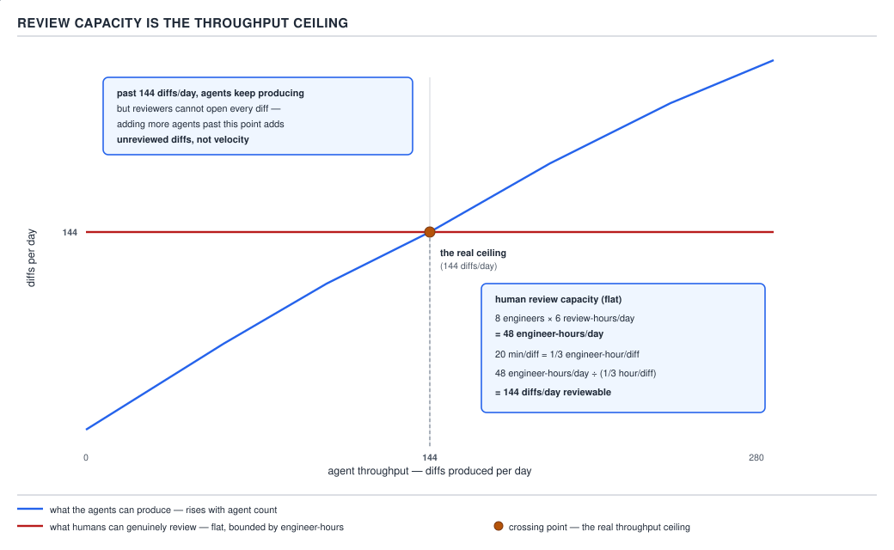

# 21 AI for Coding — automation, and review capacity — ADVANCED (INTERNALS) (§3.10.9–3.10.11)

**Target version: Claude Code v2.1.2xx (August 2026).** | **Part 3 of 6** | [Index](../00-index.md)
Previous: [the four sibling laws](03-internals-b-the-sibling-laws.md) · Next: [PART 3 — the interview wrap-up](../92-interview-internals.md)

This file closes PART 3. The previous two files ranked evidence by strength (D-91), told the
NUL-byte story of a checker that stopped checking (D-92a–d), and developed four sibling laws — pin
the harness beside the digest, never let a status row point at a missing path, a closed lane is not
a verified lane, rank evidence and do not let a lower tier stand in for a higher one — each grounded
in a real incident with a real cost. This file does two things with that inheritance: it says where
the gates those laws demand actually belong in the request lifecycle (§3.10.9–3.10.10), and it
closes with the one claim that constrains every gate this guide has built (§3.10.11) — that the
ceiling on what an agentic workflow can safely ship is not agent throughput, it is how many diffs a
human can genuinely read in a day.

## §3.10.9 — Automating the gates: fast in `Stop`, slow in CI `[BUILD]`

**Mental model.** A gate is a promise, and every promise has a price paid at a specific moment. The
question this leaf answers is not "which gates should exist" — the previous two files already
answered that — but **which moment in the lifecycle each gate's price should be charged to**: once
per edit, once per turn, or once per push. Charging the wrong moment does not make the gate wrong;
it makes the gate too expensive to survive.

**Why it exists.** §2.3.1 already established that a hook is a guarantee, not a suggestion the
model can talk itself out of — it runs whether or not the model wants it to. That is exactly why
*where* a guarantee runs matters more here than it would for an ordinary check: a guarantee that
fires on the wrong event either does nothing useful (a linter that only runs at session end, long
after the bad line was written) or taxes something that cannot afford it (a full build charged to
every single turn). Automating "the gates" from §3.10.5–3.10.8 means picking the cheapest event
that still catches the defect class, not the most thorough one.

**How it works.** Three moments, three different price tags:

| Moment | Event | What belongs here | Why |
|---|---|---|---|
| Per edit | `PostToolUse` on `Write`\|`Edit` | A formatter, a fast linter | Runs once per file touched; seconds, deterministic, no LLM tokens spent re-reading a wrong-shaped diff later |
| Per turn | `Stop` | A **fast** local check only — compile, not the full suite | `Stop` (and `SubagentStop`) use top-level `decision`/`reason`, not an enum inside `hookSpecificOutput`. Quoted verbatim from `https://code.claude.com/docs/en/hooks` (raw markdown, re-fetched and grepped 2026-08-30 against Claude Code v2.1.2xx): "`decision`: `\"block\"` prevents Claude from stopping. Omit to allow Claude to stop" and "`reason`: Required when `decision` is `\"block\"`. Tells Claude why it should continue." **Second correction to this file — the first was itself wrong.** The earlier draft used a boolean `continue`; a prior "fix" replaced that with `decision: "continue"` / `continueReason`, believing that was the real schema. Neither exists. There is no `continueReason` field, no `decision: "continue"` enum value, and no `hookSpecificOutput.continue`. To keep Claude working you **block the stop**: `{"decision": "block", "reason": "..."}`. Omitting `decision` (not setting it to `"continue"`) is what lets the stop proceed. Separately, the universal `continue` boolean (default `true`) is a kill switch on every event — `continue: false` stops Claude entirely regardless of `decision`, and its `stopReason` is shown to the user, not fed back to the model. |
| Per push / on a schedule | CI | The full test suite, security scans, integration tests, the eval suite from `governance/03`'s `baselines.yaml` | No turn is waiting on it — it can take as long as it needs |

The failure mode this table exists to prevent is putting a slow check in the middle row. D-95's own
manifest (`build-it/02-three-hooks.md`, not yet written) already carries the warning inline against
exactly this: a `Stop` hook named `require-green-build.sh` that runs a full build **every single
turn** is a four-minute tax paid every time the model believes it is done — and the practical
consequence is not "slower turns," it is that engineers disable the hook the first week, because
nobody tolerates a four-minute wait to send the next message. A hook that gets disabled is a
guarantee that no longer holds, which is the one outcome §2.3.1's whole premise was built to avoid.
The fix is not a faster four-minute build; it is recognising that "did this compile" and "does the
full suite still pass" are different-priced questions, and only the first one belongs on `Stop`.

**No SVG for this leaf.** The only diagram in this file is D-93, embedded at §3.10.11; the table
above is the mechanism map for where each gate belongs.

**Code.** A hooks configuration that puts a formatter on every edit and a **compile-only** check on
`Stop`, leaving the full suite to CI:

```json
{
  "hooks": {
    "PostToolUse": [
      {
        "matcher": "Write|Edit",
        "hooks": [
          { "type": "command", "command": "${CLAUDE_PROJECT_DIR}/.claude/hooks/format-on-edit.sh" }
        ]
      }
    ],
    "Stop": [
      {
        "hooks": [
          { "type": "command", "command": "${CLAUDE_PROJECT_DIR}/.claude/hooks/fast-compile-gate.sh" }
        ]
      }
    ]
  }
}
```

`fast-compile-gate.sh` — deliberately narrower than a test run:

```bash
#!/usr/bin/env bash
# Stop hook — RUNS ON EVERY TURN END. Must stay fast: this is a per-turn tax,
# not a per-push one. Compile only; the full suite lives in CI.
set +e

INPUT="$(cat)"

mvn -q -o -T 1C compile 2>/tmp/fast-compile-gate.log
STATUS=$?

if [ "$STATUS" -ne 0 ]; then
  REASON="$(tail -n 20 /tmp/fast-compile-gate.log)"
  python3 -c "
import json
print(json.dumps({
    'decision': 'block',
    'reason': 'Compile failed after this turn\'s edits:\n' + '''$REASON''',
}))
"
  exit 0
fi

exit 0
```

**Prove it fires.** Break the build on purpose, end the turn, and watch the hook reopen it:

```
$ mvn -q -o -T 1C compile
[ERROR] cannot find symbol: method withdraw(BigDecimal)
$ echo $?
1
```

With the hook wired to `Stop`, the JSON `{"decision": "block", "reason": "..."}` above is what the
harness reads back — the turn does not end; the model receives the compile error as `reason` and
keeps working. No manual re-prompt, no separate "please fix the build" message: the guarantee from
§2.3.1 fires whether or not the model believed it was finished.

**What this costs.** The subprocess itself costs no LLM tokens — `mvn -q -o compile` runs entirely
outside the model. The cost is what gets fed back on failure: `reason` re-enters the context
as part of the next turn's input, roughly 150–300 tokens for a short compile error, which at
Sonnet-class pricing (~$3 / million input tokens) is a fraction of a cent per retry — negligible next
to the 4-minute, full-price CI run this same failure would otherwise have consumed before anyone
noticed. The saving is not in the hook's own execution cost; it is in catching the failure one turn
earlier than the outer loop would have.

**Gotcha.** **Pitfall:** believing "automate the gates" means moving every check from CI into a
`Stop` hook, on the theory that catching a defect earlier is strictly better. **Symptom:** turns
that used to take seconds now take minutes, because the full suite — security scans, integration
tests, the eval batch — is now gating every message. **Fix:** keep `Stop` to the cheapest check that
still blocks the model from declaring victory on a broken compile; leave everything that needs
real wall-clock time to CI, where nothing is waiting on it.

**The mechanical reason a slow `Stop` hook is dangerous, not just annoying.** In addition to the
common input fields, a `Stop` hook receives `stop_hook_active`, `last_assistant_message`,
`background_tasks`, and `session_crons`; verbatim from the raw docs page: "The `stop_hook_active`
field is `true` when Claude Code is already continuing as a result of a stop hook. Check this value
or process the transcript to avoid blocking on a condition that will never resolve. Claude Code
overrides the hook and ends the turn after 8 consecutive blocks." `fast-compile-gate.sh` above does
not check `stop_hook_active` — every failed compile blocks again unconditionally — which makes it an
infinite-turn generator on a compile error that the model cannot fix, bounded only by that
8-consecutive-block cap, not by anything the script itself does. A production version of this hook
should check `stop_hook_active` and fall through to `exit 0` with no `decision` field once already
retried once, rather than relying on the cap as the only backstop.

The full local/CI split assembled into a single runnable script — with text-ness asserted before
content, exactly per §3.10.3's grep-on-binary lesson — is built in
[`build-it/08-verification-harness-a.md`](../build-it/08-verification-harness-a.md), where D-99
draws its gate order. This leaf is the argument for which check belongs at which moment; that file
is the artefact.

## §3.10.10 — `[TRAP]` `[CASE]` Command shapes that defeat a permission matcher and therefore your own gates

**Mental model.** Every automated gate built in §3.10.9, and every `PreToolUse` deny rule from
earlier parts of this guide, works by inspecting `tool_input.command` as a string — either against a
permission matcher's own parsing rules or against a hand-written regex in a hook script. Both
approaches assume the string they see is a faithful description of what will execute. Shell syntax
exists specifically to let one string produce behaviour that is not visible in that string's most
obvious reading, which is exactly the gap between "the matcher inspected this" and "this is what
ran."

**Why it exists.** A `PreToolUse` hook that pattern-matches a dangerous verb is rank-2 discipline
from `governance/01`'s threat model — cheap, and useful against the common accidental case. It was
never claimed to be a full shell parser, and the sdlc-harness's own guard says so about itself,
in its own comments, rather than this guide asserting it from outside.

**How it works, and the real admission.** `plugins/sdlc-harness/hooks/prod-guard-bash.sh` is the
`PreToolUse` hook this guide has already used twice — once for the fail-closed AWS deny-list in
`governance/03`, once as rank-1-and-rank-2-layered in the same file. Its header comment states the
exact limitation this leaf is about, verbatim:

```
# Deterministic string/regex match, not a full command-injection-proof
# boundary (same caveat as harness-commit-guard.sh) — a determined command
# could still evade this via a subshell or alias. It exists to make the
# common, accidental case (running a harness workflow or a prod AWS command
# before bootstrap, or from an unrelated CWD with no project settings) fail
# loudly instead of silently proceeding unguarded.
```

The library it sources, `plugins/sdlc-harness/hooks/prod-guard-lib.sh`, makes the mechanism concrete
— a single `grep -qE` call against the whole command string:

```
prod_guard_is_mutating_or_prod_aws() {
  local cmd="$1"
  printf '%s' "$cmd" | grep -qE \
    'aws +cloudformation +(delete|update|create)-stack|aws +cloudformation +execute-change-set|aws +ecs +update-service|aws +lambda +update-function-configuration|aws +lambda +list-functions|aws +iam +list-|aws +ssm +.*(--name +/prod/|--path +/prod/)|aws +.*--profile +[^ ]*prod'
}
```

This is a real, careful gate — the same team wrote the fail-closed bootstrap-verification pattern
and the `stories_md_sha256` pin — and it still cannot close the gap named in its own comment. Three
concrete shapes open that gap:

- **A heredoc.** `bash <<'EOF'` puts the dangerous payload in the heredoc *body*, not in the
  `tool_input.command` string the matcher inspects — the command the harness sees is `bash`, and the
  actual AWS call is data the shell reads afterward, invisible to a regex over the invocation line.
- **A `$(...)` subshell.** The comment names this explicitly — `aws $(printf 'clou...')` or a command
  reconstructed at runtime from pieces defeats a literal string match even though `grep -E` scans the
  whole line, because the dangerous substring never appears in the line at all; it is assembled by
  the shell after the matcher has already looked.
- **`&&` / `;` chains combined with obfuscation.** A chain alone does not defeat this particular
  `grep -qE` (it has no anchors, so it matches anywhere in the string) — but a chain that pipes a
  decoded or reconstructed command into a second shell (`echo <base64> | base64 -d | bash`) does,
  for the same reason as the subshell case: the literal text the matcher reads never contains the
  pattern it is looking for.

**What would break without the fix, and what the fix actually is.** The leaf's own remedy is stated
plainly: **use one command per call, absolute paths, and the Write tool for scratch files.** This is
discipline on the *authoring* side, not a smarter regex — no regex is a full shell parser, and
trying to make one arbitrarily clever only produces a longer pattern with a different blind spot.
Concretely: instead of

```bash
cat <<'EOF' > /tmp/check.sh && bash /tmp/check.sh
aws ssm get-parameter --name /prod/db/password
EOF
```

which hides the real command inside a heredoc a naive gate never inspects, write the script with the
Write tool first, then invoke it as one plain command with an absolute path:

```
Write("/tmp/verify-scratch/check.sh", "#!/usr/bin/env bash\naws ssm get-parameter --name /prod/db/password\n")
Bash("bash /tmp/verify-scratch/check.sh")
```

The second form gives the matcher a command it can actually reason about — `bash` plus a resolvable
path — rather than a payload folded into shell syntax whose evaluation order the matcher does not
model. It does not make the *content* of `check.sh` safe; it makes the *invocation* legible to
whatever gate is watching it, which is the only thing a string-matching gate can ever promise.

**Gotcha.** **Pitfall:** treating a `PreToolUse` regex hook that has caught every dangerous command
in testing as a closed gap, because it has never yet been observed to miss one. **Symptom:** the
same team that wrote the fail-closed bootstrap check and the digest-pinning fix for §3.10.5 still
shipped a gate whose own comment admits a subshell or alias evades it — a careful team, an
acknowledged gap, not a careless one. **Fix:** never emit a heredoc, a chain that decodes or
reconstructs a command, or a bare `$(...)` around a Bash tool call yourself, and treat every
pattern-matching gate as raising the cost of the dangerous action, not eliminating it — the same
"the verb isn't in the tool set at all" logic that made `triage-aws-ro.sh`'s allowlist in
`governance/03` stronger than a deny rule applies here in reverse: a general-purpose `Bash` tool
cannot have the dangerous verb removed from it, so the fallback is discipline plus the depth this
guide has spent three files building — a `Stop`-hook compile gate that does not care how the edit
was made, and a CI run downstream of all of it that re-executes for real rather than pattern-matching
anything.

## §3.10.11 — `[PROVE]` `[NUM]` Review capacity as the real ceiling, argued with numbers

Every gate in this guide — the permission matcher, the `PreToolUse` denies, the `Stop`-hook compile
check just built above, CI's full suite — reduces the number of defects that reach a human. None of
them changes a separate, flatter number: how many diffs a human can read closely enough to catch
what those gates did not anticipate. `governance/03`'s §3 named this ceiling in prose and
deliberately did not draw it, pointing here instead. This is where the picture lands.

**The arithmetic, on the page, stated as illustrative.** Take a mid-size engineering team: 8
engineers, each able to dedicate 6 hours a day to closely reading diffs (the rest of the day is
their own work), and a genuine, careful review — reading the diff, checking it against the intent,
not skimming for shape — averaging 20 minutes per diff. These are illustrative figures for a
team of this size, not a measured constant; the arithmetic is what matters, and it holds at whatever
real figures a given team plugs in.

```
$ python3 -c "
engineers = 8
review_hours_per_day = 6
minutes_per_diff = 20

engineer_hours_per_day = engineers * review_hours_per_day
hours_per_diff = minutes_per_diff / 60
ceiling = engineer_hours_per_day / hours_per_diff

print(f'{engineer_hours_per_day} engineer-hours/day available for review')
print(f'{hours_per_diff:.4f} engineer-hours per diff')
print(f'{ceiling:.1f} diffs/day is the reviewable ceiling')
"
48 engineer-hours/day available for review
0.3333 engineer-hours per diff
144.0 diffs/day is the reviewable ceiling
```

**144 diffs a day is the ceiling**, full stop, regardless of how many agents are running or how fast
they produce diffs. That is what agent output looks like against it:



**D-93** — Review capacity is the throughput ceiling. Past the crossing point you are adding
unreviewed diffs, not velocity.

Agent output rises with agent count and with faster models — nothing in this guide's cost model or
routing chapters puts a ceiling on how many diffs a fleet of agents can produce. Review capacity does
not rise the same way; it is bounded by engineer-hours divided by minutes-per-diff, both of which
move slowly, if at all, when an organization adds another agent. The two curves cross once, at
whatever the real `engineer-hours ÷ minutes-per-diff` number works out to — 144 in the illustrative
figures above — and that crossing point, not agent count and not token budget, is the real ceiling on
safe throughput.

**Past the crossing point, more agents produce unreviewed diffs, not velocity.** An unreviewed diff
is not partial progress toward a shipped feature; it is a diff whose only claim to correctness is the
agent's own report that it succeeded — and this guide's own PART 0 already established why that
claim is worth nothing on its own: confabulation is produced by the identical token-by-token process
regardless of truth, so a fluent success report reads exactly like a fluent failure report (§0.1's
confabulation section, restated as D-91's ranking in the previous file: the agent's own claim of
success sits at the *bottom* of that eight-row ladder, below even a passing test against a fake).
Stacking more unreviewed diffs behind the same 144-a-day ceiling does not make the fleet more
productive; it makes the backlog behind the ceiling larger, and the eventual review — when it
happens — worse, because the diffs are now stale against a codebase that moved on without them.

**So the lever that raises the ceiling is not more agents — it is making each diff cheaper to
review, or moving more of the correctness claim onto something a machine can check.** This guide has
already built every piece of that lever, in three earlier chapters this leaf now names together for
the first time:

- **Smaller tasks** (`practices/01`, §2.7.4) — a diff scoped to one reviewable unit of change takes a
  reviewer less than 20 minutes to read closely, for the identical reason a small, focused pull
  request is easier to review than a sprawling one; shrinking the numerator in "minutes per diff"
  raises the 144-a-day ceiling directly.
- **Plan mode moving the correction earlier** (`practices/01`, §2.7.1, D-64) — a wrong approach
  caught in a plan, before any code exists, never becomes a diff at all; it never enters the
  144-a-day queue in the first place.
- **Tests as machine-checkable specifications** (`practices/01`, §2.7.3) — a failing test converts
  "does this do what was intended" from a question only a human can answer into one a machine
  answers in seconds, which is exactly what lets a reviewer trust a green suite for the class of
  defect the suite was written to catch and spend their 20 minutes on the class it was not.
- **Gates that fail loudly** (§3.10.9–3.10.10 above) — a `PostToolUse` formatter and a fast `Stop`
  compile gate remove the defect classes a machine can catch — formatting drift, a broken build —
  from the pool of things a human diff-review has to notice, before the diff ever reaches a
  reviewer's queue.

That is what §3.10.9's automation is *for*, stated plainly: it converts human review minutes into
machine seconds for the classes of defect a machine can catch, which is the only lever this guide has
that moves the 144 upward rather than just moving more agent output against it.

**The honest counterweight.** Automation catches only the defect classes someone thought to encode
into a formatter, a compile gate, or a test — and D-91's own ranking, restated as `[NUM]` in the
previous file, is the reminder that a structural check sits near the *bottom* of that ranking: 94
green tests in the real E2E batch caught zero instances of a permission-denied write failure that one
executed run caught on its first try. A `Stop`-hook compile gate catches "does not compile"; it does
not catch "compiles, passes its own author's tests, and silently resolves a logically impossible
spec by reinterpretation," the exact failure `03-internals-b`'s e2e-08 incident describes. Automation
raises the ceiling. **It does not remove it** — the 20-minutes-per-diff review this arithmetic is
built on still has to happen for the judgment a machine was never built to exercise, and no amount of
gate-stacking changes the fact that 144 is a number computed from engineer-hours, not from how many
formatters are wired to `PostToolUse`.

That is the argument this internals tier has been building toward across all three files of PART 3:
a check that cannot fail loudly is worse than no check (§3.10.1–3.10.4), the same shape recurs at
every altitude of a real pipeline (§3.10.5–3.10.8), and even a pipeline where every gate works
exactly as designed still has a flat, arithmetic ceiling that only a human's attention — not another
agent — can raise.

## Pitfalls

- **Belief:** "automate the gates" means moving every check into a `Stop` hook so nothing slips past
  before the model calls itself done. **Surprising outcome:** a full build wired to `Stop` charges
  its full wall-clock cost to every single turn, and the practical result is not more safety, it is
  the hook getting disabled within the week. **What actually gets the guarantee:** a fast
  compile-only check on `Stop`, the full suite left to CI where nothing is waiting on it. **Why
  people believe it:** "catch it earlier" sounds like it is always better, without pricing in what
  "earlier" costs when the moment is "every turn" rather than "every push."
- **Belief:** a `PreToolUse` regex hook that pattern-matches a dangerous verb is a complete guard
  because it has never yet missed one in testing. **Surprising outcome:** the sdlc-harness's own
  `prod-guard-bash.sh`, written by the same team that built the fail-closed bootstrap check, documents
  in its own header comment that a subshell or alias evades it. **What actually gets the guarantee:**
  discipline on the calling side — one command per call, absolute paths, the Write tool for scratch
  files — plus treating the gate as raising cost, not removing risk. **Why people believe it:** the
  gate has caught every command anyone has actually tried against it, and a regex that has never
  failed reads as a regex that cannot fail.
- **Belief:** shipping enough automated gates eventually removes the need for a human to read the
  diff. **Surprising outcome:** the review-capacity ceiling (D-93) is arithmetic on engineer-hours,
  not on gate count — automation only shrinks the defect classes a human still has to look for, it
  never raises the number of hours available to look. **What actually gets the guarantee:** treat
  144 diffs/day (or whatever a team's real figures produce) as a hard planning constraint, and raise
  it by shrinking minutes-per-diff (smaller tasks, plan mode, tests, loud gates), never by adding
  agents past the crossing point. **Why people believe it:** every individual automation genuinely
  removes one class of human-caught defect, so it is easy to extrapolate "enough of these" to "none
  left," when the classes a machine was never told to check keep existing regardless of how many are
  added.

## Cheat sheet

| Item | One line |
|---|---|
| `PostToolUse` (`Write`\|`Edit`) | Formatter/linter, once per edit — cheapest granularity |
| `Stop` | Fast local check only (compile, not full suite) — a per-turn tax, must stay small |
| CI | Full suite, security scans, eval baselines — no turn is waiting, can take as long as needed |
| Four-minute build on `Stop` | The warning this guide already gave (D-95) — gets disabled, not tolerated |
| `prod-guard-bash.sh` | Real `PreToolUse` hook whose own comment admits: regex, not a full shell parser |
| Defeats named | Heredoc (payload in the body, not the line), `$(...)` subshell, decode-then-pipe chains |
| Fix | One command per call, absolute paths, Write tool for scratch files — discipline, not a smarter regex |
| Review-capacity arithmetic | 8 eng × 6 review-hrs/day = 48 eng-hrs/day; 20 min/diff = ⅓ eng-hr/diff; 48 ÷ ⅓ = 144 diffs/day |
| Past the ceiling | More agents → unreviewed diffs, not velocity |
| The lever that raises it | Smaller tasks (§2.7.4), plan mode (§2.7.1/D-64), tests as spec (§2.7.3), loud gates (this file) |
| The counterweight | Automation catches only encoded defect classes — D-91 ranks structural checks near the bottom; ceiling raised, not removed |

## Self-test

**Q1.** Why does a four-minute build wired to a `Stop` hook fail in practice even though it is, in principle, "catching the defect earlier"?

<details><summary>Answer</summary>

`Stop` fires at the end of every turn, so a four-minute build charges its full cost to every single turn-end, not once per push. The practical outcome observed in this guide's own D-95 manifest note is that engineers disable a hook that slow within the first week, which means the guarantee `Stop` was meant to provide (§2.3.1: a hook is a guarantee, not a suggestion) stops holding entirely — a disabled hook catches nothing, which is worse than a fast hook that only catches compile failures.

</details>

**Q2.** What does `Stop`'s `decision` field actually do, mechanically, and what values does it take?

<details><summary>Answer</summary>

Quoted verbatim from the raw `https://code.claude.com/docs/en/hooks.md` page (re-fetched and grepped
2026-08-30, not summarised): "`decision`: `\"block\"` prevents Claude from stopping. Omit to allow
Claude to stop" and "`reason`: Required when `decision` is `\"block\"`. Tells Claude why it should
continue." So `decision` is a single-value field, not a two-value enum: setting it to `"block"` is
what keeps the turn open, and `reason` is what the model reads next. Omitting `decision` entirely —
not setting it to `"continue"` — is what lets the stop proceed. There is no `decision: "continue"`,
no `continueReason`, and no `hookSpecificOutput.continue`. **This file's earlier draft used a boolean
`continue`, and this file's own previous correction pass replaced that with `decision: "continue"` /
`continueReason` — which is also wrong.** Both errors share the same intuitive-but-backwards
reading: `decision` inverted (block keeps Claude working, not "continue"), separate from the
universal `continue` boolean, which really is a kill switch (`continue: false` stops Claude entirely
regardless of `decision`, with `stopReason` shown to the user, not the model).

</details>

**Q3.** According to `prod-guard-bash.sh`'s own header comment, what specifically can evade its regex-based command check?

<details><summary>Answer</summary>

The comment states verbatim: "a determined command could still evade this via a subshell or alias." A subshell (`$(...)`) can assemble the dangerous string at runtime so the literal command line the hook inspects never contains the matched pattern; an alias substitutes a different command for the name the regex expects to see.

</details>

**Q4.** Why does a heredoc defeat a command-string matcher even though the matcher's regex has no anchors and searches the whole line?

<details><summary>Answer</summary>

A heredoc (`bash <<'EOF' ... EOF`) puts the actual dangerous payload in the heredoc's *body*, which is data the shell reads from subsequent input lines, not part of the `tool_input.command` string itself. The command the hook actually inspects is just `bash` (or `cat`, or whatever precedes the heredoc marker) — the payload is invisible to any check that only looks at the invocation line.

</details>

**Q5.** What is the concrete fix this leaf gives for the heredoc/subshell/chain problem, and why is it discipline rather than a better regex?

<details><summary>Answer</summary>

Use one command per call, absolute paths, and the Write tool for scratch files — write the script's content with `Write`, then invoke it as a single plain `bash /absolute/path` command. This is discipline on the authoring side because no regex can be a complete shell parser; making the pattern more elaborate only relocates the blind spot rather than closing it, whereas keeping the invocation itself simple gives any matcher a command it can actually reason about.

</details>

**Q6.** Work through the arithmetic behind D-93: with 8 engineers, 6 review-hours each per day, and 20 minutes per diff, what is the reviewable ceiling, and what does crossing it produce?

<details><summary>Answer</summary>

8 × 6 = 48 engineer-hours/day available. 20 minutes = ⅓ hour per diff. 48 ÷ (⅓) = 144 diffs/day is the ceiling. Past 144 diffs/day, adding more agents does not add velocity — it adds diffs nobody has engineer-hours left to review closely, which per D-91's ranking means those diffs carry no more assurance than the agent's own claim of success, the weakest evidence this guide ranks.

</details>

**Q7.** Why is an unreviewed diff "not velocity," given what PART 0 already established about confabulation?

<details><summary>Answer</summary>

PART 0's confabulation section (§0.1) established that a fluent, confident success report is produced by the identical token-by-token process whether or not it is true — fluency proves nothing about correctness. An unreviewed diff's only claim to being correct is exactly that kind of self-report, which D-91 ranks at the bottom of the evidence ladder. Counting it as progress before a human has read it is counting the weakest form of evidence this guide has as if it were the strongest.

</details>

**Q8.** Name the four earlier mechanisms this file cites as the actual lever for raising the review-capacity ceiling, and what each one removes from the reviewer's job.

<details><summary>Answer</summary>

Smaller tasks (§2.7.4) shrink the diff itself, lowering minutes-per-diff directly. Plan mode (§2.7.1, D-64) catches a wrong approach before any code exists, so it never becomes a diff at all. Tests as machine-checkable specifications (§2.7.3) let a green suite answer part of "does this do what was intended," freeing the reviewer's 20 minutes for what the suite can't check. Loud, automated gates (this file's §3.10.9–3.10.10) remove formatting drift and non-compiling code from the pool of things a human diff-review has to notice.

</details>

**Q9.** What is the honest counterweight this file gives to "automation raises the review-capacity ceiling," and what real number backs it?

<details><summary>Answer</summary>

Automation only catches the defect classes someone thought to encode into a check — D-91's ranking puts a structural check near the bottom, and the previous file's real number makes it concrete: 94 green (structural) tests in the E2E batch caught zero instances of a permission-denied write failure that one executed run caught on its first try. A compile gate or formatter cannot catch a logically self-contradictory spec that compiles and passes its own author's tests, the exact shape of e2e-08 from `03-internals-b`.

</details>

**Q10.** Why does this file call §3.10.11 "the closing argument" of the internals tier rather than just one more leaf?

<details><summary>Answer</summary>

It is the one claim that constrains every gate PART 3 has built: no matter how well-designed the permission matcher, the `Stop`-hook compile gate, or CI's eval suite are, the arithmetic ceiling on safe throughput is set by engineer-hours divided by minutes-per-diff, not by how many checks exist or how many agents are running. Every other law in PART 3 (§3.10.1–3.10.10) is about making sure a check that runs actually means something; this leaf is about the fact that a check running correctly still does not remove the need for the human review those checks were built to support, and that need has a hard, computable limit.

</details>

## Open questions

None.

---

**Leaves covered:** 3.10.9–3.10.11 (3 leaves)
**Leaves deferred:** none
**Diagrams included:** D-93
**Target version:** Claude Code v2.1.2xx (August 2026)
**Lines:** 500
